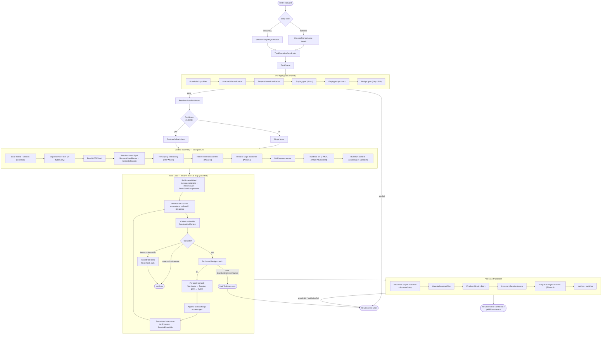
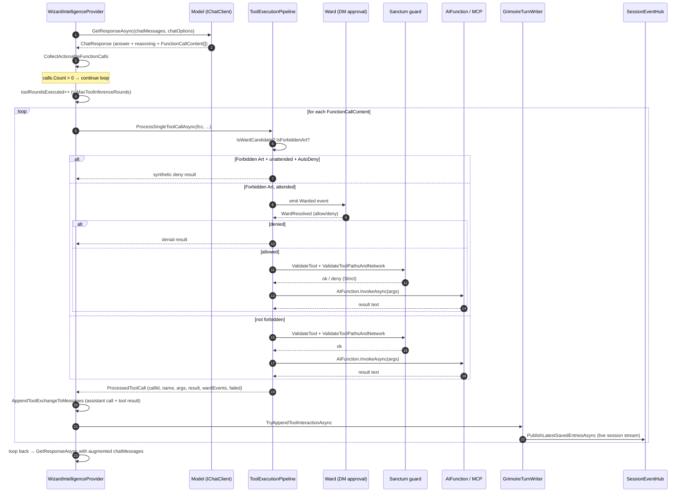

# Chat Loop Workflow

This document describes the **chat loop** — the end-to-end flow Arcanum runs for every inference turn, from HTTP entry through the iterative tool-call loop to response finalization. See [Arcanum.DESIGN.md §10](Arcanum.DESIGN.md#10-intelligence-pipeline) for the architecture authority and the [README naming metaphor](Arcanum.README.md#naming-metaphor) for the D&D terms used below (Wizard, Grimoire, Codex, Spell, Ward, Sanctum, Saga, The Weave, Session, Dungeon Master).

## Overview (TurnEngine + projections)

Phase 1 collapses the duplicated buffered/streaming orchestration into one logical-run owner:

```text
WizardIntelligenceProvider          thin IArcanumIntelligenceProvider facade
        ↓
TurnExecutionCoordinator            sole semantic consumer; one projection per request
        ↓
TurnEngine (producer)               logical run lifecycle (preflight, fallback, context,
                                    model/tool loop, validation, finalization)
        ↓
TurnEventEmitter                    ordered Channel<TurnEvent> (semantic, internal)
        ↓
Exactly one coordinator projection
  ├── BufferedTurnProjection → PromptTurnResult
  └── IntelligenceEventProjection → Channel<IntelligenceEvent> (production streams)
        ↓
HTTP writer
  ├── native NDJSON serialization
  └── production /v1 IntelligenceEvent → OpenAI SSE mapping

Semantic helper/characterization path (not the production /v1 instance):
  OpenAiSseProjection → Channel<OpenAiChatChunk>
```

`WizardIntelligenceProvider.ExecutePromptAsync` / `StreamPromptAsync` build a `TurnExecutionRequest` (including `HasIdempotencyKey` from `TurnIdempotencyAmbient`, never from the public `PingRequest` body) and delegate to `TurnExecutionCoordinator`. The coordinator consumes semantic `TurnEvent`s and applies exactly one projection; it does **not** serialize HTTP. Production `/v1` currently receives native `IntelligenceEvent` frames and reshapes them in the authoritative compatibility mapper in `OpenAiV1Endpoints`; it does not use the available `OpenAiSseProjection` instance path. The helper shares reasoning-field and typed-error rules only, while production endpoint tests own terminal usage and tool-fragmentation behavior. Keep-alives remain transport-only.

All turn-pipeline chat provider calls go through Core `IModelCallExecutor` (`ExecuteBufferedAsync` / `ExecuteStreamingAsync`), including main inference, tool continuation, structured-output retries, spell routing, and Lexicon extraction. Mode policy for tool failures is preserved: buffered uses `Arcanum:Intelligence:TolerateToolFailures`; streaming always suppresses invocation failures (ADR 0004).

There are two response shapes that share the same engine:

- **Buffered** — `BufferedTurnProjection` materializes `RunCompleted` into `Result<PromptTurnResult>`.
- **Streaming** — production routes use `IntelligenceEventProjection`; native endpoints serialize those frames as NDJSON and `/v1` maps the same typed frames to SSE. `OpenAiSseProjection` remains a separate semantic helper/characterization path for shared reasoning and error rules, not an exact wire-equivalent implementation.

Both run the same pre-flight gates, the same context assembly, and the same iterative tool-call loop. They diverge only at projection and at how the model call is consumed (buffered vs streaming executor APIs).

---

## 1. Overview diagram

The diagram below shows the full pipeline. The highlighted **Chat Loop** subgraph is the heart of this document: the bounded `while (true)` loop that calls the model, executes any tool calls, feeds the results back, and re-calls the model until it produces a final text answer.



---

## 2. Entry points

Five HTTP surfaces all funnel into the same `IArcanumIntelligenceProvider` contract:


| Surface | Method | Path | Calls |
|---|---|---|---|
| Buffered ping | `Intelligence/IntelligenceEndpoints.cs` `PostIntelligencePing` | `POST /intelligence/ping` | `ExecutePromptAsync` |
| Streaming ping | `Intelligence/IntelligenceEndpoints.cs` `PostIntelligencePingStream` | `POST /intelligence/ping-stream` | `InferenceExecuteWriter.WriteStreamAsync` (NDJSON) |
| Spell execute | `TheForge/SpellExecutionEndpoints.cs` `Spell_Execute` | `POST /spells/{name}/execute` | `ExecutePromptAsync` |
| Spell execute-stream | `TheForge/SpellExecutionEndpoints.cs` `Spell_ExecuteStream` | `POST /spells/{name}/execute-stream` | `InferenceExecuteWriter.WriteStreamAsync` |
| Prompt execute | `TheForge/PromptEndpoints.cs` | `POST /prompts/{id}/execute(-stream)` | both |
| OpenAI v1 chat (buffered) | `OpenAiV1Endpoints.cs` `HandleBufferedAsync` | `POST /v1/chat/completions` (non-stream) | `ExecutePromptAsync` |
| OpenAI v1 chat (streaming) | `OpenAiV1Endpoints.cs` `HandleStreamingAsync` | `POST /v1/chat/completions` (`stream:true`) | `StreamPromptAsync` → TurnExecutionCoordinator / TurnEngine (writer re-shapes to OpenAI SSE + keep-alives) |

The OpenAI v1 path first converts the request via `OpenAi/OpenAiChatCompletionMapper.cs` `ToPingRequest(...)` into a stateless `PingRequest` (`SessionId=null`, `UnattendedMode=true`, `StatelessMessages` populated).

`InferenceExecuteWriter.WriteStreamAsync` (`TheForge/InferenceExecuteWriter.cs`) is the NDJSON bridge for the native streaming endpoints: it sets `Content-Type: application/x-ndjson` and writes each `IntelligenceEvent` as one JSON line. The OpenAI v1 streaming path pumps `StreamPromptAsync` (same TurnEngine semantic source via the Wizard facade), re-shaping frames into OpenAI SSE chunks and interleaving keep-alive comments. Exact-byte idempotency capture remains in the HTTP/idempotency writer layer (ADR 0004 transport/replay boundary).

---

## 3. Pre-flight gates (shared)

Both `ExecutePromptAsync` and `StreamPromptAsync` run the **same sequence of gates** before any inference, in order:

1. **Guardrails input filter** — `FilterGuardrailsInputAsync` → `Guardrails/GuardrailsPipeline.cs` `FilterInputAsync`. Scans concatenated message text for PII (email/SSN/credit card/phone via source-generated regexes), toxicity blocklist, and topic allow/block regex lists. Returns `ErrorCodes.Guardrails.PiiDetected` or `ErrorCodes.Guardrails.Blocked` on hit. Pass-through when `Arcanum:Guardrails:Enabled` is false.
2. **Attached files validation** — `TryValidateAttachedFiles`.
3. **Request bounds validation** — `PingRequestBoundsValidator.Validate`.
4. **Scrying gate** — `ValidateScryingGate` — validates image foci attachments (size/count/MIME; vision-capable model). Session attachment **re-attach** (user `AttachmentReferences` and model `attach_session_file`) shares the same Scrying/`SupportsVision` gates for images; oversize images are rejected, never truncated. `MaxReferencesPerTurn` is a **combined** budget for user refs + model tool injections; each logical key+version injects **once** per turn.
5. **Empty prompt check** — skipped for stateless (`/v1`) message lists.
6. **Budget gate** — `BudgetMonitor.CheckAsync` (`Intelligence/BudgetMonitor.cs`). Prefers `IBudgetReservationService` → committed `BillableOperations` + outstanding `BudgetReservations` (ADR 0002); falls back to session-sum spend only when the reservation service is unavailable. Returns `ErrorCodes.Budget.Exceeded` (HTTP 429) when over the daily limit, and dispatches a Comm Link alert once per threshold per UTC day. `Sessions.TotalCostUsd` is a projection only.

After the gates, a linked `CancellationTokenSource` is built for the inference wall-clock timeout (`Arcanum:Intelligence:InferenceTimeoutSeconds`, default 600), and the chat client lease is resolved.

---

## 4. Provider resolution and fallback loop

`ChatClientFactory.ResolveClientAsync` (`Intelligence/ChatClientFactory.cs`) resolves `Arcanum:Providers` → `ProviderSettings` and builds an `OpenAI.ChatClient` for `OpenAICompatible` providers (including Ollama via `/v1`) over a named `HttpClient` whose pipeline is `OpenAiRequestAugmentingHandler` (injects `strict: true` for JSON-schema requests, retries once without `strict` on a provider 400).

The `ChatClientLease` owns the turn's `IChatClient`; `Dispose()` releases it. Prompt caching remains provider-managed and never bypasses model I/O. By default Arcanum injects nothing. A nullable provider/model `PromptCaching` profile may opt into the golden-tested root `prompt_cache_key` / `prompt_cache_retention` contract; enabling it is an operator assertion that the selected endpoint/model accepts those fields. Explicit content breakpoints are reserved and rejected in this build.

When `Arcanum:Resilience:Enabled` is true and an `IProviderHealthTracker` is configured, the buffered path enters `ExecutePromptWithFallbackAsync` — a **per-provider retry loop** (distinct from the tool loop). Only a **connectivity-classified** failure (`HttpRequestException`, `SocketException`, timeout-cancellation, etc.) falls back to the next healthy candidate. Model/auth/400/429/5xx errors do **not** fall back — they are surfaced immediately. The streaming analog retries only while the attempt is still **pre-commit** (`ProviderAttemptCommitTracker` / `classification.ProviderCommitted`): Status/SessionBound alone do not commit; the first provider text delta (including guardrail-buffered), actionable tool proposal, or empty successful round does. After commit, fallback is abandoned so a client never sees a mid-stream provider swap (ADR 0004).

---

## 5. Context assembly (once per turn)

Both modes of `RunInferenceAttemptAsync` (buffered and streaming) perform the same context-assembly sequence before entering the tool loop:

1. **Load thread** — `InferenceContextBuilder.LoadThreadAsync`. Returns `null` for stateless requests, otherwise loads the `Session` (with Entries) from the Grimoire.
2. **Begin Grimoire turn** — `GrimoireTurnWriter.TryBeginBufferedAssistantReplyAsync` / `TryBeginStreamedAssistantReplyAsync`. For stateful turns, inserts an in-flight assistant Entry and returns a `TurnHandle` tracking `(sessionId, assistantEntryId)` for finalize/discard.
3. **Read Codex** — `CodexReader.ReadCodexAsync` reads `CODEX.md` from the working directory (capped by `Arcanum:Codex:MaxSizeBytes`).
4. **Resolve routed Spell** — `ResolveRoutedSpellAsync`. Three branches: explicit `OverrideSpellPath` / `OverrideSpellName` (spell-version execute), or **semantic routing**. Semantic routing runs `SemanticSpellRouter` (Phase 5 embedding pre-filter: pure mode returns a `DirectResonance` pick with no LLM call; hybrid mode narrows to top-K candidates) and, unless it produced a direct resonance, falls through to `SemanticRouter.DetermineActiveSpellAsync` — an LLM preflight (optionally on `FastModel`) that asks the model to pick a Spell from the catalog. Time-bounded by `SemanticRouterPreflightTimeoutSeconds`; on timeout/exception returns null (no Spell).
5. **RAG query embedding** — `ResolveRagQueryEmbeddingAsync` embeds the probe once via `IWeaveService.EmbedAsync`; the embedding is shared by the next two steps.
6. **Semantic context retrieval** — `RetrieveSemanticContextAsync` (Phase 3 RAG) pulls `SemanticContextChunk[]` from The Weave.
7. **Saga memory retrieval** — `RetrieveSagaMemoriesAsync` (Phase 4 RAG) pulls `SagaMemory[]`.
8. **Build system prompt** — `SystemPromptBuilder.BuildDocument` assembles ordered stable/volatile DCI segments from Codex, active Spell, attached files, resonant dependency Spells (Arcane Resonance), semantic context, and Saga memories; `Render()` preserves the prior system text byte-for-byte.
9. **Build tool set** — `BuildToolSetWithMcpAsync`: built-in tools (`ArcanumLocalTimeTool`, `ArcanumSystemInfoTool`, `ArcanumSpellScriptTool` if script roots, `ArcanumBrowseWebTool` if `WebBrowsing.Enabled`) plus MCP tools from `IMcpConnectionManager`, then applies **Artifact Attunement** (a Spell's `declaredTools` allowlist). When `ForwardClientTools` is true, instead builds `ClientForwardedFunction` wrappers from the client-supplied tool definitions.
10. **Build turn context** — `BuildTurnContextAsync`: loads the `Campaign` by working-directory path, reads `RequireWardForForbiddenArts` and the `SanctumConfig`, applies tool policy filters, and strips `ask_human` unless `HumanInteractionAvailable` (streaming + attended + live HITL emitter). Buffered turns never advertise `ask_human`.

---

## 6. The Chat Loop — the iterative tool-call loop

This is the core of the workflow. `RunInferenceAttemptAsync` (shared by buffered and streaming via `TurnResponseMode`) contains **two nested `while (true)` loops**:

- **Outer loop** — normally runs once. It may `continue` once if the model rejects tools, but only while the provider attempt is uncommitted. Any answer content, visible or protected-only reasoning, complete actionable tool proposal, or successful empty round commits the attempt and prohibits this no-tools restart.
- **Inner loop — the chat loop** — the bounded tool-call loop. Each iteration is one inference round:

Each iteration of the inner loop:

1. **Build the materialized context + apply compression** (outer-loop body, once per outer iteration) — `InferenceContextBuilder.BuildInitialMeAiChatMessages` constructs history + prompt; the dynamic system prompt and rehydrated attachments are added; the final filtered `ChatOptions.Tools` and structured-output schema already exist. `TryApplyContextCompressionIfNeeded` measures this complete payload with the resolved model profile and may swap old Entries for `Session.Summary` (never deletes rows). Watermark/compact paths keep ToolCall/ToolResult halves paired.
2. **Context + reservation + turn-budget preflight** — before every provider call, including continuations: `EnsureContextBudget` builds a fresh `ContextTokenBreakdown` (all message/content sources, complete tool schemas, provider framing, separate answer/reasoning reserves), may trim oldest complete in-memory tool exchanges, and rejects overflow with `Hub.ContextBudgetExceeded`. `TurnAccountingHandle` atomically raises the USD reservation from the materialized input estimate; `IModelCallExecutor.TryBeginModelCall` enforces `Hub.TurnBudgetExceeded`.
3. **Call the model** — `IModelCallExecutor.ExecuteBufferedAsync` / `ExecuteStreamingAsync` is the sole chat I/O boundary. It validates and reuses the finalized preflight breakdown (or computes one for auxiliary callers without a precomputed value), validates the candidate-specific prompt-cache plan, records estimated-input/rejection metrics, and blocks an over-limit call. Eligible calls clone messages/options and compose the fixed cache adapter with reasoning; reusable turn state is unchanged. Streaming preserves the same root-field behavior. `TextContent` becomes answer text; `TextReasoningContent` becomes a distinct normalized reasoning update/result. Provider `ProtectedData` is retained only on the raw in-memory assistant content needed for same-provider tool continuation.
4. **Reconcile + accumulate usage** — provider `InputTokenCount` is attached to that call's breakdown with signed variance; it remains post-call authority and never overwrites the estimate. `AccumulateUsage` adds prompt/completion/provider-total/cached/reasoning counts across rounds. Reasoning is already a completion subset and cached input is already a prompt subset, so neither is added to totals. A present provider total is authoritative; only a missing total is derived from prompt + completion. Cache eligibility, observed hits/tokens, and potential/actual savings are recorded once here per completed provider call; the turn-final metrics path does not duplicate them.
5. **Collect actionable function calls** — `ToolExecutionPipeline.CollectActionableFunctionCalls(response)` walks `response.Messages` extracting `FunctionCallContent` items where `!InformationalOnly`.
6. **No tool calls → break** — the model produced a final text answer; exit the loop and proceed to finalization.
7. **Forward-client-tools branch** — when `ForwardClientTools=true`, the Wizard **does not execute** the calls server-side: it records them as `PromptToolCall`s, sets `finishReason=tool_calls`, and breaks so the OpenAI v1 layer can echo them back to the client for client-side execution.
8. **Tool round budget check** — increment `toolRoundsExecuted`; if it exceeds `MaxToolInferenceRounds`, return `ErrorCodes.Hub.ToolLoop`.
9. **Execute each tool call** — `toolExecutionPipeline.ProcessSingleToolCallAsync(...)` runs the Ward + Sanctum gate sequence (see §7) and invokes the `AIFunction`. Results are token-budget materialized for the model. The result is appended to `observedToolCalls` and the audit context.
10. **Append tool exchange to messages** — `ToolExecutionPipeline.AppendToolExchangeToMessages` adds an assistant message containing the `FunctionCallContent` (with normalized call id), any raw `TextReasoningContent` from that provider round, and a tool message containing `FunctionResultContent(callId, resultText)`. This is the feedback that feeds the next inference round. Raw reasoning never crosses to a fallback provider and exists only for this same-provider continuation.
11. **Persist tool interaction to Grimoire** — `grimoireTurnWriter.TryAppendToolInteractionAsync` persists only the tool interaction and publishes recent Entries to `SessionEventHub`; raw or client-safe reasoning is never written to Grimoire.
12. **Loop back to step 2** — the updated `chatMessages` (now including the assistant tool call + tool result) gets a new breakdown and admission decision; the initial count is never reused. The model either produces more tool calls (loop continues) or a final text answer (loop breaks at step 6). Step 10 is what makes this a loop rather than a single call.

### 6.1 Sequence diagram for a single tool round

The sequence below shows one iteration of the inner loop with two tool calls. The loop repeats this block until the model returns no `FunctionCallContent`.



---

## 7. Tool execution — Ward + Sanctum gates

`ToolExecutionPipeline.ProcessSingleToolCallAsync` delegates to `ExecuteToolCallWithWardAsync`. Gate order:

1. **Unattended auto-deny** — if the tool is a Ward candidate (`RequiresWardForTool`: Ward enabled + tool in `Arcanum:Ward:ForbiddenArts`; `execute_command` always requires Ward, others only if `CampaignRequiresWard`) and `UnattendedMode && AutoDenyInUnattendedMode`, return a synthetic deny result (no operator available).
2. **Not a Forbidden Art → skip Ward, go straight to Sanctum** — `InvokeToolCallWithSanctumAsync`.
3. **Forbidden Art → Ward round-trip** — emits a `Warded` IntelligenceEvent (so the streaming client sees the approval prompt), calls `IWard.WardAsync(wardId, toolName, args, sessionId, timeout)` which blocks for operator (DM) resolution via the Comm Link / `petition_dungeon_master` flow, emits a `WardResolved` event, then either returns a denial or proceeds to `InvokeToolCallWithSanctumAsync`.

`InvokeToolCallWithSanctumAsync` → `EnforceSanctumAsync`: if the Campaign has Sanctum enabled, `ISanctumGuard.ValidateToolAsync` (tool allowlist) then `ValidateToolPathsAndNetworkAsync` (validates paths/network per tool kind — `execute_command` cwd, `write_file`/`read_file_chunk` relativePath, `run_spell_script` script paths across resonant roots, `send_commlink_alert`/`use_commlink`/`petition_dungeon_master` webhook URL, `browse_web` URL). In `SanctumMode.Strict` a denial returns a synthetic result string; otherwise the tool runs anyway.

Finally `InvokeToolCallAsync` resolves the `AIFunction` from `chatOptions.Tools` by name and calls `func.InvokeAsync(args, ct)`. The result is stringified.

**Failure handling:** when `suppressInvocationFailures` is true (the streaming path always passes `true`; the buffered path passes `Arcanum:Intelligence:TolerateToolFailures`), an exception is caught, logged, and a synthetic `PublicToolFailureMessage(toolName)` result is returned to the model so the turn continues. When false, the exception is rethrown and fails the whole buffered turn.

---

## 8. Streaming path structure

The streaming branch of `RunInferenceAttemptAsync` uses `IAsyncEnumerable<IntelligenceEvent>` yield semantics over the same loop. It has **three nested loops**:

- **Outer `while (true)`** — the "model doesn't support tools" restart; normally runs once.
- **Middle `while (true)`** — the streaming tool-call loop; each iteration is one streaming inference round (analogous to the buffered inner loop).
- **Inner `while (true)`** — the chunk pump. Consumes `IModelCallExecutor.ExecuteStreamingAsync(...)` semantic updates. `ModelCallTextDelta` appends only to `streamAccumulator` and may yield `Token`; `ModelCallReasoningUpdate` appends only to the ephemeral reasoning accumulator and may yield the typed `Reasoning` frame. Raw response updates (tool calls, usage, finish reason, and provider-protected reasoning needed for continuation) are collected into `roundUpdates`. The first explicit reasoning update commits the provider before any projection, including protected-only reasoning or reasoning withheld from the client.

Per streaming round: stream chunks → combine `roundUpdates.ToChatResponse()` → accumulate usage → collect tool calls → (no calls → break with finish reason; forward-client-tools → yield `ToolCall` events and break; else increment `streamToolRoundCount`, and for each call yield a `ToolCall` event, run `ProcessSingleToolCallAsync` with `suppressInvocationFailures: true`, yield any `Warded`/`WardResolved` events, yield `ToolError` if the tool failed, yield `ToolResult`, append the exchange to `chatMessages`, persist to Grimoire) → loop back to a fresh `IModelCallExecutor.ExecuteStreamingAsync`.

**Streaming guardrails/strict modes** — `Guardrails.StreamingMode` defaults to **`buffered`** (`GuardrailsStreamingMode.Buffered`); explicit **`passthrough`** is honored with a configuration warning (ADR 0001). Buffered guardrails and strict JSON-schema output set `bufferTokens=true`, withholding both answer and reasoning frames while preserving their relative runs. Safety inspection scans the final answer plus projectable reasoning. On success the buffered runs are released in order; on rejection none are released. Provider commitment still occurs on the raw answer/reasoning update, before this visibility decision. Passthrough can expose content before the post-hoc filter and retains the explicit leakage warning.

---

## 9. Post-loop finalization (both paths)

After the tool loop breaks with a final text answer:

**Buffered** (`RunInferenceAttemptAsync` with `TurnResponseMode.Buffered`):

1. **Structured output validation** — when `ResponseFormat=="json_schema"` and `StructuredOutput.Enabled`, `StructuredOutputValidator.ValidateAndRetryAsync` can re-prompt the model with an error message up to `MaxValidationRetries` times (a bounded retry loop inside finalization). Validation consumes answer text only. Each corrective call replaces both the rejected answer and its ephemeral reasoning; only the accepted replacement is eligible for projection.
2. **Guardrails output filter** — `FilterGuardrailsOutputAsync` → `GuardrailsPipeline.FilterOutputAsync`. Scans the accepted answer plus projectable reasoning for toxicity/blocked topics (not PII — that was input-only). On failure, the Grimoire turn is resolved as interrupted and the turn fails without exposing buffered output.
3. **Grimoire finalize** — `grimoireTurnWriter.TryFinalizeBufferedAssistantEntryAsync` → `grimoire.FinalizeAssistantEntryAsync(entryId, finalText)`. Publishes the finalized answer-only Entry to `SessionEventHub`; reasoning is never persisted.
4. **Session token increment** — `TryIncrementSessionTokensAsync`.
5. **Saga extraction enqueue** — `TryEnqueueSagaExtraction` — background service extracts Saga memories from the turn.
6. **Metrics + audit logging** — reported usage remains the spend/session authority; per-call context breakdowns (including estimate quality and optional reported variance) are retained in successful inference audit records and exposed to native telemetry clients.
7. **Return** `PromptTurnResult(finalText, accumulatedUsage, observedToolCalls, finishReason)` with a separate ordered `Reasoning` segment list.

**Streaming** (`RunInferenceAttemptAsync` with `TurnResponseMode.Streaming`): mirrors the above but yields events. Best-effort structured output validates post-hoc without retry. Strict mode with `MaxValidationRetries > 0` uses bounded **buffered replacement calls** through `ValidateAndRetryAsync`; it clears rejected answer/reasoning runs and releases only the accepted replacement after validation and guardrails. Strict mode with zero retries still withholds and fails post-hoc. Failure yields `Error` and no terminal `Result`; success releases buffered `Reasoning`/`Token` runs in order, then yields `Result` with usage, finish reason, and warnings. A `finally` block calls `TryResolveInterruptedOnStreamExitAsync` so the Grimoire turn is never left in-flight if the enumerator is abandoned.

---

## 10. Streaming wire contract — the `IntelligenceEvent` sequence

The sequence of events a streaming client sees for a typical multi-round tool turn (native NDJSON):

1. `Status` — "Mage is generating response..."
2. `SessionBound` — (if stateful) the resolved Session id
3. `ConversationBound` — (if stateful) the conversation anchor
4. `Status` — memory compression notice (if compression ran)
5. **For each tool round:**
   - `Context` — pre-call model/profile quality, source rows, estimated input, safety margin, and answer/reasoning reserves. When provider usage arrives, an updated frame for the same call adds reported input and signed variance. OpenAI SSE filters this Arcanum-native diagnostic frame.
   - `Reasoning` / `Token` × N — typed client-safe reasoning and answer chunks in provider order. Reasoning payload is `{ text, output }`; it never appears in token `data`. Frames are withheld together when `bufferTokens`.
   - **For each tool call in the round:**
     - `ToolCall` — name + args
     - `Warded` — (only if the Ward gate triggers) approval prompt to the DM
     - `WardResolved` — (only if the Ward gate triggers) allow/deny + reason
     - `ToolError` — (only if the tool failed and was tolerated)
     - `ToolResult` — the stringified result returned to the model
     - *(session attachments)* after **all** tool results in the round are appended, a **successful** `attach_session_file` (`!Failed && !Denied`) queues untrusted-framed `TextContent`/`DataContent` for the **next** round (budget/inject-once consumed only after materialization; images need Scrying + vision; Ward/Sanctum denial and post-process failures do not inject)
6. (loop repeats with more `Token`s for the next round)
7. `Result` — terminal: accumulated answer text in `result.message`, the legacy total-token string in `result.data`, plus typed usage, finish reason, and warnings
8. Or `Error` — terminal: inference error, guardrails rejection, or validation failure

The **session live-stream** (`/sessions/{id}/stream`) is a **separate, independent SSE channel** — it replays recent Entries then pumps `SessionEventHub` for live Entry additions. The Grimoire turn writer publishes to this hub on begin/finalize/tool-interaction, so a UI watching a Session sees assistant Entries and tool interactions appear in real time, decoupled from the inference stream.

---

## 11. Loop points summary

| # | Loop | Location | Purpose | Termination |
|---|---|---|---|---|
| 1 | Provider fallback | `WizardIntelligenceProvider.ExecutePromptWithFallbackAsync` (buffered) and the streaming analog | Retry the next healthy provider on a **pre-commit** connectivity failure | First provider commitment, success, non-connectivity error, or `MaxFallbackAttempts` exhausted |
| 2 | Outer "no tools" restart | `RunInferenceAttemptAsync` outer `while (true)` | Retry inference without tools only if the model rejects them **before commitment** | Runs at most once; any answer/reasoning/tool/empty-success commitment prohibits restart |
| 3 | **Tool-call loop** | `RunInferenceAttemptAsync` inner `while (true)` | Model → tool calls → execute → append → re-inference (mode branches for buffered vs streaming I/O and events) | `calls.Count==0` (final answer), `MaxToolInferenceRounds` exceeded, or client-tool-forward break |
| 4 | Chunk pump (streaming) | `RunInferenceAttemptAsync` streaming branch innermost `while (true)` | Consume `IModelCallExecutor.ExecuteStreamingAsync` updates | `!hasNext` or read error |
| 5 | _(removed)_ | — | Streaming tool loop is the same as #3 (`TurnResponseMode`) | — |
| 6 | Structured output retry | `StructuredOutputValidator.ValidateAndRetryAsync` callback | Re-prompt model on JSON Schema validation failure | Schema valid or `MaxValidationRetries` |
| 7 | Tool round budget check | `toolRoundsExecuted > maxToolRounds` | Hard cap on tool iterations | `ErrorCodes.Hub.ToolLoop` |

The **core chat loop** is #3: `IModelCallExecutor` → separate answer/reasoning updates → `CollectActionableFunctionCalls` → if 0 calls, break to finalization; else for each call `ProcessSingleToolCallAsync` (Ward → Sanctum → invoke) → `AppendToolExchangeToMessages` (including raw same-provider reasoning only) → `TryAppendToolInteractionAsync` (answer/tool persistence only) → loop back with the augmented message list. The bounded retry (#6) and pre-commit provider fallback (#1) are outer loops around this core.

---

## 12. Key configuration knobs

All of these live under `Arcanum:` in `arcanum.json` and have runtime clamps in `ArcanumSettingClamps`. See [Arcanum.DESIGN.md §3.4](Arcanum.DESIGN.md#34-configuration-reference-arcanumsettings) for the full reference.

| Setting | Default | Effect on the chat loop |
|---|---|---|
| `Intelligence:MaxToolInferenceRounds` | 8 | Hard cap on tool-call iterations before `Hub.ToolLoop` |
| `Intelligence:InferenceTimeoutSeconds` | 600 | Wall-clock cap per inference turn (linked `CancellationTokenSource`) |
| `Intelligence:TolerateToolFailures` | true | When true, a tool exception is synthesized into a result and the buffered turn continues; when false, it fails the buffered turn. Streaming always tolerates tool invocation failures (mode policy; ADR 0004). |
| `Resilience:Enabled` | false | Gates the provider fallback loop (#1) |
| `Resilience:MaxFallbackAttempts` | 3 | Bounds candidates tried per turn |
| `StructuredOutput:MaxValidationRetries` | 2 | Bounds the structured-output retry loop (#6) |
| `Guardrails:Enabled` | false | Gates input + output guardrails filters |
| `Guardrails:StreamingMode` | buffered | `buffered` holds tokens until after the output filter; `passthrough` emits real-time tokens then post-hoc filter |
| `Budget:Enabled` | false | Gates the daily-USD budget gate (HTTP 429; BillableOperations + reservations) |
| `Embeddings:SemanticSpellRoutingEnabled` | false | Gates the Phase 5 embedding-based Spell routing pre-filter |
| `Ward:AutoDenyInUnattendedMode` | — | Unattended auto-deny for Forbidden Arts in the Ward gate |
