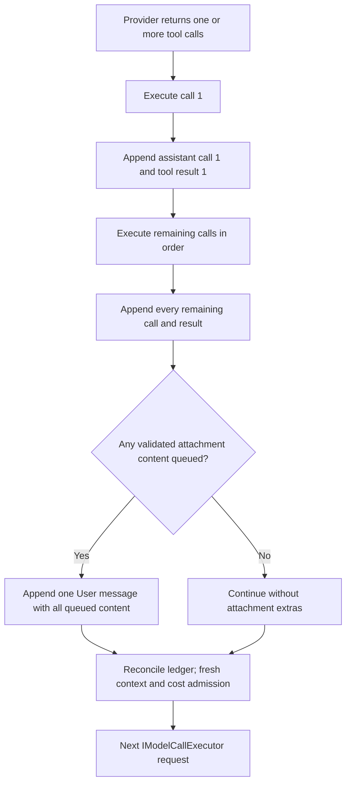

# Arcanum chat loop and attachment continuation ordering

This document is the focused companion to `Arcanum.DESIGN.md` §10.7. It describes the one shared
buffered/streaming model-tool loop and the ordering contract for attachment content.

## 6. One logical turn, multiple provider requests

A tool response cannot change the provider request that produced the tool call. “Refresh in the
current message” therefore means refresh during the same logical Arcanum turn and include the
content in that turn's next provider request. Every call still passes through `IModelCallExecutor`;
there is no second inference path.

```mermaid
sequenceDiagram
    participant Model
    participant Loop as Shared tool loop
    participant Tool as refresh_session_file
    participant Store as Attachment store
    Model->>Loop: tool call (attachmentId or logicalKey)
    Loop->>Tool: Ward then Sanctum then invoke
    Tool-->>Loop: selector acknowledgement
    Loop->>Store: secure source read and persist/reuse
    Store-->>Loop: version plus current bytes metadata
    Loop->>Loop: append assistant call and tool result
    Loop->>Loop: after all round results, append queued content
    Loop->>Model: next admitted request in same logical turn
```

## 7. Refresh security and persistence

`refresh_session_file` accepts exactly one attachment selector and never a filesystem path. The host
supplies session, turn-visible IDs, model, campaign, and assistant Entry. Logical keys match
case-insensitively but fail if that would select more than one case-distinct key.

The latest Bound version must carry verified workspace provenance. The resolver checks workspace
identity, lexical and canonical containment, unchanged symlink target, path/open-handle identity,
and Sanctum against the actual canonical path. Bytes come from the verified handle under the text
or image size cap. Two complete handle reads must have identical SHA-256 hashes. MIME, strict UTF-8
for text, Scrying allowlists, and model vision capability are reapplied.

An unchanged hash reuses the latest row and encrypted blob. Changed bytes create the next version
under the existing per-session/per-logical-key locks and `MaxBytesPerSession` /
`MaxVersionsPerLogicalKey` limits. The original user Entry is never changed; a new version may bind
to the current assistant Entry.

When semantic attachment retrieval is enabled, a newly created Bound refresh version is also
offered to the bounded background indexing queue. This happens after durable persistence and does
not change the tool result or injection ordering. Queue overflow or embedding failure is recovery
work only: it records/delays indexing and never fails the logical turn. Default retrieval on later
turns uses only the newest Bound version for each logical key in the same session; older indexed
versions remain available only through explicit historical search.

## 5.1 Unified per-turn materialization ledger

The logical turn owns exactly one in-memory `ContextMaterializationLedger`; buffered and streaming
paths use the same instance and the same model/tool loop. Its stable key combines source kind,
opaque source id, version/content hash, and whole/chunk range. It records origin, label, hash,
estimated tokens, bytes, trust, injected state, and provider round for current attachments,
attachment references, context pins, `attach_session_file`, `refresh_session_file`, attachment RAG,
workspace RAG, and Saga.

Admission order is explicit-first: current attachment → attachment reference → context pin → model
attach → model refresh → attachment RAG → workspace RAG → Saga. Attachment semantic limits are
chunks, represented attachments, UTF-8 bytes, estimated tokens, and similarity. Identical
content/ranges are injected once. A whole explicit version removes same-version semantic chunks; a
refresh also removes older versions before the next provider call. Failed materialization does not
enter the ledger, and turn finalization clears it.

Initial DATA ordering is `Attached Files for this Turn` → `Retrieved Session Attachment Context` →
`Session Attachments Index` → workspace semantic context. Every retrieved chunk includes sanitized
filename, logical key, version, opaque attachment id, character/line range, hash, an explicit
untrusted-DATA warning, and an adaptive fence.

## 8. Transcript and injection order

For a model response containing several calls, Arcanum appends every assistant-call/tool-result pair
first. Successful `attach_session_file` and `refresh_session_file` materializations accumulate in a
pending list. Only after the loop has appended the last result does it add one User message carrying
the queued `TextContent` / `DataContent`.



The shared `MaxReferencesPerTurn` budget includes explicit references and both model tools. A logical
key/version is injected once per turn. Refreshed text is framed as untrusted DATA with an adaptive
fence and a hardened label containing filename, logical key, version, and source freshness. Images
pair an untrusted notice with `DataContent` and are never truncated.

Expected unsafe/unavailable cases return a structured tool result and no content. Unexpected
post-processing exceptions follow the shared mode policy: streaming invocation failures are
tolerated with `toolError` plus a synthetic result, while buffered behavior follows
`TolerateToolFailures`. Before every provider call, including structured-output correction, context
admission drops Saga, workspace RAG, then attachment RAG before complete tool exchanges; explicit
accepted files are never dropped and overflow returns `Hub.ContextBudgetExceeded`. A successful refresh emits native `attachmentRefreshed` observability after
its `toolResult`; OpenAI projections ignore that native-only event.

## 12. Command Center context UI rendering

Command Center treats attachment state as a backend projection, not a client inference. The
`/attachments` list renders `[Snapshot]` for snapshot-only rows, `[Live]` only for a tracked row whose
revalidated status is `Refreshable`, and `[Stale]` for drift, missing/inaccessible source, changed
workspace, unsafe provenance, or corrupt metadata. Every row shows the bound version and its
`ContentSha256`, which identifies the bytes currently available to model context. Tracked rows also
show the last backend-observed disk hash and write timestamp.

One recursive, debounced `FileSystemWatcher` watches the active Command Center working directory.
Create/change/delete/rename events are invalidation hints only: the monitor calls
`GET /api/sessions/{id}/attachments`, and that endpoint revalidates stored provenance before returning
DTOs. The UI never reads or hashes the source and never changes Stale to Live from a watcher event.

`/attachments refresh <logicalName>` resolves the latest backend row and posts its opaque attachment
id to `/api/sessions/{id}/attachments/{attachmentId}/refresh`. The endpoint invokes the same secure
refresh core used after `refresh_session_file`; it rechecks Sanctum and source identity, persists or
reuses the verified version, and returns the sanitized `AttachmentRefreshEvent`. Because this is an
operator action outside a model round, no content injection is queued. Command Center reports Live
only from that successful response.
