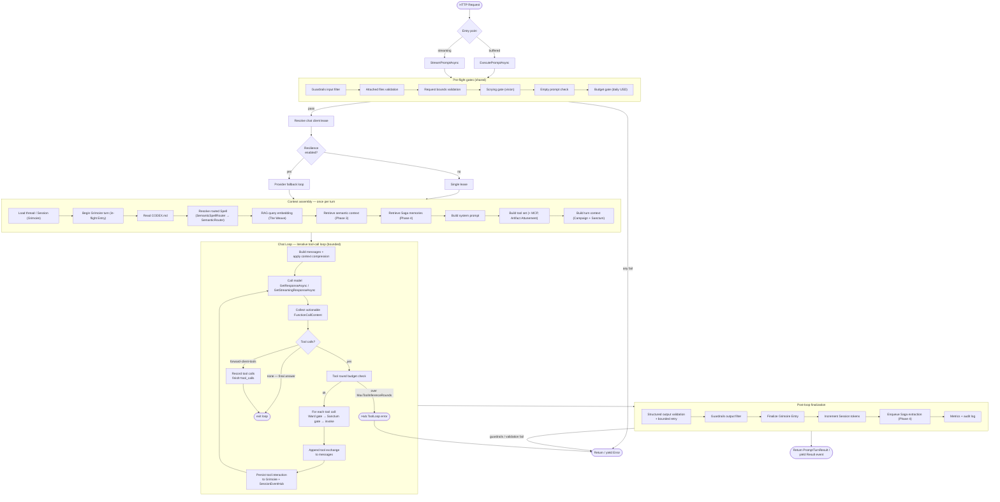
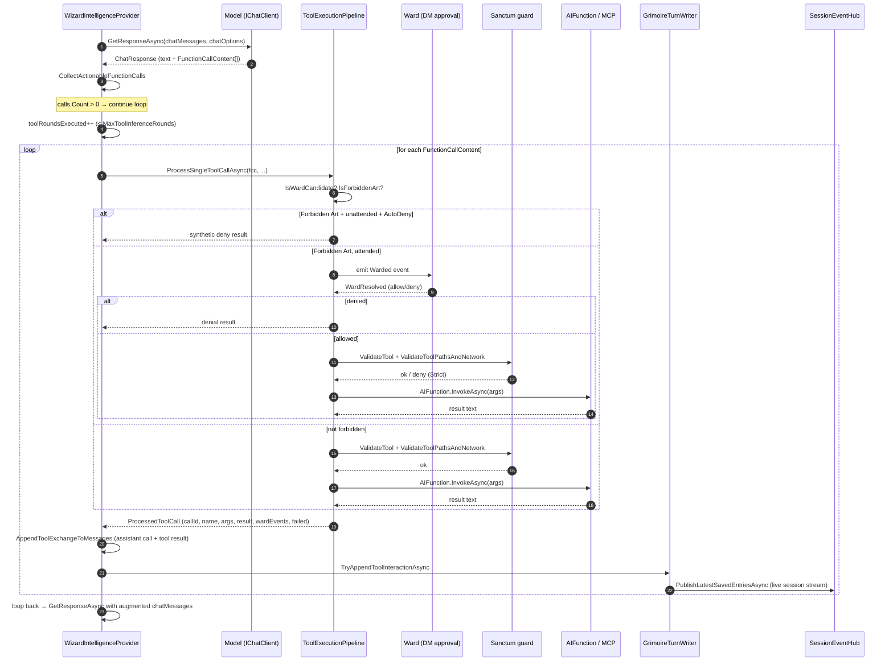

# Chat Loop Workflow

This document describes the **chat loop** — the end-to-end flow Arcanum runs for every inference turn, from HTTP entry through the iterative tool-call loop to response finalization. The orchestrator is the **Wizard** (`WizardIntelligenceProvider`, which implements `IArcanumIntelligenceProvider`). See [Arcanum.DESIGN.md §10](Arcanum.DESIGN.md#10-intelligence-pipeline) for the architecture authority and the [README naming metaphor](Arcanum.README.md#naming-metaphor) for the D&D terms used below (Wizard, Grimoire, Codex, Spell, Ward, Sanctum, Saga, The Weave, Session, Dungeon Master).

There are two parallel shapes that share most of the pipeline:

- **Buffered** — `ExecutePromptAsync` returns a single `Result<PromptTurnResult>` after the whole turn completes.
- **Streaming** — `StreamPromptAsync` yields `IntelligenceEvent`s as an `IAsyncEnumerable` while the turn runs.

Both run the same pre-flight gates, the same context assembly, and the same iterative tool-call loop. They diverge only at the model call (`GetResponseAsync` vs. `GetStreamingResponseAsync`) and at how results are emitted.

---

## 1. Overview diagram

The diagram below shows the full pipeline. The highlighted **Chat Loop** subgraph is the heart of this document: the bounded `while (true)` loop that calls the model, executes any tool calls, feeds the results back, and re-calls the model until it produces a final text answer.

---

## 2. Entry points

Five HTTP surfaces all funnel into the same `IArcanumIntelligenceProvider` contract:

| Surface | Method | Path | Calls |
|---|---|---|---|
| Buffered ping | `Intelligence/IntelligenceEndpoints.cs` `PostIntelligencePing` | `POST /intelligence/ping` | `ExecutePromptAsync` |
| Streaming ping | `Intelligence/IntelligenceEndpoints.cs` `PostIntelligencePingStream` | `POST /intelligence/ping-stream` | `InferenceExecuteWriter.WriteStreamAsync` (NDJSON) |
| Spell execute | `TheForge/SpellExecutionEndpoints.cs` `Spell_Execute` | `POST /spells/{name}/execute` | `ExecutePromptAsync` |
| Spell execute-stream | `TheForge/SpellExecutionEndpoints.cs` `Spell_ExecuteStream` | `POST /spells/{name}/execute-stream` | `InferenceExecuteWriter.WriteStreamAsync` |
| Prompt execute | `TheForge/PromptEndpoints.cs` | `POST /prompts/{id}/execute(-stream)` | both |
| OpenAI v1 chat (buffered) | `OpenAiV1Endpoints.cs` `HandleBufferedAsync` | `POST /v1/chat/completions` (non-stream) | `ExecutePromptAsync` |
| OpenAI v1 chat (streaming) | `OpenAiV1Endpoints.cs` `HandleStreamingAsync` | `POST /v1/chat/completions` (`stream:true`) | `StreamPromptAsync` (re-shaped to OpenAI SSE) |

The OpenAI v1 path first converts the request via `OpenAi/OpenAiChatCompletionMapper.cs` `ToPingRequest(...)` into a stateless `PingRequest` (`SessionId=null`, `UnattendedMode=true`, `StatelessMessages` populated).

`InferenceExecuteWriter.WriteStreamAsync` (`TheForge/InferenceExecuteWriter.cs`) is the NDJSON bridge for the native streaming endpoints: it sets `Content-Type: application/x-ndjson` and writes each `IntelligenceEvent` as one JSON line. The OpenAI v1 streaming path is different — it manually pumps the enumerator, re-shaping each `IntelligenceEvent` into OpenAI SSE chunks and interleaving keep-alive comments.

---

## 3. Pre-flight gates (shared)

Both `ExecutePromptAsync` and `StreamPromptAsync` run the **same sequence of gates** before any inference, in order:

1. **Guardrails input filter** — `FilterGuardrailsInputAsync` → `Guardrails/GuardrailsPipeline.cs` `FilterInputAsync`. Scans concatenated message text for PII (email/SSN/credit card/phone via source-generated regexes), toxicity blocklist, and topic allow/block regex lists. Returns `ErrorCodes.Guardrails.PiiDetected` or `ErrorCodes.Guardrails.Blocked` on hit. Pass-through when `Arcanum:Guardrails:Enabled` is false.
2. **Attached files validation** — `TryValidateAttachedFiles`.
3. **Request bounds validation** — `PingRequestBoundsValidator.Validate`.
4. **Scrying gate** — `ValidateScryingGate` — validates image foci attachments (size/count/MIME; vision-capable model). Session attachment **re-attach** (user `AttachmentReferences` and model `attach_session_file`) shares the same Scrying/`SupportsVision` gates for images; oversize images are rejected, never truncated. `MaxReferencesPerTurn` is a **combined** budget for user refs + model tool injections; each logical key+version injects **once** per turn.
5. **Empty prompt check** — skipped for stateless (`/v1`) message lists.
6. **Budget gate** — `BudgetMonitor.CheckAsync` (`Intelligence/BudgetMonitor.cs`). Reads today's USD spend from the Grimoire; returns `ErrorCodes.Budget.Exceeded` (HTTP 429) when over the daily limit, and dispatches a Comm Link alert once per threshold per UTC day.

After the gates, a linked `CancellationTokenSource` is built for the inference wall-clock timeout (`Arcanum:Intelligence:InferenceTimeoutSeconds`, default 600), and the chat client lease is resolved.

---

## 4. Provider resolution and fallback loop

`ChatClientFactory.ResolveClientAsync` (`Intelligence/ChatClientFactory.cs`) resolves `Arcanum:Providers` → `ProviderSettings` and builds an `OpenAI.ChatClient` for `OpenAICompatible` providers (including Ollama via `/v1`) over a named `HttpClient` whose pipeline is `OpenAiRequestAugmentingHandler` (injects `strict: true` for JSON-schema requests, retries once without `strict` on a provider 400).

The `ChatClientLease` owns the turn's `IChatClient`; `Dispose()` releases it. Prompt caching is provider-managed; Arcanum does not inject provider-specific cache request fields.

When `Arcanum:Resilience:Enabled` is true and an `IProviderHealthTracker` is configured, the buffered path enters `ExecutePromptWithFallbackAsync` — a **per-provider retry loop** (distinct from the tool loop). Only a **connectivity-classified** failure (`HttpRequestException`, `SocketException`, timeout-cancellation, etc.) falls back to the next healthy candidate. Model/auth/400/429/5xx errors do **not** fall back — they are surfaced immediately. The streaming analog has the same loop but only retries if the *first* event is a connectivity error; once any real content has streamed, fallback is abandoned so a client never sees a mid-stream provider swap.

---

## 5. Context assembly (once per turn)

Both `AttemptBufferedInferenceAsync` (buffered) and `StreamCommittedInferenceAsync` (streaming) perform the same context-assembly sequence before entering the tool loop:

1. **Load thread** — `InferenceContextBuilder.LoadThreadAsync`. Returns `null` for stateless requests, otherwise loads the `Session` (with Entries) from the Grimoire.
2. **Begin Grimoire turn** — `GrimoireTurnWriter.TryBeginBufferedAssistantReplyAsync` / `TryBeginStreamedAssistantReplyAsync`. For stateful turns, inserts an in-flight assistant Entry and returns a `TurnHandle` tracking `(sessionId, assistantEntryId)` for finalize/discard.
3. **Read Codex** — `CodexReader.ReadCodexAsync` reads `CODEX.md` from the working directory (capped by `Arcanum:Codex:MaxSizeBytes`).
4. **Resolve routed Spell** — `ResolveRoutedSpellAsync`. Three branches: explicit `OverrideSpellPath` / `OverrideSpellName` (spell-version execute), or **semantic routing**. Semantic routing runs `SemanticSpellRouter` (Phase 5 embedding pre-filter: pure mode returns a `DirectResonance` pick with no LLM call; hybrid mode narrows to top-K candidates) and, unless it produced a direct resonance, falls through to `SemanticRouter.DetermineActiveSpellAsync` — an LLM preflight (optionally on `FastModel`) that asks the model to pick a Spell from the catalog. Time-bounded by `SemanticRouterPreflightTimeoutSeconds`; on timeout/exception returns null (no Spell).
5. **RAG query embedding** — `ResolveRagQueryEmbeddingAsync` embeds the probe once via `IWeaveService.EmbedAsync`; the embedding is shared by the next two steps.
6. **Semantic context retrieval** — `RetrieveSemanticContextAsync` (Phase 3 RAG) pulls `SemanticContextChunk[]` from The Weave.
7. **Saga memory retrieval** — `RetrieveSagaMemoriesAsync` (Phase 4 RAG) pulls `SagaMemory[]`.
8. **Build system prompt** — `SystemPromptBuilder.Build` assembles the dynamic system message from Codex, active Spell, attached files, resonant dependency Spells (Arcane Resonance), semantic context, and Saga memories.
9. **Build tool set** — `BuildToolSetWithMcpAsync`: built-in tools (`ArcanumLocalTimeTool`, `ArcanumSystemInfoTool`, `ArcanumSpellScriptTool` if script roots, `ArcanumBrowseWebTool` if `WebBrowsing.Enabled`) plus MCP tools from `IMcpConnectionManager`, then applies **Artifact Attunement** (a Spell's `declaredTools` allowlist). When `ForwardClientTools` is true, instead builds `ClientForwardedFunction` wrappers from the client-supplied tool definitions.
10. **Build turn context** — `BuildTurnContextAsync`: loads the `Campaign` by working-directory path, reads `RequireWardForForbiddenArts` and the `SanctumConfig`, applies tool policy filters, and strips `ask_human` unless `HumanInteractionAvailable` (streaming + attended + live HITL emitter). Buffered turns never advertise `ask_human`.

---

## 6. The Chat Loop — the iterative tool-call loop

This is the core of the workflow. `AttemptBufferedInferenceAsync` contains **two nested `while (true)` loops**:

- **Outer loop** — normally runs once. Only `continue`s if the model throws an exception that looks like "model does not support tools"; then it rebuilds `chatOptions` without tools and retries inference once.
- **Inner loop — the chat loop** — the bounded tool-call loop. Each iteration is one inference round:

Each iteration of the inner loop:

1. **Build messages + apply context compression** (outer-loop body, once per outer iteration) — `InferenceContextBuilder.BuildInitialMeAiChatMessages` constructs the message list from the thread + prompt; the dynamic system prompt is prepended; `TryApplyContextCompressionIfNeeded` may swap old Entries for a `Session.Summary` near the context limit (read-time compression — never deletes rows).
2. **Call the model** — `chatClient.GetResponseAsync(chatMessages, chatOptions, inferenceToken)` (buffered) or `chatClient.GetStreamingResponseAsync(...)` (streaming).
3. **Accumulate usage** — `AccumulateUsage` adds prompt/completion/total tokens across rounds.
4. **Collect actionable function calls** — `ToolExecutionPipeline.CollectActionableFunctionCalls(response)` walks `response.Messages` extracting `FunctionCallContent` items where `!InformationalOnly`.
5. **No tool calls → break** — the model produced a final text answer; exit the loop and proceed to finalization.
6. **Forward-client-tools branch** — when `ForwardClientTools=true`, the Wizard **does not execute** the calls server-side: it records them as `PromptToolCall`s, sets `finishReason=tool_calls`, and breaks so the OpenAI v1 layer can echo them back to the client for client-side execution.
7. **Tool round budget check** — increment `toolRoundsExecuted`; if it exceeds `MaxToolInferenceRounds`, return `ErrorCodes.Hub.ToolLoop`.
8. **Execute each tool call** — `toolExecutionPipeline.ProcessSingleToolCallAsync(...)` runs the Ward + Sanctum gate sequence (see §7) and invokes the `AIFunction`. The result is appended to `observedToolCalls` and the audit context.
9. **Append tool exchange to messages** — `ToolExecutionPipeline.AppendToolExchangeToMessages` adds an assistant message containing the `FunctionCallContent` (with normalized call id) and a tool message containing `FunctionResultContent(callId, resultText)`. **This is the feedback that feeds the next inference round.**
10. **Persist tool interaction to Grimoire** — `grimoireTurnWriter.TryAppendToolInteractionAsync` calls `grimoire.AppendToolInteractionAsync` then publishes recent Entries to `SessionEventHub`, so `/sessions/{id}/stream` subscribers see the tool interaction appear live.
11. **Loop back to step 2** — the updated `chatMessages` (now including the assistant tool call + tool result) is sent to the model again. The model either produces more tool calls (loop continues) or a final text answer (loop breaks at step 5). Step 9 is what makes this a loop rather than a single call.

### 6.1 Sequence diagram for a single tool round

The sequence below shows one iteration of the inner loop with two tool calls. The loop repeats this block until the model returns no `FunctionCallContent`.

---

## 7. Tool execution — Ward + Sanctum gates

`ToolExecutionPipeline.ProcessSingleToolCallAsync` delegates to `ExecuteToolCallWithWardAsync`. Gate order:

1. **Unattended auto-deny** — if the tool is a Ward candidate (`RequiresWardForTool`: Ward enabled + tool in `Arcanum:Ward:ForbiddenArts`; `execute_command` always requires Ward, others only if `CampaignRequiresWard`) and `UnattendedMode && AutoDenyInUnattendedMode`, return a synthetic deny result (no operator available).
2. **Not a Forbidden Art → skip Ward, go straight to Sanctum** — `InvokeToolCallWithSanctumAsync`.
3. **Forbidden Art → Ward round-trip** — emits a `Warded` IntelligenceEvent (so the streaming client sees the approval prompt), calls `IWard.WardAsync(wardId, toolName, args, sessionId, timeout)` which blocks for operator (DM) resolution via the Comm Link / `petition_dungeon_master` flow, emits a `WardResolved` event, then either returns a denial or proceeds to `InvokeToolCallWithSanctumAsync`.

`InvokeToolCallWithSanctumAsync` → `EnforceSanctumAsync`: if the Campaign has Sanctum enabled, `ISanctumGuard.ValidateToolAsync` (tool allowlist) then `ValidateToolPathsAndNetworkAsync` (validates paths/network per tool kind — `execute_command` cwd, `write_file`/`read_file_chunk` relativePath, `run_spell_script` script paths across resonant roots, `send_commlink_alert`/`use_commlink`/`petition_dungeon_master` webhook URL, `browse_web` URL). In `SanctumMode.Strict` a denial returns a synthetic result string; otherwise the tool runs anyway.

Finally `InvokeToolCallAsync` resolves the `AIFunction` from `chatOptions.Tools` by name and calls `func.InvokeAsync(args, ct)`. The result is stringified.

**Failure handling:** when `suppressInvocationFailures` is true (the streaming path always passes `true`; the buffered path passes `Arcanum:Intelligence:TolerateToolFailures`), an exception is caught, logged, and a synthetic `PublicToolFailureMessage(toolName)` result is returned to the model so the turn continues. When false, the exception is rethrown and fails the whole buffered turn.

---

## 8. Streaming path structure

`StreamCommittedInferenceAsync` mirrors the buffered path with `IAsyncEnumerable<IntelligenceEvent>` yield semantics and a streaming provider call. It has **three nested loops**:

- **Outer `while (true)`** — the "model doesn't support tools" restart; normally runs once.
- **Middle `while (true)`** — the streaming tool-call loop; each iteration is one streaming inference round (analogous to the buffered inner loop).
- **Inner `while (true)`** — the chunk pump. Consumes `chatClient.GetStreamingResponseAsync(...)` one `ChatResponseUpdate` at a time via `MoveNextAsync`, appends text to `streamAccumulator`, and (unless `bufferTokens`) yields a `Token` IntelligenceEvent per chunk. Non-text updates (tool call deltas, usage, finish reason) are collected into `roundUpdates`.

Per streaming round: stream chunks → combine `roundUpdates.ToChatResponse()` → accumulate usage → collect tool calls → (no calls → break with finish reason; forward-client-tools → yield `ToolCall` events and break; else increment `streamToolRoundCount`, and for each call yield a `ToolCall` event, run `ProcessSingleToolCallAsync` with `suppressInvocationFailures: true`, yield any `Warded`/`WardResolved` events, yield `ToolError` if the tool failed, yield `ToolResult`, append the exchange to `chatMessages`, persist to Grimoire) → loop back to a fresh `GetStreamingResponseAsync`.

**Streaming guardrails modes** — `Guardrails.StreamingMode` can be `"buffered"` or (default) passthrough. When `buffered`, `bufferTokens=true` and tokens are NOT yielded per-chunk; instead the full `finalText` is yielded as a single `Token` event after the output guardrails filter runs, so the output guardrails can scan the complete text before any of it reaches the client.

---

## 9. Post-loop finalization (both paths)

After the tool loop breaks with a final text answer:

**Buffered** (`AttemptBufferedInferenceAsync`):

1. **Structured output validation** — when `ResponseFormat=="json_schema"` and `StructuredOutput.Enabled`, `StructuredOutputValidator.ValidateAndRetryAsync` can re-prompt the model with an error message up to `MaxValidationRetries` times (a bounded retry loop inside finalization).
2. **Guardrails output filter** — `FilterGuardrailsOutputAsync` → `GuardrailsPipeline.FilterOutputAsync`. Scans for toxicity/blocked topics (not PII — that was input-only). On failure, the Grimoire turn is resolved as interrupted and the turn fails.
3. **Grimoire finalize** — `grimoireTurnWriter.TryFinalizeBufferedAssistantEntryAsync` → `grimoire.FinalizeAssistantEntryAsync(entryId, finalText)`. Publishes the finalized Entry to `SessionEventHub`.
4. **Session token increment** — `TryIncrementSessionTokensAsync`.
5. **Saga extraction enqueue** — `TryEnqueueSagaExtraction` — background service extracts Saga memories from the turn.
6. **Metrics + audit logging.**
7. **Return** `PromptTurnResult(finalText, accumulatedUsage, observedToolCalls, finishReason)`.

**Streaming** (`StreamCommittedInferenceAsync`): mirrors the above but yields events — `Error` on guardrails/validation failure (preserving any streamed partial text and resolving the Grimoire turn as interrupted), a single `Token` flush when `bufferTokens`, then the terminal `Result` event with usage, finish reason, and warnings. A `finally` block calls `TryResolveInterruptedOnStreamExitAsync` so the Grimoire turn is never left in-flight if the enumerator is abandoned (e.g. client disconnect).

---

## 10. Streaming wire contract — the `IntelligenceEvent` sequence

The sequence of events a streaming client sees for a typical multi-round tool turn (native NDJSON):

1. `Status` — "Mage is generating response..."
2. `SessionBound` — (if stateful) the resolved Session id
3. `ConversationBound` — (if stateful) the conversation anchor
4. `Status` — memory compression notice (if compression ran)
5. **For each tool round:**
   - `Token` × N — the model's text chunks (skipped when `bufferTokens`)
   - **For each tool call in the round:**
     - `ToolCall` — name + args
     - `Warded` — (only if the Ward gate triggers) approval prompt to the DM
     - `WardResolved` — (only if the Ward gate triggers) allow/deny + reason
     - `ToolError` — (only if the tool failed and was tolerated)
     - `ToolResult` — the stringified result returned to the model
     - *(session attachments)* after **all** tool results in the round are appended, a **successful** `attach_session_file` (`!Failed && !Denied`) queues untrusted-framed `TextContent`/`DataContent` for the **next** round (budget/inject-once consumed only after materialization; images need Scrying + vision; Ward/Sanctum denial and post-process failures do not inject)
6. (loop repeats with more `Token`s for the next round)
7. `Result` — terminal: "Complete" with usage, finish reason, warnings
8. Or `Error` — terminal: inference error, guardrails rejection, or validation failure

The **session live-stream** (`/sessions/{id}/stream`) is a **separate, independent SSE channel** — it replays recent Entries then pumps `SessionEventHub` for live Entry additions. The Grimoire turn writer publishes to this hub on begin/finalize/tool-interaction, so a UI watching a Session sees assistant Entries and tool interactions appear in real time, decoupled from the inference stream.

---

## 11. Loop points summary

| # | Loop | Location | Purpose | Termination |
|---|---|---|---|---|
| 1 | Provider fallback | `WizardIntelligenceProvider.ExecutePromptWithFallbackAsync` (buffered) and the streaming analog | Retry on next healthy provider on a connectivity failure | Success, non-connectivity error, or `MaxFallbackAttempts` exhausted |
| 2 | Outer "no tools" restart | `AttemptBufferedInferenceAsync` / `StreamCommittedInferenceAsync` outer `while (true)` | Retry inference without tools if the model rejects them | Runs once, then breaks |
| 3 | **Tool-call loop (buffered)** | `AttemptBufferedInferenceAsync` inner `while (true)` | Model → tool calls → execute → append → re-inference | `calls.Count==0` (final answer), `MaxToolInferenceRounds` exceeded, or client-tool-forward break |
| 4 | Chunk pump (streaming) | `StreamCommittedInferenceAsync` innermost `while (true)` | Consume `GetStreamingResponseAsync` chunks | `!hasNext` or read error |
| 5 | **Tool-call loop (streaming)** | `StreamCommittedInferenceAsync` middle `while (true)` | Same as #3 but streaming | Same as #3 |
| 6 | Structured output retry | `StructuredOutputValidator.ValidateAndRetryAsync` callback | Re-prompt model on JSON Schema validation failure | Schema valid or `MaxValidationRetries` |
| 7 | Tool round budget check | `toolRoundsExecuted > maxToolRounds` | Hard cap on tool iterations | `ErrorCodes.Hub.ToolLoop` |

The **core chat loop** is #3/#5: `GetResponseAsync`/`GetStreamingResponseAsync` → `CollectActionableFunctionCalls` → if 0 calls, break to finalization; else for each call `ProcessSingleToolCallAsync` (Ward → Sanctum → invoke) → `AppendToolExchangeToMessages` → `TryAppendToolInteractionAsync` (Grimoire + SessionEventHub) → loop back to `GetResponseAsync` with the augmented message list. The bounded retry (#6) and provider fallback (#1) are outer loops around this core.

---

## 12. Key configuration knobs

All of these live under `Arcanum:` in `arcanum.json` and have runtime clamps in `ArcanumSettingClamps`. See [Arcanum.DESIGN.md §3.4](Arcanum.DESIGN.md#34-configuration-reference-arcanumsettings) for the full reference.

| Setting | Default | Effect on the chat loop |
|---|---|---|
| `Intelligence:MaxToolInferenceRounds` | — | Hard cap on tool-call iterations before `Hub.ToolLoop` |
| `Intelligence:InferenceTimeoutSeconds` | 600 | Wall-clock cap per inference turn (linked `CancellationTokenSource`) |
| `Intelligence:TolerateToolFailures` | — | When true, a tool exception is synthesized into a result and the loop continues; when false, it fails the buffered turn |
| `Resilience:Enabled` | false | Gates the provider fallback loop (#1) |
| `Resilience:MaxFallbackAttempts` | 3 | Bounds candidates tried per turn |
| `StructuredOutput:MaxValidationRetries` | 2 | Bounds the structured-output retry loop (#6) |
| `Guardrails:Enabled` | false | Gates input + output guardrails filters |
| `Guardrails:StreamingMode` | passthrough | `buffered` holds tokens until after the output filter |
| `Budget:Enabled` | false | Gates the daily-USD budget gate (HTTP 429) |
| `Embeddings:SemanticSpellRoutingEnabled` | false | Gates the Phase 5 embedding-based Spell routing pre-filter |
| `Ward:AutoDenyInUnattendedMode` | — | Unattended auto-deny for Forbidden Arts in the Ward gate |
