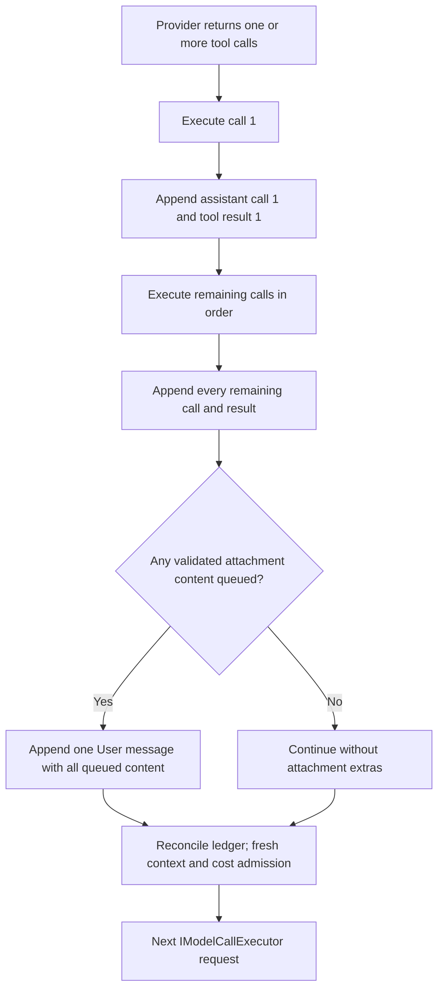

# Arcanum chat loop and attachment continuation ordering

Installation factory-reset apply first asks the running authenticated host to publish and prove its V2 reset handoff under the exact lifetime maintenance lock, then requests loopback shutdown and acquires the lock for offline continuation. No chat, watcher, indexing, or Tapestry writer remains active across that boundary. A noncompleted, ambiguous, or unreported-completed reset record blocks normal startup. The only recovery-host exception is the owning operation's authenticated V2, or exact eligible V1 migrated before its next effect, at global/all `Prepared + HostFactoryErasure + no proof`; that host admits only health, quit, and the exact factory replay while unrelated chat/API/background work stays closed. After a verified global or all reset, `arcanum run` enters the existing setup wizard on a fresh interactive invocation instead of recreating Grimoire state implicitly.

This document is the focused companion to `Arcanum.DESIGN.md` §10.7. It describes the one shared buffered/streaming model-tool loop and the ordering contract for attachment content.

## Read-only preflight preview

Before the normal loop, operators can run `arcanum context inspect [prompt]`, `arcanum context tools`, `arcanum context sources`, `arcanum context cost [prompt]`, or `arcanum run --dry-run`. These commands resolve the same saved/explicit Campaign, Workspace, Model, and Session context as `run`, then call `POST /api/intelligence/context/inspect`.

The preview resolves a production model lease, loads Session history and explicit context pins, reads CODEX, applies production Spell routing and resonant dependencies, optionally retrieves Workspace/attachment RAG plus Saga/Lexicon/Tapestry context, builds and filters the production tool set, calls `SystemPromptBuilder.BuildDocument`, evaluates the production compression rule, and runs the model-aware token estimator. A `run` preview can additionally carry a forced Spell, preview-only `AttachedFiles` / `ScryingFoci`, research synthesis policy, output reserve, and sampling options. It stops before the turn coordinator: no main/synthesis inference, tool call, budget reservation, assistant Entry, attachment persistence, or response persistence occurs. The standalone context commands expose `--no-retrieval`. Unified `run --dry-run` always disables retrieval, so it performs no embedding, RAG, automatic semantic Spell routing, search, or provider inference. An explicitly named Spell still resolves and loads with retrieval disabled. `--show-content` explicitly includes the assembled prompt/messages; otherwise only metadata, reasons, and token counts leave the host.

A unified dry run is a spend-free static pre-inference plan, not an identity-equal copy of the live Agent payload. It verifies the resolved user input and server-side context plan; the live handoff may still add locally produced `PatternSnapshot` and `ChronosyncDelta` context.

`arcanum memory explain [session]` is intentionally less expensive and answers a different question. It reads persisted counts and feature gates to explain which source categories are candidates for a next turn and why; it does not route a Spell, embed a query, assemble content, reserve budget, or promise that a conditional Lexicon/Saga/workspace/attachment candidate will be selected. Use `memory status|sources|search` for retention/provenance inspection and `context inspect` for the actual planned turn projection.

## Unified `run` entry path

`arcanum run` is an entry adapter, not another model loop. Positional words become the instruction; redirected stdin remains a separate untrusted current-turn source, and both are preserved when supplied together. With neither source on a TTY, the command asks for one interactive line. The stdin reader counts UTF-8 while buffering and accepts at most 10 MiB (10,485,760 bytes). Crossing that boundary or failing to read the stream stops dispatch without retaining, dropping, or dispatching a partial source.

Repeated `--with @path` values are staged before dispatch. Relative paths use the effective working directory, explicitly supplied absolute paths are accepted, and strict-UTF-8 text has no extension allowlist. Text and stdin are SHA-256 hashed, split on UTF-8 boundaries into 1 MiB `AttachedFileDto` chunks under a 32 MiB aggregate allocation with no file/part-count ceiling, and labeled as untrusted data. The 10 MiB reader ceiling applies to stdin, not to each `--with` file. Recognized images are SHA-256 hashed and staged as `ScryingFocusDto` through the existing Scrying policy. The client staging grants no Session pin or server filesystem authority. On a live route, the server uses the normal attachment pipeline: Attachments-enabled hosts persist and Session-bind the sources before model inference, while Attachments-disabled hosts keep them only in memory for the current turn. A dry-run stops at the static plan and never persists them.

The default and `--spell <exact-or-unique-prefix>` routes both enter the ordinary Agent Loop below; the latter supplies `OverrideSpellName` and then uses normal Spell loading, resonances, tool policy, Wards, and Sanctum. `--research` enters the sole server-owned research orchestrator, which validates and resolves the prospective synthesis request before any provider search. Its final synthesis still uses the shared provider and attachment paths with the effective Campaign, Workspace, Session, Model, current-turn files/images, unattended mode, and supported inference options. Its all-tools-disabled synthesis is the existing untrusted-web boundary, not a new restriction on the Agent or Spell routes. `--research` and `--spell` are the only route conflict. `--dry-run` follows the preview path above and never enters either live loop.

## Termination, progress, and cancellation

Arcanum is a coding harness, so the shared loop has no fixed model-call, tool-round, correction-attempt, retry, step, or total turn-duration ceiling. It continues while evidence changes and stops only for one of these semantic outcomes:

| Outcome | Evidence and user action |
|---|---|
| Completion | The model produced terminal output, or client-tool forwarding returned actionable tool calls to the caller. |
| Cancellation | The caller or host token cancelled. The producer finishes child/process cleanup and durable-state classification before propagating cancellation; CLI Ctrl+C remains responsive. |
| Explicit policy | An operator-owned token or cost budget was reached. The response reports measured/reserved usage and how to change or resume the policy. |
| Provider/model boundary | The provider rejected the request or its real context/request shape cannot accept another call after compaction. The response identifies the provider/model fact and smaller-request, continuation, or model-selection action. |
| Safety/integrity boundary | Authentication, Ward, Sanctum, containment, protocol, or integrity policy prevents safe continuation. The response names the owner and safe recovery action; no boundary is silently bypassed. |
| Deterministic no-progress | The normalized loop state recurred without new evidence. The trace records the progress signature so a test can reproduce termination without sleeps or an attempt counter. |

Progress is state, not elapsed time. The main loop's signature includes the normalized assistant proposal, actionable tool-call identities/arguments, classified tool results, admitted context, and structured-output error state. A new tool result, changed correction error, newly materialized attachment, changed plan, or new research URL is progress. Exact recurrence is no progress. Research uses its deduplicated source set: it continues while a pass adds a URL and emits `source_target_reached` or `source_exhausted` when synthesis begins. A delegated child uses its explicit token/cost ledger; model-call count is telemetry only.

Buffered and streaming paths use the same semantic loop, so they terminate for the same reason. Streaming may emit intermediate status/tool/context frames; buffered mode records the same state internally. Neither projection invents a shorter deadline. Retained per-frame, allocation, provider request, concurrency, and post-cancellation cleanup bounds are local protections. A page or buffer must expose/follow continuation rather than silently becoming total work.

The direct chat projection applies that rule to rendering: it lazily parses complete assistant Markdown in at-most-256-Ki-character Markdig chunks, retaining one-allocation protection without a total display cutoff.

### Host crash mid-turn

A crash is not one of those outcomes: nothing runs, so nothing classifies the turn. The loop's own guarantees end at the process boundary, and what survives is only what reached the Grimoire. On the next start, durable-operation recovery (DESIGN §10.8) resolves the turn from that durable state rather than from anything the loop remembered.

| Turn state at the crash | What the next start does |
|---|---|
| Provider call in flight | The `InferenceRuns` row moves `Running → Abandoned` through a compare-and-set, so a turn that actually finished first keeps its real status. The stream is never replayed. |
| Usage already ledgered | Kept exactly as written. `BillableOperations` rows are the only evidence of real cost, and recovery neither re-bills nor adds an estimate. |
| Budget reservation outstanding | Released idempotently, so a dead process cannot consume the daily limit forever. Release is unconditional: a recovery pass that itself died between abandoning the run and releasing must still converge. |
| Idempotency claim held | Replayable only if its terminal bytes were fully captured. Anything else is abandoned, and the caller re-sends with the same `Idempotency-Key` rather than receiving a truncated body forever. |
| Tool child process running | Gone with the host. Recovery never claims a prior process is still controllable, and never re-attaches to one. |
| Delegated child (subagent) in flight | Abandoned, not restarted. The child's context was entirely in process, and restarting it from a ledger row — while the parent also recovers — is how a recursion storm begins. |
| Apprentice executing | Untouched here. An Apprentice is durable and resumes from its own checkpoint (§5.7); recovery only closes the ledger row so the work stays visible without being driven twice. |

Every one of these is safe to repeat, because a restart that crashes during recovery is just another crash. `arcanum operation list --state ReconciliationRequired` shows anything that could not be resolved automatically, with the guidance for repairing it.

## 1. One logical turn, multiple provider requests

A tool response cannot change the provider request that produced the tool call. “Refresh in the current message” therefore means refresh during the same logical Arcanum turn and include the content in that turn's next provider request. Every call still passes through `IModelCallExecutor`; there is no second inference path.

```mermaid
sequenceDiagram
    participant Model
    participant Loop as Shared tool loop
    participant Tool as refresh_session_file
    participant Store as Attachment store
    Model->>Loop: tool call (attachmentId or logicalKey)
    Loop->>Tool: Ward then Sanctum then invoke
    Tool-->>Loop: selector acknowledgement
    Loop->>Store: secure source read and persist/reuse
    Store-->>Loop: version plus current bytes metadata
    Loop->>Loop: append assistant call and tool result
    Loop->>Loop: after all round results, append queued content
    Loop->>Model: next admitted request in same logical turn
```

## 2. Refresh security and persistence

`refresh_session_file` accepts exactly one attachment selector and never a filesystem path. The host supplies session, turn-visible IDs, model, campaign, and assistant Entry. Logical keys match case-insensitively but fail if that would select more than one case-distinct key.

The latest Bound version must carry verified workspace provenance. The resolver checks workspace identity, lexical and canonical containment, unchanged symlink target, path/open-handle identity, and Sanctum against the actual canonical path. Bytes come from the verified handle under the maximum supported attachment read bound because the source kind may have changed. Two complete handle reads must have identical SHA-256 hashes. Detected MIME determines the refreshed Text/Image/Binary kind; that kind's size, strict UTF-8, and Scrying policy are reapplied, and model vision capability is required before a refreshed image can enter the next model round.

An unchanged hash reuses the latest row and encrypted blob. Changed bytes create the next version under the existing per-session/per-logical-key locks and measured `MaxBytesPerSession` protection; there is no incidental version-count ceiling. The original user Entry is never changed; a new version may bind to the current assistant Entry.

When semantic attachment retrieval is enabled, a newly created Bound refresh version is also offered to the bounded background indexing queue. This happens after durable persistence and does not change the tool result or injection ordering. Queue overflow or embedding failure is recovery work only: it records/delays indexing and never fails the logical turn. Default retrieval on later turns uses only the newest Bound version for each logical key in the same session; older indexed versions remain available only through explicit historical search.

## 3. Unified per-turn materialization ledger

The logical turn owns exactly one in-memory `ContextMaterializationLedger`; buffered and streaming paths use the same instance and the same model/tool loop. Its stable key combines source kind, opaque source id, version/content hash, and whole/chunk range. It records origin, label, hash, estimated tokens, bytes, trust, injected state, and provider round for current attachments, attachment references, context pins, `attach_session_file`, `refresh_session_file`, attachment RAG, workspace RAG, Saga, and The Tapestry.

Post-turn Saga extraction is a separate durable flow: a deduplicated queue reviews Session history oldest-first in timestamp-group-safe checkpoint pages, advances its watermark only after successful persistence, and retries failures. The checkpoint size is not a tail-window or total-memory ceiling.

Admission order is explicit-first: current attachment → attachment reference → context pin → model attach → model refresh → attachment RAG → workspace RAG → Saga → Tapestry. The Tapestry is admitted last because the documented source precedence is accepted explicit material, then exact raw leaf, then derived summary: a hierarchical node whose text exactly matches a leaf already in the ledger is rejected as a duplicate. Because a summary and its descendant have different text and different hashes, exact dedupe cannot see semantic overlap between tree levels — Tapestry retrieval therefore applies lineage-aware suppression before admission, keeping the higher-utility candidate and dropping the ancestor or descendant it would duplicate (DESIGN §21.11). Attachment semantic limits are chunks, represented attachments, UTF-8 bytes, estimated tokens, and similarity; Tapestry limits are nodes, UTF-8 bytes, and estimated tokens. Identical content/ranges are injected once. A whole explicit version removes same-version semantic chunks; a refresh also removes older versions before the next provider call. Failed materialization does not enter the ledger, and turn finalization clears it.

Direct reference preparation is metadata-only and has no incidental item-count ceiling. After the provider and canonical model are resolved, the loop opens references sequentially in request order, adds one candidate to the assembled payload, applies normal compression and semantic shedding, and runs the real context gate. Only an admitted candidate is injected; failure stops before later references or provider I/O. Cancellation during a read propagates and leaves subsequent references unopened.

Initial DATA ordering is `Attached Files for this Turn` → `Retrieved Session Attachment Context` → `Session Attachments Index` → workspace semantic context. Every retrieved chunk includes sanitized filename, logical key, version, opaque attachment id, character/line range, hash, an explicit untrusted-DATA warning, and an adaptive fence.

## 4. Attachment memory promotion gate

Materialization is the only authority for attachment-derived durable memory. A successful explicit attachment, attach/refresh tool result, or accepted attachment-RAG excerpt publishes typed provenance containing session id, opaque attachment id, logical key, version, content hash, materialized timestamp, and source type. A failed read, suppressed excerpt, attachment index row, or instruction inside attachment text grants no promotion authority.

Lexicon writes that name an attachment must match the current turn's materialized allowlist. Saga extraction receives that same allowlist and discards claimed attachment conclusions that do not match it. Campaign summaries receive metadata-only consultation references, never attachment bytes, host paths, excerpt text, or index contents. Stable prompt-cache segments exclude attachment content, paths, hashes, and provenance; volatile context follows the stable prefix.

Subagents remain sterile. A delegated file attachment id must intersect the parent's current-turn materialized allowlist, and only its explicitly supplied value crosses the child boundary. Deleting the source keeps the historical provenance record but changes its source availability to `Unavailable`; no durable memory silently loses its origin.

## 5. Transcript and injection order

For a model response containing several calls, Arcanum appends every assistant-call/tool-result pair first. Successful `attach_session_file` and `refresh_session_file` materializations accumulate in a pending list. Only after the loop has appended the last result does it add one User message carrying the queued `TextContent` / `DataContent`.



A verbose `execute_command` result appends its bounded preview and an opaque connection-scoped complete-output handle. Artifact Attunement automatically carries read-only `read_command_output` whenever it admits `execute_command`; later calls page strict UTF-8 text from offset `0` through each `nextOffset`. The per-page byte boundary protects one model/JSON-RPC allocation and never silently discards total diagnostics. A stream's final page immediately releases and deletes its delete-on-close artifact; the handle expires after every available stream finishes. Failure, cancellation, connection disposal, and abrupt process exit are cleanup backstops. Complete stdout and stderr share the explicit Sanctum `MaxFileWriteMb` operator policy; crossing it stops the process tree, deletes partial state, and returns measured-limit continuation guidance rather than truncating.

Explicit references and both model tools pass the same iterative identity/ownership checks without a count ceiling. A logical key/version is injected once per turn, and provider-context plus physical byte admission remains authoritative. Refreshed text is framed as untrusted DATA with an adaptive fence and a hardened label containing filename, logical key, version, and source freshness. Images pair an untrusted notice with `DataContent` and are never truncated.

Expected unsafe/unavailable cases return a structured tool result and no content. Unexpected post-processing exceptions follow the shared mode policy: streaming invocation failures are tolerated with `toolError` plus a synthetic result, while buffered behavior follows `TolerateToolFailures`. Before every provider call, including structured-output correction, context admission drops Tapestry, Saga, workspace RAG, then attachment RAG before complete tool exchanges; explicit accepted files are never dropped and overflow returns `Hub.ContextBudgetExceeded`. A successful refresh emits native `attachmentRefreshed` observability after its `toolResult`; OpenAI projections ignore that native-only event.

## 6. Command Center context UI rendering

Command Center treats attachment state as a backend projection, not a client inference. The `/attachments` list renders `[Snapshot]` for snapshot-only rows, `[Live]` only for a tracked row whose revalidated status is `Refreshable`, and `[Stale]` for drift, missing/inaccessible source, changed workspace, unsafe provenance, or corrupt metadata. Every row shows the bound version and its `ContentSha256`, which identifies the bytes currently available to model context. Tracked rows also show the last backend-observed disk hash and write timestamp.

One recursive, debounced `FileSystemWatcher` watches the active Command Center working directory. Create/change/delete/rename events are invalidation hints only: the monitor calls `GET /api/sessions/{id}/attachments`, and that endpoint revalidates stored provenance before returning DTOs. The UI never reads or hashes the source and never changes Stale to Live from a watcher event. The same authenticated DTO projection supplies aggregate indexing state. The footer displays pending work (including a failed count), terminal completion, or failure; while any row remains `Pending`, the monitor polls once per second until the backend reports a terminal state.

Native `context` frames update a non-focusable left-rail Context pane with chat history, explicit attachments, refreshed files, attachment RAG, and workspace RAG. The displayed input total uses the local estimate before provider usage arrives and valid provider-reported input afterward. The materialization ledger accumulates only context-pressure evictions for attachment/workspace semantic chunks and Tapestry nodes, and those counts produce the pane warning. Metadata from `### Session Attachments Index` is system context rather than retrieved attachment RAG. Rendering is aggregate-only and never exposes chunk text, vectors, source hashes, or raw ledger entries.

`/attachments refresh <logicalName>` resolves the latest backend row and posts its opaque attachment id to `/api/sessions/{id}/attachments/{attachmentId}/refresh`. The endpoint invokes the same secure refresh core used after `refresh_session_file`; it rechecks Sanctum and source identity, persists or reuses the verified version with its currently detected kind, and returns the sanitized `AttachmentRefreshEvent`. Because this is an operator action outside a model round, no content injection is queued and no default-model vision capability is required. Command Center reports Live only from that successful response.

Rendering cost under streaming is bounded by coalescing at both ends of the UI channel. The streaming coalescer writes one `RefreshLog` signal when a token chunk contains a newline or the 50 ms flush interval has elapsed, and again before a non-token block, on the final result, on cancellation, and on dispose; it never mutates Terminal.Gui controls itself. The host UI pump then drains every update already queued on the channel with a non-blocking read and folds that batch before invoking `ApplyState`: consecutive refresh kinds collapse into a single apply, and a batch mixing different refresh kinds widens to `RefreshAll`, which is their superset. `FocusInput`, `FocusSessions`, and `FocusTranscript` are one-shot side effects — they are never coalesced away and keep their relative order against the refreshes around them. A burst of flushes therefore costs at most one pane rebuild per UI-thread pass, and that rebuild reuses each entry's cached wrapped lines whenever its text, streaming flag, and wrap width are unchanged.

## 7. Standalone lifecycle and turn entry

`arcanum attachment add|reference|list|show|versions|refresh|pin|unpin|export|reveal` manages the same bound rows without entering this model loop. `add` uploads client-read bytes as a snapshot; `reference` sends a server-workspace-relative path that only the host resolves, authorizes, stably reads, and persists. Refresh calls the service described in §2 but stops before queued injection. No standalone metadata command materializes content or spends the turn reference budget.

Content enters a turn only through an explicit current upload, a bound GUID passed to repeatable `ask --attachment` / `chat --attachment`, `run --with @path` or piped current-turn content, an admitted text context pin, a successful model attach or refresh tool, or bounded attachment RAG. Direct CLI GUIDs are validated against the effective Session and enter the §3 ledger as explicit attachment references. Unified-run text and images arrive as typed current-turn content and are eligible for model context only through normal server materialization. On a live route, Attachments-enabled hosts persist and bind them before inference; otherwise they remain in memory. The CLI SHA-256 diagnostic alone grants no durable memory provenance. Text pins follow the same dedupe/admission path. Image pins stay durable but produce `Unsupported` for implicit materialization; the user must pass the image GUID explicitly to a vision-capable turn. Binary attachments remain manageable/exportable but are rejected as direct model-context materialization.

Export and reveal remain outside turn assembly. Export streams the authenticated stored snapshot to a same-directory stage and atomically publishes plaintext only after success; it refuses stdout. Reveal opens a locally present `ARCABLOB` stored snapshot artifact, never the live source or a decrypted copy; remote/mismatched clients are directed to export. List/show/versions/refresh/pin/unpin/reveal and `show --privacy` are metadata/disclosure only, never attachment-byte terminal output and never an acknowledgement gate.
