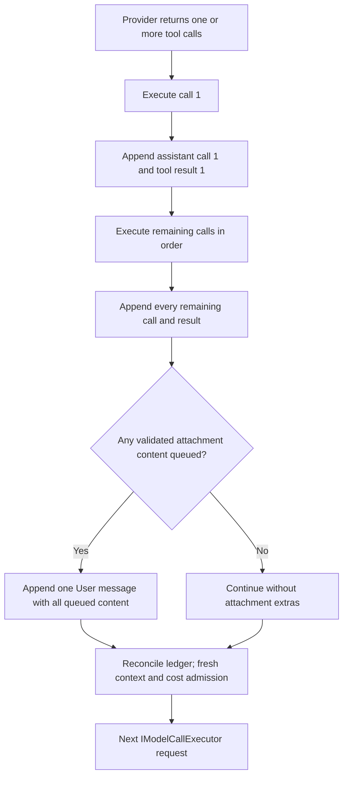

# Arcanum chat loop and attachment continuation ordering

This document is the focused companion to `Arcanum.DESIGN.md` §10.7. It describes the one shared
buffered/streaming model-tool loop and the ordering contract for attachment content.

## Read-only preflight preview

Before the normal loop, operators can run `arcanum context inspect [prompt]`, `arcanum context tools`, `arcanum context sources`, or `arcanum mana [prompt]`. These commands resolve the same saved/explicit Campaign, Workspace, Model, and Session context as `ask`/`chat`, then call `POST /api/intelligence/context/inspect`.

The preview resolves a production model lease, loads Session history and explicit context pins, reads CODEX, applies production Spell routing and resonant dependencies, optionally retrieves Workspace/attachment RAG plus Saga/Lexicon context, builds and filters the production tool set, calls `SystemPromptBuilder.BuildDocument`, evaluates the production compression rule, and runs the model-aware token estimator. It stops before the turn coordinator: no main inference, tool call, budget reservation, assistant Entry, or response persistence occurs. `--no-retrieval` omits embedding/RAG work and automatic semantic Spell routing. `--show-content` explicitly includes the assembled prompt/messages; otherwise only metadata, reasons, and token counts leave the host.

`arcanum memory explain [session]` is intentionally less expensive and answers a different question.
It reads persisted counts and feature gates to explain which source categories are candidates for a
next turn and why; it does not route a Spell, embed a query, assemble content, reserve budget, or
promise that a conditional Lexicon/Saga/workspace/attachment candidate will be selected. Use
`memory status|sources|search` for retention/provenance inspection and `context inspect` for the
actual planned turn projection.

## 1. One logical turn, multiple provider requests

A tool response cannot change the provider request that produced the tool call. “Refresh in the
current message” therefore means refresh during the same logical Arcanum turn and include the
content in that turn's next provider request. Every call still passes through `IModelCallExecutor`;
there is no second inference path.

```mermaid
sequenceDiagram
    participant Model
    participant Loop as Shared tool loop
    participant Tool as refresh_session_file
    participant Store as Attachment store
    Model->>Loop: tool call (attachmentId or logicalKey)
    Loop->>Tool: Ward then Sanctum then invoke
    Tool-->>Loop: selector acknowledgement
    Loop->>Store: secure source read and persist/reuse
    Store-->>Loop: version plus current bytes metadata
    Loop->>Loop: append assistant call and tool result
    Loop->>Loop: after all round results, append queued content
    Loop->>Model: next admitted request in same logical turn
```

## 2. Refresh security and persistence

`refresh_session_file` accepts exactly one attachment selector and never a filesystem path. The host
supplies session, turn-visible IDs, model, campaign, and assistant Entry. Logical keys match
case-insensitively but fail if that would select more than one case-distinct key.

The latest Bound version must carry verified workspace provenance. The resolver checks workspace
identity, lexical and canonical containment, unchanged symlink target, path/open-handle identity,
and Sanctum against the actual canonical path. Bytes come from the verified handle under the
maximum supported attachment read bound because the source kind may have changed. Two complete
handle reads must have identical SHA-256 hashes. Detected MIME determines the refreshed
Text/Image/Binary kind; that kind's size, strict UTF-8, and Scrying policy are reapplied, and model
vision capability is required before a refreshed image can enter the next model round.

An unchanged hash reuses the latest row and encrypted blob. Changed bytes create the next version
under the existing per-session/per-logical-key locks and `MaxBytesPerSession` /
`MaxVersionsPerLogicalKey` limits. The original user Entry is never changed; a new version may bind
to the current assistant Entry.

When semantic attachment retrieval is enabled, a newly created Bound refresh version is also
offered to the bounded background indexing queue. This happens after durable persistence and does
not change the tool result or injection ordering. Queue overflow or embedding failure is recovery
work only: it records/delays indexing and never fails the logical turn. Default retrieval on later
turns uses only the newest Bound version for each logical key in the same session; older indexed
versions remain available only through explicit historical search.

## 3. Unified per-turn materialization ledger

The logical turn owns exactly one in-memory `ContextMaterializationLedger`; buffered and streaming
paths use the same instance and the same model/tool loop. Its stable key combines source kind,
opaque source id, version/content hash, and whole/chunk range. It records origin, label, hash,
estimated tokens, bytes, trust, injected state, and provider round for current attachments,
attachment references, context pins, `attach_session_file`, `refresh_session_file`, attachment RAG,
workspace RAG, and Saga.

Admission order is explicit-first: current attachment → attachment reference → context pin → model
attach → model refresh → attachment RAG → workspace RAG → Saga. Attachment semantic limits are
chunks, represented attachments, UTF-8 bytes, estimated tokens, and similarity. Identical
content/ranges are injected once. A whole explicit version removes same-version semantic chunks; a
refresh also removes older versions before the next provider call. Failed materialization does not
enter the ledger, and turn finalization clears it.

Initial DATA ordering is `Attached Files for this Turn` → `Retrieved Session Attachment Context` →
`Session Attachments Index` → workspace semantic context. Every retrieved chunk includes sanitized
filename, logical key, version, opaque attachment id, character/line range, hash, an explicit
untrusted-DATA warning, and an adaptive fence.

## 4. Attachment memory promotion gate

Materialization is the only authority for attachment-derived durable memory. A successful explicit
attachment, attach/refresh tool result, or accepted attachment-RAG excerpt publishes typed
provenance containing session id, opaque attachment id, logical key, version, content hash,
materialized timestamp, and source type. A failed read, suppressed excerpt, attachment index row,
or instruction inside attachment text grants no promotion authority.

Lexicon writes that name an attachment must match the current turn's materialized allowlist. Saga
extraction receives that same allowlist and discards claimed attachment conclusions that do not
match it. Campaign summaries receive metadata-only consultation references, never attachment bytes,
host paths, excerpt text, or index contents. Stable prompt-cache segments exclude attachment
content, paths, hashes, and provenance; volatile context follows the stable prefix.

Subagents remain sterile. A delegated file attachment id must intersect the parent's current-turn
materialized allowlist, and only its explicitly supplied value crosses the child boundary. Deleting
the source keeps the historical provenance record but changes its source availability to
`Unavailable`; no durable memory silently loses its origin.

## 5. Transcript and injection order

For a model response containing several calls, Arcanum appends every assistant-call/tool-result pair
first. Successful `attach_session_file` and `refresh_session_file` materializations accumulate in a
pending list. Only after the loop has appended the last result does it add one User message carrying
the queued `TextContent` / `DataContent`.



The shared `MaxReferencesPerTurn` budget includes explicit references and both model tools. A logical
key/version is injected once per turn. Refreshed text is framed as untrusted DATA with an adaptive
fence and a hardened label containing filename, logical key, version, and source freshness. Images
pair an untrusted notice with `DataContent` and are never truncated.

Expected unsafe/unavailable cases return a structured tool result and no content. Unexpected
post-processing exceptions follow the shared mode policy: streaming invocation failures are
tolerated with `toolError` plus a synthetic result, while buffered behavior follows
`TolerateToolFailures`. Before every provider call, including structured-output correction, context
admission drops Saga, workspace RAG, then attachment RAG before complete tool exchanges; explicit
accepted files are never dropped and overflow returns `Hub.ContextBudgetExceeded`. A successful refresh emits native `attachmentRefreshed` observability after
its `toolResult`; OpenAI projections ignore that native-only event.

## 6. Command Center context UI rendering

Command Center treats attachment state as a backend projection, not a client inference. The
`/attachments` list renders `[Snapshot]` for snapshot-only rows, `[Live]` only for a tracked row whose
revalidated status is `Refreshable`, and `[Stale]` for drift, missing/inaccessible source, changed
workspace, unsafe provenance, or corrupt metadata. Every row shows the bound version and its
`ContentSha256`, which identifies the bytes currently available to model context. Tracked rows also
show the last backend-observed disk hash and write timestamp.

One recursive, debounced `FileSystemWatcher` watches the active Command Center working directory.
Create/change/delete/rename events are invalidation hints only: the monitor calls
`GET /api/sessions/{id}/attachments`, and that endpoint revalidates stored provenance before returning
DTOs. The UI never reads or hashes the source and never changes Stale to Live from a watcher event.
The same authenticated DTO projection supplies aggregate indexing state. The footer displays pending
work (including a failed count), terminal completion, or failure; while any row remains `Pending`, the
monitor polls once per second until the backend reports a terminal state.

Native `context` frames update a non-focusable left-rail Context pane with chat history, explicit
attachments, refreshed files, attachment RAG, and workspace RAG. The displayed input total uses the
local estimate before provider usage arrives and valid provider-reported input afterward. The
materialization ledger accumulates only context-pressure evictions for attachment/workspace semantic
chunks, and those counts produce the pane warning. Metadata from `### Session Attachments Index` is
system context rather than retrieved attachment RAG. Rendering is aggregate-only and never exposes
chunk text, vectors, source hashes, or raw ledger entries.

`/attachments refresh <logicalName>` resolves the latest backend row and posts its opaque attachment
id to `/api/sessions/{id}/attachments/{attachmentId}/refresh`. The endpoint invokes the same secure
refresh core used after `refresh_session_file`; it rechecks Sanctum and source identity, persists or
reuses the verified version with its currently detected kind, and returns the sanitized
`AttachmentRefreshEvent`. Because this is an operator action outside a model round, no content
injection is queued and no default-model vision capability is required. Command Center reports Live
only from that successful response.

## 7. Standalone lifecycle and turn entry

`arcanum attachment add|reference|list|show|versions|refresh|pin|unpin|export|reveal` manages the
same bound rows without entering this model loop. `add` uploads client-read bytes as a snapshot;
`reference` sends a server-workspace-relative path that only the host resolves, authorizes, stably
reads, and persists. Refresh calls the service described in §2 but stops before queued injection.
No standalone metadata command materializes content or spends the turn reference budget.

Content enters a turn only through an explicit current upload, a bound GUID passed to repeatable
`ask --attachment` / `chat --attachment`, an admitted text context pin, a successful model attach or
refresh tool, or bounded attachment RAG. Direct CLI GUIDs are validated against the effective
Session and enter the §3 ledger as explicit attachment references. Text pins follow the same
dedupe/admission path. Image pins stay durable but produce `Unsupported` for implicit
materialization; the user must pass the image GUID explicitly to a vision-capable turn. Binary
attachments remain manageable/exportable but are rejected as direct model-context materialization.

Export and reveal remain outside turn assembly. Export streams the authenticated stored snapshot
to a same-directory stage and atomically publishes plaintext only after success; it refuses stdout.
Reveal opens a locally present `ARCABLOB` stored snapshot artifact, never the live source or a
decrypted copy; remote/mismatched clients are directed to export.
List/show/versions/refresh/pin/unpin/reveal and `show --privacy` are metadata/disclosure only, never
attachment-byte terminal output and never an acknowledgement gate.
