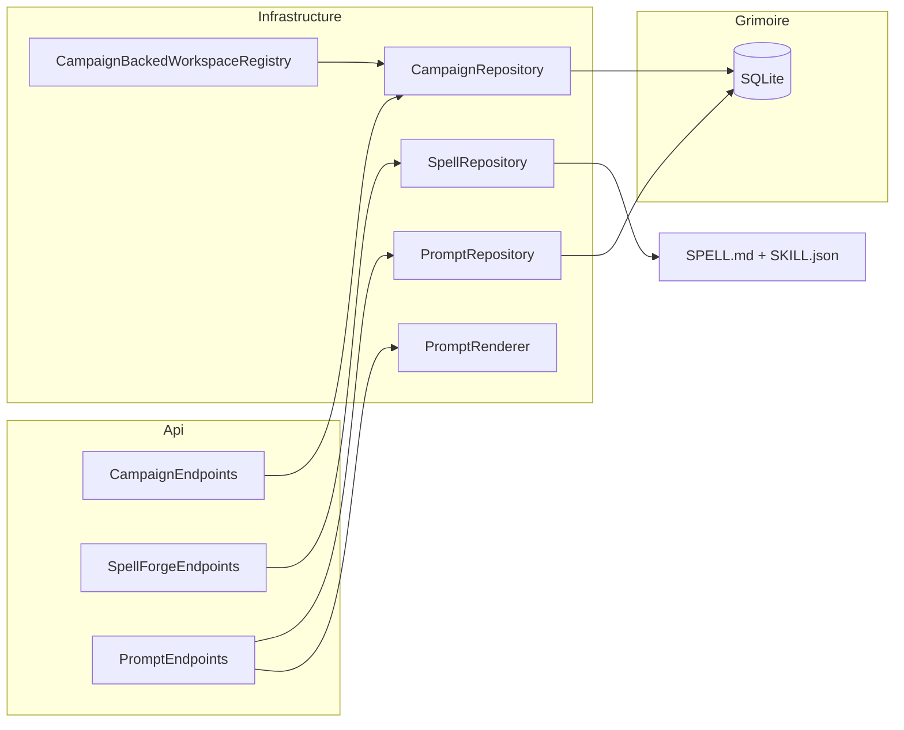
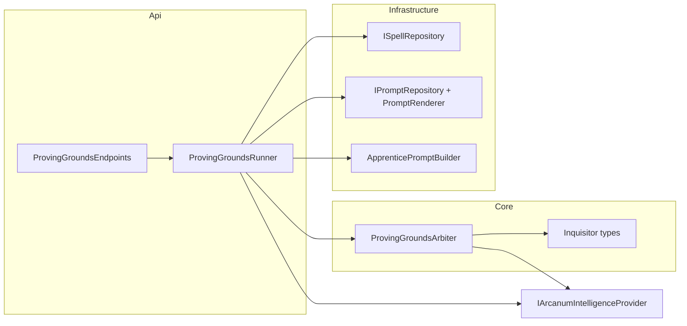
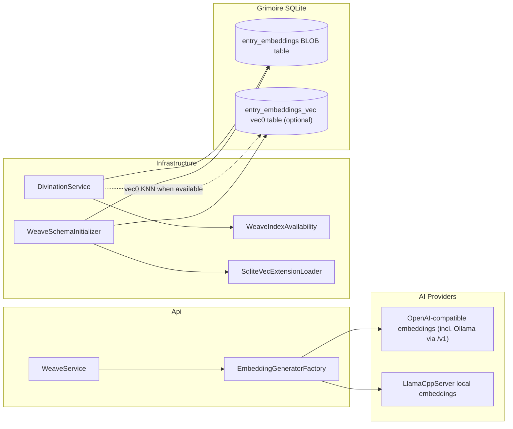

# Arcanum — Design Document

This document captures the **architecture, design decisions, and tradeoffs** for the Retro Downfall **Arcanum** solution. The intended audience is **senior C# / .NET engineers** who will extend, review, or operate the system.

**Keeping this document accurate:** When any change under `src/` alters architecture, observable behavior, or names described here, update the relevant sections in the same change set. Pair operator-visible behavior changes with `README.md` updates.

---

## 1. Purpose and scope

**Arcanum** is a **single deployable CLI** that can:

1. Run **terminal-oriented commands** — currently `ask` (single-prompt LLM inference with optional Grimoire thread continuation), `chat` (interactive multi-turn REPL), `look` (workspace perception), `lore` (key-value CRUD), `daemon` (OS-level background service lifecycle plus **API-first** monitoring of Unseen Servant jobs via `daemon jobs`, `daemon initiative`, and Comm Link smoke tests via `daemon alert` when Kestrel is up), and `llama` (manage the local **LlamaCpp** inference backend — GGUF model pull/cache and `llama-server` process lifecycle via `llama pull`, `llama start`, `llama stop`, and `llama status` when Kestrel is up).
2. Act as a **long-running HTTP host** exposing a Minimal API surface (the `serve` command).

The codebase is organized as a **multi-project solution**: `Core` (domain primitives, contracts, configuration), `Infrastructure` (Serilog, Data Protection, encrypted Grimoire via EF Core + SQLCipher, workspace scanning, Eye of the World perception, MCP client layer with both subprocess and in-process transports), `Api` (HTTP surface, multi-provider intelligence hub, semantic spell routing, API-key security), and `Cli` (ConsoleAppFramework entry point). All projects target **Native AOT readiness** where the toolchain allows.

Key subsystems described in later sections: hybrid hosting model (§5), HTTP JSON design (§8), intelligence pipeline with MCP tool integration (§10), local API security (§11), and Eye of the World situational awareness (§15).

---

## 2. Architectural goals

| Goal | Rationale |
|------|-----------|
| **Strict project boundaries** | Keeps compile-time dependencies honest, enables parallel ownership, and avoids the "everything references everything" failure mode. |
| **Hybrid process model** | One binary reduces deployment and versioning surface; operators choose mode via CLI verbs. |
| **Native AOT readiness for the host** | Eliminates the .NET runtime prerequisite so the CLI ships as a self-contained native binary. Secondary benefits: predictable startup and a smaller attack surface from reflection-heavy stacks — balanced against ecosystem limitations (§9). |
| **Minimal API over MVC** | Fewer moving parts, explicit endpoint mapping, and alignment with ASP.NET Core's AOT-oriented request pipeline. |
| **Source-generated JSON and request delegates** | Required for credible trimming and Native AOT compatibility; avoids runtime reflection. |

### 2.2 Remediation architectural gate (deferred policy changes)

The following items from the Arcanum code review require explicit product/architecture sign-off before implementation.

| Finding | Topic | Current decision |
|---------|-------|------------------|
| **#50** | Generate runtime `.sql` + `MigrationOrder` from EF migrations (Approach B) | **Deferred.** Schema changes ship in the existing hand-authored SQL scripts; migrator wraps each script + history row in one transaction (Approach A). |
| **#25** | Child-process environment allowlist for MCP / `execute_command` | **Done.** `execute_command` strips `ARCANUM_*` secret/config vars (provider API keys) from the child env before spawn while preserving `PATH`/`HOME`; **all** MCP servers (global + workspace) strip the inherited host env by default (`ShouldStripUserEnvironment`) and run only their scrubbed `cfg.Env`. A per-server **`inheritEnv`** allowlist re-admits named host variables (e.g. `["PATH","HOME"]` for `npx`) past the `IsBlockedEnvironmentVariable` deny-list. A full per-binary/per-var allowlist remains deferred. |
| **#10** | OpenAI `/v1` default tool policy for workspace-less requests | **Deferred.** Current exposure unchanged until product decides agentic-by-default vs allowlist. |
| **#45** | Persist Unseen Servant watermarks to the Grimoire | **Done.** Watermarks persist to the Grimoire `UnseenServantWatermarks` table; see §5.5.5. |

---

### 2.1 Naming conventions

See [README.md §Naming metaphor](README.md#naming-metaphor) for the complete metaphor. DESIGN.md uses the thematic names throughout.

---

## 3. Repository and solution layout

### 3.1 `src/` per project

Projects live under `src/` rather than the repository root for shorter CI paths, room for future top-level folders (`build/`, `docs/`, `test/`, `tools/`), and alignment with common monorepo conventions.

### 3.2 `Directory.Build.props`

Shared MSBuild properties: `TargetFramework` (`net10.0`), `Nullable` (`enable`), `ImplicitUsings` (`enable`), `LangVersion` (`latest`), `<Version>0.1.0-beta</Version>`. A solution-wide **`PackageReference`** to **`Microsoft.Bcl.Memory`** (currently **10.0.8**) overrides vulnerable transitive versions (mitigates **CVE-2026-26127**). The vulnerable transitive line is declared by **`Microsoft.ML.Tokenizers.Data.O200kBase`** (netstandard2.0 shim dependencies), not by Native AOT. Individual `.csproj` files focus on what differentiates each project.

### 3.3 Package versions

`Microsoft.Bcl.Memory` is pinned once above. All other first-party `Microsoft.*` packages are pinned in individual `.csproj` files, currently **10.0.8**; `Microsoft.Extensions.AI`, `Microsoft.Extensions.AI.Abstractions`, and `Microsoft.Extensions.AI.OpenAI` are **10.6.0**. Ollama is reached through its own OpenAI-compatible `/v1` endpoint using `Microsoft.Extensions.AI.OpenAI`; `OllamaSharp` is not referenced. `Microsoft.ML.Tokenizers` and `Microsoft.ML.Tokenizers.Data.O200kBase` are **2.0.0** (latest stable; still require the Bcl.Memory override until upstream updates its nuspec).

### 3.4 Configuration reference (`ArcanumSettings`)

Operator-facing settings bind under the `Arcanum` JSON object in `arcanum.json` (see `README.md`). The config file lives alongside the Grimoire in `ArcanumPaths.GrimoireDirectory` (`~/.config/arcanum/` on macOS and Linux, `%USERPROFILE%\.config\arcanum\` on Windows). Environment variables use prefix `ARCANUM_` with nested `__` segments.

> **Compendium** is the visual editor for this table — every row below maps 1:1 to a `SettingDescriptor` row in `src/RetroDownfall.Compendium.Ux/Models/SettingDescriptors.cs`, which drives the form controls, descriptions, clamp bounds, and enum dropdowns. See §4.6 and [`docs/Compendium.README.md`](Compendium.README.md). `SettingDescriptorParityTests` and `SettingDescriptorCoverageTests` guard against drift between this table and the editor.

| Configuration path | Type | Default | Clamp | Purpose |
|--------------------|------|---------|-------|---------|
| `Arcanum:Host:Port` | `int` | `5001` | 1 – 65,535 | Kestrel HTTP listen port. |
| `Arcanum:Host:Https:Enabled` | `bool` | `false` | — | When `true`, Kestrel adds an HTTPS listener alongside HTTP (same loopback / ListenAny mode). |
| `Arcanum:Host:Https:Port` | `int` | `5443` | 1 – 65,535 | TLS listen port; must differ from `Host:Port`. |
| `Arcanum:Host:Https:CertificatePath` | `string?` | `null` | — | PFX path when `PrivateKeyPath` is empty; PEM certificate path when `PrivateKeyPath` is set. Leading `~` / `~/` / `~\` expand to the user profile. Prefer absolute paths. |
| `Arcanum:Host:Https:PrivateKeyPath` | `string?` | `null` | — | Optional PEM private key. When set, PEM mode is used and `CertificatePassword` is ignored. Unencrypted PEM only in this pass. |
| `Arcanum:Host:Https:CertificatePassword` | `string?` | `null` | — | Optional PFX password (passwordless PFX allowed). Encrypted at rest as `dp:v1:`; redacted as `***` on `GET /api/config`. Never logged. |
| `Arcanum:Host:RetainedLogFileCount` | `int` | `7` | 1 – 366 | Serilog rolling file retention (days). |
| `Arcanum:Host:EnableEnterpriseTelemetry` | `bool` | `false` | — | When `true`, Serilog adds a console sink with `CompactJsonFormatter` (structured JSON for log ingestion). |
| `Arcanum:Host:CorsAllowedOrigins` | `string[]` | localhost loopback (`5001`, `3000`) | — | Origins allowed by the **`ArcanumCors`** policy. Use `["*"]` to allow any origin (browser-callable; risk = key exfiltration on a compromised page). Empty array falls back to the localhost defaults. |
| `Arcanum:Host:EnableScalarUi` | `bool` | `false` | — | Mounts **`MapScalarApiReference`** under **`/api/scalar`**. |
| `Arcanum:Host:SystemFingerprint` | `string?` | `null` | — | Optional override for the **`system_fingerprint`** field returned by `/v1/chat/completions`. |
| `Arcanum:Host:Workspace` | `string?` | `null` | — | Default workspace root for spell management routes (`/api/spells`) when `?workspace=` is omitted (`SpellWorkspaceResolver`; §8.14). |
| `Arcanum:Host:ListenAny` | `bool` | `false` | — | When `true`, Kestrel uses `ListenAnyIP` instead of `ListenLocalhost`. See §11.13. |
| `Arcanum:Host:MaxRequestBodyBytes` | `long` | `10485760` (10 MiB) | 256 KiB – 1 GiB | Kestrel `MaxRequestBodySize`. |
| `Arcanum:Host:RateLimit:Enabled` | `bool` | `false` | — | When `true`, `AddArcanumApiServices` registers `AddRateLimiter` and `ServeCommand`/DevHost call `UseRateLimiter()`. See §11.13. |
| `Arcanum:Host:RateLimit:PermitLimit` | `int` | `120` | 1 – 1,000,000 | Requests permitted per partition per window. |
| `Arcanum:Host:RateLimit:WindowSeconds` | `int` | `60` | 1 – 86,400 | Fixed window length (seconds). |
| `Arcanum:Host:RateLimit:QueueLimit` | `int` | `0` | 0 – 1,000,000 | Maximum queued requests per partition. `0` rejects with HTTP 429 immediately; positive values serve queued requests when the window replenishes. |
| `Arcanum:Host:AuditLog:Enabled` | `bool` | `false` | — | Master toggle for the persisted inference audit log (§8.26). No file I/O at all when `false`. |
| `Arcanum:Host:AuditLog:FilePath` | `string` | `~/.config/arcanum/audit.jsonl` | — | Base path; directory + filename stem are combined with a UTC date to produce each day's `{stem}-{yyyyMMdd}.jsonl` file. |
| `Arcanum:Host:AuditLog:MaxSizeMb` | `int` | `100` | 10 – 1,000 | Soft per-day-file size cap; further writes for that day are dropped (logged once) once reached. |
| `Arcanum:Host:AuditLog:RetentionDays` | `int` | `7` | 1 – 365 | Dated files older than this are deleted the first time a new UTC day's file is created. |
| `Arcanum:Host:AuditLog:RedactToolArguments` | `bool` | `true` | — | When `true`, only tool *names* are captured (never arguments). When `false`, raw tool argument JSON is also recorded — at the operator's risk. |
| `Arcanum:Server:PidFilePath` | `string?` | `~/.config/arcanum/arcanum.pid` | — | PID file written on host start, removed on graceful shutdown when it still contains this process's PID. |
| `Arcanum:DefaultModel` | `string?` | `null` | — | When non-empty, must match a `models` entry on some provider (see `ProviderResolver`); used when `PingRequest.Model` is omitted. |
| `Arcanum:FastModel` | `string?` | `null` | — | When non-empty, must match a `models` entry on some provider. |
| `Arcanum:Providers` | array | `[]` | element `contextWindowLimit` 256 – 2,097,152 | Multi-provider hub. See §10.2.4. |
| `Arcanum:Conclave:Enabled` | `bool` | `false` | — | Enables **The Conclave** (§5.7): the cross-Apprentice delegation surface. See §5.7. |
| `Arcanum:Conclave:MaxDelegationDepth` | `int` | `3` | 0 – 20 | Maximum delegation depth from a Conclave root Apprentice (0 = root only, no children). |
| `Arcanum:Conclave:MaxDescendantsPerRoot` | `int` | `16` | 1 – 200 | Maximum total descendant Apprentices allowed under one Conclave root (breadth cap). Lineage is resolved via hydrated **`ParentApprenticeId`** (no EF migration) (`Apprentice.ConclaveBreadthExceeded`). |
| `Arcanum:Conclave:A2A:Enabled` | `bool` | `false` | — | Master toggle for the A2A (Agent-to-Agent) protocol surface (§5.7.1). |
| `Arcanum:Conclave:A2A:ServerEnabled` | `bool` | `false` | — | When `true` (and `A2A:Enabled`), exposes Arcanum Apprentices as an A2A server: external agents send messages that spawn headless Apprentices, mapped under `A2A:ServerPath`. |
| `Arcanum:Conclave:A2A:ServerPath` | `string` | `/api/conclave/a2a` | — | HTTP path under which the A2A JSON-RPC endpoints and the authenticated Agent Card (`{ServerPath}/agent-card`) are mapped, inside the `/api` route group (`ApiKeyEndpointFilter` applies). |
| `Arcanum:Conclave:A2A:AgentCardName` | `string?` | `null` | — | Display name advertised on the A2A Agent Card ("Heraldry"). |
| `Arcanum:Conclave:A2A:AgentCardDescription` | `string?` | `null` | — | Display description advertised on the A2A Agent Card ("Heraldry"). |
| `Arcanum:Conclave:A2A:ClientEnabled` | `bool` | `false` | — | When `true` (and `A2A:Enabled`), advertises the in-process `dispatch_sending` MCP tool so an Apprentice may delegate a Sending to an external A2A agent (the Archmage Client). |
| `Arcanum:Conclave:A2A:MaxExternalTasks` | `int` | `50` | 1 – 500 | Maximum concurrently in-flight client-side (`dispatch_sending`) delegations, enforced by an in-memory semaphore (not a persisted counter — external tasks are not written to the Grimoire). |
| `Arcanum:Conclave:A2A:ExternalTaskTimeoutMinutes` | `int` | `60` | 5 – 1,440 | Per-delegation wall-clock timeout for a blocking `dispatch_sending` call. Expiry releases the concurrency slot and fails with `Sending.TaskTimeout` (504). |
| `Arcanum:Conclave:A2A:AllowedRemoteAgents` | `string[]` | `[]` | — | Optional allowlist of remote Agent Card URLs/origins `dispatch_sending` may target. |
| `Arcanum:Conclave:A2A:DefaultWorkspace` | `string` | `""` | — | Fallback workspace for inbound A2A tasks (server side) when the request carries no workspace/campaign hint. |
| `Arcanum:Intelligence:ExecuteCommandTimeoutSeconds` | `int` | `30` | 1 – 600 | Hard wall-clock cap for MCP `execute_command` and `run_spell_script` (runtime-coupled to `Mcp:RequestTimeoutSeconds`); cooperative cancel also terminates spawned process trees immediately, independent of this timeout. |
| `Arcanum:Intelligence:InferenceTimeoutSeconds` | `int` | `600` | 5 – 3,600 | Wall-clock cap for a single inference turn (buffered or streaming), including tool rounds. Linked to the caller cancellation token; on expiry the hub returns **`Hub.Timeout`**. |
| `Arcanum:Intelligence:ToolOutputCapBytes` | `long` | `1048576` (1 MiB) | 64 KiB – 64 MiB | Combined byte cap on stdout + stderr captured from `execute_command` and `run_spell_script` (split evenly per stream). Streams are truncated with a `[truncated: …]` marker beyond the cap. |
| `Arcanum:Intelligence:MaxToolInferenceRounds` | `int` | `8` | 1 – 64 | Hard cap on agentic tool rounds per inference turn. Beyond it the turn fails with `Hub.ToolLoop`. |
| `Arcanum:Intelligence:TolerateToolFailures` | `bool` | `true` | — | When `true`, an unexpected exception from a single tool invocation during a **buffered** turn is caught and synthesized into a tool result (§10.2.1) instead of failing the whole turn with `Hub.Error`. See §10.2.1. |
| `Arcanum:Intelligence:CompressionPreflightMinMessages` | `int` | `6` | 0 – 100 | Minimum assembled-message count before context-compression preflight runs (short threads skip tokenizer cost). |
| `Arcanum:Intelligence:PerMessageTemplateOverheadTokens` | `int` | `4` | 0 – 32 | Per-message overhead (tokens) added to the pre-flight count to approximate chat-template framing. |
| `Arcanum:Intelligence:TokenizerEncoding` | `string` | `"o200k_base"` | — | Tiktoken encoding name used by `InferenceTokenizerResolver`. Unknown names log a warning and fall back to `o200k_base`. |
| `Arcanum:Intelligence:SemanticRouterPreflightTimeoutSeconds` | `int` | `15` | 1 – 600 | Max wait for spell-router preflight call. |
| `Arcanum:Intelligence:SemanticRouterMaxTokens` | `int` | `128` | 1 – 4,096 | Spell-router preflight `MaxOutputTokens`. Bumped from 50 to 128 to cover the `entities` array the router now extracts alongside `spellName`. |
| `Arcanum:Intelligence:SemanticRouterTemperature` | `float` | `0` | 0 – 2 | Spell-router preflight temperature. |
| `Arcanum:Intelligence:ListDirectoryMaxPaths` | `int` | `500` | 1 – 2,000 | Max paths from in-process `list_directory`. |
| `Arcanum:Intelligence:EnableLoreSystem` | `bool` | `true` | — | **Legacy / operator-only.** No longer gates any MCP tool — the Lore MCP tools are removed. Retained for backward compatibility with operator docs/API; `/api/lore` and `arcanum lore` still manage `MageSettings` as an operator key-value surface. |
| `Arcanum:Intelligence:EnableLexiconSystem` | `bool` | `true` | — | Gates the `scribe_lexicon` / `delete_lexicon` MCP tools and the Lexicon retrieval / DATA injection path (§10). **Option A behavior change:** operators who previously disabled model-writable memory via `EnableLoreSystem` must now set this to `false`. |
| `Arcanum:Intelligence:LexiconMaxMatchedEntries` | `int` | `16` | 1 – 100 | Max Lexicon entries returned per inference-turn `MatchEntitiesAsync`. |
| `Arcanum:Intelligence:LexiconMaxInjectedBytes` | `int` | `4096` | 256 – 65,536 | Hard cap (bytes) on the rendered `### Lexicon (Known Context)` DATA block. |
| `Arcanum:Intelligence:EnableArchiveSearch` | `bool` | `true` | — | Gates `search_archives` MCP tool. |
| `Arcanum:Intelligence:ArchiveSearchMaxResults` | `int` | `5` | 1 – 100 | Max rows per `search_archives` call. |
| `Arcanum:Intelligence:ArchiveSearchMaxQueryLength` | `int` | `512` | 32 – 4,096 | Max query length before FTS sanitization. |
| `Arcanum:Intelligence:CampaignLogThreshold` | `int` | `25` | 1 – 10,000 | Message-count safety valve for Campaign Log consolidation. |
| `Arcanum:Intelligence:CampaignLogIdleTimeoutMinutes` | `int` | `240` | 1 – 43,200 | Idle minutes before a session is eligible for consolidation. |
| `Arcanum:Intelligence:CampaignLogSweepIntervalMinutes` | `int` | `15` | 1 – 1,440 | Background sweep interval for Campaign Log enqueue. Hot-reloads on the next sweep tick (no restart required). |
| `Arcanum:Intelligence:ContextWindowCompressionThreshold` | `int` | `85` | 50 – 100 | Percentage of the resolved provider `contextWindowLimit` at which **read-time** context compression is considered. |
| `Arcanum:Intelligence:EnableContextCompression` | `bool` | `true` | — | When `true`, `WizardIntelligenceProvider` runs pre-flight token counting and may swap older Grimoire entries for `Session.Summary` in the assembled system prompt without deleting rows. |
| `Arcanum:Intelligence:EnableTokenTracking` | `bool` | `true` | — | When `true`, after each successful buffered or streamed inference turn with a bound `SessionId`, the hub calls **`IGrimoireRepository.IncrementSessionTokensAsync`** so **`Session.TotalTokensUsed`** reflects cumulative reported usage. |
| `Arcanum:Intelligence:UseFastModelForSpellRouting` | `bool` | `false` | — | When `true`, semantic spell-router preflight uses **`Arcanum:FastModel`** (when configured) instead of the turn's model; falls back to the turn model otherwise. Behavior-affecting; default off. |
| `Arcanum:Intelligence:MaxOpenApiMessages` | `int` | `1000` | 1 – 10,000 | Maximum messages accepted in a single OpenAI `/v1/chat/completions` request before rejection. |
| `Arcanum:Intelligence:MaxStatelessMessages` | `int` | `100` | 1 – 10,000 | Maximum messages accepted on a stateless (no-session) native inference request. |
| `Arcanum:Intelligence:MaxContentPartsPerMessage` | `int` | `64` | 1 – 1,024 | Maximum multimodal `content[]` parts per `/v1/chat/completions` message; exceeding it (or an unsupported part `type`) is rejected `400 invalid_value` before mapping. |
| `Arcanum:Intelligence:MaxPingPromptChars` | `int` | `32768` | 1 – 262,144 | Maximum prompt length (chars) for `POST /api/intelligence/ping(-stream)`; also bounds `AdditionalSystemPrompt`. |
| `Arcanum:Intelligence:MaxPlanSteps` | `int` | `30` | 1 – 200 | Maximum steps accepted in a parsed Apprentice plan. |
| `Arcanum:Mcp:RequestTimeoutSeconds` | `int` | `60` | 1 – 600 | Default per-request timeout for `McpClient` JSON-RPC. |
| `Arcanum:Mcp:MaxPaginationPages` | `int` | `32` | 1 – 256 | Max `tools/list` pagination iterations. |
| `Arcanum:Mcp:BootstrapBlocksStartup` | `bool` | `true` | — | When `true` (default), AlwaysOn MCP servers finish bootstrapping before Kestrel accepts requests. When `false`, bootstrap runs in the background and tools attach as servers connect. |
| `Arcanum:Mcp:MaxServers` | `int` | `50` | 1 – 500 | Maximum MCP servers registered across user + workspace `mcp.json`. |
| `Arcanum:Mcp:MaxToolsPerServer` | `int` | `256` | 1 – 2,048 | Maximum tools accepted from a single MCP server's `tools/list`. |
| `Arcanum:Mcp:MaxToolsPerListPage` | `int` | `64` | 1 – 256 | Maximum tools accepted per `tools/list` page. |
| `Arcanum:Mcp:MaxToolsTotalBytes` | `int` | `1048576` (1 MiB) | 64 KiB – 16 MiB | Maximum cumulative bytes of tool schemas held in memory across all servers. |
| `Arcanum:Mcp:MaxJsonRpcLineBytes` | `int` | `2228224` | 64 KiB – 8 MiB | Maximum length of a single newline-delimited JSON-RPC frame (also caps each Streamable HTTP JSON body / SSE event). Must be ≥ `Intelligence:ToolOutputCapBytes` (enforced at startup). |
| `Arcanum:Mcp:HttpRequestTimeoutSeconds` | `int` | `120` | 10 – 600 | Timeout for the named `HttpClient("McpHttp")` Streamable HTTP transport (headers phase; the per-request JSON-RPC timeout governs streamed bodies). |
| `Arcanum:Mcp:AllowedHttpHosts` | `string[]` | `[]` | — | Hosts permitted over plaintext `http` for Streamable HTTP MCP servers (e.g. |
| `Arcanum:Perception:MaxEnumerationSteps` | `int` | `50000` | 1 – 10,000,000 | File walk budget for Eye of the World. |
| `Arcanum:Perception:MaxTableOfContentsLines` | `int` | `20` | 1 – 500 | TOC line budget for `PatternSnapshot`. |
| `Arcanum:Perception:AllowedWorkspaceRoots` | `string[]` | `[]` | — | Allowlist of absolute roots that `GET /api/perception/look` may scan. |
| `Arcanum:Spells:AllowedWorkspaceRoots` | `string[]` | `[]` | — | Allowlist of absolute roots for spell CRUD routes (`/api/spells`). **Empty (default) denies all workspace paths** (`403` `Spell.PathNotAllowed`; §8.14). |
| `Arcanum:Spells:MaxFileSizeBytes` | `long` | `262144` (256 KiB) | 1 KiB – 1 MiB | Maximum `SPELL.md` / frontmatter read size for spell list, get, search, and execute routes. See §8.14. |
| `Arcanum:Spells:MetadataScanCacheTtlSeconds` | `int` | `5` | 0 – 300 | TTL for the in-process spell-metadata scan cache used by routing and Arcane Resonance; `0` disables. |
| `Arcanum:Spells:MaxDependencies` | `int` | `20` | 0 – 100 | Maximum `dependencies` entries accepted in a spell's `SKILL.json` (Arcane Resonance graph). |
| `Arcanum:Spells:MaxDeclaredTools` | `int` | `50` | 0 – 256 | Maximum `declaredTools` entries in a spell's `SKILL.json` (Artifact Attunement allowlist). |
| `Arcanum:Spells:MaxResonantDependencies` | `int` | `10` | 0 – 50 | Maximum resonant dependencies resolved into the system prompt at execution. |
| `Arcanum:Spells:MaxResonantBytes` | `int` | `131072` (128 KiB) | 4 KiB – 1 MiB | Maximum total bytes of concatenated resonant dependency bodies. |
| `Arcanum:Campaigns:AllowedRoots` | `string[]` | `[]` | — | Allowlist of absolute roots for **`POST /api/campaigns`** and **`POST /api/workspaces`**. See §8.17. |
| `Arcanum:Campaigns:MaxCampaigns` | `int` | `500` | 10 – 10,000 | Maximum registered campaigns in the Grimoire database (§19). |
| `Arcanum:Cli:DoctorHealthTimeoutSeconds` | `int` | `2` | 1 – 60 | Timeout (seconds) for the `arcanum doctor` API health probe (`GET /api/health`). |
| `Arcanum:Cli:ApiRequestTimeoutSeconds` | `int` | `60` | 1 – 600 | Timeout (seconds) for non-streaming CLI API calls (`lore`, `daemon jobs`, `llama status`, session queries, etc.). Streaming verbs (`ask`, `chat`, `llama pull`) use a separate unbounded HTTP client. |
| `Arcanum:Cli:MaxAttachFileSizeBytes` | `long` | `1048576` | 1 KiB – 100 MiB | Per-file staging limit for `chat /attach`. |
| `Arcanum:Cli:MaxAttachedFilesPerRequest` | `int` | `32` | 1 – 256 | Max attached files per inference request. |
| `Arcanum:Cli:MaxAttachedFileRelativePathChars` | `int` | `4096` | 256 – 8,192 | Max `RelativePath` length per attachment. |
| `Arcanum:Cli:Theme` | `ArcanumTheme` | `SystemDefault` | — | CLI appearance: `Light`, `Dark`, or `SystemDefault` (uses `IThemeDetector` once at process start). |
| `Arcanum:Cli:ThemeColors` | object | Core defaults | — | Nested `Light` / `Dark`, each with `Text`, `Heading`, `Highlight`, `Error`, `Muted` as `#RRGGBB` strings (Spectre palette is built in **Cli**). |
| `Arcanum:Cli:ShowManaBar` | `bool` | `true` | — | When `true`, the **`chat`** REPL prints the context-window mana bar before each prompt (when a model resolves). Set `false` to suppress it (e.g. scripting / piped input). |
| `Arcanum:Security:MaxApiKeyHeaderUtf16Chars` | `int` | `512` | 128 – 8,192 | Rejects oversized API key headers before UTF-8 conversion. |
| `Arcanum:Security:ApiKeyCacheTtlSeconds` | `int` | `30` | 1 – 3,600 | TTL for the cached **SHA-256 digest** of the expected API key in `ApiKeyEndpointFilter`. |
| `Arcanum:Daemon:Jobs` | array | `[]` | per-job `intervalMinutes` 1 – 10,080 | Unseen Servant background jobs. See §5.5.2. |
| `Arcanum:Daemon:MaxConcurrentJobs` | `int` | `8` | 1 – 1,024 | Hard concurrency cap on Unseen Servant jobs the scheduler dispatches per minute; excess jobs defer. |
| `Arcanum:Daemon:ShutdownDrainTimeoutSeconds` | `int` | `10` | 0 – 600 | Time (seconds) `StopAsync` waits for in-flight Unseen Servant jobs (`Task` registry) to drain after the host begins shutting down. `0` disables waiting. |
| `Arcanum:Daemon:ExecutionHistoryLimit` | `int` | `100` | 10 – 10,000 | Maximum in-memory execution records retained per daemon job in `InMemoryDaemonExecutionRepository`. |
| `Arcanum:CommLink:WebhookUrl` | `string?` | `null` | — | Optional absolute URL for **Comm Link** outbound JSON `POST` alerts (`WebhookCommLinkDispatcher`). When unset, dispatchers log and return success without HTTP. |
| `Arcanum:CommLink:WebhookTimeoutSeconds` | `int` | `15` | 1 – 120 | Timeout (seconds) configured on the named `HttpClient("CommLinkWebhook")`. |
| `Arcanum:CommLink:AllowedSchemes` | `string[]` | `["https"]` | — | URI schemes the webhook dispatcher is allowed to call. Defaults to TLS only; add `"http"` explicitly to opt in to plaintext webhooks. Non-matching URLs are skipped with a warning (no HTTP call). |
| `Arcanum:CommLink:AllowedHosts` | `string[]` | `[]` | — | Optional allowlist of webhook hosts (e.g. `["hooks.example.com"]`). When non-empty, a configured `WebhookUrl` whose host is not listed is rejected at startup. |
| `Arcanum:Grimoire:MaxMessagesPerConversationLoad` | `int` | `1000` | 50 – 5,000 | Target size of the most-recent entry window `GetSessionAsync` loads (server-side, chronological order). |
| `Arcanum:Grimoire:WorkspaceContextRetentionCount` | `int` | `10` | 1 – 1,000 | Number of Chronosync `WorkspaceContext` snapshots retained per workspace path; older rows are purged after each new baseline. |
| `Arcanum:Grimoire:DefaultLoreListLimit` | `int` | `100` | 1 – 10,000 | Default page size for `GET /api/lore` when `limit` is omitted. |
| `Arcanum:EventBus:ChannelCapacity` | `int` | `256` | 64 – 65,536 | Per-subscriber bounded channel capacity for the in-memory SSE event bus (`IEventBus`). See §8.16. |
| `Arcanum:EventBus:HeartbeatSeconds` | `int` | `30` | 0 – 300 | SSE keep-alive comment interval for `/api/events/*`, session stream, and Chronicle (`0` disables). |
| `Arcanum:EventBus:MaxSseConnections` | `int` | `50` | 1 – 100 | Global cap on concurrent SSE connections across all streams; excess returns `503` `Api.TooManyConnections` (§8.16). |
| `Arcanum:EventBus:MaxSseConnectionsPerType` | `int` | `20` | 1 – 50 | Per-event-type cap (daemon, MCP, logs, session, Chronicle) on concurrent SSE connections, enforced in addition to the global cap; guarantees each stream family a fair share of the pool so one greedy client cannot starve the others. See §8.16. |
| `Arcanum:Logs:RingBufferCapacity` | `int` | `10000` | 1,000 – 100,000 | In-memory log ring buffer capacity. When full, oldest entries are overwritten (§8.16). |
| `Arcanum:Logs:MinLevelInBuffer` | `LogLevel` | `information` | — | Minimum Serilog level captured into the ring buffer (`trace`, `debug`, `information`, `warning`, `error`, `critical`). Applied in **`SerilogLogRingBufferSink`** only (§8.16). |
| `Arcanum:Workspaces:MaxFileReadSizeBytes` | `long` | `1048576` | 1 KiB – 10 MiB | Maximum file size (bytes) for **`GET /api/workspaces/{id}/files/contents`** (§8.17). |
| `Arcanum:Workspaces:ListDirectoryMaxDepth` | `int` | `64` | 1 – 256 | Maximum directory depth for recursive workspace file listing (`GET /api/workspaces/{id}/files?recursive=true`). |
| `Arcanum:Workspaces:EnableFileWrite` | `bool` | `false` | — | Master toggle for the workspace file write/modify/delete surface (**`PUT`**/**`PATCH`**/**`DELETE .../files`**, **`POST .../files/directory`**). See §8.17. |
| `Arcanum:Workspaces:MaxFileWriteSizeBytes` | `long` | `1048576` | 1 KiB – 10 MiB | Maximum content size accepted by **`PUT /api/workspaces/{id}/files/contents`** (and the `newString` on **`PATCH .../files/contents`**) (§8.17). |
| `Arcanum:Workspaces:MaxReplaceTextBlockBytes` | `long` | `524288` | 1 KiB – 4 MiB | Maximum combined size of `oldString` + `newString` on **`PATCH /api/workspaces/{id}/files/contents`** (§8.17). |
| `Arcanum:Sessions:DefaultQueryLimit` | `int` | `100` | 1 – 10,000 | Default page size for **`GET /api/sessions`** (§11.16). |
| `Arcanum:Sessions:MaxStreamReplayEntries` | `int` | `500` | 1 – 10,000 | Maximum entries replayed on **`GET /api/sessions/{id}/stream`** connect (most recent N, ascending) (§11.16). |
| `Arcanum:Sessions:MaxForkDepth` | `int` | `3` | 0 – 20 | Maximum lineage depth for **`POST /api/sessions/{id}/fork`**; exceeding it returns `Session.ForkDepthExceeded` (§11.16.1). |
| `Arcanum:Sessions:AllowMemoryManagement` | `bool` | `false` | — | Master gate for session memory-management endpoints. |
| `Arcanum:Sessions:MaxPinnedEntries` | `int` | `10` | 0 – 100 | Maximum pinned entries per session. Pinned entries are always included in inference context even when compression would otherwise drop them. Exceeding it returns **409** `Session.TooManyPinned`. |
| `Arcanum:Security:IdempotencyTtlHours` | `int` | `24` | 1 – 168 | How long a cached `Idempotency-Key` response is replayed before it is treated as expired (§11.17). |
| `Arcanum:Security:IdempotencyMaxResponseBytes` | `int` | `10,485,760` (10 MiB) | 1 MiB – 100 MiB | Maximum buffered response size cached for an `Idempotency-Key` request; larger responses still stream fully to the client but are never cached (§11.17). |
| `Arcanum:Moderations:Enabled` | `bool` | `false` | — | Gates **`POST /v1/moderations`**; disabled returns **404** `feature_disabled`, enabled returns a pass-through "always unflagged" result (§11.18). |
| `Arcanum:Files:MaxUploadSizeBytes` | `long` | `536,870,912` (512 MiB) | 1 MiB – 10 GiB | Maximum upload size for **`POST /v1/files`**; exceeding it returns **413** `Files.TooLarge` (§11.20). |
| `Arcanum:Files:AllowedMimeTypes` | `string[]` | `[]` (all allowed) | — | Optional operator allow-list of declared upload `Content-Type` values for **`POST /v1/files`** (§11.20). |
| `Arcanum:Batches:MaxConcurrentBatches` | `int` | `3` | 1 – 20 | Maximum `/v1/batches` processed concurrently across the whole server (§11.21). |
| `Arcanum:Batches:MaxRequestsPerBatch` | `int` | `50,000` | 1 – 1,000,000 | Maximum JSONL request lines accepted from a single batch input file (§11.21). |
| `Arcanum:Batches:BatchExpiryHours` | `int` | `24` | 1 – 168 | How long a non-terminal batch is allowed to run before being force-expired (§11.21). |
| `Arcanum:Batches:MaxConcurrentRequestsPerBatch` | `int` | `1` | 1 – 10 | Maximum chat-completion requests run concurrently within a single batch (§11.21). |
| `Arcanum:Sessions:MaxEntriesPerSession` | `int` | `100000` | 100 – 1,000,000 | Maximum entries appended to one session before rejection. |
| `Arcanum:Sessions:MaxEntryContentBytes` | `int` | `1048576` (1 MiB) | 1 KiB – 16 MiB | Maximum content bytes per entry; also caps stateless `/v1` and ping message content. |
| `Arcanum:LlamaCpp:ServerExecutablePath` | `string?` | `null` | — | Absolute or relative path to `llama-server`. When `null`, search `PATH` (and `llama-server.exe` on Windows). Relative paths resolve via `Path.GetFullPath` against the serve process CWD. |
| `Arcanum:LlamaCpp:GpuLayers` | `int` | `0` | -1 – 1,024 | GPU layers for `--n-gpu-layers`. `0` = CPU only. `-1` = sentinel for offload all (mapped to `999` on the command line). |
| `Arcanum:LlamaCpp:ContextSize` | `int` | `4096` | 256 – 1,048,576 | Passed as `--ctx-size`. |
| `Arcanum:LlamaCpp:PortStart` | `int` | `50000` | 1 – 65,535 | First port when auto-selecting a listen port. |
| `Arcanum:LlamaCpp:PortRange` | `int` | `1000` | 1 – 65,535 | Consecutive ports to try from `PortStart`. |
| `Arcanum:LlamaCpp:MaxConcurrentRequests` | `int` | `4` | 1 – 256 | Per-server concurrent inference slots (`SemaphoreSlim`). |
| `Arcanum:LlamaCpp:HealthProbeTimeoutSeconds` | `int` | `30` | 1 – 600 | Timeout for `GET /health` during startup. |
| `Arcanum:LlamaCpp:StartTimeoutSeconds` | `int` | `120` | 1 – 600 | Max wait for a server to become healthy after spawn. |
| `Arcanum:LlamaCpp:ShutdownTimeoutSeconds` | `int` | `30` | 1 – 600 | Grace period before `Kill(entireProcessTree: true)` on shutdown. |
| `Arcanum:LlamaCpp:AdditionalArguments` | `string[]?` | `null` | — | Extra arguments appended to the `llama-server` command line. |
| `Arcanum:LlamaCpp:MaxCachedModels` | `int` | `5` | 1 – 100 | Maximum GGUF cache entries before LRU eviction (skips models with a running server). |
| `Arcanum:LlamaCpp:ModelDownloadTimeoutSeconds` | `int` | `3600` | 60 – 86,400 | Timeout for the named `HttpClient("LlamaModelDownload")` used to fetch GGUF files. |
| `Arcanum:LlamaCpp:ModelDownloadMaxBytes` | `long` | `53687091200` (50 GiB) | 1 MiB – 200 GiB | Maximum bytes accepted for a single GGUF download. |
| `Arcanum:LlamaCpp:ModelSha256Map` | `object?` | `null` | — | Optional SHA-256 hex digests keyed by model cache key; verified on GGUF download when present. When unset it behaves as an empty map (no pinned digests). |
| `Arcanum:LlamaCpp:RequireModelHash` | `bool` | `true` | — | When `true` (default), GGUF pulls must have a known SHA-256 (from `ModelSha256Map` or the pull request). Set `false` to allow unverified pulls, recorded as `verified:false` in the cache manifest. |
| `Arcanum:Ward:Enabled` | `bool` | `true` | — | When `true`, **Forbidden Arts** (high-risk tool calls) are gated behind an operator-resolvable ward before execution (§11.14). |
| `Arcanum:Ward:ForbiddenArts` | `string[]` | `execute_command`, `write_file`, `replace_text_block`, `delete_lexicon`, `run_spell_script` | — | Tool names that require ward resolution when `Enabled` is `true`. See §11.14. |
| `Arcanum:Ward:TimeoutSeconds` | `int` | `120` | 10 – 600 | Max seconds an active ward waits for operator resolution before auto-denying. |
| `Arcanum:Ward:MaxActiveWards` | `int` | `50` | 1 – 500 | Maximum simultaneously-pending wards before new Forbidden Art requests are auto-denied. |
| `Arcanum:Ward:AutoDenyInUnattendedMode` | `bool` | `true` | — | When `true` and `PingRequest.UnattendedMode` is `true`, Forbidden Arts are denied immediately without placing a ward (prevents daemon jobs from hanging). |
| `Arcanum:Apprentices:Enabled` | `bool` | `true` | — | When `false`, **`ApprenticeService`** does not start or resume Apprentices (§5.7). |
| `Arcanum:Apprentices:MaxConcurrentApprentices` | `int` | `5` | 1 – 50 | Maximum Apprentices executing concurrently. Excess starts queue until a slot frees. |
| `Arcanum:Apprentices:StepTimeoutMinutes` | `int` | `30` | 5 – 120 | Per-step execution timeout for **`StreamPromptAsync`**. |
| `Arcanum:Apprentices:ChronicleChannelCapacity` | `int` | `1000` | 100 – 10,000 | Bounded **`ChronicleHub`** channel capacity per Apprentice. Overflow drops oldest. |
| `Arcanum:Apprentices:MaxStepRetries` | `int` | `2` | 0 – 10 | **Second Wind:** maximum retry attempts per step before escalation or failure. |
| `Arcanum:Apprentices:RetryBackoffSeconds` | `int` | `5` | 1 – 300 | Base delay (seconds) for exponential backoff between step retries. |
| `Arcanum:Apprentices:RetryBackoffMaxSeconds` | `int` | `60` | 1 – 3,600 | Maximum backoff delay (seconds) between step retries. |
| `Arcanum:Apprentices:EnableShiftingFate` | `bool` | `true` | — | When `true`, the **Wizard** evaluates each completed step and may rewrite the pending plan tail (**Shifting Fate**; §5.7). |
| `Arcanum:Apprentices:EnableDivineIntervention` | `bool` | `true` | — | When `true`, exhausted retries or `petition_dungeon_master` transition the Apprentice to **`Escalated`** instead of **`Failed`** (§5.7). |
| `Arcanum:Apprentices:MaxSimulacra` | `int` | `3` | 1 – 10 | **Simulacrum:** maximum plan steps flagged `isParallel` executed concurrently within one Apprentice. See §5.7. |
| `Arcanum:Apprentices:MaxRunSteps` | `int` | `100` | 1 – 500 | Per-run cap on steps executed in a single **`RunApprenticeAsync`** invocation (counts completed steps in that invocation, including Simulacrum groups). |
| `Arcanum:Apprentices:MaxRunDurationMinutes` | `int` | `480` | 5 – 10,080 | Per-run wall-clock budget (minutes) for a single execution invocation. |
| `Arcanum:Apprentices:MaxReweavesPerRun` | `int` | `10` | 0 – 100 | Maximum **Shifting Fate** re-weaves allowed per run invocation (`0` disables further automatic re-weaves after the budget is exhausted). |
| `Arcanum:Apprentices:MaxPendingStarts` | `int` | `100` | 1 – 1,000 | Bounded queue for Apprentices waiting on a concurrency slot when **`MaxConcurrentApprentices`** is saturated (`Apprentice.PendingQueueFull` when full). |
| `Arcanum:Codex:MaxSizeBytes` | `long` | `262144` (256 KiB) | 1 KiB – 1 MiB | Maximum `CODEX.md` content size for `PUT /api/codex` and `PUT /api/campaigns/{id}/codex`. Further capped by `Arcanum:Workspaces:MaxFileReadSizeBytes`. |
| `Arcanum:ProvingGrounds:MaxInquisitorsPerTrial` | `int` | `20` | 1 – 200 | Maximum **Inquisitors** on a single **Trial** submitted to **The Proving Grounds** (§20). |
| `Arcanum:ProvingGrounds:SemanticJudgeMaxTokens` | `int` | `8` | 1 – 256 | Maximum completion tokens for a **Semantic Inquisitor** FastModel judge call (§20). |
| `Arcanum:ProvingGrounds:SemanticJudgeTimeoutSeconds` | `int` | `60` | 1 – 600 | Wall-clock timeout (seconds) for a Semantic Inquisitor judge inference call (§20). |
| `Arcanum:Prompts:MaxParameterValueChars` | `int` | `4096` | 256 – 65,536 | Maximum length (chars) of a single prompt parameter value on render/execute. |
| `Arcanum:Resilience:Enabled` | `bool` | `false` | — | When `true`, `ProviderHealthProbeService` starts periodic provider probing and `ProviderResolver.ResolveCandidates` / the hub's fallback loop become active. See §10.1. |
| `Arcanum:Resilience:HealthProbeIntervalSeconds` | `int` | `30` | 5 – 600 | Interval between health probes for providers currently considered healthy. |
| `Arcanum:Resilience:HealthRecoveryProbeIntervalSeconds` | `int` | `60` | 5 – 3,600 | Slower interval between health probes for providers currently marked unhealthy, to avoid hammering a down provider. |
| `Arcanum:Resilience:HealthFailureThreshold` | `int` | `3` | 1 – 100 | Consecutive probe or inference failures before a provider is marked Unhealthy and excluded from fallback candidates. |
| `Arcanum:Resilience:MaxFallbackAttempts` | `int` | `3` | 1 – 10 | Maximum candidate providers tried per inference turn before giving up. |
| `Arcanum:Resilience:HealthProbeTimeoutSeconds` | `int` | `5` | 1 – 30 | HTTP timeout for each individual health probe call (`GET /models` for OpenAI-compatible providers). Not used for `LlamaCppServer` probes, which query `ILlamaServerManager` state directly (no HTTP). |
| `Arcanum:Metrics:Enabled` | `bool` | `true` | — | When `true`, `GET /metrics` renders Prometheus text format; when `false`, the endpoint returns `404` (§8.22). |
| `Arcanum:Metrics:RequireApiKey` | `bool` | `false` | — | When `true`, `/metrics` is mapped behind `ApiKeyEndpointFilter` on the `/api` group instead of as a standalone unauthenticated route. See §11.4. |
| `Arcanum:Embeddings:Enabled` | `bool` | `false` | — | Master toggle for RAG (**The Weave** and **Divination**; §21). When `false`, every RAG code path is unchanged from pre-RAG behavior. |
| `Arcanum:Embeddings:Provider` | `string?` | `null` | — | Provider name (from `Arcanum:Providers`) used to imprint text into The Weave. Required when `Enabled` is `true` (validated at startup). |
| `Arcanum:Embeddings:Model` | `string?` | `null` | — | Embedding model advertised by the configured provider (e.g. `nomic-embed-text`, `text-embedding-3-small`). Required when `Enabled` is `true`. |
| `Arcanum:Embeddings:Dimensions` | `int` | `768` | 64 – 4,096 | Expected imprinted vector dimension; must match the model's output. Sizes the vec0 acceleration table schema. Changing this after data exists requires an operator-triggered re-index (§21.2). |
| `Arcanum:Embeddings:BatchSize` | `int` | `32` | 1 – 256 | Maximum texts imprinted per embedding API call; batches are sent sequentially, not in parallel. |
| `Arcanum:Embeddings:ChunkSizeChars` | `int` | `1000` | 128 – 8,192 | Maximum characters per chunk when imprinting long documents (naive sliding window; §21.5). |
| `Arcanum:Embeddings:ChunkOverlapChars` | `int` | `100` | 0 – 1,024 | Overlap in characters between adjacent chunks. |
| `Arcanum:Embeddings:SimilarityThreshold` | `float` | `0.70` | 0.0 – 1.0 | Minimum cosine similarity for a Divination result to be included. |
| `Arcanum:Embeddings:MaxResults` | `int` | `5` | 1 – 50 | Default maximum results per Divination call; individual features may override. |
| `Arcanum:Embeddings:RequestTimeoutSeconds` | `int` | `30` | 5 – 300 | Timeout for a single embedding API call (enforced via a linked `CancellationTokenSource`, independent of provider-native timeout support). |
| `Arcanum:Embeddings:MaxEmbeddingInputChars` | `int` | `1,000,000` | 1,000 – 10,000,000 | Maximum total UTF-16 character count across all inputs in a single `POST /v1/embeddings` request; exceeding it returns **400** `invalid_request_error`/`invalid_value`. See §8.24. |
| `Arcanum:Embeddings:SessionSearchEnabled` | `bool` | `false` | — | Phase 2 feature flag: session semantic search (`EntryWeavingService` + `POST /api/sessions/divine`; §21.6). Requires `Enabled` to also be `true` (validated at startup). |
| `Arcanum:Embeddings:EmbeddingQueueIntervalSeconds` | `int` | `10` | 1 – 300 | Phase 2: interval between `EntryWeavingService` embedding queue processing ticks. Only relevant when `SessionSearchEnabled` is `true`. |
| `Arcanum:Embeddings:CodebaseRetrievalEnabled` | `bool` | `false` | — | Phase 3 feature flag: semantic codebase retrieval (`WorkspaceIndexingService` + `POST /api/workspaces/{id}/files/divine`; §21.7). Requires `Enabled` to also be `true`. |
| `Arcanum:Embeddings:Codebase:MaxFilesToIndex` | `int` | `500` | 1 – 10,000 | Phase 3: maximum files embedded per workspace during a single indexing tick. |
| `Arcanum:Embeddings:Codebase:MaxFileSizeChars` | `int` | `50000` | 1,000 – 500,000 | Phase 3: files larger than this (characters) are skipped during indexing. |
| `Arcanum:Embeddings:Codebase:FileExtensions` | `string[]` | `[".cs", ".py", ".js", ".ts", ".go", ".rs", ".java", ".md", ".txt", ".json", ".yaml", ".yml"]` | — | Phase 3: file extensions eligible for indexing (case-insensitive). An empty array indexes nothing. |
| `Arcanum:Embeddings:Codebase:IndexingIntervalMinutes` | `int` | `60` | 5 – 1,440 | Phase 3: background re-indexing interval for workspaces with active inference. |
| `Arcanum:Embeddings:Codebase:MaxRetrievedChunks` | `int` | `5` | 1 – 50 | Phase 3: maximum file chunks injected into the system prompt per inference turn. |
| `Arcanum:Embeddings:SagaEnabled` | `bool` | `false` | — | Phase 4 feature flag: **Saga**, Arcanum's long-term associative memory (`SagaExtractionService` + `/api/saga/*` + `read_saga`; §21.8). Requires `Enabled` to also be `true`. |
| `Arcanum:Embeddings:Saga:ExtractionEnabled` | `bool` | `true` | — | Phase 4: when `SagaEnabled` is `true`, controls whether the background `SagaExtractionService` runs. |
| `Arcanum:Embeddings:Saga:MaxMemoriesPerSession` | `int` | `50` | 1 – 1,000 | Phase 4: maximum Saga memories associated with a single session. New extractions for a session at this cap are rejected (logged as a warning). |
| `Arcanum:Embeddings:Saga:MaxMemoriesTotal` | `int` | `10000` | 100 – 1,000,000 | Phase 4: maximum total Saga memories across all sessions. New extractions are rejected once this cap is reached. |
| `Arcanum:Embeddings:Saga:ExtractionModel` | `string?` | `null` | — | Phase 4: model used for memory extraction. Falls back to `Arcanum:FastModel`, then `Arcanum:DefaultModel`, when empty. |
| `Arcanum:Embeddings:Saga:ExtractionMaxTokens` | `int` | `500` | 100 – 4,096 | Phase 4: maximum output tokens for the extraction LLM call. |
| `Arcanum:Embeddings:Saga:ExtractionIntervalMinutes` | `int` | `15` | 1 – 1,440 | Phase 4: interval, in minutes, `SagaExtractionService` is expected to process its extraction queue against — informational; the service itself is event-driven (enqueued after successful inference turns), not polling. |
| `Arcanum:Embeddings:Saga:ExtractionWindowEntries` | `int` | `10` | 2 – 50 | Phase 4: number of recent Grimoire entries reviewed per extraction call. |
| `Arcanum:Embeddings:SemanticSpellRoutingEnabled` | `bool` | `false` | — | Phase 5 feature flag: embedding-based spell routing pre-filter (`SemanticSpellRouter`; §21.9); when `false`, the existing LLM-based `SemanticRouter` is unchanged. Requires `Enabled` to also be `true`. |
| `Arcanum:Embeddings:SpellRoutingHybridMode` | `bool` | `false` | — | Phase 5: when `true` and `SemanticSpellRoutingEnabled` is also `true`, embedding similarity pre-filters the spell catalog to the top `SpellRoutingHybridTopK` candidates before the LLM-based `SemanticRouter` picks from that reduced set (hybrid mode). |
| `Arcanum:Embeddings:SpellRoutingHybridTopK` | `int` | `3` | 1 – 20 | Phase 5: number of top candidates passed to the LLM-based `SemanticRouter` in hybrid mode. |
| `Arcanum:Scrying:Enabled` | `bool` | `true` | — | **Scrying** (vision/multimodality) master kill-switch (§10.2.4). |
| `Arcanum:Scrying:MaxImageBytes` | `long` | `1048576` (1 MiB) | 1 KiB – 20 MiB | Maximum bytes per image, measured against the decoded `data:` URI payload (CLI Scrying foci and any inline base64 `image_url`). |
| `Arcanum:Scrying:MaxImagesPerRequest` | `int` | `10` | 1 – 100 | Maximum images per inference request (native `ScryingFoci` and `/v1` `image_url` parts combined). Exceeding it fails `400` `Scrying.TooManyImages`. |
| `Arcanum:Scrying:AllowedMimeTypes` | `string[]` | `["image/png", "image/jpeg", "image/gif", "image/webp", "image/bmp"]` | — | Allowed image MIME types. Only enforced for `data:`-URI images (MIME comes from the URI header); not enforced for `http(s)` URLs. Non-matching types fail `400` `Scrying.UnsupportedMimeType`. |
| `Arcanum:WebBrowsing:Enabled` | `bool` | `false` | — | Master toggle for the built-in **`browse_web`** tool (§11.27). |
| `Arcanum:WebBrowsing:MaxContentBytes` | `int` | `50000` | 1,000 – 1,000,000 | Hard byte cap on a fetched page's response body read by `browse_web`. |
| `Arcanum:WebBrowsing:RequestTimeoutSeconds` | `int` | `10` | 1 – 60 | Wall-clock timeout for the named `HttpClient(ArcanumBrowseWeb)` used by `browse_web`. |
| `Arcanum:WebBrowsing:MaxLinks` | `int` | `10` | 0 – 100 | Maximum absolute `http(s)` links extracted and returned by `browse_web`. |
| `Arcanum:ClientToolForwarding:Enabled` | `bool` | `false` | — | When `true`, client-supplied `tools` and `tool_choice` on `POST /v1/chat/completions` are forwarded to the resolved provider instead of rejected. |
| `Arcanum:ClientToolForwarding:MaxClientTools` | `int` | `20` | 1 – 100 | Maximum number of client-supplied tools accepted per `POST /v1/chat/completions` request. |
| `Arcanum:Guardrails:Enabled` | `bool` | `false` | — | Master toggle for the content guardrails pipeline (§8.27). |
| `Arcanum:Guardrails:DetectPii` | `bool` | `true` | — | When `true` (default), email / phone / SSN / credit-card patterns in input messages are detected via `[GeneratedRegex]` source generators (AOT-clean) and the turn is rejected with `Guardrails.PiiDetected` (HTTP 400) before inference runs. |
| `Arcanum:Guardrails:BlockToxicity` | `bool` | `false` | — | When `true`, input or output containing any `ToxicityBlocklist` keyword is rejected with `Guardrails.Blocked`. Default `false`; an empty blocklist is a no-op even when this is `true`. |
| `Arcanum:Guardrails:ToxicityBlocklist` | `string[]` | `[]` | — | Case-insensitive substring blocklist matched against input and output text. Only consulted when `BlockToxicity` is `true`. |
| `Arcanum:Guardrails:AllowedTopics` | `string[]` | `[]` | — | Optional allow-list of regex patterns. |
| `Arcanum:Guardrails:BlockedTopics` | `string[]` | `[]` | — | Optional block-list of regex patterns. Input or output matching any pattern is rejected with `Guardrails.Blocked`. Default empty — no topics blocked. |
| `Arcanum:Guardrails:StreamingMode` | `string` | `"passthrough"` | — | Streaming output-filter mode: `passthrough` (default; real-time tokens, post-hoc filter) or `buffered` (holds tokens until the filter passes, blocking toxic content at the cost of real-time streaming). Ineffective when `Guardrails:Enabled` is `false`. |
| `Arcanum:Guardrails:AuditLog:Enabled` | `bool` | `false` | — | Master toggle for the persisted guardrails audit log (§8.27). |
| `Arcanum:Guardrails:AuditLog:FilePath` | `string` | `~/.config/arcanum/guardrails.jsonl` | — | Base path; the directory is where dated `guardrails-YYYYMMDD.jsonl` files are written (one per UTC day). |
| `Arcanum:Guardrails:AuditLog:MaxSizeMb` | `int` | `100` | 10 – 1,000 | Soft per-day-file size cap; further writes for that day are dropped once reached. Reuses the `HostAuditLogMaxSizeMb` clamp bounds. |
| `Arcanum:Guardrails:AuditLog:RetentionDays` | `int` | `7` | 1 – 365 | Dated log files older than this are deleted automatically. Reuses the `HostAuditLogRetentionDays` clamp bounds. |
| `Arcanum:Pricing:ModelPricing` | `object` | `{}` | — | Dictionary of model-name → `ModelPricingEntry` (`InputPer1M`, `OutputPer1M` in USD per 1M tokens). |
| `Arcanum:Pricing:DefaultPricing` | `object` | `{ InputPer1M: 0, OutputPer1M: 0 }` | — | Fallback pricing for unmapped models (default free). |
| `Arcanum:Budget:Enabled` | `bool` | `false` | — | Master toggle for daily budget enforcement. When `false`, no budget checks run and `GET /api/budget` reports `TodaySpendUsd: 0`. |
| `Arcanum:Budget:DailyLimitUsd` | `decimal` | `0` | 0 – 1,000,000 | Maximum daily spend before inference is rejected (HTTP 429). |
| `Arcanum:Budget:AlertThresholdPercent` | `int` | `80` | 1 – 100 | Percentage of `DailyLimitUsd` at which a Comm Link warning is dispatched (once per threshold per UTC day). |
| `Arcanum:Cache:Enabled` | `bool` | `false` | — | Master toggle for prompt caching. |
| `Arcanum:Cache:MinCacheableTokens` | `int` | `256` | 1 – 131,072 | Minimum estimated prompt token count before caching is activated (llama.cpp only). |
| `Arcanum:StructuredOutput:Enabled` | `bool` | `true` | — | Master toggle for JSON Schema validation and retry. |
| `Arcanum:StructuredOutput:MaxValidationRetries` | `int` | `2` | 0 – 10 | Maximum retry attempts when the model's response fails schema validation. |
| `Arcanum:StructuredOutput:UseProviderConstrainedDecoding` | `bool` | `true` | — | When `true`, injects provider-side constrained decoding (GBNF grammar for llama.cpp, `strict: true` for OpenAI-compatible). |
| `Arcanum:StructuredOutput:StrictMode` | `bool` | `false` | — | When `true`, schema validation failure returns HTTP 400 instead of best-effort with warning. |
| `Arcanum:StructuredOutput:SchemaMaxDepth` | `int` | `10` | 1 – 50 | Maximum nesting depth allowed in JSON Schema (prevents pathological schemas). |
**Campaign `SanctumConfigJson` (Grimoire column, not `ArcanumSettings`):** each `Campaign` row stores a JSON `SanctumConfig` blob. When enabled (`Enabled` default `false` for backward compatibility), `SanctumGuard` enforces path boundaries (`AllowedPaths`), network policy (`AllowAll`/`AllowList`/`DenyAll`), and `DisabledTools` at tool-invocation time (§11.15). `ResourceLimits` is split across two enforcement layers:

- **In-process:** `MaxFileWriteMb` enforced on `write_file`/`replace_text_block`; `read_file_chunk` line range capped at 2,000 lines.
- **OS-level:** `MaxCpuSeconds` / `MaxMemoryMb` / `MaxFileDescriptors` enforced at the OS level (setrlimit / cgroups v2) on the child processes spawned by `execute_command` and `run_spell_script`, via `IProcessResourceLimiter` (§11.15).

`MaxBreachCount` (default 1,000, clamp 100 – 100,000) bounds per-campaign `SanctumBreaches` retention (§11.15, §16.2), separate from the API query page size. Configure via `PUT /api/campaigns/{campaignId}/sanctum`; review breaches via `GET /api/campaigns/{campaignId}/sanctum/breaches` (`limit`, `before`, `tool`).

**Sanctum resource-limit clamps (Grimoire-column JSON, not `arcanum.json`):** the `SanctumConfig.ResourceLimits` block is not bound from `Arcanum:*`; values are bounded by `ArcanumSettingClamps` at the use site — `MaxProcessMemoryMb` 64 – 8,192; `MaxProcessCount` 1 – 100; `MaxFileWriteMb` 1 – 1,024; `ProcessTimeoutSeconds` 10 – 3,600; `MaxCpuSeconds`/`MaxMemoryMb`/`MaxFileDescriptors` 0 = unlimited (clamp maxes 3,600 / 32,768 / 65,536); breach query `limit` 1 – 1,000; `MaxBreachCount` 100 – 100,000.

**Startup validation.** On host start (`serve` and DevHost), an `IStartupFilter` (`ConfigurationStartupValidator`) runs `ConfigurationValidator.Validate` against the bound `ArcanumSettings` **before** the request pipeline serves. Semantically invalid configuration — an unknown `DefaultModel`/`FastModel`, MCP timeout / JSON-RPC line-size ordering, a llama `PortStart + PortRange - 1 > 65535`, or missing/relative allow-list roots — aborts startup with a clear logged message (controlled abort, not `Environment.FailFast`) instead of booting and failing later at runtime. The validator is null-tolerant for hand-edited configs: explicit `null` sub-objects (`intelligence`, `mcp`, `campaigns`, …) and a `null` provider `models` fall back to defaults rather than throwing. The same validator backs `POST /api/config/validate`; outbound-URL/SSRF checks (`OutboundUrlGuard`) continue to run on config writes (`PUT /api/config`).

All numeric settings have runtime clamps defined in `ArcanumSettingClamps`, and every consumer applies the corresponding clamp at the use site. When adding a property to `ArcanumSettings`:

1. Define the property on the relevant nested record with an XML doc summary and a sensible default.
2. Add a matching `ArcanumSettingClamps.<Name>` helper if the value is numeric (size, count, duration, threshold).
3. Apply the clamp at every read site (do not store the raw value).
4. Inject via **`IOptionsMonitor<ArcanumSettings>`** for singleton consumers (hot-reload friendly) or **`IOptionsSnapshot<ArcanumSettings>`** for scoped/per-request consumers. Singletons must never capture an `IOptionsSnapshot` value for the process lifetime.
5. Extend this table and the README **Configuration** table in the same change set.
6. Add a matching `SettingDescriptor` row in `src/RetroDownfall.Compendium.Ux/Models/SettingDescriptors.cs` and run `SettingDescriptorParityTests` + `SettingDescriptorCoverageTests` (in `tests/RetroDownfall.Compendium.Tests/`, assembly `RetroDownfall.Compendium.Ux.Tests`) so the visual editor stays in sync with the clamp bounds and covers the new field.

#### 3.4.1 Degraded-mode fallback matrix

Single-host failure behavior referenced from the settings above:

| Condition | Behavior |
|-----------|----------|
| Provider unreachable / stalled | Actionable public message (provider name + endpoint + hint); buffered turns return **`Hub.Error`**; streaming turns emit an **`Error`** frame. Wall-clock stall beyond **`InferenceTimeoutSeconds`** returns **`Hub.Timeout`**. |
| MCP server failed bootstrap (AlwaysOn) | Prominent startup warning; server excluded from toolset; surfaced in **`GET /api/health`** MCP component counts. |
| Grimoire SQLITE_BUSY / locked | Bounded exponential backoff on writes (`SqliteBusyRetry`); then surfaced as API/CLI failure if still contended. |
| Disk full / partial `security.dat` write | Atomic temp+rename on `security.dat`; corrupt store fails with recovery guidance (§16.3) instead of silent key regen when a Grimoire DB exists. |
| Data Protection keyring corrupt | See §16.3 rotate-or-restore steps; **`arcanum key show`** reads the local store only (no HTTP). |

---

## 4. Project model and dependency graph

**Dependency chain:** `Cli` → `Api` → `Infrastructure` → `Core`. `Cli` also references `Core` and `Infrastructure` directly for standalone DI setup (Data Protection, `ISecretStore`, `AddArcanumEyeOfTheWorld`).

### 4.1 `RetroDownfall.Arcanum.Core` (class library)

**Role:** Domain primitives, shared contracts, configuration, security abstractions, and cross-cutting types with **no** ASP.NET Core hosting dependency.

**Namespace areas:**

- **`Primitives/`** — `Error` (readonly record struct), `Result` / `Result<T>` (success/failure with implicit conversions), `ApiResponse<T>` (sealed record wire envelope).
- **`CommLink/`** — `ICommLinkDispatcher`, `CommLinkMessage` (readonly record struct), `CommLinkSeverity` (string-enum JSON via `[JsonConverter(typeof(JsonStringEnumConverter<CommLinkSeverity>))]`).
- **`Events/`** — `IEventBus` (`Publish` / `Subscribe`), `ArcanumEvent` (abstract marker; not registered on `ArcanumJsonContext`), `DaemonEvent` / `DaemonEventType` (Unseen Servant lifecycle frames for SSE; `RunId` correlates Started → Completed/Failed; `DurationMilliseconds` on terminal frames), `LlamaServerEvent` / `LlamaServerState` (local `llama-server` lifecycle for optional SSE consumers).
- **`Daemons/`** — `DaemonJobStatus`, `DaemonJobInfo`, `DaemonExecutionSummary`, `DaemonExecutionDetail` (registry and execution-history wire types for `/api/daemons` and `/api/executions`).
- **`Configuration/`** — `ArcanumSettings` (root options; `Providers`, `DefaultModel`, `FastModel`), `ProviderSettings`, `AiProviderKind`, `ProviderResolver`, `CommLinkSettings`, `DaemonSettings` / `UnseenServantJob`, `EventBusSettings`, `ConfigurationBootstrapper` (loads `arcanum.json` + `ARCANUM_` env vars), `ConfigurationValidator`.
- **`Security/`** — `ISecretStore` (API key read/write contract; concrete implementation in Infrastructure).
- **`Intelligence/`** — `IArcanumIntelligenceProvider` (`ExecutePromptAsync` returns **`Result<PromptTurnResult>`** with text, optional **`ChatCompletionUsage`**, optional `List<PromptToolCall>`, and `FinishReason`; `StreamPromptAsync`), `PingRequest` (sealed record carrying `Prompt`, optional `StatelessMessages` as `List<CoreChatMessage>` for stateless multi-turn without Grimoire history, model, workspace path, context snapshot, session id, attached files, optional `ChronosyncDelta`, optional `OverrideSpellName` to load a specific spell without semantic routing, optional `SkipSpellRouting` to bypass `SpellScanner` and `SemanticRouter` entirely for internal headless tasks, behavioral flags, **and OpenAI-shaped inference parameters: `Temperature`, `TopP`, `MaxOutputTokens`, `Stop`, `Seed`, `ResponseFormat`, `PresencePenalty`, `FrequencyPenalty`, `User`, `ParallelToolCalls`** — applied by `WizardIntelligenceProvider.ApplyInferenceParameters`), `CoreChatMessage` (`Role`, `Content`, optional `Name`, `ToolCallId`, `ToolCalls` (`CoreToolCall[]`), `ContentParts` (`CoreContentPart[]` for multimodal)), `IntelligenceEvent` / `IntelligenceEventType` (terminal **`result`** includes optional structured **`usage`**; **`toolCall`** and **`toolResult`** carry structured `IntelligenceToolCallEvent` payloads for OpenAI bridges), `IntelligenceStatusMessages` (shared NDJSON **`status`** string literals such as memory compression notice), `AttachedFileDto`, `PromptResponseDto` (envelope payload for `/api/intelligence/ping`).
- **`Storage/`** — `ArcanumPaths`, POCO entities (`Session`, `Entry`, `MageSetting`, `WorkspaceContext`), `IGrimoireRepository`, `ICampaignLoggerQueue`.
- **`Chronosync/`** — `ChronosyncReport`, `IChronosyncEngine` (temporal workspace delta vs Grimoire baseline).
- **`LlamaCpp/`** — Llama DTOs and value types: `CachedModelInfo`, `LlamaServerInfo`, `LlamaServerState`, `LlamaPullProgress`, `PullModelRequestDto`, `StartLlamaServerRequestDto`, `GgufModelManifest` (on-disk cache manifest), `LlamaCacheKey`, `LlamaSourceUrl`.
- **`Serialization/`** — Core source-generated JSON contexts: `GrimoireJsonContext` (`PatternSnapshot` and Grimoire column blobs), `ConfigurationJsonContext` (`arcanum.json`), `TheForgeJsonContext` (campaign/spell metadata), and `LlamaCppJsonContext` (serializes `GgufModelManifest`). Llama wire/listing DTOs such as `CachedModelInfo` are serialized by the Api `ArcanumJsonContext` for the HTTP surface. All contexts are distinct from the Api `ArcanumJsonContext`.
- **`Pattern/`** — `IEyeOfTheWorld`, `DomainType`, `PatternSnapshot`.
- **`Workspace/`** — `IWorkspaceScanner`.

**MSBuild:** `<IsAotCompatible>true</IsAotCompatible>`.

**Non-goals for Core:** Web types, DI registration extensions that pull in hosting, or HTTP-specific middleware.

### 4.2 `RetroDownfall.Arcanum.Infrastructure` (class library)

**Role:** OS-adjacent services — Serilog, Data Protection, encrypted Grimoire (EF Core 10 + SQLCipher, PBKDF2-derived passphrase with a unique per-database salt, compiled model), workspace scanning, Eye of the World, and the **MCP client layer**.

**Project boundary:** This project contains *implementations* of contracts defined in `Core`. Interfaces live in `Core` unless explicitly noted below (e.g., `IUnseenServantPacer`, `IReliquary`, `ILlamaServerManager`, `IThemeDetector`).

**MCP architecture (official SDK on the wire, hand-rolled server unchanged):** the client/transport/protocol layer is the **`ModelContextProtocol.Core`** NuGet SDK (v1.4.0) — Arcanum no longer hand-rolls JSON-RPC framing, the `initialize` handshake, or transport plumbing. Arcanum's own code is a thin seam plus the in-process tool server: **`IMcpClient`** (session contract: `InitializeAsync`, `GetToolsAsync`, `CallToolAsync`) has a single implementation, **`SdkMcpClientWrapper`**, which owns an SDK `ModelContextProtocol.Client.McpClient` over a caller-supplied `IClientTransport` — the SDK's own `StdioClientTransport` (subprocess), the SDK's own `HttpClientTransport` (Streamable HTTP), or Arcanum's **`ChannelClientTransport`** (in-process, implementing the SDK's `IClientTransport`/`ITransport` over the existing `Channel<string>` pair). `SdkMcpClientWrapper.GetToolsAsync` manually pages `tools/list` via the SDK's cursor-based `ListToolsAsync(ListToolsRequestParams, ct)` (not the SDK's auto-paginating convenience overload) so Arcanum's `MaxPaginationPages`/`MaxToolsPerServer`/`MaxToolsPerListPage`/`MaxToolsTotalBytes` caps still apply exactly as before, every accepted tool description/schema still bounded by `McpSecurityLimits.BoundToolDescription`/`BoundToolInputSchema`. `McpBridgeTool` is unchanged in shape — it still wraps a tool as an `AIFunction` over `IMcpClient`, still enforces `Arcanum:Intelligence:ToolOutputCapBytes` via `McpToolResultFormatter` (now walking the SDK's typed `CallToolResult`/`ContentBlock` instead of raw `JsonElement`), and still restricts the global fallback to transport/connectivity failures (`IOException`, `ObjectDisposedException`, `HttpRequestException`, `TimeoutException`, `McpTransportUnavailableException` — never a tool-execution error). `ArcanumInternalToolServer` itself — every tool handler, its `initialize`/`tools/list`/`tools/call` dispatch, and its newline-delimited JSON-RPC wire framing via Arcanum's own `McpJsonSerializerContext` — is **unmodified** by the SDK migration (see the cancellation note below for its one net-new addition); the SDK-produced JSON on the wire matches the same JSON-RPC/MCP shape the server already parsed, so no server-side change was needed for the handshake or tool dispatch itself. **`IMcpConnectionManager`** → **`McpConnectionManager`** (singleton) is otherwise unchanged: it loads global `~/.config/arcanum/mcp.json`, tracks per-server lifecycle (§5.6), starts per-partition in-process servers (including a no-workspace sentinel for `ask_human`), merges profile and optional workspace `mcp.json` servers, and returns deduped `McpBridgeTool` instances (local wins on duplicate names). It remains the **transport factory**: `InferTransport` resolves each entry's transport from an explicit `type` (`stdio`/`http`/`sse`), else a configured `url` ⇒ `http`, else `stdio`; `Stdio` builds an SDK `StdioClientTransport`, `Http` builds an SDK `HttpClientTransport` over the SSRF-guarded named `HttpClient("McpHttp")`, and legacy `Sse` remains unsupported (`Mcp.SseNotSupported`). Per-workspace state is stored as **`ConcurrentDictionary<string, Lazy<T>>`** with `LazyThreadSafetyMode.ExecutionAndPublication`, so racing `GetOrAdd` calls never produce an extra `SemaphoreSlim` or partition record that escapes disposal. A shared **`McpClientOptions`** (`McpConnectionManager.BuildMcpClientOptions`) wires one `ElicitationHandler` — bridging any server's standard MCP `elicitation/create` request to **`IHumanPromptRegistry`** (the same channel as `ask_human`) — across every transport, superseding the pre-SDK HTTP-only bespoke "multi-round tool response" extension (`IMcpInputElicitor`), which is removed.

**Streamable HTTP transport (SDK `HttpClientTransport`, stateful):** replaces the pre-SDK bespoke stateless-POST client. The SDK's Streamable HTTP transport tracks an `Mcp-Session-Id` server-side; `SdkMcpClientWrapper` wires `OnTransportEnded` off the SDK client's `Completion` task so a dropped or expired HTTP session reactively flips the entry to `Error` and publishes an `McpServerEvent` — a capability the old stateless implementation never had (each `tools/call` was an independent POST with no persistent session to lose). Multi-round tool responses (the pre-SDK `inputRequired: true` extension) are superseded by the SDK's standard `elicitation/create` support (see above); this is an intentional, sanctioned break from the bespoke protocol in favor of the standards-based one. HTTP 4xx/5xx, connection failures, and per-request timeouts still surface as `McpTransportUnavailableException` (or a raw `IOException`/`HttpRequestException`/`TimeoutException` the SDK itself throws) so `McpBridgeTool` can fall back; JSON-RPC protocol errors (the SDK's `McpProtocolException`) and outbound payload-cap violations propagate unwrapped. Endpoints are still validated before connect (absolute `http`/`https`; plaintext `http` only for hosts in `Arcanum:Mcp:AllowedHttpHosts`) and pinned against loopback/private/link-local egress by `OutboundUrlGuard` (DNS-rebind protection at connect time) via the same SSRF-guarded named `HttpClient("McpHttp")` handed to the SDK transport.

**Per-server environment inherit:** stdio MCP servers strip the inherited host environment by default (`ShouldStripUserEnvironment`); a per-server **`inheritEnv`** allowlist (e.g. `["PATH","HOME"]`) re-admits named host variables — bypassing the `IsBlockedEnvironmentVariable` deny-list — so an `npx`-launched server can locate Node.js and the npm cache. Values explicitly set in the server's `env` win over inherited host values. The fully-resolved environment dictionary is handed to the SDK's `StdioClientTransportOptions` with `InheritEnvironmentVariables = false` (the SDK's own env-inherit switch is bypassed entirely; Arcanum's own scrub/allowlist logic is the single source of truth for the child's environment, exactly matching the pre-SDK behavior).

**Per-request cancellation:** the SDK client dispatches the wire `notifications/cancelled` frame itself when a `CallToolAsync` call's `CancellationToken` fires (for stdio, in-process, and Streamable HTTP alike) — replacing the pre-SDK `McpRequestCancellationBroker`, which correlated ids on the client side before the request was even written. On the receiving end, `ArcanumInternalToolServer` — previously silent on any inbound line with no `id` — now parses `notifications/cancelled` directly off the wire: it tracks each in-flight `tools/call` request id against its own linked `CancellationTokenSource` (`_inFlightToolCalls`), resolves `params.requestId` on a matching notification, and cancels that specific call. This required one structural change to `RunAsync`: inbound lines are now dispatched concurrently (not awaited sequentially) so a `notifications/cancelled` for an in-flight call can be read and processed while that call is still running — a sequential per-line loop could never do this, since it would still be blocked awaiting the very call the notification is meant to cancel. A cancelled call returns a normal tool-error response (not an unhandled `OperationCanceledException`), so the server keeps servicing subsequent requests. **Known limitation, unchanged:** killing a subprocess or channel transport does not send JSON-RPC cancel semantics to an arbitrary third-party server already mid-`tools/call`; only the SDK's own cooperative wire cancellation is exercised, same ceiling as before.

**In-process MCP tools:**

| Tool | Purpose |
|------|---------|
| `read_file_chunk` | Read a line range from a file under the workspace root. |
| `replace_text_block` | Replace a verbatim text block in a workspace file. |
| `write_file` | Create or overwrite a workspace file. |
| `list_directory` | List filesystem entries (recursive with skip rules; capped by `ListDirectoryMaxPaths`). |
| `execute_command` | Spawn a process without a shell. Required `command`; arguments accepted as either pre-tokenized `argumentList: string[]` (preferred) or a single `arguments` string the host tokenizes (quoted substrings stay together; whitespace separates tokens). Both forms append to `ProcessStartInfo.ArgumentList` — `ProcessStartInfo.Arguments` is never used. Configurable timeout, `Kill(entireProcessTree: true)` on timeout or cooperative cancel; `CancellationToken.Register` for immediate kill when the linked inference token fires. stdout/stderr capped via `Arcanum:Intelligence:ToolOutputCapBytes`. |
| `ask_human` | Prompt the operator for input (available even without a workspace). |
| `scribe_lexicon` / `delete_lexicon` | The **Lexicon** — structured agent-directed entity memory (`lexicon_entries` + FTS5 `lexicon_fts`; §10.6). `scribe_lexicon` upserts a named entity (Name + Type + Facts, case-insensitive, appending non-duplicate facts); `delete_lexicon` removes an entity. Gated by `EnableLexiconSystem`. `delete_lexicon` is a Forbidden Art (Ward confirmation); `scribe_lexicon` is un-gated by default. |
| `search_archives` | FTS5 `MATCH` over `Entry` rows (gated by `EnableArchiveSearch`). |
| `use_commlink` | Comm Link operator alert (`title`, `body`, `severity`, optional `source`). Always listed; resolves **`ICommLinkDispatcher`** per call via `IServiceScopeFactory`. |
| `petition_dungeon_master` | Divine Intervention: Apprentice petitions the DM when stuck (`reason`, optional `source`). Dispatches **Critical** Comm Link alert; execution loop transitions to **`Escalated`**. |
| `adjust_initiative` | Unseen Servant adaptive pacing: a daemon job adjusts its own polling interval at runtime via `IUnseenServantPacer` (§5.5.2). |
| `cast_sending` | **The Conclave** delegation: an Apprentice mints a child Apprentice. Advertised only when `Arcanum:Conclave:Enabled`; depth/breadth capped by `ConclaveLineage` (§5.7). |
| `dispatch_sending` | The **Archmage Client**: an Apprentice delegates a Sending to an external A2A agent (`goal`, `agent_url`, optional `name`); blocks until the remote agent responds. Advertised only when `Arcanum:Conclave:Enabled && A2A:Enabled && A2A:ClientEnabled` (§5.7.1). |
| `read_saga` | RAG Phase 4 — semantic search over **Saga** (long-term associative memory), gated by `Embeddings:Enabled && Embeddings:SagaEnabled`. Read-only: no `scribe_saga`/`delete_saga` counterpart (§21.8). |

All file/directory tools require **relative paths** under the partition workspace root; rooted paths and escapes are rejected. Containment is checked **both lexically** (case-insensitive on Windows) **and after symlink resolution** via `File.ResolveLinkTarget` / `Directory.ResolveLinkTarget` (`returnFinalTarget: true`) — a symlink planted inside the workspace whose final target leaves the workspace is rejected. `ArcanumSpellScriptTool` applies the same check before invoking a spell script. Lexicon, archive, and Saga tools resolve their scoped services (`ILexiconService`, `IGrimoireRepository`, `ISagaMemoryStore`) via `IServiceScopeFactory` per call.

**Other key types:** `AddArcanumInfrastructure` (DI extension wiring all infrastructure services). Interfaces defined in this project: **`IUnseenServantPacer`** (Unseen Servant interval overrides), **`IReliquary`**, **`ILlamaServerManager`**, **`IThemeDetector`**, plus the Core contracts **`IEventBus`** and **`ICommLinkDispatcher`** are implemented here as **`InMemoryEventBus`** (per-type **`ScryingPool<T>`** bounded fan-out, `DropOldest`) and **`CommLinkMultiplexer`** over **`WebhookCommLinkDispatcher`**, named **`HttpClient("CommLinkWebhook")`** with timeout from `Arcanum:CommLink:WebhookTimeoutSeconds` and a `ConfigurePrimaryHttpMessageHandler` that disables `AllowAutoRedirect`, and Infrastructure-local **`CommLinkInfrastructureJsonContext`** for outbound webhook JSON. **`TheReliquary`** (GGUF download/cache at `ArcanumPaths.ModelCacheDirectory`), **`LlamaServerManager`** (spawn/health/shutdown for `llama-server` child processes), **`LlamaServerLifecycleHostedService`** (`StopAsync` → `StopAllAsync`), named **`HttpClient("LlamaModelDownload")`** (infinite timeout for GGUF downloads; separate from MCP), `AddArcanumDaemonServices` (`UnseenServantService` — §5.5), `AddArcanumEyeOfTheWorld` (narrow registration for perception only), `AddArcanumThemeDetection` (registers `IThemeDetector` → `ThemeDetector`: Windows `AppsUseLightTheme` registry read with `[UnconditionalSuppressMessage("AOT","IL3050")]`, macOS CoreFoundation `CFPreferencesCopyAppValue` for `AppleInterfaceStyle` with `IntPtr`/`CFRelease` string marshalling, Linux `GTK_THEME` / `COLORFGBG` heuristics, dark fallback on failure), `LoggingBootstrapper`, `DataProtectionSecretStore`, `ArcanumMasterKeyBootstrapper`, `GrimoireKeyDerivation`, `ArcanumDbContext` (compiled model), `GrimoireRepository`, `ChronosyncEngine`, `GrimoireDatabaseHostedService`, `CampaignLoggerQueue` / `Loremaster` (formerly `CampaignLoggerBackgroundService`), `PhysicalWorkspaceScanner`, `EyeOfTheWorldService`, `CodexReader` (cascades global + local `CODEX.md`), `SpellScanner` (discovers `SPELL.md` files with YAML frontmatter, no YamlDotNet).

**MSBuild:** `IsTrimmable`, `PublishAot` (library signal for IL analysis), `EnableConfigurationBindingGenerator`. Also carries `<FrameworkReference Include="Microsoft.AspNetCore.App" />` for hosting abstractions used by DI, hosted services, and HTTP client configuration.

**RAG Phase 1 — The Weave (§21):** `IDivinationService` → `DivinationService` (scoped; semantic search over The Weave, with a managed cosine fallback when sqlite-vec is unavailable), `WeaveIndexAvailability` (singleton flag), `SqliteVecExtensionLoader`, and `WeaveSchemaInitializer` (idempotent bootstrap schema creation), all under `RetroDownfall.Arcanum.Infrastructure.Weave`. **`EmbeddingBlobCodec`** (little-endian `float32[]` BLOB codec + SIMD cosine similarity) lives in **Core** (`RetroDownfall.Arcanum.Core.Primitives`, `public`) rather than Infrastructure — it is a pure, dependency-free numeric utility shared by Infrastructure (Weave/Divination storage), Api (`SemanticSpellRouter`, and `POST /v1/embeddings`'s `base64` `encoding_format`, §8.24), with no `InternalsVisibleTo` needed. `IWeaveService` (imprinting) is defined in Core but implemented in **Api** — see §21.1 for why.

**RAG Phase 2/3 — background writers (`RetroDownfall.Arcanum.Infrastructure.Hosting`):** `EntryWeavingService` (Phase 2; `BackgroundService`, idle-when-disabled, imprints not-yet-embedded Grimoire entries into `entry_embeddings`/`entry_embeddings_vec` on a `Arcanum:Embeddings:EmbeddingQueueIntervalSeconds` interval — §21.6) and `WorkspaceIndexingService` (Phase 3; `BackgroundService` + `IWorkspaceIndexingService`, idle-when-disabled, chunks/embeds/persists changed workspace files into `workspace_file_chunks`/`workspace_file_embeddings`/`workspace_file_embeddings_vec` on a `Arcanum:Embeddings:Codebase:IndexingIntervalMinutes` interval, plus an on-demand `IndexNowAsync` used by the manual re-index endpoint — §21.7).

**RAG Phase 4 — Saga (§21.8):** `ISagaMemoryStore` → `SagaMemoryStore` (`RetroDownfall.Arcanum.Infrastructure.Data`, scoped raw-SQL persistence for `saga_memories`/`saga_memory_embeddings`/`saga_memory_embeddings_vec`/`saga_extraction_watermarks`, mirroring `UnseenServantWatermarkStore`/`SanctumBreachRepository`) and `SagaExtractionService` (`RetroDownfall.Arcanum.Infrastructure.Hosting`, singleton + `BackgroundService`, registered singleton-plus-hosted-factory like `WorkspaceIndexingService` so the hub can inject it and call `EnqueueExtraction`; event-driven bounded-channel consumer, not polling).

**RAG Phase 5 — semantic spell routing (§21.9, `RetroDownfall.Arcanum.Infrastructure.Weave`):** `SpellWeaveCache` (singleton; caches spell description imprints keyed by spell name, re-embedding the catalog only on change, under a lock to prevent concurrent double-embeds).

**Non-goals for Infrastructure:** Minimal API route mapping or OpenAPI.

### 4.3 `RetroDownfall.Arcanum.Api` (class library, not executable)

**Role:** HTTP surface composition — endpoint mapping, JSON contracts, intelligence provider implementation, API-key filter, and bootstrap extensions callable from any host.

**Critical decision:** The Api project is a `Microsoft.NET.Sdk` class library with `<FrameworkReference Include="Microsoft.AspNetCore.App" />`. This separates *composition* from *hosting*: the library describes routes and serialization; it does not own process lifetime.

**Breaking architecture (sessions):** The former bounded **in-memory** conversation store (`/api/conversations`, §8.18) is **removed**. **Grimoire `Sessions` / `Entries`** are the single source of truth for The Forge, CLI, intelligence persistence, search, export, and analytics under **`/api/sessions`** (§11.16). Hard delete remains internal (`IGrimoireRepository.PurgeSessionAsync`); public **`DELETE /api/sessions/{id}`** archives (soft delete).

**API surface (`MapArcanumEndpoints`):**

| Verb | Path | Purpose |
|------|------|---------|
| GET | `/metrics` | Prometheus text-format metrics (§8.22). Outside `/api`/`/v1` and unauthenticated by default; gated by `Arcanum:Metrics:Enabled`/`RequireApiKey`. |
| GET | `/api/health` | Health check. |
| GET | `/api/meta` | Instance metadata and feature flags for sidecar discovery (`ApiResponse<InstanceMetadataDto>`). |
| GET | `/api/budget` | Daily budget snapshot (`ApiResponse<BudgetSummaryDto>`: enabled, daily limit, today's spend, remaining, spent percent, alert threshold; §22.2). |
| GET | `/api/grimoire/stats` | Grimoire database statistics (`ApiResponse<GrimoireStatsDto>`; database + WAL byte sizes and per-table row counts via `GrimoireStatsService`). |
| GET | `/api/config` | Read live `ArcanumSettings` with secrets and URLs redacted (apiKey, endpoint, modelMap URLs, WebhookUrl → `"***"`; `ApiResponse<ArcanumSettings>`; §8.12). |
| PUT | `/api/config` | Validate and write a full settings snapshot to `arcanum.json` (`ApiResponse<bool>`; §8.12). |
| POST | `/api/config/validate` | Validate settings without writing (`ApiResponse<bool>`; §8.12). |
| GET | `/api/models` | Flatten configured models across all providers, including `llamaCpp.modelMap` keys for `LlamaCppServer` providers (`ApiResponse<ModelInfoDto[]>`; endpoint redacted as `"***"`; read-only, no connectivity checks; §8.12). |
| GET | `/api/providers` | List configured providers with `apiKey`/`endpoint` redacted (`ApiResponse<ProviderInfoDto[]>`; includes `hasLlamaCppModelMap`; read-only; §8.12). |
| GET | `/api/perception/look` | Eye of the World snapshot (optional `directory` query; requires `Arcanum:Perception:AllowedWorkspaceRoots`; **403** when unset). |
| POST | `/api/intelligence/ping` | Buffered inference. See §11.17. |
| POST | `/api/intelligence/ping-stream` | NDJSON streaming inference (same `PingRequest` extensions as buffered ping). Supports optional `Idempotency-Key` replay (§11.17). |
| POST | `/api/intelligence/human-response` | Submit human-in-the-loop answer. |
| POST | `/api/intelligence/arsenal` | Spell names, metadata-only `SpellSummary[]`, native tools, and MCP server status. |
| POST | `/api/intelligence/mana` | Read-only diagnostic Mana (token) counter (`ApiResponse<ManaCountResult>`; body `ManaCountRequest` { `messages`, `prompt`, `model`, `tools` }). |
| GET | `/api/mcp` | List managed MCP servers (`ApiResponse<McpServerInfo[]>`; §5.6). |
| GET | `/api/mcp/{name}` | One managed MCP server (`ApiResponse<McpServerInfo>`); optional `workingDirectory` query for disambiguation. |
| POST | `/api/mcp/{name}/start` | Start one MCP server (`ApiResponse<bool>`); optional `workingDirectory` query. |
| POST | `/api/mcp/{name}/stop` | Stop one MCP server (`ApiResponse<bool>`); optional `workingDirectory` query. |
| POST | `/api/mcp/{name}/restart` | Restart one MCP server (`ApiResponse<bool>`); optional `workingDirectory` query. |
| POST | `/api/mcp/trust-workspace` | Approve a workspace-local `mcp.json` for auto-start (`ApiResponse<bool>`; body `{ "workingDirectory": "..." }`; §5.6). |
| POST | `/api/mcp/reload` | Reload MCP connections (global nuclear reload — §5.6). |
| GET | `/api/sessions` | Search/list Grimoire sessions (`ApiResponse<SessionQueryResult>`; §11.16). |
| POST | `/api/sessions` | Create session (`ApiResponse<SessionDetailDto>`; **201**). |
| GET | `/api/sessions/analytics` | Session analytics (`ApiResponse<SessionAnalytics>`; §11.16). |
| GET | `/api/sessions/{id}` | Session metadata (`ApiResponse<SessionDetailDto>`; **404** when missing). |
| GET | `/api/sessions/{id}/entries` | Entry history (`ApiResponse<EntryDto[]>`; optional `offset`, `limit`, keyset cursor params `beforeCreatedAt`, `beforeId`, and `?countOnly=true` to return `ApiResponse<SessionEntryCountDto>` instead of entries). |
| POST | `/api/sessions/{id}/entries` | Append entry manually (**404** / **400**; publishes live SSE). |
| PATCH | `/api/sessions/{id}` | Update title or status. |
| DELETE | `/api/sessions/{id}` | Archive session (**204**; soft delete). |
| GET | `/api/sessions/{id}/export` | Export JSON or Markdown (`ApiResponse<SessionExportResult>`). |
| POST | `/api/sessions/{id}/rest` | Enqueue Campaign Log consolidation (**202** + `ApiResponse<bool>`). |
| GET | `/api/sessions/{id}/stream` | SSE replay + live entry stream (§11.16). Optional `?since={entryId}` skips bounded replay and resumes after that entry. |
| POST | `/api/sessions/{id}/fork` | Create an independent branch of a session, optionally truncated at `upToEntryId` (**201**; §11.16.1). |
| POST | `/api/embeddings/reset` | Truncate embedding tables for RAG dimension-change recovery (requires `?confirm=true`; optional `?scope=all\|entry\|workspaceFile\|saga`, default `all`; `ApiResponse<EmbeddingsResetResult>`; §21.5). Unknown `scope` values are rejected with **400** `Validation.InvalidBody` instead of silently defaulting to `all`. |
| DELETE | `/api/sessions/{id}/entries/{entryId}` | Delete a single entry from a session (**204**). Gated by `Arcanum:Sessions:AllowMemoryManagement` (**400** `Session.MemoryManagementDisabled` when `false`). **404** `Session.EntryNotFound` when the entry is missing. |
| POST | `/api/sessions/{id}/entries/{entryId}/pin` | Pin an entry so it is always included in inference context, even when compression would otherwise drop it. Gated by `Arcanum:Sessions:AllowMemoryManagement` (**400** `Session.MemoryManagementDisabled` when `false`). **409** `Session.TooManyPinned` when pinning would exceed `Arcanum:Sessions:MaxPinnedEntries`. **404** `Session.EntryNotFound` when the entry is missing. |
| DELETE | `/api/sessions/{id}/entries/{entryId}/pin` | Unpin a previously pinned entry. Gated by `Arcanum:Sessions:AllowMemoryManagement` (**400** `Session.MemoryManagementDisabled` when `false`). **404** `Session.EntryNotFound` when the entry is missing. |
| POST | `/api/sessions/{id}/compact` | Manually compress session context by deleting the oldest non-pinned entries until the token count is below the effective threshold. Returns `ApiResponse<CompactResult>` { `tokensBefore`, `tokensAfter`, `entriesRemoved` }. Gated by `Arcanum:Sessions:AllowMemoryManagement` (**400** `Session.MemoryManagementDisabled` when `false`). **404** `Session.NotFound` when the session is missing. |
| POST | `/api/sessions/divine` | RAG Phase 2 — semantic search over Grimoire entries embedded by `EntryWeavingService` (`ApiResponse<SemanticSearchResult>`; body `SemanticSearchRequest` { `query`, `campaignId`, `status`, `limit` }; **503** `Embeddings.FeatureDisabled` when `Arcanum:Embeddings:Enabled`/`SessionSearchEnabled` are not both `true`; **400** `Validation.InvalidBody` on empty query; **503** `Embeddings.ProviderUnavailable`; §21.6). |
| GET | `/api/lore` | List lore entries (`ApiResponse<ListPageResult<LoreDto>>`; paginated — optional `?limit=` (default `Arcanum:Grimoire:DefaultLoreListLimit`), `?offset=`). |
| GET | `/api/lore/{key}` | Get lore by key. |
| POST | `/api/lore` | Upsert lore entry. |
| DELETE | `/api/lore/{key}` | Delete lore entry. |
| GET | `/api/saga` | RAG Phase 4 — paginated listing of Saga memories (`ApiResponse<SagaMemoryDto[]>`; optional `?q=` substring, `?sessionId=`, `?limit=` [1–10,000, default 100], `?offset=`; not gated on `SagaEnabled` — always reflects existing memories; §21.8). |
| POST | `/api/saga/divine` | RAG Phase 4 — semantic search over Saga memories (`ApiResponse<SagaSearchResult>`; body `SagaSearchRequest` { `query`, `limit` }; **503** `Embeddings.FeatureDisabled`; **400** `Validation.InvalidBody`; **503** `Embeddings.ProviderUnavailable`; **500** `Saga.SearchFailed`; §21.8). |
| DELETE | `/api/saga/{id}` | RAG Phase 4 — delete a single Saga memory (**204**; **404** `Saga.NotFound`; §21.8). |
| DELETE | `/api/saga` | RAG Phase 4 — delete every Saga memory, embedding, and extraction watermark (**204**; requires `?confirm=true`, else **400** `Saga.NotEmpty`; §21.8). |
| GET | `/api/saga/stats` | RAG Phase 4 — aggregate Saga memory summary (`ApiResponse<SagaStats>`: total count, session count, oldest/newest `CreatedAt`; §21.8). |
| GET | `/api/spells` | List built-in + workspace spells (`ApiResponse<SpellSummary[]>`; optional `workspace` query; §8.14). |
| GET | `/api/spells/{name}` | Spell detail (`ApiResponse<SpellDetail>`; optional `workspace` query; **404** when missing). |
| POST | `/api/spells` | Create workspace spell (`ApiResponse<bool>`; optional `workspace` query; **400** validation). |
| PUT | `/api/spells/{name}` | Update workspace spell (`ApiResponse<bool>`; optional `workspace` query; **400** on built-in or validation failure). |
| DELETE | `/api/spells/{name}` | Delete workspace spell (**204** on success; **400** on built-in or validation failure; §8.14). |
| GET | `/api/spells/search` | Multi-source spell search (`ApiResponse<SpellSummary[]>`; `?q=`, `?tag=`, `?tool=`, `?source=`, `?campaignId=`, `?workspace=`; §8.14). |
| POST | `/api/spells/{name}/validate` | Validate spell metadata and declared tools (`ApiResponse<SpellValidationResultDto>`; §8.14). |
| POST | `/api/spells/{name}/export` | Export portable spell bundle (`ApiResponse<SpellExportDto>`; §8.14). |
| POST | `/api/spells/import` | Import spell into workspace (`ApiResponse<SpellSummary>`; **400** `Spell.NameCollision`; §8.14). |
| POST | `/api/spells/{name}/execute` | Forced-spell buffered inference (`ApiResponse<PromptResponseDto>`; body `SpellExecuteRequest`; optional `?workspace=`, `?version=` (string label); **404** `Spell.NotFound`; §19). |
| POST | `/api/spells/{name}/execute-stream` | Forced-spell NDJSON streaming inference (same request/query as execute; §19). |
| GET | `/api/spells/{name}/versions` | List `SPELL.md` (active row) and `SPELL.v{label}.md` files (`ApiResponse<SpellVersionDto[]>`; **string** `version` label, `isActive` flag; optional `?workspace=`, `?campaignId=`; §8.14, §19). See §8.14. |
| POST | `/api/spells/{name}/versions` | Create a new spell version file (`ApiResponse<SpellVersionDto>`; body `CreateSpellVersionRequest` { `version`, `body`, `workspace` }; **201**; **400** `Spell.InvalidVersion` / `Spell.DuplicateVersion` / `Spell.BuiltinReadOnly`; §8.14). |
| PUT | `/api/spells/{name}/versions/{version}` | Overwrite an existing version's body, preserving frontmatter (`ApiResponse<SpellVersionDto>`; body `UpdateSpellVersionRequest`; **404** when the version does not exist; §8.14). |
| POST | `/api/spells/{name}/versions/{version}/activate` | Activate a version, swapping its content into `SPELL.md` and preserving the prior active content as `SPELL.v{previousLabel}.md` (`ApiResponse<SpellVersionDto>` with `previousVersion` set; §8.14). |
| POST | `/api/spells/{name}/clone` | Clone a spell (built-in or workspace) into a new workspace spell (`ApiResponse<SpellSummary>`; body `CloneSpellRequest` { `newName`, `workspace` }; **201** + `Location`; **400** `Spell.NameCollision` / `Spell.InvalidName` / `Spell.BuiltinReadOnly`; **404** when source missing; §8.14). |
| POST | `/api/spells/{name}/cast` | Dry-run cast preview: assembled system prompt, resonant dependencies, attuned tools, and spell scripts, **without** LLM inference (`ApiResponse<SpellCastResult>`; body `SpellCastRequest` { `workspace`, `sessionId`, `campaignId` }; **404** `Spell.NotFound`; **400** `Spell.NoWorkspace`; §8.14, §10.2.2). See §8.14. |
| GET | `/api/campaigns` | List Grimoire-backed campaigns (`ApiResponse<ListPageResult<CampaignDto>>`; optional `?type=`; §19). |
| GET | `/api/campaigns/by-path` | Lookup campaign by filesystem path (`ApiResponse<CampaignDto>`; required `?path=`; **404** `Campaign.NotFound`; §19). |
| GET | `/api/campaigns/{id}` | Campaign detail (`ApiResponse<CampaignDto>`; **404** when missing; §19). |
| POST | `/api/campaigns` | Register campaign directory (`ApiResponse<CampaignDto>`; **201** + `Location`; creates `.arcanum/`; §19). |
| PUT | `/api/campaigns/{id}` | Update campaign (`ApiResponse<CampaignDto>`; §19). |
| DELETE | `/api/campaigns/{id}` | Remove campaign (**204**; §19). |
| GET | `/api/campaigns/{id}/spells` | Spells scoped to a campaign, merging built-ins with campaign spells shadowing them (`ApiResponse<SpellSummary[]>`; `?q=`, `?tag=`, `?tool=`; **404** `Campaign.NotFound`; §19). |
| GET | `/api/campaigns/{id}/prompts` | Prompts scoped to a campaign (`ApiResponse<ListPageResult<PromptSummaryDto>>`; `?q=`, `?tag=`; **404** `Campaign.NotFound`; §19). |
| GET | `/api/campaigns/{id}/sessions` | Sessions scoped to a campaign (`ApiResponse<SessionQueryResult>`; `?status=`, `?search=`, `?limit=`, `?beforeUpdatedAt=`; **404** `Campaign.NotFound`; §19). |
| POST | `/api/campaigns/{id}/export` | Export spells + prompts + settings (`ApiResponse<CampaignExportDto>`; §19). |
| POST | `/api/campaigns/{id}/import` | Import portable campaign bundle (`ApiResponse<CampaignImportResultDto>`; §19). |
| GET | `/api/campaigns/{id}/codex` | Read campaign `CODEX.md` (`ApiResponse<CodexContentDto>`; `exists: false` when file absent; **404** `Campaign.NotFound`; §19). |
| PUT | `/api/campaigns/{id}/codex` | Create or overwrite campaign `CODEX.md` (`ApiResponse<CodexContentDto>`; body `{ "content": "..." }`; **400** when over `Arcanum:Codex:MaxSizeBytes`; §19). |
| DELETE | `/api/campaigns/{id}/codex` | Delete campaign `CODEX.md` (**204**; §19). |
| GET | `/api/codex` | Read global `~/.config/arcanum/CODEX.md` (`ApiResponse<CodexContentDto>`; §19). |
| PUT | `/api/codex` | Create or overwrite global CODEX (`ApiResponse<CodexContentDto>`; §19). |
| DELETE | `/api/codex` | Delete global CODEX (**204**; §19). |
| GET | `/api/campaigns/{campaignId}/sanctum` | Campaign Sanctum config (`ApiResponse<SanctumConfig>`; default `Enabled: false`; §11.15). **404** `Campaign.NotFound`. |
| PUT | `/api/campaigns/{campaignId}/sanctum` | Update Sanctum config (`ApiResponse<SanctumConfig>`; body `SanctumConfig`). **400** `Sanctum.InvalidConfig`. **404** `Campaign.NotFound`. |
| GET | `/api/campaigns/{campaignId}/sanctum/breaches` | Paginated Sanctum breach history (`ApiResponse<SanctumBreachQueryResult>`; `?limit=` default 100 clamp 1–1,000, `?before=` ISO 8601 cursor, `?tool=` filter). See §11.15. |
| GET | `/api/wards` | List active wards (`ApiResponse<WardDto[]>`; §11.14). |
| GET | `/api/wards/{id}` | Active ward detail (`ApiResponse<WardDto>`; **404** `Ward.NotFound`). |
| POST | `/api/wards/{id}` | Resolve a ward (`ResolveWardRequest`: `allow`, optional `reason`); returns `ApiResponse<WardResolutionDto>`. **404** `Ward.NotFound`. **409** `Ward.AlreadyResolved` (§11.14). |
| GET | `/api/prompts` | List/search prompts (`ApiResponse<ListPageResult<PromptSummaryDto>>`; `?campaignId=`, `?q=`, `?tag=`; §19). |
| GET | `/api/prompts/{id}` | Prompt detail (`ApiResponse<PromptDetailDto>`; **404** `Prompt.NotFound`; §19). |
| GET | `/api/prompts/by-name/{name}/versions` | List versions for a prompt name (`ApiResponse<PromptVersionDto[]>`; optional `?campaignId=`; §19). |
| POST | `/api/prompts` | Create prompt version (`ApiResponse<PromptDetailDto>`; **201**; **400** `Prompt.DuplicateVersion`; §19). |
| PUT | `/api/prompts/{id}` | Update prompt (`ApiResponse<PromptDetailDto>`; §19). |
| DELETE | `/api/prompts/{id}` | Delete prompt (**204**; §19). |
| POST | `/api/prompts/{id}/render` | Render template with parameters (`ApiResponse<PromptRenderResultDto>`; **400** `Prompt.MissingParameter` / `Prompt.UnknownParameter`; §19). |
| POST | `/api/prompts/{id}/test` | Assemble system prompt without LLM (`ApiResponse<PromptTestResultDto>`; §19). |
| POST | `/api/prompts/{id}/execute` | Render template and run session-backed inference (`ApiResponse<PromptResponseDto>`; body `PromptExecuteRequest`; honors `sessionId`; §19). |
| POST | `/api/prompts/{id}/execute-stream` | Same as execute with NDJSON `IntelligenceEvent` stream (§19). |
| POST | `/api/prompts/{id}/export` | Portable prompt JSON (`ApiResponse<PromptExportDto>`; §19). |
| POST | `/api/prompts/import` | Import prompt (`ApiResponse<PromptSummaryDto>`; §19). |
| POST | `/api/prompts/{id}/clone` | Clone a prompt to a new name/version, optionally overriding the campaign scope (`ApiResponse<PromptDetailDto>`; body `ClonePromptRequest` { `newName`, `newVersion`, `campaignId` }; **201** + `Location`; **400** `Prompt.DuplicateVersion`; **404** `Prompt.NotFound`; §19). |
| GET | `/api/apprentices` | List Apprentices (`ApiResponse<ListPageResult<ApprenticeSummaryDto>>`; optional `?campaignId=`, `?status=`, `?limit=`, `?beforeUpdatedAt=`; §19.6). |
| GET | `/api/apprentices/{id}` | Apprentice detail (`ApiResponse<ApprenticeDetailDto>`; **404** `Apprentice.NotFound`; §19.6). |
| POST | `/api/apprentices` | Create Apprentice (`ApiResponse<ApprenticeDetailDto>`; **201** + `Location`; §19.6). |
| DELETE | `/api/apprentices/{id}` | Delete terminal Apprentice (**204**; **409** `Apprentice.Running`; §19.6). |
| POST | `/api/apprentices/{id}/start` | Start plan generation and execution (**202**; **409** `Apprentice.AlreadyRunning`; §5.7). |
| POST | `/api/apprentices/{id}/pause` | Pause at step boundary (**202**; §5.7). |
| POST | `/api/apprentices/{id}/resume` | Resume from checkpoint (**202**; **409** `Apprentice.NotPaused`; §5.7). |
| POST | `/api/apprentices/{id}/cancel` | Cancel execution (**202**; §5.7). |
| POST | `/api/apprentices/{id}/reweave` | Replace pending plan steps (`ApiResponse<ApprenticeDetailDto>`; **400** `Apprentice.InvalidPlan`; **409** `Apprentice.CannotReweave`; §5.7). |
| POST | `/api/apprentices/{id}/intervene` | Resolve **Escalated** Apprentice with DM guidance (**202**; **409** `Apprentice.NotEscalated`; §5.7). |
| POST | `/api/apprentices/{id}/cast` | **The Conclave** cross-Apprentice delegation: mint a child Apprentice from a parent (`ApiResponse<ApprenticeDetailDto>`; **201**; gated by `Arcanum:Conclave:Enabled`, else **403** `Apprentice.ConclaveDisabled`; depth/breadth caps via `ConclaveLineage`; §5.7, §19.6). See §5.7. |
| GET | `/api/apprentices/{id}/chronicle` | Chronicle SSE stream (`text/event-stream`; §5.7, §19.6). |
| — | `/api/conclave/a2a/*` | A2A (Agent-to-Agent) JSON-RPC surface (`MapA2A`), mapped only when `Arcanum:Conclave:Enabled && A2A:Enabled && A2A:ServerEnabled`; `ApiKeyEndpointFilter` applies like every route above (§5.7.1). |
| GET | `/api/conclave/a2a/agent-card` | Authenticated A2A Agent Card ("Heraldry") — not the public, unauthenticated `/.well-known/agent-card.json` convention (§5.7.1). |
| GET | `/api/workspaces` | List registered workspaces (`ApiResponse<WorkspaceInfo[]>`; §8.17). |
| GET | `/api/workspaces/{id}` | Workspace metadata (`ApiResponse<WorkspaceInfo>`; **404** when missing). |
| POST | `/api/workspaces` | Register a workspace directory (`ApiResponse<WorkspaceInfo>`; **201** with `Location`; **400** validation). |
| PUT | `/api/workspaces/{id}` | Update workspace name/type (`ApiResponse<WorkspaceInfo>`; **404** when missing). |
| DELETE | `/api/workspaces/{id}` | Unregister workspace (**204** on success; **404** when missing). |
| GET | `/api/workspaces/{id}/files` | List files in a registered workspace (`ApiResponse<FileListResult>`; optional `relativePath`, `recursive`, `searchPattern`; §8.17). |
| GET | `/api/workspaces/{id}/files/info` | File or directory metadata (`ApiResponse<FileEntry>`; optional `relativePath`; §8.17). |
| GET | `/api/workspaces/{id}/files/contents` | Read file contents as UTF-8 text (`ApiResponse<FileReadResult>`; required `relativePath`; §8.17). |
| HEAD | `/api/workspaces/{id}/files/contents` | Size/freshness check for a file. Sets `Content-Length` (size in bytes) and `Last-Modified` headers; **200** with empty body on success, **404** when workspace or file is missing, **400** for directory/disallowed paths. |
| PUT | `/api/workspaces/{id}/files/contents` | Create or overwrite a file (`ApiResponse<FileWriteResult>`; **200**; required `relativePath`; gated by `Arcanum:Workspaces:EnableFileWrite`, else **403** `Workspace.FileWriteDisabled`; §8.17). |
| PATCH | `/api/workspaces/{id}/files/contents` | Replace a verbatim text block in an existing file (`ApiResponse<TextBlockReplaceResult>`; **200**; required `relativePath`; §8.17). |
| DELETE | `/api/workspaces/{id}/files` | Delete a file or directory (`ApiResponse<FileDeleteResult>`; **200**; required `relativePath`; optional `recursive`; §8.17). |
| POST | `/api/workspaces/{id}/files/directory` | Create a directory, including parents (`ApiResponse<DirectoryCreateResult>`; **201**; required `relativePath`; §8.17). |
| POST | `/api/workspaces/{id}/files/divine` | RAG Phase 3 — semantic search over a workspace's indexed files (`ApiResponse<WorkspaceSearchResult[]>`; body `WorkspaceSemanticSearchRequest` { `query`, `limit` }; **503** `Embeddings.FeatureDisabled`; **404** `Workspace.NotFound`; **400** `Validation.InvalidBody`; **503** `Embeddings.ProviderUnavailable`; §21.7). |
| POST | `/api/workspaces/{id}/files/index` | RAG Phase 3 — kick off an immediate background re-index of the workspace via `WorkspaceIndexingService.IndexNowAsync` (`ApiResponse<bool>`; **202** on acceptance, not awaited inline; **503** `Embeddings.FeatureDisabled`; **404** `Workspace.NotFound`; §21.7). |
| GET | `/api/unseen-servant/jobs` | List Unseen Servant jobs with base and effective polling intervals (**canonical** Unseen Servant pacer API; §8.15). |
| POST | `/api/unseen-servant/jobs/{name}/initiative` | Set adaptive initiative (dynamic interval) for a job by name; returns updated status. |
| GET | `/api/daemon/jobs` | **Deprecated alias** of `GET /api/unseen-servant/jobs` (singular `daemon` retained for compatibility). |
| POST | `/api/daemon/jobs/{name}/initiative` | **Deprecated alias** of `POST /api/unseen-servant/jobs/{name}/initiative`. |
| GET | `/api/daemons` | List registered daemon jobs (`ApiResponse<DaemonJobInfo[]>`; **plural** `daemons` — registry; §8.15). |
| GET | `/api/daemons/{id}` | Daemon job metadata (`ApiResponse<DaemonJobInfo>`; **404** when missing). |
| POST | `/api/daemons/{id}/run` | Run a daemon job on demand; returns `ApiResponse<DaemonExecutionSummary>` with execution id (**400** when not found, disabled, or already running on-demand). |
| GET | `/api/daemons/{id}/history` | Execution history for a daemon (`ApiResponse<DaemonExecutionSummary[]>`). |
| GET | `/api/executions/{id}` | Execution detail (`ApiResponse<DaemonExecutionDetail>`; **404** when missing). |
| POST | `/api/executions/{id}/cancel` | Cancel a running execution; returns updated `ApiResponse<DaemonExecutionSummary>` (**400** `Daemon.NotRunning` when not running). |
| GET | `/api/logs` | Paginated in-memory log query (`ApiResponse<LogQueryResult>`; optional `minLevel`, `category`, `from`, `to`, `search`, `limit`, `beforeSequence`; §8.16). |
| GET | `/api/audit` | Persisted inference audit log query (`ApiResponse<InferenceAuditRecord[]>`; optional `from`, `to`, `model`, `sessionId`, `limit`; §8.26). |
| GET | `/api/guardrails/audit` | Persisted guardrails violation audit log query (`ApiResponse<GuardrailAuditRecord[]>`; optional `from`, `to`, `stage`, `violationType`, `sessionId`, `limit`; §8.27). |
| GET | `/api/events/daemon` | SSE stream of `DaemonEvent` frames (daemon job lifecycle for scheduled and on-demand runs); **not** wrapped in `ApiResponse<T>` (§8.11). |
| GET | `/api/events/mcp` | SSE stream of `McpServerEvent` frames (MCP server lifecycle); **not** wrapped in `ApiResponse<T>` (§8.13). |
| GET | `/api/events/logs` | SSE stream of `LogEntry` frames (live log tail from ring buffer); **not** wrapped in `ApiResponse<T>` (§8.16). |
| POST | `/api/commlink/send` | Dispatch a **Comm Link** alert (`CommLinkMessageRequestDto`); **200** + `ApiResponse<bool>`; **400** validation; **502** + envelope on webhook HTTP failure. |
| POST | `/api/tools/invoke` | Diagnostic built-in tool invocation (`ApiResponse<ToolInvokeResponse>`; §11.27). |
| POST | `/api/providers/test` | Read-only provider connectivity probe (`ApiResponse<ProviderTestResult>`; body `endpoint`, optional `apiKey`, `type` = `OpenAICompatible`; does not write `arcanum.json`; §19). |
| POST | `/api/proving-grounds/trials/run` | Run an ephemeral **Trial** through **The Proving Grounds** (`Trial` body → `ApiResponse<TrialResult>`; §20). |
| POST | `/api/llama/models/pull` | Download/cache a GGUF model; streams **NDJSON** `LlamaPullProgress` frames (`application/x-ndjson`, not `ApiResponse`; §8.20). |
| GET | `/api/llama/models` | List cached GGUF models (`ApiResponse<CachedModelInfo[]>`; §8.20). |
| GET | `/api/llama/servers` | List managed `llama-server` processes (`ApiResponse<LlamaServerInfo[]>`; §8.20). |
| POST | `/api/llama/servers/{cacheKey}/start` | Start or return an existing server for a cached model (`ApiResponse<LlamaServerInfo>`; optional `gpuLayers`/`port` query; §8.20). |
| POST | `/api/llama/servers/{cacheKey}/stop` | Stop one server (`ApiResponse<bool>`; §8.20). |
| POST | `/api/llama/servers/{cacheKey}/warmup` | Prime the KV-cache of an already-running server with a minimal dummy completion (`ApiResponse<WarmupResultDto>`; optional body `WarmupRequestDto` { `prompt` default `"Hello"`, `maxTokens` default `1` }; §8.20). |
| POST | `/api/llama/servers/stop` | Stop all servers (`ApiResponse<bool>`; §8.20). |
| POST | `/v1/chat/completions` | OpenAI-compatible chat (JSON or SSE); **not** wrapped in `ApiResponse<T>`. See §8.8. |
| POST | `/v1/embeddings` | OpenAI-compatible embeddings (§8.24); **not** wrapped in `ApiResponse<T>`. See §8.24. |
| POST | `/v1/moderations` | OpenAI-compatible moderation (§11.18); pass-through stub, always unflagged. **404** `feature_disabled` unless `Arcanum:Moderations:Enabled` is `true`. |
| POST | `/v1/images/{generations,edits,variations}` | Always **501** `not_supported` — not implemented yet (§11.19). |
| POST | `/v1/audio/{transcriptions,translations,speech}` | Always **501** `not_supported` — not implemented yet (§11.19). |
| POST | `/v1/files` | Upload standalone file storage, `multipart/form-data` (§11.20); **201** + `OpenAiFileObject`. |
| GET | `/v1/files` | List uploaded files, optional `?purpose=` filter (§11.20). |
| GET | `/v1/files/{id}` | File metadata; **404** for unknown/malformed id (§11.20). |
| DELETE | `/v1/files/{id}` | Deletes metadata row + on-disk bytes (§11.20). |
| GET | `/v1/files/{id}/content` | Raw bytes; always `Content-Disposition: attachment` (§11.20). |
| POST | `/v1/batches` | Create an async bulk chat-completion job over an uploaded JSONL file (§11.21); **200** + `OpenAiBatchObject`, `status: "validating"`. |
| GET | `/v1/batches` | List batches, optional `?status=` filter (§11.21). |
| GET | `/v1/batches/{id}` | Batch status + `request_counts`; **404** for unknown/malformed id (§11.21). |
| POST | `/v1/batches/{id}/cancel` | Idempotent cancel; stops in-flight processing within ~2s (§11.21). |
| POST | `/v1/batches/{id}/reset` | Reset a stuck `in_progress` batch back to `validating` (input file must still exist on disk; **409** if currently in-flight; **200** `OpenAiBatchObject`; §11.21). |
| GET | `/v1/models` | OpenAI-compatible models list (flattened configured models across providers, including `llamaCpp.modelMap` keys, via the same `ModelInfoBuilder` that backs `GET /api/models`); **not** wrapped in `ApiResponse<T>`. |

**JSON wire shape (`/api` and shared primitives):** JSON endpoints under `/api` use the `ApiResponse<T>` envelope (`Data`, `IsSuccess`, `Error`, `TraceId`) except for these non-envelope routes:

| Route | Wire format | Section |
|-------|-------------|---------|
| `POST /api/intelligence/ping-stream` | NDJSON event lines (`application/x-ndjson`) | §8.5 |
| `POST /api/spells/{name}/execute-stream` | NDJSON `IntelligenceEvent` lines (`application/x-ndjson`) | §19 |
| `POST /api/prompts/{id}/execute-stream` | NDJSON `IntelligenceEvent` lines (`application/x-ndjson`) | §19 |
| `POST /api/llama/models/pull` | NDJSON `LlamaPullProgress` frames (`application/x-ndjson`) | §8.20 |
| `GET /api/events/daemon` | SSE `DaemonEvent` frames (`text/event-stream`) | §8.11 |
| `GET /api/events/mcp` | SSE `McpServerEvent` frames (`text/event-stream`) | §8.13 |
| `GET /api/events/logs` | SSE `LogEntry` frames (`text/event-stream`) | §8.16 |
| `GET /api/sessions/{id}/stream` | SSE entry frames (`text/event-stream`) | §11.16 |
| `GET /api/apprentices/{id}/chronicle` | SSE Chronicle frames (`text/event-stream`) | §5.7 |
| `GET /api/openapi/v1.json` / `GET /api/scalar` | OpenAPI document and Scalar UI (not application `ApiResponse`) | §11.5 |
| `POST /v1/chat/completions` | OpenAI-shaped JSON or `text/event-stream` | §4.3 table |
| `GET /v1/models` | OpenAI-shaped JSON list | §4.3 table |

Envelope-payload specifics:

- **`GET /api/meta`** wraps **`InstanceMetadataDto`** (version, OS, runtime, process identity, Grimoire paths, effective host binding, intelligence feature flags, and **`LlamaCppEnabled`** from `ILlamaServerManager.IsLlamaServerAvailable()`).
- **`GET /api/config`** / **`PUT /api/config`** / **`POST /api/config/validate`** use **`ArcanumSettings`** as the payload type (§8.12): read returns redacted provider `apiKey`, `endpoint`, `llamaCpp.modelMap` URLs, and `CommLink.WebhookUrl` values (`"***"`); write accepts the same shape and merges `"***"` placeholders from the current snapshot so secrets and URLs are preserved without a round-trip.
- **`DELETE /api/sessions/{id}`** returns **204** with no body on success (soft-delete archive; idempotent — §11.16); **`POST /api/sessions/{id}/rest`** returns **202** with `ApiResponse<bool>` when the job is queued.
- **`POST /api/commlink/send`** returns **502** with `ApiResponse<bool>` when the outbound webhook HTTP call fails (non-success status or transport error).

**Daemon route families:** **`/api/unseen-servant/*`** (canonical) and the deprecated **`/api/daemon/*`** alias manage Unseen Servant job **configuration** and runtime scheduling intervals (`GET /api/unseen-servant/jobs`, `POST /api/unseen-servant/jobs/{name}/initiative`). **`/api/daemons/*`** and **`/api/executions/*`** (plural) are the daemon job **registry** and **execution history** API for all registered `IDaemonJob` types (§8.15). The singular `daemon` vs plural `daemons` distinction is intentional: Unseen Servant **interval control** vs daemon job **registry**.

The `/api` and `/v1` groups are protected by `ApiKeyEndpointFilter` (section 11), including the OpenAPI document and Scalar reference UI on `/api` (`MapOpenApi` / `MapScalarApiReference` are registered on the same keyed group, so browsers need a valid API key like any other `/api` caller).

**Key types:** `ApiBootstrapper` (`AddArcanumApiServices` / `MapArcanumEndpoints`), `WizardIntelligenceProvider` (§10), `IChatClientFactory` / `ChatClientFactory` (§10), `ProviderResolver` (`Core.Configuration`), `SemanticRouter` (§10.2.2), `ArcanumLocalTimeTool` / `ArcanumSystemInfoTool` / `ArcanumSpellScriptTool` (sealed `AIFunction` subclasses with static `JsonDocument` schemas; `ArcanumLocalTimeTool`, `ArcanumSystemInfoTool`, and `ArcanumSpellScriptTool` expose `public const string ToolName`; tool ids use snake_case — `get_local_system_time`, `get_arcanum_system_info`, `run_spell_script`), `ApiKeyEndpointFilter` (§11), `ConfigurationRedactor` (§3.5), `InferenceTokenizerResolver` (§10.4), `SystemPromptBuilder` (§10.5), `ManaPreflight` / `IManaMeter` / `ManaMeter` (§10.4), `IContextCompressionService` / `ContextCompressionService` / `CompactResult` (§10.2.3), `ArcanumJsonContext` (§8.2). **RAG Phase 1 — The Weave (§21):** `IEmbeddingGeneratorFactory` / `EmbeddingGeneratorFactory` / `EmbeddingGeneratorLease` (mirrors `IChatClientFactory` / `ChatClientFactory` / `ChatClientLease`) and `WeaveService` (implements the Core `IWeaveService` contract; lives here rather than Infrastructure because it depends on `IEmbeddingGeneratorFactory` — see §21.1). **RAG Phase 5 — semantic spell routing (§21.9):** `SemanticSpellRouter` (scoped; `ResolveAsync` — the sole call site `WizardIntelligenceProvider.ResolveRoutedSpellAsync` now uses instead of calling `SemanticRouter` directly) and `SpellRoutingDecision`/`SpellRoutingDecisionMode`.

**MSBuild:** `IsAotCompatible`, `EnableRequestDelegateGenerator` (essential for Minimal API endpoints in a referenced class library), `EnableConfigurationBindingGenerator`.

### 4.4 `RetroDownfall.Arcanum.Cli` (console executable)

**Role:** Single entry assembly — process argv, dispatch commands, and when asked, construct the ASP.NET Core pipeline and run Kestrel. Carries `<FrameworkReference Include="Microsoft.AspNetCore.App" />` so the same binary can self-host Kestrel for `serve`.

**Commands:**

| Command | Purpose |
|---------|---------|
| `serve` | Builds `WebApplication` with slim defaults, configures Kestrel, registers API services, runs the host (§5.3). |
| `ask` | Single-prompt streaming inference via NDJSON. Resolves cwd, runs Eye of the World and Chronosync (scoped `IChronosyncEngine`), sends `PingRequest` with workspace context, `ChronosyncDelta`, and optional session continuation. |
| `chat` | Interactive multi-turn REPL with Mana bar, slash commands (`/exit`, `/quit`, `/clear`, `/help`, `/new`, `/model [name]`, `/look`, `/tools`, `/mcp reload`, `/arsenal`, `/history`, `/resume <id>`, `/delete <id>`, `/rest`, `/log`, `/memory`, `/summary`, `/mana`, `/attach`), per-turn cancellation, inline `@` file staging, and swap-at-end Markdig rendering via `MarkdigSpectreRenderer`. `/mcp reload` is parsed as the verb `/mcp` with the required argument `reload`; the verb alone prints a usage hint. When a **`MemoryCompressionNotice`** status is received, the Mana bar gains a persistent muted **Memory Compressed** suffix until **`/new`**. |
| `look` | Prints `PatternSnapshot` from Eye of the World (no HTTP dependency). |
| `doctor` | Environment diagnostics across panels — **System** (version/OS/runtime/TTY/color), **Paths**, **Configuration** (`arcanum.json` parse), **MCP** (`mcp.json`), and a **Tokenizer** smoke test — plus an **API Health** probe (`GET /api/health`) with a configurable timeout (`Arcanum:Cli:DoctorHealthTimeoutSeconds`, default 2s). A hard-check failure exits **1**; an unreachable or timed-out API is a **non-fatal warning** (still exits 0). Pass `--fix-permissions` to apply owner-only permissions to the Grimoire database, `arcanum.json`, and secret store. No infrastructure services required beyond `IHttpClientFactory`, `ISecretStore`, and `IOptions<ArcanumSettings>`. |
| `key show` | Prints the stored master API key from the OS credential store (`ISecretStore` → keychain with `security.dat` fallback) to **stderr**. CLI-only, **no HTTP** (§16.3). |
| `key set` | Stores a master API key into the OS credential store (mirrors to `security.dat`). Argument, stdin, or interactive secret prompt (§16.3). |
| `lore list\|get\|set\|delete` | CRUD on `MageSettings` via `/api/lore`. |
| `daemon install\|uninstall\|status` | OS-specific background service lifecycle (Windows `sc`, macOS `launchd`, Linux `systemctl --user`). |
| `daemon jobs` | Lists Unseen Servant jobs (name, spell, base vs effective interval, enabled) via **`GET /api/unseen-servant/jobs`**; requires **`arcanum serve`** (or equivalent host) and stored API key. |
| `daemon initiative <JOB_NAME> <MINUTES>` | Sets adaptive initiative for a job via **`POST /api/unseen-servant/jobs/{name}/initiative`** with **`AdjustInitiativeRequestDto`**; prints updated **effective** interval (server-clamped). Same connectivity requirements as `daemon jobs`. |
| `daemon alert <MESSAGE>` | Sends a **Comm Link** smoke alert via **`POST /api/commlink/send`** with **`CommLinkMessageRequestDto`** (options: `--title`, `--severity`, `--source`). Same connectivity requirements as `daemon jobs`. |
| `llama pull <URL>` | Download/cache a GGUF model via **`POST /api/llama/models/pull`** (NDJSON progress bar); options: `--cache-key`, `--sha256`. Requires **`arcanum serve`**. Full `http`/`https` URL only (HuggingFace shorthand deferred). |
| `llama start <CACHE_KEY>` | Start or return an existing `llama-server` for a cached model via **`POST /api/llama/servers/{cacheKey}/start`**; options: `--gpu-layers`, `--port`. Requires **`arcanum serve`**. |
| `llama stop [CACHE_KEY]` | Stop one server or all servers via **`POST /api/llama/servers/{cacheKey}/stop`** or **`POST /api/llama/servers/stop`**. Requires **`arcanum serve`**. |
| `llama status` | Themed tables of running servers and cached models via **`GET /api/llama/servers`** and **`GET /api/llama/models`**. Requires **`arcanum serve`**. |
| `campaign list\|get\|create\|update\|delete\|export\|import\|spells\|prompts\|sessions` | The Forge campaign registry via **`/api/campaigns`**. `list` accepts `--type`; `create` requires `--name`/`--path` (`--type` defaults to `campaign`); `export`/`import <ID>` round-trip `CampaignExportDto` as JSON (stdout or `--output`/`--file`); `spells`/`prompts`/`sessions <ID>` list campaign-scoped resources via `GET /api/campaigns/{id}/spells\|prompts\|sessions` (campaign spells shadow built-ins of the same name). |
| `campaign codex get\|put\|delete` | Manage the campaign's `CODEX.md` via **`/api/campaigns/{id}/codex`**. `put` reads content from `--file` (or inline `@file` convention, see below). |
| `spell list\|get\|create\|update\|delete\|search\|validate\|execute\|versions\|export\|import\|cast\|clone` | The Forge spell CRUD + execution via **`/api/spells`**. `create`/`update` require `--workspace`; `create` accepts `--body`, repeatable `--tag`/`--declared-tool`/`--dependency` (writes `SKILL.json`); `execute` sends `SpellExecuteRequest` (`--version` takes a **string label**, not an integer) and prints the response text (plus a themed tool-call summary on stderr when `ToolCalls` is non-empty); `search` filters by `--query`/`--tag`/`--tool`/`--source`; `cast <NAME>` is a **dry-run** preview (`POST /api/spells/{name}/cast`) rendering the assembled system prompt, resonant dependencies, attuned tools, and spell scripts without consuming inference tokens; `clone <NAME> --new-name <N>` clones a spell (built-in or workspace) into the workspace (`POST /api/spells/{name}/clone`). |
| `spell version create\|update\|activate` | Nested branch for named spell **version files** (`SPELL.v{label}.md`) via **`/api/spells/{name}/versions`**. `create`/`update <NAME> --version <LABEL> --body <TEXT_OR_FILE>` write a version file (label: alphanumeric + dots); `activate <NAME> --version <LABEL>` swaps the version into `SPELL.md`, preserving the prior active content as `SPELL.v{previousLabel}.md` (printed as a themed note). |
| `prompt list\|get\|versions\|create\|update\|delete\|render\|test\|execute\|export\|import\|clone` | The Forge prompt CRUD + template rendering via **`/api/prompts`**. `render`/`execute` accept repeatable `--param key=value`; `test` assembles the system prompt using the prompt's default parameters (no LLM cost); `execute` prints the response text (plus tool-call summary on stderr); `clone <ID> --new-name <N> --new-version <V>` clones to a new name/version, optionally overriding `--campaign` (`POST /api/prompts/{id}/clone`). |
| `ward list\|get\|resolve` | Ward approval gates via **`/api/wards`**. `resolve <ID>` requires exactly one of `--allow`/`--deny` (mutually exclusive) plus optional `--reason`; 404 `Ward.NotFound` and 409 `Ward.AlreadyResolved` are rendered as themed messages. |
| `trial run` | The Proving Grounds via **`POST /api/proving-grounds/trials/run`**. `--target` (`spell`\|`prompt`\|`apprenticeGoal`) + `--target-value`; repeatable `--inquisitor` (inline JSON or `@file`) and `--var key=value`. Renders Passed/Failed, a verdicts table, and the output (truncated to 500 chars); exits `1` when the Trial fails. |
| `apprentice list\|get\|create\|delete\|start\|pause\|resume\|cancel\|reweave\|intervene\|cast\|chronicle` | The Forge Apprentice orchestration via **`/api/apprentices`**. `create` accepts `--goal` (inline or `@file`; `--name` defaults to a truncated goal); `reweave` reads a JSON `PlanStep[]` from `--plan` (inline or `@file`); `cast` surfaces 409 `Apprentice.ConclaveDisabled` as a themed explanation; `chronicle <ID>` is an SSE consumer (see below). |
| `model list` | List configured models across all providers via **`GET /api/models`** (themed table: Model, Provider, Type, Context Window). Endpoint redacted; read-only. |
| `provider list` | List configured providers via **`GET /api/providers`** (themed table: Name, Type, Endpoint, Models count, Context Window, Has Model Map). `apiKey`/`endpoint` redacted; read-only. |
| `session divine <QUERY>` | RAG Phase 2 — semantic search over Grimoire entries via **`POST /api/sessions/divine`**; options `--limit`, `--campaign`, `--status` (§21.6). |
| `saga list` | RAG Phase 4 — paginated listing of Saga memories via **`GET /api/saga`**; options `--query`, `--session`, `--limit`, `--offset` (§21.8). |
| `saga divine <QUERY>` | RAG Phase 4 — semantic search over Saga memories via **`POST /api/saga/divine`**; option `--limit` (§21.8). |
| `saga delete <ID>` | RAG Phase 4 — delete a single Saga memory via **`DELETE /api/saga/{id}`** (themed confirmation on success; §21.8). |
| `saga stats` | RAG Phase 4 — bordered panel summary of Saga memory storage via **`GET /api/saga/stats`** (§21.8). |

**`@filename` convention:** `--body`, `--template`, `--goal`, `--plan`, and `--inquisitor` accept either inline text/JSON or `@filename` to read the value from a file. This is a CLI-wide convention for non-interactive commands, distinct from the `chat` REPL's inline `@path` staging within prompt text — both read file contents, but the flag-value form is positional to an option while the REPL form is inline in free text.

**`apprentice chronicle` (SSE consumer):** opens `GET /api/apprentices/{id}/chronicle`, parses `data: {...}` frames (ignoring `:` heartbeats, stopping on `[DONE]`), and prints `[timestamp] type message` per event (failed-lifecycle events in the `Error` palette color). The `eventsDropped` event type (slow-reader backpressure) is rendered as a themed warning rather than a normal event. Ctrl+C cancels the stream (exit `130`).

**Inference flag ranges** (`ask` + `chat`, validated by `InferenceFlagBinder` before the request is sent): `--temperature` 0–2, `--top-p` 0–1, `--max-tokens` ≥ 1 (no upper clamp), `--seed` any 64-bit integer (no clamp), `--presence-penalty` / `--frequency-penalty` −2..2, repeatable `--stop` (multiple values), `--response-format` accepting `text` / `json_object` / `json_schema` with `json` as an alias for `json_object`, and `-c` / `--campaign <ID>` to set `PingRequest.CampaignId` (resolves `workingDirectory` from the Grimoire campaign path server-side; 400 `Campaign.NotFound` if unknown). Both verbs also accept `-n` / `--new` (new session), `-m` / `--model`, and `--unattended`; `chat` adds `--no-tools` and shows the campaign ID in its startup banner when set.

**CLI exit codes:** `ask` returns `0` on success, `1` on empty prompt / flag-parse / stream / API error, and **`130`** when an in-flight turn is cancelled (Ctrl+C). `chat` returns `0` normally and `1` if any turn failed during the session; an in-turn Ctrl+C cancels the current turn and returns to the `Mage >` prompt (it does **not** exit `130`). `apprentice chronicle` returns `130` on Ctrl+C. `trial run` returns `1` when the Trial fails (`TrialResult.Passed == false`), separate from HTTP/validation failures. Other non-streaming verbs return `0` on success and `1` on failure.

**Key types:** `ArcanumApiClient` (wraps `IHttpClientFactory` + `ISecretStore`; handles NDJSON streaming, session management, lore, MCP reload / arsenal, **Unseen Servant daemon HTTP** (`GetDaemonJobsAsync`, `AdjustDaemonJobInitiativeAsync`), **Comm Link** (`SendCommLinkAlertAsync`), **The Forge** (campaign/spell/prompt/apprentice CRUD + execute), **Ward** (`GetWardsAsync`, `ResolveWardAsync`), **The Proving Grounds** (`RunTrialAsync`), the Apprentice **Chronicle** SSE consumer (`StreamApprenticeChronicleAsync`, yielding `ChronicleFrame`), and other `/api` operations via `ArcanumJsonContext`; inference-backed calls (`spell execute`, `prompt execute`, `trial run`) route through the unbounded streaming `HttpClient` rather than the 60s-bounded request client), `CliArgReader` (shared `@filename`-or-inline and `key=value` parsing helpers), `CliSessionManager` (writes `cli-session.txt` via temp-file + atomic rename; warns once if the on-disk content is not a parseable GUID), `IThemePalette` / `ConfiguredThemePalette` (Spectre colors from `Arcanum:Cli:ThemeColors`; `IThemePalette` extension methods for markup), `MarkdigSpectreRenderer` (AOT-safe AST walker — no reflection, no `Markdig.Renderers.*`), `CliApplicationFactory` (builds the ConsoleAppFramework command tree and DI container; `RunAsync` is the shared entrypoint for both `Program.Main` and the CLI test harness), `RepeatableOptionMerger` (rewrites repeated occurrences of a repeatable flag, e.g. `--tag a --tag b`, into ConsoleAppFramework's native JSON-array argument syntax before parsing, since CAF's own array binding otherwise overwrites rather than accumulates repeats and mis-splits any single value containing a comma), **`ICliEnvironment`** / `CliEnvironment` (TTY + NO_COLOR detection used to gate mana bar, interactive prompts, and Spectre's ANSI capabilities at process start), **`InferenceFlagBinder`** (parses `--temperature` / `--top-p` / `--max-tokens` / `--seed` / `--stop` / `--response-format` / `--presence-penalty` / `--frequency-penalty` from `ask` + `chat` method parameters into nullable `PingRequest` values).

**MSBuild:** `PublishAot` (the shipping native image), `IsAotCompatible`, `EnableConfigurationBindingGenerator`. `ConsoleAppFramework` and `ConsoleAppFramework.Abstractions` are analyzer/source-generator packages with no runtime DLL reference, so no `TrimmerRootAssembly`, `[DynamicDependency]`, or IL-warning suppression is needed for CLI parsing.

### 4.5 `RetroDownfall.Arcanum.Api.DevHost` (console executable, debug-only)

Thin host for F5 debugging the HTTP stack without Spectre. References `Api`, `Core`, and `Infrastructure`; mirrors `ServeCommand` wiring. Not the production entrypoint. To catch AOT issues during F5, the project sets `PublishAot`, `IsAotCompatible`, and `EnableConfigurationBindingGenerator` as **analysis signals** (not a shipped native image). On first run generates an API key and prints it to stdout.

### 4.6 `RetroDownfall.Compendium.Ux` (.NET 10 Avalonia desktop configuration editor)

**Compendium** is an Avalonia desktop GUI that reads, edits, and writes `arcanum.json` — the visual editor for the §3.4 configuration table. It is strictly a configuration editor: it does **not** run inference, manage the daemon, open the Grimoire, or execute MCP tools.

**Project references:** `RetroDownfall.Arcanum.Core` only. It reuses `ArcanumSettings` + every nested record, `ConfigurationJsonContext` (source-gen), `ArcanumPaths`, `ArcanumSettingClamps`, and `ConfigurationValidator` verbatim — no duplicated domain models. A thin `ArcanumDataProtectionSecretProtector` re-implements the provider-secret interop locally (so Compendium does not reference Infrastructure/Serilog/EF Core/SQLCipher): `SetApplicationName("ArcanumCore")` + purpose `Arcanum.Configuration.ProviderSecrets` + key ring at `ArcanumPaths.GrimoireDirectory/keys`, matching `src/RetroDownfall.Arcanum.Infrastructure/Security/ConfigurationSecretProtector.cs` and `DataProtectionKeyPaths.cs`. Compendium decrypts `dp:v1:` provider API keys and **`Host.Https.CertificatePassword`** on read and re-encrypts on write, so the file stays usable by both Arcanum and Compendium. The Host section can **Generate local certificate** — a self-signed localhost PFX under `~/.config/arcanum/certs/` (loopback SANs only; not installed into the OS trust store).

**Metadata-driven UI.** A single `SettingDescriptor` table (`src/RetroDownfall.Compendium.Ux/Models/SettingDescriptors.cs`) pairs every setting with a label, description, kind (string/int/long/float/bool/enum/string-array/path/secret/color/dictionary), clamp bounds (copied from `ArcanumSettingClamps`), and enum type. Reusable controls (`LabeledEntry`, `LabeledStepper`, `LabeledToggle`, `ChipsEditor`, `LabeledPicker`, `LabeledColorEntry`) bind to descriptors so every field gets a description, a validated range, and the correct control (dropdown for enums, live swatch for CLI theme colors). Validation errors from `ConfigurationValidator` (keyed by their dot-path `Pointer`, e.g. `mcp.requestTimeoutSeconds`) are routed back to the offending field via `ConfigurationViewModel.ValidationErrorsByPointer`. Dynamic theming uses Avalonia FluentTheme plus VS Fluent Dark/Light brushes in `ThemeDictionaries`, with `RequestedThemeVariant=Default` so the chrome follows the OS light/dark preference (best-effort on Linux). Fourteen polished section views are hand-authored; remaining domains use a grouped `GenericSettingsSectionView` driven by `SettingDescriptors`.

**Tests.** `SettingDescriptorParityTests` asserts every numeric descriptor's `Min`/`Max` match the corresponding `ArcanumSettingClamps.*` method (drift guard). `SettingDescriptorCoverageTests` reflects over `ArcanumSettings` and asserts every leaf `init` property has a descriptor (coverage guard). Both live in `tests/RetroDownfall.Compendium.Tests/` (assembly name `RetroDownfall.Compendium.Ux.Tests`). See [`docs/Compendium.README.md`](Compendium.README.md) for build/run instructions and the path-resolution discipline that keeps the `Services/` layer Avalonia/Linux-portable.

---

## 5. Hybrid hosting model

### 5.1 Process roles

One binary; the CLI verb selects the process role (per-command detail in §4.4). The defining axis is process lifetime:

- **No arguments** — Spectre prints standard usage.
- **`serve`** — the long-running HTTP host: builds `WebApplication` with slim defaults and blocks until shutdown.
- **`ask`** — streams single-prompt inference via NDJSON, then exits (0/1/130).
- **`chat`** — multi-turn REPL with per-turn cancellation and swap-at-end rendering.
- Short-lived verbs — `look` / `doctor` run local checks (no HTTP for path checks); `lore`, `daemon jobs|initiative|alert`, and `llama` call the running host's `/api` (Unseen Servant interval control via the canonical `/api/unseen-servant/*`, with `/api/daemon/*` retained only as a deprecated alias, §5.5.2; Comm Link smoke tests via `POST /api/commlink/send`); `daemon install|uninstall|status` drives OS service lifecycle.

### 5.2 Why ConsoleAppFramework

**Decision:** Use ConsoleAppFramework v5 for command parsing and dispatch; Spectre.Console remains for all rendering (tables, panels, trees, bar charts, markup, `AnsiConsole`) and is untouched.

**Reasons:** Source-generated at compile time (Rust-macro style — the generator analyzes each command method and emits the actual parsing/dispatch code body, not a runtime interpreter), so there is zero reflection and zero runtime type discovery. This gives the fastest possible cold start for short-lived verbs (`ask`, `look`, `doctor`) and, critically, makes the CLI layer genuinely Native-AOT-clean: no `[DynamicDependency]`, no `<TrimmerRootAssembly>`, no `IL3050`/trim-warning suppression anywhere in the parsing path. Command classes use plain constructor injection (public methods become commands via `app.Add<T>("path")`), and `--help`/aliases/defaults are derived from method signatures and XML doc comments rather than attribute-decorated `Settings` classes — a smaller, more direct mapping from CLI surface to C# code. Deliberately keeps parsing (ConsoleAppFramework) and rendering (Spectre.Console) as two independent concerns: this migration changed only the former.

**Tradeoff:** ConsoleAppFramework's array-option binding treats a repeated flag (`--tag a --tag b`) by overwriting rather than accumulating, and falls back to naive comma-splitting for any non-JSON-bracketed value — which would silently corrupt a single-occurrence value containing a comma (e.g. inline JSON passed to `trial run --inquisitor`). `RepeatableOptionMerger` (§4.4) rewrites every occurrence of a known repeatable flag into CAF's native JSON-array syntax before parsing, so every pre-migration invocation continues to work unchanged. Some option names that were hand-authored with a differing camelCase spelling under Spectre.Console.Cli (e.g. `--campaignId`, `--sessionId`) are preserved via an explicit XML-doc-comment alias alongside ConsoleAppFramework's auto-kebab-case default (e.g. `--campaign-id`); both spellings work.

### 5.3 `ServeCommand` lifecycle

1. Cancellation token check on the injected `CancellationToken` (ConsoleAppFramework wires SIGINT/SIGTERM to it automatically because the method declares a `CancellationToken` parameter).
2. `WebApplication.CreateSlimBuilder()` (§6).
3. `UseWindowsService` / `UseSystemd` (cross-platform no-ops on other OSes).
4. Kestrel: `ListenLocalhost(port)` unless `ARCANUM_HOST_ANY` is set (§7).
5. `ClearProviders()` so Serilog replaces default logging.
6. `AddArcanumConfiguration()` loads `arcanum.json` + env vars.
7. `AddArcanumApiServices(configuration)` registers all services (§8.3), including `AddArcanumDaemonServices` for the Unseen Servant (§5.5).
8. `ArcanumMasterKeyBootstrapper.EnsureMasterApiKeyExistsAsync` **before** `Build()`.
9. `Build()` → `MapArcanumEndpoints()` → `RunAsync()`. `PidFileService` writes the PID file during host `StartAsync` (§8.19). `Log.CloseAndFlush()` in `finally`.

### 5.4 Grimoire persistence (Infrastructure + Api)

**Role:** Local-first session history in an SQLCipher-encrypted SQLite file under `~/.config/arcanum/`.

**Composition:**

- **`GrimoireDatabaseHostedService`** — initializes SQLCipher, resolves the DB passphrase from a dedicated Grimoire encryption secret using PBKDF2-HMAC-SHA256 (600,000 iterations) with a unique 16-byte salt stored in a `{grimoire.db}.kdf` sidecar, falls back to legacy API-key HKDF for databases without a sidecar, and applies embedded SQL schema migrations via **`GrimoireDatabaseBootstrapper`** → **`GrimoireSqlSchemaMigrator`** (raw SQLite + `__EFMigrationsHistory`; AOT-safe; no `MigrateAsync` on the host), then `IGrimoireDbReadiness.MarkReady()`; `FailFast` on key mismatch. Legacy databases are transparently re-encrypted to the new KDF on unlock. The same bootstrapper runs from the CLI (`ask` / `chat`) so host and CLI share one migration path (§10.5).
- **`CampaignLoggerQueue` / `Loremaster`** — bounded `Channel<Guid>` plus a background service (`Loremaster`, formerly `CampaignLoggerBackgroundService`) that runs hybrid sweeps using **`Session.UnsummarizedEntryCount`** (incremented on every entry append — both the inference path and the Forge `POST /api/sessions/{id}/entries` path, each serialized per-session via **`SessionEntryPersistence`** / **`SessionWriteLock`** + **`SqliteBusyRetry`** so concurrent appends never lose an increment; reset on summarize) instead of full-table `Entries` aggregation. The consume path loads session headers via **`GetSessionHeaderAsync`** (no entry hydration). Headless summarization uses a stateless `PingRequest` with `SkipSpellRouting`, `DisableMcpTools`, `UnattendedMode`, optional `Arcanum:FastModel` (else `DefaultModel`); on success, `UpdateSessionCampaignRollupAsync` atomically sets `Session.Summary`, `LastSummarizedMessageAt`, and the remaining unsummarized count. On inference failure, the watermark is **not** advanced. Operators may also enqueue via `POST /api/sessions/{id}/rest`.
- **`ArcanumDbContext`** — compiled model; SQLCipher passphrase from hosted service.
- **`SessionRepository`** — implements **`ISessionRepository`** for Forge session CRUD, entry append, export, and analytics. Entry writes delegate shared invariants (lock, retry, limits, counter, UpdatedAt) to internal **`SessionEntryPersistence`**. **`AddEntryAsync`** returns **`Result<Entry>`** for expected domain outcomes (not found, archived, entry limits). **`UpdateSessionAsync`** patches Title/Status only — Grimoire-owned counters and rollups are never clobbered from caller-supplied `Session` rows.
- **`GrimoireRepository`** — implements `IGrimoireRepository` (the interface is the authoritative reference). Entry append/finalize/discard paths delegate the same **`SessionEntryPersistence`** invariants. `GetSessionAsync` loads the session header (no eager `Include`) and a bounded, chronologically-ordered window of the most-recent `Arcanum:Grimoire:MaxMessagesPerConversationLoad` `Entry` rows (default 1000) so very long threads do not blow host RAM. The window is pushed down server-side as parameterized SQL (`ORDER BY "CreatedAt" DESC LIMIT n` — the SQLite provider cannot `ORDER BY`/compare a `DateTimeOffset` in LINQ, and `CreatedAt` is stored as sortable UTC text) and is widened to at least the number of entries after `LastSummarizedMessageAt`, guaranteeing read-time compression sees every un-summarized message. Older entries still exist in SQL — Campaign Logger summaries (§8.7) and FTS5 `search_archives` cover the long tail.
- **`ChronosyncEngine`** — implements `IChronosyncEngine`: compares the current `PatternSnapshot` to the latest `WorkspaceContext` row for that path, persists a new baseline row, and returns a `ChronosyncReport` (headless; no HTTP or Spectre).

**Outcome-model policy:** Repository and service boundaries return **`Result` / `Result<T>`** with wire-stable **`Error.Code`** values from **`ErrorCodes`** for expected, recoverable domain outcomes (not found, validation, limits, state conflicts). Reserve thrown exceptions for unrecoverable infrastructure faults, programmer errors, and transport layers where a catch-and-fallback is intentional (for example cooperative cancel on SSE). HTTP endpoints map **`Result.Error.Code`** to status codes exclusively via **`ArcanumErrorMapper`** — never by parsing exception messages.

#### 5.4.1 Grimoire data model

| Entity | Table | Primary key | Notable |
|--------|-------|-------------|---------|
| `Session` | `Sessions` | `Id` (Guid) | Optional `CampaignId`, `Status` (default `active`), `Title` (nullable), `CreatedAt`, `UpdatedAt`, nullable `Summary`, nullable `LastSummarizedMessageAt`, **`TotalTokensUsed`**, **`UnsummarizedEntryCount`** (entries after watermark; default `0`; `-1` reserved for lazy backfill if ever needed); indexes on `CreatedAt`, `Status`, `UpdatedAt`, `(CampaignId, Status, UpdatedAt)`, `UnsummarizedEntryCount`; cascade-deletes entries. |
| `Entry` | `Entries` | `Id` (Guid) | FK to `Session`; composite index on `(SessionId, CreatedAt)`; index on `Role`; `Role` (enum → int); `ModelUsed` (non-null); optional tool columns; FTS5 virtual table `Entries_fts` + triggers for `search_archives`. |
| `MageSetting` | `MageSettings` | `Key` (string) | `Value`, `UpdatedAt`; operator key-value surface (`/api/lore`, `arcanum lore`). No longer model-directed memory — the Lore MCP tools are removed; agent memory is The Lexicon (§10.6). |
| `WorkspaceContext` | `WorkspaceContexts` | `Id` (Guid) | `CreatedAt` (`DateTimeOffset`), `WorkspacePath` (mapped column `RootPath`, max 4096), `SerializedSnapshot` (JSON `PatternSnapshot` via `GrimoireJsonContext`). **Chronosync reporting** appends a row after each analysis; “latest” for a path is `ORDER BY CreatedAt DESC`. Composite index on `(RootPath, CreatedAt)`. |

**Supporting DTOs (Core):** `GrimoireEntryDto`, `LoreDto`, `UpsertLoreRequest`, `ChronosyncReport`, `ArcanumPaths`, `ChatCompletionUsage` (OpenAI-shaped `usage` for NDJSON and `/v1` responses), `PromptTurnResult` (buffered inference text + usage). The Forge session DTOs live under **`Core.TheForge`** (`SessionDetailDto`, `EntryDto`, etc.).

#### 5.4.2 Temporal context: Session-Based Consolidation and Chronosync

Arcanum’s **Session-Based Consolidation model of AI memory** spans two layers: **session** consolidation (Campaign Logger — §8.7) writes **`Session.Summary`** and advances **`LastSummarizedMessageAt`** after successful headless summarization, while **Chronosync reporting** supplies **temporal workspace** context — what changed on disk while the operator was away. `IChronosyncEngine` compares the live Eye-of-the-World `PatternSnapshot` to the last Grimoire-stored snapshot for the same `RootPath` and emits a **`ChronosyncReport`** (`PreviousSnapshotTime`, `NewThreads`, `MissingThreads`, `DomainChanged`, `PreviousDomain`) for downstream session consolidation (for example model memory prompts in a later phase). It is orthogonal to Campaign Logger thresholds; both contribute to the same mental model of “what the AI should know without re-reading the tree.”

#### 5.4.3 Design-time factory (`ArcanumDbContextFactory`)

`IDesignTimeDbContextFactory<ArcanumDbContext>` for `dotnet ef` tooling — uses `ARCANUM_GRIMOIRE_DEV_KEY` (fallback placeholder), a temp-directory database, and a no-op `ISecretStore`.

### 5.5 Unseen Servant

The **Unseen Servant** is a proactive background scheduler for headless inference when the HTTP host is running (`serve` or `Api.DevHost`). `AddArcanumDaemonServices` registers **`UnseenServantService`**, an ASP.NET Core **`BackgroundService`** in Infrastructure.

#### 5.5.1 Schedule and execution

**Schedule:** A **`PeriodicTimer`** ticks every **one minute**. For each configured **`UnseenServantJob`** under `Arcanum:Daemon:Jobs`, the service checks the effective interval in minutes (see §5.5.2; clamped via **`ArcanumSettingClamps.UnseenServantIntervalMinutes`**) against an in-memory **`ConcurrentDictionary`** of last completion times, held by **`IUnseenServantJobTracker`**. Watermarks are persisted to the Grimoire and hydrated on scheduler startup (see §5.5.5) — cold starts no longer treat every enabled job as immediately due.

**Execution:** Due jobs are dispatched with **`Task.Run`** so long inference does not block the timer loop. A per-key **`_runningJobs`** guard prevents overlapping runs for the same job. Each run creates a **new DI scope** (`IServiceScopeFactory.CreateAsyncScope`), resolves **`IArcanumIntelligenceProvider`**, and calls **`ExecutePromptAsync`** with **`UnattendedMode: true`**, **`OverrideSpellName`** set from `targetSpell`, and **`WorkingDirectory`** empty so **`SpellScanner`** discovers global spells under `~/.config/arcanum/spells/`. The kickoff is **either** a stateless multiline prompt (effective interval plus **`use_commlink`** escalation instructions; §5.5.4) **when** **`Intelligence.EnableLoreSystem`** is **`false`**, **or** a lore-aware prompt built with a **raw interpolated string literal** (**`$"""`**): job name, interval, injected **Previous State** from Grimoire, instructions to use **`scribe_lore`** on **`daemon_state_{job.Name}`**, and the same **`use_commlink`** escalation block when lore is enabled. When lore is enabled, the same scope resolves **`IGrimoireRepository`** and **`GetLoreAsync`** is wrapped in **`try`/`catch`** — failures log a warning and run with null prior state so scheduling is not skipped. The host **`stoppingToken`** is passed through to **`ExecutePromptAsync`** so shutdown cancels in-flight work. A **`finally`** block always records **`lastRun`** and clears the running guard so a failing job (for example Ollama unreachable) does not tight-loop every minute.

**Shutdown:** Each dispatched `Task.Run` is registered in a process-wide `_activeJobTasks` `ConcurrentDictionary<Guid, Task>` and removed in its own `finally`. `UnseenServantService.StopAsync` snapshots that dictionary and awaits `Task.WhenAll` with a bounded `CancellationTokenSource` set from **`Arcanum:Daemon:ShutdownDrainTimeoutSeconds`** (default 10 s; `0` disables waiting); jobs that exceed the window are logged but not force-killed beyond the `stoppingToken` cooperative cancel already plumbed into `ExecutePromptAsync`. `RunJobAsync` retains its comprehensive `catch`/`finally` so unobserved exceptions do not leak. The outer scheduler loop is wrapped in try/catch — a single tick exception is logged and the loop continues to the next minute instead of faulting the hosted service.

**Concurrency cap:** **`Arcanum:Daemon:MaxConcurrentJobs`** (default `8`; clamp 1–1024) caps the count of jobs in flight at any moment. When the cap is reached on a tick, additional due jobs are deferred (logged at Debug level) and re-evaluated on the next tick — so a configuration with twenty enabled jobs that all become due simultaneously will not overwhelm the LLM backend.

**Spell selection:** When **`PingRequest.OverrideSpellName`** is set, **`WizardIntelligenceProvider`** resolves the spell by frontmatter **`name`** or parent folder name (same convention as spell discovery) and **skips** the **`SemanticRouter`** preflight; otherwise routing behaves as before.

When **`PingRequest.SkipSpellRouting`** is **`true`**, **`WizardIntelligenceProvider`** bypasses **`SpellScanner`**, **`OverrideSpellName`**, and **`SemanticRouter`** entirely — **`activeSpell`** is **`null`** and no spell disk IO occurs. Used by Campaign Logger summarization and other internal headless tasks.

#### 5.5.2 Adaptive initiative (dynamic polling)

**`IUnseenServantPacer`** (singleton, registered in **`AddArcanumInfrastructure`**) holds process-local interval overrides in a **`ConcurrentDictionary<string, int>`** (`StringComparer.Ordinal`), keyed by the same composite **`UnseenServantJobTracker.JobTrackingKey`** (**`$"{job.Name}\0{job.TargetSpell}"`**) the scheduler uses for last-run tracking. **`SetDynamicInterval(jobName, intervalMinutes)`** trims `jobName`, looks it up against **`Arcanum:Daemon:Jobs`**, and clamps **`intervalMinutes`** with **`ArcanumSettingClamps.UnseenServantIntervalMinutes`** before storing under the composite key. Pacer overrides are now keyed by composite **`{Name}\0{TargetSpell}`**; setting initiative for a name not present in **`Arcanum:Daemon:Jobs`** is a no-op (no composite can be built without a configured **`TargetSpell`**). **`GetEffectiveInterval(job)`** looks up the same composite key, falling back to **`job.IntervalMinutes`** when no override exists, and returns a clamped value. **`UnseenServantService`** applies the clamp again when computing the wait so scheduling and prompts stay consistent.

**MCP:** The in-process server (**`ArcanumInternalToolServer`**) exposes **`adjust_initiative`** (`job_name`, `interval_minutes`). The server receives **`IUnseenServantPacer`** at construction (singleton, threaded through **`InProcessMcpTransport.CreatePair`** and **`McpConnectionManager`**) and calls **`SetDynamicInterval`** synchronously. Tool arguments deserialize through **`McpJsonSerializerContext`** (**`AdjustInitiativeArgs`**) for Native AOT safety.

**HTTP:** External clients use the same pacer via **`GET /api/unseen-servant/jobs`** (returns **`ApiResponse<UnseenServantJobStatusDto[]>`** on the wire; **`Data`** holds **`UnseenServantJobStatusDto[]`**) and **`POST /api/unseen-servant/jobs/{name}/initiative`** with body **`AdjustInitiativeRequestDto`** (`intervalMinutes`); success returns **`ApiResponse<UnseenServantJobStatusDto>`**. Legacy **`/api/daemon/*`** aliases remain for compatibility. Both route families use **`ArcanumJsonContext`** for JSON and **`ApiKeyEndpointFilter`** on `/api`.

**CLI (first-party operator):** **`DaemonCommands.Jobs`** (`arcanum daemon jobs`) calls **`ArcanumApiClient.GetDaemonJobsAsync`**, deserializes the envelope with **`ArcanumJsonContext.Default.ApiResponseUnseenServantJobStatusDtoArray`** (source-generated name for **`ApiResponse<UnseenServantJobStatusDto[]>`**), and renders a Spectre **`Table`** using **`IThemePalette`** (including **`HeadingTableColumn`** for headers); when **`EffectiveIntervalMinutes`** differs from **`BaseIntervalMinutes`**, the effective column uses **`HighlightMarkup`** so overrides are visible without hard-coded colors. **`DaemonCommands.Initiative`** (`arcanum daemon initiative …`) calls **`AdjustDaemonJobInitiativeAsync`**; the job name is **`Uri.EscapeDataString`**-encoded in the path segment. **`DaemonCommands.Alert`** uses **`SendCommLinkAlertAsync`**. Public C# API on the client follows the same pattern as **`lore`** / **`sessions`**: methods return **`Result<T>`** after interpreting **`IsSuccess`** / **`Error`** on the wire envelope. **`Program`** registers all three commands under the **`daemon`** branch with **`AddTransient`** plus **`[DynamicDependency(DynamicallyAccessedMemberTypes.PublicConstructors, typeof(DaemonJobsCommand))]`**, **`[DynamicDependency(DynamicallyAccessedMemberTypes.All, typeof(DaemonInitiativeCommand))]`**, and **`[DynamicDependency(DynamicallyAccessedMemberTypes.All, typeof(DaemonAlertCommand))]`** ( **`All`** preserves **`CommandArgument`** / **`CommandOption`** properties Spectre discovers under trimming).

**Live observability (SSE event bus):** **`UnseenServantService`** publishes **`DaemonEvent`** frames (`started`, `completed`, `failed`) on **`IEventBus`** with a per-run **`RunId`** for correlation. **`UnseenServantPacer.SetDynamicInterval`** publishes **`intervalChanged`** only when the clamped value actually changes (duplicate initiative POSTs are suppressed). External clients subscribe via **`GET /api/events/daemon`** (§8.11). Shutdown cancellation emits no terminal frame; non-shutdown cancellation emits **`failed`**.

#### 5.5.3 Stateful memory (lore auto-injection)

**Auto-injection** avoids an extra LLM round-trip that would read memory first: **`UnseenServantService`** loads the **Lexicon** daemon-state entity for **`daemon_state:{job.Name}:{shortHash(targetSpell)}`** (type **`DaemonState`**) via **`ILexiconService.GetByNameAsync`** before **`ExecutePromptAsync`** and embeds its facts in the kickoff under **`### Previous State`**. This runs **only** when **`Arcanum:Intelligence:EnableLexiconSystem`** is **`true`** (same flag that gates **`scribe_lexicon`** / **`delete_lexicon`** in MCP — see §4.2). When the flag is **`false`**, previous-state injection is skipped and the model is **not** told to call **`scribe_lexicon`** because those tools are absent. **`GetByNameAsync`** is **try**/**catch**-wrapped: on failure or when no entry exists, **`ILogger`** records a warning and the job proceeds with empty prior state so the minute scheduler does not throw away the interval. Headless **`PingRequest`** still uses an empty **`WorkingDirectory`** so spells come from the global tree; internal Lexicon tools remain available for unattended runs as documented for **`ArcanumInternalToolServer`**.

#### 5.5.4 Comm Link escalation (kickoff + MCP)

**Kickoff:** Both lore-disabled and lore-enabled Unseen Servant kickoffs append an explicit instruction: if the model detects a **high-alpha** or **critical** condition requiring immediate human attention, it **MUST** call in-process MCP **`use_commlink`** with an appropriate **`severity`** (`Info`, `Warning`, or `Critical`).

**Runtime:** **`use_commlink`** is always advertised in **`tools/list`** (not feature-flagged). The handler resolves **`ICommLinkDispatcher`** per call via **`IServiceScopeFactory`**. **`CommLinkMultiplexer`** fans out to **`WebhookCommLinkDispatcher`**, which **`POST`**s JSON serialized through **`CommLinkInfrastructureJsonContext`** / **`WebhookPayloadDto`**. Missing or invalid **`Arcanum:CommLink:WebhookUrl`** logs a warning and returns success so headless jobs do not fail closed.

#### 5.5.5 Watermark persistence

**Table:** The Grimoire's `UnseenServantWatermarks` table (created by the embedded `InitialCreate.sql` schema baseline — see §16.2) stores one row per job — `JobKey TEXT PRIMARY KEY` (the same composite `{Name}\0{TargetSpell}` used in memory), `LastRunAt TEXT` (ISO 8601 UTC), and `EffectiveIntervalMinutes INTEGER` (`0` = no override). The table is not part of the compiled EF model — access is raw SQL via **`UnseenServantWatermarkStore`** (Infrastructure), reusing the scoped **`ArcanumDbContext`**'s connection (`db.Database.GetDbConnection()`, opened if not already open, never disposed by the caller) rather than a second connection to the encrypted database, following the same pattern as **`SessionRepository.ResolveFtsSessionIdsAsync`** and **`GrimoireRepository.SearchArchivesAsync`**. Writes are wrapped in **`SqliteBusyRetry`**. `IUnseenServantWatermarkStore` (Core contract: `GetAsync`, `SaveAsync`, `GetAllAsync`, `DeleteAsync`) is registered scoped in `AddArcanumInfrastructure`.

**Write-through:** `UnseenServantService` calls `store.SaveAsync` synchronously after every successful job completion (in `RunJobAsync`, right after `jobTracker.RecordCompletion`). `UnseenServantPacer.SetDynamicInterval` fires a background `PersistIntervalAsync` after updating its in-memory override, reading the existing watermark via `store.GetAsync` to preserve `LastRunAt` (falling back to `DateTimeOffset.UtcNow` if no watermark exists yet) before calling `SaveAsync`. Both paths wrap the persistence call in `try`/`catch` with `logger.LogWarning` — a failed watermark write never crashes the scheduler or the pacer; only the in-memory state changes for that cycle.

**Hydration (startup):** `UnseenServantService.ExecuteAsync` calls a private `HydrateWatermarksAsync` once, immediately after `Task.Yield()` and before the tick loop starts. It creates a DI scope, resolves `IUnseenServantWatermarkStore`, calls `GetAllAsync()`, then calls `IUnseenServantJobTracker.HydrateAsync` and `IUnseenServantPacer.HydrateAsync` with the results. A hydration failure is logged as a warning and the scheduler falls back to today's fully-in-memory behavior (every job runs with startup jitter) rather than failing host startup.

**Cooldown window (warm-start):** On hydration, overdue jobs (persisted `LastRunAt + EffectiveIntervalMinutes < now` — i.e. the host was down longer than the job's interval) are seeded with `DateTimeOffset.UtcNow` and `LastResult = "Skipped (host was down)"` instead of the stale persisted timestamp, so they wait one full interval before firing rather than triggering a restart-storm of duplicate scheduled runs. Non-overdue jobs are seeded with the persisted `LastRunAt` as-is (`LastResult = "Restored from Grimoire"`).

**Not persisted:** `_firstDispatchAfterUtc` startup jitter remains process-local by design — it is regenerated fresh on every start to spread first-tick load among newly-configured jobs (which have no watermark yet). See docs/Arcanum.PERSISTENCE.md for the full design rationale, retention policy, and what remains deferred (daemon execution history, Apprentice Chronicle). Sanctum breaches are now Grimoire-backed (§11.15) — no longer deferred.

### 5.6 MCP host lifecycle

**Purpose:** Let first-party clients observe and control individual MCP servers without reloading the entire host.

**Registry:** **`McpConnectionManager`** maintains a thread-safe registry keyed by **`(serverName, scopeWorkingDirectory)`** where **`scopeWorkingDirectory == null`** means a global `~/.config/arcanum/mcp.json` entry and a non-null value is the normalized workspace root for a workspace-local `mcp.json` entry. Workspace-local entries are registered **lazily** when that workspace partition is first touched (inference, arsenal, or reload); **`GET /api/mcp`** lists them only after that access.

**`mcp.json` extensions:** Each server entry supports **`alwaysOn`** (default `true`), optional **`cwd`** (subprocess working directory for stdio servers), an optional **`type`** transport selector (`"stdio"` | `"http"` | `"sse"`), optional **`url`** (a URL infers the **Streamable HTTP** transport when `type` is omitted; an explicit `type: "sse"` selects the legacy SSE transport, still unsupported → **`Mcp.SseNotSupported`**), and an optional **`inheritEnv`** string array naming host environment variables an stdio server may inherit despite the default env-strip (e.g. `["PATH","HOME"]` for `npx`). HTTP endpoints must be `https` unless their host is listed in `Arcanum:Mcp:AllowedHttpHosts`, and are SSRF-validated via `OutboundUrlGuard` before connect.

**Workspace-local trust gate:** Workspace `mcp.json` servers are **not registered** until the operator approves the workspace via **`POST /api/mcp/trust-workspace`** (`{ "workingDirectory": "<root>" }`). Approvals persist at `~/.config/arcanum/trusted-mcp-workspaces.json` as workspace path → SHA-256 of the current `mcp.json` bytes. **`TrustedMcpWorkspaceStore`** memoizes file hashes in a bounded LRU keyed by path and file metadata so repeated trust checks avoid re-reading unchanged files. **`alwaysOn` is ignored** for workspace-local entries until trusted. **`POST /api/mcp/{name}/start`** with `?workingDirectory=` also requires trust (`Mcp.WorkspaceNotTrusted`).

**Auto-start:** **`McpServerBootstrapHostedService`** calls **`IMcpConnectionManager.InitializeAsync`** on host start to load the global registry and start all **`alwaysOn`** global servers. **`StopAsync`** calls **`StopAllAsync`** for graceful shutdown. Unaffected by the ModelContextProtocol SDK migration — its calls into `IMcpConnectionManager` are unchanged in signature and behavior.

**Lifecycle API:** **`StartAsync`**, **`StopAsync`**, and **`RestartAsync`** are idempotent (`Running`/`Starting` start → success; `Stopped`/`Error` stop → success; restart while stopped → start). Per-server **`SemaphoreSlim`** gates mutations. State transitions publish **`McpServerEvent`** on **`IEventBus`** **after** releasing the gate. Each entry's live client is a **`SdkMcpClientWrapper`** (the only `IMcpClient` implementation — see §4.2) wrapping an official SDK `McpClient` session; unexpected subprocess exit or a dropped/expired Streamable HTTP session both transition a running server to **`error`** and publish an event, via the wrapper's `OnTransportEnded` callback observing the SDK client's `Completion` task (rather than a stdio-specific process-exit handler, this now applies uniformly to stdio and HTTP).

**Disambiguation:** Lifecycle routes accept optional **`?workingDirectory=`** (workspace root). When omitted and multiple registry entries share the same name, the API returns **400** **`Mcp.AmbiguousServer`**.

**`POST /api/mcp/reload`:** Preserves the existing **global nuclear reload** semantics: dispose all partition clients, clear caches, reset global bootstrap, re-read global `mcp.json`, restart **`alwaysOn`** globals. The optional **`workingDirectory`** body field is **informational only** (logged); workspace partitions are not immediately re-built.

**Inference:** **`GetAvailableToolsAsync`** merge order is unchanged (internal → global → workspace local). Only **running** managed servers contribute tools; **`alwaysOn: false`** servers stay stopped until explicitly started.

### 5.7 Apprentice orchestration

**Purpose:** Goal-driven autonomous sub-agents (**Apprentices**) that the Dungeon Master creates, starts, and monitors. The hub provider (Wizard, **`WizardIntelligenceProvider`**) generates a plan, then the Apprentice executes each step with **`UnattendedMode: true`**, checkpointing progress in the Grimoire.

**Persistence:** **`Apprentices`** table (Grimoire DB) stores goal, JSON plan, status, workspace path, optional campaign and session FKs, and checkpoint blob. **`IApprenticeRepository`** / **`ApprenticeRepository`** (scoped).

**Runtime:** **`ApprenticeService`** (`BackgroundService`, singleton **`IApprenticeRuntime`**) runs alongside **`UnseenServantService`** without modifying it. On host start, **`GetResumableAsync()`** re-spawns tasks for **`Running`** Apprentices (crash recovery). Concurrency is capped by **`Arcanum:Apprentices:MaxConcurrentApprentices`** using an atomic **`ApprenticeConcurrencyGate`** (increment-then-compare, matching **`SseConnectionGate`**); excess **`/start`** requests queue up to **`MaxPendingStarts`**, while **`/resume`** and **`/intervene`** fail fast with **`Apprentice.MaxReached`** when no slot is available.

**Execution loop:** Planning → optional plan generation via **`ExecutePromptAsync`** (`SkipSpellRouting: true`) → step loop via **`StreamPromptAsync`** with per-step timeout, **Second Wind** retry/backoff, optional **Shifting Fate** re-weave after each completed step (bounded by **`MaxReweavesPerRun`**), per-run **`MaxRunSteps`** / **`MaxRunDurationMinutes`** budgets, and **Divine Intervention** escalation → Grimoire session spans all steps via **`SessionId`**. Forbidden Arts respect **`Ward:AutoDenyInUnattendedMode`** (auto-deny in unattended mode).

**Second Wind (retry/backoff):** Transient step failures (inference timeout, provider errors) retry up to **`Arcanum:Apprentices:MaxStepRetries`** with exponential backoff (`RetryBackoffSeconds`, capped by `RetryBackoffMaxSeconds`) and **full jitter** (uniform delay in `[1s, ceiling]` to reduce synchronized retries). Each retry emits **`stepRetrying`** on the Chronicle. Ward/forbidden-art denials remain terminal (**`Failed`**).

**Shifting Fate (plan revision):** After each completed step, when **`EnableShiftingFate`** is `true`, the **Wizard** runs a lightweight re-weave evaluation (until **`MaxReweavesPerRun`** is exhausted). If strategy must change, the pending plan tail is replaced and **`planRevised`** is emitted. Operators may call **`POST /api/apprentices/{id}/reweave`** only while the Apprentice is **`Paused`** or **`Escalated`** (not while **`Running`**) to avoid racing the execution loop.

**Divine Intervention (DM escalation):** When retries exhaust (if **`EnableDivineIntervention`**) or the Apprentice calls in-process MCP **`petition_dungeon_master`**, status becomes **`Escalated`**, **`apprenticeEscalated`** is emitted, and a **Critical** Comm Link alert is dispatched (fail-open if webhook unavailable). The DM resolves via **`POST /api/apprentices/{id}/intervene`**; guidance is injected into the next step prompt and **`apprenticeIntervened`** is emitted.

**The Conclave & Cast Sending (cross-Apprentice delegation):** Gated by **`Arcanum:Conclave:Enabled`**. The Conclave is the overarching network in which the Master coordinates multiple Apprentices. When enabled, an Apprentice may call the in-process MCP tool **`cast_sending`** (`goal`, optional `name`) to delegate a sub-task outside its immediate spell: the shared **`ConclaveArchmage`** service (also backing **`POST /api/apprentices/{id}/cast`**) mints a child Apprentice in the caller's workspace and returns its id, subject to **`MaxDelegationDepth`** and **`MaxDescendantsPerRoot`** (`ConclaveLineage`). The orchestrator detects the `cast_sending` tool result, stamps the child's **`ParentApprenticeId`** into the child's `CheckpointData` JSON (no schema change), emits **`castSent`**, and best-effort **`StartAsync`** the child through the atomic concurrency gate. Lineage surfaces on **`ApprenticeDetailDto.ParentApprenticeId`** (a `[NotMapped]` entity convenience property hydrated from the checkpoint).

**Simulacrum (parallel steps):** A **`PlanStep`** may set **`isParallel: true`**. Contiguous parallel steps form a Simulacrum group executed concurrently via **`Task.WhenAll`**, bounded by **`Arcanum:Apprentices:MaxSimulacra`** (default 3, clamp 1–10) using a `SemaphoreSlim`. Each branch runs in its **own** `AsyncServiceScope` — its own `IArcanumIntelligenceProvider` and pooled `ArcanumDbContext` — so no EF Core `DbContext` is shared across threads; branch inference is **stateless** (no shared `SessionId` writes). All branches complete before the orchestrator persists every step result and advances **`CurrentStep`** past the group on its single context (single-writer), then runs one **Shifting Fate** evaluation for the group. Emits **`simulacrumStarted`** / **`simulacrumCompleted`**. Note: the shared in-process MCP server serializes tool I/O across branches, so parallelism primarily reduces inference latency.

**Apprentice statuses:** `Idle`, `Planning`, `Running`, `Paused`, `Escalated`, `Completed`, `Failed`, `Cancelled`. **`Escalated`** is non-terminal and awaits DM intervention; it is not auto-resumed on host restart.

**Chronicle event types (lifecycle):** `apprenticeStarted`, `planGenerated`, `stepStarted`, `stepRetrying`, `stepCompleted`, `stepFailed`, `planRevised`, `apprenticeEscalated`, `apprenticeIntervened`, `apprenticePaused`, `apprenticeResumed`, `apprenticeCompleted`, `apprenticeFailed`, `apprenticeCancelled`, `eventsDropped` (slow-reader backpressure marker), plus pass-through `toolCall`, `toolResult`, `warded`, `wardResolved`.

**Chronicle:** **`ChronicleHub`** (per-Apprentice bounded channel, `DropOldest`) decouples execution from **`GET /api/apprentices/{id}/chronicle`** SSE. When a subscriber's channel is full, the oldest event is dropped and an **`eventsDropped`** marker is emitted so operators know the stream is lossy. Late connect replays plan state from DB, emits **`apprenticeEscalated`** when status is **`Escalated`**, then streams live. Pass-through Wizard events (`toolCall`, `toolResult`, `warded`, `wardResolved`) are flattened on the wire (no nested `wizardEvent`).

**Control API:** **`POST .../start|pause|resume|cancel|reweave|intervene`** delegate to **`IApprenticeRuntime`**. Pause cancels the in-flight step CTS (without disposing it — disposal happens in **`CleanupExecution`** after the task drains); **`cancel`** follows the same cancel-not-dispose pattern so the run exits cooperatively without **`ObjectDisposedException`** overwriting **`Cancelled`** with **`Failed`**. Resume continues from **`CurrentStep`**; intervene resumes from **`Escalated`** only.

**CLI stubs:** **`arcanum apprentice create|start|chronicle`** print route tables (The Forge stub pattern).

### 5.7.1 A2A and The Conclave

**Purpose:** The A2A (Agent-to-Agent) protocol is a second, external door into the same Conclave: an **A2A server** exposes Arcanum Apprentices to third-party A2A-compatible agents, and an **A2A client** (the **Archmage Client**) lets an Apprentice delegate a "Sending" to a remote A2A agent via the in-process MCP tool **`dispatch_sending`**. Both are additive — `cast_sending`, `ConclaveArchmage`, `ConclaveLineage`, and every existing internal-delegation code path are unchanged.

**Disabled by default, layered gate:** `Arcanum:Conclave:Enabled` **and** `Arcanum:Conclave:A2A:Enabled` must both be `true` before either surface activates; the server additionally requires `A2A:ServerEnabled`, the client `A2A:ClientEnabled`. Every gate is re-checked per call against `IOptionsMonitor<ArcanumSettings>.CurrentValue` (not cached at startup), matching `ConclaveArchmage.CastAsync`'s own pattern — except the *route* for the A2A server, which is mapped once at boot from the settings snapshot in effect at startup (like `IsRateLimitEnabled`/`/metrics` gating in `ApiBootstrapper`); toggling `ServerEnabled` at runtime still flips the handler's own per-call gate (`Sending.Disabled`) but does not add/remove the route without a restart.

**SDK reality check (Native AOT):** The `A2A`/`A2A.AspNetCore` NuGet packages (`1.0.0-preview2`) do **not** use Protocol Buffers — they ship their own `System.Text.Json` source-generated context (`A2AJsonUtilities`) and were built with explicit Native AOT support. `./scripts/verify-aot-il-warnings.sh` (Cli project, which pulls in both Api and Infrastructure) shows **zero** first-party (`RetroDownfall.Arcanum`) IL warnings introduced by these packages — every emitted warning is pre-existing and transitive (`Microsoft.EntityFrameworkCore`, `Serilog`, `Microsoft.AspNetCore.Mvc`). `A2A` is referenced from **Infrastructure** (`A2AClientService`, `ArcanumA2AAgentHandler`); `A2A.AspNetCore` (route-mapping extensions only) is referenced from **Api**.

**A2A server (external agents drive Apprentices):** `A2AServerEndpoints.MapA2AServer` maps the SDK's `MapA2A(A2AServer, path)` plus a custom, authenticated `GET {ServerPath}/agent-card` onto the `apiGroup` (`ApiKeyEndpointFilter` + rate limiting apply exactly like every other `/api` route). Arcanum intentionally does **not** expose the conventional unauthenticated `/.well-known/agent-card.json` — a documented deviation from typical A2A discovery, required by "security boundaries apply" (constraint 5). `A2AServer` (singleton, `InMemoryTaskStore`, `AutoAppendHistory = true`) delegates to **`ArcanumA2AAgentHandler : IAgentHandler`**:

- `ExecuteAsync(RequestContext, AgentEventQueue, CancellationToken)` — resolves a workspace (below), calls `IConclaveArchmage.CastAsync` (the same shared service `cast_sending` and `POST .../cast` use) to mint a headless Apprentice, `IApprenticeRuntime.StartAsync`s it, then relays `IApprenticeRuntime.SubscribeChronicleAsync` onto the A2A task via a `TaskUpdater`: `ApprenticeCompleted` → one `AddArtifactAsync` (final assistant Session entry, via `SessionId`) + `CompleteAsync`; `ApprenticeFailed` → `FailAsync`; `ApprenticeCancelled` → `CancelAsync`; `ApprenticeEscalated` (Divine Intervention) → `RequireInputAsync` (A2A's `INPUT_REQUIRED`). Step-level events (`stepStarted`, `toolCall`, …) have no A2A state equivalent beyond `Working` and are not individually forwarded.
- `CancelAsync(RequestContext, AgentEventQueue, CancellationToken)` — looks up the A2A task id in an in-memory map to the Apprentice id, calls `IApprenticeRuntime.CancelAsync`; the still-running `ExecuteAsync` background task observes the resulting `ApprenticeCancelled` Chronicle event and performs the actual `TaskUpdater.CancelAsync` terminal transition itself (avoids two call paths racing a terminal transition on the same task).
- Message/task history relies on the SDK's own `A2AServerOptions.AutoAppendHistory = true` (`AgentTask.History`) rather than copying Arcanum's internal Session transcript — A2A history models user↔agent dialogue turns, not internal tool-call chatter.
- The A2A task id ↔ Apprentice id map is in-memory only; A2A tasks are never persisted (no Grimoire migration — see persistence.md). A2A tasks map to **Apprentices**, not Sessions: the task lifecycle *is* the Apprentice lifecycle, reusing plan generation, retries, escalation, and Chronicle SSE unchanged.

**Workspace resolution for inbound tasks:** `A2A:DefaultWorkspace` → `Host:Workspace` → the process's current directory, validated with the same `CampaignPathPolicy.ValidateAndNormalizePath` every other Apprentice workspace uses. **Operationally significant:** `Arcanum:Campaigns:AllowedRoots` is secure-by-default (empty **denies** every path, including this fallback chain's own current-directory tail) — an operator enabling `A2A:ServerEnabled` must also configure `AllowedRoots` (or point `A2A:DefaultWorkspace` at an already-allowed root), or every inbound A2A task will be rejected with "no usable workspace is configured." A2A messages do not currently carry a campaign/workspace metadata hint (out of scope for this pass; the fallback chain above is the full resolution order).

**A2A client (Apprentices delegate outward — the Archmage Client):** `dispatch_sending` (`goal`, `agent_url`, optional `name`) is a sibling of `cast_sending` in `ArcanumInternalToolServer`, gated by a `bool a2aClientEnabled` threaded through `InProcessMcpTransport`/`McpConnectionManager` the same way `conclaveEnabled`/`sagaEnabled` are. **`A2AClientService`** (`IA2AClientService`, Infrastructure, singleton):

- Validates `agent_url` (and, again, the remote Agent Card's own advertised interface URL — untrusted, remote-controlled data) against the optional `AllowedRemoteAgents` allowlist (exact match or same-origin) and, regardless of allowlist result, `OutboundUrlGuard.ValidateUntrustedUrlAsync` (SSRF hardening always applies, per constraint 5) before ever connecting, via a named `HttpClient("A2AOutbound")` pinned to `OutboundUrlGuard.CreateUntrustedEgressHandler()`.
- Caches the resolved `AgentCard` per discovery URL for 5 minutes.
- Sends a blocking (`ReturnImmediately = false`) `SendMessageRequest` via `A2AClientFactory.Create(card, httpClient)`; handles **both** SDK response shapes — an immediate `Message` reply, or an `AgentTask` that is polled via `GetTaskAsync` until `TaskStateExtensions.IsTerminal` (defensive: blocking mode should already return terminal).
- Concurrency is governed by an in-memory `SemaphoreSlim(MaxExternalTasks)` (sized once at first use — a running instance needs a restart to pick up a new `MaxExternalTasks`, mirroring `ChronicleHub`'s hub-capacity pattern) acquired non-blockingly (`WaitAsync(0, ct)`; immediate `Sending.MaxTasksReached` rather than queueing) and released in a `finally` covering success, remote failure, *and* timeout — a slow or hung remote agent can never leak a concurrency slot.
- **Depth is not enforced for `dispatch_sending`.** `ConclaveLineage`'s depth/breadth checks require the *calling* Apprentice's id, but the in-process MCP server is scoped per-workspace, not per-Apprentice (multiple concurrent Apprentices in the same workspace share one tool-server instance) — there is no reliable "current caller" to check depth against at this layer, the same limitation `cast_sending` already has today (its MCP path bypasses `ConclaveLineage` at creation; only `POST .../cast` enforces it). `MaxExternalTasks` (concurrency) plus the SSRF guard and allowlist are `dispatch_sending`'s governance for this pass.
- Explicit remote-task cancellation on Apprentice-cancel is **deferred**: today the calling Apprentice's own `CancellationToken` only trips `dispatch_sending`'s timeout path (which reliably releases the concurrency slot); it does not yet call `A2AClient.CancelTaskAsync` on the remote agent. Remote agents should configure their own timeouts in the interim.
- Returns a structured JSON payload (`{ agentUrl, taskId, succeeded, response, error }`) rather than a plain-text tool error whenever a dispatch was genuinely attempted — including a *remote-side* failure — so both the LLM tool loop and `ApprenticeService`'s Chronicle interception (below) can parse the same outcome. Pre-flight rejections that never reached a remote agent (`Sending.Disabled`, `Sending.AgentNotAllowed`, `Sending.MaxTasksReached`, an empty goal) remain plain MCP tool errors, matching `cast_sending`'s convention.

**Chronicle events for external delegations:** `dispatch_sending` is blocking, so by the time its `ToolResult` frame reaches `ApprenticeService`'s existing step-streaming loop (the same place that already detects `cast_sending` results), the remote exchange has already fully completed or failed — there is no separate live channel to relay interim `sendingProgress`. `ApprenticeService` parses the tool result and publishes **`sendingDispatched`** immediately followed by **`sendingCompleted`** or **`sendingFailed`** on the *calling* Apprentice's own Chronicle (the currently-running Apprentice id, which is exactly the context `dispatch_sending` itself cannot see — see above). No separate A2A event stream; these ride the existing `GET /api/apprentices/{id}/chronicle` SSE stream. `sendingProgress` is reserved for a future streaming/push-notification mode.

**Naming ("Heraldry"):** the Agent Card is built per-request in `A2AServerEndpoints.BuildAgentCard` (name/description from `AgentCardName`/`AgentCardDescription`, or Arcanum-branded defaults; a single `SupportedInterfaces` entry with `ProtocolBinding: "JSONRPC"` derived from the live request's scheme/host so it works behind a reverse proxy without a separate "public URL" setting; `Capabilities { Streaming: true, PushNotifications: false }`; an `arcanumApiKey` `ApiKeySecurityScheme` documenting the existing `X-Arcanum-Key` header).

---

## 6. `WebApplication.CreateSlimBuilder` vs `CreateBuilder`

**Decision:** Use `CreateSlimBuilder` for the `serve` command.

- Smaller default service graph — fewer registered defaults for trimming/AOT to analyze.
- Explicit opt-in for features that full `CreateBuilder` wires by default.
- When the product grows (e.g. SignalR), services must be consciously added.

---

## 7. Kestrel URL binding

Default: **loopback only, HTTP port from `Arcanum:Host:Port`** (default 5001). `ARCANUM_HOST_ANY=1` (or `Arcanum:Host:ListenAny`) switches to `ListenAnyIP` for container publish. `Api.DevHost` always uses `ListenLocalhost`.

Both `arcanum serve` and `Api.DevHost` call **`ArcanumKestrelConfigurator`** (`Api/Hosting`), which:

1. Sets `KestrelServerOptions.Limits.MaxRequestBodySize` once globally (applies to all listeners).
2. Binds the plaintext HTTP listener.
3. When `Arcanum:Host:Https:Enabled` is `true`, loads the certificate via **`HttpsCertificateLoader`** and adds a second TLS listener on `Arcanum:Host:Https:Port` with the same loopback / ListenAny mode as HTTP.

HTTP remains enabled when HTTPS is on — HTTPS is additional, not a replacement. Startup fails with a sanitized message (path, PFX/PEM mode, generic reason; never the password) if HTTPS is enabled and the certificate cannot be loaded.

Self-signed certificates generated by Compendium use loopback SANs only (`localhost`, `127.0.0.1`, `::1`) and are **not** installed into the OS trust store. Remote clients connecting by hostname/IP under ListenAny need a certificate whose SAN includes that name.

`GET /api/meta` exposes `HttpsEnabled`, `HttpsPort`, and `HttpsUrl` (`null` when HTTPS is disabled; otherwise `https://localhost:{HttpsPort}` — bind mode remains on `ListenAny`).

---

## 8. HTTP JSON and Minimal API design (`Api` project)

### 8.1 Wire contract: the `ApiResponse<T>` envelope

```csharp
public sealed record ApiResponse<T>(T? Data, bool IsSuccess, Error? Error, string? TraceId = null);
```

- **`ApiResponse<T>`** is the default envelope for JSON under **`/api`**; streaming and OpenAI compatibility are exceptions (§4.3, §8.5). `sealed record` for value equality and immutability.
- `Error?` is literal `null` on success. `TraceId` from `Activity.Current?.Id ?? HttpContext.TraceIdentifier`.
- `ApiResponse<T>.FromResult` is the single mapping point from `Result<T>` to wire envelope.
- **404 bodies:** JSON routes under `/api` return an `ApiResponse<T>` envelope on **404** (for example `Campaign.NotFound`, `Session.NotFound`) — not an empty body. Use `Results.Json(..., ArcanumJsonContext.Default.ApiResponse…, statusCode: 404)` or `Results.NotFound(envelope)` so clients always receive `isSuccess`, `error`, and `traceId`.

### 8.2 `ArcanumJsonContext` — source-generated, public

`ArcanumJsonContext` is the source-generated `JsonSerializerContext` with `CamelCase` naming for all HTTP wire types. It is registered at index 0 of `TypeInfoResolverChain` so Minimal API responses use source-generated `JsonTypeInfo`.

**Rule:** Every wire payload type `T` used in an `ApiResponse<T>` must have a `[JsonSerializable]` registration on this context. OpenAI-shaped **`/v1`** payloads (`OpenAiChatRequest`, `OpenAiModelListResponse`, error bodies, and related nested types) must also be registered for `Results.Json` and streaming serialization. When adding a new endpoint with a new payload type, extend the context in the same change set.

**Grimoire blobs:** `WorkspaceContext.SerializedSnapshot` is **not** serialized through this class. Core defines **`GrimoireJsonContext`** (`RetroDownfall.Arcanum.Core.Serialization`) with the same CamelCase options for `PatternSnapshot` + `DomainType` so Infrastructure (`ChronosyncEngine`) stays AOT-safe without referencing the Api assembly.

**Configuration file I/O:** Core defines **`ConfigurationJsonContext`** (`RetroDownfall.Arcanum.Core.Serialization`) for `ArcanumConfigurationFile` + all nested `ArcanumSettings` types. **`ConfigurationWriter`** (Infrastructure) serializes through this context when persisting `arcanum.json`; **`ArcanumJsonContext`** registers the same settings types for HTTP request/response binding on `/api/config` (§8.12).

**MCP JSON-RPC:** `McpJsonSerializerContext` (Infrastructure) is a separate context for JSON-RPC 2.0 over stdio/in-process channels. It uses explicit `[JsonPropertyName]` for spec-correct member names. `McpConfigJsonSerializerContext` handles `mcp.json` deserialization. Neither is registered on `HttpJsonOptions`.

**`[JsonPropertyName]` policy (exceptions):** First-party `/api` and Core wire types use **camelCase from `[JsonSourceGenerationOptions]` only** — no per-property `[JsonPropertyName]` (§12). **Explicit exceptions** use dedicated source-generated contexts with snake_case or spec-mandated names:

| Area | Context | Why |
|------|---------|-----|
| OpenAI `/v1` request/response DTOs | `ArcanumJsonContext` (`OpenAiChatRequest`, `OpenAiChatResponse`, nested types) | OpenAI Chat Completions wire format is **snake_case** (`finish_reason`, `tool_calls`, `max_tokens`, …). |
| MCP JSON-RPC 2.0 | `McpJsonSerializerContext` | JSON-RPC and MCP tool schemas use spec member names (`jsonrpc`, `method`, `params`, …). |
| NDJSON `IntelligenceEvent` ward/tool payloads | `ArcanumJsonContext` (`IntelligenceToolCallEvent`, …) | Selected nested event fields mirror OpenAI-shaped tool-call keys (`wardId`, `toolName`, …) where clients expect them. |

Do not add `[JsonPropertyName]` to arbitrary `/api` DTOs; add a row to this table when a new external wire spec requires it.

### 8.3 Service registration in `AddArcanumApiServices`

`ApiBootstrapper.AddArcanumApiServices(IServiceCollection, IConfiguration)` registers:

- `AddArcanumInfrastructure` (Serilog, options, Data Protection, secrets, Grimoire, workspace, Eye of the World, Chronosync engine, MCP, Comm Link dispatchers + **`HttpClient("CommLinkWebhook")`**).
- `AddArcanumDaemonServices` (`UnseenServantService` hosted scheduler; §5.5).
- `ApiKeyEndpointFilter` (singleton; reads `IOptionsMonitor<ArcanumSettings>.CurrentValue` when clamping header limits so `arcanum.json` reload applies).
- OpenAPI + JSON options (ArcanumJsonContext at head of resolver chain).
- Named `HttpClient("OpenAiCompatibleProvider")` with `Timeout = InfiniteTimeSpan` (endpoint is passed per request via `OpenAIClientOptions.Endpoint`; the factory does not mutate `BaseAddress` on the pooled client).
- Singleton `IChatClientFactory` / `ChatClientFactory` (reads `IOptionsMonitor<ArcanumSettings>.CurrentValue` only inside `ResolveClientAsync` for hot-reload). **`LlamaCppServer`** providers share a process-lifetime `ConcurrentDictionary<string, HttpClient>` keyed by normalized endpoint URI; each entry uses a dedicated `SocketsHttpHandler` with **`PooledConnectionLifetime = 2 minutes`** and a fixed `BaseAddress` set at creation. **`OpenAICompatible`** (including Ollama via its `/v1` endpoint) uses the named `IHttpClientFactory` client above.
- Singleton **`InferenceTokenizerResolver`** (process-cached **`Microsoft.ML.Tokenizers`** Tiktoken `o200k_base` via **`TiktokenTokenizer.CreateForEncoding`** and companion package **`Microsoft.ML.Tokenizers.Data.O200kBase`**; used only for pre-flight counting).
- Scoped `IArcanumIntelligenceProvider` / `WizardIntelligenceProvider` (uses `IOptionsSnapshot<ArcanumSettings>.Value` so each request sees one consistent settings snapshot).
- Minimal API handlers under **`/v1`** (`OpenAiV1Endpoints`) take `IOptionsSnapshot<ArcanumSettings>` for the same per-request snapshot semantics.

**Infrastructure (via `AddArcanumInfrastructure`):** singleton **`McpConnectionManager`** uses **`IOptionsMonitor<ArcanumSettings>.CurrentValue`** when reading intelligence timeouts and related clamps. Scoped **`GrimoireRepository`** uses **`IOptionsSnapshot<ArcanumSettings>.Value`**. Singleton **`EyeOfTheWorldService`** uses **`IOptionsMonitor<ArcanumSettings>.CurrentValue`** (via lazy clamped properties) because singletons must not capture a single `IOptionsSnapshot` for the process lifetime.

### 8.4 Returning the envelope from a Minimal API handler

Successful endpoints use `Results.Ok(ApiResponse<T>.FromResult(result, traceId))`. Failable endpoints use `Results.Json` with the source-generated `JsonTypeInfo` and an explicit HTTP status code. No anonymous DTOs; no reflection-based model binding.

**Selected status contracts:**

- **`POST /api/intelligence/ping`** — **400** + `ApiResponse<string>` for validation (missing prompt / messages); **200** + `ApiResponse<string>` on success; **500** + `ApiResponse<string>` when inference returns `Result` failure (model/provider error — intentional, not a generic server crash).

- **`POST /api/intelligence/human-response`** — **400** validation; **404** + `ApiResponse<bool>` failure when no waiter exists for `promptId` (`Intelligence.HumanPromptNotFound`); **200** + `ApiResponse<bool>` with `Data: true` when the answer is accepted.

- **`POST /api/mcp/reload`** and **`POST /api/intelligence/arsenal`** — Optional JSON body **`OptionalWorkspaceRequest`** (`{ "workingDirectory": "..." }` only). Responses remain `ApiResponse<T>` as today.

### 8.5 NDJSON streaming pipeline

`/api/intelligence/ping-stream` uses NDJSON (`application/x-ndjson`) for real-time token streaming:

- **Server:** Events serialized via `Utf8JsonWriter` + `ArcanumJsonContext`, newline-terminated, flushed per event. Linked `CancellationTokenSource` for connection abort.
- **Wire shape:** Each line is an `IntelligenceEvent` with **camelCase string** discriminator **`type`**: **`"status"`**, **`"sessionBound"`**, **`"conversationBound"`** (deprecated alias emitted alongside **`sessionBound`** for one release), **`"token"`**, **`"result"`**, **`"error"`**, **`"toolCall"`**, **`"toolResult"`**, **`"toolError"`** (tolerated tool exception, emitted immediately before its `toolResult`; §10.2.1). The enum is annotated with `[JsonConverter(typeof(JsonStringEnumConverter<IntelligenceEventType>))]` and per-member `[JsonStringEnumMemberName]` so the AOT JSON source generator emits and accepts the exact strings (no `JsonNamingPolicy` dependency). **`PingRequest.SessionId`** continues a Grimoire thread; when omitted the hub creates a new session on first assistant turn.
- **Client (`ArcanumApiClient`):** Reads UTF-8 lines, deserializes each with `ArcanumJsonContext.Default.IntelligenceEvent`. Malformed frames yield a fabricated error event and continue (single bad frame does not terminate the session). The terminal **`result`** event carries OpenAI-shaped **`usage`** (`prompt_tokens`, `completion_tokens`, `total_tokens`) on the `IntelligenceEvent` payload; **`data`** still duplicates **`total_tokens`** as a decimal string for backward compatibility. Assistant text is not in `result` — clients accumulate **`token`** frames for the answer body.

### 8.6 Request Delegate Generator

`<EnableRequestDelegateGenerator>true</EnableRequestDelegateGenerator>` on `Api` ensures Minimal API endpoints in a referenced class library are source-generated.

### 8.7 Session-Based Consolidation (Campaign Logger)

Three mechanisms trigger Campaign Log consolidation:

1. **Message-count threshold** (`CampaignLogThreshold`) — safety valve for unbounded growth.
2. **Idle timeout** (`CampaignLogIdleTimeoutMinutes`) — natural session boundary.
3. **Explicit rest** — `POST /api/sessions/{id}/rest`.

The queue consumer resolves **`IArcanumIntelligenceProvider`** in a per-item DI scope alongside **`IGrimoireRepository`**, loads the session header via **`GetSessionHeaderAsync`**, and batches rows with **`CreatedAt > (LastSummarizedMessageAt ?? DateTime.MinValue)`**. It builds a stateless **`PingRequest`**: empty `Prompt`, `StatelessMessages` (system persona + user payload with prior summary and batched turns), **`SkipSpellRouting: true`**, **`DisableMcpTools: true`**, **`UnattendedMode: true`**, **`Model`** from **`Arcanum:FastModel`** when set else **`Arcanum:DefaultModel`**, else omitted for first-provider fallback, and **no** `SessionId` so the hub does not append a new **`Entry`**. On **`ExecutePromptAsync`** success, **`UpdateSessionCampaignRollupAsync`** atomically persists the LLM text into **`Session.Summary`** and sets **`LastSummarizedMessageAt`** to the latest batched entry time. On **`Result.IsFailure`** or exception, **no** DB update — the session remains eligible on the next sweep. The intelligence hub **reads** `Summary` for optional read-time compression (§10.2.3).

Under the same **Session-Based Consolidation model of AI memory**, **Chronosync reporting** (§5.4.2) addresses **spatial** drift: thread lines and `DomainType` deltas vs the last persisted `PatternSnapshot`, not chat log length. Campaign Logger and Chronosync are separate triggers; the hub folds `ChronosyncReport` into the system prompt via `PingRequest.ChronosyncDelta`; MCP context remains separate.

### 8.8 OpenAI `/v1` parity surface

`OpenAiV1Endpoints` accepts and parses the maximum-parity OpenAI Chat Completions surface:

**Request body** (`OpenAiChatRequest`): `model` (required, validated), `messages` (required, non-empty; each `role` validated against `system|user|assistant|tool|developer`), `stream`, `temperature`, `top_p`, `max_tokens` and `max_completion_tokens` (newer alias preferred), `presence_penalty`, `frequency_penalty`, `seed`, `n`, `user`, `stop` (string or string[]), `response_format` (`text` | `json_object` | `json_schema` with optional `json_schema`), `stream_options { include_usage }`, `tools` (function array, `OpenAiToolDefinition`), `tool_choice` (kept as `JsonElement` for pass-through), `parallel_tool_calls`, `logprobs`, `top_logprobs`.

**Polymorphic message content**: `messages[].content` can be `null`, a `string`, or an array of `OpenAiContentPart` (`{type: "text", text}` or `{type: "image_url", image_url: { url, detail }}`). Parsing is AOT-safe through a custom `JsonConverter<OpenAiMessageContent>` that dispatches on `Utf8JsonReader.TokenType` and delegates array reads to the source-generated `ArcanumJsonContext.Default.OpenAiContentPartArray` `JsonTypeInfo`. The mapper concatenates text parts (separated by `\n`) into a flat string for storage/logging while preserving an `IReadOnlyList<CoreContentPart>` on `CoreChatMessage.ContentParts`. The hub composes `Microsoft.Extensions.AI` multi-part messages: text parts become `TextContent`, `http(s)://` image URLs become `UriContent(uri, "image/*")` so vision-capable providers (for example OpenAI proper via `Microsoft.Extensions.AI.OpenAI`) see them. **Validation:** the `content[]` array is bounded by `Arcanum:Intelligence:MaxContentPartsPerMessage` and any part whose `type` is not `text`/`image_url` is rejected **400** `invalid_value` (with the offending `messages[i].content[j].type` param) *before* mapping — unsupported parts are no longer silently dropped.

**Tool messages**: `role = "tool"` messages with `tool_call_id` map to `FunctionResultContent` for the hub. `role = "assistant"` messages with `tool_calls` map to `FunctionCallContent` entries with arguments JSON parsed into `Dictionary<string, object?>` (object values are `JsonElement` clones for downstream serialization). The bridge is symmetric so OpenAI clients can replay full transcripts including assistant tool calls and tool results.

**Inference-side application** of parameters happens in `WizardIntelligenceProvider.ApplyInferenceParameters`:

- `temperature` → `ChatOptions.Temperature` (clamp 0–2)
- `top_p` → `ChatOptions.TopP` (clamp 0–1)
- `max_(completion_)?tokens` → `ChatOptions.MaxOutputTokens` (positive only)
- `presence_penalty` / `frequency_penalty` → corresponding `ChatOptions` fields (clamp −2..2)
- `seed` → `ChatOptions.Seed`
- `stop` → `ChatOptions.StopSequences`
- `response_format` → `ChatOptions.ResponseFormat` (`json_object`/`json_schema` → `ChatResponseFormat.Json`; `text` → `ChatResponseFormat.Text`)

`n`, `user`, `parallel_tool_calls`, `logprobs`, and `top_logprobs` are parsed for forward-compat / API completeness but are not yet enforced beyond validation: **`n` must be `1` when present** (otherwise **400** `invalid_value` on `n`). Client-supplied **`tools`** and **`tool_choice`** return **400** `unsupported_parameter` by default because Arcanum executes its own server-side MCP toolset. When **`Arcanum:ClientToolForwarding:Enabled`** is `true`, the same fields are validated and forwarded to the resolved provider: each tool must be `type: "function"` with a non-empty `function.name` and a JSON Schema object for `function.parameters`, and `tool_choice` must be `"auto"`, `"none"`, `"required"`, or a function object. Exceeding **`MaxClientTools`** returns **400** `too_many_tools`; malformed tools or `tool_choice` return **400** `invalid_schema`. `logprobs` on responses is always `null`.

**Non-streaming response** (`OpenAiChatResponse`): includes `choices[]` with `index`, `message: {role, content, tool_calls, refusal: null}`, `finish_reason`, `logprobs: null`. **`message.tool_calls`** (§8.8.1) surfaces the assistant-issued calls Arcanum already executed server-side during the turn, when any occurred — `null` (not an empty array) when the turn made no tool calls, matching OpenAI's own wire shape. Top level includes `system_fingerprint` (configurable; see §3.4) and `service_tier: null`. `finish_reason` is mapped from the provider's `ChatResponse.FinishReason` (`stop`, `length`, `content_filter`, …) so SDK clients can detect truncation and safety stops.

**Streaming SSE** (`OpenAiChatChunk` over `text/event-stream`):

- Frame 0: `delta: {role: "assistant"}` (per OpenAI convention).
- Token frames: `delta: {content: "..."}` for each `IntelligenceEventType.Token`.
- Tool call frames: `delta: {tool_calls: [...]}` for each `IntelligenceEventType.ToolCall` — see §8.8.1 for the exact chunking shape.
- Terminal frame(s):
  - When `stream_options.include_usage = true`: a content-empty final chunk with mapped `finish_reason`, then a `choices: []` chunk with the `usage` payload, then `data: [DONE]`.
  - Otherwise: a content-empty final chunk with mapped `finish_reason`, then `data: [DONE]`.
- During idle gaps (slow provider, multi-round tool loops) the stream interleaves `: keep-alive` SSE comments (every 15s, via `SseStreamWriter`) so reverse proxies / load balancers do not idle-timeout an otherwise-healthy stream. The hub enumerator is pumped with a single in-flight `MoveNextAsync` raced against the keep-alive delay (the delay is cancelled the moment an event arrives).
- `Cache-Control: no-cache` and `X-Accel-Buffering: no` headers set up front.

**Streaming errors** are emitted as a single SSE chunk in the OpenAI error shape — `{"error":{"message":"...","type":"api_error","code":"inference_failed","param":null}}` — followed by `data: [DONE]`. This is **not** sent as `delta.content`, so clients can branch on the `error` key without mistaking it for assistant output. The earlier behaviour of leaking `IntelligenceEvent` error messages as model output is gone.

**Cancellation** (`OperationCanceledException`) inside the stream is caught and the terminal frames (`finish_reason: "stop"` + `[DONE]`) are best-effort emitted with `CancellationToken.None` so clients that are still listening see a clean termination. Writes that fail (because the connection is gone) are caught and logged at warning.

**Error envelope** (`OpenAiErrorResponse`): includes `message`, `type`, `param`, and `code`. Buffered error responses populate `code` from `Result.Error.Code` (mapped to OpenAI-style codes such as `model_not_found`, `server_error`, `inference_failed`) so OpenAI-style clients can branch programmatically. Validation errors emit `code = "missing_required_parameter"` / `"invalid_value"` / `"model_not_found"` / `"invalid_json"` / `"missing_body"` as appropriate. Unknown or unconfigured `model` values return **HTTP 404** with `code: "model_not_found"` (not **400**). Tool-loop and timeout failures return **HTTP 503** with `code: "server_error"` (same status-code mapping used by native `/api` spell/prompt execute endpoints via `ArcanumErrorMapper.ResolveStatusCode` — see §8.23). Pre-inference failures (model resolution) and unhandled `/v1` exceptions also return the OpenAI error envelope — not the internal `ApiResponse<T>` shape.

#### 8.8.1 Server-executed tools on `/v1` (buffered + streaming tool_calls)

**Design (reversed from the original text-only surface):** Arcanum executes MCP tools **server-side** during a turn — the model never waits on a client round-trip to invoke a tool. The `/v1` surface now **surfaces** those calls for observability and transcript replay, matching what OpenAI SDK clients expect from `message.tool_calls` / `delta.tool_calls`, while still never handing control back to the client for execution (Arcanum already ran the tool and fed the result back to the model before the HTTP response completes).

**Buffered (`POST /v1/chat/completions`, `stream: false`):** `PromptTurnResult.ToolCalls` (`List<PromptToolCall>`, already populated by the hub) is mapped 1:1, in order, to `OpenAiToolCall[]` on `message.tool_calls`: `id` (freshly minted, see below), `type: "function"`, `function: {name, arguments}` (the exact JSON string the hub recorded). `finish_reason` is unchanged from the pre-existing hub mapping (`WizardIntelligenceProvider.MapChatFinishReasonToOpenAi`) — in practice this is `"stop"` whenever the turn produced final text after its tool rounds (the normal case, since the tool loop only stops once the model has no more actionable tool calls) and would be `"tool_calls"` only if a provider's terminal response itself reported a tool-calls finish reason with no further text.

**Streaming (`POST /v1/chat/completions`, `stream: true`):** each `IntelligenceEventType.ToolCall` event (`IntelligenceToolCallEvent`) becomes one or more `delta.tool_calls` chunks:

- **First chunk** for a call carries `index`, `id`, `type: "function"`, and `function: {name, arguments: "<first fragment>"}`.
- **Subsequent chunks** carry only `index` and `function: {arguments: "<next fragment>"}`, re-chunked into 40-char fragments (`ToolCallArgumentChunkChars`) to match OpenAI's streaming wire shape. Content is unaffected — Arcanum has the complete `ArgumentsJson` upfront since tools execute to completion before the next event.
- **`index`** is a per-HTTP-response monotonically increasing counter (`nextToolCallDeltaIndex` in `HandleStreamingAsync`) — **not** `IntelligenceToolCallEvent.Index`, which the hub resets every tool round. A multi-round Arcanum tool loop can therefore call more tools than a single OpenAI streaming response ever would; resetting the index per round would let two unrelated calls collide on the same `index`, which is ambiguous for an OpenAI SDK's index-keyed delta accumulator. Each call still gets a fresh minted `id`.
- **Parallel tool calls** are emitted as one complete chunk-burst per call (the hub executes and awaits each call before yielding the next). Each call gets its own stable `index`.
- **`toolResult` events are never surfaced** on `/v1` — matching OpenAI's own client-side tool-calling model, where the caller (not the server) would normally feed a tool's result back to the model; since Arcanum already did that internally, exposing the raw result would be redundant and is intentionally omitted.

**Tool call ids:** minted fresh per call (`"call_" + Guid.NewGuid():N[..24]`, ~29 chars, matching OpenAI's id length) rather than reusing Arcanum's internal `PromptToolCall.CallId` / `IntelligenceToolCallEvent.CallId`, which are not guaranteed to be in OpenAI's `call_...` shape for every provider (some fall back to the tool name — `ToolExecutionPipeline.ResolveCallId`). This is safe for client replay (below) because the client only needs the id to correlate its own echoed `tool_calls[].id` with a subsequent `role: "tool"` message's `tool_call_id` in the *next* stateless request; Arcanum does not need to recognize the id as one it minted internally.

**Client-supplied tool forwarding:** when `Arcanum:ClientToolForwarding:Enabled` is `true`, `WizardIntelligenceProvider` builds `ChatOptions.Tools` from the client's `tools` via `ClientForwardedFunction` (a schema-only `AIFunction` surrogate) and maps `tool_choice` to `ChatOptions.ToolMode`. The provider sees the forwarded schemas and may return `FunctionCallContent` for them; Arcanum's tool loop **breaks** immediately on the first set of calls, surfaces them as `message.tool_calls` / `delta.tool_calls`, and returns `finish_reason: "tool_calls"`. The provider-minted call ids are preserved verbatim in this mode (rather than re-minted) so the client can correlate the forwarded calls with its own echoed `role: "tool"` replies on the next round-trip.

**Client-supplied tool replay in message history:** unchanged and pre-existing — `role: "tool"` messages with `tool_call_id` map to `FunctionResultContent`; `role: "assistant"` messages with `tool_calls` map to `FunctionCallContent` entries (`OpenAiChatCompletionMapper`). A client can therefore round-trip a full transcript: send a prompt, receive `message.tool_calls`, echo the assistant message plus a `tool` result message back on the next call, and Arcanum threads it into the model's context exactly like a native OpenAI multi-turn tool conversation.

**Where else to observe tool activity:** native `/api/intelligence/ping-stream` NDJSON (`toolCall` / `toolResult` events, including the hidden result payloads) and buffered `PromptResponseDto.toolCalls` on `/api/intelligence/ping` and Forge execute routes remain unchanged and still the richer surface (they include `toolResult`, which `/v1` intentionally omits).

#### 8.8.2 `GET /v1/models` capability enrichment

**Purpose:** let OpenAI SDK clients auto-detect model capabilities (context window, vision, provider identity) from the models list alone, instead of a second round-trip to a native endpoint.

**`ModelInfoBuilder.BuildModelInfoList`** (`Api/Intelligence/`) is the single source of truth for flattening `ArcanumSettings.Providers` — including `llamaCpp.modelMap` keys for `LlamaCppServer` providers — into `ModelInfoDto[]`. Both **`GET /api/models`** and **`GET /v1/models`** call it, so the two surfaces never drift. `ModelInfoDto` carries `SupportsVision` (from `ModelEntry.SupportsVision`; `false` for `modelMap`-only entries, which have no `ModelEntry` declaration and are therefore exempt from Scrying exactly like `ProviderResolver.SupportsVision`, §10.2.4).

**`OpenAiModel` additive fields** (beyond the original `id`/`object`/`created`/`owned_by`): `context_window` (← `ModelInfoDto.ContextWindowLimit`), `supports_vision` (← `ModelInfoDto.SupportsVision`), `provider_name` (← `ModelInfoDto.ProviderName`; `owned_by` mirrors this or falls back to `"system"`), `provider_type` (`ModelInfoDto.ProviderType`, an `AiProviderKind.ToString()` PascalCase value, normalized to the OpenAI-community snake_case convention via `ModelInfoBuilder.ToSnakeCaseProviderType` — `"openai_compatible"` or `"llama_cpp_server"`), `supports_tools` (always `true` — Arcanum runs its own server-side MCP tool layer regardless of the resolved model), `supports_streaming` (always `true`). Deduplication (first provider wins for a given model id, case-insensitive) is unchanged.

#### 8.8.3 Client tool security (forwarding mode)

When **`Arcanum:ClientToolForwarding:Enabled`** is `true`, the operator is explicitly opting out of Arcanum's server-side tool controls for client-supplied `tools`/`tool_choice` on `POST /v1/chat/completions`. In this mode:

- **Sanctum network policy does not apply** — the provider decides whether and how to call the forwarded URLs/functions; Arcanum never sees the arguments.
- **Ward / Forbidden Arts gating does not apply** — there is no server-side execution to approve or deny.
- **Tool audit logging does not capture** client tool calls or their arguments, because Arcanum does not execute them.
- **Provider-minted tool-call ids are preserved** verbatim on the wire so the client can correlate `role: "tool"` replies on subsequent requests (see §8.8.1).

The default (`Enabled: false`) keeps the existing secure behavior: client `tools`/`tool_choice` are rejected with **400** `unsupported_parameter` and Arcanum executes only its own MCP/built-in toolset. Enable forwarding only when the client is trusted and the provider is expected to handle tool execution and any resulting security implications.

### 8.9 NDJSON anti-buffering headers (`/api/intelligence/ping-stream`)

The NDJSON streaming endpoint sets `Cache-Control: no-cache` and `X-Accel-Buffering: no` (parity with the SSE endpoint in §8.5/§8.8) so reverse proxies (nginx, Cloudflare, k8s ingress) do not coalesce incremental frames.

### 8.10 Buffered `/api/intelligence/ping` envelope

The buffered ping endpoint wraps a **`PromptResponseDto`** (Core) inside `ApiResponse<T>`: `text` (assistant content), `usage` (OpenAI-shape token counts when reported), `toolCalls` (the assistant-issued calls executed server-side, when any), `finishReason`. Previously the envelope held only the assistant text as a bare `string`; clients now get the full turn context without falling back to NDJSON.

### 8.10.1 Mana counter (`POST /api/intelligence/mana`)

**Purpose:** a read-only diagnostic that reports how much **Mana** (Arcanum's name for the token budget an inference turn consumes — see the CLI Mana bar, `ManaMeter`, `ManaPreflight`) a prompt or message transcript would cost, without spending any (no Grimoire writes, no inference).

**Request (`ManaCountRequest`):** `messages` (`CoreChatMessage[]`, optional — OpenAI-shaped content parts supported), `prompt` (`string`, optional — alternative to `messages`; when both are supplied, `messages` takes precedence), `model` (`string`, optional — accepted for forward-compatibility only; Arcanum counts Mana using a single process-wide encoding for all models today, the same approximation the pre-flight context-compression counter uses, §10.2.3), `tools` (`bool`, default `false` — include a tool-schema Mana estimate).

**Response (`ApiResponse<ManaCountResult>`):** `manaCount` (total), `encoding` (the tokenizer encoding actually used, for example `o200k_base`), `perMessage` (`int[]?`, per-message breakdown, present only when `messages` was supplied), `toolManaEstimate` (`int?`, present only when `tools: true`).

**Tool Mana estimate:** `ToolSchemaManaEstimator` tokenizes the name, description, and JSON schema of every currently registered native tool (`ArcanumLocalTimeTool`, `ArcanumSystemInfoTool`) plus connected MCP tools (`IMcpConnectionManager.GetAvailableToolsAsync`), adding `Arcanum:Intelligence:PerMessageTemplateOverheadTokens` per tool. This is an **approximation** — it does not reproduce any single provider's exact function/tool wire format, and it excludes workspace/spell-scoped tools (for example the spell-script tool) that only exist during a live inference turn with a resolved spell.

**Errors:** **400** `Validation.InvalidBody` when neither `messages` nor `prompt` is supplied.

### 8.11 Daemon event SSE bus (`GET /api/events/daemon`)

**Purpose:** Push Unseen Servant lifecycle updates to external clients (for example the MAUI Studio sidecar) without SignalR. The host uses an in-process **`IEventBus`** → **`InMemoryEventBus`** → per-type **`ScryingPool<T>`** with bounded **`Channel<T>`** fan-out.

**Wire format:** `text/event-stream; charset=utf-8`. Each frame is `data: {DaemonEvent JSON}\n\n` serialized through **`ArcanumJsonContext.Default.DaemonEvent`**. On client disconnect, the handler best-effort emits `data: [DONE]\n\n` (parity with §8.8).

**`DaemonEvent` fields:** `timestamp`, `runId` (correlates `started` → `completed`/`failed` within one job run; `Guid.Empty` for `intervalChanged`), `jobName`, `targetSpell`, `eventType` (`started` \| `completed` \| `failed` \| `intervalChanged`), optional `message`, optional `durationMilliseconds`.

**Back-pressure:** Each subscriber gets an independent bounded channel (`Arcanum:EventBus:ChannelCapacity`, default 256, clamp 64–65,536). **`FullMode = DropOldest`** — publishers never block; slow subscribers lose the oldest frames. This is intentional for live dashboards.

**Capacity hot-reload:** Channel capacity is read when a per-event-type hub is first created. If `arcanum.json` reloads, existing hubs retain their original capacity; only newly introduced event types pick up the updated value.

**Anti-buffering headers:** `Cache-Control: no-cache` and `X-Accel-Buffering: no` (parity with §8.8/§8.9).

**Connection caps (starvation prevention):** Every SSE route (`/events/daemon`, `/events/mcp`, `/events/logs`, session stream, Chronicle) acquires a lease from the shared **`SseConnectionGate`**, which enforces two caps in order: the global **`Arcanum:EventBus:MaxSseConnections`** cap (default 50, unchanged behavior), then a per-event-type cap **`Arcanum:EventBus:MaxSseConnectionsPerType`** (default 20, clamp 1–50) tracked by a shared **`SseConnectionCounter`** (`ConcurrentDictionary<string,int>` keyed by `SseEventTypes` constant). This prevents a single greedy client — for example a log ring-buffer watcher — from consuming the entire global pool and starving daemon, MCP, session, or Chronicle subscribers. Exceeding the per-type cap returns **503** `Api.TooManyConnections` with the message `Too many connections for event type '{EventTypeName}' (limit: {limit})`; exceeding the global cap keeps the existing generic message. On disposal, the lease decrements the per-type counter **before** releasing the global slot, closing a race where another connection could acquire the freed global slot and observe a stale, inflated per-type count.

**Rate limiting:** When `Arcanum:Host:RateLimit:Enabled` is `true`, the route inherits `RequireRateLimiting("ArcanumRateLimit")` from the `/api` group. Rate limiting applies to **HTTP request admission**, not the duration of the open SSE stream.

**Auth:** Protected by **`ApiKeyEndpointFilter`** on the `/api` group (§11). A 401 is returned before the stream starts if the key is missing or invalid.

### 8.12 Configuration API (`GET` / `PUT` / `POST /api/config`)

**Purpose:** Let first-party clients read and edit live operator settings without hand-editing `arcanum.json`.

**Read (`GET /api/config`):** Returns the current **`ArcanumSettings`** snapshot from **`IOptionsSnapshot<ArcanumSettings>`** (file + `ARCANUM_` env overlay). Provider **`apiKey`**, provider **`endpoint`**, **`llamaCpp.modelMap`** URLs, **`CommLink.WebhookUrl`**, and **`Host.Https.CertificatePassword`** are never returned in plaintext when non-empty — **`ConfigurationRedactor`** masks them as `"***"`.

**Write (`PUT /api/config`):** Accepts a full **`ArcanumSettings`** body. **`ConfigurationRedactor.MergeRedactedSecrets`** replaces any redacted placeholder (`"***"`) with the value from the current snapshot (matched by provider `name`, case-insensitive) for provider **`apiKey`**, provider **`endpoint`**, **`CommLink.WebhookUrl`**, each **`llamaCpp.modelMap`** URL, and **`Host.Https.CertificatePassword`** so clients can round-trip redacted reads without corrupting untouched secrets or URLs. **`ConfigurationValidator`** checks provider models and `DefaultModel` / `FastModel` resolution before write. **`ConfigurationWriter`** persists compact JSON (no pretty-print) as `{ "Arcanum": { ... } }` under **`ArcanumPaths.GrimoireDirectory/arcanum.json`** using a same-directory temp file and atomic `File.Move` replace. Provider **`apiKey`** values and **`Host.Https.CertificatePassword`** are encrypted at rest via **`ConfigurationSecretProtector`** (`dp:v1:` prefix) before serialization; **`ChatClientFactory`** decrypts API keys on use and **`HttpsCertificateLoader`** decrypts the certificate password at bind time. The protector uses **`SetApplicationName("ArcanumCore")`** and purpose **`Arcanum.Configuration.ProviderSecrets`** with keys persisted at `ArcanumPaths.GrimoireDirectory/keys` (see `src/RetroDownfall.Arcanum.Infrastructure/Security/ConfigurationSecretProtector.cs` and `DataProtectionKeyPaths.cs`). The `ArcanumCore` application name is shared with the master-API-key protector (which uses a distinct purpose, `Arcanum.Core.ApiKey`); the provider-secret purpose string is distinct so the two protected payloads cannot be cross-decrypted. **Compendium** (§4.6) re-implements the same protector locally to interoperate. A **`SemaphoreSlim(1,1)`** serializes concurrent writes.

**Validate (`POST /api/config/validate`):** Runs the same validator without writing; returns **200** with **`ApiResponse<bool>`** (`data: true`) on success, **400** with **`ApiResponse<bool>`** (`Configuration.ValidationFailed`) on failure.

**Hot reload:** **`ConfigurationBootstrapper`** loads `arcanum.json` with **`reloadOnChange: true`**, so **`IOptionsMonitor`** / **`IOptionsSnapshot`** consumers see updates after PUT without restarting the host.

**Environment overrides:** `ARCANUM_*` variables continue to override file values at runtime. PUT only changes the on-disk file; env wins on the next bind. Document this for Studio operators who mix file and env configuration.

**Status codes:** Validation failures return **400** + **`ApiResponse<bool>`** (`Configuration.ValidationFailed`). Write failures return **500** + **`ApiResponse<bool>`** (`Configuration.WriteFailed`). Success returns **200** + **`ApiResponse<bool>`** with `data: true`.

### 8.13 MCP server event SSE bus (`GET /api/events/mcp`)

**Purpose:** Push managed MCP server lifecycle updates to external clients without polling **`GET /api/mcp`**.

**Publisher:** **`McpConnectionManager`** publishes **`McpServerEvent`** on **`IEventBus`** whenever a managed server's state changes (`starting`, `running`, `stopped`, `error`, `restarting`).

**Wire format:** `text/event-stream; charset=utf-8`. Each frame is `data: {McpServerEvent JSON}\n\n` serialized through **`ArcanumJsonContext.Default.McpServerEvent`**. On client disconnect, the handler best-effort emits `data: [DONE]\n\n` (parity with §8.11).

**`McpServerEvent` fields:** `timestamp`, `serverName`, `state` (`stopped` \| `starting` \| `running` \| `error` \| `restarting`), optional `message`, `tools` (tool name list when `state` is `running`).

**Back-pressure / headers / rate limiting / auth:** Same as §8.11.

### 8.14 Spell Management API (`GET` / `POST` / `PUT` / `DELETE` `/api/spells`)

**Purpose:** Let first-party clients browse, create, update, and delete workspace spell catalogs without hand-editing `SPELL.md` files. Spell **execution** (semantic routing, system-prompt injection) is unchanged — see §10.2.2.

**Paths:**

| Concept | Location |
|---------|----------|
| Built-in spells root | `ArcanumPaths.GlobalSpellsDirectory` → `~/.config/arcanum/spells/` |
| Grimoire config/DB root | `ArcanumPaths.GrimoireDirectory` → `~/.config/arcanum/` (distinct from spells root) |
| Workspace spells | Any `SPELL.md` under the resolved workspace root (recursive); API-created spells use `{workspace}/spells/{name}/SPELL.md` |

**Workspace resolution:** All spell routes accept optional **`?workspace=`**. `SpellWorkspaceResolver` resolves in order: query parameter (must exist on disk) → `IHostWorkspaceContext` / `Arcanum:Host:Workspace` → process `CurrentDirectory`. **CRUD** requires a resolvable workspace (**400** `Spell.NoWorkspace` otherwise). When **`Arcanum:Spells:AllowedWorkspaceRoots`** is non-empty, the resolved workspace must fall under one of those absolute roots — otherwise spell routes return **403** `Spell.PathNotAllowed`. Relative `Host.Workspace` values are normalized with `Path.GetFullPath` against the process CWD — prefer absolute paths in `arcanum.json`.

**Read-only built-ins:** Spells under `GlobalSpellsDirectory` have `source: "builtin"` and cannot be created, updated, or deleted via the API. Workspace spells that **shadow** a built-in name (same `name`, workspace wins in list/get) can still be updated or deleted; update/delete without a workspace shadow returns **400** `Spell.BuiltinReadOnly`.

**`SPELL.md` format:** YAML frontmatter (`---` … `---`) plus markdown body. Parsed keys: `name`, `description`, `tags`, `systemPrompt`, `template`, `model`, `provider`, `tools`, `requiredMcpServers`. Execution still injects the raw file (`FullContent`) into the system prompt — API `body` is the markdown after frontmatter only.

**Optional `SKILL.json`:** Sibling file next to `SPELL.md` (`{spellDir}/SKILL.json`). Read during the same directory walk as `SPELL.md` (no second scan). When present, structured fields (`version`, `inputSchema`, `outputSchema`, `declaredTools`, `dependencies`) surface on `SpellSummary` / `SpellDetail` and merge with frontmatter tags. At **inference** time, `dependencies` drive **Arcane Resonance** (§10.2.2) and `declaredTools` drive **Artifact Attunement** (§10.2.1). **`POST /api/spells`** with structured fields writes both `SKILL.json` and auto-generated `SPELL.md`; body-only create writes `SPELL.md` only.

**Multi-source search (`GET /api/spells/search`):** Scans built-in (`ArcanumPaths.GlobalSpellsDirectory`), optional `?workspace=`, and all registered campaigns (or `?campaignId=`). Shadow order: **campaign > workspace > builtin**. Filters: `?q=` (regex meta-chars stripped), `?tag=`, `?tool=`, `?source=builtin|workspace|campaign`. Results sorted by name; capped at 1,000 in memory.

**Validate / export / import:** `POST /api/spells/{name}/validate` returns `SpellValidationResultDto` (`IsValid`, `Errors[]`, `Warnings[]`); declared-tools mismatches are **warnings** only. `POST /api/spells/{name}/export` returns portable `SpellExportDto` (metadata + full content + base64 scripts). `POST /api/spells/import` imports into a resolved workspace; duplicate names return **400** `Spell.NameCollision`.

**PUT merge semantics (`UpdateSpellRequest`):** Omitted or `null` field → keep existing value; provided value (including empty string or `[]`) → replace. **`UpdateSpellRequest` has no `body` field** — markdown body is always preserved from the existing file on update.

**Status codes:** **400** + `ApiResponse<bool>` for validation (`Spell.InvalidName`, `Spell.InvalidFrontmatter`, `Spell.DuplicateName`, `Spell.BuiltinReadOnly`, `Spell.NoWorkspace`, `Spell.InvalidWorkspace`, `Spell.UnsafeDelete`, `Spell.WriteFailed`). **403** + envelope when `Spell.PathNotAllowed`. **GET** by unknown name returns bare **404**. **DELETE** success returns **204** with no body.

**Delete safety:** `DELETE` only removes a spell directory under `{workspace}/spells/{name}` or a subdirectory whose leaf folder name matches the spell name. Spells discovered at the workspace root (`SPELL.md` directly under the workspace) cannot be deleted via the API (`Spell.UnsafeDelete`).

**Concurrency:** Per-workspace `SemaphoreSlim` locks serialize create/update/delete within one workspace root; different workspaces do not block each other.

**Spell versions (`GET`/`POST` `/api/spells/{name}/versions`, `PUT`/`POST .../versions/{version}[/activate]`):** Named version sidecar files live alongside the active `SPELL.md`: `SPELL.v{label}.md`. **`SpellVersionPathPolicy`** (`Infrastructure/Workspaces`) is the single authority for label validation (`^[A-Za-z0-9.]+$` — alphanumeric and dots only) and label↔filename mapping; it replaces the earlier ad-hoc integer `VersionFileRegex`. **Breaking change:** `SpellVersionDto.Version` was `int` (file index); it is now a **string label** with an `isActive` flag, and the execute endpoint's `?version=` query is now a string label instead of an integer. Existing `SPELL.v1.md`-style files remain valid labels since integers are a subset of the label charset.
- `POST .../versions` (`CreateSpellVersionRequest` { `version`, `body`, `workspace` }) writes a new `SPELL.v{label}.md`, reusing the active spell's frontmatter with the given body. **400** `Spell.InvalidVersion` (bad label) or `Spell.DuplicateVersion` (label already exists); **400** `Spell.BuiltinReadOnly` for built-in spells.
- `PUT .../versions/{version}` (`UpdateSpellVersionRequest` { `body`, `workspace` }) overwrites an existing version file's body, preserving frontmatter. **404** when the version does not exist.
- `POST .../versions/{version}/activate` swaps the version file's content into `SPELL.md` and preserves the previously active content as `SPELL.v{previousLabel}.md`. The previous label comes from `SKILL.json`'s `activeVersion` field (see below); when absent (never activated), the previous content is preserved as `SPELL.v0.md`, or — if `SPELL.v0.md` already exists — a `yyyyMMddHHmmss` UTC timestamp label, so no content is ever silently overwritten. Response is `SpellVersionDto` with `previousVersion` set.

**`SKILL.json` `activeVersion` field:** `SkillMetadata` (Core) carries an optional `string? ActiveVersion`, defaulting to `null` (never activated / predates this feature). **Only `ActivateVersionAsync` writes this field** (set to the newly activated label); `CreateVersionAsync`/`UpdateVersionAsync` never touch it. The spell-versions **list** endpoint reads it to mark the `SPELL.md` row's label and `isActive: true`.

**Spell clone (`POST /api/spells/{name}/clone`):** Copies a spell (built-in or workspace) into `{workspace}/spells/{newName}/`, rewriting `name` in the `SPELL.md` frontmatter and copying `SKILL.json` if present (with `activeVersion` reset to `null` on the clone). Uses the same per-workspace lock as create/update/delete. **201** + `Location` on success; **400** `Spell.NameCollision` (target name taken), `Spell.InvalidName`, or `Spell.BuiltinReadOnly` (cloning into the built-in spells directory); **404** when the source spell is missing.

**Spell cast — dry-run preview (`POST /api/spells/{name}/cast`):** Assembles exactly what a live execution would send to the model — system prompt (`SystemPromptBuilder.Build`, now in `Infrastructure/Intelligence/` alongside `SpellDependencyResolver`/`CodexReader`/`SpellScanner`), resonant dependencies (§10.2.2), Artifact Attunement-filtered tool names (§10.2.1), and available spell scripts (primary + resonant, deduplicated) — **without** any LLM call: no `SemanticRouter` invocation, no chat client, no tokens consumed. Implemented by **`ISpellCastPreviewService`** (Infrastructure), composing the same pieces `WizardIntelligenceProvider` uses for live inference, mirroring the `POST /api/prompts/{id}/test` dry-run pattern. **404** `Spell.NotFound`; **400** `Spell.NoWorkspace`.

### 8.15 Daemon job management (`GET` / `POST` `/api/daemons`, `/api/executions`)

**Purpose:** Let first-party clients browse registered daemon jobs, trigger on-demand runs, inspect execution history, and cancel in-flight work. Scheduled Unseen Servant runs and on-demand runs share the same **`DaemonRunner`** pipeline and publish lifecycle frames on **`GET /api/events/daemon`** (§8.11).

**Route families:** **`/api/unseen-servant/*`** (canonical) and deprecated **`/api/daemon/*`** — Unseen Servant job **configuration** and runtime scheduling intervals. **`/api/daemons/*`** and **`/api/executions/*`** (plural) — daemon job **registry** and **execution history** for all registered **`IDaemonJob`** implementations.

**Unseen Servant watermarks (persisted):** `UnseenServantJobTracker` records `lastRunAt`, `nextDueAt`, and `lastResult` in memory during process lifetime, and `lastRunAt` plus the effective interval are write-through persisted to the Grimoire `UnseenServantWatermarks` table (§5.5.5). On restart, the scheduler hydrates from the Grimoire before its first tick, applying a cooldown window so a job that missed its window while the host was down waits one interval rather than firing immediately.

**Registry:** `DaemonJobRegistry` aggregates DI-registered **`IDaemonJob`** singletons. At startup, `AddArcanumDaemonServices` registers one **`UnseenServantDaemonJob`** per `Arcanum:Daemon:Jobs` entry with id `unseen-servant:{name}`. New config jobs require a host restart to appear in **`GET /api/daemons`**.

**Execution history:** **`InMemoryDaemonExecutionRepository`** stores bounded per-daemon history (`Arcanum:Daemon:ExecutionHistoryLimit`, default 100). Thread-safe via per-daemon locks. History is process-local (not persisted across restarts). **`GET /api/executions/{id}`** includes correlated **`LogEntry[]`** logs from the in-memory ring buffer (§8.16): entries whose **`CorrelationId`** matches the execution id, ordered by **`Sequence`** ascending. **`DaemonRunner`** pushes the execution id into Serilog **`LogContext`** for the duration of **`IDaemonJob.RunAsync`**.

**On-demand run (`POST /api/daemons/{id}/run`):** **`DaemonRunner.RunAsync(id, force: true)`** checks `CanRunOnDemand`, rejects when the same daemon already has a **`Running`** execution (`Daemon.AlreadyRunning`), starts an execution record, publishes **`DaemonEvent`** `started`, runs **`IDaemonJob.RunAsync`**, then marks completed/failed/cancelled and publishes the terminal frame. Returns **`ApiResponse<DaemonExecutionSummary>`** including the execution id (synchronous — waits for job completion).

**Scheduled runs:** **`UnseenServantService`** calls **`DaemonRunner.RunScheduledAsync`**, which skips `CanRunOnDemand` and **`AlreadyRunning`** checks; the minute scheduler retains **`MaxConcurrentJobs`** and per-key overlap guards.

**Cancel (`POST /api/executions/{id}/cancel`):** Cancels the linked **`CancellationTokenSource`**, marks the execution **`cancelled`**, returns updated **`DaemonExecutionSummary`**; **400** `Daemon.NotRunning` when not running.

**SSE mapping:** `DaemonJobStatus` maps to existing **`DaemonEventType`** wire values (`running` → `started`, `completed` → `completed`, `failed`/`cancelled` → `failed` with message). No breaking changes to SSE consumers.

**Key types:** `IDaemonJob`, `IDaemonRegistry`, `IDaemonExecutionRepository`, `IDaemonRunner`, `DaemonRunner`, `UnseenServantDaemonJob`, `InMemoryDaemonExecutionRepository`.

### 8.16 Log ring buffer (`GET /api/logs`, `GET /api/events/logs`)

**Purpose:** Bounded, in-memory observability for operators and first-party clients. Structured log events from the existing Serilog pipeline are captured by **`SerilogLogRingBufferSink`** into **`InMemoryLogRingBuffer`**, then exposed via paginated query and live SSE tail. Not persisted across process restarts.

**Capture path:** Serilog → **`SerilogLogRingBufferSink`** (`ILogEventSink`) → **`ILogRingBuffer`**. The sink maps Serilog levels to wire **`LogLevel`**, extracts **`SourceContext`** as **`Category`**, copies structured properties (excluding **`SourceContext`** and **`CorrelationId`**), and reads **`CorrelationId`** from **`LogContext`** (pushed by **`DaemonLogAttacher`** during daemon runs — see §8.15). **`MinLevelInBuffer`** is enforced in the sink only; the ring buffer stores any entry it receives. The sink swallows all exceptions so logging failures cannot break the host.

**Ring buffer:** Fixed-capacity circular overwrite (`Arcanum:Logs:RingBufferCapacity`, default 10,000, clamp 1,000–100,000). Monotonic **`Sequence`** assigned in **`InMemoryLogRingBuffer.Write`**. Thread-safe via **`Lock`**.

**Query (`GET /api/logs`):** Returns **`ApiResponse<LogQueryResult>`** with optional filters: **`minLevel`** (inclusive), exact **`category`** (case-insensitive), **`from`** / **`to`** timestamps, **`search`** (case-insensitive substring on **`Message`** + **`Category`**). Results ordered by **`Sequence`** descending. Default **`limit`** 100 (clamp 1–10,000). Cursor paging: pass **`beforeSequence`** from a prior response's **`nextBeforeSequence`**; **`hasMore`** indicates additional pages.

**Live stream (`GET /api/events/logs`):** `text/event-stream; charset=utf-8`. Initial frame `data: {"connected":true}\n\n`, then one **`LogEntry`** JSON object per frame (`data: {...}\n\n`), then `data: [DONE]\n\n` on disconnect. Fan-out uses per-subscriber bounded channels with **`DropOldest`** — same back-pressure model as §8.11. **Connection cap:** `SseConnectionGate` lease keyed as `LogEntry`; same global + per-type caps as §8.11. Subscriber channel capacity reuses `Arcanum:EventBus:ChannelCapacity`.

**Key types:** `LogEntry`, `LogQueryRequest`, `LogQueryResult`, `ILogRingBuffer`, `InMemoryLogRingBuffer`, `SerilogLogRingBufferSink`, `ILogQueryService`, `LogQueryService`, `IDaemonLogAttacher`, `DaemonLogAttacher`.

### 8.17 Workspace registry and file browser/writer (`/api/workspaces`, `/api/workspaces/{id}/files`)

**Purpose:** Let first-party clients register named project directories and browse — and, when enabled, create, modify, and delete — their contents over the HTTP API. When the Grimoire database is migrated and ready (`IGrimoireDbReadiness.IsReady`), **`CampaignBackedWorkspaceRegistry`** serves **`GET /api/workspaces`** from persisted **campaign** rows (each campaign path is auto-registered with `persisted: true`). Before Grimoire is ready, or for ephemeral **`POST /api/workspaces`** registrations, **`InMemoryWorkspaceRegistry`** is used (`persisted: false`). Spell CRUD (§8.14) continues to use ephemeral `?workspace=` resolution; the registry is the explicit catalog for UI file browsing and campaign discovery.

**Campaign-backed bridge:** `POST /api/campaigns` validates path allowlist (`Arcanum:Campaigns:AllowedRoots`), creates `{path}/.arcanum/`, persists the campaign in Grimoire, and exposes it via **`GET /api/workspaces`** with `WorkspaceType.campaign` and **`persisted: true`**. `arcanum look` and `arcanum doctor` work without Grimoire (in-memory fallback).

**Workspace model:** `WorkspaceInfo` carries `Id` (32-char hex GUID), `Name`, normalized absolute `Path`, `WorkspaceType` (`spell`, `campaign`, `data`, `custom`), `RegisteredAt`, and **`Persisted`** (Grimoire-backed vs ephemeral). Registration validates that `Path` exists and is a directory; names must be non-empty and unique (case-insensitive); paths must be unique (normalized comparison via `WorkspaceRootPolicy.IsSamePath`).

**File browser (read):** `IFileSystemBrowser` → `PhysicalFileSystemBrowser` lists directories, returns metadata, and reads UTF-8 text. **`Arcanum:Workspaces:MaxFileReadSizeBytes`** (default 1 MiB, clamp 1 KiB–10 MiB) caps read size.

**File writer (write/modify/delete):** `IFileSystemWriter` → `PhysicalFileSystemWriter` (scoped; reads settings via `IOptionsSnapshot<ArcanumSettings>`) backs four endpoints:

| Verb | Path | Purpose |
|---|---|---|
| `PUT` | `/api/workspaces/{id}/files/contents` | Create or overwrite a file (full content); creates parent directories. |
| `PATCH` | `/api/workspaces/{id}/files/contents` | Replace a verbatim text block (`oldString` → `newString`) in an existing file. |
| `DELETE` | `/api/workspaces/{id}/files` | Delete a file, or an empty directory; `?recursive=true` deletes a non-empty directory tree. |
| `POST` | `/api/workspaces/{id}/files/directory` | Create a directory, including parents. |

All four require `?relativePath=<path>`, gated behind the same `ApiKeyEndpointFilter` as the rest of `/api`, and behind **`Arcanum:Workspaces:EnableFileWrite`** (default `false`) — when disabled, every write/modify/delete request returns **403** `Workspace.FileWriteDisabled` before any I/O runs. `PUT`/`PATCH` read and validate the JSON request body **before** checking whether the workspace exists, matching the pattern in `UpdateWorkspace` (`PUT /api/workspaces/{id}`): returning early without draining an unconsumed request body corrupts the HTTP response.

**Path traversal protection:** `WorkspacePathResolver.ResolveRelativePath` rejects absolute paths and `..` segments, normalizes with `Path.GetFullPath`, and verifies the result stays under the workspace root (OS-aware prefix check via `WorkspacePathPolicy.IsPathUnderWorkspace`). Direct requests to paths that escape via symlinks return **`Workspace.SymbolicLinkEscape`**. **`PhysicalFileSystemBrowser.ReadAsync`**, **`GetInfoAsync`**, and every `PhysicalFileSystemWriter` method call **`WorkspacePathPolicy.RevalidatePathBeforeIo`** immediately before I/O to close the TOCTOU window between resolution and use (parity with MCP sandboxed file tools; §11.15). Recursive listings and recursive deletes validate **each enumerated entry** with `WorkspacePathPolicy.IsPathUnderWorkspaceWithSymlinkCheck`; escaping entries are **skipped, not followed** — one bad symlink does not fail the whole operation, and a symlink whose target stays inside the workspace is removed as a link (never traversed into).

**Atomic writes:** `PUT` and `PATCH` write to a same-directory temp file (`.arcanum-{guid}.tmp`), flush, then atomically rename via `AtomicFile.ReplaceAsync` — the same crash-safe primitive used for spell writes (§8.14). `PhysicalFileSystemWriter` additionally captures the temp file's handle identity before the rename and re-validates the moved destination's identity after, mirroring `SandboxedFileIo`'s tier-2 TOCTOU closure for the MCP `write_file` tool (§11.15). The temp file is removed automatically on any failure before the rename completes; the original file is left untouched.

**Size limits:** **`Arcanum:Workspaces:MaxFileWriteSizeBytes`** (default 1 MiB, clamp 1 KiB–10 MiB) caps `PUT` content and the `PATCH` `newString`; **`Arcanum:Workspaces:MaxReplaceTextBlockBytes`** (default 512 KiB, clamp 1 KiB–4 MiB) caps the combined `oldString` + `newString` on `PATCH`. Both checks run before any I/O.

**`PATCH` replacement semantics:** the file is read as UTF-8 text (preserving a leading BOM if present) and `oldString` occurrences are counted with `StringComparison.Ordinal`. Zero matches returns **`Workspace.ReplacementNotFound`**; when the actual count doesn't match `expectedReplacements` (or more than one match exists and `expectedReplacements` is omitted), it returns **`Workspace.ReplacementAmbiguous`**. Otherwise every occurrence is replaced in one atomic write.

**Permission errors:** `UnauthorizedAccessException` / `SecurityException` during enumerate, read, write, or delete map to **`Workspace.AccessDenied`** (not `FileNotFound`).

**Type-mismatch guards:** `PUT`/`PATCH`/`DELETE` against an existing directory (where a file was expected) return **`Workspace.PathIsDirectory`** or **`Workspace.FileNotFound`**; `POST .../files/directory` against an existing file returns **`Workspace.PathIsFile`**.

**Search patterns:** Wildcards (e.g. `*.txt`) are allowed; patterns containing `/` or `\` return **`Workspace.InvalidSearchPattern`**.

**`HEAD` checks:** `HEAD /api/workspaces/{id}/files/contents?relativePath=...` returns **200** with an empty body and sets `Content-Length` (file size in bytes) and `Last-Modified` (file mtime). **404** is returned when the workspace or file is missing; directory or disallowed paths return **400** through the normal error envelope. This avoids reading the full file body for freshness and size probes.

**Out of scope:** Filesystem watchers, full-text search indexing, remote sync, automatic registration from startup paths.

**Key types:** `IWorkspaceRegistry`, `InMemoryWorkspaceRegistry`, `IFileSystemBrowser`, `PhysicalFileSystemBrowser`, `IFileSystemWriter`, `PhysicalFileSystemWriter`, `WorkspacePathResolver`, `WorkspaceInfo`, `FileEntry`, `FileListResult`, `FileReadResult`, `FileWriteRequest`, `FileWriteResult`, `TextBlockReplaceRequest`, `TextBlockReplaceResult`, `FileDeleteResult`, `DirectoryCreateResult`, `WorkspaceSettings`.

### 8.18 Session API (superseded — see §11.16)

The former bounded **in-memory** conversation layer (`InMemoryConversationRepository`, `/api/conversations`, `Arcanum:Conversations:*`) is **removed**. Search, export, analytics, CRUD, manual entry append, SSE live stream, and Campaign Log **`/rest`** are unified on **Grimoire-backed** **`/api/sessions`**. See **§11.16 Session lifecycle** for the authoritative contract.

### 8.19 Server lifecycle (PID file)

**Purpose:** Let external scripts and operators detect a running Arcanum HTTP host, send signals to the recorded process ID, and implement health checks without polling HTTP.

**Default path:** `Arcanum:Server:PidFilePath` defaults to `arcanum.pid` under `ArcanumPaths.GrimoireDirectory` (`~/.config/arcanum/` on Unix, `%USERPROFILE%\.config\arcanum\` on Windows). Set to `null`, empty, or whitespace to disable PID file management entirely.

**Startup (`PidFileService.StartAsync`):** Creates parent directories when needed. If the file exists, reads the PID; when `Process.GetProcessById` reports a live process, startup fails with `InvalidOperationException` (host exits non-zero). Stale files (missing or exited PID) are logged and overwritten with `Environment.ProcessId`.

**Shutdown (`PidFileService.StopAsync`):** Deletes the PID file **only** when it still contains this process's PID. If another PID is present (for example after a race), the file is left in place and a warning is logged. Removal failures are logged but never throw.

> **DevHost collision:** Running `arcanum serve` and `Api.DevHost` at the same time will conflict on the default PID file unless one of them sets `Arcanum:Server:PidFilePath` to a different path (or `null`).

**Out of scope:** OS-level file locking (`flock`), custom PID file formats, permission/ownership management, signal handling beyond normal host shutdown, port-based duplicate detection.

**Key types:** `PidFileService`, `ServerSettings`.

### 8.20 LlamaCpp management API (`/api/llama/*`)

**Purpose:** Operator-facing control plane for the local **`llama-server`** backend — GGUF download/cache, process lifecycle, and discovery independent of provider `ModelMap` entries.

**Model cache:** `ArcanumPaths.ModelCacheDirectory` (`~/.config/arcanum/models/`). Each entry is `<cacheKey>/{model.gguf, manifest.json}`. After a successful pull, **`TheReliquary`** runs **LRU eviction** down to **`Arcanum:LlamaCpp:MaxCachedModels`** (default 5), skipping models currently loaded by a running `llama-server`. The manifest is written **atomically** (same-directory temp + flush + rename via `SpellAtomicFile`, after the atomic model `File.Move`), so a crash between the model move and the manifest write cannot leave a model with a partial/missing manifest. `LlamaServerManager` clamps both the computed port (`PortStart + offset % PortRange`) and any `--port` override to **1..65535** (defense-in-depth alongside the startup validator's `PortStart + PortRange - 1 ≤ 65535` rule), and on unexpected process exit it disposes the `Process` and detaches its handlers (idempotent vs graceful `StopAsync`).

**`POST /api/llama/models/pull`:** Body **`PullModelRequestDto`** (`sourceUrl` required; optional `cacheKey`, `sha256`). **`sourceUrl`** must be an absolute **`http`** or **`https`** URI (`Llama.InvalidSourceUrl` otherwise — no `file://` or other schemes). Streams **NDJSON** **`LlamaPullProgress`** frames (`cacheKey`, `bytesDownloaded`, `totalBytes?`, `percent?`, `completed`, `error?`) with the same anti-buffering headers as §8.9. Request cancellation aborts the download and leaves a `.download.tmp` for Range resume. Does not require a configured `LlamaCppServer` provider.

**`GET /api/llama/models`:** Returns **`ApiResponse<CachedModelInfo[]>`** (cache key, path, size, `lastAccessedAt`, manifest metadata).

**`GET /api/llama/servers`:** Returns **`ApiResponse<LlamaServerInfo[]>`** (cache key, state, port, endpoint, pid, timestamps, last error).

**`POST /api/llama/servers/{cacheKey}/start`:** Optional query `gpuLayers`, `port`. Fails with **`Llama.ModelNotCached`** when the GGUF is not cached (pull first). When already **Running**, returns the existing endpoint and **ignores** requested `port`/`gpuLayers` (logs a warning when they differ). Otherwise calls **`EnsureServerAsync`** with overrides.

**`POST /api/llama/servers/{cacheKey}/stop`** / **`POST /api/llama/servers/stop`:** Stop one or all managed servers; returns **`ApiResponse<bool>`**.

**`POST /api/llama/servers/{cacheKey}/warmup`:** Sends a minimal dummy chat completion to an **already-running** server via `ILlamaServerManager.TryGetRunningServer` — primes the KV-cache and verifies the server actually answers inference requests, which `GET /api/health` (liveness only) does not. **Does not start a server**: **400** `Llama.ServerNotRunning` when none is running for the cache key (distinct from `Llama.ModelNotCached`, which means the GGUF isn't even downloaded). Builds a minimal `IChatClient` the same way `ChatClientFactory.CreateLlamaCppLeaseAsync` does — same `"no-key"` placeholder credential (`KeylessOpenAiPlaceholder`), same named `"OpenAiCompatibleProvider"` `HttpClient` — but without leasing a concurrency slot (a one-off diagnostic call, not a full inference turn). The model name sent on the warm-up request (`LlamaEndpoints.ResolveWarmupModelName`) prefers a configured model whose normalized cache key matches the target, then `Arcanum:DefaultModel`, then the raw cache key itself — llama.cpp's OpenAI-compatible server does not validate `model` against the single GGUF it has loaded. Body **`WarmupRequestDto`** (`prompt` default `"Hello"`, `maxTokens` default `1`) is optional. Response **`WarmupResultDto`** (`success`, `latencyMs`, `serverEndpoint`) — a failed warm-up *inference attempt* (as opposed to a missing server) still returns **200** with `success: false`, since the diagnostic call itself succeeded; the exception is logged server-side.

**Inference path (provider):** When a request resolves to **`AiProviderKind.LlamaCppServer`**, **`ChatClientFactory.ResolveClientAsync`** calls **`EnsureServerAsync`**, then **`AcquireSlotAsync`**, then builds an OpenAI-compatible **`IChatClient`** against the local endpoint with placeholder credential **`"no-key"`**. Uncached model with no `llamaCpp.modelMap` URL → **`Llama.ModelSourceMissing`**.

**Meta:** **`GET /api/meta`** exposes **`LlamaCppEnabled`** from **`ILlamaServerManager.IsLlamaServerAvailable()`** (executable resolvable on this host).

**Error codes:** `Llama.InvalidSourceUrl`, `Llama.ModelNotCached`, `Llama.ModelSourceMissing`, `Llama.ExecutableNotFound`, `Llama.Overloaded`, `Llama.ServerNotRunning` (warm-up only), plus spawn/health failures surfaced through the standard envelope.

**Key types:** `IReliquary`, `TheReliquary`, `ILlamaServerManager`, `LlamaServerManager`, `LlamaEndpoints`, `PullModelRequestDto`, `CachedModelInfo`, `LlamaServerInfo`, `LlamaPullProgress`, `WarmupRequestDto`, `WarmupResultDto`, `LlamaCppJsonContext`.

### 8.21 The Proving Grounds (`POST /api/proving-grounds/trials/run`)

**Purpose:** In-memory validation of spell outcomes, prompt accuracy, and Apprentice plan structure. Operators submit a **`Trial`** (target + input variables + **Inquisitors**) and receive a **`TrialResult`** with per-Inquisitor verdicts. Phase 1 is ephemeral — no Grimoire persistence for Trials.

**Terminology:** The subsystem is **The Proving Grounds**; a test configuration is a **Trial**; a pass/fail criterion is an **Inquisitor**. The legacy industry term for LLM testing is **prohibited** in all code, API identifiers, and documentation.

**`POST /api/proving-grounds/trials/run`:** Body **`Trial`** (`targetKind`, `target`, `inquisitors[]`, optional `variables`, `model`, `workspace`, `name`). Returns **`ApiResponse<TrialResult>`** (`passed`, `output`, `verdicts[]`, usage). **400** `ProvingGrounds.InvalidTrial` / `ProvingGrounds.TooManyInquisitors`; **404** `ProvingGrounds.SpellNotFound` / `ProvingGrounds.PromptNotFound`; **500** `ProvingGrounds.InferenceFailed`.

**Target resolution:**

| `targetKind` | `target` | Execution |
|--------------|----------|-----------|
| `spell` | Spell name | `ISpellRepository.GetAsync` → `ExecutePromptAsync` with `OverrideSpellName`, `SkipSpellRouting: false`; user message from `variables.input` (optional). |
| `prompt` | Prompt GUID | `IPromptRepository` + `PromptRenderer.Render` → `AdditionalSystemPrompt`; user message from `variables.input` (optional). |
| `apprenticeGoal` | Goal string | Transient `Apprentice` + `ApprenticePromptBuilder.BuildPlanGenerationPrompt` (single-shot plan generation; no DB rows). Optional `{{key}}` substitution from `variables`. |

**Inquisitors (polymorphic `kind` discriminator via `[JsonDerivedType]` — first source-gen polymorphism in the repo):**

| `kind` | Type | Behaviour |
|--------|------|-----------|
| `regex` | `RegexInquisitor` | `Regex.IsMatch` with 1s timeout; `shouldMatch` (default `true`), `ignoreCase`. |
| `jsonSchema` | `JsonSchemaInquisitor` | Lightweight subset: valid JSON + `required` presence + `properties.*.type` primitive checks (mirrors `PromptRenderer` — not full draft 2020-12). |
| `semantic` | `SemanticInquisitor` | FastModel (`Arcanum:FastModel` → `DefaultModel`) yes/no judge via stateless `ExecutePromptAsync`; `question`, `expectedAnswer` (default `true`). |

**Key types:** `Trial`, `TrialResult`, `InquisitorVerdict`, `Inquisitor` (+ derived), `IProvingGroundsArbiter`, `ProvingGroundsArbiter` (Core), `ProvingGroundsRunner`, `ProvingGroundsEndpoints` (Api), `ProvingGroundsSettings`.

### 8.22 Metrics endpoint (`GET /metrics`)

**Purpose:** Prometheus text-format (`0.0.4`) exporter giving operators request volume, inference latency/tokens, tool outcomes, SSE connection saturation, Sanctum breaches, and .NET runtime health — the only observability surface before this was the binary `GET /api/health` check (§4.3).

**AOT constraint:** No OpenTelemetry SDK, no `prometheus-net` — both carry reflection/dynamic-assembly patterns incompatible with `PublishAot` (§9). The implementation uses only `System.Diagnostics.Metrics` (in-box, AOT-safe) plus a hand-rolled `StringBuilder` exporter; no new NuGet packages.

**Metric catalog** (`ArcanumMetrics`, Core `Telemetry` namespace):

| Metric | Type | Labels | Source |
|--------|------|--------|--------|
| `arcanum_http_requests_total` | Counter | `endpoint` (route pattern, not raw URL), `method`, `status_code` | `ApiBootstrapper.UseArcanumMetrics` middleware |
| `arcanum_inference_duration_seconds` | Histogram | `provider`, `model` | `WizardIntelligenceProvider` after each completed turn (buffered and streamed) |
| `arcanum_inference_tokens_total` | Counter | `provider`, `model`, `direction` (`prompt` \| `completion`) | `WizardIntelligenceProvider`, from `ChatCompletionUsage` |
| `arcanum_tool_invocations_total` | Counter | `tool_name`, `outcome` (`success` \| `denied` \| `error`) | `ToolExecutionPipeline.ProcessSingleToolCallAsync` |
| `arcanum_sse_connections_current` | Gauge (`UpDownCounter`) | `event_type` (`SseEventTypes`) | `SseConnectionGate` on admit/release |
| `arcanum_sessions_active` | Gauge | — | Queried on every scrape from the Grimoire (`Sessions` where `Status = "active"`) via the endpoint's own scoped `ArcanumDbContext` — not cached, not instrumented on the write path |
| `arcanum_sanctum_breaches_total` | Counter | `breach_type` | `SanctumBreachRepository.RecordAsync`, after the breach insert commits (§11.15) |

Histogram bucket boundaries (seconds), shared by every histogram the exporter renders: `0.001, 0.005, 0.01, 0.05, 0.1, 0.5, 1, 5, 10, 30, 60, 300`. `arcanum_grimoire_operation_duration_seconds` is cataloged but **not implemented** — a comment on `SqliteBusyRetry.ExecuteAsync` marks the intended instrumentation point; low priority for the initial implementation.

**Exporter (`PrometheusMetricsExporter`, Infrastructure singleton):** `System.Diagnostics.Metrics.Histogram<T>` does not expose Prometheus-compatible bucket boundaries or its own readable aggregate state, so the exporter attaches a `MeterListener` to every published meter in the process — not just the Arcanum meter — which is what lets it also render the built-in `System.Runtime`, `Microsoft.AspNetCore.Hosting`, and `Microsoft.AspNetCore.Server.Kestrel` meters (GC, memory, thread pool, active connections) with zero manual instrumentation. Each raw measurement is rebucketed into the fixed boundaries above; the instrument's native aggregation is never read. A render-time name-prefix allowlist (`arcanum_`, `process_`, `dotnet_`, `http_server_`, `kestrel_`) keeps an unrelated meter loaded into the same process from leaking unbounded metric noise into the scrape. The listener starts **eagerly at construction** (not lazily on first scrape) — `MeterListener` only observes measurements recorded after it starts and never replays history, so a lazy start would silently drop every metric update between process boot and the first Prometheus scrape.

**Endpoint and auth:** `GET /metrics` is mapped outside `/api` and `/v1` by default (`ApiBootstrapper.MapArcanumEndpoints`) so Prometheus scrapers work without a custom header — safe on the default loopback-only bind, since the endpoint exposes only counts/timings, no secrets. `Arcanum:Metrics:Enabled` (`bool`, default `true`) gates the handler with a `404` when `false`. `Arcanum:Metrics:RequireApiKey` (`bool`, default `false`) opts into mapping the route onto the `/api` group instead, behind `ApiKeyEndpointFilter` (and any active rate limiter). **When the effective host bind is all-interfaces** (`Arcanum:Host:ListenAny` / `ARCANUM_HOST_ANY`), `RequireApiKey` is forced to `true` regardless of configuration — the same zero-trust downgrade pattern CORS wildcards get in §11.4 — since an unauthenticated `/metrics` on a non-loopback bind would otherwise leak operational data to the network.

**Content type:** `text/plain; version=0.0.4; charset=utf-8`. Plain `StringBuilder` output — no JSON, no OpenMetrics protobuf.

**Key types:** `ArcanumMetrics` (Core), `MetricsSettings` (Core), `PrometheusMetricsExporter` (Infrastructure), `MetricsEndpoints` (Api).

### 8.23 Error code catalog and HTTP status mapping

Every wire-stable error code is a `public const string` on `RetroDownfall.Arcanum.Core.Primitives.ErrorCodes`, grouped into nested classes by domain. The single authority for turning a code into an HTTP status is `ArcanumErrorMapper.ResolveStatusCode` (Api, `TheForge`); `ResolveStatusCodeDefaultBadRequest` wraps it for endpoints that historically treated any unmapped code as **400** (Apprentice, Campaign, Spell, Prompt, ProvingGrounds routes) while still honoring every explicit **500** mapping (`ProvingGrounds.InferenceFailed`, `Workspace.WriteFailed`, `Workspace.DeleteFailed`, `Saga.SearchFailed`, `Hub.Error`) unchanged. Any string not recognized by the `switch` — including `Hub.Error` itself — falls through to the default arm: **HTTP 500**.

The table below is generated from `ErrorCodes.cs` and `ArcanumErrorMapper.cs` and must be kept in sync with both; `ArcanumErrorMapperTests` unit-tests the mappings for full theory coverage.

| Code | HTTP | Notes |
|------|------|-------|
| `Validation.InvalidPrompt` | 400 | Empty/whitespace prompt on a native `/api` inference route. |
| `Validation.AttachedFiles` | 400 | Malformed or oversized CLI-attached file payload. |
| `Validation.InvalidBody` | 400 | Request body failed shape/required-field validation. |
| `Validation.InvalidQuery` | 400 | Query-parameter validation failure (e.g. guardrails audit endpoint date/range checks). |
| `Validation.InvalidProviderType` | 400 | Provider `Kind` failed validation. |
| `Hub.ToolLoop` | 503 | Exceeded `Arcanum:Intelligence:MaxToolInferenceRounds`. |
| `Hub.Timeout` | 503 | Inference turn exceeded `Arcanum:Intelligence:InferenceTimeoutSeconds`. |
| `Hub.Model` | 404 | Requested/default model does not match any provider's `models` entry. |
| `Hub.Error` | 500 | Generic inference failure; resolved via the mapper's default fallback, not an explicit `switch` arm. |
| `Campaign.NotFound` | 404 | Campaign id/path not registered in the Grimoire. |
| `Campaign.InvalidPath` | 400 | Campaign root path missing, not a directory, or otherwise invalid. |
| `Campaign.PathNotAllowed` | 403 | Campaign path outside configured allowed roots. |
| `Campaign.MaxReached` | 400 | `Arcanum:Campaigns:MaxCampaigns` reached. |
| `Session.NotFound` | 404 | Session id not found. |
| `Session.Archived` | 400 | Mutation attempted on an archived (soft-deleted) session. |
| `Session.InvalidStatus` | 400 | Session status update supplied an unrecognized value (must be `active` or `archived`). |
| `Session.TooManyEntries` | 400 | `Arcanum:Sessions:MaxEntriesPerSession` reached. |
| `Session.EntryTooLarge` | 400 | Entry content exceeds `Arcanum:Sessions:MaxEntryContentBytes`. |
| `Session.EntryNotFound` | 404 | Entry id not found in the requested session. |
| `Session.MemoryManagementDisabled` | 400 | `Arcanum:Sessions:AllowMemoryManagement` is `false`; memory-management endpoints are gated off. |
| `Session.TooManyPinned` | 409 | Pinning would exceed `Arcanum:Sessions:MaxPinnedEntries`. |
| `Session.EmptyContent` | 400 | Manual entry append with empty/whitespace content. |
| `Grimoire.LoreNotFound` | 404 | Lore key not found. |
| `Apprentice.NotFound` | 404 | Apprentice id not found. |
| `Apprentice.Disabled` | 400 | `Arcanum:Apprentices:Enabled` is false. |
| `Apprentice.AlreadyRunning` | 409 | Start requested while already `Running`. |
| `Apprentice.Running` | 409 | Delete requested while still `Running`. |
| `Apprentice.NotPaused` | 409 | Resume requested while not `Paused`. |
| `Apprentice.CannotReweave` | 409 | Reweave requested outside a valid plan-revision state. |
| `Apprentice.InvalidGuidance` | 400 | Divine Intervention guidance failed validation. |
| `Apprentice.NotEscalated` | 409 | Intervene requested while not `Escalated`. |
| `Apprentice.PendingQueueFull` | 400 | `Arcanum:Apprentices:MaxPendingStarts` reached. |
| `Apprentice.MaxReached` | 409 | `Arcanum:Apprentices:MaxConcurrentApprentices` reached. |
| `Apprentice.InvalidPlan` | 400 | Reweave plan failed structural validation. |
| `Apprentice.InvalidGoal` | 400 | Create request goal failed validation. |
| `Apprentice.InvalidWorkspace` | 400 | Create request workspace failed validation. |
| `Apprentice.ConclaveDisabled` | 409 | `Arcanum:Conclave:Enabled` is false; `cast` rejected. |
| `Apprentice.ConclaveDepthExceeded` | 409 | `Arcanum:Conclave:MaxDelegationDepth` exceeded. |
| `Apprentice.ConclaveBreadthExceeded` | 409 | `Arcanum:Conclave:MaxDescendantsPerRoot` exceeded. |
| `Sending.Disabled` | 403 | `Arcanum:Conclave:Enabled` and/or `Arcanum:Conclave:A2A:Enabled` is false; A2A surface refused. |
| `Sending.AgentNotAllowed` | 403 | `dispatch_sending` target URL is not in a non-empty `Arcanum:Conclave:A2A:AllowedRemoteAgents`. |
| `Sending.TaskRejected` | 400 | Remote A2A agent rejected the task, or the inbound A2A request was malformed. |
| `Sending.AgentUnreachable` | 502 | Could not connect to, or discover the Agent Card of, the remote A2A agent. |
| `Sending.AgentCardInvalid` | 502 | Remote Agent Card was malformed or advertised no usable interface. |
| `Sending.MaxTasksReached` | 429 | `Arcanum:Conclave:A2A:MaxExternalTasks` concurrency limit reached (in-memory semaphore, not persisted). |
| `Sending.TaskTimeout` | 504 | `Arcanum:Conclave:A2A:ExternalTaskTimeoutMinutes` exceeded waiting on a delegated Sending. |
| `Workspace.NotFound` | 404 | Workspace id not registered. |
| `Workspace.NameEmpty` | 400 | Workspace registration with empty/whitespace name. |
| `Workspace.PathNotAllowed` | 403 | Workspace root outside configured allowed paths. |
| `Workspace.AccessDenied` | 403 | Filesystem access denied (OS-level permissions) beneath an otherwise-allowed root. |
| `Workspace.FileNotFound` | 404 | Requested relative path does not exist. |
| `Workspace.FileTooLarge` | 413 | File exceeds `Arcanum:Workspaces:MaxFileReadSizeBytes`/`MaxFileWriteSizeBytes`. |
| `Workspace.SymbolicLinkEscape` | 400 | Symlink resolves outside the workspace root. |
| `Workspace.PathTraversal` | 400 | Relative path attempts to escape the workspace root (`..`). |
| `Workspace.FileWriteDisabled` | 403 | `Arcanum:Workspaces:EnableFileWrite` is false. |
| `Workspace.WriteFailed` | 500 | OS-level write failure (disk full, race, etc.). |
| `Workspace.DeleteFailed` | 500 | OS-level delete failure. |
| `Workspace.DirectoryNotEmpty` | 400 | Non-recursive delete of a non-empty directory. |
| `Workspace.ReplacementNotFound` | 404 | Verbatim text block for `PATCH .../files/contents` not found in the target file. |
| `Workspace.ReplacementAmbiguous` | 400 | Verbatim text block matched more than once. |
| `Workspace.PathIsDirectory` | 400 | File operation targeted a directory. |
| `Workspace.PathIsFile` | 400 | Directory operation targeted a file. |
| `Spell.NotFound` | 404 | Spell name not found (built-in or workspace). |
| `Spell.PathNotAllowed` | 403 | Spell workspace path outside configured allowed roots. |
| `Spell.NoWorkspace` | 400 | Workspace-scoped spell operation missing a `workspace` query/campaign context. |
| `Spell.InvalidWorkspace` | 400 | Supplied workspace path failed validation. |
| `Spell.InvalidName` | 400 | Spell name failed the naming pattern. |
| `Spell.NameCollision` | 400 | Target name already exists in the workspace. |
| `Spell.BuiltinReadOnly` | 400 | Mutation attempted on a built-in (read-only) spell. |
| `Spell.DuplicateVersion` | 400 | Version label already exists for the spell. |
| `Spell.InvalidVersion` | 400 | Version label failed the `^[A-Za-z0-9.]+$` pattern. |
| `Prompt.NotFound` | 404 | Prompt id not found. |
| `Prompt.CodexPathNotContained` | 400 | Codex reference path escapes the campaign/global containment root. |
| `Prompt.DuplicateVersion` | 400 | Prompt name + version already exists. |
| `Prompt.InvalidName` | 400 | Prompt name failed validation. |
| `Prompt.InvalidVersion` | 400 | Prompt version label failed validation. |
| `Prompt.InvalidRequest` | 400 | Prompt create/update request missing required name and version fields. |
| `Intelligence.HumanPromptNotFound` | 404 | Human-in-the-loop prompt id not found (already answered or expired). |
| `Mcp.AmbiguousServer` | 400 | Server name matches more than one connection without a disambiguating `workingDirectory`. |
| `Mcp.MissingWorkspace` | 400 | Server lookup requires a `workingDirectory` that was not supplied. |
| `Mcp.ServerNotFound` | 404 | Named MCP server not found. |
| `Llama.ModelNotCached` | 400 | Requested `cacheKey` has no cached GGUF model; pull it first. |
| `Llama.ServerNotRunning` | 400 | `POST .../warmup` requested for a `cacheKey` with no running `llama-server` (warm-up does not start one). |
| `Daemon.NotFound` | 404 | Daemon job id not found. |
| `CommLink.Suppressed` | 502 | Outbound webhook dispatch failed or was suppressed by policy. |
| `Api.TooManyConnections` | 503 | A global or per-event-type SSE connection cap (`MaxSseConnections`/`MaxSseConnectionsPerType`) was reached. |
| `RateLimit.TooManyRequests` | 429 | `Arcanum:Host:RateLimit` fixed-window limiter rejected the request. |
| `Connection.Timeout` | 504 | Downstream provider connection timed out. |
| `Connection.Unreachable` | 503 | Downstream provider (or, from the CLI, the local Arcanum API) could not be reached. |
| `Security.MissingApiKey` | 401 | `X-Api-Key` (or equivalent) header missing or invalid. |
| `Security.BlockedOutboundUrl` | 400 | Outbound URL guard (SSRF hardening, §11.11) rejected the target host. |
| `Security.IdempotencyKeyTooLong` | 400 | `Idempotency-Key` header exceeds 256 characters (§11.17). |
| `Files.NotFound` | 404 | `/v1/files/{id}` id unknown or malformed (§11.20). |
| `Files.TooLarge` | 413 | Upload exceeds `Arcanum:Files:MaxUploadSizeBytes` (§11.20). |
| `Files.InvalidMimeType` | 400 | Extension/declared-MIME-type mismatch, or type not in `Arcanum:Files:AllowedMimeTypes` (§11.20). |
| `Batches.NotFound` | 404 | `/v1/batches/{id}` id unknown or malformed (§11.21). |
| `Batches.InvalidEndpoint` | 400 | `POST /v1/batches` `endpoint` is not `/v1/chat/completions` (§11.21). |
| `Batches.InputFileNotFound` | 404 | `POST /v1/batches` `input_file_id` does not resolve to an uploaded file (§11.21). |
| `Embeddings.ProviderUnavailable` | 503 | Embedding provider call failed (network, 4xx/5xx, or shape mismatch). |
| `Embeddings.FeatureDisabled` | 503 | `Arcanum:Embeddings:Enabled` and/or the specific phase flag (`SessionSearchEnabled`, `CodebaseRetrievalEnabled`, `SagaEnabled`) is false. |
| `Embeddings.ConfirmationRequired` | 400 | `POST /api/embeddings/reset` called without `?confirm=true`; the endpoint is destructive and requires explicit acknowledgement. |
| `ProvingGrounds.InvalidTrial` | 400 | Missing/invalid target, empty Inquisitors array, or malformed prompt GUID. |
| `ProvingGrounds.TooManyInquisitors` | 400 | Exceeds `Arcanum:ProvingGrounds:MaxInquisitorsPerTrial`. |
| `ProvingGrounds.WorkspaceNotAllowed` | 400 | Trial target's workspace is outside configured allowed roots. |
| `ProvingGrounds.SpellNotFound` | 404 | Spell name not found in the workspace targeted by the Trial. |
| `ProvingGrounds.PromptNotFound` | 404 | Prompt GUID not found in the Grimoire. |
| `ProvingGrounds.InferenceFailed` | 500 | `ExecutePromptAsync` returned failure for the Trial target; never downgraded by `ResolveStatusCodeDefaultBadRequest`. |
| `Saga.NotFound` | 404 | Saga memory id not found. |
| `Saga.NotEmpty` | 400 | `DELETE /api/saga` called without `?confirm=true`. |
| `Saga.SearchFailed` | 500 | `SagaMemoryStore` search query failed unexpectedly. |
| `Scrying.VisionNotSupported` | 400 | Request carries image content but the resolved model's `ModelEntry.SupportsVision` is `false` (§10.2.4). |
| `Scrying.ImageTooLarge` | 413 | A `data:`-URI image's decoded size exceeds `Arcanum:Scrying:MaxImageBytes`. |
| `Scrying.TooManyImages` | 400 | Request image count exceeds `Arcanum:Scrying:MaxImagesPerRequest`. |
| `Scrying.UnsupportedMimeType` | 400 | A `data:`-URI image's MIME type is not in `Arcanum:Scrying:AllowedMimeTypes`. |
| `Scrying.FeatureDisabled` | 403 | Request carries image content but `Arcanum:Scrying:Enabled` is `false`. |
| `WebBrowsing.SsrfBlocked` | 403 | `browse_web` URL failed the `OutboundUrlGuard` SSRF check (loopback / private / link-local / CGNAT host) or the Sanctum campaign network policy (§11.27). |
| `WebBrowsing.TooLarge` | 400 | Reserved for a future hard-reject path when a fetched response exceeds `Arcanum:WebBrowsing:MaxContentBytes`; today the tool truncates and returns partial content instead of failing. |
| `WebBrowsing.Timeout` | 504 | `browse_web` outbound HTTP request exceeded `Arcanum:WebBrowsing:RequestTimeoutSeconds`. |
| `WebBrowsing.InvalidUrl` | 400 | `browse_web` was invoked with a missing or malformed URL, or a non-`http(s)` scheme. |
| `ClientTools.Disabled` | 400 | Client-supplied `tools`/`tool_choice` were sent while `Arcanum:ClientToolForwarding:Enabled` is `false`; public OpenAI code remains `unsupported_parameter` to match the default behavior. |
| `ClientTools.TooMany` | 400 | Client-supplied `tools` exceed `Arcanum:ClientToolForwarding:MaxClientTools`; public OpenAI code `too_many_tools`. |
| `ClientTools.InvalidSchema` | 400 | A client-supplied tool is not `type: "function"`, lacks `function.name`, has non-object `function.parameters`, or `tool_choice` is not a recognized shape; public OpenAI code `invalid_schema`. |
| `Guardrails.PiiDetected` | 400 | Personally-identifiable information (email/phone/SSN/credit-card) was detected in the input and the turn was rejected before inference ran (§8.27). |
| `Guardrails.Blocked` | 400 | A toxicity-blocklist hit or an allowed/blocked-topic rule matched, rejecting the input or the model's output (§8.27). |
| `StructuredOutput.ValidationFailed` | 400 | The model's response did not match the requested JSON Schema after all structured-output retries (strict mode); on the OpenAI-compatible `/v1` surface, maps to `code: "validation_failed"`. |
| `StructuredOutput.SchemaInvalid` | 400 | The supplied JSON Schema for structured output could not be parsed (strict mode); on the OpenAI-compatible `/v1` surface, maps to `code: "invalid_schema"`. |

**Unmapped codes:** any string not listed above (including a caller-supplied literal that never went through `ErrorCodes`) resolves to **500** via the mapper's default arm; `ResolveStatusCodeDefaultBadRequest` downgrades that case to **400** unless the code is explicitly mapped to **500** in `ResolveStatusCode` (`ProvingGrounds.InferenceFailed`, `Workspace.WriteFailed`, `Workspace.DeleteFailed`, `Saga.SearchFailed`, `Hub.Error`).

**Ollama note:** the legacy `Ollama.Error` / `Ollama.Pull` / `Ollama.ListModels` codes were removed with `OllamaSharp` (§4.1). Inference failures against an Ollama provider now surface as `Hub.Error` like any other `OpenAICompatible` provider — Ollama has no bespoke error codes.

### 8.24 OpenAI embeddings (`POST /v1/embeddings`)

**Purpose:** OpenAI-compatible embeddings endpoint over the existing RAG Phase 1 foundation (§21) — no new embedding infrastructure, purely composition over `IWeaveService` and `InferenceTokenizerResolver`.

**Request (`OpenAiEmbeddingRequest`):** `model` (string, optional), `input` (required — string \| string[] \| int[] \| int[][], via the hand-authored `OpenAiEmbeddingInputConverter`), `encoding_format` (`"float"` default \| `"base64"`), `dimensions` (accepted, logged and ignored — Arcanum does not support provider-side dimension truncation), `user` (accepted, not enforced).

**Model resolution:** `model` matches `Arcanum:Embeddings:Model` case-insensitively, or is omitted/blank (uses the configured model as default) — otherwise **404** `model_not_found`. This mirrors OpenAI's own behavior for clients that default to `text-embedding-3-small`/`text-embedding-ada-002`: a clear 404 instead of a silent mismatch.

**Pre-tokenized input:** `int[]`/`int[][]` inputs are decoded back to text via `InferenceTokenizerResolver`'s configured encoding (`Tokenizer.Decode`) before being sent to the configured provider — Arcanum always forwards text to an embedding provider, never raw token ids, so this is the closest reproduction of a pre-tokenizing caller's intent achievable without knowing which vocabulary originally produced the ids.

**Long inputs:** inputs at or under `Arcanum:Embeddings:ChunkSizeChars` are embedded together via `IWeaveService.EmbedBatchAsync` (sequential internal batching, `Arcanum:Embeddings:BatchSize`). Inputs **exceeding** `ChunkSizeChars` are split via `IWeaveService.ChunkAsync`, each chunk is embedded, and the chunk vectors are **mean-pooled and L2-renormalized** into a single vector — preserving OpenAI's one-embedding-per-input contract while still imprinting the whole document, rather than silently truncating it.

**Idempotency:** supports optional `Idempotency-Key` replay (§11.17), same as the inference endpoints.

**`encoding_format: "base64"`:** each embedding is packed as little-endian `float32` bytes via `EmbeddingBlobCodec.Encode` (Core `Primitives` — the same codec The Weave's storage tables and `SemanticSpellRouter` use) and base64-encoded. `"float"` (default) returns a plain JSON number array.

**Response (`OpenAiEmbeddingResponse`):** `object: "list"`, `data[]` (`OpenAiEmbeddingData`: `object: "embedding"`, `index`, `embedding`), `model` (echoes the resolved model), `usage` (`OpenAiEmbeddingUsage`: `prompt_tokens`, `total_tokens` — **no** `completion_tokens`, a dedicated type rather than reusing `ChatCompletionUsage` with a hardcoded zero, to stay byte-for-byte OpenAI-embeddings-spec compliant). Token counts use `InferenceTokenizerResolver` (same tokenizer as pre-flight counting, §10.2.3 / §8.10.1) over the original (pre-chunking) input texts.

**Errors (OpenAI envelope):** **400** `invalid_request_error` for a missing `input`, an empty `input`/empty string entries, an `input` exceeding `Arcanum:Embeddings:MaxEmbeddingInputChars`, or an invalid `encoding_format`; **404** `model_not_found` for a `model` that does not match the configured embedding model; **503** `embedding_provider_unavailable` (`type: "server_error"`) when embeddings are disabled/misconfigured (`IWeaveService.IsAvailable` is `false`) or the provider call fails/times out.

**Key types:** `OpenAiEmbeddingRequest`, `OpenAiEmbeddingInput` / `OpenAiEmbeddingInputConverter`, `OpenAiEmbeddingResponse`, `OpenAiEmbeddingData`, `OpenAiEmbeddingUsage`, `OpenAiEmbeddingVector` / `OpenAiEmbeddingVectorConverter` (`Api/Intelligence/OpenAi/`); handler lives in `OpenAiV1EmbeddingsEndpoints.cs` as a `partial` extension of `OpenAiV1Endpoints`.

### 8.25 HTTP response compression

**Purpose:** Gzip + Brotli compression for large JSON responses — a Kestrel/ASP.NET Core built-in (`Microsoft.AspNetCore.ResponseCompression`), no new NuGet dependency, fully AOT-safe.

**Wiring:** `ApiBootstrapper.RegisterResponseCompression` (called from `AddArcanumApiServices`) registers `BrotliCompressionProvider` and `GzipCompressionProvider`. `UseArcanumResponseCompression` (both `ServeCommand` and `Api.DevHost/Program.cs`) activates the middleware **early** in the pipeline — immediately after `UseArcanumExceptionHandler`, before `UseArcanumCors`/`UseArcanumRateLimiter`/`UseArcanumMetrics`/`MapArcanumEndpoints` — so compression wraps everything, including error responses.

**Opt-in per request:** the middleware only compresses when the client's `Accept-Encoding` header lists a supported encoding; requests that omit it (or list only encodings Arcanum does not register) pass through unmodified. This makes the change non-breaking for any existing client, including test `HttpClient` instances that do not set the header by default.

**Streaming exclusion:** `options.MimeTypes` is `ResponseCompressionDefaults.MimeTypes` with `text/event-stream` and `application/x-ndjson` explicitly subtracted — defense-in-depth beyond the fact that neither is in the framework default list. Every SSE route (§8.11/§8.13/§8.16, session stream, Chronicle) and every NDJSON route (`ping-stream`, spell/prompt `execute-stream`, `llama/models/pull`) already sets `Cache-Control: no-cache` / `X-Accel-Buffering: no` for incremental delivery (§8.9); compressing those streams would force the compressor to buffer frames before flushing, defeating that contract.

**HTTPS:** `ResponseCompressionOptions.EnableForHttps` is left at its framework default (`false`) — a conservative choice given Arcanum typically serves over loopback HTTP or behind a TLS-terminating reverse proxy, avoiding any BREACH/CRIME-style compression-oracle consideration on a direct HTTPS listener until there is a concrete operator need for it.

### 8.26 Persisted inference audit log

**Purpose:** a durable, append-only JSONL trail of completed inference turns (model, provider, token counts, latency, tool activity, finish reason) for operator auditing — independent of the Grimoire, which stores conversation *content*, not this operational metadata. Disabled by default (`Arcanum:Host:AuditLog:Enabled = false`) — zero behavior change, no file I/O, no directory creation, and `GET /api/audit` returns an empty list until an operator opts in.

**File layout:** one file per UTC day, `{stem}-{yyyyMMdd}.jsonl` (default stem `audit`, directory and stem both derived from `Arcanum:Host:AuditLog:FilePath`, default `~/.config/arcanum/audit.jsonl`) — never a single ever-growing file. Each day's file gets **owner-only permissions** (`SecureFilePermissions.ApplyOwnerOnlyFile`) on creation. A soft **`MaxSizeMb`** cap (default 100, clamped 10–1,000) drops further writes for that day once reached (logged once, not per-write) rather than growing unbounded. **`RetentionDays`** (default 7, clamped 1–365) — files older than this are deleted the first time a new UTC day's file is created (no separate background sweep service).

**Record shape** (`InferenceAuditRecord`, camelCase JSON via the dedicated `AuditJsonContext` in Core — readable by both `InferenceAuditLogger`, which writes it, and `GET /api/audit`, which reads it back through the same `IInferenceAuditLogger.QueryAsync` contract): `timestamp` (ISO 8601 UTC), `sessionId`, `requestType` (`"ping"` \| `"ping-stream"` \| `"v1-completion"` — see scope note below), `model`, `provider`, `promptTokens`, `completionTokens`, `totalTokens`, `latencyMs`, `toolCalls` (count), `toolNames` (array, always present), `toolArgumentsJson` (array parallel to `toolNames`, present only when `RedactToolArguments` is `false` — default `true` means tool *arguments* are never captured, only names, since arguments can carry file contents, command lines, or other sensitive data), `finishReason`, `clientIp`, `spellName`, `campaignId`. **Only successfully completed turns are recorded** — never error/timeout/interrupted turns, which already have their own telemetry (`arcanum_inference_*` metrics, §16) and would otherwise double-count; there is deliberately no `errorCode` field.

**Wiring:** `InferenceAuditContext` (Core) is optional, additive metadata — `null` for every call site that does not construct one, with zero effect on behavior. `IArcanumIntelligenceProvider.ExecutePromptAsync`/`StreamPromptAsync` both gained a trailing optional `InferenceAuditContext? auditContext = null` parameter (added *after* `cancellationToken`, not next to `request`, so every existing positional call site stays source-compatible). `WizardIntelligenceProvider` appends to `auditContext.ToolNames`/`ToolArgumentsJson` as tools execute during the turn, then writes one record via `IInferenceAuditLogger.LogAsync` at the same success call sites as `TryIncrementSessionTokensAsync` (buffered: `AttemptBufferedInferenceAsync`; streaming: `StreamCommittedInferenceAsync`, right before the terminal `result` event). **Scope:** currently only `POST /api/intelligence/ping` (`requestType: "ping"`), `POST /api/intelligence/ping-stream` (`"ping-stream"`, via `InferenceExecuteWriter.WriteStreamAsync`'s own optional `auditContext` parameter), and `POST /v1/chat/completions` both buffered and streaming (`"v1-completion"`) construct an `InferenceAuditContext` — the highest-value, most security-relevant entry points. Spell/prompt execute(-stream), Apprentice steps, and the daemon/Campaign Logger do not yet populate one (a documented follow-up, not a functional gap: those turns simply are not audit-logged today).

**Error tolerance:** `IInferenceAuditLogger` implementations must never throw — a logging failure must never fail the inference turn it is recording (which has, by construction, already succeeded by the time the write is attempted). `WizardIntelligenceProvider.TryLogInferenceAuditAsync` wraps the call in a try/catch as defense-in-depth beyond that contract, and always uses `CancellationToken.None` for the write so a client disconnecting at the exact moment of success does not silently drop the audit entry.

**`GET /api/audit`:** read-only query surface (`ApiResponse<InferenceAuditRecord[]>`, newest first). Query params (all optional): `from`/`to` (ISO 8601 date/time, **400** `Validation.InvalidBody` if unparseable or `from` is after `to`), `model`, `sessionId`, `limit` (default 100, clamped 1–1,000). Returns an empty array (not an error) when the audit log is disabled. Malformed/partial lines (a concurrent write mid-flush) are skipped during a query, not thrown.

**Key types:** `InferenceAuditRecord`, `InferenceAuditContext`, `IInferenceAuditLogger` (Core); `InferenceAuditLogger` (Infrastructure, singleton, one in-process `SemaphoreSlim` serializes writes — Arcanum is single-process, so no cross-process locking is needed); `AuditEndpoints` (Api).

### 8.27 Content guardrails (PII / toxicity / topics)

**Purpose:** an opt-in content filter (Tier 3 Phase 4) that scans inbound messages *before* inference and the model's completed text *after* inference, rejecting turns that trip a PII, toxicity, or topic-policy rule. A complete pass-through when `Arcanum:Guardrails:Enabled = false` (the default): no scanning, no audit logging, success returned immediately — so enabling Arcanum never changes inference behavior until an operator opts in. Single canonical integration point: `WizardIntelligenceProvider.ExecutePromptAsync` / `StreamPromptAsync` call the pipeline before any tool-set building and after the final text is produced, so every inference path (stateless `/v1/chat/completions`, stateful `/api/intelligence/ping`, streaming) is guarded consistently without double-filtering.

**Pipeline** (`GuardrailsPipeline`, Api, singleton, `RetroDownfall.Arcanum.Api.Intelligence.Guardrails`):

- **PII detection** (`DetectPii`, default `true`, input-only): email, US SSN, credit-card (13–19 digits), and phone patterns matched via `[GeneratedRegex]` source generators — AOT-clean, no runtime reflection. A hit rejects the turn with `Guardrails.PiiDetected` (HTTP 400) *before* inference runs; the chat client is never called.
- **Toxicity** (`BlockToxicity`, default `false`): case-insensitive substring match against the configurable `ToxicityBlocklist` (`string[]`, default empty — a no-op even when `BlockToxicity` is `true`). A hit on input or output rejects with `Guardrails.Blocked`.
- **Topics** (`AllowedTopics` / `BlockedTopics`, regex `string[]`, default empty): when `AllowedTopics` is non-empty, input that fails to match any pattern is rejected (allowed-topics apply to input only — output may be any topic not explicitly blocked); `BlockedTopics` rejects input or output matching any pattern. Invalid regex is skipped with a warning log, never thrown (operator-supplied patterns can be malformed).
- **Output scope:** PII is *not* re-scanned on output (the input gate already ran); output is scanned for toxicity and blocked-topics only. A blocked output is not finalized as the assistant's Grimoire reply — the buffered path resolves the turn as interrupted (`ResolveInterruptedAsync`), and the streaming path calls `ResolveInterruptedAndMarkFinalizedAsync` with `null` content (discarding the assistant entry) before emitting the `Error` event and `yield break`ing, so the `finally` block's cleanup cannot re-persist the blocked text.

**Redaction:** the matched span is redacted *before* it leaves the pipeline. PII types collapse to a fixed masked shape (`***@***.***`, `***-**-****`, `****-****-****-****`, `***-***-****`); toxicity/topic matches keep only their first and last character with a masked interior. The `GuardrailsViolation.MatchedText` and the audit record's `MatchedTextRedacted` therefore never carry raw PII — safe to persist and to surface in an error envelope. The `Error.Message` returned to the caller is generic ("Input rejected: personally identifiable information detected. Redact PII and retry." / "...content matched a guardrail policy..."), never echoing the matched text.

**DTOs** (`GuardrailsResult { bool IsAllowed, GuardrailsViolation[] Violations }`, `GuardrailsViolation { string Type, string Message, string? MatchedText }`): registered on `ArcanumJsonContext` (T, T[], List<T>). `Type` is one of `pii-email` / `pii-phone` / `pii-ssn` / `pii-credit-card` / `toxicity` / `topic-allowed` / `topic-blocked`. The pipeline returns `Result<GuardrailsResult>` — success carries `GuardrailsResult.Allowed`; failure carries the `Error` (the violations themselves are captured in the audit log internally, since the `Result<T>.Value` getter throws on the failure path).

**Audit log:** `IGuardrailAuditLogger` (Core) + `GuardrailAuditLogger` (Infrastructure, singleton, JSONL, one file per UTC day `guardrails-YYYYMMDD.jsonl`, owner-only permissions, soft `MaxSizeMb` cap, `RetentionDays` sweep — mirroring `InferenceAuditLogger` exactly, but reading `Arcanum:Guardrails:AuditLog` config). `GuardrailAuditRecord` (`timestamp`, `sessionId`, `stage` `"Input"`/`"Output"`, `violationType`, `matchedTextRedacted`, `model`) is registered on the shared `AuditJsonContext`. The pipeline writes one record per blocked turn (the primary violation) inside `FilterInputAsync`/`FilterOutputAsync`, wrapped in try/catch-and-`LogWarning` — **never throws**: a guardrail that already blocked a turn must not be reported as failed just because its audit trail could not be written. A complete no-op when `Guardrails:AuditLog:Enabled` is `false` (the default).

**`GET /api/guardrails/audit`:** read-only query surface (`ApiResponse<GuardrailAuditRecord[]>`, newest first), mirroring `GET /api/audit`. Query params (all optional): `from`/`to` (ISO 8601 date/time, **400** `Validation.InvalidBody` if unparseable or `from` is after `to`), `stage`, `violationType`, `sessionId`, `limit` (default 100, clamped 1–1,000). Returns an empty array (not an error) when the audit log is disabled.

**Streaming modes.** `Arcanum:Guardrails:StreamingMode` controls how the output filter interacts with token-by-token streaming:
- **`passthrough`** (default): tokens are emitted in real time as they are generated; the output filter runs after the stream completes, so it can reject the final `Complete` event and prevent the toxic reply from being persisted, but the streamed tokens have already left the wire. The input filter (the higher-value gate) runs before any streaming starts and is fully effective. This is the default behavior because it preserves real-time streaming and all existing client contracts.
- **`buffered`** (opt-in): tokens are accumulated server-side, the output filter runs on the full text after generation completes, and only after the filter passes is the entire response emitted as a single `Token` event followed by the `Complete` event. This blocks toxic content before it reaches the client at the cost of real-time streaming. It is only effective when `Arcanum:Guardrails:Enabled` is `true`; when guardrails are disabled, the setting is a no-op and streaming remains real-time.

Both modes still emit an `Error` event and `yield break` on output-filter rejection; the only difference is whether the tokens have already been written to the response body.

**Key types:** `GuardrailsSettings` / `GuardrailsAuditLogSettings` (Core.Configuration); `GuardrailsPipeline`, `GuardrailsResult`, `GuardrailsViolation`, `GuardrailAuditContext`, `GuardrailsAuditEndpoints` (Api.Intelligence.Guardrails); `IGuardrailAuditLogger`, `GuardrailAuditRecord` (Core.Intelligence); `GuardrailAuditLogger` (Infrastructure.Logging). DI: `GuardrailsPipeline` registered singleton in `AddArcanumApiServices`; `IGuardrailAuditLogger` registered singleton in `AddArcanumInfrastructure`.

---

## 9. Native AOT and trimming

### 9.1 Why Native AOT

The deciding factor for Native AOT is **zero runtime prerequisite**: the published binary is fully self-contained and does not require the .NET runtime or SDK to be installed on the target machine. This is critical for Arcanum's distribution model — operators install one native executable, not an application **plus** a framework. Without AOT, every machine running Arcanum would need a compatible .NET 10 runtime, adding a setup step and a version-drift risk that undermines the "single deployable CLI" goal (§1).

Additional benefits:

- **Fast cold start.** No JIT compilation on first run; the binary is machine code from the outset. This matters for short-lived CLI commands (`ask`, `look`) where JIT warmup would dominate wall time.
- **Smaller deployment footprint.** Trimming removes unused framework code, producing a binary significantly smaller than a self-contained framework-dependent publish.
- **Reduced reflection surface.** Source-generated JSON (`JsonSerializerContext`), source-generated request delegates (RDG), and hand-authored `AIFunction` tools avoid reflection at runtime, which both satisfies the IL linker and narrows the code surface area.
- **Predictable memory profile.** No background JIT allocations or tiered-compilation transitions; memory behavior matches what profiling shows.

### 9.2 What is AOT-optimized today

- **`Cli` publish** (`<PublishAot>true</PublishAot>`) produces a native binary via ILCompiler over the full closure (`Cli` + `Api` + `Infrastructure` + `Core` + framework + third-party assemblies).
- **`Infrastructure`** additionally sets `PublishAot` / `IsTrimmable` as a library signal so the ILCompiler analyzes it in the publish graph — it is not shipped as its own binary.
- **`Api` / `Core`** declare `<IsAotCompatible>true</IsAotCompatible>` to opt into AOT-oriented analyzers. Libraries in the closure should remain AOT-compatible to avoid blocking future hosts.

### 9.3 Tradeoffs and constraints

- **ConsoleAppFramework v5** is source-generated with zero reflection — the CLI layer has no AOT tradeoffs.
- **EF Core** compiled model is required (`dotnet ef dbcontext optimize`). Precompiled queries are disabled (`EFPrecompileQueriesStage = none`) because certain repository LINQ patterns are not yet compatible.
- **`dotnet build`** is warning-clean in Debug and Release. **`dotnet publish`** on macOS may show clang `.pcm` notices (toolchain noise, not IL diagnostics). **Homebrew `dotnet`** ships a `nonportable.txt` marker that makes Native AOT link keg-only OpenSSL/Brotli (`-lssl`, `-lbrotli*`); without library search paths this fails with `ld: library 'ssl' not found`. **`RetroDownfall.Arcanum.Cli`** adds conditional `LinkerArg` entries for common Homebrew prefixes when publishing on macOS; use the official Microsoft .NET install if you prefer not to depend on those paths. The same `ItemGroup` forces **`-ld_classic`** on macOS: Xcode 15+'s newer `ld64` linker can crash on large Native AOT object files with `ld: Assertion failed: (_addend == uniqueIndex && "too many large addends")` — a confirmed upstream bug ([dotnet/runtime#119380](https://github.com/dotnet/runtime/issues/119380)) that the CLI's growing command surface can trigger; the classic linker sidesteps it (emits a benign `-ld_classic is deprecated` warning).

### 9.4 AOT discipline for new code

- Every HTTP payload type needs a `[JsonSerializable]` registration on `ArcanumJsonContext`.
- Grimoire `PatternSnapshot` blobs use `GrimoireJsonContext` with explicit `JsonTypeInfo` — no reflection-based `JsonSerializer` overloads for those columns.
- MCP wire types use `McpJsonSerializerContext` exclusively — no reflection-based `JsonSerializer` overloads.
- Outbound Comm Link webhook bodies use `CommLinkInfrastructureJsonContext` / `WebhookPayloadDto` exclusively — no `PostAsJsonAsync` with anonymous DTOs.
- Minimal API handlers must not return anonymous DTOs or use unbounded reflection-based model binding.
- New `AIFunction` tools must use hand-authored `JsonDocument` schemas, not `AIFunctionFactory.Create`.

---

## 10. Intelligence pipeline

### 10.1 Architecture

The intelligence layer follows a **provider pattern**: `Core` defines `IArcanumIntelligenceProvider`, `Api` implements **`WizardIntelligenceProvider`** behind a factory-built **`IChatClient`** per request.

- **`ProviderResolver`** (`Core.Configuration`) maps `PingRequest.Model` (or `ArcanumSettings.DefaultModel`, or the first configured model) to a `ProviderSettings` row and canonical model id — no hard-coded default model literals. Internal callers (Campaign Logger) supply an explicit `PingRequest.Model` from **`Arcanum:FastModel`** when set, else **`Arcanum:DefaultModel`**, before falling back to the first configured model.
- **`IChatClientFactory`** (`ChatClientFactory`, singleton) resolves `AiProviderKind.OpenAICompatible` (including Ollama via its own `/v1` endpoint) via **`Microsoft.Extensions.AI.OpenAI`** / OpenAI .NET `ChatClient` + `IHttpClientFactory` + custom `endpoint` + `AsIChatClient()`, or **`LlamaCppServer`** via **`ILlamaServerManager.EnsureServerAsync`** + OpenAI-compatible HTTP to the spawned local `llama-server` using a cached per-endpoint `HttpClient` (`ConcurrentDictionary`, `SocketsHttpHandler` with 2-minute `PooledConnectionLifetime`; §8.20). A second overload, `ResolveClientAsync(ProviderSettings, string, CancellationToken)`, builds a lease for an explicit (provider, model) pair — bypassing `ProviderResolver` selection entirely — so the resilience fallback loop (below) can target a specific candidate.
- **Microsoft.Extensions.AI** provides the shared `IChatClient` surface for routing, tools, and streaming.
- **`ProviderResolver.ResolveCandidates(ArcanumSettings, string?, IProviderHealthTracker?)`** (Core) is the fallback-aware counterpart to `TryResolveProviderForModel`. It resolves the same target model (request model → `DefaultModel` → first provider's first advertised model) and returns the set of providers advertising it, in configured order. When the health tracker argument is `null` or `Arcanum:Resilience:Enabled` is `false`, it returns at most one candidate — identical to `TryResolveProviderForModel` (zero behavior change). When resilience is enabled, it excludes providers `IProviderHealthTracker.IsHealthy` reports as unhealthy; if that would leave zero candidates, the first match is returned anyway so the operator sees the real inference error instead of a spurious "no providers" failure. `TryResolveProviderForModel` itself is unchanged and remains the single-provider entry point used when resilience is disabled.
- **Provider health tracking** (`Core.Resilience` / `Infrastructure.Resilience`): `IProviderHealthTracker` is an in-memory, `ConcurrentDictionary`-backed singleton recording `ProviderHealthStatus` (name, `IsHealthy`, `LastChecked`, `ConsecutiveFailures`) per provider. Providers not yet observed are assumed healthy. `MarkFailed`/`MarkHealthy` are called both reactively (by the hub on a connectivity failure) and periodically (by `ProviderHealthProbeService`, a `BackgroundService` that probes every configured provider — `GET /models` for OpenAI-compatible providers, `ILlamaServerManager.TryGetRunningServer` for `LlamaCppServer`, no HTTP). A provider becomes Unhealthy once `ConsecutiveFailures` reaches `Arcanum:Resilience:HealthFailureThreshold`; below that it is Degraded but still used. The probe service idles (1-second poll of `Enabled`) when resilience is disabled, and resets all tracked providers to Healthy on an `Enabled` true→false transition. State is in-memory only — a host restart starts every provider Healthy. `HealthChanged` fires on transitions but has no subscribers yet (reserved for future SSE observability).

### 10.2 `WizardIntelligenceProvider` design

**Model resolution:** `ProviderResolver.TryResolveProviderForModel` on the current `ArcanumSettings` snapshot. Explicit request/default model strings must match a configured `models` entry, or for **`LlamaCppServer`** providers a key in **`llamaCpp.modelMap`**, or resolution fails (configuration error).

**Fallback loop (`Arcanum:Resilience:Enabled` only):** When resilience is enabled and a health tracker is registered, both `ExecutePromptAsync` and `StreamPromptAsync` replace the single-resolution call with `ProviderResolver.ResolveCandidates` and try up to `Arcanum:Resilience:MaxFallbackAttempts` candidates in order. On a connectivity failure (`HttpRequestException`, an HTTP timeout, or the inference wall-clock timeout) the hub calls `IProviderHealthTracker.MarkFailed` for that candidate, logs a `Warning` with the provider name and attempt count, and retries the next candidate; on success it calls `MarkHealthy` (clearing prior failures). Non-connectivity failures (model-not-found, tool-loop limit, content filter, spell-routing errors) are returned immediately without retrying — the model itself is the problem, not the provider. If every candidate is exhausted, the last error is returned. For streaming, the retry window covers only the pre-commit phase — building the client lease and the first item pulled from the stream; once that first item is forwarded to the caller, the provider is committed and any later connectivity failure surfaces as a normal `error` event with no further retry (partial output may already be in flight). When resilience is disabled (the default), both methods use the original single-resolution, single-attempt path with zero behavior change.

**Streaming:** `StreamPromptAsync` yields `IntelligenceEvent` objects — `status` (model checks), `sessionBound` (canonical session id; `conversationBound` emitted as deprecated alias), `token` (incremental text), `toolCall` / `toolResult` (tool execution diagnostics), `toolError` (tolerated unexpected tool exception; §10.2.1), `warded` / `wardResolved` (Forbidden Arts gate; §11.14), **`result`** (structured **`usage`** plus legacy **`data`** total string), `error`.

**Forbidden Arts (wards):** After the hub emits `toolCall` for a gated tool, `ExecuteToolCallWithWardAsync` may emit `warded`, block on **`IWard.WardAsync`** until the operator resolves via **`POST /api/wards/{id}`** or the ward times out, then emit `wardResolved` and either execute the tool or feed a synthetic denial as `toolResult`. Buffered `/api/intelligence/ping` uses the same gate (the HTTP request may block for up to `Arcanum:Ward:TimeoutSeconds`). Per-campaign: **`CampaignSettings.RequireWardForForbiddenArts`** defaults to **`true`** on newly registered campaigns; set `false` via `PUT /api/campaigns/{id}` to opt out. When no campaign matches `WorkingDirectory`, wards apply when host `Ward:Enabled` is `true`.

**Sanctum (execution boundary):** After a tool call passes the Ward gate (or bypasses it), **`EnforceSanctumAsync`** runs before **`InvokeToolCallAsync`** when the request **`WorkingDirectory`** matches a campaign with **`SanctumConfig.Enabled`**. **`SanctumGuard`** validates disabled tools, filesystem paths (canonical resolution with symlink checks via **`WorkspacePathPolicy.IsPathUnderWorkspaceWithSymlinkCheck`**), and outbound Comm Link webhook URLs for **`use_commlink`**. **`SanctumMode.Strict`** blocks with a synthetic tool result; **`AuditOnly`** logs a breach and allows execution. Orthogonal to Wards: a Ward-allowed tool may still be Sanctum-blocked (§11.15).

**Operator-safe errors:** Inference failures use fixed generic strings for clients and Grimoire; full exceptions are logged internally only.

### 10.2.1 Built-in tools and MCP workspace tools

Tool registration is built in `WizardIntelligenceProvider` per inference attempt:

1. `ArcanumLocalTimeTool` (`get_local_system_time`) — always registered. Returns the current local system time in ISO 8601.
2. `ArcanumSystemInfoTool` (`get_arcanum_system_info`) — always registered. Returns host OS description, CPU architecture, and .NET runtime version.
3. `ArcanumSpellScriptTool` (`run_spell_script`) — registered when the active spell (or any **Arcane Resonance** dependency) has `scripts/` files (even when `DisableMcpTools` is true). Scripts are resolved across the primary spell and all resonant dependencies; duplicate filenames across spells return a tool-result error (not a host exception).
4. MCP tools — merged from `McpConnectionManager.GetAvailableToolsAsync` unless `DisableMcpTools` is true.

**Artifact Attunement:** When the active spell's **`SKILL.json`** `declaredTools` array is non-empty, **`WizardIntelligenceProvider`** restricts the advertised MCP toolset (both in-process **`arcanum-internal`** and external **`mcp.json`** servers) to that allowlist. Hub-native tools (`get_local_system_time`, `get_arcanum_system_info`, `run_spell_script`) are exempt. Empty or absent `declaredTools` leaves all MCP tools available. Excluded tool names are logged at **Debug**. A dependency spell's `declaredTools` describe the tools it needs when invoked directly; when pulled in as a dependency it does **not** widen the allowlist — the **primary** spell retains control over which tools the Wizard may wield.

**Attunement × Forbidden Arts invariant:** Artifact Attunement only **intersects** the host MCP toolset with `declaredTools` — it never widens it or introduces tools the host does not already expose. **`ToolPolicy.NoForbiddenArts`** (request-driven) may strip Forbidden Arts from the *advertised* set, but a spell that lists a Forbidden Art in `declaredTools` still receives that tool in the advertisement when the request does not use `NoForbiddenArts`. The **Ward** gate runs at **execution** time (after advertisement) and is orthogonal: a tool may be advertised yet blocked until an operator resolves the ward (or unattended mode auto-denies). `execute_command` always requires ward resolution when enabled, regardless of attunement.

All hub built-in tool ids use snake_case, consistent with in-process MCP tools.

The canonical tool list is in §4.2. `run_spell_script` runs with `UseShellExecute = false`, cwd fixed to the resolved spell's `scripts/` directory, bare filename only (prefix containment across primary + resonant roots), extension-based runner map, and the same timeout, cooperative-cancel, and kill-tree behavior as `execute_command` (including `CancellationToken.Register` for immediate process kill).

When `WorkingDirectory` is empty, filesystem tools return a workspace-not-configured error; `ask_human`, Lore, and `search_archives` still work.

**Graceful partial tool failure.** Expected tool errors (validation, ward denial, Sanctum strict block, an unregistered tool name) already return a structured tool-result string and never throw. An *unexpected* exception (an infrastructure fault — a bug in a tool implementation, a transport failure inside an MCP server, an unhandled edge case) is a different matter: on the **streaming** path (`ProcessSingleToolCallAsync(suppressInvocationFailures: true)`, always on) it is caught, logged at `Error` with the full exception, and synthesized into the tool result text `ToolExecutionPipeline.PublicToolFailureMessage(toolName)` — `"[Tool error: {toolName} failed with an internal error. The operator has been notified.]"` — so the model sees the failure and can decide how to proceed (retry, apologize, try something else) rather than the turn dying mid-stream. A distinct **`toolError`** NDJSON event (`IntelligenceEventType.ToolError`) is also emitted immediately before the corresponding `toolResult` frame so streaming clients can observe and surface the failure distinctly — native-NDJSON only, not surfaced on the OpenAI `/v1` bridge (falls through its default case exactly like `toolResult`, §8.8.1). On the **buffered** path (`/api/intelligence/ping`, Forge execute routes), the same tolerant behavior is now the default too, gated by **`Arcanum:Intelligence:TolerateToolFailures`** (default `true`); setting it `false` restores the original strict behavior where an unexpected tool exception fails the entire turn with `Hub.Error`.

### 10.2.2 Semantic spell routing (pre-flight → main loop)

**Problem:** Operators want versioned markdown "spells" (workflows, checklists, personas) without pasting them into `CODEX.md`. Only one spell should apply per prompt.

**Solution — two passes:**

1. **Discovery (`SpellScanner`):** Scans `~/.config/arcanum/spells/` then the workspace for `SPELL.md` files. **Routing** uses **`ScanMetadataAsync`** (YAML frontmatter only — `name`, `description`) without reading spell bodies or `scripts/`; after **`SemanticRouter`** (or **`OverrideSpellName`**) picks a match, **`LoadFullAsync`** hydrates that spell’s full markdown, scripts list, and optional **`SKILL.json`**. **`ScanAsync`** (full parse) remains for spell CRUD and search APIs. Workspace spells override global spells on name collision (case-insensitive). Traversal is bounded — a canonical-path (symlink-resolved) visited set makes directory-symlink cycles terminate, plus step-budget and depth caps — and every `SPELL.md`/`SKILL.json` read is revalidated with handle-based identity (`WorkspacePathPolicy.RevalidatePathBeforeIo`), so a file whose symlink target escapes the workspace is rejected. Scan-time `SKILL.json` validation honors the configured `Spells:MaxDependencies`/`MaxDeclaredTools`, and spell writes (`SPELL.md`, `SKILL.json`) are atomic (temp + flush + rename via `SpellAtomicFile`).

2. **Pre-flight routing — `SemanticSpellRouter` (RAG Phase 5, §21.9):** `WizardIntelligenceProvider.ResolveRoutedSpellAsync` calls `SemanticSpellRouter.ResolveAsync` (scoped, Api) instead of `SemanticRouter.DetermineActiveSpellAsync` directly. `SemanticSpellRouter` decides, per turn, which of three modes applies:
   - **Disabled** (`Arcanum:Embeddings:SemanticSpellRoutingEnabled = false`, the default): returns `SpellRoutingDecisionMode.FullGrimoire` — the hub builds the router `IChatClient` (including the optional `Arcanum:FastModel` lease) and calls the static `SemanticRouter.DetermineActiveSpellAsync` with the full catalog, unchanged from pre-Phase-5 behavior.
   - **Pure embedding mode** (enabled, `SpellRoutingHybridMode = false`): embeds the user prompt and every spell's description (`SpellWeaveCache`, §21.9), computes cosine similarity, and returns `DirectResonance` carrying the highest-similarity spell above `SimilarityThreshold` (or `null`) — **no LLM call**.
   - **Hybrid mode** (enabled, `SpellRoutingHybridMode = true`): same embedding similarity, but returns `FilteredDivination` carrying the top `SpellRoutingHybridTopK` candidates; the hub still builds the router client and calls `SemanticRouter.DetermineActiveSpellAsync(..., candidates: decision.Candidates)` — a reduced tools list, same JSON response protocol and timeout/fallback behavior as pure LLM routing.

   `SemanticRouter.DetermineActiveSpellAsync` itself is unchanged aside from gaining an optional `IReadOnlyList<SpellMetadata>? candidates = null` parameter: single `IChatClient.GetResponseAsync` with low max output tokens, zero temperature, no tools, bounded timeout, and `ChatOptions.ResponseFormat = ChatResponseFormat.Json`. The tools list offered to the LLM is `candidates ?? availableSpells` — `null` (every pre-Phase-5 call site) means the full catalog, unchanged. The model must return a single JSON object with exactly one camelCase key `spellName` whose value is either the exact matching spell name or `NONE`; name resolution always searches the full `availableSpells` list regardless of what was offered. The hub deserializes with `JsonSerializer.Deserialize(..., ArcanumJsonContext.Default.SemanticSpellResponse)` after stripping optional markdown code fences; on `JsonException` or non-matching name, `activeSpell` is `null`. Failures and timeouts resolve to no spell — main inference is unchanged. Any Phase 5 embedding-side failure (Weave unavailable, batch/prompt embed failure, unexpected exception) falls back to `FullGrimoire` at Debug log level — never a functional regression.

3. **Main inference:** `SystemPromptBuilder` appends `### Active Operational Spell` with the spell's full markdown, plus per-spell `#### Available Spell Scripts` when scripts exist.

**Arcane Resonance (spell dependencies):** After **`LoadFullAsync`** hydrates the primary spell, **`SpellDependencyResolver`** walks `SKILL.json` `dependencies` recursively (hard depth limit **3**, cycle- and duplicate-safe; missing names are logged and skipped). Resolved dependency markdown bodies are concatenated under `### Resonant Spells (Dependencies)` in the system prompt. Dependency edges are retained on the internal `ResolvedSpell` carrier for validation and debugging. The resolver performs its own **`ScanMetadataAsync`** pass (intentional double-scan — see `SpellDependencyResolver` source comment) so it remains self-contained when **`OverrideSpellPath`** bypasses routing's catalog scan.

**`CodexReader`:** Global and workspace **`CODEX.md`** reads are cached in a process-lifetime concurrent dictionary keyed by path; entries invalidate when **`LastWriteTimeUtc`** changes.

**`WizardIntelligenceProvider` turn context (M5):** Each inference turn resolves campaign / Sanctum / ward settings once (`TurnContext`), precomputes the unattended filtered tool list, and passes a single serialized tool-arguments snapshot through ward and Sanctum enforcement to avoid duplicate JSON work per tool call.

**`SkipSpellRouting`:** When **`PingRequest.SkipSpellRouting`** is **`true`**, **`WizardIntelligenceProvider`** skips both **`SpellScanner.ScanMetadataAsync`** / **`LoadFullAsync`** and **`SemanticSpellRouter.ResolveAsync`** / **`SemanticRouter.DetermineActiveSpellAsync`**, sets **`activeSpell`** to **`null`**, and does not evaluate **`OverrideSpellName`**. This avoids spell disk IO, embedding cost, and router LLM cost for internal background tasks (Campaign Logger, Saga extraction). **`CodexReader.ReadCodexAsync`** still runs; with an empty **`WorkingDirectory`** (Campaign Logger), codex content is null.

### 10.2.3 Pre-flight token counting and read-time context compression

After the dynamic system prompt is prepended to the in-memory message list (and before the main `GetResponseAsync` / `GetStreamingResponseAsync` call), **`WizardIntelligenceProvider`** may apply **read-time** compression when **`Arcanum:Intelligence:EnableContextCompression`** is **`true`**:

- **Fast path:** if the assembled message count is **at or below** `Arcanum:Intelligence:CompressionPreflightMinMessages` (default 6), tokenization is skipped (short threads are assumed under budget).
- **Tokenizer:** singleton **`InferenceTokenizerResolver`** returns a cached tokenizer keyed on the encoding name from `Arcanum:Intelligence:TokenizerEncoding` (default `o200k_base`). Unknown encodings log a warning and fall back to `o200k_base` so the hub never throws on misconfig. The cache uses `OrdinalIgnoreCase` keys.
- **Counting:** **`ManaPreflight`** (injected singleton) memoizes per-message `Tokenizer.CountTokens` results in a bounded LRU keyed by `(encodingName, content hash)`; sums flattened message text plus **`Arcanum:Intelligence:PerMessageTemplateOverheadTokens`** (default 4). **`IManaMeter`** / **`ManaMeter`** handles prompt render token counts. Tool definitions in `ChatOptions` are **not** included in the pre-flight pass; **`ContextWindowCompressionThreshold`** headroom absorbs that gap.
- **Threshold:** compared to `ContextWindowLimit(provider) * ContextWindowCompressionThreshold / 100` (both clamped).
- **Swap:** when over threshold, **`Session.Summary`** and **`Session.LastSummarizedMessageAt`** must both be present; otherwise a **warning** is logged and history is left unfiltered. When present, Grimoire entries with `CreatedAt <= LastSummarizedMessageAt` are omitted from the inference transcript and the summary is injected via **`SystemPromptBuilder.Build(..., campaignSummary: ...)`** as `### Campaign Summary (compressed context)` (see §10.5). **No `Entry` rows are deleted.**
- **NDJSON:** when compression applies on **`ping-stream`**, a **`status`** event is emitted with message **`IntelligenceStatusMessages.MemoryCompressionNotice`** (shared const in **`RetroDownfall.Arcanum.Core.Intelligence`**) immediately before streaming inference begins (after `sessionBound` / `conversationBound` when bound). Buffered **`ping`** logs the same string at **Information** when compression runs.
- **Native AOT:** tokenizer creation uses the **`Microsoft.ML.Tokenizers.Data.O200kBase`** data assembly so vocabulary is linker-friendly; **`dotnet publish`** on **`Cli`** should remain warning-clean aside from known Spectre / transitive advisory noise.

### 10.2.3.1 Performance findings

A dedicated performance audit identified and resolved the following: NDJSON per-frame `Utf8JsonWriter` reuse (`InferenceExecuteWriter`), spell metadata double-scan (catalog threaded into `SpellDependencyResolver`), `FullSpellCache` unbounded growth (bounded LRU), Loremaster full-table aggregation (`Session.UnsummarizedEntryCount`), MCP stdio line reads (`McpStdioLineReader`), workspace trust SHA-256 caching (bounded LRU), `/api/meta` process handle disposal, and Apprentice Second Wind backoff (full jitter). Two items were deemed acceptable as-is (log ring buffer copy, FTS sanitizer `StringBuilder`); one was not worthwhile (`IntelligenceEvent` pooling — unsafe across async streams).

### 10.2.4 Scrying — the vision/multimodality capability gate

**Model capability declaration:** each `Arcanum:Providers[].models` entry is a **`ModelEntry`** (`Name`, `SupportsVision`, default `false`); the JSON binder (`ModelEntryJsonConverter`) accepts either a bare string (back-compat, `SupportsVision = false`) or an object `{ "name", "supportsVision" }`. `ProviderResolver.SupportsVision(ArcanumSettings, string?)` / `SupportsVision(ProviderSettings, string?)` resolve capability by exact (case-insensitive) model-name match — models advertised only via `llamaCpp.modelMap` (no matching `models` entry) are never vision-capable.

**Gate placement — before any inference token:** `ScryingValidator` (`Core.Intelligence`) is the single validation surface shared by every inference entry point:

- `RequestContainsImages(PingRequest)` — scans `StatelessMessages[].ContentParts` (kind `image_url`) and `ScryingFoci`.
- `ValidateRequestImages(PingRequest, ScryingSettings)` — when images are present: `Scrying.Enabled` (else `Scrying.FeatureDisabled`, 403), per-request image count vs `MaxImagesPerRequest` (else `Scrying.TooManyImages`, 400), and — **for `data:`-URI images only** (native `ScryingFoci` and any `data:`-URI `image_url` part) — MIME allow-list (`Scrying.UnsupportedMimeType`, 400) and decoded byte size vs `MaxImageBytes` (`Scrying.ImageTooLarge`, 413). `http(s)` URL images are counted toward the cap but not size/MIME-checked — the downstream provider fetches and rejects them, avoiding a HEAD-request side-channel and added latency.

**`WizardIntelligenceProvider`** (`ExecutePromptAsync` and `StreamPromptAsync`) runs `ValidateScryingGate` immediately after `PingRequestBoundsValidator.Validate` and before model-lease resolution: it short-circuits when the request carries no images, otherwise runs `ScryingValidator.ValidateRequestImages` and then resolves the intended model via `ProviderResolver.TryResolveProviderForModel` (the same no-resilience resolution used elsewhere) purely to check `SupportsVision` — failing `Scrying.VisionNotSupported` (400) when unsupported. This is a client-input mismatch, not a provider-connectivity concern, so it is **never retried across resilience fallback candidates**; a model-resolution failure here is not itself an error (the existing `Hub.Model` path reports it later). This single gate covers `POST /api/intelligence/ping(-stream)`, spell/prompt execute routes, Unseen Servant daemon jobs, and Apprentice step execution — all route through `WizardIntelligenceProvider`.

**`OpenAiV1Endpoints`** (`/v1/chat/completions`) runs the equivalent gate independently, before the shared provider is called: after resolving `ProviderSettings`/canonical model, it checks `ScryingValidator.RequestContainsImages(ping)` on the mapped `PingRequest`, then `ScryingValidator.ValidateRequestImages`, then `ProviderResolver.SupportsVision(resolvedProvider, resolvedModel)` — returning an OpenAI-shaped `400 invalid_request_error` (`code: "vision_not_supported"`) or `403` (`code: "feature_disabled"`) as appropriate, before any inference call. This means the `WizardIntelligenceProvider`-level gate is a defense-in-depth backstop for `/v1`, not the primary enforcement point for that surface.

**Multimodal content mapping (`InferenceContextBuilder`):** `image_url` parts map to `Microsoft.Extensions.AI` content based on URI scheme — `data:` URIs decode to `DataContent` (raw bytes + parsed MIME) so the provider receives the actual payload; `http(s)` URIs map to `UriContent` unchanged (provider fetches). Native `PingRequest.ScryingFoci` (CLI `ask`/`chat`) are appended as `DataContent` onto the current turn's final message in `BuildInitialMeAiChatMessages` — ephemeral: threaded onto the in-memory chat message list only, never persisted to the Grimoire (`Entry` rows store text content only).

**Configuration and errors:** see §3.4 (`Arcanum:Scrying:*`) and §8.23 (`Scrying.*` codes).

### 10.3 Registration lifetimes

`IArcanumIntelligenceProvider` / `WizardIntelligenceProvider` are **scoped** (one instance per request scope). `IChatClientFactory` is **singleton**; each call to **`ResolveClientAsync`** returns a **`ChatClientLease`** that owns a fresh `IChatClient` for that inference turn while reusing cached `HttpClient` instances per distinct endpoint for **LlamaCppServer** (leases must not dispose shared clients). For **`LlamaCppServer`**, the lease also holds a concurrency slot from **`AcquireSlotAsync`** until **`Dispose()`** (`IChatClient` disposed first, slot released last; shared `HttpClient` left alive; §8.20).

### 10.4 Grimoire integration

The provider persists through `IGrimoireRepository`. When `sessionId` is set, prior turns are loaded for `IChatClient`. A dynamic `ChatRole.System` message from `SystemPromptBuilder` is prepended in memory (not persisted to Grimoire). Tool rounds are persisted as bracket-formatted `Entry` rows. After a successful inference turn (buffered or streamed), when **`Arcanum:Intelligence:EnableTokenTracking`** is **`true`** and a session is bound, **`IncrementSessionTokensAsync`** atomically adds the turn’s reported **`total_tokens`** to **`Session.TotalTokensUsed`**. Persistence failures on the buffered path are logged as warnings only.

### 10.5 Spatial context on inference

**Problem:** the API host's cwd is not the operator's shell cwd.

**Solution:** `PingRequest` carries `WorkingDirectory`, `ContextSnapshot` (`PatternSnapshot`), optional `SessionId`, optional `StatelessMessages` (`CoreChatMessage[]` transcript for stateless callers), optional `AttachedFiles`, optional `ChronosyncDelta` (`ChronosyncReport`), and optional `DataStreams` (reserved for future real-time JSON injection). The CLI resolves `Environment.CurrentDirectory`, runs Eye of the World, runs `IChronosyncEngine` inside a DI scope against the local Grimoire, and populates these fields before each HTTP call. CLI bootstrap (`ask`, `chat`) reuses `IGrimoireCliInitialization` once per process so SQLCipher setup and first-run migrations match the host (`GrimoireDatabaseBootstrapper`, shared with `GrimoireDatabaseHostedService`).

**`SystemPromptBuilder.Build` ordering (DCI blocks):**

| Position | Block | Produced by |
|---|---|---|
| 0 | **Preamble** (base persona + the "INSTRUCTIONS override conflicting DATA" rule) | static content |
| 1 | **DATA** (`[None]` when empty): `### Lexicon (Known Context)` → `### Chronosync Report (Temporal Delta)` → `### Attached Files for this Turn` → `### Semantic Context (Retrieved Codebase)` → `### Saga (Associative Memory)` → `### Data Stream: {StreamId}` | Lexicon retrieval (§10.6), `ChronosyncDelta`, `AttachedFiles`, RAG Phases 3 & 4 retrieval (§10.4 §21.4) |
| 2 | **CONTEXT**: `### Workspace Context` / `### Table of Contents` → `### Master Codex (CODEX.md)` → `### Campaign Summary (compressed context)` (only on compression) | `ContextSnapshot`, `CodexReader`, read-time compression (§10.2.3) |
| 3 | **INSTRUCTIONS**: `### Active Operational Spell ({Name})` (omitted when `SkipSpellRouting`) → `### Available Spell Scripts` (when present) → `### Output Formatting Directive` (when `CliTerminalFormatting`) | `SemanticRouter`/`SemanticSpellRouter` (§10.2.2 §21.9), scripts scan, CLI flag |

The sterile `[None]` (never an empty block, never chatty copy) prevents smaller models from hallucinating about missing sections. `SystemPromptBuilder` is allocation-disciplined: a single `StringBuilder` (initial capacity 2048) with chained `.Append()`/`.AppendLine()` calls; large content blocks (Master Codex, Attached Files, Campaign Summary) are passed as raw strings rather than `$"..."`-interpolated, to avoid intermediate concatenation under high-velocity inference loops. The same `WorkingDirectory` scopes `McpConnectionManager`, `CodexReader`, and `SpellScanner`.

### 10.6 The Lexicon — agent-directed entity memory

**Role:** structured, model-writable memory that replaces the legacy key-value Lore MCP tools for agent use. Entities are typed (Person, Project, API, DaemonState, …) with a fact array; the inference pipeline retrieves them by subject and injects them into the Master system prompt under DATA as `### Lexicon (Known Context)`. The legacy `MageSettings` Lore surface (`/api/lore`, `arcanum lore`) remains as an operator-only key-value store; it is no longer model-directed.

**Persistence (raw SQL, no EF):** `lexicon_entries` (Id, Name, NameNormalized, Type, FactsJson, FactsText, UpdatedAt) + an FTS5 external-content virtual table `lexicon_fts` (Name, Type, FactsText; `content='lexicon_entries'`, `content_rowid='rowid'`) with `lexicon_entries_ai`/`_ad`/`_au` triggers syncing the index on insert/delete/update. Neither table is part of the compiled EF model — they are created by `LexiconSchemaInitializer.EnsureSchemaAsync` at Grimoire bootstrap (alongside `WeaveSchemaInitializer`) and accessed via `LexiconService` over the scoped `ArcanumDbContext` connection + `SqliteBusyRetry` + `DbCommand.CreateParameter()`, mirroring `SagaMemoryStore` / `SanctumBreachRepository`. No EF migration, no compiled-model regeneration.

**Write path (`scribe_lexicon` / `delete_lexicon` MCP tools):** upsert by `NameNormalized` (trim + invariant) under `BEGIN IMMEDIATE` so concurrent appends cannot lose facts; append non-duplicate facts, cap counts/lengths (`LexiconLimits`); `FactsJson` is serialized via the source-generated `LexiconJsonContext` (AOT), `FactsText` is newline-joined for FTS. Type semantics: new + blank → `General`; existing + blank → keep; non-empty → refresh. `delete_lexicon` is a Forbidden Art; `scribe_lexicon` is un-gated. Both gated by `EnableLexiconSystem`.

**Read path (preflight + retrieval):** `SemanticRouter` now returns `SemanticSpellRoutingResult(Spell, Entities)` — the JSON contract is `{ "spellName": "...", "entities": [...] }`. When the router ran but supplied no entities (or routing was bypassed: `OverrideSpellName`, pure embedding `DirectResonance`, no-spell user-facing turns), `WizardIntelligenceProvider` runs `LexiconEntityExtractor` — a low-token JSON preflight on the fast model (`{ "entities": [...] }`) — so memory retrieval stays available even when spell selection avoided an LLM call. The `ShouldUseLexiconForTurn` gate skips only true internal headless tasks (`SkipSpellRouting && DisableMcpTools && UnattendedMode` — Campaign Logger, Saga extraction). `MatchEntitiesAsync` is tiered: exact `NameNormalized IN (...)` hits first, then column-weighted FTS5 `MATCH 'Term' ORDER BY bm25(lexicon_fts, 3.0, 2.0, 1.0) ASC` (3.0 Name, 2.0 Type, 1.0 FactsText — no Lucene caret boosting inside MATCH), deduplicated by Id, exact hits before FTS hits. FTS failure degrades to a bounded `LIKE` fallback or empty matches.

**Injection (DATA, hardened):** `SystemPromptBuilder.Build` accepts `IReadOnlyList<LexiconEntryDto>? lexiconEntries` (default null) and renders `### Lexicon (Known Context)` at the top of the DATA block. Lexicon is model-writable and potentially stale/adversarial, so it is treated strictly as DATA — never instructions; the preamble already states DATA may be stale and never overrides INSTRUCTIONS. Facts are hardened: whitespace collapsed, newlines/control chars stripped, exactly one plain markdown bullet per entity (`- **Name** (Type): "Fact 1"; "Fact 2"`), so facts cannot create headings or break DCI structure. Total rendered bytes are capped by `LexiconMaxInjectedBytes`; entry count by `LexiconMaxMatchedEntries`. Retrieval/injection failures are logged and swallowed — Lexicon never fails an inference turn. Lexicon contents are not persisted into audit logs or exposed on `/v1` tool surfaces.

**Error codes:** `ErrorCodes.Lexicon.InvalidName` / `InvalidFact` / `NotFound` / `WriteFailed` / `SearchFailed` (no HTTP route yet; MCP converts expected failures to tool-result strings).

---

## 11. Local API security

### 11.1 Threat model

Arcanum runs on **loopback only** for **single-user local development**. Even on localhost, every `/api` and `/v1` request must present a valid API key (zero-trust local). A client with the key can invoke `execute_command` — that is operator-equivalent power within the workspace tree.

### 11.2 API key lifecycle

1. `ArcanumMasterKeyBootstrapper.EnsureMasterApiKeyExistsAsync` runs **before** `Build()`.
2. If no key exists, a cryptographically random 32-byte key is generated, Base64-encoded, and saved via `ISecretStore`.
3. **Primary store:** the OS credential store under the fixed shared identity `service=arcanum` / `account=master-api-key` (macOS Keychain, Windows Credential Manager, Linux Secret Service via libsecret). Implemented in `RetroDownfall.Arcanum.Secrets` (`IOsCredentialStore` / `OsCredentialStore`) and consumed by `OsKeychainSecretStore`.
4. **Mirror / fallback:** the same key is also written to Data Protection–encrypted `security.dat` (purpose `Arcanum.Core.ApiKey`, application name `ArcanumCore`) so headless Linux / locked-keychain environments can still boot. On read, keychain is preferred; if keychain is empty and `security.dat` decrypts, Arcanum **migrates** the key into the OS store once.
5. The Forge and other local clients read the **same** OS identity — they do not decrypt `security.dat`.

### 11.3 Request authentication

`ApiKeyEndpointFilter` (singleton) accepts the API key from either header, in this order:

1. **`X-Arcanum-Key`** when present (legacy Arcanum header). **Multiple values reject with 401** — the filter explicitly disallows ambiguous duplicate headers.
2. Otherwise `Authorization: Bearer` followed by the raw key (OpenAI-compatible clients). The `Bearer` prefix is case-insensitive; only the trimmed token after the first space is compared. **Multiple `Authorization` values reject with 401**.

The filter then:

1. Rejects values exceeding `MaxApiKeyHeaderUtf16Chars` with 401.
2. Caches a **SHA-256 digest** of the expected key (32 bytes, fixed size) for **`Arcanum:Security:ApiKeyCacheTtlSeconds`** (default 30 s) so on-disk key rotation propagates without restart. The plaintext expected key never lives in long-term memory beyond computing the digest, and the temporary UTF-8 buffer is zeroed.
3. Hashes the inbound header through `SHA256.TryHashData` into a stack buffer and compares both 32-byte digests with `CryptographicOperations.FixedTimeEquals` — constant-time **and** length-independent (no early-return on size mismatch).
4. Uses `stackalloc` for the header UTF-8 buffer when `<= 256` bytes; the 32-byte digest buffer is always on the stack.

Failed authentication returns **`ApiResponse<string>`** at **401** with error code **`Auth.Unauthorized`** (matches the `{Noun}.{Verb}` convention used elsewhere).

### 11.4 CORS (serve host)

`AddArcanumApiServices` registers a CORS policy named **`ArcanumCors`** whose **allowed origins are read from `Arcanum:Host:CorsAllowedOrigins`** at startup. Defaults to localhost loopback (`http://localhost:5001`, `http://127.0.0.1:5001`, `http://localhost:3000`, `http://127.0.0.1:3000`). Operators who need to allow any browser origin (for example LibreChat installations on arbitrary hosts) can set the property to `["*"]` — Arcanum then calls `AllowAnyOrigin` and adds the same `AllowAnyHeader` / `AllowAnyMethod` it always has. **When the effective host bind is all-interfaces** (`ListenAny` or `ARCANUM_HOST_ANY`), a configured `["*"]` origin is **downgraded** to the localhost defaults so wide-open CORS is not combined with a non-loopback listener. `UseArcanumCors` runs early in the pipeline so browser-based tools can preflight without endpoint contention. `AllowAnyHeader` / `AllowAnyMethod` are retained unconditionally because callers always present custom headers (`X-Arcanum-Key`) and use varied verbs.

### 11.5 OpenAPI and Scalar

`MapOpenApi` runs unconditionally under the keyed `/api` group, so `openapi/v1.json` always requires the API key. **`MapScalarApiReference`** is **gated by `Arcanum:Host:EnableScalarUi`** (default **`false`**). When enabled, the Scalar route lives in a sub-group with a CSP filter that emits `Content-Security-Policy: default-src 'self'; script-src 'self' 'unsafe-inline'; style-src 'self' 'unsafe-inline'; img-src 'self' data:; connect-src 'self'; frame-ancestors 'none'; base-uri 'none'` and `X-Content-Type-Options: nosniff` on every response. `'unsafe-inline'` is retained because Scalar's bootstrap relies on inline `<script>` / `<style>`; everything else is restricted to same-origin. The OpenAI-shaped **`POST /v1/chat/completions`** and **`GET /v1/models`** routes live under `MapGroup("/v1")` with the same API-key filter and are not advertised in the OpenAPI document.

### 11.6 Symlink containment for tool paths

`WorkspacePathPolicy.IsPathUnderWorkspaceWithSymlinkCheck` performs the lexical prefix check (case-insensitive on Windows) **and** resolves the candidate's final symlink target via `File.ResolveLinkTarget(returnFinalTarget: true)` / `Directory.ResolveLinkTarget`. If the resolved target leaves the workspace, the request is rejected. `ArcanumInternalToolServer.TryResolveSandboxedPath` and `ArcanumSpellScriptTool` both call this guard so an attacker-planted symlink inside the workspace cannot pivot outside.

### 11.7 In-process `execute_command` argument handling

The tool accepts arguments in **either** of two forms:

- **`argumentList: ["status", "--porcelain"]`** — preferred. Each entry is appended verbatim to `ProcessStartInfo.ArgumentList`. No shell, no OS-level re-parsing.
- **`arguments: "status --porcelain"`** — legacy single-string form. The host tokenizes via the same algorithm `ArcanumSpellScriptTool` uses (quoted substrings stay together; whitespace separates tokens) and then appends each token to `ArgumentList`.

`Arguments` is **never** assigned to `ProcessStartInfo.Arguments` directly, so model output cannot smuggle additional argv via shell metacharacters.

### 11.8 Tool output caps

`execute_command` and `run_spell_script` both read stdout/stderr through a `ReadStreamCappedAsync` helper that enforces **`Arcanum:Intelligence:ToolOutputCapBytes`** split evenly per stream. Beyond the cap, the stream is silently closed and a `[truncated: exceeded N bytes]` marker is appended. UTF-8 boundary safety is preserved by `ChooseSafeCharCount`. This prevents a verbose tool from exhausting host memory.

**External MCP:** `McpBridgeTool` / `McpToolResultFormatter` apply the same **`ToolOutputCapBytes`** limit to bridged `tools/call` text results. `McpClient` bounds `tools/list` tool descriptions (8 KiB UTF-8) and input schemas (64 KiB UTF-8; oversized schemas fall back to an empty object schema).

### 11.9 Sanitized public error envelopes

Inference-pipeline errors must not leak internal exception text to clients:

- **`WizardIntelligenceProvider.ExecutePromptAsync`** / **`StreamPromptAsync`** — model-resolution failures return the public string `"The requested model is not configured. Check Arcanum:Providers and Arcanum:DefaultModel."`; full exception is logged via `ILogger.LogWarning`. Provider unreachable failures include provider name, endpoint, and remediation hint (no secrets). Inference wall-clock expiry returns **`Hub.Timeout`** (buffered) or an **`Error`** stream frame with the timeout message.
- **`ArcanumExceptionHandler`** (`IExceptionHandler`) — unhandled pipeline exceptions return **`Hub.Unhandled`** in the `ApiResponse<string>` envelope with the same **`TraceId`** logged server-side. **`JsonException`** from request binding or deserialization returns **400** with **`Validation.InvalidBody`** in the `ApiResponse<bool>` envelope.
- **`POST /v1/chat/completions`** — buffered failures return the public string `"Inference failed. See server logs for details."`; never the raw `Result.Error.Message`.
- **`WebhookCommLinkDispatcher`** — outbound webhook exceptions return the public code `CommLink.WebhookException` with the generic message `"Comm Link webhook POST failed. See server logs for details."`; the actual exception is logged.
- **`PUT /api/config`** — validation failures return **`ApiResponse<bool>`** at **400** with code `Configuration.ValidationFailed` (user-facing validation messages). Write failures return **`ApiResponse<bool>`** at **500** with code `Configuration.WriteFailed` (exception detail is logged server-side; the envelope message is safe to display in Studio).

See §8.23 for the full `ErrorCodes` → HTTP status catalog used by `ArcanumErrorMapper` across native `/api` routes.

### 11.10 Comm Link webhook scheme allowlist and redirect handling

`WebhookCommLinkDispatcher` validates the scheme of `Arcanum:CommLink:WebhookUrl` against `Arcanum:CommLink:AllowedSchemes` (default `["https"]`; add `"http"` explicitly to opt in to plaintext webhooks). URLs with disallowed schemes are skipped with a warning so a misconfigured `file://` or `ftp://` URL never causes a network/filesystem call. Before dispatch, **`OutboundUrlGuard`** rejects loopback, RFC1918, and link-local targets (including after DNS resolution). The named `HttpClient("CommLinkWebhook")` is configured with `HttpClientHandler.AllowAutoRedirect = false`, eliminating SSRF amplification where a webhook endpoint could 302 to an internal target (`http://169.254.169.254`, RFC1918, etc.). The client `Timeout` reads from `Arcanum:CommLink:WebhookTimeoutSeconds` (default 15s, clamp 1–120).

### 11.11 Outbound URL guard (SSRF hardening)

**`OutboundUrlGuard`** (`Infrastructure/Security`) is the shared policy for untrusted outbound `http`/`https` URLs. It requires an absolute URI, resolves the host, and rejects any address in loopback (`127.0.0.0/8`, `::1`), RFC1918 (`10/8`, `172.16/12`, `192.168/16`), carrier-grade NAT (`100.64.0.0/10`), IPv6 unspecified (`::`), link-local (`169.254/16`, `fe80::/10`), IPv6 unique-local (`fc00::/7`), or the hostname `localhost` / `*.localhost`.

**Applied at:**

- **`POST /api/llama/models/pull`** and **`TheReliquary.EnsureModelAsync`** (untrusted `sourceUrl`).
- **`WebhookCommLinkDispatcher`** before `POST` (configured `Arcanum:CommLink:WebhookUrl`).
- **`PUT /api/config`** and **`POST /api/config/validate`** via **`OutboundUrlGuard.ValidateArcanumSettingsAsync`**: `CommLink.WebhookUrl` and every `llamaCpp.modelMap` URL use the strict guard; `OpenAICompatible` provider `endpoint` values use a relaxed check that still blocks link-local/metadata addresses but permits loopback and RFC1918 for local inference backends (for example Ollama's `/v1` endpoint at `http://localhost:11434/v1`).

**Llama model download client:** named `HttpClient("LlamaModelDownload")` sets `AllowAutoRedirect = false`, `Timeout` from `Arcanum:LlamaCpp:ModelDownloadTimeoutSeconds`, enforces `Arcanum:LlamaCpp:ModelDownloadMaxBytes` while streaming the response body, and uses `SocketsHttpHandler.ConnectCallback` via `OutboundUrlGuard.CreateUntrustedEgressHandler()` to re-resolve and validate dialed IPs at connect time (closes the DNS-rebind window between pre-flight validation and the actual TCP handshake; TLS SNI uses the original hostname from the request URI). **`TheReliquary.DownloadWithResumeAsync`** manually follows up to **`OutboundUrlGuard.MaxUntrustedRedirectHops`** (8) redirect responses, re-running **`OutboundUrlGuard.ValidateUntrustedUrlAsync`** on each `Location` hop so CDN redirects (for example Hugging Face `resolve/...` → CDN) work without automatic redirect following.

**DNS-rebind pinning:** `OutboundUrlGuard.ResolveValidatedAddressesAsync` returns the validated address set for a hostname. Untrusted egress clients (`LlamaModelDownload`, `CommLinkWebhook`) wire `ConnectCallback` to resolve fresh at connect time, re-run `IsBlockedAddress` on the actually-dialed IP, and connect only to validated addresses. Provider inference and connectivity probes (`ChatClientFactory` endpoint cache, **`POST /api/providers/test`**) use **`OutboundUrlGuard.CreateProviderEgressHandler()`** — same connect-time pinning with **`allowPrivateAndLoopback: true`** so loopback/RFC1918 local backends remain reachable while link-local/metadata addresses stay blocked.

### 11.12 Kestrel limits and optional rate limiter

`ArcanumKestrelConfigurator` (shared by `ServeCommand` and `Api.DevHost`) reads `Arcanum:Host:MaxRequestBodyBytes` (default 10 MiB; clamped 256 KiB – 1 GiB) and applies it once as `KestrelServerOptions.Limits.MaxRequestBodySize` for all listeners (HTTP and HTTPS). When rate limiting is effective (§11.13), `AddArcanumApiServices` calls `AddRateLimiter` with a fixed-window policy named **`ArcanumRateLimit`**; both `/api` and `/v1` `MapGroup` routes apply `RequireRateLimiting("ArcanumRateLimit")`. Partition keys use the **remote IP address only** (per-credential bucketing was removed — one operator machine should not throttle itself across CLI verbs). `RejectionStatusCode = 429`. `Arcanum:Host:RateLimit:QueueLimit` enables queueing (`OldestFirst`, `AutoReplenishment = true`); the default `0` rejects excess requests immediately.

### 11.13 `Arcanum:Host:ListenAny` versus `ARCANUM_HOST_ANY`

The environment variable always wins. Recognized values: `1` or `true` (force all-interfaces bind), `0` or `false` (force loopback), or any other string that `bool.TryParse` accepts. When the env var is unset, empty, or unrecognized, `ArcanumEnvironment.IsHostAnyEnabled` falls back to the configuration property (`Arcanum:Host:ListenAny`). This preserves the historical container-friendly override while making the binding visible in `arcanum.json` for first-party operators. The effective value is exposed via **`GET /api/meta`** (`ListenAny` on `InstanceMetadataDto`).

**First-run acknowledgement:** When `ListenAny` is enabled from configuration (not via `ARCANUM_HOST_ANY`), interactive `arcanum serve` prompts once and writes `~/.config/arcanum/.listen-any-acknowledged`. Non-interactive hosts must set `ARCANUM_LISTEN_ANY_ACK=1`. Container operators using `ARCANUM_HOST_ANY` skip the prompt but still receive the security banner.

**Security banner:** On startup when all-interfaces bind is effective, `ArcanumSecurityStartupChecks` and `arcanum serve` emit a warning that plaintext HTTP on all interfaces grants network-local clients operator-equivalent power if they obtain the API key.

**Automatic rate limiting:** When the effective bind is all-interfaces (`IsHostAnyEnabled` is `true`), `ArcanumEnvironment.IsRateLimitEnabled` returns `true` even if `Arcanum:Host:RateLimit:Enabled` is `false`. Explicit `RateLimit:Enabled: true` also enables the limiter on loopback. **Loopback-only binds** (`ListenLocalhost`) intentionally leave the limiter **off** by default so a single operator on `127.0.0.1` is not throttled during local development. This pairs network exposure with request admission control without requiring a separate operator toggle in container deployments.

### 11.13.1 Data at rest permissions

Sensitive paths are restricted to the current user at creation time via `SecureFilePermissions`:

- **Unix:** `File.SetUnixFileMode` — files `600` (`UserRead | UserWrite`), directories `700` (`UserRead | UserWrite | UserExecute`).
- **Windows:** `File.SetUnixFileMode` throws; owner-only ACL via `FileSystemAccessRule` (`Modify` for files, `FullControl` with inheritance for directories).

**Applied on create:** Grimoire `.db`, `arcanum.json`, `cli-session.txt`, Serilog rolling logs (`SecureSerilogFileHooks`), Data Protection secret files, and owner-only creation of `~/.config/arcanum` and `%ApplicationData%/arcanum/logs/`.

**Startup self-check:** `ArcanumSecurityStartupChecks` warns (does not fail) when any checked path is group/other-readable on Unix or grants read to `Everyone`/`Users` on Windows. Pre-existing files are not modified automatically — operators must fix permissions manually after the warning.

### 11.13.2 Deferred: native-library integrity verification

**Status: deferred** (requires build-pipeline manifest generation; not implemented).

At startup, Arcanum would verify shipped native dependencies (`e_sqlcipher`, resolved `llama-server`) against a bundled `native-libs.sha256` manifest (one `"<sha256hex>  <relative-path>"` line per file, sha256sum-compatible). On missing manifest or hash mismatch, startup would fail with `Internal.NativeLibraryIntegrity`. Manifests would be generated per RID at package/build time.

### 11.14 Wards (Forbidden Arts)

**Purpose:** Gate high-risk tool invocations (**Forbidden Arts**) until an operator explicitly allows or denies them. Separate from the `ask_human` MCP tool (information gathering).

**Engine:** Singleton **`IWard`** / **`WardGate`** (in-memory). Active wards are keyed by `wardId` (`Guid` string). **`WardAsync`** registers a `TaskCompletionSource`, honors caller cancellation (inference abort cleans up the ward), and auto-denies on timeout with reason `"The ward held until timeout — action was not allowed"`. **`Resolve`** removes the ward and completes the waiter; duplicate resolve returns **`AlreadyResolved`** (HTTP **409**).

**Policy:** `Arcanum:Ward:Enabled` + tool ∈ `ForbiddenArts` + campaign `RequireWardForForbiddenArts` when a campaign matches `WorkingDirectory` (default `true` when no campaign; **`true`** on newly registered campaigns via `CampaignSettings.CreateDefault()`). `UnattendedMode` + `AutoDenyInUnattendedMode` skips the wait and denies immediately.

**Intentional exclusions from `ForbiddenArts`:**
- **`scribe_lexicon`** — append-only structured memory; non-destructive (appends non-duplicate facts). **`delete_lexicon`** remains gated because it is destructive.
- **`ask_human`** — separate HITL mechanism (information gathering, not execution).

**Future hardening (deferred):** Per-binary allowlist for **`execute_command`** (restrict which executables may be spawned beyond workspace path containment). Not implemented in phase 1; operators rely on Wards, Sanctum, and path containment today.

**API:** **`GET /api/wards`**, **`GET /api/wards/{id}`**, **`POST /api/wards/{id}`** (`allow`, optional `reason`). Protected by **`ApiKeyEndpointFilter`**. Wards are ephemeral by design — host restart drops all active wards (callers' `TaskCompletionSource` instances are gone with their processes). `WardGate` is a fresh, empty singleton on every process start, so there is nothing to actively deny on restart; the `HostRestartedReason` contract value (`"Host restarted — ward timed out"`) documents this behavior for future clients that need to distinguish restart-driven denial from timeout/capacity denial. See docs/Arcanum.PERSISTENCE.md §7.

**Streaming:** NDJSON frames `warded` and `wardResolved` on `/api/intelligence/ping-stream`. OpenAI `/v1` SSE bridge ignores these event types (transparent latency only).

**Related:** Sanctum **`ResourceLimits`** file-write and **`read_file_chunk`** line caps are enforced in **`ArcanumInternalToolServer`** (§11.15); external MCP bridge output is capped via **`Arcanum:Intelligence:ToolOutputCapBytes`** (§11.8).

### 11.15 Sanctum (campaign sandboxing)

**Purpose:** Per-campaign execution isolation — constrain tool file access, network egress, and tool availability within a defined boundary. Separate from **Wards** (operator approval) and from creation-time **`CampaignPathPolicy`** / **`Arcanum:Campaigns:AllowedRoots`**.

**Threat model (phase 1):**
- **Path escape** — `../` traversal, absolute paths outside the campaign workspace, symlink pivots (`File.ResolveLinkTarget` / `Directory.ResolveLinkTarget` with final-target check).
- **Network egress** — outbound Comm Link webhook URL when **`use_commlink`** runs (application-layer check; no kernel firewall on macOS).
- **Disabled tools** — tool names listed in **`SanctumConfig.DisabledTools`**.
- **Resource abuse** — **`ResourceLimits.MaxFileWriteMb`** enforced on in-process **`write_file`** / **`replace_text_block`** before I/O (via **`ISanctumGuard.GetEffectiveResourceLimitsForWorkspaceAsync`**); **`read_file_chunk`** bounded to 2,000 lines per request with capped **`startLine`**. **CPU time, memory, and open file descriptors are enforced at the OS level** on the child processes spawned by **`execute_command`** and **`run_spell_script`** (see "Kernel resource limits" below); process count remains a soft, unenforced advisory field pending phase 2 (container backend).

**Engine:** Scoped **`ISanctumGuard`** / **`SanctumGuard`** loads **`SanctumConfig`** from **`Campaign.SanctumConfigJson`** (`TheForgeJsonContext`). Breaches are recorded inline to the Grimoire-backed **`ISanctumBreachRepository`** / **`SanctumBreachRepository`** (raw SQL over the **`SanctumBreaches`** table, §16.2) — durable across host restarts. **`SanctumGuard`** and **`ISanctumBreachRepository`** are both scoped and share the same **`ArcanumDbContext`**, so the breach write is part of the same request scope as enforcement; no fire-and-forget is needed. Breaches raised for an unparseable/unknown campaign id are logged only (not persisted), since **`SanctumBreaches.CampaignId`** has a foreign key to **`Campaigns`**. Each insert enforces per-campaign retention (**`SanctumConfig.MaxBreachCount`**, default 1,000, clamp 100 – 100,000): oldest rows beyond the limit are deleted in the same transaction.

**Enforcement modes:** **`SanctumMode.Strict`** — block tool execution with a synthetic denial message. **`SanctumMode.AuditOnly`** — log breach, allow execution.

**Kernel resource limits (`ResourceLimits.MaxCpuSeconds` / `MaxMemoryMb` / `MaxFileDescriptors`):** Applied to the child process before it starts via **`IProcessResourceLimiter`** (Core) / **`ProcessResourceLimiter`** (Infrastructure, `src/RetroDownfall.Arcanum.Infrastructure/Platform/`), invoked from **`CappedChildProcessRunner.RunAsync`** — the shared runner behind both **`execute_command`** (`ArcanumInternalToolServer`) and **`run_spell_script`** (**`ArcanumSpellScriptTool`**). This is OS-level enforcement (setrlimit / cgroups v2), not a container or VM boundary.
- **macOS:** no cgroups, so the limiter rewrites `ProcessStartInfo` to launch the target through a `/bin/sh -c 'ulimit -t …; ulimit -v …; ulimit -n …; exec "$@"' sh <file> <args…>` prelude. Every original argument is passed as its own `argv` entry (never string-interpolated into the script), so spaces/quotes/`$` pass through unmodified with no shell word-splitting or injection risk. `ulimit -v` maps to `RLIMIT_AS` (virtual address space, not physical RSS) — the best available memory proxy without cgroups.
- **Linux:** prefers cgroups v2. For each invocation the limiter creates a transient `/sys/fs/cgroup/arcanum-{guid}.scope/` directory (a GUID name, not a pid — `Apply()` runs before `Process.Start()`, so the child pid is not yet known; this also sidesteps any pid-reuse race), and writes `memory.max` / `memory.high` (bytes) and a best-effort `cpu.max` (`"1000000 1000000"`, i.e. capped to one core — cgroups v2 clamps the period to at most 1s, so `cpu.max` cannot express a cumulative CPU-time budget; it is a rate throttle only). The **same** `ulimit` shell prelude as macOS is still applied for CPU time and file descriptors (cgroups v2 has no FD controller, and only `RLIMIT_CPU` delivers a real SIGXCPU kill once the CPU-time budget is exhausted); when a cgroup is in play, the prelude's first line has the shell join it (`echo $$ > ".../cgroup.procs"`) before `exec`, so the eventual target process — pid-preserved across `exec` — ends up in the cgroup without the .NET side ever needing the child pid. If `/sys/fs/cgroup` is unmounted or not writable (no delegation), cgroup creation is skipped silently and memory falls back to the `ulimit -v` clause too.
- **Windows:** no-op; a one-time startup warning is logged. Resource limits are not enforced on Windows.
- **Detection:** after `WaitForExitAsync`, the child's exit code is checked for a signal kill using both possible conventions — a direct kernel report (negative signal, e.g. `-9`/`-24`/`-11`) or the shell convention (`128 + signal`) — and only when the corresponding limit was actually configured (`> 0`), to avoid misclassifying an unrelated `exit(137)` as a breach. SIGXCPU (24) maps to CPU; SIGKILL (9) / SIGSEGV (11) map to memory.
- **Breach recording:** a detected kill, or a failure to apply limits at all, records a `ResourceLimit` breach (**`ISanctumGuard.RecordResourceLimitBreachAsync`**, resolving the campaign by workspace path) and returns a sanitized denial (**`ResourceLimitDenialFormatter`**) — e.g. *"Execution blocked: this tool exceeded the CPU time limit (30s). The invocation has been terminated and recorded as a breach."* The message never contains signal numbers, PIDs, cgroup paths, or stack traces; that detail is available only in the breach audit log via the Sanctum breaches API.
- **Known gap:** cgroups v2 covers the entire process subtree (grandchildren included), but the `ulimit`/setrlimit path only bounds the direct child — a grandchild spawned by a tool script is not rlimit-bound on macOS (or on Linux when cgroups fell back to setrlimit). Documented, not fixed, in this phase.

**TOCTOU mitigation:** In-process `read_file_chunk`, `replace_text_block`, and `write_file` capture the validated path's volume/file identity before open, open the handle, then revalidate containment by comparing the opened handle's dev/ino (Unix) or volume serial + file index (Windows) to the pre-open identity. Path containment still uses `WorkspacePathPolicy.IsPathUnderWorkspaceWithSymlinkCheck`. `replace_text_block` and `write_file` persist via same-directory temp file + atomic `File.Move`.

**API:** **`GET/PUT /api/campaigns/{campaignId}/sanctum`**, **`GET /api/campaigns/{campaignId}/sanctum/breaches`** (paginated: `limit` default 100 clamp 1–1,000, `before` ISO 8601 cursor, `tool` filter; returns `ApiResponse<SanctumBreachQueryResult>` with `Items` + `HasMore`). Protected by **`ApiKeyEndpointFilter`**. Default **`Enabled: false`** on existing and new campaigns (opt-in per campaign). Path-shaped breach detail fields (`RequestedPath`, `ResolvedPath`, `WorkspaceRoot`) are redacted to their filename component (**`SanctumPathRedactor`**) before serialization.

**Deferred:** Container/Firecracker isolation, per-tool path allowlists beyond workspace + **`AllowedPaths`**, network proxy, filesystem overlays. Kernel resource limits (CPU/memory/file descriptors) — **Done**, see "Kernel resource limits" above.

### 11.16 Session lifecycle (`/api/sessions`)

**Purpose:** Grimoire-backed multi-turn chat threads for The Forge, CLI, intelligence persistence, and operator tooling. **Sessions** and **Entries** replace the former split between in-memory `/api/conversations` and `/api/grimoire/conversations` (§8.18 — removed).

**Store:** `SessionRepository` (`ISessionRepository`) reads and writes `Sessions` / `Entries` through EF Core. Capacity is disk-backed (not RAM-bounded). **`GetSessionAsync`** (Grimoire) still loads a bounded entry window for inference (`Arcanum:Grimoire:MaxMessagesPerConversationLoad`). Session-list and entry-pagination reads that order or filter by `CreatedAt`/`UpdatedAt` are issued as **parameterized** raw SQL over the sortable UTC text columns (with `json_each` for the FTS id-set and `EXISTS` subqueries for role/model filters), because the EF Core SQLite provider cannot `ORDER BY`/compare a `DateTimeOffset` in LINQ; values are bound, never concatenated.

**Creation:**
- **`POST /api/sessions`** — explicit create with optional `campaignId` and `title`.
- **`POST /api/intelligence/ping-stream`** with null `sessionId` — hub calls `BeginAssistantReplyAsync`, persists user + assistant entries, emits **`sessionBound`** and deprecated **`conversationBound`** NDJSON frames.
- Auto-title: when `Title` is null, clients may set it via **`PATCH /api/sessions/{id}`**; inference may derive a title on first turn (hub behavior unchanged).

**Query (`GET /api/sessions`):** Returns **`ApiResponse<SessionQueryResult>`** with optional filters:
- **`campaignId`**, **`status`** (default `active`; pass `all` for every status including archived).
- **`search`**: substring on **`Title`** or any entry **`Content`**.
- **`title`**, **`role`**, **`model`**, **`from`** / **`to`** on session **`UpdatedAt`**.
- Cursor: **`beforeUpdatedAt`** + **`hasMore`**; default **`limit`** from **`Arcanum:Sessions:DefaultQueryLimit`**.

**Entries:**
- Inference turns append via the hub (`IGrimoireRepository`).
- **`POST /api/sessions/{id}/entries`** — manual append (operator or Studio); rejects archived sessions; publishes to **`SessionEventHub`** for live SSE subscribers.
- Entries are **immutable** after insert (no update/delete API on individual entries).

**Metadata update (`PATCH /api/sessions/{id}`):** Accepts **`UpdateSessionRequest`** with optional **`title`** (`string?`) and **`status`** (`active` | `archived`). Only supplied (non-null) fields change; an empty or whitespace `title` clears it to `null`. An unrecognized `status` returns **400** `Session.InvalidStatus`. Setting `status` to `archived` has the same soft-delete effect as `DELETE /api/sessions/{id}` (PATCH returns **200** + the updated `SessionDetailDto` rather than **204**).

**Archive vs purge:**
- **`DELETE /api/sessions/{id}`** sets **`Status = archived`** (soft delete; **204**). Repeat calls are idempotent.
- **`IGrimoireRepository.PurgeSessionAsync`** — hard delete (cascade entries); **not** exposed on the public API.

**Export / analytics:**
- **`GET /api/sessions/{id}/export?format=json|markdown`**
- **`GET /api/sessions/analytics`** — aggregate counts over Grimoire (sessions, entries by role, tokens, per-model breakdowns).

**Live stream (`GET /api/sessions/{id}/stream`):** `text/event-stream`. Subscribes to **`SessionEventHub`** **before** the DB read (entries published during replay are not lost), replays the most recent **`Arcanum:Sessions:MaxStreamReplayEntries`** entries ascending (default 500, clamp 1–10,000), emits `data: {"type":"live"}\n\n`, then forwards live entries (hub inference + manual append), de-duplicating any already replayed. On disconnect, best-effort `data: [DONE]\n\n`.

**Campaign Log:** **`POST /api/sessions/{id}/rest`** returns **202** + **`ApiResponse<bool>`** when the session exists and is queued (§8.7).

#### 11.16.1 Session forking (`POST /api/sessions/{id}/fork`)

Creates a brand-new session that is an editable, independent branch of an existing one — useful for exploring an alternate reply or model without mutating the original transcript. Returns **`201 Created`** + `ApiResponse<SessionDetailDto>` on success.

**Request body (`ForkSessionRequest`, all fields optional):**
- **`title`** — defaults to `"Fork of {source title}"` (or `"Fork of Untitled Session"` when the source has no title).
- **`upToEntryId`** — copies only entries up to and including that entry (inclusive cutoff) instead of the full transcript; the entry must belong to the source session or the request fails with **404** `Session.EntryNotFound`.
- **`campaignId`** — defaults to the source session's `CampaignId`; pass an explicit value (including `null`) to override.

**Behavior:**
- The source session may be `active` or `archived` — archived sources may still be forked (the new fork always starts `active`).
- Copied entries get **new `Id` values** (never reuse the source's entry ids) but preserve `Role`, `Content`, tool metadata, and original `CreatedAt` ordering.
- The new session's **`ForkedFromSessionId`** is set to the source session's id, recording lineage; **`TotalTokensUsed`** starts at the sum of the copied entries' token usage (not the source's running total) and **`UnsummarizedEntryCount`** starts fresh.
- **Fork depth guard:** the lineage chain (`ForkedFromSessionId` walked back to a root) is capped at **`Arcanum:Sessions:MaxForkDepth`** (default `3`, clamp 0–20). Exceeding it returns **409** `Session.ForkDepthExceeded` — protects against unbounded fork chains inflating storage and lineage-walk cost.
- Forking a session that is already at (or over) **`Arcanum:Sessions:MaxEntriesPerSession`** entries fails the same way a normal append would (`Session.TooManyEntries`).

Fork-specific error codes: `Session.NotFound` (source missing), `Session.EntryNotFound` (`upToEntryId` invalid or from another session), `Session.ForkDepthExceeded`.

**Error codes (§11.16 overall):** `Session.NotFound`, `Session.EmptyContent`, `Session.Archived`, `Session.InvalidStatus`, `Session.EntryNotFound`, `Session.ForkDepthExceeded`.

**Key types:** `Session`, `Entry`, `ISessionRepository`, `SessionRepository`, `SessionEventHub`, `SessionSettings`, `ForkSessionRequest`, The Forge DTOs under **`Core.TheForge`**.

### 11.17 `Idempotency-Key` request replay

Opt-in, client-supplied replay protection (Stripe-style semantics) for the eight side-effecting inference endpoints: **`POST /api/intelligence/ping`**, **`POST /api/intelligence/ping-stream`**, **`POST /v1/chat/completions`** (both buffered and streaming), **`POST /v1/embeddings`**, **`POST /api/spells/{name}/execute`**, **`POST /api/spells/{name}/execute-stream`**, **`POST /api/prompts/{id}/execute`**, and **`POST /api/prompts/{id}/execute-stream`**. Requests without an `Idempotency-Key` header are unaffected — the feature is entirely bypassed at effectively zero cost.

**Key and hashing:** the cache key is `SHA-256(UTF-8(Idempotency-Key header value) ++ UTF-8(canonical request body bytes))`, hex-encoded. Two requests with the *same* header value but *different* bodies never collide. `IdempotencyEndpointFilters` derives the canonical body bytes one of two ways depending on how the endpoint binds its request:
- **`ForBoundArgument<TRequest>`** (`/api/intelligence/ping`, `/v1/embeddings`) — the already-model-bound request DTO is re-serialized through the same source-generated `JsonTypeInfo<TRequest>` used on the wire. No raw body re-read needed.
- **`ForRawBody`** (`/api/intelligence/ping-stream`, `/v1/chat/completions`) — these handlers read `HttpContext.Request.Body` themselves, so the filter calls `Request.EnableBuffering()`, copies the raw bytes for hashing, then rewinds the stream to position 0 before invoking the handler.

**Header validation:** an `Idempotency-Key` longer than 256 characters is rejected with **400** `Security.IdempotencyKeyTooLong` (`/api` `ApiResponse<string>` envelope, or `/v1` `invalid_request_error` envelope depending on route) *before* any body buffering or cache lookup — a fast, cheap rejection.

**Cache hit:** the handler is **never invoked** — `IdempotencyEndpointFilters` short-circuits with a small `IdempotencyReplayResult` that writes the cached status code, content type, and body bytes verbatim.

**Cache miss (buffered *and* streaming, same mechanism):** `HttpResponse.Body` is substituted with an `IdempotencyBufferingStream` that tees every write into a capped in-memory buffer while forwarding everything unmodified to the real response stream — the client always receives the full, live response regardless of buffering outcome. An `HttpResponse.OnCompleted` callback then persists the buffer (if it never exceeded the cap) once the response has finished. This single mechanism naturally covers both a one-shot buffered JSON response and an NDJSON/SSE stream with no special-casing.

**Oversized responses are never cached, never truncated:** once the tee buffer would exceed `Arcanum:Security:IdempotencyMaxResponseBytes` it releases the memory it was holding and permanently stops accumulating; the client-visible response is completely unaffected — only the cache write is skipped. A `BufferingStream` failure (`OutOfMemoryException`, `ObjectDisposedException`) is handled the same way: stop buffering, keep streaming, skip the cache write, log a warning.

**TTL and expiry:** `IIdempotencyStore.TryGetAsync` treats a row older than `Arcanum:Security:IdempotencyTtlHours` (default `24`, clamp 1–168) as a miss at the SQL level (`WHERE "CreatedAt" >= @notOlderThan`) — an expired row is never returned as a false hit.

**Cleanup:** no dedicated `BackgroundService`. `UnseenServantService` (§21, the existing 1-minute scheduler tick) runs `IIdempotencyStore.DeleteExpiredAsync` once at host startup and thereafter every hour, deleting rows older than the configured TTL. A sweep failure is logged and retried on the next scheduled tick — it never blocks the scheduler's other jobs.

**Persistence:** `IdempotencyKeys(KeyHash TEXT PK, ResponseBody TEXT, StatusCode INTEGER, ContentType TEXT NULL, CreatedAt TEXT)` — an embedded raw-SQL table (not part of the compiled EF model), following the same pattern as `UnseenServantWatermarks`. Response bodies are always UTF-8 text (JSON, NDJSON, or SSE), so no BLOB/base64 encoding is needed.

**Fail-open:** a cache backing-store failure (lookup or save) is logged and swallowed — an unavailable Grimoire connection must never block inference; the request simply executes fresh.

**Error codes:** `Security.IdempotencyKeyTooLong`.

**Key types:** `IIdempotencyStore`, `IdempotencyRecord`, `IdempotencyStore` (Infrastructure), `IdempotencyEndpointFilters`, `IdempotencyReplayResult`, `IdempotencyBufferingStream` (Api, `Security`).

### 11.18 OpenAI moderations (`POST /v1/moderations`)

**Purpose:** OpenAI-compatible content moderation surface. **Phase 1 is a pass-through stub** — Arcanum runs no local or remote moderation model yet, so every input is reported unflagged with every category/score `false`/`0.0`. This exists so clients written against the OpenAI moderation contract (many chat SDKs call it unconditionally as a pre-flight) don't hard-fail against Arcanum; it does **not** perform real content safety filtering.

**Config toggle (`Arcanum:Moderations:Enabled`, default `false`):** disabled by default so probing clients get an explicit **404** `feature_disabled` — a clear "not configured" signal — rather than a silently-useless "always safe" verdict that could be mistaken for a real moderation pass. When enabled, every request returns the pass-through **200** result described above.

**Request (`OpenAiModerationRequest`):** `input` (required — string or array of strings, via `OpenAiModerationInputConverter`), `model` (optional, defaults to `"omni-moderation-latest"`, echoed back verbatim — Arcanum does not validate it against any configured model since no moderation model actually runs).

**Response (`OpenAiModerationResponse`):** `id` (`"modr-{32 hex chars}"`), `model`, `results[]` — exactly one `OpenAiModerationResult` per `input` item, in order. Each result's `categories` and `category_scores` objects use OpenAI's exact key set, several of which (`self-harm`, `sexual/minors`, `hate/threatening`, `violence/graphic`, `self-harm/intent`, `self-harm/instructions`, `harassment/threatening`) are not valid C# identifiers — every property on `OpenAiModerationCategories`/`OpenAiModerationCategoryScores` carries an explicit `[JsonPropertyName]` rather than relying on the CamelCase source-generation default used elsewhere in `ArcanumJsonContext`.

**Error codes:** none new — validation reuses the same `invalid_request_error`/`missing_required_parameter` shape as the other `/v1` endpoints; the disabled-toggle case uses `feature_disabled` (matching `Scrying.FeatureDisabled`'s public code, §10.2.2).

**Key types:** `ModerationsSettings`, `OpenAiModerationRequest`, `OpenAiModerationInput`, `OpenAiModerationInputConverter`, `OpenAiModerationResponse`, `OpenAiModerationResult`, `OpenAiModerationCategories`, `OpenAiModerationCategoryScores`.

### 11.19 OpenAI images and audio stubs (`POST /v1/images/*`, `POST /v1/audio/*`)

**Purpose:** OpenAI route-surface completeness for clients that probe or unconditionally call these endpoints, without implementing any actual image generation/editing or audio transcription/synthesis yet.

**Routes:** `POST /v1/images/generations`, `/edits`, `/variations`; `POST /v1/audio/transcriptions`, `/translations`, `/speech`.

**Behavior — unconditional, no config toggle:** every route always returns **501 Not Implemented** with the standard `OpenAiErrorResponse` envelope (`type: "invalid_request_error"`, `code: "not_supported"`, `param: null`), regardless of any setting. This is deliberately different from `/v1/moderations`'s config-gated **404**: there is no partial or pass-through behavior worth toggling here — these features simply do not exist yet. A config toggle is only worth adding once real functionality lands.

**Key types:** none new beyond the existing `OpenAiErrorResponse`/`OpenAiErrorDetail` — see `OpenAiV1UnsupportedStubs.cs`.

### 11.20 OpenAI files (`/v1/files`)

**Purpose:** OpenAI-compatible standalone file upload storage — primarily feeds `/v1/batches` (§11.21) `input_file_id`, but usable standalone. File bytes live on disk under `ArcanumPaths.FilesDirectory` (`~/.config/arcanum/files/`); the `UploadedFiles` Grimoire row is metadata only.

**Storage naming (security):** every uploaded file is stored under a **fresh `Guid`-named path** (`{FilesDirectory}/{id:N}`, computed by `UploadedFileStorage.ResolvePath`), never the client-supplied filename — path traversal and filename collisions are structurally impossible. The original filename is retained only as row metadata (`UploadedFileRecord.Filename`), used for `Content-Disposition` on download and echoed back in the wire `file` object.

**Endpoints:**
- **`POST /v1/files`** — `multipart/form-data`: `file` (binary, required) + `purpose` (string, required — any non-empty value; Arcanum does not enforce OpenAI's specific purpose enum since Phase 1 has no per-purpose behavior beyond what `/v1/batches` expects for `purpose: "batch"`). Returns **201** + `OpenAiFileObject`.
- **`GET /v1/files?purpose=`** — list, optionally filtered; **200** + `OpenAiFileListResponse`.
- **`GET /v1/files/{id}`** — metadata; **404** `not_found` for an unknown or malformed id.
- **`DELETE /v1/files/{id}`** — deletes the Grimoire row and the on-disk file (best-effort on the disk side — a failed disk delete never blocks the metadata delete); **200** + `OpenAiFileDeleteResponse`.
- **`GET /v1/files/{id}/content`** — raw bytes. **`Content-Type`** is the file's stored MIME type (falling back to `application/octet-stream` only if none was recorded — not hardcoded to octet-stream). **`Content-Disposition: attachment`** always — **never `inline`** — this is the primary XSS mitigation against an uploaded `.html`/`.svg` payload being rendered if a browser hits this URL directly; the extension/MIME cross-check below is secondary defense-in-depth, not the primary one.

**Wire id scheme:** `id` is `"file-{guid:N}"` (32 hex chars, no dashes). `GET`/`DELETE`/`.../content` parse this back to a `Guid`; a malformed id (wrong prefix, not valid hex) is treated as "not found" (**404**), never a **500**.

**Upload validation (in order — first failure wins):**
1. `file` present and non-empty, `purpose` present and non-empty → else **400** `missing_required_parameter`.
2. Filename must not exceed 255 characters, and (defense-in-depth; unreachable through any conformant HTTP client, whose header-quoting rejects embedded control characters before the request is even sent) must not contain an embedded null byte → else **400** `invalid_value`.
3. Size ≤ `Arcanum:Files:MaxUploadSizeBytes` (default 512 MiB, clamp 1 MiB – 10 GiB) → else **413** `invalid_value`. The endpoint's Kestrel request-body limit is raised to the clamp's 10 GiB ceiling (`WithFileUploadRequestBody`) precisely so the *handler* returns this structured JSON error instead of Kestrel aborting the connection below the operator's configured limit.
4. Extension/declared-Content-Type cross-check (`UploadedFileMimeValidator.IsExtensionMimeMismatch`) — a *known* extension (`.png`, `.jsonl`, etc.) paired with an unexpected declared type is rejected (**400** `invalid_value`); an *unrecognized* extension is always allowed through (nothing to cross-check against).
5. If `Arcanum:Files:AllowedMimeTypes` is non-empty, the declared type must be in that operator allow-list → else **400** `invalid_value`.

**Permissions:** the files directory and every stored file get owner-only permissions via the existing `SecureFilePermissions` helper (600 Unix / owner ACL Windows) — no new permission logic.

**Error codes:** `Files.NotFound` (404), `Files.TooLarge` (413), `Files.InvalidMimeType` (400) — registered in the shared catalog (§8.23) for consistency and reuse by `/v1/batches`, even though the `/v1/files` handlers themselves construct their OpenAI-shaped error envelopes directly (matching every other `/v1` endpoint) rather than routing through `ArcanumErrorMapper`.

**Key types:** `FilesSettings`, `IUploadedFileRepository`, `UploadedFileRecord`, `UploadedFileRepository` (Infrastructure), `UploadedFileStorage` (pure path helper), `UploadedFileMimeValidator`, `OpenAiFileObject`, `OpenAiFileListResponse`, `OpenAiFileDeleteResponse`.

### 11.21 OpenAI batches (`/v1/batches`)

**Purpose:** OpenAI-compatible asynchronous bulk chat-completion processing over an uploaded JSONL file (§11.20). **Phase 1 supports only `endpoint: "/v1/chat/completions"`** — other endpoint values are rejected with **400** `invalid_value`.

**Layering note (why the processor lives in the Api project, not Infrastructure):** every other background poller (`EntryWeavingService`, `SagaExtractionService`, `UnseenServantService`, ...) lives in `RetroDownfall.Arcanum.Infrastructure`. `BatchProcessingService` is the one exception — it must call `IArcanumIntelligenceProvider.ExecutePromptAsync` and construct/parse the `/v1` OpenAI DTOs (`OpenAiChatRequest`/`OpenAiChatResponse`/the JSONL wrapper types), all of which live in the **Api** project, and the dependency direction only ever goes Api → Infrastructure. Rather than move those DTOs down into Core (a large, unrelated refactor) or duplicate them, `BatchProcessingService` is registered and hosted from the Api project (`ApiBootstrapper.AddArcanumApiServices`, `services.AddHostedService(sp => sp.GetRequiredService<BatchProcessingService>())`), exactly mirroring how `IArcanumIntelligenceProvider`'s own concrete implementation (`WizardIntelligenceProvider`) is Api-hosted despite the interface living in Core.

**Endpoints** (metadata CRUD only — see below for the actual JSONL processing):
- **`POST /v1/batches`** — body `{input_file_id, endpoint, completion_window}` (`completion_window` accepted but not enforced — Arcanum's expiry timer is `Arcanum:Batches:BatchExpiryHours`, independent of this field). Validates `input_file_id` resolves to an existing uploaded file (§11.20) and `endpoint` equals `/v1/chat/completions`. Creates a `Batches` row with `status: "validating"` and returns immediately — **200** + `OpenAiBatchObject`. The actual processing happens out-of-band.
- **`GET /v1/batches/{id}`** — current status + `request_counts`; **404** for unknown/malformed id.
- **`GET /v1/batches?status=`** — list, optional status filter; `{object: "list", data: [...], has_more: false}` (`has_more` is always `false` — no pagination cursor yet).
- **`POST /v1/batches/{id}/cancel`** — sets `status: "cancelled"` if not already terminal; idempotent (cancelling an already-terminal batch just returns its current state, matching OpenAI rather than erroring on a double-cancel). `BatchProcessingService`'s cancellation watcher (below) observes this and stops in-flight processing promptly.
- **`POST /v1/batches/{id}/reset`** — operator recovery: resets a batch stuck in `in_progress` back to `validating` so the background processor will pick it up again. Rejects with **409** if `BatchProcessingService` currently has the batch in flight (best-effort race window; the real guard is the service's `_inFlight.TryAdd` when it actually starts processing). Rejects with **400** if the input file metadata or on-disk file is missing, because the batch cannot be safely reprocessed. This is an Arcanum extension, not an OpenAI standard route.

**Wire id scheme:** `"batch_{guid:N}"` (underscore, matching OpenAI's real batch ids — distinct from `/v1/files`' hyphenated `"file-{guid:N}"`).

**`request_counts` computation:** there are no dedicated count columns on `Batches` (matching the plan's exact schema — `Id, InputFileId, Endpoint, Status, CreatedAt, CompletedAt, OutputFileId, ErrorFileId`). `BatchRequestCounter` computes `{total, completed, failed}` on every `GET` by reading the input/output/error files directly off disk: `total` = non-empty line count in the input file; `completed`/`failed` = outcome counts parsed from the output file's `BatchJsonlResponseLine.Error` (`null` → completed, populated → failed) plus any parse-failure lines recorded in the error file. Best-effort — a file that is missing or fails to read contributes `0` rather than erroring the `GET`.

**`BatchProcessingService` (background processor):**
- Polls every 5 seconds via `PeriodicTimer` (same shape as `UnseenServantService`/`EntryWeavingService`).
- **Expiry sweep (every tick):** any non-terminal batch (`validating`/`in_progress`) older than `Arcanum:Batches:BatchExpiryHours` (default 24, clamp 1–168) is force-marked `status: "expired"`, and its input/output/error files are deleted from disk (best-effort — a delete failure is logged and does not block the status update).
- **Dispatch:** picks up `validating` batches, bounded by `Arcanum:Batches:MaxConcurrentBatches` (default 3, clamp 1–20) concurrently in-flight across the whole server (tracked in an in-process `ConcurrentDictionary`, so a crash mid-batch leaves it stuck `in_progress` until manually intervened — acceptable for a single-node Phase 1).
- **Per-batch processing:** sets `status: "in_progress"`, reads the input file's lines, parses each as a `BatchJsonlRequestLine` (OpenAI's real wrapper shape: `{custom_id, method, url, body: OpenAiChatRequest}` — not a bare chat request). A line that fails to parse is recorded to the **error file** as `{"line": N, "error": "..."}` (`BatchJsonlParseError`) and does not consume an inference call. A line that parses successfully is executed via `OpenAiV1Endpoints.ExecuteChatRequestForBatchAsync` (reuses the same `OpenAiChatCompletionMapper.ToPingRequest` mapping and buffered `OpenAiChatResponse` shape as live `POST /v1/chat/completions`, minus that endpoint's HTTP-layer pre-checks like multimodal part limits or `tools`/`tool_choice` rejection — a line that would trip one of those still gets a clean per-line failure via the intelligence provider's own validation) — the **outcome always goes to the output file** as a `BatchJsonlResponseLine`, whether it succeeded (`response` populated, `error: null`) or the inference call itself failed (`response: null`, `error` populated) — only JSON-parse failures go to the error file, matching OpenAI's own input-file-vs-per-request-error distinction.
- **Bounded per-batch concurrency:** valid lines within one batch run through `Parallel.ForEachAsync` bounded by `Arcanum:Batches:MaxConcurrentRequestsPerBatch` (default 1 — sequential; clamp 1–10), so one large batch can never monopolize the shared inference hub.
- **Mid-batch cancellation:** a side task polls the Grimoire every 2 seconds for this batch's `status` flipping to `"cancelled"` (set by `POST .../cancel`) and, if seen, cancels a linked `CancellationTokenSource` so `Parallel.ForEachAsync` stops promptly instead of draining every remaining line first; whatever output/error accumulated up to that point is still written and attached.
- **Finalization:** writes the accumulated output/error JSONL (if non-empty) as fresh uploaded files via the same files repository as `/v1/files` (`purpose: "batch_output"` / `"error"`), then sets the batch's terminal status (`completed` or `cancelled`) plus `CompletedAt`/`OutputFileId`/`ErrorFileId`. An unhandled exception anywhere in this pipeline is caught at the top level and marks the batch `failed`.

**Error codes:** `Batches.NotFound` (404), `Batches.InvalidEndpoint` (400), `Batches.InputFileNotFound` (404) — registered in the shared catalog (§8.23) for consistency, even though the `/v1/batches` handlers construct their OpenAI-shaped error envelopes directly like every other `/v1` endpoint.

**Key types:** `BatchesSettings`, `IBatchRepository`, `BatchRecord`, `BatchStatuses`, `BatchRepository` (Infrastructure), `BatchProcessingService`, `BatchRequestCounter`, `OpenAiBatchRequest`, `OpenAiBatchObject`, `OpenAiBatchRequestCounts`, `OpenAiBatchListResponse`, `BatchJsonlRequestLine`, `BatchJsonlResponseLine`, `BatchJsonlResponseBody`, `BatchJsonlError`, `BatchJsonlParseError`.

### 11.27 Built-in web browsing tool (`browse_web`)

**Purpose:** gives the inference toolset and the CLI a way to fetch a web page and extract its title, visible text, and top absolute links — for fact-checking, doc lookup, and link discovery — without an external MCP server. Disabled by default; gated by `Arcanum:WebBrowsing:Enabled`.

**Surface:**

- Inference toolset: when enabled, `WizardIntelligenceProvider.BuildToolSetWithMcpAsync` appends an `ArcanumBrowseWebTool` instance to every turn's toolset (alongside `ArcanumLocalTimeTool` / `ArcanumSystemInfoTool`). The model may call it like any other tool.
- Diagnostic endpoint: `POST /api/tools/invoke` (§4.3) takes `{ "toolName": "browse_web", "arguments": { "url": "...", "maxLinks": 10 } }` and returns the raw tool output as JSON. The CLI `arcanum browse <url>` command calls this endpoint and renders the title, a content preview, and the link list with `Spectre.Console`.

**Tool contract (`ArcanumBrowseWebTool : AIFunction`):** hand-authored `JsonDocument` schema (AOT-safe — no `AIFunctionFactory.Create` reflection), `ToolName = "browse_web"`. Parameters: `url` (string, required), `maxLinks` (int, optional, default `10`). Returns a `BrowseWebResult` JSON object: `{ "title", "content", "links": [...] }`.

**Egress security (two layers, both always on):**

1. **`OutboundUrlGuard.ValidateUntrustedUrlAsync`** runs before the fetch — rejects loopback, private (RFC 1918), link-local (169.254/10), CGNAT (100.64/10), and `::1`/`fe80::` hosts, with DNS-rebind IP pinning on the actual `SocketsHttpHandler` connection (§11.11). The named `HttpClient(ArcanumBrowseWeb)` is built with `OutboundUrlGuard.CreateUntrustedEgressHandler()` as its primary handler, so even a guard-bypassing redirect target is still connection-pinned to a public IP.
2. **Sanctum campaign network policy** — `ToolExecutionPipeline.ValidateToolPathsAndNetworkAsync` has a `case "browse_web":` arm that calls `ISanctumGuard.ValidateNetworkAsync(campaignId, targetUrl, toolName, ct)` against the active campaign's `NetworkPolicy` (`AllowAll` / `AllowList` / `DenyAll`). A non-allowed URL surfaces as a Sanctum breach and short-circuits the tool call before any egress (§11.15).

**Content capping:** the response body is read through `ReadCappedStringAsync` up to `Arcanum:WebBrowsing:MaxContentBytes` (default 50,000; clamp 1,000–1,000,000). The cap is applied at the read loop, not on `Content-Length`, so chunked/streaming responses are bounded too. Content beyond the cap is truncated with a `...(truncated)` marker and still returned to the model (partial content is more useful than a hard reject).

**HTML parsing:** uses `HtmlAgilityPack` (added to `RetroDownfall.Arcanum.Api.csproj`). The extractor walks `//body` (falling back to the document root), skips `script`/`style`/`noscript`/`nav`/`header`/`footer` subtrees (including nested text), and concatenates visible text nodes with whitespace normalization. Link extraction resolves relative `href`s against the page's base URI, deduplicates, filters to `http(s)` only, and caps at `maxLinks` (clamped 0–100). `AOT` cleanliness is verified by `./scripts/verify-aot-il-warnings.sh` after every phase — `HtmlAgilityPack` 1.12.x ships AOT-compatible assemblies.

**Timeouts and errors:** the named `HttpClient` has `Timeout = Arcanum:WebBrowsing:RequestTimeoutSeconds` (default 10; clamp 1–60). On timeout the tool returns `WebBrowsing.Timeout` (504 via the `/api/tools/invoke` error path); on SSRF block `WebBrowsing.SsrfBlocked` (403); on a missing/malformed/non-`http(s)` URL `WebBrowsing.InvalidUrl` (400). Non-success HTTP statuses are returned as a `BrowseWebResult` with the status code in `content` (the model can react to a 404/500), not as a tool exception — keeping the turn resilient. Unexpected exceptions are logged and surfaced to the model as a generic `[Tool error: ...]` string so the turn continues.

**DI registration:** `AddHttpClient(ArcanumBrowseWebConstants.HttpClientName, ...)` in `ServiceCollectionExtensions.AddArcanumInfrastructure`, configured with the clamped timeout and `OutboundUrlGuard.CreateUntrustedEgressHandler()` as the primary handler. `IBuiltInToolRegistry` (default `BuiltInToolRegistry`) is registered `AddScoped` and resolves `browse_web` only when `WebBrowsing.Enabled` is true.

**Key types:** `WebBrowsingSettings`, `ArcanumBrowseWebTool` (`Api/Intelligence/Tools/`), `ArcanumBrowseWebConstants` (`Infrastructure/Intelligence/`), `BrowseWebResult` (`Api/Models/`), `IBuiltInToolRegistry` / `BuiltInToolRegistry` (`Api/Intelligence/Tools/`), `ToolInvokeRequest` / `ToolInvokeResponse` (`Api/Models/`), `ToolInvokeEndpoints` (`Api/Intelligence/Tools/`), `BrowseCommand` (`Cli/Commands/`).

---

## 12. C# language and coding conventions

- **File-scoped namespaces** used consistently.
- **Primary constructor-style DTOs** — positional records for `Error`, `ApiResponse<T>`, `PingRequest`, `IntelligenceEvent`. No `[JsonPropertyName]` on `/api` DTOs; casing comes from `[JsonSourceGenerationOptions]`. **Exceptions:** OpenAI `/v1` types and MCP JSON-RPC contexts use explicit `[JsonPropertyName]` where an external spec mandates snake_case or JSON-RPC member names (§8.2).
- **Primary constructors on services** for DI injection.
- **`IDisposable`** on infrastructure services with `SemaphoreSlim` or `ServiceProvider` ownership.
- **Blank line after each line of C# code** for visual breathing room.
- **Convention scope (project-specific vs inherited).** The conventions in this section plus the README naming metaphor are **specific to Arcanum**. Organization-wide standards scoped to `Corp.Solution.*`-prefixed solutions — Dapper repositories over SQL Server stored procedures, the `Corp.Lib.*` / `Corp.Api.Configuration.Lib` NuGet stack, and Refit "Service Library" API contracts — **do not apply** here: Arcanum is local-first over its own EF Core + SQLCipher Grimoire (no SQL Server, no stored procedures) and ships as a single Native AOT binary. The always-on house rules still hold — one blank line after each C# statement (above), strict CSP with no inline JS/CSS on every web surface, and `README.md` + `DESIGN.md` updated in the same change set as code (§18).

---

## 13. Testing strategy

`tests/RetroDownfall.Arcanum.Tests` (xUnit, **1,500+** tests) exercises **Core**, **Infrastructure**, **Api**, and **Cli** on the normal CLR. Hand-written fakes only; no live LLM provider required for most cases.

### Coverage gate

| Tier | Target | Enforced by |
|------|--------|-------------|
| Line (post-exclusions) | ≥ 85% | `./scripts/coverage.sh --threshold` |
| Branch (post-exclusions) | ≥ 75% | same |
| Security-critical branch | 100% | `ApiKeyEndpointFilter`, `ApiKeyDigestCache`, `DataProtectionSecretStore`, `GrimoireKeyDerivation`, `McpSecurityLimits`, `SandboxedFileIo`, `SanctumGuard`, `ToolHelpers`, `OutboundUrlGuard`, `WardGate` |

Measured assemblies: `RetroDownfall.Arcanum.Core`, `.Infrastructure`, `.Api`, `.Cli`. `Api.DevHost` is referenced for `WebApplicationFactory` wiring but is **not** in the coverage denominator.

Configuration: `tests/RetroDownfall.Arcanum.Tests/coverage.runsettings`, `scripts/coverage.sh`, `scripts/coverage_threshold.py`. HTML report: `.tmp/coverage/report/index.html`.

### Exclusion policy

- **runsettings:** `obj/`, `*.g.cs`, EF migrations, JSON source-gen contexts, framework-generated assemblies.
- **`[ExcludeFromCodeCoverage] // Reason: ...` on types:** IHostedService/daemon managers, subprocess transports (`McpProcessTransport`, `McpConnectionManager`, `LlamaServerManager`), interactive CLI entrypoints (`Program`, `ChatCommand`, `ServeCommand`, `DoctorCommand`), platform interop, HTTP streaming glue, and integration-heavy hubs covered by scenario matrices (e.g. `WizardIntelligenceProvider` with **84** `WizardIntelligenceProviderTests` scenarios).
- **JSON contract POCOs:** OpenAI `/v1` DTOs excluded; `OpenAiChatCompletionMapper` remains measured.

### Fixtures & collections

| Fixture / collection | Role |
|---------------------|------|
| `GrimoireFixture` + `[Collection("Grimoire")]` | Builds SQLCipher template DB once; per-test encrypted copy. `[SkippableFact]` when `e_sqlcipher` unavailable. |
| `ArcanumWebApplicationFactory` + `[Collection("ApiHost")]` | DevHost `WebApplicationFactory`, seeded Grimoire, fake intelligence + API key. Serial collection (`DisableParallelization`). |
| `TempWorkspace` | Mutable workspace trees under `%TEMP%/arcanum-tests/{guid}`. |
| `CliTestHarness` (uses production `CliApplicationFactory.RunAsync`) | Real-parser ConsoleAppFramework CLI command smoke tests (`[Collection("GlobalConsole")]`) and pure-helper tests. |
| `[Collection("WorkspacePathPolicy")]` | Serial tests for static path-validation seams. |

### Representative areas

| Area | Tests |
|------|-------|
| `WorkspacePathPolicy` / `SanctumGuard` / `OutboundUrlGuard` | Symlink fail-closed containment; network egress; API key filter |
| `WizardIntelligenceProvider` | 84-scenario matrix (spell routing, Sanctum, streaming, resilience fallback) |
| `ArcanumInternalToolServer` | In-process MCP tool handlers |
| `SpellRepository` / Grimoire repositories | SQLCipher CRUD via `GrimoireFixture` |
| API endpoints | Lore, wards, sessions, apprentices, spells, workspaces, meta, MCP, logs, `/v1/models` |
| CLI | `ArcanumApiClient`, commands via `CliApplicationFactory`, `MarkdigSpectreRenderer` |

Full conventions: [tests.README.md](tests.README.md).

### CI

No CI workflow exists yet. When introduced, add:

```yaml
- run: dotnet tool restore
- run: ./scripts/coverage.sh --threshold
```

---

## 14. Extension guidelines for future contributors

1. **New HTTP routes:** Add in `MapArcanumEndpoints`. Return `ApiResponse<T>` via `FromResult`. Extend `ArcanumJsonContext` for new payload types. Use `.WithName(...)` for OpenAPI.
2. **New domain operations:** Return `Result` / `Result<T>`; rely on implicit conversions.
3. **New CLI verbs:** Add a public method (with XML doc `<summary>`/`<param>` comments for the description/aliases) to an existing grouped command class under `Cli/Commands`, or a new class registered via `app.Add<T>("path")` in `CliApplicationFactory.RunAsync`; register the class's constructor dependencies in `ConfigureCliServices`. Lightweight verbs should use `AddArcanumEyeOfTheWorld()` rather than `AddArcanumInfrastructure`.
4. **New intelligence providers:** Implement `IArcanumIntelligenceProvider` in `Api`. Follow the `WizardIntelligenceProvider` + `IChatClientFactory` pattern (or extend the factory for new `AiProviderKind` values).
5. **Domain logic:** Place in `Core`; keep `Api` free of business orchestration.
6. **Breaking JSON contracts:** Treat all wire types as versioned contracts. Property casing is fixed at the context level.
7. **Situational perception:** Keep `Core.Pattern` free of filesystem references. Put implementations in `Infrastructure.Pattern`.

---

## 15. Eye of the World — situational awareness (`IEyeOfTheWorld`)

### 15.1 Problem and product intent

Operators and agents pay a **context tax** when dropped into an arbitrary directory. **Eye of the World** answers that with a single async call returning a `PatternSnapshot`: an inferred `DomainType` plus a bounded table of contents (`Threads`, typically 20 lines) of labeled, human- and LLM-readable signatures.

**Non-goal:** No deep parsers. Everything derived from paths, file names, extensions, and timestamps.

### 15.2 Contract (`Core.Pattern`)

| Type | Role |
|------|------|
| `DomainType` | `SoftwareEngineering`, `Administration`, `Research`, `Unknown`. |
| `PatternSnapshot` | `Domain`, `RootPath`, `Threads` (string[]). |
| `IEyeOfTheWorld` | `PerceivePatternAsync` — invalid/missing directories return `Unknown` (no throw). |

### 15.3 Enumeration and noise control

`EyeOfTheWorldService` offloads filesystem I/O to the thread pool. Traversal uses `Directory.EnumerateFiles` with `RecurseSubdirectories`, `IgnoreInaccessible`, and `AttributesToSkip = Hidden | System`. Segment-based ignores: `bin`, `obj`, `.git`, `node_modules`, `.vs`, `.nuget`, `packages`, `dist`, `build`. Hard cap on enumeration steps (`MaxEnumerationSteps`) prevents pathological trees. Cooperative cancellation at three levels (enumeration loop, TOC building, Unknown sorting).

### 15.4 Domain classification

1. **`SoftwareEngineering`** — any strong artifact (`.sln`, `.csproj`, `package.json`, `Dockerfile`, `go.mod`, `Cargo.toml`, etc.) or >= 25 developer source files.
2. **`Administration`** — >= 3 office-style files (`.pdf`, `.xlsx`, `.docx`, etc.) and >= prose counts.
3. **`Research`** — >= 4 `.md` / `.txt` files exceeding office counts.
4. **`Unknown`** — fallback.

### 15.5 Signature table of contents

Non-`Unknown` domains: merge buckets in priority order (solutions → projects → packages → Dockerfiles → manifests → documents → notes), ordered by relative path, deduped, take 20. Software domains backfill from near-root document/note buckets when under 20 lines.

`Unknown` domains: rank by `LastWriteTimeUtc` descending (secondary: `CreationTimeUtc`), emit as `File:` lines.

### 15.6 Dependency injection split

`AddArcanumEyeOfTheWorld()` registers `IEyeOfTheWorld` → `EyeOfTheWorldService` only (no Grimoire, no Serilog). Used by CLI `look` and `ask` paths. `AddArcanumInfrastructure` chains it.

### 15.7 Tradeoffs

- Heuristic misclassification is possible; tuning thresholds is the escape hatch.
- No content indexing — RAG belongs in future layers.
- TOC is deliberately small for context windows.

---

## 16. Known limitations and future work

### 16.1 Inference

- **Single user prompt per HTTP request.** Multi-turn is via `sessionId` + Grimoire history reload.
- **Single-model routing only.** No multi-model routing, fallback, or load balancing.
- **Provider-level fallback is supported when `Arcanum:Resilience:Enabled` is true** — the hub retries on the next healthy provider with the same model after a connectivity failure.
- **LlamaCpp concurrency:** Each running `llama-server` admits at most **`Arcanum:LlamaCpp:MaxConcurrentRequests`** simultaneous inference turns via **`AcquireSlotAsync`**. The slot is held for the **entire turn**, including multi-round tool loops — throughput trades off against overload protection. A bounded wait queue (`MaxConcurrentRequests * 4`) caps backlog; beyond it **`Llama.Overloaded`** fails fast on `/v1`. **`LlamaConcurrencySlot.Dispose`** swallows **`ObjectDisposedException`** on release so stop/eviction does not surface on in-flight inference; per-server semaphores are not disposed on shutdown (lifetime ends with the managed server entry). **Intelligent request batching** is deferred — it would require buffering or altering the `/v1` streaming contract.
- **LlamaCpp shutdown:** Graceful stop uses **`CloseMainWindow()`** on Windows (short grace, then **`Kill(entireProcessTree: true)`**). On Unix, **`CloseMainWindow`** is a no-op; managed .NET cannot raise a true POSIX **SIGTERM** without P/Invoke, so shutdown falls through to **`Kill`**. Documented limitation.
- **LlamaCpp `GpuLayers`:** Default **`0`** (CPU). Sentinel **`-1`** maps to **`--n-gpu-layers 999`** ("offload all"); explicit **`N >= 0`** passes through.
- **Models without tool support** are retried once without tools after detecting rejection.
- **Ollama context window size:** When using Ollama via its OpenAI-compatible `/v1` endpoint, Arcanum can no longer inject `num_ctx` to control the context window size (the OpenAI Chat Completions API has no such parameter). Operators must configure Ollama's context size on the Ollama side (e.g. the `OLLAMA_NUM_CTX` environment variable). `ContextWindowLimit` in provider config still feeds Arcanum's read-time compression threshold and the CLI mana bar — set it to match Ollama's effective context size for accurate compression.
- **Pre-flight token counts** use a single **`o200k_base`** Tiktoken approximation and omit tool-schema tokens; **`ContextWindowCompressionThreshold`** provides headroom. Iterative per-message trimming beyond one summary swap is not implemented.
- **Deferred:** Richer skill catalogs. All five RAG phases are implemented (§21). Apprentice orchestration is implemented (§5.7); personality templates remain deferred (§19.6). Sanctum phase 1 is implemented with persistent breach audit and kernel resource limits (§11.15). Container/VM isolation, network namespaces/filesystem overlays, and per-tool path allowlists beyond workspace + `AllowedPaths` remain deferred.
- **The Weave's vector search has a graceful-degradation fallback.** When the `vec0` (sqlite-vec) acceleration index is unavailable — no native asset referenced (Phase 1 default is managed-only; §21.2), or the SQLCipher build of `SQLitePCLRaw` blocks extension loading — `DivinationService` transparently falls back to a SIMD-accelerated (`System.Numerics.Vector<float>`; §16.7) managed brute-force cosine scan over the plain BLOB tables. Functionally equivalent results; only large-corpus performance differs (§21.2, §21.4, §21.5).

### 16.2 Persistence

- **EF Core migrations** versioned under `Data/Migrations/` with companion embedded SQL under `Data/SqlMigrations/`. The AOT host applies schema via **`GrimoireSqlSchemaMigrator`** (raw SQLite + `__EFMigrationsHistory`), not `Database.MigrateAsync`. Legacy files without `__EFMigrationsHistory` need manual baseline (see README). Because there are no production Grimoire databases in the wild, the migration history is periodically **squashed** back down to a single `InitialCreate` baseline (§16.2 "Database migrations", README "Database migrations") instead of growing forever — every squash is verified to produce a byte-for-byte identical schema to the chain it replaces before the old files are deleted.
- **Migration atomicity (P2 #49):** **`GrimoireSqlSchemaMigrator`** wraps each embedded script and its matching `__EFMigrationsHistory` insert in one `SqliteTransaction`. Scripts do not contain their own `BEGIN`/`COMMIT` or history rows — the migrator owns both. Table-rebuild migrations use **`PRAGMA defer_foreign_keys=ON`** inside that single transaction instead of nested transactions or `foreign_keys` toggles (still an available technique for a future rename/rebuild; the current `InitialCreate.sql` baseline needs it nowhere since every table is created fresh). FTS backfills use **`INSERT OR IGNORE`** so re-apply after a partial legacy run is safe, and every `CREATE TABLE`/`CREATE INDEX` in the baseline is guarded with **`IF NOT EXISTS`** so a lost `__EFMigrationsHistory` row is safely recoverable by re-running the same script. On script failure the transaction rolls back and the migration id is not recorded, so the next start retries from a consistent state.
- **SQLite pragmas** (applied on every connection via **`SqliteConnectionPragmas`**): `journal_mode=WAL`, `busy_timeout=5000`, `foreign_keys=ON`, `synchronous=NORMAL`. WAL provides automatic crash recovery; write contention is retried via **`SqliteBusyRetry`** (bounded backoff on SQLITE_BUSY/locked).
- **`ConclaveSettings.Enabled`** (config **`Arcanum:Conclave:Enabled`**, renamed from the former reserved **`Arcanum:Bureau:Enabled`** no-op) gates **The Conclave** cross-Apprentice delegation (the **`cast_sending`** tool and **`POST /api/apprentices/{id}/cast`**). Apprentice lineage (**`ParentApprenticeId`**) is persisted inside the existing **`CheckpointData`** JSON column — deliberately **no** EF migration or compiled-model regeneration, and no top-level SQL index. XML docs in `ConclaveSettings.cs` and the §3.4 table call this out.
- **`cli-session.txt`** stores one last session id — not multi-user, not cloud sync.
- **`UnseenServantWatermarks`** (§5.5.5) is deliberately **not** part of the compiled EF model — it is accessed entirely via raw SQL through the scoped **`ArcanumDbContext`**'s connection (`GetDbConnection()`), following the FTS query pattern (**`ResolveFtsSessionIdsAsync`**/**`SearchArchivesAsync`**), so adding it required no `dotnet ef dbcontext optimize` regeneration.
- **Migration safety and configuration impact:** `UnseenServantWatermarks` and `SanctumBreaches` are folded into the `InitialCreate.sql` baseline (no production databases in the wild). See docs/Arcanum.PERSISTENCE.md for the full design rationale.
- **`SanctumBreaches`** (§11.15): raw SQL via `SanctumBreachRepository` (not in the compiled EF model); FK to `Campaigns` (`ON DELETE CASCADE`); retention enforced on every insert (`SanctumConfig.MaxBreachCount`, clamp 100 – 100,000).

### 16.3 Security and identity

- No user identity, sessions, or OAuth. Loopback + API key only.
- **Grimoire KDF:** New databases derive the SQLCipher passphrase via `GrimoireKeyDerivation.DerivePassphraseFromEncryptionSecret` using **PBKDF2-HMAC-SHA256** with **600,000 iterations** and a unique 16-byte salt stored in `{grimoire.db}.kdf`. Legacy databases (created before this change) are opened with the prior HKDF path and transparently re-encrypted to PBKDF2 on unlock. The dedicated encryption secret is stored alongside the master API key; rotating the API key alone does not break the Grimoire.
- **API key rotation:** For **legacy** databases that were still encrypted with the master API key, rotating the key was destructive. For **new** databases, the Grimoire is independent of the API key, so rotating the key only invalidates API authentication. To rotate the key on a new database, run `arcanum key set` (or replace the OS credential + `security.dat` mirror) and restart; the Grimoire `.db` and `.kdf` files can stay in place. If the Grimoire encryption secret itself is lost, the database is unrecoverable — there is no automatic key recovery or backdoor.
- **`arcanum key show`** / **`arcanum key set`** read/write the master key via CLI DI (`ISecretStore` → OS keychain with `security.dat` fallback); no HTTP endpoint. Shared identity: `arcanum` / `master-api-key`. Linux requires `libsecret` and a running Secret Service for the primary path.

### 16.4 Testing

- `tests/RetroDownfall.Arcanum.Tests` (API, CLI, Infrastructure, Configuration, Intelligence, MCP, Weave/RAG, Security) and `tests/RetroDownfall.Compendium.Tests` (assembly `RetroDownfall.Compendium.Ux.Tests`; Compendium settings/converters) are the two test projects, both exercising `WebApplicationFactory`-style integration coverage per the strategy in §13, gated by the coverage threshold described there.

### 16.5 CLI

- **Line-counter for swap is naive.** Multi-cell glyphs and ANSI escapes are not measured; the swap may erase extra rows or leave stray lines. The renderer never throws.
- **Status/tool diagnostics share the TTY.** Intermixed stderr/stdout lines can desynchronize the cursor count during tool-heavy turns.

### 16.6 CLI UX surface (Spectre.Console)

Arcanum invests in Spectre.Console for a deliberate, readable terminal experience:

- **`arcanum chat` startup banner** — framed Panel showing the active model, tool state (`--no-tools`), unattended flag, inference overrides (`--temperature`, `--top-p`, `--max-tokens`, `--seed`, `--presence-penalty`, `--frequency-penalty`, `--response-format`, `--stop`), and a help tip. Rendered once per REPL start.
- **`arcanum doctor` panels** — each diagnostic section (System, Paths, MCP, Tokenizer, API Health) is wrapped in a themed `Panel` with check/warn/fail glyphs (`✓` / `!` / `✗`). The API probe runs inside a Spectre `Status` spinner when interactive. `Microsoft.ML.Tokenizers` smoke test catches missing data-package wiring early; `mcp.json` parses end-to-end so operators see syntax errors before `serve`. Pass `--json` to emit a structured `DoctorReport` (`healthy` boolean + `checks` array of `{name, status, detail}`) to stdout instead of the rendered panels, for programmatic consumption and CI health checks.
- **`/mana` panel** — `Table` of session prompt/completion/total + lifetime totals + `BarChart` over the three series.
- **`/help` table, `/history` table, `/arsenal` tree, `/log` / `/memory` panel, `/look` snapshot** — unchanged from earlier phases, all themed through `IThemePalette`.
- **Error frames** — mid-stream errors render in a themed `Panel` with the `Error` palette color rather than as plain markup, so they're visually distinct from assistant text and tool diagnostics.
- **Turn cancellation** — Ctrl+C produces a themed `Rule` ("⧖ Turn cancelled") instead of a plain `<Cancelled>` line.
- **Inline `@file` feedback** — staged files print a `Staged: <name>` highlight line. Missing paths and oversize files print themed error/error-label lines and leave the literal `@path` in the prompt so the model can decide whether to ignore the token.
- **Inline `@image` Scrying staging** — an `@path` token whose extension is `.png`/`.jpg`/`.jpeg`/`.gif`/`.webp`/`.bmp` (`ScryingFocusStager.IsImagePath`) routes to image staging instead of text-file staging: the token is size-checked immediately against `Arcanum:Scrying:MaxImageBytes` and, on success, prints `Scrying focus: <name> (<size>)`; the actual read/MIME-detect/base64-encode is deferred to turn submission (mirroring the text-file staging lifecycle). Oversize/unreadable images print a themed error and leave the literal `@path` in the prompt. Staged images are ephemeral — cleared after the turn, never persisted to the Grimoire — and attach to `PingRequest.ScryingFoci`. `ask --image <path>` (repeatable) provides the same staging, validation, and ephemeral semantics for the non-interactive command; both require a vision-capable model (§10.2.4) or the turn is rejected before any inference token is consumed.
- **TTY / NO_COLOR detection** (`ICliEnvironment`) — at `Program.cs` startup the CLI inspects `Console.IsOutputRedirected`, `Console.IsInputRedirected`, and the `NO_COLOR` / `ARCANUM_NO_COLOR` environment variables. When stdout is redirected or `NO_COLOR` is set, the global `AnsiConsole.Console` is rebuilt with `AnsiSupport.No` / `ColorSystemSupport.NoColors` / `InteractionSupport.No`, the mana bar is suppressed, and the doctor probe falls through without a spinner. `arcanum doctor` reports the detected state under **System**.
- **`cli-session.txt` durability** — `CliSessionManager.SaveSessionId` writes to `cli-session.txt.tmp.<rand>` then atomically `File.Move`s onto the final path. On corruption (non-GUID content), the next read warns once with a 40-character preview and returns `null` so the next turn replaces the file.

### 16.7 Reliability & Performance Hardening

A dedicated hardening pass (post RAG Phases 1–5, post-Ollama-removal) audited concurrency, resource bounds, and edge-case reliability across the codebase without adding product features. It touched six areas:

- **SIMD cosine similarity.** `EmbeddingBlobCodec.CosineSimilarity` (Core `Primitives`) — the managed brute-force fallback `DivinationService.SearchManagedAsync` uses when sqlite-vec is unavailable — is vectorized via `System.Numerics.Vector<float>` instead of a scalar `for` loop. The JIT selects the hardware width (SSE/AVX on x64, NEON on Arm64) with no platform-specific code and no new NuGet dependency, so it stays Native AOT-safe. Each SIMD lane's dot/norm products are summed horizontally in `float` via `Vector.Dot`, then accumulated across lanes in `double` (matching the prior scalar implementation's precision), with a scalar remainder loop for lengths that are not a multiple of the SIMD width. The `0` return for mismatched-length or zero-norm vectors is unchanged. `SemanticSpellRouter`'s previously duplicated inline scalar copy was removed in favor of calling the shared codec directly (now a public Core type — no `InternalsVisibleTo` needed). Verified against a reference double-precision implementation in `EmbeddingBlobCodecTests` across vector lengths that are below, at, and above common SIMD widths.
- **SSE/NDJSON disconnect leaks.** `SseConnectionGate`/`SseConnectionCounter` leases were already idempotent `IDisposable`s acquired inside `using` blocks, and `InMemoryEventBus.Subscribe`/`SessionEventHub`/`ChronicleHub` already unsubscribe in a `finally` the moment their linked `CancellationToken` (derived from `httpContext.RequestAborted`) fires — so a dropped TCP connection cannot leak a gate slot or a dead channel writer. Two remaining gaps were closed: the OpenAI-compatible `/v1/chat/completions` SSE stream now classifies a broken-pipe write failure via `ClientDisconnect.IsClientDisconnect` and skips writing any further frame to the dead socket (mirroring the pattern already used by `InferenceExecuteWriter`'s NDJSON routes), and `/api/llama/models/pull` now explicitly links `httpContext.RequestAborted` into the token driving the model download and its NDJSON progress writer rather than relying solely on Minimal API's implicit token binding.
- **RAG chunk size & payload boundaries.** `WeaveService.ChunkAsync`'s sliding window no longer ends a non-final chunk on a lone UTF-16 high surrogate (the next window still covers the full character, so this cannot create a coverage gap). `EmbedBatchAsync` hard-truncates any individual string exceeding `Arcanum:Embeddings:ChunkSizeChars` on a surrogate-safe boundary before it reaches the provider — defense-in-depth for callers (e.g. `EntryWeavingService`) that embed content without chunking it first. `EmbedBatchAsync` also catches `ClientResultException`/`HttpRequestException` with a `413`/`400` status specifically, logs an actionable warning naming the likely cause (chunk size or batch size), and returns `Embeddings.ProviderUnavailable` rather than letting the exception cascade into a background service's tick loop. The surrogate-safe slicing logic is shared via `Utf8Truncation` in `RetroDownfall.Arcanum.Core.Primitives`, consolidating what were previously two independent private copies (`McpSecurityLimits`, `CappedChildProcessRunner`).
- **Orphaned `llama-server` processes.** `LlamaProcessRegistry` records a small pid sidecar file (cache key + process start time) under `~/.config/arcanum/models/.pids/` whenever `LlamaServerManager` attaches to a spawned `llama-server` process, and removes it the moment that process is cleanly detached (stop or unexpected exit). On host startup, `LlamaServerLifecycleHostedService` sweeps this registry before any new server is started: a recorded pid is only terminated when a live process with that pid still exists, its actual `Process.StartTime` matches the recorded value within a tight tolerance (guarding against the OS having reused the pid for an unrelated process since the last run), and its process image name still looks like `llama-server`. Every sidecar is deleted as it is processed regardless of outcome. This reclaims VRAM/RAM left behind by a crash or `SIGKILL` that skipped normal shutdown, without ever touching a `llama-server` instance the operator started manually outside Arcanum. All `Process.Kill(entireProcessTree: true)` call sites across the codebase (`LlamaServerManager`, `McpProcessTransport`, `CappedChildProcessRunner`) now route through the shared `ProcessTreeKiller.TryKillEntireTree`, which swallows `InvalidOperationException`/`Win32Exception` (expected races where the process exited milliseconds before the kill hook fired) and falls back to a single-process `Kill()` on platforms where `entireProcessTree` is unsupported.
- **`SqliteBusyRetry` and connection scoping.** Audited and found already compliant: `WorkspaceIndexingService`, `EntryWeavingService`, and `SagaExtractionService` (via `SagaMemoryStore`) each call `await Task.Yield()` at the top of `ExecuteAsync` so host startup is never blocked synchronously, obtain their connection through EF's `db.Database.GetDbConnection()` (opening it if needed but never closing/disposing it, since EF owns that lifecycle), and wrap every raw write against `workspace_file_*`, `entry_embeddings*`, and `saga_*`/`saga_memory_*` in `SqliteBusyRetry.ExecuteAsync`.
- **AOT/trimming purity.** Audited and found already clean: no reflection-based `JsonSerializer.Serialize`/`Deserialize` calls and no ad hoc `new JsonSerializerOptions()` exist in `src/`; `SagaExtractionResponse` is deserialized via the source-generated `TheForgeJsonContext.Default`, not `JsonDocument` traversal. `./scripts/verify-aot-il-warnings.sh` remains the enforcement gate (publishes `RetroDownfall.Arcanum.Cli` Native AOT per-RID and fails on any unapproved first-party `IL####` warning).

---

## 17. Glossary

| Term | Meaning |
|------|---------|
| **RDG** | ASP.NET Core Request Delegate Generator for Minimal API route handlers. |
| **`JsonSerializerContext`** | System.Text.Json source generator context for AOT-safe serialization. |
| **`CreateSlimBuilder`** | ASP.NET Core API returning a `WebApplicationBuilder` with reduced defaults. |
| **`IsAotCompatible`** | MSBuild signal that a library is authored for AOT analysis. |
| **`PublishAot`** | Enables Native AOT publishing (on `Cli`) or IL analysis (on `Infrastructure`). |
| **NDJSON** | Newline-Delimited JSON for streaming `IntelligenceEvent`s. |
| **Data Protection** | ASP.NET Core encryption system used for the local API key at rest. |
| **Grimoire** | Encrypted local SQLite (EF Core + SQLCipher) for session persistence. |
| **`AddArcanumInfrastructure`** | DI extension registering all infrastructure services (Serilog, options, secrets, Grimoire, workspace, perception, MCP, Comm Link). |
| **Comm Link** | Operator alerting surface: `ICommLinkDispatcher` → `WebhookCommLinkDispatcher`, MCP `use_commlink`, `POST /api/commlink/send`, CLI `daemon alert`. |
| **`ICommLinkDispatcher`** | Core contract: **`DispatchAsync(CommLinkMessage, CancellationToken)`** → **`Result`**. |
| **`CommLinkMultiplexer`** | Infrastructure **`ICommLinkDispatcher`** implementation broadcasting to inner dispatchers (sequential; first failure wins). |
| **`CommLinkInfrastructureJsonContext`** | Infrastructure-only source-generated JSON context for outbound **`WebhookPayloadDto`** (not on `HttpJsonOptions`). |
| **`AddArcanumEyeOfTheWorld`** | Narrow DI extension: `IEyeOfTheWorld` only (no Grimoire or Serilog). |
| **Eye of the World** | Situational directory perception — `EyeOfTheWorldService` in Infrastructure (§15). |
| **`PatternSnapshot`** | `DomainType` + `RootPath` + `Threads` (bounded TOC lines). |
| **`IGrimoireRepository`** | Core contract for Grimoire CRUD covering sessions, entries, lore, archive search, workspace snapshot rows, and **`IncrementSessionTokensAsync`** (§5.4). |
| **`Chronosync reporting`** | Headless comparison of current `PatternSnapshot` vs latest `WorkspaceContext`; persists baseline and returns `ChronosyncReport` (§5.4.2). |
| **`ChronosyncReport`** | DTO: `PreviousSnapshotTime`, `NewThreads`, `MissingThreads`, `DomainChanged`, `PreviousDomain`. |
| **`IChronosyncEngine`** | `AnalyzeAndSyncAsync` — implemented by `ChronosyncEngine` in Infrastructure. |
| **`GrimoireJsonContext`** | Core source-generated JSON context for `PatternSnapshot` stored in `WorkspaceContext.SerializedSnapshot` (§8.2). |
| **`LlamaCppJsonContext`** | Core source-generated JSON context for GGUF cache manifest types (`CachedModelInfo`, pull progress); used by **`TheReliquary`** (§8.20). |
| **`Workspaces`** | Literal API/registry term (no fantasy metaphor) for registered filesystem roots under `/api/workspaces`. |
| **`ArcanumDbContextFactory`** | Design-time EF factory using a temp DB (§5.4.3). |
| **`AddArcanumDaemonManagement`** | DI extension for OS-specific daemon lifecycle. |
| **MCP** | Model Context Protocol — tool servers via JSON-RPC over stdio or in-process channels (§4.2). |
| **`McpJsonSerializerContext`** | Source-generated context for JSON-RPC DTOs and MCP wire types. |
| **`McpConfigJsonSerializerContext`** | Source-generated context for `mcp.json` deserialization. |
| **`McpConnectionManager`** | Singleton managing global and per-partition MCP connections (§4.2). |
| **`TheReliquary`** | Singleton GGUF download/cache at `ArcanumPaths.ModelCacheDirectory`; LRU eviction skips in-use models (§8.20). |
| **`LlamaServerManager`** | Singleton spawning and health-managing local `llama-server` child processes; per-server concurrency slots (§8.20). |
| **`ArcanumInternalToolServer`** | In-process MCP server with native tools (§4.2). |
| **Heraldry** | The A2A Agent Card describing Arcanum's identity and capabilities to external agents (§5.7.1). |
| **Sending** (A2A) | An A2A Task, carried by The Conclave — either an inbound task (external agent → Arcanum Apprentice) or a delegated Sending dispatched outward (§5.7.1). |
| **Archmage Client** | The Conclave's outward-facing A2A delegate; `IA2AClientService`/`A2AClientService`, invoked via the `dispatch_sending` MCP tool (§5.7.1). |
| **`dispatch_sending`** | In-process MCP tool: an Apprentice delegates a Sending to an external A2A agent (§5.7.1). |
| **`ArcanumA2AAgentHandler`** | The A2A server's `IAgentHandler`: maps inbound A2A messages to Apprentices and forwards the Chronicle onto the A2A task lifecycle (§5.7.1). |
| **`MarkdigSpectreRenderer`** | AOT-safe Markdown → Spectre `IRenderable` walker for `chat` swap-at-end rendering. |
| **`IThemeDetector`** | OS dark/light preference for `Arcanum:Cli:Theme` = `SystemDefault` (no Spectre in Infrastructure). |
| **`IThemePalette`** | Semantic Spectre colors for all CLI markup (`RetroDownfall.Arcanum.Cli.UX`). |
| **Output Formatting Directive** | System prompt block restricting model output to terminal-safe Markdown subset (§10.5). |
| **The Proving Grounds** | In-memory Trial runner validating spell/prompt/plan output via **Inquisitors** (§20). |
| **Trial** | Ephemeral test configuration: target (`spell` \| `prompt` \| `apprenticeGoal`), variables, and Inquisitor array. |
| **Inquisitor** | Pass/fail criterion on Trial output (`regex`, `jsonSchema`, `semantic`). |
| **`IProvingGroundsArbiter`** | Core contract: `AdjudicateAsync(output, inquisitors, judgeModel)` → `IReadOnlyList<InquisitorVerdict>`. |
| **Resilience** | Provider health-tracking, fallback-resolution, and inference-retry layer (§10.1, §10.2). Disabled by default. |
| **The Weave** | Arcanum's embedding and vector substrate (§21). `IWeaveService` / `WeaveService`. |
| **Divination** | Semantic search (cosine similarity) through The Weave (§21). `IDivinationService` / `DivinationService`. Not to be confused with **`FilteredDivination`** (a `SpellRoutingDecisionMode`, §21.9). |
| **Imprint** | A vector representation of text, stored in The Weave — the compressed semantic essence of content, stamped into a `float[]` (§21). |
| **Lore** | **Legacy / operator-only** key-value memory (`MageSettings`; `/api/lore`, `arcanum lore`). The Lore MCP tools are removed; `EnableLoreSystem` no longer gates any MCP tool. Retained for backward compatibility until a follow-up removes it. Distinct from **The Lexicon** (model-directed entity memory; §10.6) and **Saga** (auto-extracted associative memory; §21.8). |
| **The Lexicon** | Structured agent-directed entity memory (§10.6): `lexicon_entries` + FTS5 `lexicon_fts`, written via `scribe_lexicon`/`delete_lexicon` MCP tools, retrieved by exact-name match then column-weighted `bm25`, and injected into the Master system prompt under DATA as `### Lexicon (Known Context)`. Gated by `EnableLexiconSystem`. |
| **Saga** | Auto-extracted long-term associative memory (RAG Phase 4; §21.8). Operator-only deletion (no `scribe_saga`/`delete_saga` MCP tool). Distinct from **Lore** (§4.2). Surfaced via `/api/saga*`, `read_saga`, `arcanum saga`. |
| **`ISagaMemoryStore`** / **`SagaMemoryStore`** | Core contract / Infrastructure raw-SQL persistence for all four Saga tables, shared by extraction, the API, and `read_saga` (§21.8). |
| **`SagaExtractionService`** | Infrastructure singleton `BackgroundService`; event-driven (bounded `Channel<Guid>`, `EnqueueExtraction`), extracts Saga memories from recent Grimoire entries via a headless LLM call after successful inference turns (§21.8). |
| **Arcane Resonance** | Recursive `SKILL.json` `dependencies` resolution into the system prompt (§10.2.2). Not to be confused with **`DirectResonance`** (a `SpellRoutingDecisionMode`, §21.9). |
| **Spell Routing** | Pre-flight Spell selection (§10.2.2, §21.9). `SpellRoutingDecisionMode`: `FullGrimoire`, `DirectResonance`, or `FilteredDivination`. |
| **`SpellWeaveCache`** | Infrastructure singleton caching spell description imprints for RAG Phase 5 embedding-based spell routing; re-embeds the catalog only on change (§21.9). |
| **`SemanticSpellRouter`** | Api scoped service; RAG Phase 5's embedding-based pre-filter in front of the existing LLM-based `SemanticRouter` — pure, hybrid, or disabled modes (§10.2.2, §21.9). |
| **`vec0`** | The sqlite-vec virtual-table type used as The Weave's optional KNN acceleration index, with a managed brute-force cosine fallback when unavailable (§21.2). |

---

## 18. Document maintenance

Any PR that changes **architecture, contracts, configuration, persistence, MCP surfaces, or CLI commands** must update this document in the same change set. Treat `DESIGN.md` as mandatory alongside code; do not close work with only README or code-level changes.

---

## 19. The Forge — campaign, spell metadata, and prompt registry

**Purpose:** Grimoire-persisted **campaigns** (named workspace roots), optional **`SKILL.json`** metadata alongside existing **`SPELL.md`** spells, and versioned **prompt templates** with parameter schemas — without changing inference routing (`SemanticRouter`, `WizardIntelligenceProvider`) or OpenAI `/v1` behaviour.

### 19.1 Data models

| Entity | Storage | Notes |
|--------|---------|-------|
| **Campaign** | Grimoire `Campaigns` table | `Name`, `NameLower` (set in repository on write), `Path`, `WorkspaceType`, JSON `Settings`, JSON `SanctumConfigJson` (`SanctumConfig`; §11.15), timestamps. |
| **Prompt** | Grimoire `Prompts` table | `Name`, `Version`, `CampaignId` (nullable = global), `Template`, `ParameterSchema` JSON, tags, defaults. Partial unique indexes: `(Name, Version)` when `CampaignId IS NULL`; `(Name, Version, CampaignId)` when scoped. |
| **Skill metadata** | Disk `SKILL.json` | Optional sibling of `SPELL.md`; not a separate `/api/skills` surface. |

**JSON contexts:** `TheForgeJsonContext` (Core) for campaign settings and skill metadata; prompt DTOs on `ArcanumJsonContext` (Api).

### 19.2 Architecture



### 19.3 Key decisions

- **Campaign, not Project** — operator-facing term and `/api/campaigns` routes.
- **No `/api/skills`** — structured spell metadata extends `/api/spells` only.
- **`NameLower`** populated in `CampaignRepository.AddAsync` / `UpdateAsync` (no DB trigger).
- **`SKILL.json`** parsed in `TryParseSpellFileAsync` during the existing spell scan (no second tree walk).
- **`SystemPromptBuilder.Build`** is public for `POST /api/prompts/{id}/test` assembly previews.
- **`POST /api/prompts/{id}/render`** and **`/test`** are separate endpoints (render only vs full DCI assembly).
- **Grimoire schema** is applied on every host start via embedded SQL migrations; `IGrimoireDbReadiness.MarkReady()` after **`GrimoireSqlSchemaMigrator`** completes.

- **Prompt `/test` vs `/execute`:** **`POST /api/prompts/{id}/test`** assembles the system prompt without LLM inference and does **not** resolve spell dependencies (prompt execution sets **`SkipSpellRouting: true`**). **`POST /api/prompts/{id}/execute`** and **`/execute-stream`** are live: they render the template via **`PromptRenderer`**, inject the result as **`PingRequest.AdditionalSystemPrompt`**, and dispatch to **`WizardIntelligenceProvider`** (buffered **`ApiResponse<PromptResponseDto>`** or NDJSON **`IntelligenceEvent`** stream — §4.3, §4.4).

### 19.4 Disk layout

| Path | Purpose |
|------|---------|
| `{campaignPath}/.arcanum/` | Created on campaign registration |
| `{campaignPath}/.arcanum/campaign.json` | Optional import/export snapshot |
| `{campaignPath}/.arcanum/prompts/{name}/{version}.json` | Prompt disk export format |
| `{workspace}/spells/{name}/SPELL.md` | Spell body + frontmatter |
| `{workspace}/spells/{name}/SKILL.json` | Optional structured metadata |

### 19.5 Error codes

All The Forge error codes (`Campaign.*`, `Sanctum.*`, `Spell.*`, `Prompt.*`, `Apprentice.*`) are centralized as `public const string` on `ErrorCodes` (Core) and mapped to HTTP statuses via `ArcanumErrorMapper` — see §8.23 for the full cross-domain catalog. A handful of endpoint-local codes (`Campaign.DuplicateName`/`DuplicatePath`, `Sanctum.InvalidConfig`, `Spell.InvalidFrontmatter`/`DuplicateName`, `Prompt.MissingParameter`/`UnknownParameter`/`RequiredParameterMissing`, `Apprentice.InvalidName`) are inline literals at their call site rather than `ErrorCodes` constants.

### 19.6 Apprentice orchestration

**Purpose:** Persistent autonomous agents with plan generation, step execution, pause/resume/cancel, crash recovery, and Chronicle SSE (§5.7).

| Entity | Storage | Notes |
|--------|---------|-------|
| **Apprentice** | Grimoire `Apprentices` table | Goal, JSON plan (`PlanStep[]` with per-step `attempts`), status (`Escalated` awaits DM), workspace, optional `CampaignId` / `SessionId`, checkpoint blob (`escalationReason`, `dmGuidance`) |
| **Chronicle** | In-memory `ChronicleHub` per Apprentice | SSE at **`GET /api/apprentices/{id}/chronicle`**; not persisted |

**Prompts:** Plan generation, step execution, and Shifting Fate evaluation prompts use Wizard/Apprentice/DM naming. Inference is routed through **`WizardIntelligenceProvider`** (implements **`IArcanumIntelligenceProvider`**).

**Resilience mechanics (§5.7):** **Second Wind** (retry/backoff), **Shifting Fate** (autonomous + **`POST /reweave`**), **Divine Intervention** (`petition_dungeon_master` + **`POST /intervene`**).

**Multi-agent & parallelism (§5.7):** **The Conclave** cross-Apprentice delegation (**`cast_sending`** + **`POST /api/apprentices/{id}/cast`**, gated by **`Arcanum:Conclave:Enabled`**) and **Simulacrum** parallel steps (**`isParallel`**, bounded by **`Arcanum:Apprentices:MaxSimulacra`**, isolated per-branch DI scope).

**Deferred:** Apprentice personality templates, Apprentice vector memory, distributed execution.

---

## 20. The Proving Grounds — Trials and Inquisitors

**Purpose:** Automated validation of spell outcomes, prompt accuracy, and Apprentice plan success rates without persisting test fixtures to the Grimoire. Operators POST a **`Trial`** and receive a **`TrialResult`** with aggregated pass/fail and per-Inquisitor detail.

**Terminology (strict):** Use **The Proving Grounds**, **Trial**, and **Inquisitor** exclusively. The legacy industry term for LLM testing is **prohibited** in code, API routes, type names, configuration keys, and documentation.

### 20.1 Data models (ephemeral)

| Type | Storage | Notes |
|------|---------|-------|
| **`Trial`** | Request body only | `targetKind`, `target`, `inquisitors[]`, optional `variables`, `model`, `workspace`, `name`. |
| **`Inquisitor`** | Embedded in `Trial` | Polymorphic via `kind` discriminator (`regex`, `jsonSchema`, `semantic`). Registered on `ArcanumJsonContext` with `[JsonDerivedType]` — the repo's first source-gen polymorphic wire type. |
| **`TrialResult`** | Response `data` | `passed` (all Inquisitors pass), `output` (captured LLM text), `verdicts[]`, token `usage`. |

### 20.2 Architecture



**Domain logic** lives in **`ProvingGroundsArbiter`** (Core). **`ProvingGroundsRunner`** (Api) resolves targets into `PingRequest` and orchestrates inference + adjudication.

### 20.3 Key decisions

- **No EF persistence (phase 1):** Trials are submitted and executed in-memory; no migrations or Grimoire tables.
- **Apprentice Goal target:** Single-shot plan generation via `ApprenticePromptBuilder.BuildPlanGenerationPrompt` — validates plan JSON shape without spinning up a full Apprentice lifecycle.
- **JsonSchema Inquisitor:** Lightweight subset (valid JSON, `required`, primitive `type` on `properties`) — mirrors `PromptRenderer`; no third-party JSON Schema validator (AOT-safe).
- **Semantic Inquisitor:** Reuses Campaign Logger's FastModel pattern (`UnattendedMode`, `DisableMcpTools`, `SkipSpellRouting`, stateless messages, yes/no parsing).
- **Regex Inquisitor:** 1-second `Regex.Match` timeout (ReDoS guard).

### 20.4 Error codes

The Proving Grounds error codes (`ProvingGrounds.*`) are in the cross-domain catalog at §8.23. `ProvingGrounds.InferenceFailed` maps to HTTP 500 and is never downgraded by `ResolveStatusCodeDefaultBadRequest`.

### 20.5 Deferred

- Persisted Trial libraries / suites, Chronicle integration, batch runner, CLI verb.

---

## 21. The Weave, Divination, and Saga (RAG)

**Purpose:** Retrieval-augmented generation (RAG) for Arcanum, delivered as five independently
feature-flagged, gracefully-degrading phases. **The Weave** is Arcanum's embedding and vector
substrate — text is **imprinted** into it as vectors. **Divination** is semantic search (cosine
similarity) through The Weave, returning knowledge relevant to a query. **Saga** is Arcanum's
long-term associative memory, auto-extracted from inference conversations — distinct from **Lore**
(§4.2), which is explicit, operator-authored key-value pairs.

**All five phases are implemented:** the shared embedding foundation (§21.1–§21.2), session semantic
search (§21.6), semantic codebase retrieval (§21.7), Saga long-term associative memory (§21.8), and
embedding-based semantic spell routing (§21.9).

### 21.1 Phase 1 — embedding infrastructure (shared foundation)

**Architecture:**



**`IWeaveService`** (Core contract, `RetroDownfall.Arcanum.Core.Weave`) / **`WeaveService`**
(implementation): imprints text into vectors. `IsAvailable` is a computed property — read fresh from
`IOptionsMonitor<ArcanumSettings>.CurrentValue` on every access (no `OnChange` registration; the same
pattern as `McpConnectionManager` / `EyeOfTheWorldService`) — `true` only when
`Arcanum:Embeddings:Enabled` is `true` and both `Provider` and `Model` are configured. `EmbedAsync`
and `EmbedBatchAsync` never throw for expected failure modes: disabled returns
`Embeddings.FeatureDisabled` immediately (no generator resolution, no HTTP call); a provider error or
internal timeout returns `Embeddings.ProviderUnavailable` with a sanitized message (the real exception
is logged, never returned to the caller). `EmbedBatchAsync` splits into `Arcanum:Embeddings:BatchSize`
chunks and imprints them **sequentially**, not in parallel, to avoid overwhelming local providers.
`ChunkAsync` is pure CPU (naive sliding window, no sentence-boundary detection — see §21.5) and always
runs regardless of `IsAvailable`. **Layering note:** `WeaveService` lives in **Api**, not
Infrastructure, because it depends on `IEmbeddingGeneratorFactory`, whose concrete provider wiring
needs the AI SDK packages (`Microsoft.Extensions.AI.OpenAI`, `OpenAI`) that only the Api project
references — this exactly mirrors why `ChatClientFactory` (the equivalent composition root for chat)
also lives in Api rather than Infrastructure. Every other consumer only ever sees `IWeaveService` (Core)
and is unaffected by which project registers the implementation.

**`IEmbeddingGeneratorFactory`** / **`EmbeddingGeneratorFactory`** (Api,
`RetroDownfall.Arcanum.Api.Intelligence`, singleton): mirrors `IChatClientFactory`. Reads
`IOptionsMonitor<ArcanumSettings>.CurrentValue` only inside `ResolveGeneratorAsync` (hot-reload safe),
resolves `Arcanum:Embeddings:Provider` by name via `ProviderResolver.TryResolveProviderByName`, and
builds an `IEmbeddingGenerator<string, Embedding<float>>` per `AiProviderKind`:

- **`OpenAICompatible`** (all OpenAI-shaped embeddings APIs, including Ollama via its own `/v1`
  endpoint): an OpenAI `EmbeddingClient` against the provider's configured `Endpoint`, wrapped via
  `.AsIEmbeddingGenerator()`. Ollama has no bespoke embedding integration — operators pointing an
  Ollama provider at this factory must configure `Endpoint` as Ollama's OpenAI-compatible base
  (typically ending in `/v1`). The generator is process-lifetime cached, keyed by `providerName::model`.
- **`LlamaCppServer`** keeps its dedicated lifecycle: `ILlamaServerManager.EnsureServerAsync` +
  `AcquireSlotAsync` against the locally spawned `llama-server`, then the same OpenAI-compatible client
  shape against the resolved dynamic endpoint. The generator is built fresh per lease (not cached, since
  the endpoint can change across restarts) and owned by the lease.

**`EmbeddingGeneratorLease`** (`IDisposable`): disposal mirrors `ChatClientLease` — disposes the
generator only if this lease owns it (`LlamaCppServer`), then releases the concurrency slot last.
Cached `OpenAICompatible` generators are never disposed by a lease.

**`IDivinationService`** (Core contract) / **`DivinationService`** (Infrastructure, scoped, reuses the
scoped `ArcanumDbContext` connection like `GrimoireRepository.SearchArchivesAsync`): the single, generic
KNN entry point every RAG feature's retrieval code calls into. `SearchAsync` takes the **vec0 virtual
table name** (e.g. `"entry_embeddings_vec"`) plus a shared primary-key/embedding column pair. When
`WeaveIndexAvailability.IsVecAvailable` is `true`, it runs a parameterized vec0 KNN query directly
against that table. When `false` (Phase 1's default — see below), it derives the companion **BLOB**
table name by stripping the `_vec` suffix (`"entry_embeddings"`) and performs a managed, brute-force
cosine scan in C# (`EmbeddingBlobCodec`) instead — callers do not need to know or care which path ran.
Table/column names are internal constants owned by the calling feature's retrieval code (never user
input), interpolated into SQL the same way `GrimoireSqlSchemaMigrator` interpolates its own fixed
migration identifiers. Never throws: any failure (vec0 unavailable and the managed fallback also
failing, a locked database, etc.) returns a failed `Result<DivinationResult[]>` with a sanitized
`Embeddings.ProviderUnavailable` error; callers treat that the same as an empty result set.

### 21.2 Vector storage — vec0 acceleration with a managed fallback (always safe)

Per RAG feature, two tables exist. Phase 1 wires up the first pair, for session entries (used by
Phase 2's session semantic search):

- **`entry_embeddings`** (always created, idempotently, at Grimoire bootstrap): the BLOB durable store
  and the managed-fallback search source of truth.

  ```sql
  CREATE TABLE IF NOT EXISTS entry_embeddings (
      EntryId TEXT PRIMARY KEY,
      Embedding BLOB NOT NULL,
      Dim INTEGER NOT NULL
  );
  ```

  `EntryId` is the primary key, so its index is implicit — no extra index is needed in Phase 1.
  Vectors are stored as little-endian `float32[]` bytes (`EmbeddingBlobCodec`); all realistic Arcanum
  deployment targets (x64, Arm64) are little-endian.

- **`entry_embeddings_vec`** (created only when `SqliteVecExtensionLoader.TryLoad` succeeds): the vec0
  acceleration index, with an **explicit `distance_metric=cosine`** so `similarity = 1.0 - distance`
  always holds — no version-specific distance-formula guessing. Columns are named
  `EntryId`/`Embedding`, matching `entry_embeddings` exactly (this codebase's PascalCase SQL identifier
  convention throughout, rather than sqlite-vec's own docs' snake_case examples), so `DivinationService`
  passes one column-name pair for both the vec0 and managed-fallback paths.

  ```sql
  CREATE VIRTUAL TABLE IF NOT EXISTS entry_embeddings_vec USING vec0(
      EntryId TEXT PRIMARY KEY,
      Embedding FLOAT[{dimensions}] distance_metric=cosine
  );
  ```

  `{dimensions}` is `Arcanum:Embeddings:Dimensions` (clamped 64–4,096), interpolated at bootstrap time —
  not a user input, the same trust model `GrimoireSqlSchemaMigrator` already applies to its own fixed
  migration scripts.

**Not a registered migration.** `WeaveSchemaInitializer` runs immediately after
`GrimoireSqlSchemaMigrator.ApplyPendingAsync` inside `GrimoireDatabaseBootstrapper.EnsureInitializedAsync`
(the same connection, before it closes), but deliberately does **not** go through
`GrimoireSqlSchemaMigrator.MigrationOrder`: there is no existing data to migrate (net-new feature, no
users yet), and the vec0 table's vector column width must be interpolated from live configuration,
which a static embedded `.sql` migration file cannot express. Every step is wrapped so a sqlite-vec
problem degrades to a logged warning, never a startup failure — schema creation for the BLOB table
alone is enough for Divination's managed fallback to work.

**Extension loading (`SqliteVecExtensionLoader`).** Uses the same low-level `SQLitePCL.raw` API
`GrimoireSqlSchemaMigrator` already uses for its `sqlite3_exec` migration runner:
`sqlite3_enable_load_extension` then `sqlite3_load_extension`, verified with `SELECT vec_version()`.
**Risk (documented, not a defect):** `SQLitePCLRaw.bundle_e_sqlcipher` — the SQLCipher provider this
database uses — may have `sqlite3_enable_load_extension` compiled out for security. If it returns
non-OK (or anything in the load path throws), `WeaveIndexAvailability.IsVecAvailable` is `false` and
every RAG feature falls back to the managed cosine path. This is never treated as a failure: the vec0
index is purely a performance layer over the same data.

**Phase 1 default: managed-only.** No sqlite-vec NuGet package is referenced anywhere in the solution.
`SqliteVecExtensionLoader` is written and tested — it gracefully handles the native library being
absent — but with no native asset present, `IsVecAvailable` is `false` out of the box, so the managed
brute-force cosine fallback (`EmbeddingBlobCodec.CosineSimilarity` over `entry_embeddings`) is the only
active search path, and `entry_embeddings_vec` is never created. Adding the sqlite-vec native asset and
validating Native AOT self-contained publish compatibility is a separate follow-up task; the managed
path is production-viable for the dataset sizes Phase 1 targets.

**Dimension-change handling.** At bootstrap, `WeaveSchemaInitializer` compares the configured
`Dimensions` against the dimension already recorded in `entry_embeddings.Dim` (when any rows exist). On
a mismatch it logs a warning — *"Embedding dimension changed from `{old}` to `{new}`. Existing
embeddings are stale. Truncate the embedding tables and re-index to use the new dimension."* — and does
**not** auto-truncate; operators must explicitly clear the embedding tables and re-index.

### 21.3 Configuration

See §3.4 for the full `Arcanum:Embeddings:*` reference table. Phase 1 ships the shared foundation
fields (`Enabled`, `Provider`, `Model`, `Dimensions`, `BatchSize`, `ChunkSizeChars`,
`ChunkOverlapChars`, `SimilarityThreshold`, `MaxResults`, `RequestTimeoutSeconds`) plus the four
per-phase feature flags (`SessionSearchEnabled`, `CodebaseRetrievalEnabled`, `SagaEnabled`,
`SemanticSpellRoutingEnabled`), all defaulting to `false`/off. Phase 2 adds
`EmbeddingQueueIntervalSeconds`; Phase 3 adds the nested `Codebase:*` sub-record
(`MaxFilesToIndex`, `MaxFileSizeChars`, `FileExtensions`, `IndexingIntervalMinutes`,
`MaxRetrievedChunks` — see §21.7); Phase 4 adds the nested `Saga:*` sub-record
(`ExtractionEnabled`, `MaxMemoriesPerSession`, `MaxMemoriesTotal`, `ExtractionModel`,
`ExtractionMaxTokens`, `ExtractionIntervalMinutes`, `ExtractionWindowEntries` — see §21.8); Phase 5
adds `SpellRoutingHybridMode` and `SpellRoutingHybridTopK` (see §21.9). `ConfigurationValidator`
enforces that `Provider` resolves to a configured provider and `Model` is non-empty whenever `Enabled`
is `true`, and that every feature flag requires `Enabled` to also be `true`.

### 21.4 Graceful degradation matrix

| Condition | Behavior |
|-----------|----------|
| `Arcanum:Embeddings:Enabled` = `false` (default) | Every RAG code path is unchanged from pre-RAG behavior. `WeaveService.IsAvailable` is `false`; `EmbedAsync`/`EmbedBatchAsync` return `Embeddings.FeatureDisabled` immediately, with no generator resolution and no HTTP call. |
| Embedding provider unreachable or times out | `WeaveService` returns a sanitized `Embeddings.ProviderUnavailable` failure; the real exception is logged, never returned. Callers are expected to skip retrieval and continue with existing (non-RAG) behavior. |
| sqlite-vec extension not loaded (Phase 1's default) | `WeaveIndexAvailability.IsVecAvailable` is `false`; `DivinationService` transparently uses its managed brute-force cosine fallback over the BLOB tables. No feature is lost — only search performance on large datasets is affected. |
| sqlite-vec claimed available but genuinely unusable (e.g. table missing) | `DivinationService.SearchAsync` catches the failure and returns a sanitized `Result` failure rather than throwing. |
| Configured `Dimensions` changed after data exists | Bootstrap logs a warning; stale embeddings are **not** auto-truncated — an operator must explicitly clear and re-index. |
| `Arcanum:Embeddings:SessionSearchEnabled` = `false` (default) | `EntryWeavingService` idles (1s poll); `POST /api/sessions/divine` returns **503** `Embeddings.FeatureDisabled`; `arcanum session divine` surfaces that error (§21.6). |
| `Arcanum:Embeddings:CodebaseRetrievalEnabled` = `false` (default) | `WorkspaceIndexingService` idles (1s poll); `WizardIntelligenceProvider` never registers a workspace or attempts retrieval, so no semantic context is injected into the system prompt; `POST /api/workspaces/{id}/files/divine` and `.../files/index` return **503** `Embeddings.FeatureDisabled` (§21.7). |
| Workspace has no indexed chunks (e.g. never re-indexed, or every file skipped) | Divination returns an empty result set; `POST /api/sessions/divine` / `.../files/divine` return **200** with an empty `Results`/array; inference proceeds with `[None]` in the Semantic Context DATA section — never a failure. |
| `PingRequest.WorkingDirectory` is empty | `WizardIntelligenceProvider.RetrieveSemanticContextAsync` returns immediately (`null`) — no workspace registration, no embedding call, no Divination search is attempted, since codebase retrieval is inherently scoped to a workspace path. |
| `Arcanum:Embeddings:SagaEnabled` = `false` (default) | `SagaExtractionService.EnqueueExtraction` calls are still accepted (never throw) but every dequeued item is skipped at the top of the loop; `RetrieveSagaMemoriesAsync` returns `null` immediately (no embedding call); `POST /api/saga/divine` returns **503** `Embeddings.FeatureDisabled`; `read_saga` is not advertised in `tools/list` and rejected if called anyway (§21.8). `GET /api/saga`, `DELETE /api/saga*`, and `GET /api/saga/stats` are **not** gated on this flag — they always operate on whatever memories already exist, so operators can browse/delete Saga history even while extraction/retrieval is off. |
| `Arcanum:Embeddings:Saga:ExtractionEnabled` = `false` | Same as `SagaEnabled` = `false` for extraction only: the queue accepts and silently drops enqueues; retrieval and `/api/saga/*` reads/deletes are unaffected (retrieval-only mode; §21.8). |
| Saga extraction LLM call fails (`Result.IsFailure`) | Logged as a warning; the session's extraction watermark is **not** advanced, so the same entries are retried on the next enqueued extraction for that session (no data loss, no duplicate extraction once it succeeds) (§21.8). |
| Saga extraction LLM response is malformed JSON or an empty `memories` array | Treated as "no memories this tick" (logged as a warning for malformed JSON only); the watermark **is** advanced, since the extraction call itself succeeded (§21.8). |
| Saga total or per-session memory cap reached | The extraction tick is skipped (logged as a warning); the watermark is **not** advanced, so extraction retries on the next enqueue once the cap has room (§21.8). |
| `Arcanum:Embeddings:SemanticSpellRoutingEnabled` = `false` (default) | `SemanticSpellRouter.ResolveAsync` always returns `FullGrimoire`; `WizardIntelligenceProvider` calls the existing LLM-based `SemanticRouter.DetermineActiveSpellAsync` with the full spell catalog, byte-for-byte the same behavior as before Phase 5 (§21.9). |
| `SpellWeaveCache.GetOrCreateAsync` returns `null` (Weave unavailable, or the batch embed call fails) | `SemanticSpellRouter` falls back to `FullGrimoire` (LLM-based routing over the full catalog), logged at Debug level — never a functional regression (§21.9). |
| Embedding the user's prompt for spell routing fails | Same `FullGrimoire` fallback as above (§21.9). |

### 21.5 Known limitations

- **Chunking is naive.** `WeaveService.ChunkAsync` is a sliding window with no sentence- or
  word-boundary detection; a chunk boundary can fall mid-word. Acceptable for the current retrieval
  quality bar across all five implemented phases.
- **No re-indexing on model or dimension change.** Changing `Arcanum:Embeddings:Model` or `Dimensions`
  does not invalidate or re-embed existing rows; only a logged warning signals the mismatch (§21.2).
  Use `POST /api/embeddings/reset?confirm=true` to truncate the affected tables and clear companion
  metadata (`workspace_file_chunks`, `saga_memories`, `saga_extraction_watermarks`) so the next
  re-index/re-extraction actually rebuilds embeddings. Optional `?scope=entry|workspaceFile|saga`
  targets a single scope; default `all` (or an omitted `scope`) clears every RAG table. Unknown
  `scope` values are rejected with **400** `Validation.InvalidBody` to prevent typos from
  accidentally wiping everything.
- **Managed fallback is a full-table brute-force scan.** Fine for the dataset sizes Phases 1–4 target;
  revisit if retrieval needs to scale past what brute-force cosine can serve interactively.
- **No real-time file watching (Phase 3).** `WorkspaceIndexingService` re-indexes on a polling interval
  (`Arcanum:Embeddings:Codebase:IndexingIntervalMinutes`) plus an on-demand manual trigger
  (`POST /api/workspaces/{id}/files/index`) — it does not use `FileSystemWatcher` or any other push
  notification, so a file edited between ticks is not reflected in retrieval until the next tick or a
  manual re-index.
- **Session Divination has no cursor pagination.** `POST /api/sessions/divine`'s `HasMore`/`NextCursor`
  are always `false`/`null` — the vector search itself is already bounded by `limit`, so there is no
  further page of Divination hits to fetch (§21.6).
- **Workspace re-indexing is single-workspace, sequential, and in-process.** `WorkspaceIndexingService`
  walks its known workspaces one at a time per tick; there is no parallel indexing across workspaces
  and no distributed/out-of-process indexing worker.
- **Saga extraction prompt is naive (Phase 4).** `SagaExtractionService` asks the extraction LLM for a
  flat list of one-sentence memories from a fixed-size recent-entries window; there is no
  deduplication against existing memories, no summarization of a long conversation into fewer/denser
  memories, and no confidence scoring — an operator who repeats the same fact across sessions will
  accumulate near-duplicate Saga memories over time.
- **Saga has no re-embedding on extraction-model change.** Like Phase 1–3, changing
  `Arcanum:Embeddings:Model`/`Dimensions` does not retroactively re-embed existing `saga_memories` rows.
- **Semantic spell routing pure mode has no tie-breaking beyond similarity order (Phase 5).** When two
  spells have identical or near-identical cosine similarity to the prompt, `SemanticSpellRouter` simply
  picks the first after a stable sort — there is no secondary signal (recency, usage frequency, etc.).

### 21.6 Phase 2 — Session Divination

**Concept:** semantic search over Grimoire conversation history. Entries are imprinted into The Weave
in the background; operators (via CLI or API) can then ask a natural-language query and get back the
most semantically relevant past entries, ranked by cosine similarity, instead of relying on exact
keyword matching (`search_archives`' FTS5 `MATCH`).

**`EntryWeavingService`** (Infrastructure, `RetroDownfall.Arcanum.Infrastructure.Hosting`,
`BackgroundService`): idles (1s poll) unless both `Arcanum:Embeddings:Enabled` and
`Arcanum:Embeddings:SessionSearchEnabled` are `true`. When enabled, ticks on
`Arcanum:Embeddings:EmbeddingQueueIntervalSeconds` (default 10s, clamped 1–300). Each tick:

1. Skips the tick entirely (logged at Debug) when `IWeaveService.IsAvailable` is `false`.
2. Runs a `LEFT JOIN` against `Entries`/`entry_embeddings` — `WHERE ee."EntryId" IS NULL AND
   TRIM(e."Content") != ''`, `ORDER BY e."CreatedAt" DESC`, `LIMIT` clamped `Arcanum:Embeddings:BatchSize`
   — to find not-yet-embedded, non-empty entries. Filtering empty content **in SQL** (not after the
   fetch) prevents empty-content rows from permanently occupying the `LIMIT` budget every tick, since
   they would otherwise be re-selected forever (no `entry_embeddings` row is ever written for them).
3. Calls `IWeaveService.EmbedBatchAsync` once for the whole batch; on failure, logs a warning and
   returns — the same unembedded rows are retried on the next tick.
4. Upserts each embedding into `entry_embeddings` (`INSERT ... ON CONFLICT("EntryId") DO UPDATE`), and
   additionally into `entry_embeddings_vec` when `WeaveIndexAvailability.IsVecAvailable`.

Idempotent by construction — the `LEFT JOIN` naturally skips already-embedded rows, so a tick
interrupted mid-batch (e.g. process shutdown) simply resumes on the next tick with no partial-state
cleanup needed.

**`POST /api/sessions/divine`** (`SessionDivinationEndpoints`, behind `ApiKeyEndpointFilter`):

1. **503** `Embeddings.FeatureDisabled` when `Enabled`/`SessionSearchEnabled` are not both `true`.
2. **400** `Validation.InvalidBody` when `Query` is empty.
3. **503** `Embeddings.ProviderUnavailable` when `IWeaveService.IsAvailable` is `false`, or embedding
   the query fails.
4. `IDivinationService.SearchAsync("entry_embeddings_vec", "EntryId", "Embedding", ...)` with `limit`
   defaulting to `Arcanum:Embeddings:MaxResults` (request `limit` overrides, both clamped 1–50) and
   `Arcanum:Embeddings:SimilarityThreshold`.
5. Joins each hit's `EntryId` against `Entries`/`Sessions` (parameterized raw SQL through the request's
   `ArcanumDbContext`) to populate `SessionId`, `SessionTitle`, `EntryRole` (the stored `MessageRole`
   `INTEGER` mapped to its lowercase wire name), a surrogate-pair-safe (`Utf8Truncation.SafeCharSliceLength`)
   200-char `EntryContentPreview`, and `EntryCreatedAt`.
6. Applies optional `CampaignId` (normalized to EF's uppercase "D"-format Guid text before comparison —
   see `SanctumBreachRepository.NormalizeCampaignId` for the identical concern) and `Status` filters
   (`Status` defaults to `"active"` when omitted — deliberately narrower than the general
   `GET /api/sessions` query, which treats a missing status as "no filter"; an explicit `Status` that
   is neither `"active"` nor `"archived"` — the only two values ever written to that column — is
   rejected with **400** `Validation.InvalidBody` rather than silently matching zero rows).
7. Re-ranks by similarity descending and takes `limit` (the SQL join does not preserve Divination's
   ordering), returning `ApiResponse<SemanticSearchResult>` (`Results[]`, `HasMore` always `false`,
   `NextCursor` always `null` — see §21.5).

**`arcanum session divine <QUERY> [--limit] [--campaign] [--status]`** (`SessionDivinationCommand`):
calls the endpoint via `ArcanumApiClient.DivineSessionsAsync` and renders a Spectre table (Session ID,
Title, Role, Similarity %, Created, Content Preview).

### 21.7 Phase 3 — Semantic Codebase Retrieval

**Concept:** workspace source files are chunked, embedded, and indexed in the background; on every
inference turn with a non-empty `WorkingDirectory`, the most semantically relevant chunks for the
current prompt are retrieved and injected into the system prompt as read-only context — the model sees
relevant code without the operator having to manually attach files.

**Database tables** (added to `WeaveSchemaInitializer`, same idempotent bootstrap pattern as Phase 1):

```sql
-- BLOB source of truth (always created)
CREATE TABLE IF NOT EXISTS workspace_file_embeddings (
    ChunkId TEXT PRIMARY KEY,
    Embedding BLOB NOT NULL,
    Dim INTEGER NOT NULL
);

-- Chunk metadata, joined against Divination hits to render results
CREATE TABLE IF NOT EXISTS workspace_file_chunks (
    ChunkId TEXT PRIMARY KEY,
    WorkspacePath TEXT NOT NULL,
    RelativePath TEXT NOT NULL,
    ChunkIndex INTEGER NOT NULL,
    Content TEXT NOT NULL,
    CharOffset INTEGER NOT NULL,
    CharLength INTEGER NOT NULL,
    FileLastWriteTime TEXT NOT NULL,
    IndexedAt TEXT NOT NULL
);

CREATE INDEX IF NOT EXISTS idx_workspace_file_chunks_path
ON workspace_file_chunks(WorkspacePath, RelativePath);

-- vec0 acceleration (only when SqliteVecExtensionLoader succeeds)
CREATE VIRTUAL TABLE IF NOT EXISTS workspace_file_embeddings_vec USING vec0(
    ChunkId TEXT PRIMARY KEY,
    Embedding FLOAT[{dimensions}] distance_metric=cosine
);
```

`ChunkId` is a synthetic identifier minted by `WorkspaceIndexingService` (not tied to any EF-managed
Guid column), so — unlike `entry_embeddings.EntryId` — there is no uppercase-D-format normalization
concern when joining. `DivinationService`'s `_vec`-suffix-stripping convention applies identically:
callers pass `"workspace_file_embeddings_vec"` and it is derived to `"workspace_file_embeddings"` when
sqlite-vec is unavailable.

**`WorkspaceIndexingService`** (Infrastructure, `RetroDownfall.Arcanum.Infrastructure.Hosting`,
`BackgroundService` + `IWorkspaceIndexingService`): idles (1s poll) unless both
`Arcanum:Embeddings:Enabled` and `Arcanum:Embeddings:CodebaseRetrievalEnabled` are `true`. Maintains a
`ConcurrentDictionary<string, byte>` of known workspace paths, populated by `RegisterWorkspace` (called
by `WizardIntelligenceProvider` on every inference turn with a non-empty `WorkingDirectory` — new paths
are picked up on the service's next tick, never synchronously). Also exposes `IndexNowAsync`, used by
the manual re-index endpoint, which indexes one workspace immediately and awaits completion.

Per workspace, per tick:

1. Skips (logged at Debug) when `IWeaveService.IsAvailable` is `false`, or when
   `Arcanum:Embeddings:Codebase:FileExtensions` is empty.
2. Walks the tree via a manual breadth-first traversal (`EnumerateCandidateFiles`, mirroring
   `PhysicalFileSystemBrowser.ListAsync`'s recursive listing) rather than
   `Directory.EnumerateFiles(..., RecurseSubdirectories: true)`: ignored directory segments (`bin`,
   `obj`, `.git`, `node_modules`, `.vs`, `.nuget`, `packages`, `dist`, `build` — same list as
   `EyeOfTheWorldService`) and symlink-escaping subdirectories are pruned **before** descending into
   them, rather than being visited and then discarded entry-by-entry. The walk stops (and skips step 6
   below for this tick) after 200,000 total filesystem entries, bounding worst-case tick duration for a
   pathologically large tree. Files are filtered to `Arcanum:Embeddings:Codebase:FileExtensions`
   (case-insensitive).
3. Validates each candidate with `WorkspacePathPolicy.IsPathUnderWorkspaceWithSymlinkCheck` — an
   escaping symlink is skipped, never followed.
4. Skips files whose size heuristically or authoritatively exceeds
   `Arcanum:Embeddings:Codebase:MaxFileSizeChars`.
5. **Change detection:** compares the file's `LastWriteTimeUtc` against the `FileLastWriteTime` already
   recorded on that file's `workspace_file_chunks` rows; an unchanged file is skipped without consuming
   the tick's file budget (`Arcanum:Embeddings:Codebase:MaxFilesToIndex`) — but is still recorded as
   "seen" for step 6's orphan cleanup regardless of the budget.
6. For a new/changed file: deletes its existing chunk rows (`workspace_file_embeddings_vec` →
   `workspace_file_embeddings` → `workspace_file_chunks`, in that order so the vec/BLOB deletes' `IN
   (SELECT ChunkId FROM workspace_file_chunks WHERE ...)` subqueries still resolve), reads the file,
   calls `IWeaveService.ChunkAsync` then `EmbedBatchAsync`, and inserts fresh rows. A single file's
   read, chunk, or embed failure is logged as a warning and the tick continues with the next file —
   never a crash.
7. **Orphaned-chunk cleanup:** once the walk (step 2) completes without being truncated by the entry
   bound, any `RelativePath` still present in `workspace_file_chunks` for this `WorkspacePath` but not
   "seen" during the walk — i.e. the file was deleted, renamed, or moved outside every configured
   extension since the last full walk — has its chunk/BLOB/vec rows deleted. Skipped entirely on a
   truncated tick, so a budget-limited walk never misclassifies an unvisited-but-still-present file as
   orphaned.

**Retrieval integration (`WizardIntelligenceProvider.RetrieveSemanticContextAsync`):** called from both
`AttemptBufferedInferenceAsync` and `StreamCommittedInferenceAsync`, immediately before
`SystemPromptBuilder.Build`. Steps: check `Enabled`/`CodebaseRetrievalEnabled`/non-empty
`WorkingDirectory`; register the workspace (fire-and-forget, try/catch); check `IWeaveService.IsAvailable`;
embed the latest user message (reusing the same probe-extraction logic as semantic spell routing,
`GetSemanticRouterUserProbe`); call `IDivinationService.SearchScopedAsync` on
`"workspace_file_embeddings_vec"`, scoped to `workspace_file_chunks` rows with
`WorkspacePath = WorkingDirectory`, with `limit` = `Arcanum:Embeddings:Codebase:MaxRetrievedChunks`
(clamped 1–50) — the same cross-workspace-starvation concern as the `/files/divine` endpoint above
applies here, since this runs on every inference turn against whichever workspace(s) are registered;
join hits against `workspace_file_chunks` filtered by `WorkspacePath = WorkingDirectory`
to populate `RelativePath`/`ChunkIndex`/`Content`, and compute `TotalChunks` per file via a `COUNT(*) ...
GROUP BY RelativePath` query. Every step is wrapped so a failure anywhere returns `null` (never throws
for expected failure modes) — the inference turn always proceeds, with or without semantic context
(§21.4). Result is passed to `SystemPromptBuilder.Build`'s `semanticContext` parameter and rendered as
the `### Semantic Context (Retrieved Codebase)` DATA section (§10.5).

**`POST /api/workspaces/{id}/files/divine`** (`WorkspaceDivinationEndpoints`, behind
`ApiKeyEndpointFilter`): same gating and flow as Session Divination (§21.6) — **503**
`Embeddings.FeatureDisabled`, **404** `Workspace.NotFound`, **400** `Validation.InvalidBody` (empty
`Query`, or `Query` longer than 4,096 characters — bounding what gets forwarded to the embedding
provider on every request), **503** `Embeddings.ProviderUnavailable` — but joins Divination hits
against `workspace_file_chunks` filtered
by the resolved workspace's `Path` (the underlying Divination search is itself scoped to this
workspace's chunks before ranking — see `IDivinationService.SearchScopedAsync` — rather than an
unscoped global KNN that a small `limit` could let another workspace's chunks dominate), and returns
`ApiResponse<WorkspaceSearchResult[]>` with a 500-char `ContentPreview` per chunk.

**`POST /api/workspaces/{id}/files/index`**: resolves the workspace (**404** when missing), gated the
same **503** `Embeddings.FeatureDisabled` check, then kicks off
`WorkspaceIndexingService.IndexNowAsync(workspace.Path, ct)` as a background task (tied to
`IHostApplicationLifetime.ApplicationStopping`, not the request) and immediately returns
`ApiResponse<bool>` with **202 Accepted** — the re-index itself is not awaited inline, so a large
workspace's full walk cannot hold the HTTP connection open or be killed by a client disconnect/proxy
timeout.

### 21.8 Phase 4 — Saga (long-term associative memory)

**Concept:** Saga is Arcanum's auto-maintained, cross-session knowledge base of facts, decisions, and
preferences extracted from inference conversations. It differs from **Lore** (§4.2, `/api/lore`,
`read_lore`/`scribe_lore`/`delete_lore`) along every axis that matters:

| | Lore | Saga |
|---|---|---|
| Authored by | Operator (explicit key-value) | Auto-extracted by a background LLM call |
| Scope | Global, keyed | Per-memory, cross-session |
| Write path | `scribe_lore` (model-writable) | None for the model — extraction only |
| Retrieval | Exact key lookup | Semantic search (Divination) |
| Deletion | `delete_lore` (model-callable) | Operator-only (`DELETE /api/saga*`, CLI, never MCP) |

**Database tables** (added to `WeaveSchemaInitializer`, same idempotent bootstrap pattern as Phases 1
and 3):

```sql
-- BLOB source of truth (always created)
CREATE TABLE IF NOT EXISTS saga_memory_embeddings (
    MemoryId TEXT PRIMARY KEY,
    Embedding BLOB NOT NULL,
    Dim INTEGER NOT NULL
);

-- Metadata table
CREATE TABLE IF NOT EXISTS saga_memories (
    Id TEXT PRIMARY KEY,
    Content TEXT NOT NULL,
    CreatedAt TEXT NOT NULL,
    SessionId TEXT,
    Tags TEXT,
    Source TEXT
);

CREATE INDEX IF NOT EXISTS idx_saga_memories_session ON saga_memories(SessionId);
CREATE INDEX IF NOT EXISTS idx_saga_memories_created ON saga_memories(CreatedAt);

-- vec0 acceleration (only when SqliteVecExtensionLoader succeeds)
CREATE VIRTUAL TABLE IF NOT EXISTS saga_memory_embeddings_vec USING vec0(
    MemoryId TEXT PRIMARY KEY,
    Embedding FLOAT[{dimensions}] distance_metric=cosine
);

-- Extraction watermark (tracks which entries have been extracted per session)
CREATE TABLE IF NOT EXISTS saga_extraction_watermarks (
    SessionId TEXT PRIMARY KEY,
    LastExtractedEntryCreatedAt TEXT NOT NULL
);
```

`MemoryId` mirrors `saga_memories.Id`; `DivinationService`'s `_vec`-suffix-stripping convention applies
identically — callers pass `"saga_memory_embeddings_vec"` and it derives
`"saga_memory_embeddings"` when sqlite-vec is unavailable.

**`ISagaMemoryStore`** (Core contract, `RetroDownfall.Arcanum.Core.Weave`) / **`SagaMemoryStore`**
(Infrastructure, scoped, reuses the scoped `ArcanumDbContext` connection): the single raw-SQL
persistence surface for all four Saga tables, shared by `SagaExtractionService` (writes),
`SagaEndpoints` (reads/deletes), and `read_saga` (reads) — mirrors `UnseenServantWatermarkStore` /
`SanctumBreachRepository`'s pattern for tables outside the compiled EF model. `InsertAsync` writes
`saga_memories` + the BLOB embedding + (when available) the vec0 mirror in one call;
`GetByIdsAsync` is the shared Divination-hit join used by every retrieval surface.

**`SagaExtractionService`** (Infrastructure, `RetroDownfall.Arcanum.Infrastructure.Hosting`, singleton +
`BackgroundService`, registered the same singleton-plus-hosted-factory way as `WorkspaceIndexingService`
so the hub can inject it directly): **event-driven, not polling** — a bounded `Channel<Guid>` (capacity
100, `BoundedChannelFullMode.DropOldest`, mirroring the SSE event bus's back-pressure model) holds
session ids enqueued via `EnqueueExtraction` (thread-safe, never throws — a full queue silently drops
the oldest pending session, which simply re-enqueues on its next successful turn). `ExecuteAsync` is a
plain `await foreach` consumer with no `PeriodicTimer` — the channel reader naturally idles when
nothing is enqueued, and each dequeued item first checks
`Enabled && SagaEnabled && Saga.ExtractionEnabled`, skipping (never throwing) when any is `false`.

Per dequeued session id (`ExtractForSessionAsync`, `internal` for direct test invocation, mirroring
`EntryWeavingService.RunTickAsync`):

1. Skip (Debug log) when `IWeaveService.IsAvailable` is `false`.
2. Read the session's extraction watermark (`saga_extraction_watermarks.LastExtractedEntryCreatedAt`).
3. Load the last `Arcanum:Embeddings:Saga:ExtractionWindowEntries` entries for the session
   (`IGrimoireRepository.GetRecentSessionEntriesAsync`, ascending chronological order), then filter to
   entries after the watermark when one exists. No entries beyond the watermark → skip (Debug log).
4. Check `Saga:MaxMemoriesTotal` then `Saga:MaxMemoriesPerSession` (`ISagaMemoryStore.CountAsync` /
   `CountBySessionAsync`) — either cap reached logs a warning and skips the tick entirely (watermark not
   advanced, so the next enqueue retries once the cap has room).
5. Build the extraction prompt (Saga Keeper persona + entry transcript) and call
   `IArcanumIntelligenceProvider.ExecutePromptAsync` with `SkipSpellRouting: true`,
   `DisableMcpTools: true`, `UnattendedMode: true`, `Model` = `Saga:ExtractionModel` →
   `Arcanum:FastModel` → `Arcanum:DefaultModel`, `MaxOutputTokens` = `Saga:ExtractionMaxTokens` — the
   same headless-call pattern `Loremaster` uses for Campaign Log summarization.
6. On `Result.IsFailure`: log a warning, **do not advance the watermark** (next enqueue retries from the
   same point — no data loss, no duplicate extraction once it eventually succeeds).
7. Parse the response as `{ "memories": ["...", ...] }` via a **source-generated** `SagaExtractionResponse`
   record (registered on the shared `TheForgeJsonContext`, not `JsonDocument.Parse` — AOT-safe, no
   reflection; mirrors how `SemanticRouter` deserializes its own routing JSON). Malformed JSON or a
   missing/empty `memories` array is treated as "nothing worth remembering this tick" (logged as a
   warning only for malformed JSON) — the watermark **is** advanced, since the extraction call itself
   succeeded.
8. For each non-empty memory string: `IWeaveService.EmbedAsync`, then `ISagaMemoryStore.InsertAsync`
   (`Id = Guid.NewGuid()`, `Source = "extraction"`, `Tags = null`). A single memory's embed failure is
   logged at Debug and that memory is skipped; extraction continues with the rest.
9. Advance the watermark to the latest processed entry's `CreatedAt`.

**Hub integration (`WizardIntelligenceProvider`):**

- **Retrieval** (`RetrieveSagaMemoriesAsync`, called from both `AttemptBufferedInferenceAsync` and
  `StreamCommittedInferenceAsync`, alongside `RetrieveSemanticContextAsync`): gated on
  `Enabled && SagaEnabled`; `IDivinationService.SearchAsync("saga_memory_embeddings_vec", "MemoryId",
  "Embedding", ...)` with `Arcanum:Embeddings:MaxResults`/`SimilarityThreshold`; joins hits against
  `saga_memories` via `ISagaMemoryStore.GetByIdsAsync`; returns `SagaMemory[]?` (`Content`,
  `Similarity`, `CreatedAt`) for `SystemPromptBuilder.Build`'s `sagaMemories` parameter, or `null` on
  any failure/empty result (never throws).
- **Embedding reuse:** `RetrieveSemanticContextAsync` (Phase 3) and `RetrieveSagaMemoriesAsync`
  (Phase 4) both need the current turn's prompt embedded. `ResolveRagQueryEmbeddingAsync` computes it
  **once** per turn (only when at least one of `CodebaseRetrievalEnabled`/`SagaEnabled` needs it) via
  the shared `EmbedQueryAsync` helper, and both retrieval methods reuse the same `Embedding<float>?` —
  the prompt is never embedded twice for the same turn.
- **Extraction enqueue:** after a successful buffered or streamed turn (same call site as
  `TryIncrementSessionTokensAsync`), when `Enabled && SagaEnabled && Saga.ExtractionEnabled` are all
  `true` and the turn is bound to a session, `WizardIntelligenceProvider` calls
  `SagaExtractionService.EnqueueExtraction(sessionId)` — fire-and-forget, wrapped in try/catch so an
  enqueue failure never affects the already-completed turn.

**System prompt injection (`SystemPromptBuilder.Build`'s `sagaMemories` parameter, `SagaMemory[]?`,
defaulted `null` so every pre-Phase-4 call site compiles unchanged):** renders a
`### Saga (Associative Memory)` DATA section, positioned after `### Semantic Context (Retrieved
Codebase)` and before `### Data Stream` (§10.5), one line per memory with its similarity and formation
date, or `[None]` when no memories are available — the same sterile-placeholder convention as every
other DATA section.

**API — `/api/saga/*`** (`SagaEndpoints`, behind `ApiKeyEndpointFilter`):

| Verb | Path | Success | Notes |
|---|---|---|---|
| `GET` | `/api/saga` | 200 | Paginated listing (`?q=` substring — **400** `Validation.InvalidBody` past 4,096 characters, `?sessionId=`, `?limit=` [1–10,000, default 100], `?offset=`); not gated on `SagaEnabled` — always reflects whatever memories exist. |
| `POST` | `/api/saga/divine` | 200 | Semantic search (`SagaSearchRequest`); **503** `Embeddings.FeatureDisabled` when `Enabled`/`SagaEnabled` are not both `true`, **400** `Validation.InvalidBody` on empty query, **503** `Embeddings.ProviderUnavailable` when the embedding provider is unavailable, **500** `Saga.SearchFailed` on an internal Divination search failure. Returns `SagaSearchResult` (`Memories[]` parallel to `Similarities[]`). |
| `DELETE` | `/api/saga/{id}` | 204 | Deletes one memory (BLOB + vec0 embedding rows too); **404** `Saga.NotFound` when missing. |
| `DELETE` | `/api/saga` | 204 | Deletes every memory, embedding, and extraction watermark; requires `?confirm=true` or **400** `Saga.NotEmpty`. |
| `GET` | `/api/saga/stats` | 200 | `SagaStats` — total count, distinct session count, oldest/newest `CreatedAt`. |

**MCP — `read_saga`** (`ArcanumInternalToolServer`, gated by `Embeddings:Enabled &&
Embeddings:SagaEnabled` — passed into `InProcessMcpTransport.CreatePair`/`ArcanumInternalToolServer`'s
constructor as a plain `bool` the same way `conclaveEnabled` already is): embeds the query, runs
Divination against `saga_memory_embeddings_vec`, joins via `ISagaMemoryStore.GetByIdsAsync`, and
returns a readable text listing with similarity scores — same dual-gate pattern as `search_archives`
(hidden from `tools/list` and rejected at `tools/call` when disabled). **Deliberately read-only: there
is no `scribe_saga` or `delete_saga` tool** — Saga memories are auto-extracted and deletable only by
the operator (API/CLI), so the model can never poison its own long-term memory.

**CLI — `arcanum saga list|divine|delete|stats`** (`Cli/Commands/TheForge/SagaCommands.cs`): same
`ArcanumApiClient` + themed Spectre rendering pattern as `arcanum session divine` (§21.6); `stats`
renders a bordered `Panel` summary (total memories, sessions represented, oldest/newest) rather than a
table.

### 21.9 Phase 5 — Semantic spell routing

**Concept:** an embedding-based pre-filter in front of the existing LLM-based `SemanticRouter`
(§10.2.2), with three modes selected by `Arcanum:Embeddings:SemanticSpellRoutingEnabled` and
`Arcanum:Embeddings:SpellRoutingHybridMode`:

- **Disabled** (`SemanticSpellRoutingEnabled = false`, the default): `SemanticRouter` is called exactly
  as before Phase 5 — no behavior change.
- **Pure embedding mode** (`SemanticSpellRoutingEnabled = true`, `SpellRoutingHybridMode = false`): the
  user prompt and every spell's description are embedded; the highest-cosine-similarity spell above
  `SimilarityThreshold` wins outright — **no LLM call at all**, faster and cheaper than the LLM router.
- **Hybrid mode** (both `true`): embedding similarity narrows the catalog to the top
  `SpellRoutingHybridTopK` candidates, then the existing LLM-based `SemanticRouter` picks from that
  reduced set — smaller prompt, same JSON response protocol and timeout/fallback behavior as before.

**`SpellWeaveCache`** (Infrastructure, `RetroDownfall.Arcanum.Infrastructure.Weave`, singleton):
caches spell description imprints ("The Weave") keyed by spell name
(`ConcurrentDictionary<string, Embedding<float>>`). `GetOrCreateAsync` compares the current spell
catalog's `(Name, Description)` pairs against the last-cached snapshot; on a match, returns the cached
dictionary with **zero** re-embedding. On a mismatch (a spell added, removed, or its description
edited), re-embeds the **entire** catalog via `IWeaveService.EmbedBatchAsync` under a
`SemaphoreSlim(1, 1)` — re-checked after acquiring the lock — so concurrent first-access callers cannot
double-embed the same catalog. Falls back to `null` (never throws) when `IWeaveService.IsAvailable` is
`false` or the batch embed call fails; callers treat `null` as "fall back to LLM-based routing".

**`SemanticSpellRouter`** (Api, `RetroDownfall.Arcanum.Api.Intelligence`, scoped): the single entry
point `WizardIntelligenceProvider.ResolveRoutedSpellAsync` now calls instead of `SemanticRouter`
directly. `ResolveAsync(spells, userPrompt, ct)` returns a `SpellRoutingDecision`
(`SpellRoutingDecisionMode`: `DirectResonance` | `FilteredDivination` | `FullGrimoire`):

- `FullGrimoire` — disabled, `SpellWeaveCache` returned `null`, the prompt embedding failed, or any
  unexpected exception (Debug-logged); the hub builds the router `IChatClient` (including the optional
  `FastModel` lease) and calls `SemanticRouter.DetermineActiveSpellAsync(..., candidates: null)` exactly
  as before Phase 5.
- `DirectResonance` (pure mode) — carries the resolved spell (or `null` when none scored above
  `SimilarityThreshold`) computed purely from cosine similarity; the hub uses it directly and skips
  building an LLM router client entirely — no LLM cost for this turn's spell routing.
- `FilteredDivination` (hybrid mode) — carries the top-`SpellRoutingHybridTopK` candidates by
  similarity; the hub builds the router client as usual and calls `SemanticRouter` with
  `candidates: decision.Candidates`.

Cosine similarity is computed via the shared **`EmbeddingBlobCodec.CosineSimilarity`** (Core
`Primitives`, `public` — see §4.1/§16.7), including its `0` return for mismatched or zero-length
vectors. This is a straight call, not an inline duplicate: Core has no project-reference restriction
that would keep Api from seeing a public Core type.

**`SemanticRouter.DetermineActiveSpellAsync` modification:** gained an optional
`IReadOnlyList<SpellMetadata>? candidates = null` parameter. `null` (every pre-Phase-5 call site,
unchanged) means "offer the full `availableSpells` catalog to the LLM", exactly as before. A non-null
list restricts only the **tools list offered to the LLM** to those candidates — name resolution of the
LLM's JSON response still searches the full `availableSpells` list, so hybrid-mode routing can never
fail to resolve a name that legitimately came from its (reduced) candidate set.

`SkipSpellRouting` behavior is unchanged: when `true`, the hub skips both `SpellScanner` and
`SemanticSpellRouter` entirely — `activeSpell` is `null` and no embedding cost is incurred for routing.

---

## 22. Structured output, cost tracking, and prompt caching

Three Tier-2 intelligence-pipeline capabilities ship together.

### 22.1 Structured output enforcement (`Arcanum:StructuredOutput`)

- **Validation.** `JsonSchemaHelper` (Core `Primitives`) is an AOT-safe, reflection-free JSON Schema parser/validator/GBNF generator built on `JsonDocument`. It supports a pragmatic subset: `object` (with `properties`, `required`, `additionalProperties:false`), `string`, `number`, `integer`, `boolean`, `array` (with `items`), `enum`. Unsupported features (`anyOf`, `oneOf`, `allOf`, `$ref`, `pattern`, `format`, `minimum`/`maximum`, `minLength`/`maxLength`, `uniqueItems`, `multipleOf`) are ignored — see `JsonSchemaHelper.GbnfSupportedFeatures`. `Parse`, `Validate`, and `ToGbnf` each take a `maxDepth` parameter (default 10, clamped 1–50 by `ArcanumSettingClamps.JsonSchemaMaxDepth`); schemas or payloads exceeding the depth are rejected with `StructuredOutput.SchemaInvalid` (HTTP 400).
- **Retry.** `StructuredOutputValidator.ValidateAndRetryAsync` validates the buffered `ChatResponse` and, on failure, appends a corrective system message naming the errors and re-invokes the model. Before retrying it estimates the error-message token count (`InferenceTokenizerResolver` first, else `length/4`) and compares against the provider's `ContextWindowLimit`; if the retry would not fit, it skips the retry and returns the best-effort result with a `context window too small for retry` warning. `PromptTurnResult.Warnings` (added backward-compatibly as an `init` property defaulting to `[]`) carries any warnings out to the endpoint.
- **Failure behavior.** Best-effort by default: after exhausting retries the last response is returned with an `X-Arcanum-Structured-Output-Warning` response header and a `system_fingerprint` suffixed with `:arcanum:structured-output-warning`. `Arcanum:StructuredOutput:StrictMode: true` flips this to a hard `400 StructuredOutput.ValidationFailed` on the buffered path and an `Error` event that terminates the stream on the streaming path (no `Result` event is emitted). Streaming responses are validated post-hoc (no retry on the streaming path); under `StrictMode: false` failures surface as `Warnings` on the terminal `IntelligenceEvent` and as a `:arcanum:structured-output-warning` `system_fingerprint` suffix on the OpenAI SSE bridge.
- **Provider-side constrained decoding.** Two `DelegatingHandler`s augment outgoing `application/json` request bodies (streaming `text/event-stream` requests pass through unchanged):
  - `LlamaCppRequestAugmentingHandler` converts the JSON Schema to a GBNF grammar and injects `grammar`.
  - `OpenAiRequestAugmentingHandler` injects `strict: true` into the `json_schema` wrapper; if the provider 400s mentioning `strict`, it retries once without the flag.
- **Wiring.** `StructuredOutputValidator` is a DI singleton; `WizardIntelligenceProvider.ExecutePromptAsync` invokes it for `response_format: json_schema` requests after the tool loop terminates.

### 22.2 Cost tracking and budget enforcement (`Arcanum:Pricing`, `Arcanum:Budget`)

- **Pricing.** `ModelPricingEntry` (`InputPer1M`, `OutputPer1M` USD) is keyed by model name in `Arcanum:Pricing:ModelPricing`, with `DefaultPricing` (default free) as the fallback. `CostCalculator.CalculateCost` uses `decimal` arithmetic: `(inputTokens * inputPer1M) / 1_000_000m + (outputTokens * outputPer1M) / 1_000_000m` — no integer-division precision loss. **Cached-token billing:** `usage.PromptTokens` already includes cached tokens (per the `Microsoft.Extensions.AI.Abstractions` contract); `WizardIntelligenceProvider.TryIncrementSessionTokensAsync` subtracts `usage.CachedTokens` before pricing so cached prompt tokens are billed at zero until a dedicated `CachedPer1M` rate is introduced.
- **Accumulation.** `GrimoireRepository.IncrementSessionTokensAndCostAsync` performs a single atomic `UPDATE` incrementing both `Sessions.TotalTokensUsed` and `Sessions.TotalCostUsd` (new `NUMERIC NOT NULL DEFAULT 0` column, precision 18 scale 8, migration `20260706040000_AddSessionTotalCostUsd`; compiled EF model regenerated). Negative inputs are clamped to zero before the increment so a buggy caller cannot decrement totals. `WizardIntelligenceProvider.TryIncrementSessionTokensAsync` resolves the model's pricing and calls the atomic update.
- **Budget gate.** `BudgetMonitor` (DI singleton) runs `CheckAsync` before every inference turn (buffered and streaming). It uses `IOptionsMonitor<ArcanumSettings>` for live config and creates a short-lived `AsyncServiceScope` per call to resolve the scoped `IGrimoireRepository` and `IBudgetAlertRepository`, avoiding the captive-dependency anti-pattern. `GetTodaySpendAsync` reads `TotalCostUsd` rows for sessions created today using a **sargable half-open range** (`CreatedAt >= @dayStart AND CreatedAt < @dayEnd`, parameters bound as `yyyy-MM-dd` text) and sums them in C# with `decimal` to avoid SQLite `REAL` promotion precision loss; the read is wrapped in `SqliteBusyRetry`. At 100% of `Arcanum:Budget:DailyLimitUsd` it returns `Budget.Exceeded` (mapped to HTTP 429 on the buffered path). At `AlertThresholdPercent` (default 80%) it dispatches a Comm Link warning and records a `BudgetAlerts` row.
- **Alert deduplication.** The `BudgetAlerts` table (migration `20260706040100_AddBudgetAlerts`) has a unique index `IX_BudgetAlerts_Threshold_Date` on `(Threshold, date(AlertedAt))`; `BudgetAlertRepository.RecordAlertAsync` swallows the resulting `SQLITE_CONSTRAINT` and returns `false` for duplicate inserts. `BudgetMonitor.TryDispatchAlertAsync` **inserts the alert row before dispatching the Comm Link notification**, so the unique index is the dedup authority under concurrent turns — the previous check-then-dispatch race that sent duplicate notifications is eliminated. `HasAlertedTodayAsync` is retained as a cheap pre-check but is no longer the sole dedup gate. Decimal columns (`SpendUsd`, `DailyLimitUsd`) are bound as `decimal`, not strings.
- **Endpoint.** `GET /api/budget` returns `BudgetSummaryDto` (enabled, daily limit, today's spend, remaining, spent percent, alert threshold). When budget is disabled, `TodaySpendUsd` is reported as `0` to avoid a Grimoire read.

### 22.3 Prompt caching (`Arcanum:Cache`)

- **llama.cpp.** `LlamaCppRequestAugmentingHandler` (shared with the structured-output `grammar` injection — both augmentations happen in one JSON-body pass) injects `cache_prompt: true` when `Arcanum:Cache:Enabled` is true and the estimated prompt token count meets `MinCacheableTokens` (default 256, clamped 1–131,072). Token estimation prioritizes `InferenceTokenizerResolver.ResolveTokenizer(...).CountTokens(promptText)`; on any failure it falls back to `promptText.Length / 4`.
- **OpenAI-compatible.** Caching is automatic at the provider; Arcanum reads `UsageDetails.CachedInputTokenCount` (Microsoft.Extensions.AI.Abstractions v10.6.0+) via `WizardIntelligenceProvider.MapUsageDetails` and surfaces it on `ChatCompletionUsage.CachedTokens` (new optional field, `JsonIgnore(WhenWritingDefault)`).
- **Metrics.** `ArcanumMetrics.PromptCacheTokensTotal` (`arcanum_prompt_cache_tokens_total`) and `PromptCacheHitsTotal` (`arcanum_prompt_cache_hits_total`) are recorded in `RecordInferenceMetrics` when `usage.CachedTokens > 0` and the provider has not disabled caching. Labels are strictly low-cardinality `provider` + `model` — no session, request, or user identifiers — to keep Prometheus cardinality bounded by the number of configured (provider, model) pairs. `ProviderSettings.SupportsPromptCaching` (default true for `OpenAICompatible`, false for `LlamaCppServer`) gates recording.

---

*End of design document.*
