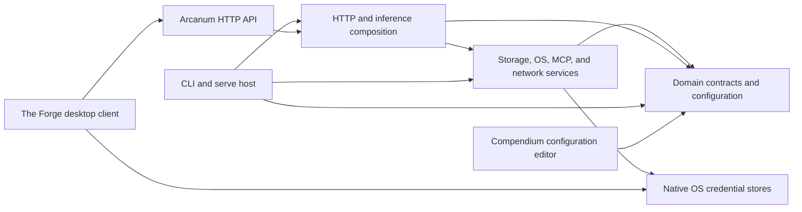
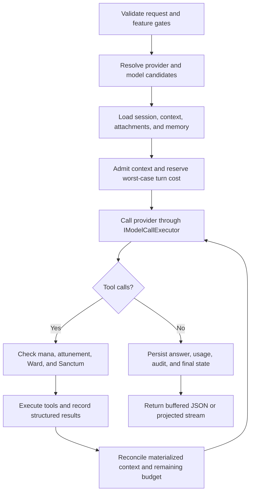

# Arcanum — Design Guide

This guide explains Arcanum in ordinary engineering language. It is meant to help a new contributor
form the right mental model before opening the larger technical reference.

[`Arcanum.DESIGN.md`](Arcanum.DESIGN.md) is authoritative for architecture and design details.
[`Arcanum.API.md`](Arcanum.API.md) owns exact HTTP routes, wire contracts, status mappings, and
public error codes. This guide is a readable map of the design, not a second source of truth.

## 1. Start with the document that owns the question

The repository has seven canonical documents and one focused companion:

- [`Arcanum.DESIGN.md`](Arcanum.DESIGN.md) owns architecture, design, persistence, runtime,
  packaging, and test contracts.
- [`Arcanum.API.md`](Arcanum.API.md) owns native and OpenAI-compatible HTTP contracts.
- [`Arcanum.Command.Reference.md`](Arcanum.Command.Reference.md) owns complete CLI syntax,
  options, aliases, interactive commands, output modes, and exit behavior.
- [`Arcanum.README.md`](Arcanum.README.md) is the contributor and operator primer.
- This guide explains how the pieces fit together.
- [`Compendium.README.md`](Compendium.README.md#complete-configuration-reference) is the complete
  public configuration reference.
- [`Arcanum.DEBUGGING.Human.md`](Arcanum.DEBUGGING.Human.md) is the verified breakpoint and
  debugging recipe guide.
- [`Arcanum.CHAT-LOOP.md`](Arcanum.CHAT-LOOP.md) is a focused companion for the shared model/tool
  loop, attachment continuation, context ledger, and Command Center context projection.

If two documents disagree, correct the one that does not own the contract: architecture follows
`Arcanum.DESIGN.md`, APIs follow `Arcanum.API.md`, CLI behavior follows
`Arcanum.Command.Reference.md`, and configuration follows `Compendium.README.md`.
Documentation changes travel with the behavior they describe.

## 2. What Arcanum is

Arcanum is a local-first AI host and command-line application built on .NET 10. The same executable
can run a short command or become the long-running HTTP server.

Its main jobs are:

- send prompts to configured OpenAI-compatible providers;
- preserve sessions and related data in an encrypted local Grimoire;
- expose native and OpenAI-compatible HTTP contracts;
- run a bounded model/tool loop with explicit security gates;
- search registered workspaces and session attachments;
- manage Campaigns, Spells, Prompts, Wards, Trials, Apprentices, and long-running operations;
- support CLI, Command Center, Compendium, and The Forge clients through server-owned contracts.

Arcanum does not manage a local inference runtime. Ollama is supported only through its
OpenAI-compatible `/v1` endpoint.

## 3. The shape of the solution

The important dependency direction is:

The projects have deliberately different responsibilities:

| Project | Human description |
|---|---|
| `RetroDownfall.Arcanum.Core` | Stable domain types, interfaces, settings, results, events, and source-generated JSON metadata. It does not own operating-system or network behavior. |
| `RetroDownfall.Arcanum.Secrets` | The small secret-protection boundary shared where credential handling must stay isolated. |
| `RetroDownfall.Arcanum.Infrastructure` | SQLCipher persistence, encrypted blobs, filesystem safety, workspace indexing, MCP transports, process isolation, logging, and external integrations. |
| `RetroDownfall.Arcanum.Api` | Endpoint registration, authentication filters, inference orchestration, tool execution, streaming, OpenAI compatibility, and public error mapping. |
| `RetroDownfall.Arcanum.Cli` | The shipping executable, command tree, API clients, terminal rendering, Command Center, and the `serve` host. |
| `RetroDownfall.Arcanum.Api.DevHost` | A debug-only host that mirrors server wiring without shipping as the product entry point. |
| `RetroDownfall.Compendium.Ux` | The Avalonia editor for the supported `arcanum.json` surface. |
| `RetroDownfall.TheForge.Core` and `.Ux` | The HTTP-only desktop inference client and workbench. |
| `tests/*` | Separate Arcanum, Compendium, and Forge verification graphs. |

The boundary rule is simple: clients do not reach into server persistence or the server filesystem.
They ask the API to do the work.

## 4. One executable, two lifetimes

Most commands are short-lived. They validate input, resolve saved context, call the local HTTP API,
render a result, and exit.

`arcanum run` is the main flexible short-lived inference entry. It accepts an instruction, bounded
piped context, or a one-line interactive prompt; stages repeated current-turn `--with @path` text or
images; resolves active Campaign, Workspace, Session, and Model; and selects the ordinary Agent
Loop, bounded research, a named Spell, or a read-only dry run. It does not create another host or
model loop.

`arcanum serve` takes the other path. It builds the host, loads configuration and protected
credentials, initializes the Grimoire, maps endpoints, starts background services, and listens on
the configured address.

The CLI may launch a local server when a supported interactive workflow needs one. That launch has
an ownership contract: the caller must not stop a server it did not start.

All direct commands share recursive process options:

- `--json` produces one typed JSON document on stdout;
- `--plain` disables terminal decoration;
- `--yes` is the only automatic confirmation;
- `--no-context` ignores saved CLI context for that invocation.

Prompts, progress, and diagnostics belong on stderr. Machine-readable payloads belong on stdout.
Public exit codes remain bounded to the documented set. The complete syntax, option, alias,
interactive-command, and exit-code contract is in
[`Arcanum.Command.Reference.md`](Arcanum.Command.Reference.md).

## 5. How an inference turn moves through the system

A turn is more than one provider request. A model may ask for tools, receive results, and make
another request before Arcanum has one final answer.

Buffered native requests, native streaming, `arcanum run` Agent/named-Spell execution,
OpenAI-compatible requests, Spell execution, Prompt execution, daemon jobs, and Apprentice steps
all converge on the same inference core. The `run --research` route uses the sole server research
orchestrator and brings its final synthesis back through the shared provider path. Projection
differs by surface, but there is not a separate “easy” path that bypasses accounting or security.

The loop stops on a final answer, deterministic lack of progress, cancellation, context failure,
elapsed-time or cost admission, or a hard `TurnLimits` boundary. The limits are code-owned so an
operator cannot accidentally configure away safety.

Reasoning budget is per inference turn (`PingRequest`), not a lifetime cap for a session. An agentic
turn can make several provider calls, and each call is accounted within the same reserved turn.

## 6. Context is admitted, not merely collected

Arcanum can draw context from chat history, the current request, session attachments, context pins,
workspace retrieval, attachment retrieval, the Lexicon, and Saga memory. Every source competes for
the model's finite context window.

The context materialization ledger records what was actually admitted during the current turn. It
prevents duplicate injection, tracks provenance, distinguishes explicit material from semantic
retrieval, and records context-pressure evictions. The ledger is in memory and is cleared when the
turn ends.

Explicit user material has priority. When space is tight, Arcanum drops lower-priority semantic
context before complete tool exchanges. It does not silently truncate an accepted explicit file.
If the request still cannot fit, the turn fails with a bounded public error.

Content read from a repository, attachment, webpage, tool, or memory is untrusted data. Arcanum
labels and fences it so instructions inside that data do not become system authority.

Unified `run` input follows the same rule. Positional words remain the instruction, while piped
stdin is a separate untrusted text source; neither replaces the other. The CLI reads at most
10 MiB of UTF-8 stdin and fails rather than truncating or dropping an unreadable pipe. Repeated
`--with @path` accepts strict-UTF-8 text regardless of extension and configured Scrying images,
including an explicitly supplied
absolute client path. Text diagnostics record byte/part counts and SHA-256; image diagnostics record
decoded bytes and SHA-256. Files and stdin share the existing 32-part, 1-MiB-per-part, 32-MiB
aggregate text authority; `--with` files do not inherit stdin's 10 MiB reader ceiling. The CLI then
sends typed content for server-side materialization. The
client path grants no durable permission or server filesystem authority. On a live route, an
Attachments-enabled host persists and Session-binds the supplied content before inference; an
Attachments-disabled host keeps it in memory for that turn. A dry-run never persists it.

## 7. Attachments, refresh, and durable memory

Session attachments contain encrypted bytes plus Grimoire metadata. Snapshot attachments preserve
the bytes supplied at one point in time. A live reference adds verified provenance to a file inside
a server Workspace, but its stored attachment is still a snapshot: inference and export never read
an arbitrary client path on demand.

`arcanum attachment add` reads a local file or stdin and uploads a snapshot without requiring that
client file to be inside a Workspace. `attachment reference` instead sends a workspace-relative
name for the server to resolve and authorize. That distinction preserves useful freedom for the
operator without turning a remote client path into server authority. Listing, metadata display,
version history, refresh, pin/unpin, export, stored-snapshot reveal, and the privacy disclosure are
all standalone commands; none requires an inference turn.

Files do not become invalid merely because Arcanum cannot extract them. Binary, PDF, and Office
snapshots remain encrypted, versioned, exportable attachments marked `NotEligible`; only text and
explicit vision-capable images can enter model context.

A bound refresh never trusts a model-supplied path. A model tool or standalone operator command
selects an opaque attachment id or logical key. The server reconstructs the stored source, rechecks
workspace containment, symlinks, file identity, and Sanctum, then performs two stable handle reads.
Detected MIME reclassifies the current bytes and reapplies that kind's size, UTF-8, and Scrying
policy. Model vision support is required only when the refreshed image will enter a model turn;
standalone refresh adds no such unrelated gate. Unchanged content reuses the existing version;
changed content creates the next bounded version with its current kind and MIME.

The Command Center displays backend-authoritative state:

- `Snapshot` means no live source is tracked;
- `Live` means the server revalidated a refreshable source;
- `Stale` means the source drifted, disappeared, became unsafe, or no longer matches its workspace.

File watcher events are only refresh hints. The UI does not hash files or infer `Live` on its own.

Text attachment pins can be admitted implicitly within the existing pin and turn budgets. Image
pins remain durable but report `Unsupported` for implicit materialization, because silently adding
an image would bypass explicit vision intent; pass the bound attachment GUID to `ask` or `chat`
instead. Those direct IDs use the same explicit-first ledger and reference budget.

Attachment metadata commands never write content to the terminal. Export is the deliberate
plaintext boundary: it uses a same-directory staged download and atomic replacement, asks before
overwriting unless `--yes` is present, and refuses stdout. Reveal opens the encrypted stored
snapshot artifact rather than the source or a decrypted copy, but only when the local artifact has
a valid `ARCABLOB` envelope; remote clients use export. The privacy explanation is
disclosure only and never adds an acknowledgement gate.

Attachment-derived facts may enter durable Lexicon or Saga memory only when their source was
materialized in the current turn. Index rows, failed reads, suppressed excerpts, and instructions
inside attachment text do not grant that authority. Delegated subagents receive only explicitly
allowed attachment values and remain otherwise sterile.

The exact continuation order is illustrated in
[`Arcanum.CHAT-LOOP.md`](Arcanum.CHAT-LOOP.md).

## 8. Persistence and recovery

The Grimoire is a local SQLCipher database accessed through EF Core repositories and hand-authored,
transactional SQL migrations. Important records include sessions and ordered entries, tool
interactions, attachments, context pins, Campaign data, Spells and Prompts, Wards, MCP trust,
memory, embeddings, operations, idempotency claims, inference runs, billable operations, budget
reservations, and audit data.

The persistence inventory in `Arcanum.DESIGN.md` is authoritative; there is no separate persistence
document. Attachment metadata belongs to the Grimoire while its authenticated encrypted snapshots
belong to the external attachment blob tree, and neither half is a complete backup by itself.

Several rules make persistence reliable:

- per-session writes are serialized;
- transient SQLite busy/locked failures use bounded retry with a fresh transaction;
- transcript order uses explicit `Sequence`, not timestamp guesswork;
- idempotency claims are durable before eligible work begins;
- long-running operations checkpoint and reconcile after interruption;
- atomic files use owner-only staging, durable flush, replacement, and identity-owned cleanup;
- security-sensitive reads use no-follow handles, size ceilings, and identity revalidation.

Arcanum is still in the pre-user-data schema phase. Incompatible local schemas are recreated rather
than upgraded through compatibility migrations. Follow the destructive recovery procedure in
[`Arcanum.README.md`](Arcanum.README.md#local-grimoire-reinstall) only after preserving anything
needed.

Persisted attachment and operation payloads use authenticated encrypted blobs. The file-encryption
lifecycle supports migration, verification, key rotation, resumable checkpoints, and safe retained
key retirement.

## 9. Security model

Arcanum is local-first, not trust-free.

The API key is operator-equivalent. It protects HTTP routes and can authorize file, network, MCP,
and inference actions that the configured edition and policies permit. The host defaults to
loopback and the `Local` edition.

Security checks are layered:

1. endpoint authentication;
2. edition and feature gates;
3. bounded request validation;
4. Ward policy for tool action;
5. Sanctum path policy for filesystem scope;
6. platform containment where supported;
7. bounded, sanitized output.

Host-process tools require the `Development` edition plus an explicit environment opt-in.
`workspace_check` has a narrower eligibility contract and is currently available only on an
eligible macOS host with active Seatbelt and a trusted .NET launch chain. It can execute
repository-authored build or test code, so it is never described as harmless file inspection.

Platform containment is not identical:

- macOS uses a filesystem-focused Seatbelt profile; child network remains available;
- Windows uses AppContainer for eligible tool children and assigns a Job Object before resume;
- Linux tool-child containment remains unavailable and fails closed;
- configured external MCP processes are trusted operator programs, not sandboxed repository tools.

Remote URLs pass SSRF checks. Public errors are stable and bounded; raw exceptions, secrets,
provider bodies, paths, and protected reasoning must not cross a client boundary.

Credential corruption fails closed. When an existing Grimoire depends on a protected secret,
Arcanum does not generate a replacement and continue against unreadable data.

## 10. HTTP and event contracts

Native routes use the `ApiResponse<T>` envelope and camelCase source-generated JSON. Failure
responses carry a stable code and sanitized message.

The `/v1` surface intentionally follows OpenAI shapes instead of the native envelope. It supports
the documented Chat Completions subset, embeddings, files, and asynchronous chat-completion
batches. Moderations, images, and audio are explicit `501 not_supported` stubs rather than partial
implementations.

Streaming contracts are typed:

- native inference uses NDJSON `IntelligenceEvent` frames;
- Session, Chronicle, live-log, MCP-lifecycle, and daemon-lifecycle subscriptions use separate SSE
  routes;
- OpenAI streaming projects the shared turn into OpenAI-compatible chunks.

Clients preflight each event discriminator before strict source-generated deserialization. Unknown
or malformed frames are skipped with bounded diagnostics where the client contract permits it.
Reasoning is typed and never transported through protected internal data.

The full route, DTO, status, and error-code reference is
[`Arcanum.API.md`](Arcanum.API.md#1-complete-api-surface).

The CLI gives these independent streams one observation grammar without merging them on the
server: `arcanum watch session`, `watch apprentice`, `watch logs`, `watch mcp`, `watch daemons`,
and `watch health`. `session watch` and `apprentice chronicle` remain compatibility aliases. SSE
heartbeats stay out of normal data output, `[DONE]` completes successfully, terminal timestamps are
UTC, event types are colored, and Ctrl+C exits `130`. Recursive `--json` emits only newline-delimited
source objects on stdout; all diagnostics remain on stderr.

Event-type and tool-name filters are repeatable, case-insensitive free-form values. Log category and
search remain free-form; level uses the server's known trace/debug/information/warning/error/critical
severities. Reconnect is opt-in and continues with capped exponential
delays until completion or cancellation, but every reconnect warns of a possible gap. A Session
cursor can narrow a gap; it is not a replay guarantee, and the process-local Chronicle/log/MCP/
daemon streams have none. Health polling defaults to five seconds and treats a valid Unhealthy 503
envelope as a snapshot. These are per-invocation choices, not new configuration or user limits;
normal API authentication and SSE connection caps still apply.

## 11. Workspaces, Campaigns, and tools

A Workspace is a registered server-host filesystem boundary. A Campaign is a persistent project
container for sessions, Spells, Prompts, Codex, and Sanctum policy. They are related but not
interchangeable.

That distinction matters when a CLI runs on another machine: a local client path is not
automatically a path on the server. Workspace commands call `/api/workspaces`; they do not bypass
the host and inspect the client filesystem.

Built-in tools are advertised only when the current request is eligible. Tool arguments are
bounded and parsed as structured data. File selectors resolve within registered boundaries.
Ambiguous resource names fail instead of silently choosing one.

MCP supports operator configuration over stdio and SSRF-guarded Streamable HTTP. Workspace-local
MCP configuration is merged only after digest-bound trust. Lifecycle, reload, discovery, and
diagnostic invocation remain server-owned and authenticated.

Web search, browse, and research are also server workflows. Research validates its limits and
prospective synthesis payload, resolves Campaign/Session context, and only then begins provider
search. Live synthesis uses the normal attachment pipeline. The CLI renders progress to stderr and
the final cited result to stdout, with optional atomic export or encrypted session attachment of the
final Markdown as a separate operation.

## 12. The user-facing applications

### CLI and Command Center

The normal CLI is good for scripts and focused commands. Interactive selectors are TTY-only;
non-interactive and JSON invocations never guess. Saved context can hold active Campaign,
Workspace, model, and session selections, with explicit command values taking precedence. See
[`Arcanum.Command.Reference.md`](Arcanum.Command.Reference.md) for every command and option.

The unified `run` verb defaults to ordinary inference. `--research` chooses bounded server-owned
research, while `--spell <exact-name-or-unique-prefix>` forces one named Spell without bypassing
normal loading, resonances, tools, Wards, or Sanctum. Those two route flags are the only conflict;
stdin, repeated `--with`, context, common sampling controls, and recursive `--plain` / `--json`
compose normally. `--dry-run` sends the resolved route and payload to the authenticated context
preview with retrieval disabled. It is a spend-free static pre-inference plan—not an exact live
request—and stops before search, embedding, main/synthesis inference, tools, spend reservation, and
persistence. A named Spell still resolves in the plan; a later live Agent handoff may add local
PatternSnapshot and Chronosync context.

The `attachment list|add|reference|show|versions|refresh|pin|unpin|export|reveal` family is an HTTP
client for the host-owned attachment lifecycle. Snapshot add may read any client-local path;
reference never does. `ask --attachment <guid>` and `chat --attachment <guid>` name bound Session
versions directly. Metadata and JSON remain content-free, while export is the explicit atomic
plaintext operation.

Command Center is the terminal-native session workbench. It combines streaming chat, Wards, human
prompts, attachment state, context telemetry, session mutation, and operator refresh without
creating a second backend.

### Compendium

Compendium is the Avalonia editor for supported public configuration. It edits references to
credential environment variables, not secret values. Reads are size-bounded, validation operates
on the complete snapshot, and saves use durable atomic replacement.

The public configuration model is intentionally smaller than the internal implementation. Retry
mechanics, workflow counts, fallback behavior, and other safety internals stay code-owned. Use
[`Compendium.README.md`](Compendium.README.md#complete-configuration-reference) for every retained
key, default, bound, dynamic dictionary shape, and credential reference.

### The Forge

The Forge is the desktop inference IDE and the name of related server-side Campaign, Spell, and
Prompt surfaces. Its desktop client communicates with Arcanum over HTTP only. The client uses
bounded response readers, strict typed contracts, asynchronous UI refresh, and atomic downloads.

## 13. Cost, caching, health, and telemetry

Cost admission reserves a conservative worst-case amount before a turn. Completed provider calls
reconcile that reservation using the pricing snapshot captured for the operation. Daily spend uses
completed billable operations plus outstanding reservations, not the session display cache.

Prompt caching is a provider request optimization, not a response cache. Arcanum still calls the
model. Only known OpenAI model families on the official HTTPS endpoint receive the built-in
key-only profile. Cache keys contain digests and stable identities, never prompt text, tool output,
attachment bytes, paths, PII, or secrets.

Health distinguishes readiness from perfection. A provider failure can make the service Degraded
while the readiness endpoint remains HTTP 200. An unhealthy Grimoire is the primary HTTP 503 gate.
That 503 still carries a valid success-envelope `HealthReportDto` with the Unhealthy components;
watchers should display it instead of collapsing it into a transport error. Deferred durable-operation
recovery is Degraded until repaired or reconciled.

Metrics use bounded labels. High-cardinality identities, prompt fragments, paths, cache keys,
session ids, and reasoning bodies do not become labels.

## 14. Native AOT, packaging, and configuration

Source-generated JSON, request delegates, generated regexes, and trimming annotations are design
constraints, not cleanup tasks. Windows and Linux publish the CLI as Native AOT. macOS ships a
self-contained folder while retaining the same AOT-safe code shape.

Package and distribution scripts live under `scripts/packaging`. Signing and notarization are
platform workflows; unsigned local artifacts retain the operating system's normal trust warnings.

Configuration is loaded from `~/.config/arcanum/arcanum.json`, environment variables, and protected
credential stores according to the precedence in the technical design. Changing ordinary
configuration requires a restart, not a Grimoire reinstall.

## 15. How changes should be developed

Behavior changes use test-driven development:

1. add a focused failing regression;
2. make the smallest production change that satisfies the contract;
3. run the focused test;
4. run the broader affected suite;
5. update every owning document;
6. run formatting, build, AOT, dependency, coverage-contract, and full-suite gates in proportion to
   the change.

The source style intentionally places a blank line after each C# statement except around brackets
and parentheses. Use the repository formatter rather than hand-normalizing unrelated files.

Useful entry points are:

- `ApiBootstrapper` for service and route composition;
- `WizardIntelligenceProvider`, `TurnExecutionCoordinator`, and `TurnEngine` for inference;
- `ModelCallExecutor` for provider calls and per-call accounting;
- `ToolExecutionPipeline` for tool gates and results;
- `GrimoireRepository` and specialized repositories for persistence;
- `CliCommandTree` and `CliApplicationFactory` for command/process contracts;
- `ArcanumConfigurationStore` for Compendium reads and saves.

For concrete breakpoints and recipes, use
[`Arcanum.DEBUGGING.Human.md`](Arcanum.DEBUGGING.Human.md).

## 16. Important limitations

Keep these boundaries in mind:

- provider support is OpenAI-compatible HTTP only;
- one request contains one user prompt; a session supplies multi-turn history;
- routing selects one model, with bounded provider fallback only before response commitment;
- there is no cross-provider load balancing;
- explicit accepted files are not silently truncated to fit context;
- Attachments-disabled live requests keep staged file/image content in memory for that turn, while
  Attachments-enabled live requests persist and Session-bind it before inference;
- Command Center uses a fixed terminal viewport and hard modal overlays;
- macOS child containment does not block network access;
- Linux tool-child containment is unavailable;
- external MCP subprocesses are trusted operator configuration;
- Comm Link webhooks are not HMAC-signed;
- the product is single-operator; `PromptId` acts as the human-input ownership capability;
- macOS packaging is self-contained rather than Native AOT;
- SQLCipher tests may skip when the native asset is unavailable.

The complete and more precise limitations list is
[`Arcanum.DESIGN.md` §16](Arcanum.DESIGN.md#16-known-limitations-and-operator-constraints).

## 17. Vocabulary

The fantasy names are functional labels:

| Term | Meaning |
|---|---|
| Grimoire | Encrypted local database |
| Campaign | Persistent project container |
| Workspace | Registered server filesystem boundary |
| Session / Entry | Conversation and ordered transcript item |
| Spell / Prompt | Reusable instruction and parameterized template |
| Ward / Sanctum | Tool policy and filesystem boundary |
| Mana | Token and context budget |
| Context preview | A dry, read-only pre-inference plan; live handoff may still add local context |
| Scrying | Image input |
| Eye of the World | Workspace perception |
| Weave / Divination / Imprint | Embedding substrate, search, and stored vector |
| Lexicon / Saga | Entity memory and associative memory |
| Memory inspection | Read-only status, sources, scoped search, eligibility explanation, and explicit Lexicon item deletion across otherwise separate stores |
| Apprentice | Durable agentic workflow |
| Unseen Servant | Scheduled background job |
| Comm Link | Notification integration |
| Chronicle | Bounded process-local Apprentice event stream; durable workflow/checkpoint rows are the recovery authority |
| Proving Grounds / Trial / Inquisitor | Ephemeral validation run |

`arcanum context inspect [prompt]` and `arcanum run --dry-run` are Arcanum's context planning
surfaces: they show where the window goes, which Spell and resonant instructions are active, which
tools are advertised or excluded, whether compression would apply, and which numbers are estimates.
The unified preview can also carry preview-only files/images, research synthesis policy, and common
inference options without executing or persisting them. It always disables retrieval and provider
work, so the result is a spend-free static plan rather than an exact live payload; an explicit Spell
still resolves, while local PatternSnapshot and Chronosync context may be added only at live handoff.
`context tools` and `context sources` focus the same response; `mana [prompt]` focuses the budget.
The normal view deliberately shows labels, reasons, and counts rather than private prompt text.
`--show-content` is the explicit operator reveal. The standalone context commands retain
`--no-retrieval` for the same no-embedding/RAG planning mode.

`arcanum memory status|sources|search|explain` answers the separate persistence question: what is
stored, where it came from, how long it remains, and whether it could participate in the next turn.
It does not assemble or spend a model turn. Search scope is explicit or visibly defaults to `all`,
and results stay attributed to Session, attachments, workspace, Saga, or Lexicon. This is a unified
view, not a unified store; disabling or deleting one source does not imply deletion of another.

The full vocabulary and cross-references are in
[`Arcanum.DESIGN.md` §17](Arcanum.DESIGN.md#17-glossary).
