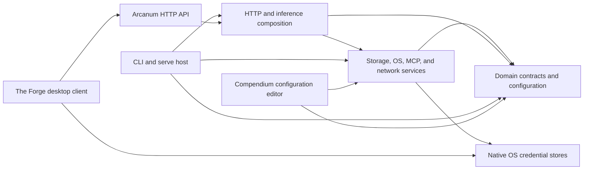
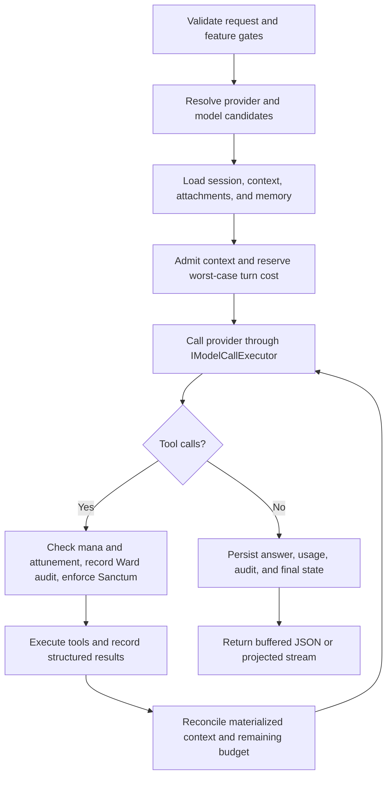

# Arcanum — Design Guide

This guide explains Arcanum in ordinary engineering language. It is meant to help a new contributor form the right mental model before opening the larger technical reference.

[`Arcanum.DESIGN.md`](Arcanum.DESIGN.md) is authoritative for architecture and design details. [`Arcanum.API.md`](Arcanum.API.md) owns exact HTTP routes, wire contracts, status mappings, and public error codes. This guide is a readable map of the design, not a second source of truth.

## 1. Start with the document that owns the question

The repository has six canonical implementation documents, one curated public front page, and one focused companion:

- [`Arcanum.DESIGN.md`](Arcanum.DESIGN.md) owns architecture, design, persistence, runtime, packaging, and test contracts.
- [`Arcanum.API.md`](Arcanum.API.md) owns native and OpenAI-compatible HTTP contracts.
- [`Arcanum.Command.Reference.md`](Arcanum.Command.Reference.md) owns complete CLI syntax, options, aliases, interactive commands, output modes, and exit behavior.
- [`README.md`](../README.md) is the curated public GitHub front page, not an implementation contract.
- This guide explains how the pieces fit together.
- [`Compendium.README.md`](Compendium.README.md#complete-configuration-reference) is the complete public configuration reference.
- [`Arcanum.DEBUGGING.Human.md`](Arcanum.DEBUGGING.Human.md) is the verified breakpoint and debugging recipe guide.
- [`Arcanum.CHAT-LOOP.md`](Arcanum.CHAT-LOOP.md) is a focused companion for the shared model/tool loop, attachment continuation, context ledger, and Command Center context projection.

If two documents disagree, correct the one that does not own the contract: architecture follows `Arcanum.DESIGN.md`, APIs follow `Arcanum.API.md`, CLI behavior follows `Arcanum.Command.Reference.md`, and configuration follows `Compendium.README.md`. Documentation changes travel with the behavior they describe.

## 2. What Arcanum is

Arcanum is a local-first AI host and command-line application built on .NET 10. The same executable can run a short command or become the long-running HTTP server.

Its main jobs are:

- send prompts to configured OpenAI-compatible providers, or — if you opt in — through the Claude Code or Codex CLI you already have installed;
- preserve sessions and related data in an encrypted local Grimoire;
- expose native and OpenAI-compatible HTTP contracts;
- run a progress-driven model/tool loop with explicit security gates;
- search registered workspaces and session attachments;
- manage Campaigns, Spells, Prompts, Wards, Trials, Apprentices, and long-running operations;
- support CLI, Command Center, Compendium, and The Forge clients through server-owned contracts.

Arcanum does not manage a local inference runtime. Ollama is supported through its OpenAI-compatible `/v1` endpoint. A **Familiar** — the Claude Code or Codex CLI you installed and signed in to yourself — is a transport, not a runtime: Arcanum runs it for one turn and reads its answer. It never installs it, never updates it, never signs in for you, and never looks at where that CLI keeps your credentials. Nothing happens until you add a provider of that kind to `arcanum.json`.

## 3. The shape of the solution

The important dependency direction is:

The projects have deliberately different responsibilities:

| Project | Human description |
|---|---|
| `RetroDownfall.Arcanum.Core` | Stable domain types, interfaces, settings, results, events, and source-generated JSON metadata. It does not own operating-system or network behavior. |
| `RetroDownfall.Arcanum.Secrets` | The small secret-protection boundary shared where credential handling must stay isolated. |
| `RetroDownfall.Arcanum.Infrastructure` | SQLCipher persistence, encrypted blobs, filesystem safety, workspace indexing, MCP transports, process isolation, logging, and external integrations. |
| `RetroDownfall.Arcanum.Api` | Endpoint registration, authentication filters, inference orchestration, tool execution, streaming, OpenAI compatibility, and public error mapping. |
| `RetroDownfall.Arcanum.Cli` | The shipping executable, command tree, API clients, terminal rendering, Command Center, and the `serve` host. |
| `RetroDownfall.Arcanum.Api.DevHost` | A debug-only host that mirrors server wiring without shipping as the product entry point. |
| `RetroDownfall.Compendium.Ux` | The Avalonia editor for the supported `arcanum.json` surface; it consumes Core preset contracts and the shared Infrastructure composition/persistence rather than duplicating them. |
| `RetroDownfall.TheForge.Core` and `.Ux` | The HTTP-only desktop inference client and workbench. |
| `tests/*` | Separate Arcanum, Compendium, and Forge verification graphs. |

The boundary rule is simple: clients do not reach into server persistence or the server filesystem. They ask the API to do the work.

## 4. One executable, two lifetimes

Most commands are short-lived. They validate input, resolve saved context, call the local HTTP API, render a result, and exit.

`arcanum run` is the main flexible short-lived inference entry. It accepts an instruction, piped context, or a one-line interactive prompt; stages repeated current-turn `--with @path` text or images; resolves active Campaign, Workspace, Session, and Model; and selects the ordinary Agent Loop, progress-driven research, a named Spell, or a read-only dry run. It does not create another host or model loop.

`arcanum serve` takes the other path. It builds the host, loads configuration and protected credentials, initializes the Grimoire, maps endpoints, starts background services, and listens on the configured address.

The CLI may launch a local server when a supported interactive workflow needs one. That launch has an ownership contract: the caller must not stop a server it did not start.

Application launch is a separate explicit workflow. `arcanum center` and `arcanum open center`enter the same Command Center host in the current process. `arcanum open theforge`,`open compendium`, and the Session/Campaign/Spell/Prompt/Apprentice forms first resolve the normal friendly selector and then start the desktop client. Their versioned deep link contains only safe, opaque server references and an initial view. It contains no credential, endpoint, prompt/file content, attachment, or server path, and it is passed as one argument without a shell. If the app is absent, Arcanum shows all attempted safe locations plus copyable development and CLI fallbacks. Side-by-side extracted Windows/Linux release folders are normal discovery candidates; Linux uses the folder matching the running `x64` or `arm64` architecture. Those displayed commands use PowerShell quoting on Windows and POSIX-shell quoting elsewhere; normal launch still uses structured arguments directly.

All direct commands share recursive process options:

- `--json` produces one typed JSON document on stdout;
- `--plain` disables terminal decoration;
- `--yes` is the only automatic confirmation;
- `--no-context` ignores saved CLI context for that invocation.

Prompts, progress, and diagnostics belong on stderr. Machine-readable payloads belong on stdout. Public exit codes remain bounded to the documented set. The complete syntax, option, alias, interactive-command, and exit-code contract is in[`Arcanum.Command.Reference.md`](Arcanum.Command.Reference.md).

## 5. How an inference turn moves through the system

A turn is more than one provider request. A model may ask for tools, receive results, and make another  request before Arcanum has one final answer.

Buffered native requests, native streaming, `arcanum run` Agent/named-Spell execution, OpenAI-compatible requests, Spell execution, Prompt execution, daemon jobs, and Apprentice steps all converge on the same inference core. The `run --research` route uses the sole server research orchestrator and brings its final synthesis back through the shared provider path. Projection differs by surface, but there is not a separate “easy” path that bypasses accounting or security.

The loop stops on a final answer, deterministic repeated no-progress, caller/host cancellation, an explicit token/cost policy, the provider/model's real request or context boundary, or a required safety/integrity denial. Arcanum does not assign a fixed number of calls, tool rounds, correction/retry  attempts, or total seconds to an otherwise progressing turn. Buffered and streaming surfaces share these terminal rules.

Reasoning budget is per inference turn (`PingRequest`), not a lifetime cap for a session. An agentic turn can make several provider calls, and each call is accounted within the same reserved turn.

Durable Session state follows the same distinction. Entry count and branch ancestry depth are not provider limits, so Arcanum does not reject them by total count. The pre-existing durable-pin admission setting remains unchanged. Reads and Campaign Logger consolidation page/checkpoint long history; one turn considers every already-accepted pin and applies disclosed per-pin/per-turn byte allocation only while materializing its content.

### Safety boundaries versus arbitrary restrictions

The useful distinction is the owner and failure model, not whether a number appears in code.

| Kind | Example | Product behavior |
|---|---|---|
| Security or integrity boundary | Authentication, workspace containment, SSRF/DNS checks, Sanctum, cryptographic framing | Fail closed and name the safe action; these are never silently bypassed. Ward records are audit, not authorization. |
| Provider/model fact | Context window, supported request shape, provider response frame | Adapt the request where possible, then name the provider/model fact and next model/compaction action. |
| Explicit operator policy | Token/cost budget, retention choice, allowlist | Stop exactly at the chosen policy and report measured/reserved state plus how to change or resume it. |
| Physical resource protection | One allocation/frame, concurrency admission, post-cancellation cleanup | Stream, page, queue, or checkpoint the rest; a local slice must not become a hidden total-work ceiling. |
| Arbitrary product restriction | Turn/hop/retry counter or total wall-clock deadline while progress continues | Remove it or replace it with cancellation and a deterministic progress/no-progress rule. |

[`Arcanum.ConstraintInventory.json`](Arcanum.ConstraintInventory.json) is the machine-reviewable classification, and [`Arcanum.ConstraintReduction.20260803.md`](Arcanum.ConstraintReduction.20260803.md) explains those removals. A retained-boundary error should say who owns the boundary, the safe measured value and limit, whether state was saved/checkpointed, and the exact continuation or recovery action.

## 6. Context is admitted, not merely collected

Arcanum can draw context from chat history, the current request, session attachments, context pins, workspace retrieval, attachment retrieval, the Lexicon, Saga memory, and The Tapestry. Every source competes for the model's finite context window.

Most of those sources answer "which snippet matches this question?" The Tapestry answers a different one: "what is this whole body of material actually about?" It builds layered summaries over the code, attachments, and conversations Arcanum has already indexed — groups of related chunks summarized together, then those summaries summarized again — so a question that spans a hundred files has something to match against besides a hundred disconnected fragments. Retrieval draws from both the exact excerpts and the summaries above them.

Two honesty rules matter here. A summary is a model's paraphrase, so it is injected as untrusted data alongside the exact material rather than in place of it, and it is the first thing dropped when the window is tight — an exact excerpt outranks a description of one. And because a summary and one of the excerpts underneath it would say much the same thing, Arcanum keeps whichever one better answers the current question and drops the other rather than spending the budget twice on the same material.

The context materialization ledger records what was actually admitted during the current turn. It prevents duplicate injection, tracks provenance, distinguishes explicit material from semantic retrieval, and records context-pressure evictions. The ledger is in memory and is cleared when the turn ends.

Explicit user material has priority. When space is tight, Arcanum drops lower-priority semantic context before complete tool exchanges — Tapestry summaries first, then Saga, then workspace retrieval, then attachment retrieval. It does not silently truncate an accepted explicit file. If the request still cannot fit within the provider/model's real context window, the turn fails with a classified public error that names the owner, measured value/limit when safe, whether work was saved, and the exact compaction, continuation, or model-selection action.

Verbose `execute_command` output follows that continuation rule. One tool response keeps a bounded preview, while complete decoded UTF-8 stdout/stderr streams into owner-only artifacts scoped to the current internal MCP connection. The model receives only an opaque handle and uses automatically attuned `read_command_output` with returned byte offsets to page the rest. There is no product total artifact quota. Random-access reads keep the live owner-only files behind opaque handles. Reading a stream's final page immediately releases and deletes it; failure, cancellation, connection disposal, and abrupt process exit remain cleanup backstops. Complete stdout and stderr share the existing explicit Sanctum `MaxFileWriteMb` operator policy, so crossing its measured byte limit stops the process tree, deletes partial output, and reports the exact quiet-rerun or policy-change action. There is no separate product-owned total.

Content read from a repository, attachment, webpage, tool, or memory is untrusted data. Arcanum labels and fences it so instructions inside that data do not become system authority.

Unified `run` input follows the same rule. Positional words remain the instruction, while piped stdin is a separate untrusted text source; neither replaces the other. The CLI reads at most 10 MiB of UTF-8 stdin and fails rather than truncating or dropping an unreadable pipe. Repeated `--with @path` accepts strict-UTF-8 text regardless of extension and configured Scrying images, including an explicitly supplied absolute client path. Text diagnostics record byte/part counts and SHA-256; image diagnostics record decoded bytes and SHA-256. Files and stdin share 1-MiB-per-part and 32-MiB aggregate text authority without a file/part-count ceiling; `--with` files do not inherit stdin's 10 MiB reader ceiling. The CLI then sends typed content for server-side materialization. The client path grants no durable permission or server filesystem authority. On a live route, an Attachments-enabled host persists and Session-binds the supplied content before inference; an Attachments-disabled host keeps it in memory for that turn. A dry-run never persists it.

## 7. Attachments, refresh, and durable memory

Session attachments contain encrypted bytes plus Grimoire metadata. Snapshot attachments preserve the bytes supplied at one point in time. A live reference adds verified provenance to a file inside a server Workspace, but its stored attachment is still a snapshot: inference and export never read an arbitrary client path on demand.

`arcanum attachment add` reads a local file or stdin and uploads a snapshot without requiring that client file to be inside a Workspace. `attachment reference` instead sends a workspace-relative name for the server to resolve and authorize. That distinction preserves useful freedom for the operator without turning a remote client path into server authority. Listing, metadata display, version history, refresh, pin/unpin, export, stored-snapshot reveal, and the privacy disclosure are all standalone commands; none requires an inference turn.

Files do not become invalid merely because Arcanum cannot extract them. Binary, PDF, and Office snapshots remain encrypted, versioned, exportable attachments marked `NotEligible`; only text and explicit vision-capable images can enter model context.

A bound refresh never trusts a model-supplied path. A model tool or standalone operator command selects an opaque attachment id or logical key. The server reconstructs the stored source, rechecks workspace containment, symlinks, file identity, and Sanctum, then performs two stable handle reads. Detected MIME reclassifies the current bytes and reapplies that kind's size, UTF-8, and Scrying policy. Model vision support is required only when the refreshed image will enter a model turn; standalone refresh adds no such unrelated gate. Unchanged content reuses the existing version; changed content creates the next bounded version with its current kind and MIME.

The Command Center displays backend-authoritative state:

- `Snapshot` means no live source is tracked;
- `Live` means the server revalidated a refreshable source;
- `Stale` means the source drifted, disappeared, became unsafe, or no longer matches its workspace.

File watcher events are only refresh hints. The UI does not hash files or infer `Live` on its own.

Text attachment pins can be admitted implicitly within the existing per-pin and per-turn byte budgets. Image pins remain durable but report `Unsupported` for implicit materialization, because silently adding an image would bypass explicit vision intent; pass the bound attachment GUID to `run --attachment` instead. Those direct IDs use the same explicit-first ledger and reference budget.

Attachment metadata commands never write content to the terminal. Export is the deliberate plaintext boundary: it uses a same-directory staged download and atomic replacement, asks before overwriting unless `--yes` is present, and refuses stdout. Reveal opens the encrypted stored snapshot artifact rather than the source or a decrypted copy, but only when the local artifact has a valid `ARCABLOB` envelope; remote clients use export. The privacy explanation is disclosure only and never adds an acknowledgement gate.

Attachment-derived facts may enter durable Lexicon or Saga memory only when their source was materialized in the current turn. Index rows, failed reads, suppressed excerpts, and instructions inside attachment text do not grant that authority. Delegated subagents receive only explicitly allowed attachment values and remain otherwise sterile.

Saga extraction itself is progress-driven. A deduplicated queue walks Session history oldest-first through timestamp-group-safe checkpoint pages, advances its watermark only after persistence, and retries a failed page. It has no user-tuned interval/window/output cap or total memory-count ceiling; provider capability, paged retrieval, explicit deletion, retention, and cancellation own those boundaries.

The exact continuation order is illustrated in [`Arcanum.CHAT-LOOP.md`](Arcanum.CHAT-LOOP.md).

## 8. Persistence and recovery

The Grimoire is a local SQLCipher database accessed through EF Core repositories and hand-authored SQL. Its shape is a declarative schema project rather than a migration history: one small `.sql` file per table, full-text index, and trigger, each holding that object's complete definition, all installed together in a single transaction the first time the database is created. There is no numbered chain to replay and no bookkeeping table recording which steps ran, so "what does this table look like?" is answered by opening one file. Important records include sessions and ordered entries, tool interactions, attachments, context pins, Campaign data, Spells and Prompts, Wards, MCP trust, memory, embeddings, operations, idempotency claims, inference runs, billable operations, budget reservations, and audit data.

The persistence inventory in `Arcanum.DESIGN.md` is authoritative; there is no separate persistence document. Attachment metadata belongs to the Grimoire while its authenticated encrypted snapshots belong to the external attachment blob tree, and neither half is a complete backup by itself. Use the supported encrypted `.arcbackup` workflow rather than copying a live database and WAL files.

Several rules make persistence reliable:

- per-session writes are serialized;
- transient SQLite busy/locked failures use capped per-delay backoff with a fresh transaction until success, non-transient failure, or cancellation;
- transcript order uses explicit `Sequence`, not timestamp guesswork;
- idempotency claims are durable before eligible work begins;
- long-running operations checkpoint and reconcile after interruption;
- atomic files use owner-only staging, durable flush, replacement, and identity-owned cleanup;
- security-sensitive reads use no-follow handles, size ceilings, and identity revalidation.

Arcanum is still in the pre-user-data schema phase, which is exactly why the schema has no migration machinery: there is nobody to migrate. A schema change edits the object file in place, and an incompatible local database is recreated rather than upgraded. Follow the destructive recovery procedure in [`README.md`](../README.md#local-grimoire-reinstall) only after preserving anything needed.

Persisted attachment and operation payloads use authenticated encrypted blobs. The file-encryption lifecycle supports migration, verification, key rotation, resumable checkpoints, and safe retained key retirement.

### Portable backup is one verified recovery generation

`arcanum backup create` composes the distributed state through a typed inventory and a live SQLite backup, so the host can remain active without an unsafe `File.Copy` of SQLCipher/WAL files. The available scopes cover the full installation, configuration/authored assets, sessions/memory, one specific Session, or a metadata-only diagnostic. Include/exclude overrides name only known Arcanum components; they never grant access to arbitrary host paths, and exclusion wins if both overrides name the same component. A specific-Session scope requires its Session id; broader scopes may carry one as provenance without narrowing what they contain. Dry-run uses the same inventory as creation and shows size, missing files, nonportable paths, exclusions, and security warnings.

The default full scope includes the database/KDF, configuration, encrypted attachments and file/batch artifacts, Codex/Spells, global MCP configuration, CLI/The Forge state, Compendium settings/certificates, and a filtered portable recovery-key document. It does not export the raw OS credential store, Data Protection key ring, environment secret values, or external workspaces. Configuration inventory also carries a committed preset provenance/rollback pair beside `arcanum.json`; it never carries the transient preset transaction journal. The pair is omitted unless both sidecars exist with matching fingerprints and no recovery journal is pending. An incomplete/mismatched pair fails the component; a pending journal prevents capture of a possibly mid-transaction configuration until preset recovery completes. Verification treats the retained paths as authenticated configuration state. Trusted MCP paths, audit/guardrail logs, and the master API key are explicit-only; global MCP configuration is normal authored state but is flagged because literal environment values may be present. A specific-Session archive is not a logical privacy export: it includes only matching attachments and omits global uploaded/batch files by default, but the version-1 physical database is still indivisible and therefore discloses collateral global/accounting rows in the encrypted manifest. The global file components remain available only through explicit typed inclusion.

`ARCABACK` version 1 keeps only bounded format/KDF/encryption metadata in its outer header. The manifest, SHA-256 inventory, portable keys, and selected content are streamed inside an authenticated PBKDF2/AES-256-GCM envelope. Passphrases come from hidden input, a named environment variable, or an inherited file descriptor—never a literal process argument. Creation uses owner-only same-directory staging, durable flush, full self-verification, and atomic no-clobber publication. Required-file, identity, checksum, cancellation, and verification failures publish nothing.

Outer inspection and listing need no passphrase. Passphrase-backed inspection authenticates the manifest without exposing file content; verification authenticates every chunk, compares every size/hash, and opens the extracted SQLCipher snapshot in an owner-only temporary root.

### Restore commits everything or nothing

`arcanum backup restore` consumes exactly that artifact, and it never restores half a generation. Every refusal it can make — unsupported newer format, wrong passphrase, failed checksum, absent recovery material, invalid path mapping, a Campaign mapping this machine cannot honour, an unrecognized protected-state choice, not enough disk, a running host holding the maintenance lock — happens before the first destructive step, so a rejected restore leaves the installation byte-identical. `--dry-run` runs all of that and reports the exact plan without touching anything.

Committing is two directory renames guarded by a journal that lives on the filesystem rather than in the database being replaced. That is the whole point: an interrupted restore resolves at the next start to a complete commit, a complete rollback, or an explicit reconciliation request. There is no arrangement of failures that produces a mixture of old and new trees. Startup does that work before it creates or opens anything, and it decides which tree is the installation from the volume and file identifiers a rename preserves rather than from which name happens to be occupied — so a directory that merely sits where the live root used to be is never adopted, and a start that cannot identify one complete tree stops and says so instead of opening the wrong one. The destination's Data Protection key ring and its existing archives ride across the swap, because those belong to this machine, not to the backup.

A restore of an installation that keeps Covenant memory does more than move files. The archive describes a different machine, so before anything is displaced the staged copy is stripped of every capability that only made sense there — the write intents and pending deletions that name files on the old machine, the resolved workspace directories each Campaign was bound to — and given a new identity of its own, so a token minted before the restore cannot be presented after it. What the destination knows about itself is merged in rather than overwritten: if this machine was ever exposed to unsandboxed tools, restoring a clean archive does not unsay that, and the record of what has already left the installation can only grow. Turns the old machine was in the middle of are closed out as interrupted, because their owner is gone. Campaigns come back needing to be pointed at a directory again, which is deliberate: the proof that a directory belongs to a Campaign is not something a backup can carry. Through all of it the installation is closed to ordinary work under a single operation, and it reopens exactly once, at the end, only after everything that operation promised to clean up has been proven done. Anything less leaves it closed and says so, and the next start picks up the same operation where it stopped.

What such a restore will *not* do is quietly reinstate the memory itself. An archive that carries Covenant memory is carrying a standing agreement between an operator and an agent, and putting it back on a machine nobody chose it for is a decision only the operator can make — so by default the restore refuses, before it has staged anything or closed the installation to ordinary work, and says which explicit choice would let it continue. There are two, and each needs its own answer on top of the one that authorized replacing the installation. Keeping the memory is only offered when the machine the backup came from could still prove it had never been exposed to unsandboxed tools; if it could not, keeping the memory is refused outright and the only way forward is to say, explicitly, that it should be destroyed. That path removes the whole of it from the staged copy before anything is displaced — the memory, its search index, and every record marking some other piece of content as derived from it — while keeping the two things that are not the operator's to erase: what this machine already knows about its own exposure, and the count of what has already left it. Before that question is asked at all, the operator is told plainly that nothing local can un-send what a provider already received, how many attempts could already have carried content out, and where to go to ask for external deletion. Declining leaves the installation exactly as it was found, with nothing staged and nothing to recover from. The choice is spelled `--protected-state`, and it takes exactly the three words the design has always used for it — refuse, keep, destroy — with refusing as the default when the option is left off. A word it does not recognize is refused before the passphrase is even asked for, rather than quietly treated as the safe default, because an operator who typed a value meant one.

An encrypted archive is one way protected memory can leave a machine. The other is a plaintext export, and that one is simply refused. A session that holds any Covenant-derived material — an answer, a tool result, a summary, its own title, a Saga or Lexicon entry, something derived from an attachment, or a search projection of any of those — cannot be written out as a readable JSON or Markdown file. The refusal happens before the transcript is even assembled, so nothing protected is gathered in order to explain why it will not be sent, and there is no confirmation that overrides it: an encrypted archive can be deleted or kept under a passphrase, but a plaintext file is out in the world the moment it exists. A session whose protected artifacts were later destroyed is still refused, because destroying them does not unmake the fact that the session held them; the supported way to move such a session is the backup this section is otherwise about. A campaign bundle is a different case, because it never carried that memory in the first place — but it used to leave it out silently, so a campaign with protected memory and a campaign with none produced identical files. It now states in plain numbers how much it left behind, separated into memory the operator authored and other content derived from it, because an operator moving a campaign to another machine needs to know which of the two the bundle is short of.

A clean machine is the interesting case. The archive carries its Grimoire secret and the referenced file-encryption keys in portable wrapped form, and restore re-wraps them with the destination's own platform protection — the source machine's credential store is never consulted. Older supported snapshots converge through the same declarative schema installer the host uses at startup, so there is no migration history to hand-edit and no separate upgrade path to keep honest.

Paths recorded elsewhere are rewritten through typed mappings for campaign, workspace, Codex, Spell, and attachment-provenance roots, and Windows and Unix roots interoperate properly rather than approximately. That is a rewrite of *where* something lives, and it is a different question from which Campaign an imported Session belongs to — the two have separate options for exactly that reason. Anything no mapping claims is reported, not guessed. Restored attachment snapshots stay readable even when their workspace does not exist here, but their live source is marked unrefreshable until that workspace is rebound and revalidated — a path that now points at unrelated content must not silently become a refresh source. For the same reason, trusted MCP workspace metadata is withheld rather than installed, `Host:ListenAny` is reset to false, and the archived master API key is adopted only when asked for. Those are authorizations granted on another machine.

Beyond wholesale replacement there is a new-profile mode that installs data beside an untouched installation, and a selective Session import that merges chosen Sessions into a live installation, remapping colliding ids and deduplicating attachment payloads it already has. A Session the archive had bound to a Campaign is never imported loose: the operator supplies `--map-campaign`, naming the archived Campaign and the one on this machine it should land in, by identity rather than by name — the archive's names mean nothing here, and matching by name would follow a rename on either machine into a binding nobody chose. A mapping to a Campaign this installation does not have is refused before anything is staged, and a Campaign-bound Session with no mapping is refused with the archived Campaign named, so the operator can see what the mapping has to say. On an installation that does not run the governed-memory arm at all, the option is refused outright rather than quietly ignored — that import cannot bind a Session to any campaign, and an option that silently does nothing is worse than one that is not offered.

### Retention is plan-first

Unified retention still sits above the existing stores, and `Covenant` still has no age-based rule. Its full status and reset-plan envelopes may carry an optional Covenant inventory object containing only five counts: rows, managed files, local erasure artifacts, affected Sessions, and receipt-backed possible disclosures. No subject, key, path, or Campaign identity enters that object. An explicit family erasure is the only removal path. Preflight uses the exclusive lease's nonempty dataset and one private, unpooled, initialized, drain-enrolled read transaction, validates the healthy catalog on that same WAL-visible snapshot, exhausts labels and producers in keyset pages of at most 256, and refuses malformed or ambiguous managed ownership before effects. Database batches replay before the canonical transaction and managed batches afterwards. Nonrevocable disclosures fold with checked arithmetic into an exact or lower-bound exposure.

The same singleton warm writer implements both disclosure journalling and lifecycle control. Quiesce closes admission, drains writes, and releases its enrolled handle; every pre-effect failure must restore that old-generation writer before `RollbackAndReopen`, while restoration failure keeps the scope closed. After immutable proof, caller cancellation no longer reaches `ReopenedVerified`, publication, writer restart, disposition, or durable failure recording. Publication installs prepared keys, authority, and availability as one runtime generation and invalidates all six old token families. Retained restore and Campaign-root credentials are evidence and identity secrets, not tokens that survive reset.

Disposition is attempted once, never followed by a fallback, and uncertainty is durably recorded as `ReconciliationRequired` with `Covenant.MaintenanceFailed`. Current reset and factory-erasure recovery handlers resume only the leased durable owner. Before readiness, the lock-owning bootstrap adopts exactly one validated owner, preserves the local-erasure/schema-repair order, and publishes readiness immediately before marking ready; a no-lock coexisting CLI performs no scan, adoption, or freeze.

Real composed SQLCipher acceptance proves same-process old-lease revocation, all-six-token rejection, warm-writer and ordinary-read freshness, plus fresh-process adoption and resume. The public data-lifecycle routes now enter that coordinator. A Covenant reset first returns the content-free plan under one read lease held through response serialization; the CLI sends that plan id back as `expectedPlanId`, so a change in the ordinary plan or its five bound inventory counts is refused before effects, and apply commits the exact owner before it closes admission. It does not turn the preview aggregates into deletion totals. Global factory apply likewise requires a measurable inventory, healthy catalog, and exclusive lifecycle even when inference use is disabled; missing proof is a refusal, never an ordinary-only deletion path. Protected request/installation planning that cannot supply its required live lease fails closed, while ordinary prune/workspace planning and feature-off status keep their prior behavior. Factory reset keeps its broad behavior by running ordinary factory cleanup after `ManagedArtifactsProcessed` but before `HandlesClosed`. If recovery sees the former boundary it repeats the idempotent cleanup; if it sees the latter or anything after it, it skips it. One exact-owner lease maintainer surrounds factory work immediately after durable start through re-plan, proof, checkpoint, coordinator, ordinary cleanup, and terminalization, and surrounds V0/V1 factory and V3 reset recovery under the adopted owner. Ownership loss stops work and asks for attention without exposing checkpoint content. The ten phases and checkpoint versions stay unchanged.

Destructive work starts with the same server-owned plan used by dry-run. The plan reports rows, files, estimated bytes, derived records, pins/holds, and active-work conflicts. A sweep may continue with unrelated eligible candidates while leaving blocked ones untouched; deleting one selected session, attachment, or memory scope remains all-or-nothing. Active durable operations, inference, idempotency leases, budget reservations, and batches are never treated as old disposable history. Status includes the owned companion/index/provenance rows of composite data classes and measures only managed files that presently exist. If a sweep candidate becomes protected after planning, it is preserved with a `Data.PlanChanged` diagnostic, later independent candidates can continue, and the durable cursor remains before the earliest preserved candidate for re-evaluation.

Deletion follows ownership. Attachment bytes, chunks, embeddings, and index state leave with the attachment; Entry and workspace embeddings leave with their source rows. Batch references protect uploaded files. Saga and Lexicon facts remain separate: deleting a source attachment preserves the fact and its typed provenance, which then honestly reports that the source is unavailable.

Checkpoint recovery resumes the bounded candidate snapshot at its saved cursor. Each selected candidate rechecks its active-work and ownership conditions, and apply verifies the candidate's owned rows, derived records, and files after deletion. This is intentionally a bounded candidate-local check, not a global orphan sweep.

Factory reset is bounded to the configured Arcanum data root and explicitly preserves external backups, configuration, keys/security material, and data outside that root. Its protected and ordinary stages share one exclusive lifetime, so no provider dispatch or protected writer can enter between ordinary cleanup and the final WAL/sidecar proof and reopen. Logical SQL deletion and file unlinking are not physical secure erasure: SSD wear leveling, copy-on-write snapshots, WAL/free pages, caches, replicas, and backups can retain copies. It adds no schema object and does not require recreating a local or test database. The Forge-owned local histories are outside this implementation boundary and remain untouched; no coordinated cleanup integration is added. A successful reset clears prior terminal operation history but necessarily leaves its own completed durable-operation marker as the audit/recovery record. Managed files first move to identity-verified, owner-only quarantine: rollback restores them, successful commit finalizes deletion, and restart recovery resumes any quarantine left by a crash.

## 9. Security model

Arcanum is local-first, not trust-free.

The API key is operator-equivalent. It protects HTTP routes and can authorize file, network, MCP, and inference actions that the configured edition and policies permit. The host defaults to loopback and the `Local` edition.

Security checks are layered:

1. endpoint authentication;
2. edition and feature gates;
3. bounded request validation;
4. explicit tool-advertisement policy plus a Ward audit record;
5. Sanctum path policy for filesystem scope;
6. platform containment where supported;
7. bounded, sanitized output.

Host-process tools require the `Development` edition plus an explicit environment opt-in. `workspace_check` has a narrower eligibility contract and is currently available only on an eligible macOS host with active Seatbelt and a trusted .NET launch chain. It can execute repository-authored build or test code, so it is never described as harmless file inspection.

A Ward is an **audit record**, not consent or containment. Every server-executed tool call records an immediate `ungated` Ward pair and continues without a prompt. `ForbiddenArts` defaults empty and only hides named tools when the request explicitly selects `noForbiddenArts`; it never blocks an invocation. `UnattendedMode` controls whether genuine human-input tools are offered, not whether ordinary tools execute. Sanctum, workspace containment, platform eligibility, tool capabilities, and explicit operator policies remain the real boundaries, and removed Ward approval keys are rejected instead of becoming hidden ways to restore a prompt.

Platform containment is not identical:

- macOS uses a filesystem-focused Seatbelt profile; child network remains available;
- Windows uses AppContainer for eligible tool children and assigns a Job Object before resume;
- Linux tool-child containment remains unavailable and fails closed;
- configured external MCP processes are trusted operator programs, not sandboxed repository tools.

Remote URLs pass SSRF checks. Public errors are stable and bounded; raw exceptions, secrets, provider bodies, paths, and protected reasoning must not cross a client boundary.

Credential corruption fails closed. When an existing Grimoire depends on a protected secret, Arcanum does not generate a replacement and continue against unreadable data.

## 10. HTTP and event contracts

Native routes use the `ApiResponse<T>` envelope and camelCase source-generated JSON. Failure responses carry a stable code and sanitized message.

The authenticated `/api/data/*` family separates read-only status/planning from confirmed operation-specific mutation. API callers can bind apply to a prior preview with `expectedPlanId`; the server re-plans and returns `Data.PlanChanged` rather than applying a changed candidate graph.

The `/v1` surface intentionally follows OpenAI shapes instead of the native envelope. It supports the documented Chat Completions subset, embeddings, files, and asynchronous chat-completion batches. Moderations, images, and audio are explicit `501 not_supported` stubs rather than partial implementations.

Batch JSONL length is also total work rather than one allocation. The background processor streams internal 64-line processing pages with page-scoped token/cost reservation and a durable checkpoint before and after each provider dispatch. Completed output publishes in input order and is skipped on resume; a dispatched line with no recorded result after host failure becomes `batch_interrupted_after_dispatch` instead of being replayed. Processing continues to EOF or cancellation. An explicit budget rejection leaves prior output available and identifies the first remaining line so work can be continued under a changed operator policy. Queued/progressing batches also have no age deadline: `completion_window` remains wire-compatible metadata, host shutdown leaves durable state for startup reconciliation, and only explicit cancellation or a real terminal failure stops the work.

Streaming contracts are typed:

- native inference uses NDJSON `IntelligenceEvent` frames;
- Session, Chronicle, live-log, MCP-lifecycle, and daemon-lifecycle subscriptions use separate SSE routes;
- OpenAI streaming projects the shared turn into OpenAI-compatible chunks.

Clients preflight each event discriminator before strict source-generated deserialization. Unknown or malformed frames are skipped with bounded diagnostics where the client contract permits it. Reasoning is typed and never transported through protected internal data.

The full route, DTO, status, and error-code reference is [`Arcanum.API.md`](Arcanum.API.md#1-complete-api-surface).

The CLI gives these independent streams one observation grammar without merging them on the server: `arcanum watch session`, `watch apprentice`, `watch logs`, `watch mcp`, `watch daemons`, and `watch health`. `watch <source>` is the only live-stream entry; the former `session watch` and `apprentice chronicle` spellings are removed. SSE heartbeats stay out of normal data output, `[DONE]` completes successfully, terminal timestamps are UTC, event types are colored, and Ctrl+C exits `130`. Recursive `--json` emits only newline-delimited source objects on stdout; all diagnostics remain on stderr.

Event-type and tool-name filters are repeatable, case-insensitive free-form values. Log category and search remain free-form; level uses the server's known trace/debug/information/warning/error/critical severities. Reconnect is opt-in and continues with capped exponential delays until completion or cancellation, but every reconnect warns of a possible gap. A Session cursor can narrow a gap; it is not a replay guarantee, and the process-local Chronicle/log/MCP/daemon streams have none. Health polling defaults to five seconds and treats a valid Unhealthy 503 envelope as a snapshot. These are per-invocation choices, not new configuration or user limits; normal API authentication and SSE connection caps still apply.

## 11. Workspaces, Campaigns, and tools

A Workspace is a registered server-host filesystem boundary. A Campaign is a persistent project container for sessions, Spells, Prompts, Codex, and Sanctum policy. They are related but not interchangeable.

That distinction matters when a CLI runs on another machine: a local client path is not automatically a path on the server. Workspace commands call `/api/workspaces`; they do not bypass the host and inspect the client filesystem.

Built-in tools are advertised only when the current request is eligible. Tool arguments are bounded and parsed as structured data. File selectors resolve within registered boundaries. Ambiguous resource names fail instead of silently choosing one.

Repository size and catalog cardinality are not themselves failures. Directory/search results, resource selectors, TRX summaries, Eye/workspace/Spell discovery, Spell dependency graphs, and Spell search continue through cursor pages, iterative traversal, or cycle-safe graph exhaustion. `list_directory` tracks canonical visited-directory identities so it can show a contained symlink once without following a cycle. Campaign-backed workspace discovery follows every advancing repository page. When sqlite-vec is unavailable, managed Divination streams and scores every matching BLOB row with caller cancellation and bounded top-K memory instead of stopping at 50,000.`apply_patch` bounds one request, each file, the reversible output/staging plan, and failure cleanup, but does not add elapsed/file/hunk/line/result totals. Campaign rows and attachment references, versions, inline files, and delegated files likewise have no incidental count ceiling; concrete bytes, provider context, provenance, integrity, cancellation, and explicit retention remain.

MCP supports operator configuration over stdio and SSRF-guarded Streamable HTTP. Workspace-local MCP configuration is merged only after digest-bound trust. Lifecycle, reload, discovery, and diagnostic invocation remain server-owned and authenticated. Initialization and HTTP connection establishment retain local deadlines because no usable server exists yet; after connection, a tool invocation has no Arcanum-owned total request duration and stops on completion, terminal protocol/provider failure, or caller cancellation.

Web search, browse, and research are also server workflows. Research validates an optional positive source target plus explicit synthesis-token and optional cost policy, validates its prospective synthesis payload, resolves Campaign/Session context, and only then begins provider search. It continues while a pass discovers new unique URLs and stops at the target, deterministic source exhaustion/no-progress, cancellation, explicit policy, or provider/safety failure—not a hop count. Connection/idle I/O deadlines protect stalled transport work without imposing a whole-research wall-clock limit. Live synthesis uses the normal attachment pipeline. The CLI renders progress and terminal reason to stderr and the final cited result to stdout, with optional atomic export or encrypted session attachment of the final Markdown as a separate operation.

## 12. The user-facing applications

### CLI and Command Center

The normal CLI is good for scripts and focused commands. Interactive selectors are TTY-only; non-interactive and JSON invocations never guess. Saved context can hold active Campaign, Workspace, model, and session selections, with explicit command values taking precedence. See [`Arcanum.Command.Reference.md`](Arcanum.Command.Reference.md) for every command and option.

The chat renderer keeps one Markdig/Spectre allocation bounded by parsing at most 256 Ki characters at a time, but lazily renders every chunk in order. Large valid answers take longer to display; they are not replaced by a truncation marker.

The unified `run` verb defaults to ordinary inference. `--research` chooses progress-driven server-owned research, while `--spell <exact-name-or-unique-prefix>` forces one named Spell without bypassing normal loading, resonances, tools, Ward recording, or Sanctum. Those two route flags are the only conflict; stdin, repeated `--with`, context, common sampling controls, and recursive `--plain` / `--json` compose normally. `--dry-run` sends the resolved route and payload to the authenticated context preview with retrieval disabled. It is a spend-free static pre-inference plan—not an exact live request—and stops before search, embedding, main/synthesis inference, tools, spend reservation, and persistence. A named Spell still resolves in the plan; a later live Agent handoff may add local PatternSnapshot and Chronosync context.

The `attachment list|add|reference|show|versions|refresh|pin|unpin|export|reveal` family is an HTTP client for the host-owned attachment lifecycle. Snapshot add may read any client-local path; reference never does. `ask --attachment <guid>` and `chat --attachment <guid>` name bound Session versions directly. Metadata and JSON remain content-free, while export is the explicit atomic plaintext operation.

The ordinary `data status`, retention, prune, item deletion, and memory-reset commands remain HTTP-only. Covenant reset calls its dedicated preview route first. For a global/all installation reset, the command must reach the authenticated host and bind that host's current Covenant-aware data plan into the local inventory before it prints a dry-run, disclosure, or confirmation; a missing host, key, inventory, or exact binding stops there. Workspace remains offline. When the rebound plan reports protected state, the shared renderer explains what local deletion cannot revoke, gives the receipt-backed exact or lower-bound possible-attempt count, and lists provider help targets before confirmation; automated acknowledgement still writes that disclosure to diagnostics.

After confirmation, global/all creates a typed handoff in memory. The running host validates it against the exact plan and publishes an owner-only encrypted V2 `Prepared + HostFactoryErasure` record while it still holds the installation lock. That record is bound to this profile, installation, operation, file location, scope, plan, and a monotonic OS-secret anchor. Its operation identity is only the replay name sent to the factory engine; the server creates a different durable operation identity and advances the same authenticated record with content-free completion proof before responding. The command then asks the host to stop, takes the exact maintenance lock, and passes it through offline continuation: `prepare -> host apply/replay -> proof -> shutdown -> lock -> offline continuation`. A plan change proven before effects may close and retire the handoff; uncertain outcomes preserve it. Active or ambiguous resets normally block `serve`; only the owning proof-absent V2, or exact eligible V1 migrated before effect, may temporarily start a recovery-only host. Requested identity never becomes a root operation, server identity, gate owner, or lease owner.

Recovery errors deliberately reveal no key, tag, digest, account, or path detail. An exact anchor/envelope match and the single authenticated one-revision-ahead crash window can recover automatically; missing or substituted pieces, rollback, wrong profile/installation/location, or malformed evidence all ask for attention. Manual deletion or replacement is unsafe because it destroys evidence without proving whether an effect occurred. Proven retirement records `Closed`, removes the authenticated file and anchor, and removes the reset key last. Restore credentials and the host-tools taint marker are not ordinary reset targets. Restore credentials wait for a proof that a profile's restore history is genuinely over — either it never restored, or its last restore closed — and even then they are removed one at a time, anchor first, each compared against what the proof recorded; it runs after the database is deleted and only once that deletion has been observed rather than reported. The taint marker is never an ordinary target at all: it is removed by the marker-pair reset, through the live platform record it was read from, so that what gets deleted is the item that was compared rather than whatever currently answers to the same name.

That later entry is deliberately local in transport and external in authority. It has no API route or setting: only `data factory-reset --all --apply --external-remediation-attestation <file>` can select it. The CLI rejects every other shape before configuration loads, securely reads one owner-controlled file no larger than 64 KiB, and strictly decodes its source-generated version-1 statement. A fixed P-256/SHA-256 signature and issuer are checked against a public root pinned in the isolated Secrets assembly, never against a key supplied by the file, database, environment, or configuration. The statement is usable for at most 24 hours and binds the exact installation, live matched database/OS taint pair, remediation action, nonce, and one reset operation. The externally held private key never enters Arcanum.

The operation ID from the signature becomes the authenticated reset-record identity under exact-lock continuation. This authorization step runs no host factory effect, host handoff, online replay, ordinary offline cleanup, or credential deletion; any later continuation must preserve the signed identity. Ordinary reset first classifies the host-tools pair and stops before its online effect on tainted, pending, or mismatched evidence; local confirmation and automation flags cannot bypass that gate. On valid external evidence, the active record gains only an encrypted one-way claim containing operation/installation identity and digests of the attestation, nonce, and issuer. Fresh acceptance checks the signature, pinned root, and time window. If the same operation restarts after acceptance, expiry alone does not strand it: the exact authenticated claim may resume only while every statement field and the live marker evidence still match. Attestation plaintext, signature, nonce, issuer, path, trust root, and key material appear in neither its outer header nor output, diagnostics, confirmation, or logs.

That claim authorizes later work; it does not say the full reset has finished. What it unlocks now runs: both host-tools markers are compare-deleted through the exact records they were read from, and every Campaign the reset authenticated beforehand is driven to a terminal outcome — its marker deleted through the root that proved it, or left exactly where it is as a typed orphan for someone to deal with by hand. The counts add up, and a crash between the two marker deletions can never leave something that looks clean. Managed-file reconciliation then follows: every write the database still records outside itself is driven to a terminal outcome, unfinished ones cleaned up or reported by comparing the child identity their producer recorded rather than the content they never finished writing, finished ones removed only after being proven to be the exact recorded file, and the operation refuses to continue unless both counts add up against the inventory it fixed first. Only when that inventory is verified does the locked service continue into the ordinary ending: the accepted data plan, the sweep that deletes the Grimoire and with it the joined disclosure record no other operation can touch, the accepted credentials, and then — after checking the database file is genuinely gone rather than trusting the sweep — the restore terminal proof and the ordered removal of the three restore credentials, whose projection is persisted before the first removal so a crash mid-trio resumes against the proof made while all three were still present rather than re-deriving one that would refuse forever. No new identity is minted anywhere: they all lived in what was just removed, so the next start makes fresh ones, and the reset refuses to report clean while anything it had to take is still there.

Client-side files are fenced too. One retained client-mutation boundary covers the whole logical local write across the CLI, Compendium, and The Forge. When a value came from the host, it is revalidated inside that admission before publication; a reset or replacement restore publishes a durable blocker before effects and removes it last. Thus an old response cannot repopulate a newly reset installation after the maintenance window closes, and an unsafe or ambiguous control path runs no callback.

Command Center is the terminal-native session workbench. It combines streaming chat, informational Ward audit notes, genuine human prompts, attachment state, context telemetry, session mutation, and operator refresh without creating a second backend. Ward frames never open a modal or consume allow/deny keys; explicit `/ward` commands remain for the retained compatibility API.

Bare `arcanum` remains the convenient automatic entry and respects`ARCANUM_NO_COMMAND_CENTER`. The explicit `center` and `open center` commands are deliberate user requests and are not suppressed by that automatic-launch escape hatch; they retain the ordinary terminal/UI prerequisites.

### Onboarding presets

Onboarding presets are transparent local configuration helpers, not a second settings model. The shared `ConfigurationPresetCatalog` currently publishes six immutable version-1 definitions:

| Preset | Intent and deliberate boundary |
|---|---|
| `general-assistant` v1 | Balanced conversation and attachments, with automatic long-term-memory extraction left off. |
| `coding-workspace` v1 | Workspace checks and workspace-scoped writes, without silently enabling indexing, apprentices, or custom checks. |
| `research` v1 | Native web research, only after its separately stored research credential is available. |
| `private-offline` v1 | Loopback host/provider use with built-in research and telemetry off; authored third-party integrations remain visible for the operator to review. |
| `automation` v1 | Operator-facing unattended default, only after the operator has already enabled a positive daily budget. It omits genuine human-input tools but never auto-denies ordinary calls; the preset never invents or enlarges that budget. |
| `advanced-custom` v1 | Inspection and guidance with no owned configuration values. |

Each definition is a versioned **partial overlay**. It owns an explicit list of public dot-paths; everything else remains operator-owned and unchanged. Presets do not own credentials, provider endpoints, implementation retry/timeout/loop/queue tuning, budget amounts, forbidden-art bypasses, network allowlists, or unsandboxed child-process enablement. They also never silently enable a non-loopback host. This keeps the workflow useful without turning onboarding into a collection of new capability restrictions or high-risk defaults.

`ConfigurationPresetService`, registered by `AddArcanumConfigurationPresets`, implements the one `IConfigurationPresetService` contract used by both frontends. The CLI exposes`arcanum preset list`, `show <name>`, `diff <name>`, `apply <name>`, and `reset`; names are exact preset IDs or display names. `list` and `show` explain the version, purpose, owned values, security and cost disclosure, prerequisites, recommendations, progressive-disclosure path, and shared plain-language glossary. `diff` is always available before mutation. It reports, for every owned path, the persisted value from `arcanum.json`, the current effective value, the proposed persisted value, the source, any effective environment-variable override, prerequisites, and restart/change flags. Applying a preset changes the persisted owned value; it does not edit or conceal an environment override, so the effective value can remain different until the operator changes that environment. Only an override that contradicts a preset-owned safety or privacy boundary blocks Apply. Benign feature masks remain authoritative, leave the plan applicable, and are reported as effective drift instead of becoming a new restriction.

The planner builds a complete candidate, reports actionable prerequisites without hiding the proposed diff, and provides a completion summary covering the active preset, provider/model, Workspace/Campaign, enabled memory sources, tool policy, privacy state, and next command. Required provider/model, Workspace, research-credential, loopback-provider, positive-budget, and complete configuration validation checks block application when unsatisfied. Progressive disclosure keeps the first essential choice and an executable first-success command prominent while leaving advanced features as later, explicit choices. Coding Workspace recommends `arcanum run --workspace . "Inspect this workspace and summarize it."`, including the prompt that `arcanum run` requires. The secure research-credential store is probed only for a Research diff or apply; inspecting, resetting, and using other presets do not touch it.

Compendium labels the latest successfully inspected state and completion summary as current. A selected preset's plan appears as a separate projection, so previewing Research cannot relabel an active General Assistant configuration as Custom. If state inspection fails, Compendium clears the cached inspection and displays Unavailable instead of keeping stale active or drifted provenance.

Apply validates the entire candidate, including outbound-address policy, and binds the commit to an optimistic hash of the configuration that was previewed. Every canonical writer, including Compendium save and `ConfigurationWriter`, enters one current-user named cross-process transaction coordinator. `FileConfigurationPresetPersistence` holds that transaction across the atomic`arcanum.json` replacement and owner-only preset provenance, rollback, and journal sidecars. The journal contains only owned before/after values and hashes plus previous/next provenance—not a full configuration snapshot. Interrupted or failed finalization conditionally reverses only owned values that still match the interrupted write, preserving unrelated and later manual edits; startup/read recovery follows the same rule. Sidecar reads are bounded/no-follow, and provenance must exactly match catalog ownership, canonical values, hashes, and paired state before use. Reapplying the same version and owned values is an idempotent success.

Effective state is **Custom** when no provenance is active, **Active** while the preset-owned persisted and effective values still match the recorded application, and **Drifted** when either view has changed. Reset consults the recorded baseline and applied values: it restores an owned persisted value only if that value still equals what the preset applied, preserves later user drift and every unowned edit, removes the active provenance after success, and reports restored versus preserved counts. Environment variables remain external operator input throughout.

This is the focused preset flow. The guided multi-step wizard is `arcanum setup` (below); it consumes this same service as its preset step rather than reimplementing preset semantics. Presets add no HTTP API endpoints and no The Forge behavior.

### Guided setup

`arcanum setup` is the guided first run. It walks eight explicit steps — runtime edition and privacy posture, provider endpoint and model, provider credential, optional Perplexity web-research credential, live provider validation, Workspace and Campaign, onboarding preset, and the final diff — and then commits in dependency order. Every answer lives in an in-memory draft until the operator accepts the plan, so Ctrl+C, end of input, a validation failure, or a failed dependency check leaves configuration, credentials, CLI context, and the workspace registry unchanged. The draft can hold credential values, so it is never serialized, never persisted, and never logged, and its `ToString()` redacts credentials rather than printing them.

The wizard is a composition of existing authorities: the canonical configuration reader, validator, outbound guard, and atomic writer; the OS-backed credential stores; the preset engine; and the CLI context store. It therefore produces the same validated configuration shape as `arcanum config`, and it owns only `edition`, `host.listenAny`, `defaultModel`, `workspaces.defaultRoot`, the selected provider entry, and — when an environment reference is chosen — that entry's credential reference. Everything else is carried through, so re-running setup and accepting the current values is a no-op rather than a reset.

Provider validation is one guarded `GET {endpoint}/models` with a strict five-second timeout, run in-process so it works before `arcanum serve` has ever started. It requests no completion, so validation never spends inference tokens, and it names which dependency failed: endpoint rejected by the outbound guard, TLS or certificate failure, authentication failure, model absence, malformed response, timeout, or unreachable host. A failure blocks the commit unless the operator explicitly accepts it, which is the honest answer for an air-gapped host or a local model server that has not been started yet. Provider endpoints are sensitive configuration values, so the diff masks them and the summary reports only the endpoint class: loopback, private network, public, or unknown.

The commit writes credentials first, because the preset engine reads them when evaluating prerequisites, then the validated configuration, then the preset, then the CLI context selection. A failure restores the previous configuration and deletes any credential the run created. A credential that replaced an existing one cannot be restored — the wizard never reads a prior credential value — and one the run cleared is gone from Arcanum entirely, so both cases are reported as an actionable partial-commit state naming the exact recovery command, without exposing either value. Pressing Ctrl+C mid-commit is treated the same way: once something irreversible has been written, the wizard unwinds what it can and tells you what it could not, rather than reporting that nothing changed.

For automation, `--plan` prints the plan and writes nothing, and `--apply` commits without prompting. Secrets are never accepted as arguments: a credential may arrive only on redirected stdin or as an environment-variable reference, so nothing secret reaches argv, the process table, or shell history.

### Compendium

Compendium is the Avalonia editor for supported public configuration. It edits references to credential environment variables, not secret values. Reads are size-bounded, validation operates on the complete snapshot, and saves use durable atomic replacement.

`arcanum open compendium` opens its settings surface; `arcanum config open` remains available. Absent, malformed, wrong-target, or unsupported future deep links safely leave the default Edition section selected.

The public configuration model is intentionally smaller than the internal implementation. Retry mechanics, workflow counts, fallback behavior, and other safety internals stay code-owned. Use [`Compendium.README.md`](Compendium.README.md#complete-configuration-reference) for every retained key, default, bound, dynamic dictionary shape, and credential reference.

Retention is a descriptor-driven section. It exposes the real policy choices—typed class rules, sweep bounds, accounting floor, and protected-session GUIDs—without inventing a second delete engine or additional capability restrictions.

Presets are a dedicated polished section rather than descriptor-generated fields. It consumes the same catalog, glossary, plans, inspections, apply results, and reset results as the CLI, and displays the same Active/Drifted/Custom state, disclosures, exact persisted/effective/proposed diff, environment source, prerequisites, recommendations, progressive guidance, and completion summary. Selecting a card is preview-only. The explicit Apply and Reset buttons call the shared service without an additional confirmation gate; when another Compendium edit is unsaved, those mutations pause with save-or-cancel guidance so the editor never discards that work silently. After a successful mutation, Compendium clears its stale plan before reloading the canonical configuration and effective preset state. SHA-256 fingerprints suppress delayed watcher events only for the exact bytes Compendium read or wrote; different bytes remain visible as external edits.

### The Forge

The Forge is the desktop inference IDE, and only that. The Campaign, Spell, and Prompt surfaces it edits are server capabilities of their own — the Tower — and they work the same way from the API and the CLI with no desktop application installed. Its desktop client communicates with Arcanum over HTTP only. The client uses bounded response readers, strict typed contracts, asynchronous UI refresh, and atomic downloads.

The Forge accepts the shared startup deep link only after its ordinary authenticated connection is ready. Session, Prompt, and Spell routes open Workbench documents, Campaign focuses the Atelier, and Apprentice focuses the War Table. Workspace Spells carry the opaque Workspace ID; The Forge resolves it through the authenticated API and uses the server-returned path only inside the client. Campaigns and Apprentices can be fetched directly by canonical ID even when they are outside a visible list page, and a truly missing ID is reported as not routed. The portable launcher starts a new instance and never claims it focused an existing window unless a platform integration actually supports that operation.

## 13. Cost, caching, health, and telemetry

Cost admission reserves a conservative worst-case amount before a turn. Completed provider calls reconcile that reservation using the pricing snapshot captured for the operation. Daily spend uses completed billable operations plus outstanding reservations, not the session display cache.

Prompt caching is a provider request optimization, not a response cache. Arcanum still calls the model. Only known OpenAI model families on the official HTTPS endpoint receive the built-in key-only profile. Cache keys contain digests and stable identities, never prompt text, tool output, attachment bytes, paths, PII, or secrets.

Health distinguishes readiness from perfection. A provider failure can make the service Degraded while the readiness endpoint remains HTTP 200. An unhealthy Grimoire is the primary HTTP 503 gate. That 503 still carries a valid success-envelope `HealthReportDto` with the Unhealthy components; watchers should display it instead of collapsing it into a transport error. Deferred durable-operation recovery is Degraded until repaired or reconciled.

Durable-operation reconciliation treats its operation count as an internal query page, not a total recovery ceiling. Manual reconciliation drains every recoverable page with bounded concurrency. Startup keeps a 10-second readiness wait so serving is not held indefinitely, then immediately continues periodic checkpointed recovery in the background until completion or host shutdown.

Metrics use bounded labels. High-cardinality identities, prompt fragments, paths, cache keys, session ids, and reasoning bodies do not become labels.

## 14. Native AOT, packaging, and configuration

Source-generated JSON, request delegates, generated regexes, and trimming annotations are design constraints, not cleanup tasks. Windows and Linux publish the CLI as Native AOT. macOS ships a self-contained folder while retaining the same AOT-safe code shape.

Package and distribution scripts live under `scripts/packaging`. Signing and notarization are platform workflows; unsigned local artifacts retain the operating system's normal trust warnings. On macOS a developer can also sign a build with the Apple certificate already installed in Keychain Access by passing `--local-sign`, which is enough to confirm the signed application actually starts on that machine. Apple only notarizes certificates issued for distribution, so such a build is deliberately not notarized and stays trusted only where that certificate is already trusted — it is a check, not a release.

Configuration is loaded from `~/.config/arcanum/arcanum.json`, environment variables, and protected credential stores according to the precedence in the technical design. Changing ordinary configuration requires a restart, not a Grimoire reinstall.

## 15. How changes should be developed

Behavior changes use test-driven development:

1. add a focused failing regression;
2. make the smallest production change that satisfies the contract;
3. run the focused test;
4. run the broader affected suite;
5. update every owning document;
6. run formatting, build, AOT, dependency, coverage-contract, and full-suite gates in proportion to the change.

The source style intentionally places a blank line after each C# statement except around brackets and  parentheses. Use the repository formatter rather than hand-normalizing unrelated files.

Useful entry points are:

- `ApiBootstrapper` for service and route composition;
- `WizardIntelligenceProvider`, `TurnExecutionCoordinator`, and `TurnEngine` for inference;
- `ModelCallExecutor` for provider calls and per-call accounting;
- `ToolExecutionPipeline` for tool gates and results;
- `GrimoireRepository` and specialized repositories for persistence;
- `CliCommandTree` and `CliApplicationFactory` for command/process contracts;
- `ArcanumConfigurationStore` for Compendium reads and saves.

For concrete breakpoints and recipes, use [`Arcanum.DEBUGGING.Human.md`](Arcanum.DEBUGGING.Human.md).

## 16. Important limitations

Keep these boundaries in mind:

- provider support is OpenAI-compatible HTTP, plus an opt-in transport over an installed Claude Code or Codex CLI (text completions only — Arcanum's tool loop does not run through it);
- one request contains one user prompt; a session supplies multi-turn history;
- routing selects one model, with bounded provider fallback only before response commitment;
- there is no cross-provider load balancing;
- explicit accepted files are not silently truncated to fit context;
- Attachments-disabled live requests keep staged file/image content in memory for that turn, while Attachments-enabled live requests persist and Session-bind it before inference;
- Command Center uses a fixed terminal viewport and hard modal overlays;
- macOS child containment does not block network access;
- Linux tool-child containment is unavailable;
- external MCP subprocesses are trusted operator configuration;
- retention and factory reset provide logical deletion, not physical secure erasure or backup destruction;
- Comm Link webhooks are not HMAC-signed;
- the product is single-operator; `PromptId` acts as the human-input ownership capability;
- macOS packaging is self-contained rather than Native AOT;
- SQLCipher tests may skip when the native asset is unavailable.

The complete and more precise limitations list is [`Arcanum.DESIGN.md` §16](Arcanum.DESIGN.md#16-known-limitations-and-operator-constraints).

## 17. Vocabulary

The fantasy names are functional labels:

| Term | Meaning |
|---|---|
| Grimoire | Encrypted local database |
| Campaign | Persistent project container |
| Workspace | Registered server filesystem boundary |
| Session / Entry | Conversation and ordered transcript item |
| Spell / Prompt | Reusable instruction and parameterized template |
| Ward / Sanctum | Per-tool audit record / filesystem boundary |
| Mana | Token and context budget |
| Context preview | A dry, read-only pre-inference plan; live handoff may still add local context |
| Scrying | Image input |
| Eye of the World | Workspace perception |
| Weave / Divination / Imprint | Embedding substrate, search, and stored vector |
| Lexicon / Saga | Entity memory and associative memory |
| The Tapestry | Layered summaries woven over indexed material, for whole-corpus questions |
| Memory inspection | Read-only status, sources, scoped search, eligibility explanation, and explicit Lexicon item deletion across otherwise separate stores |
| Apprentice | Durable agentic workflow |
| Unseen Servant | Scheduled background job |
| Comm Link | Notification integration |
| Chronicle | Bounded process-local Apprentice event stream; durable workflow/checkpoint rows are the recovery authority |
| Proving Grounds / Trial / Inquisitor | Ephemeral validation run |

`arcanum context inspect [prompt]` and `arcanum run --dry-run` are Arcanum's context planning surfaces: they show where the window goes, which Spell and resonant instructions are active, which tools are advertised or excluded, whether compression would apply, and which numbers are estimates. The unified preview can also carry preview-only files/images, research synthesis policy, and common inference options without executing or persisting them. It always disables retrieval and provider work, so the result is a spend-free static plan rather than an exact live payload; an explicit Spell still resolves, while local PatternSnapshot and Chronosync context may be added only at live handoff.`context tools` and `context sources` focus the same response; `mana [prompt]` focuses the budget. The normal view deliberately shows labels, reasons, and counts rather than private prompt text.`--show-content` is the explicit operator reveal. The standalone context commands retain`--no-retrieval` for the same no-embedding/RAG planning mode.

`arcanum memory status|sources|search|explain` answers the separate persistence question: what is stored, where it came from, how long it remains, and whether it could participate in the next turn. It does not assemble or spend a model turn. Search scope is explicit or visibly defaults to `all`, and results stay attributed to Session, attachments, workspace, Saga, or Lexicon. This is a unified view, not a unified store; disabling or deleting one source does not imply deletion of another.

The full vocabulary and cross-references are in[`Arcanum.DESIGN.md` §17](Arcanum.DESIGN.md#17-glossary).
