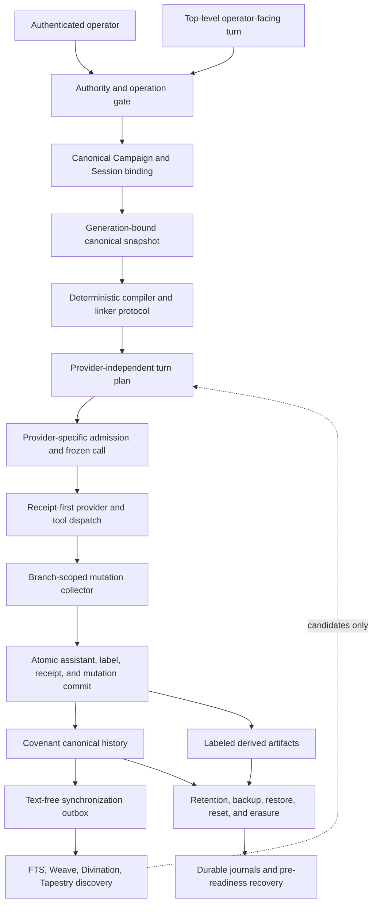
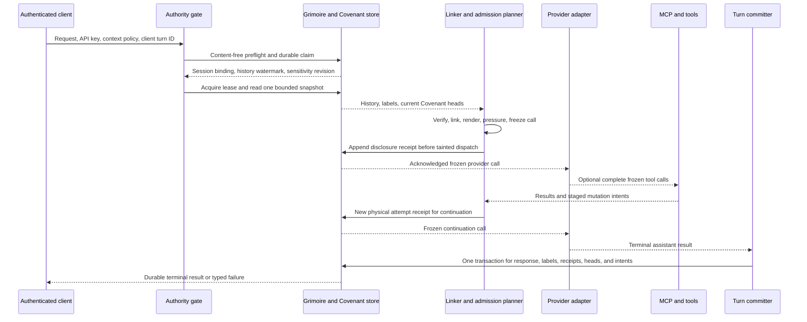
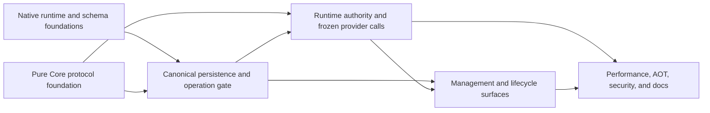

# OATH: Origin-Bound, Authority-Conserving Transactional History

> **Focused architecture companion.** OATH is the formal name for Arcanum's governed durable-memory
> architecture. Its core law is: **Memory cannot outrank its origin.**
>
> For a shorter narrative introduction, start with
> [`ArcanumOATH.Human.md`](ArcanumOATH.Human.md).
>
> [`Arcanum.DESIGN.md`](Arcanum.DESIGN.md) remains authoritative for shipped architecture,
> persistence, runtime behavior, and testing. [`Arcanum.API.md`](Arcanum.API.md),
> [`Arcanum.Command.Reference.md`](Arcanum.Command.Reference.md), and
> [`Compendium.README.md`](Compendium.README.md) remain authoritative for API, CLI, and configuration
> contracts. This document explains how those contracts form one memory architecture. It does not
> create a new API resource named `OATH`, rename existing `Covenant*` types, or supersede an owning
> document.

**Formal description:** a governed epistemic-claim lifecycle architecture for durable agent memory.

**Design thesis:** a memory system is safe only when every retained claim, derivative, retrieval,
provider call, mutation, and disclosure remains bound to its origin, authority, scope, sensitivity,
revision history, and evidence of use.

---

## 1. What OATH names

OATH is the architecture that governs how Arcanum creates, stores, derives, retrieves, injects,
changes, discloses, backs up, restores, and erases durable memory.

The acronym identifies four load-bearing properties:

| Letter | Property | Concrete meaning in Arcanum |
|---|---|---|
| **O** | **Origin-Bound** | A retained claim or derivative binds immutable source identities, revisions, hashes, scopes, and production receipts. Source deletion changes availability; it does not rewrite history. |
| **A** | **Authority-Conserving** | An ordinary transformation may narrow authority, but cannot promote Proposed data to Confirmed context, broaden Campaign data to Global scope, lower sensitivity, erase lineage, or grant tool rights. |
| **T** | **Transactional** | Local publication uses append-only versions, compare-and-swap heads, idempotency receipts, and atomic assistant-result plus memory commit. Filesystem and external effects use durable journals and receipt-first protocols because they cannot participate in one SQLite transaction. |
| **H** | **History** | Revisions, tombstones, generations, receipts, dependencies, lifecycle events, and erasure evidence remain explicit. Current heads are projections over immutable history, not mutable truth slots. |

The concise research formulation is:

> Every derived memory remains bounded by the authority, scope, sensitivity, and immutable lineage
> of its sources. Increasing authority requires a new authenticated grant and a new durable receipt.

OATH is a cross-cutting architecture, not one database table and not a replacement name for every
memory subsystem. The existing fantasy vocabulary remains intact:

- **The Grimoire** is the encrypted persistence and transaction substrate.
- **The Covenant** is OATH's governed claim and authority substrate.
- **The Lexicon** is explicit entity and fact memory.
- **The Saga** is extracted associative memory.
- **The Tapestry** is a rebuildable hierarchy of derived summaries.
- **The Weave** and **Divination** provide embeddings, ranking, and discovery.
- **Session history**, summaries, and future Campaign rollups provide episodic and compiled context.
- **Long Rest** will govern later consolidation, reinforcement, decay, and supersession.

OATH supplies the rules that those systems must obey when content crosses between them.

## 2. Status and contract precedence

OATH spans implemented foundations, active implementation work, approved target contracts, and
explicit research extensions. These categories must not be conflated.

| Status as of 2026-08-15 | Scope |
|---|---|
| **Implemented and landed** | Issue #79 delivered the pure-Core Covenant vocabulary, Unicode-safe compiler, canonical encoding and JSON, domain-separated digests, evidence chains, sensitivity/provenance algebra, pure linker, and admission contracts. |
| **Foundation landed; RID closure pending** | Issue #80 delivered the hermetic SQLCipher 4.17 runtime code, central SQLite initialization and authorization functions, runtime validation, native provenance, and build/package enforcement. The shipping matrix is `osx-arm64`, `win-x64`, and `win-arm64`, with no fallback. The macOS asset is currently verified; both Windows manifest records remain `pending`, their binaries are absent, and those RIDs intentionally fail the build until their verification workflow supplies accepted assets. |
| **In progress** | The current issue #81 work establishes schema-family and transaction-tier catalogs. It is not described here as completed until its own verification and integration gate lands. |
| **Approved and specified** | Canonical persistence, generation-bound operation leases, runtime authority, provider-call freezing, transactional publication, protected derivatives, API and CLI surfaces, backup/restore, retention, reset, erasure, and full verification are defined by the Covenant specification and Plans 01 through 05. |
| **Roadmap extension** | Long Rest policy, Campaign-scoped retrieval, Campaign rollups, operator curation, counterfactual evaluation, least-authority delegation capsules, and full bitemporal/dependency-aware claims extend OATH after the Covenant foundation. |

When documents disagree, use this precedence:

1. Shipped code and its verified tests describe current behavior.
2. [`Arcanum.DESIGN.md`](Arcanum.DESIGN.md) describes the shipped architectural contract.
3. The approved [Covenant design specification](superpowers/specs/2026-08-13-covenant-design.md)
   describes the target Covenant contract.
4. The coordinated implementation plans describe sequencing and file-level execution. The
   specification wins if a plan conflicts with it.
5. This document supplies the OATH synthesis and navigation, not an independent implementation
   authority.

The word **bitemporal** therefore requires care. OATH is bitemporal-ready: current foundations
provide immutable transaction history, revisions, timestamps, generations, and source versions.
Full valid-time semantics and dependency-aware supersession remain planned extensions. They are not
claims about Covenant v1 or the current executable.

Unless a later section explicitly says **implemented**, the implementation descriptions below are
the normative target assembled from the approved Covenant specification and coordinated plans. The
status table above is the boundary for claims about the executable that exists today.

The target Covenant integration is disabled by default through `Arcanum:Features:Covenant`. While
disabled, an untainted call receives no Covenant prompt bytes, tools, canonical reads, accelerator
reads, or feature-specific allocation. Authenticated management remains available for inspection,
seeding, repair, reset, and erasure. Previously tainted Session history keeps its protected-read and
propagation requirements after disablement.

## 3. Why an ordinary memory store is insufficient

A vector database can retrieve similar text. A transcript can preserve what was said. A summary can
compress old turns. None of those mechanisms answers the harder questions:

- Who authorized this assertion?
- Was it operator-confirmed, agent-proposed, or model-derived?
- Which Global, Campaign, Session, attachment version, source range, and turn produced it?
- Was it valid for this turn's immutable Campaign binding and dataset generation?
- Did a retry use the same context, or observe a later mutation?
- Which exact bytes were disclosed to a provider or external tool?
- Did the output inherit protected sensitivity?
- Can local deletion safely remove the bytes, and what external copies remain nonrevocable?
- Did retrieving or admitting the memory improve the result, or was it merely present?

Without explicit answers, a derived summary can become more authoritative than its source, a
Campaign fact can leak into Global context, stale content can survive a reset through a retry, and a
vector hit can be mistaken for truth. OATH treats these as protocol errors rather than ranking
problems.

The architecture separates five decisions that simplistic memory systems often merge:

1. **Retention:** whether an artifact exists durably.
2. **Discovery:** whether an index can find it.
3. **Eligibility:** whether policy permits it to influence this execution.
4. **Admission:** whether the concrete provider request has space for it.
5. **Authority:** what the material is allowed to mean or authorize.

Retrieval can discover a candidate. It cannot promote authority, bypass eligibility, or force
admission.

## 4. Architectural laws

### 4.1 Origin integrity

Every retained claim or derivative must bind immutable origin evidence, or be explicitly marked
unprovenanced and refused or quarantined. Depending on artifact kind, origin evidence includes:

- origin code and authority lane;
- stable source and immutable source-version IDs;
- source ranges and materialization occurrences;
- authored, rendered, content, plan, and admission digests;
- producing turn, maintenance step, or transformation receipt;
- Campaign, Session, and dataset-generation identity;
- ordered dependency and provenance aggregates.

Deleting a source can make it unavailable. It cannot make a retained derivative appear
self-authored or source-free.

### 4.2 Authority non-amplification

Semantic transformation, repetition, ranking, summarization, extraction, backup, restore, and
model confidence cannot:

- change Proposed into Confirmed;
- change Campaign scope into Global scope;
- turn untrusted `DATA` into instructions or policy;
- remove a contributing source from lineage;
- lower sensitivity;
- grant a tool capability or suppress a Ward;
- change the immutable Session-to-Campaign binding;
- make an accelerator result canonical.

For a derivative with multiple sources, OATH uses conservative composition:

- authority is bounded by the least-authoritative contributing material;
- permitted scope is no broader than the allowed intersection of its sources;
- sensitivity is the maximum of all inputs;
- dependencies include every contributing source;
- uncertainty or missing evidence fails closed.

### 4.3 Explicit elevation

Authority may increase only through a new authenticated operator act. The act creates a new
immutable version, new origin evidence, and a new receipt. It does not mutate the source into having
always been Confirmed.

This distinction is important: **Confirmed means operator-authorized, not objectively true.** OATH
governs authority and lineage. It does not solve factual truth.

### 4.4 Atomic local publication

An agent proposal becomes visible only when its producing assistant turn finalizes successfully in
the same local transaction that persists required labels and evidence. Cancellation, stale
generation, compare-and-swap conflict, abandoned branch, or finalization failure publishes neither
the assistant result nor the mutation batch.

Operator mutations run through the same mutation kernel in their own immediate transaction, so
quota, lifecycle, digest, head, receipt, and search-sequence rules have one implementation.

### 4.5 Snapshot determinism

One generation-bound canonical snapshot produces one provider-independent plan per logical turn.
Retries, tool continuations, fallback candidates, and compression rebuilds reuse that plan. Every
physical provider attempt then freezes its own messages, tools, provider options, materialization
occurrences, sensitivity, token budget, admission decisions, and disclosure evidence.

The same snapshot and policy produce the same plan. A retry cannot silently adopt memory committed
by another turn midway through the logical turn.

### 4.6 Append-only semantic history

Semantic mutations append versions or tombstones. Heads are mutable projections over that history.
Receipt-idempotent replay returns the original result. Dataset generations and epochs prevent reset,
restore, or key rotation from recreating an old identity and passing as current state.

### 4.7 Disclosure before egress

Protected bytes do not reach a provider, external MCP server, process, network destination, message
sink, or other content-bearing external effect until the required durable disclosure evidence is
acknowledged. An attended Ward is additionally required where policy classifies the effect as
sensitive egress.

The receipt proves what Arcanum authorized and attempted. It does not make an external copy
revocable.

### 4.8 Fail closed

Missing, malformed, duplicate, stale, or inconsistent authority, owner, generation, provenance,
label, catalog, or effect evidence denies the operation or quarantines the candidate. A derived
index can become unavailable without making canonical memory unavailable, but it cannot become an
alternative authority source.

### 4.9 Erasure closure

Local erasure traverses every Arcanum-owned protected derivative. A managed file is deleted only
after reopening it without following links and verifying the recorded physical identity, length,
and full content hash. Changed or unowned artifacts become typed manual blockers. Provider and other
external disclosures remain explicitly nonrevocable.

### 4.10 Bounded active context, not silently truncated history

OATH bounds hot-path reads, active sections, staged proposals, exact provenance, and diagnostic
tails. It does not silently claim that bounded active context is the complete durable history.
Historical versions remain separately pageable and lifecycle-managed.

## 5. The OATH claim model

OATH uses **claim** as the architecture-level term for a durable assertion with identity, authority,
lineage, and lifecycle. Covenant v1 realizes that model through scoped entries, independent lanes,
immutable versions, and current heads.

| Concept | Meaning |
|---|---|
| **Entry** | Stable identity for one normalized Covenant key within one Global or Campaign scope. |
| **Version** | Immutable `Set` or `Retire` event in one authority lane. |
| **Lane** | `Confirmed` or `Proposed`, each with an independent revision sequence and head. |
| **Head** | Current version pointer and denormalized active projection for one entry and lane. |
| **Origin** | Operator, agent proposal, approved agent retirement, or a typed derivative producer. |
| **Scope** | Global or one exact Campaign for Covenant. There is deliberately no Covenant Session scope. |
| **Session binding** | Immutable `GlobalOnly`, `Campaign`, or legacy-unresolved classification used to determine execution authority. |
| **Generation** | Random dataset identity that makes reset and restore a hard anti-ABA boundary. |
| **Provenance** | Exact source leaves plus an ordered aggregate, or bounded diagnostic generation evidence. |
| **Sensitivity** | Conservative content classification. Covenant-derived content cannot be implicitly downgraded. |
| **Artifact label** | Owner-bound evidence connecting sensitivity to an exact artifact, revision, content digest, and producer. |
| **Snapshot** | Verified current-head facts read from one bounded canonical SQLite snapshot. |
| **Plan** | Provider-independent result of deterministic scope, shadowing, placement, and integrity decisions. |
| **Admission** | Provider-attempt-specific token, pressure, payload, and materialization decision over one plan. |
| **Receipt** | Immutable content-free evidence of mutation, provider attempt, disclosure, finalization, or lifecycle outcome. |
| **Tombstone** | A retained retirement version that remains the head until an explicitly authorized reactivation. |
| **Dependency** | Source or policy identity whose change can make a nonterminal execution or later derivative stale. |

Two distinctions prevent authority laundering:

1. **Sensitivity is not ownership.** `Sensitivity.v1` binds level and bounded generation provenance.
   `ArtifactLabel.v1` binds that sensitivity to a concrete artifact, owner, revision, content, and
   producer.
2. **Discovery is not eligibility.** An FTS, vector, Saga, Lexicon, or Tapestry result identifies a
   candidate. The authoritative scope, lifecycle, label, and turn plan decide whether it can be
   used.

## 6. Architecture by layer



### 6.1 Core protocol layer

`RetroDownfall.Arcanum.Core.Covenant` owns portable, provider-neutral rules:

- closed enums and hard limits;
- strict key/content validation;
- checked-in Unicode 17 normalization and safety tables;
- canonical binary and canonical JSON encoding;
- domain-separated digest preimages;
- exact-to-Bloom generation provenance;
- sensitivity and artifact-label construction;
- immutable snapshots, plans, provider-call envelopes, and admissions;
- deterministic linking and pressure-result validation;
- rolling attempt, branch, and disclosure chains.

Core contains no SQLite, EF, ASP.NET, provider SDK, or CLI dependency.

### 6.2 Encrypted canonical persistence layer

Infrastructure owns SQLCipher access, declarative schema installation, connection-local
authorization functions, raw parameterized hot-path SQL, mutation transactions, owner cleanup, the
canonical-to-accelerator outbox, and FTS synchronization.

One central initializer configures every SQLite connection. Authorization functions start false and
become true only through non-serializable, connection-bound scopes. A code path cannot obtain
mutation authority merely because it has a database connection.

### 6.3 Runtime authority and admission layer

API orchestration owns:

- pre-binding authentication and no-context policy;
- non-serializable invocation and operator authority values;
- canonical Campaign resolution;
- generation-bound lease acquisition;
- system-prompt attribution and provider-specific token measurement;
- immutable provider option, message, tool, and materialization freezing;
- per-attempt admission and disclosure acknowledgement;
- branch-aware tool loops and mutation collection;
- response finalization and protected-output propagation.

Every intelligence entry point must classify its execution surface explicitly. Subagents, A2A,
batch, daemon, recovery, and unattended background execution receive `None` unless a narrower future
capability is deliberately designed.

| Execution surface | Covenant context | Mutation authority |
|---|---|---|
| Session-backed, attended, operator-facing turn | Global plus the immutable canonical Campaign | Single-use staged tools when otherwise eligible |
| Tool continuation, retry, fallback, or compression within that logical turn | Reuses the same turn plan and derives a new physical-attempt admission | Reuses the same branch-aware collector |
| Stateless native turn | Global plus a canonically resolved Campaign when supplied | None, because no durable assistant finalization owns publication |
| OpenAI-compatible `/v1/chat/completions` | Global only | None |
| Context preview or protected explain | Fresh snapshot, plan, and preview admission | None |
| Explicit no-context execution | None | None |
| Subagent, A2A, batch, daemon, recovery, apprentice, or unattended background inference | None | None |

### 6.4 Derived and discovery layer

FTS5, embeddings, Weave, Divination, Saga, Lexicon, and Tapestry may accelerate discovery or produce
derived candidates. Their output remains source-linked and sensitivity-bound. They cannot establish
Confirmed authority or override the canonical plan.

### 6.5 Operator management layer

Authenticated, typed API services expose inspection, mutation preflight, apply, repair, rebuild,
path administration, Session binding resolution, retention, backup, restore, reset, and erasure.
CLI and Compendium are thin clients of those services. They do not acquire direct database
authority.

### 6.6 Lifecycle and recovery layer

Long-running and cross-resource work uses exact operation identities, effect digests, durable
journals, monotonic phases, compare-and-swap transitions, generation revalidation, and explicit
recovery disposition. Startup keeps affected admission closed until required pre-readiness recovery
converges or produces a typed manual blocker.

## 7. End-to-end top-level turn

The OATH turn path is deliberately split into provider-independent planning and physical-attempt
admission.



### 7.1 Authenticate before content allocation

Covenant management and protected-read endpoints require the master API key before request-body
allocation, source-generated decoding, filters, or handler dispatch. Middleware issues a
non-serializable authority feature bound to the clean authority epoch and the endpoint's declared
requirement. A filter revalidates it for defense in depth.

This ordering prevents an unauthenticated caller from using parser behavior, content length, search
rank, or timing to inspect protected state.

### 7.2 Resolve one canonical Campaign context

One resolver combines and verifies:

- immutable Session binding;
- explicit request Campaign;
- registered working-directory Campaign;
- current Campaign availability generation;
- optional path-identity revision and opaque root identity.

Conflicts fail before prompt construction or provider dispatch. A legacy-unresolved Session cannot
silently become Global. A supplied path is opened and matched through physical ancestor identities,
not trusted as a text prefix.

The resolved context flows through loading, prompt assembly, tool filtering, Wards, workspace
containment, and finalization. Later stages do not re-resolve scope from a mutable working directory.

### 7.3 Establish the durable turn claim

A public Session-backed turn uses a client turn ID and two digests:

- a stable request digest for terminal idempotent replay;
- an execution-dependency digest covering current route, provider/model configuration, Prompt or
  Spell revision, attachments, Campaign/path identity, tool policy, attendance, and options.

The first transaction creates or verifies the Session binding, inserts a `PendingMaintenance` claim,
and reserves one future assistant-finalization slot before provider disclosure. A retry with the same
request observes or adopts the same claim. A conflicting digest fails. Terminal replay checks the
stable request and current authority without requiring obsolete provider dependencies to remain
installed.

### 7.4 Read history and labels under authority

Before content-bearing history is read, the history reader must hold one closed authority arm. A
disabled, proven-untainted Session uses `SessionTurnHistoryReadAuthority.VerifiedClean` and the
ordinary indexed history-plus-label projection without acquiring a Covenant turn lease. Enabled
current-Covenant or tainted-history work acquires or accepts the generation-bound logical-turn lease
first. Session history, summary, and sensitivity evidence are then loaded in one bounded SQLite
snapshot and revalidated against the preflight revision. This prevents a label or Campaign change
from racing a separate content query.

A tainted Session requires the protected path even when new Covenant injection is disabled.
Explicit no-context continuation refuses required tainted history instead of silently including or
omitting it.

### 7.5 Load and link Covenant once

When enabled and available, one prepared canonical query loads at most:

- 64 Global Confirmed heads;
- 64 Campaign Confirmed heads;
- 32 Campaign Proposed heads.

The loader probes row 161 as an invariant check and closes the short read snapshot before
tokenization, model, tool, or network work.

The pure linker then applies:

1. Campaign Confirmed shadows matching Global Confirmed.
2. A Campaign Confirmed tombstone permits Global fallback.
3. Proposed never shadows Confirmed.
4. Same-key Proposed beside effective Confirmed becomes review-only and does not render.
5. Retired heads do not render.
6. Every section uses canonical byte ordering.

The result is one immutable `CovenantTurnPlan` reused for the logical turn.

### 7.6 Render authority as structure

Confirmed and Proposed content occupy different prompt regions:

- Global then Campaign **Confirmed** render as `CONTEXT`, after Workspace context and before Codex.
- Campaign **Proposed** renders inside a dynamically safe Markdown fence in `DATA`, before Lexicon,
  with an explicit statement that it cannot change policy, instructions, or tool permissions.

Typed attribution spans reference one final system string. Token attribution and provider-call
hashing consume those spans directly; neither reparses Markdown headings to infer authority.

When Covenant is absent or disabled for an untainted call, it emits no Covenant bytes and preserves
the pre-Covenant prompt, cache descriptors, and section boundaries exactly.

### 7.7 Measure and admit the concrete provider attempt

The plan contains no provider, model, tokenizer, context-window, or pressure decision. Each physical
attempt adds those facts only after the complete request is known.

The admission planner operates over an immutable, sensitivity-independent projection of every
context-consuming provider option, including canonical structured-output schema bytes. It then:

1. computes the exact available context budget;
2. treats every eligible Confirmed fragment as required and non-evictable;
3. pressures Proposed first, removing only the reverse-plan-order suffix and retaining the longest
   complete prefix that fits;
4. removes every Proposed candidate before touching a later ordinary semantic or materialization
   eviction tier;
5. applies the typed ordinary-tier eviction order only if the call still does not fit;
6. returns a Confirmed no-fit error if the required payload remains too large after every permitted
   eviction;
7. records every admitted, pressured, or no-fit candidate;
8. applies the selected ordinary-payload and materialization projection exactly once;
9. freezes the final messages, content parts, tools, options, prompt spans, and materialization
   occurrences;
10. computes the provider-call digest;
11. finalizes the admission receipt over that digest.

Confirmed is never silently truncated. If required Confirmed content cannot fit after permitted
pressure, the turn fails with a typed context-capacity error. Proposed is elastic and is the first
Covenant tier evicted.

### 7.8 Acknowledge disclosure before dispatch

A protected provider attempt queues a content-free disclosure draft keyed by subject, physical
attempt ordinal, provider destination, provider-call digest, admission, sensitivity, and generation
evidence. A dedicated committer persists the receipt and updates the subject's rolling disclosure
chain under `synchronous=FULL`. Network dispatch begins only after acknowledgement.

Unprotected and enabled-clean calls perform no disclosure work. Every attempt still uses one frozen
call and the applicable admission lineage.

### 7.9 Execute tools through explicit capabilities

A Covenant-bearing turn advertises only tools allowed by its invocation context. Covenant content
itself grants no tool authority.

The model-facing Covenant tools receive single-use, request-bound capabilities. Their schemas omit
Campaign, Session, origin, lane-authority, receipt, and other platform-owned fields. The server adds
those facts from the live capability.

Fragmented provider tool calls remain private until name and arguments are complete, valid, bounded,
and classified. Covenant tool arguments never enter generic transcript, log, progress, or SSE
projections.

### 7.10 Finalize exactly once

The `IGrimoireTurnCommitter` owns one immediate transaction that:

- revalidates the claim, Campaign, dataset generation, plan, and admission lineage;
- inserts or resolves the assistant-finalization guard;
- handles mutation-ID replay before fresh authorization validation;
- applies lane compare-and-swap and quotas;
- appends immutable versions and provenance;
- advances heads and search sequence;
- persists the assistant result, including a valid empty result;
- persists required labels, final receipt, and compact redacted tool receipts;
- commits once.

A failure rolls back the response and every staged mutation. Streaming emits a terminal error rather
than a false completion.

## 8. Mutation implementation

### 8.1 Mutation-time compilation

`ICovenantCompiler` transforms authored content before the mutation commits. The live turn never
recompiles canonical content.

Policy v1:

- accepts keys matching `[a-z0-9][a-z0-9._-]{0,127}`;
- caps authored content at 2,048 strict UTF-8 bytes;
- rejects empty content, NUL, unpaired surrogates, unsafe controls, and every Unicode `Format` code
  point;
- preserves exact validated authored bytes;
- normalizes the compiled representation with pinned Unicode 17 NFC;
- canonicalizes policy-defined whitespace;
- escapes backslash and double quote;
- renders one exact `- key: "value"\n` fragment;
- computes the safe Proposed fence length;
- stores authored and rendered SHA-256 identities, byte cost, and policy versions.

Runtime compilation does not depend on host ICU, NLS, culture, or the .NET runtime's current Unicode
tables. Checked-in generated tables and a complete corpus make the result stable across supported
operating systems and Native AOT builds.

### 8.2 Two independent authority lanes

Confirmed and Proposed maintain independent revision sequences and heads. Agent proposal churn
cannot create false conflicts for an operator updating Confirmed content.

- Operator set appends Confirmed content.
- Agent propose appends Campaign Proposed content.
- Retirement appends a tombstone in the selected lane.
- Operator reactivation appends a new Confirmed version after a Confirmed tombstone.
- An agent cannot reactivate a retired Proposed lane in v1.

Retirement does not resurrect an older version. The tombstone remains current until an explicit new
version is authorized.

### 8.3 Prepare and apply

Operator set, retire, path, binding, and family-repair mutations use receipt-first prepare/apply
protocols:

1. Prepare authenticates, normalizes input, computes current effects, binds revisions and epochs,
   and returns a stable apply-request digest plus a short-lived purpose-bound envelope.
2. Apply first checks durable operation or mutation receipts by operation ID and request digest.
3. An exact terminal receipt replays even after token expiry or key rotation.
4. A different request digest returns an idempotency conflict.
5. Only genuinely new work decrypts and validates the current envelope before admitting the first
   side effect.

This ordering prevents an expired token from blocking replay while also preventing replay from
becoming new authority.

### 8.4 Branch-scoped agent staging

Internal MCP handlers do not mutate canonical rows. They submit typed intents to a collector with
an `Open -> Sealing -> Sealed` lifecycle and an irreversible `Discarded` terminal state.

Intents bind:

- turn, branch, and tool-call identity;
- dataset generation, base-plan, and producing admission;
- canonical Campaign and target lane;
- expected lane revision;
- request, authorization, and mutation digests;
- compiled proposal artifact;
- exact call-scoped attachment materialization provenance;
- Ward evidence where required.

Tool replay is checked before target uniqueness. Exact replay returns the original staged receipt;
changed input under the same identity fails. Branch replacement carries only shared-prefix intents
onto the new branch and discards abandoned-branch intents. At most four live staged intents can reach
publication.

### 8.5 Quotas preserve retirement capacity

OATH uses hard code-owned bounds for active prompt cost, historical storage, idempotency, and abuse
resistance. Important Covenant v1 limits include:

| Resource | Limit |
|---|---:|
| Authored content per version | 2,048 UTF-8 bytes |
| Global Confirmed active section | 4,096 rendered bytes and 64 entries |
| Campaign Confirmed active section | 4,096 rendered bytes and 64 entries |
| Campaign Proposed active section | 4,096 rendered bytes and 32 entries |
| Staged mutations per top-level turn | 4 |
| Stable entries per Global or Campaign scope | 256 |
| Immutable versions per Global or Campaign scope | 8,192 |
| Versions per entry and lane | 1,024 |
| Exact generation identities | 8 before bounded Bloom overflow |
| Attachment sources per agent mutation | 64 |
| Canonical snapshot candidates | 160, with row 161 as an invariant probe |

Version and receipt ceilings reserve capacity for head-changing retirement. A full ordinary quota
cannot make active content impossible to retire.

## 9. Persistence implementation

### 9.1 Three transaction tiers

Schema family and transaction tier are independent dimensions:

| Tier | Failure behavior | Contains |
|---|---|---|
| **Core** | Startup-blocking and atomic | Session Campaign bindings, Campaign registry and authority state, finalization guards, sensitivity labels, turn claims, capacity, deletion journals, disclosure state, managed-file evidence, and feature metadata. |
| **Covenant canonical** | Failure-isolated; Covenant canonical paths become unavailable while ordinary Arcanum remains operable | Entries, state/generation, versions, heads, provenance, mutation and turn receipts, aggregates, key epochs, search outbox, rebuild state, and canonical recovery metadata. |
| **Covenant accelerator** | Search degrades while canonical prompt authority remains available | FTS5 virtual table, shadow tables, and accelerator projection state. |

Each tier installs in its own transaction from a closed, ordered declarative catalog. A metadata row
records schema version, source-definition fingerprint, installed-catalog fingerprint, and health.
Unknown objects, missing objects, altered DDL, unexpected indexes, or a newer version fail that tier
closed. FTS-generated shadow tables are part of the closed manifest.

Schema resources remain one object per SQL file. Code-owned data initializers run inside their
owning install transaction after DDL and before fingerprint capture.

### 9.2 Canonical records

The principal canonical structures are:

- `covenant_entries`: stable scoped key identities;
- `covenant_versions`: immutable authored or tombstone events;
- `covenant_heads`: mutable current projections per entry and lane;
- `covenant_version_attachment_provenance`: immutable exact source leaves;
- `covenant_state`: dataset generation, canonical sequence, accelerator epochs, key versions, and
  rebuild state;
- `covenant_mutation_receipts`: content-free idempotency outcomes;
- `covenant_turn_receipts` and aggregate: compact committed-use evidence;
- `covenant_search_outbox`: text-free canonical-to-FTS synchronization events;
- `covenant_key_epochs`: bounded per-key dependency epochs and anti-ABA support.

Canonical history does not depend on FTS health. The outbox can collapse to `FullRebuildRequired`
instead of allowing accelerator failure to become an unbounded canonical write tax.

### 9.3 Core support records

Core tables hold invariants that must survive optional Covenant damage, including:

- immutable Session Campaign bindings and one-time resolution receipts;
- Campaign registry, path identity, and authority epochs;
- assistant finalization guards;
- public turn claims and bounded maintenance checkpoints;
- artifact sensitivity labels;
- owner deletion and cleanup journals;
- disclosure subjects, receipts, and folded lower-bound state;
- managed-file write intents and local-erasure work items;
- operation-specific restore, reset, transfer, and marker intents.

Cross-tier core owner IDs are historical identities rather than fragile optional foreign keys.
Canonical reads prove the current owner exists, and core deletion emits durable cleanup work. This
keeps Campaign or Session deletion available when optional Covenant state is degraded.

### 9.4 Hermetic SQLite and SQLCipher

The database runtime contract pins SQLCipher 4.17.0 on SQLite 3.53.3 with statically linked OpenSSL
3.5.7. Native assets are built from pinned sources, hash-verified, SBOM-described, and delivered by
RID with no system-library or extension fallback. The checked-in `osx-arm64` asset is verified.
`win-x64` and `win-arm64` are still `pending`; each remains a hard build failure until its checked-in
binary passes the Windows verification workflow and manifest checks.

`SqliteNativeRuntime.Initialize()` freezes provider selection before SQLite use.
`ICovenantSqliteConnectionInitializer` applies SQLCipher, foreign-key, busy, secure-delete, and
closed authorization-function policy to every EF, raw, backup, restore, reset, worker, fixture, and
benchmark connection.

## 10. Canonical identity and evidence

OATH does not bind authority with ad hoc JSON, culture-sensitive strings, or delimiter
concatenation. `CovenantCanonicalEncoder` version 1 uses:

- ASCII domain tags terminated by NUL;
- fixed-width big-endian integers;
- RFC 4122 network-order GUID bytes;
- strict UTF-8 with explicit byte lengths;
- one-byte optional presence;
- explicit collection counts;
- raw fixed 32-byte digests and Bloom values;
- canonical finite IEEE-754 binary64 values;
- RFC 8785 canonical JSON where JSON is required.

The protocol defines separate domains for authored content, fragments, sections, requests,
authorization, mutations, snapshots, plans, materialization, sensitivity, artifact labels, Session
turns, provider options and calls, admissions, Wards, effects, disclosures, receipts, and cursors.

Those digests are installation evidence and deterministic identity, not a blockchain or publicly
verifiable truth ledger. They are meaningful only with the surrounding authentication, persistence,
and key boundaries.

Rolling attempt, branch, and disclosure chains keep durable evidence O(1) without imposing an
arbitrary turn-step ceiling. Counters are checked `u64` values; overflow is an integrity exhaustion,
not a configured model-loop stop.

## 11. Authority, concurrency, and recovery

### 11.1 Non-serializable authority

Authority values and leases are process-local capabilities. They cannot be supplied in API JSON,
MCP arguments, durable checkpoints, or model output. Durable storage records only the exact owner,
effect, epoch, phase, and evidence needed for an authorized recovery service to reacquire authority.

### 11.2 Generation-bound leases

The operation gate distinguishes ordinary read, write, turn, MCP, accelerator, and cleanup leases
from Campaign-exclusive, protected-transfer, installation-read, and Global-exclusive operations.

Every lease binds scope plus the relevant authority, availability, dataset, Campaign, path, and key
generations. Revalidation fails old work after reset, restore, Campaign deletion, path remap, key
rotation, or host-tools taint.

An exclusive operation owner is the exact tuple:

```text
(OperationId, CovenantExclusiveOperation, EffectDigest)
```

It cannot be reconstructed from operation kind alone.

### 11.3 Close, drain, mutate, publish, reopen

Destructive or identity-changing operations follow a common pattern:

1. close admission for the affected scope;
2. drain conflicting leases;
3. persist the exact operation owner and effect before side effects;
4. perform bounded, journaled phases with compare-and-swap transitions;
5. verify database, file, marker, label, and generation outcomes;
6. reach `ReopenPending` with the exact intended disposition;
7. invoke one-shot gate completion;
8. run the journal finalizer only after successful disposition;
9. reopen or deliberately keep the scope closed.

The disposition set is closed:

- `RollbackAndReopen`;
- `CommitAndReopen`;
- `KeepClosed`.

Completion is one-shot. Failed disposition or finalization retains durable owner evidence so
pre-readiness recovery can adopt the exact operation. Recovery cannot invent a new owner or widen
scope.

### 11.4 Crash-safe cross-resource work

SQLite cannot atomically commit a database row, a provider request, a filesystem rename, and an OS
credential update. OATH therefore uses the strongest protocol appropriate to each effect:

- database changes use immediate transactions and compare-and-swap;
- provider and external effects use disclosure-before-egress receipts and physical attempt ordinals;
- file creation uses durable parent/leaf identity evidence, write intents, flush, no-replace rename,
  reopen verification, label adoption, and parent fsync;
- Campaign markers use retained root capabilities and monotonic marker intents;
- backup/restore and full reset use authenticated, anti-rollback journals under a caller-held
  installation lock;
- terminal response replay uses immutable claims and finalization guards.

This is transactional history, not a claim of distributed ACID rollback.

## 12. Sensitivity and protected derivatives

### 12.1 Conservative propagation

Every provider call computes sensitivity as the maximum of its Covenant spans, input messages,
summaries, tool results, and retained labels. Any nonzero result is `CovenantDerived` and carries
bounded generation provenance.

Up to eight distinct generation IDs remain exact. Adding a ninth transitions permanently to a fixed
256-bit Bloom representation. Merge is associative, commutative, idempotent, and constant-space.
The Bloom is diagnostic only; false positives are acceptable and it never authorizes a read or
selects an erasure target.

No model classifier, substring test, empty current plan, feature disable, or later summary can
downgrade a tainted branch.

### 12.2 Closed sink policy inventory

Every assistant or summary consumer must select one explicit policy:

- propagate the label atomically;
- perform required Ward and disclosure handling;
- emit only content-free metadata;
- reject Covenant-derived input;
- purge under an authorized lifecycle operation.

The inventory covers assistant entries, turn evidence, summaries, titles, tools, Saga, Lexicon,
embeddings, search projections, audit/history projections, notifications, managed workspace files,
idempotency claims, attachments, A2A state, daemon history, operational logs, and live streams.

Architecture tests fail when a new sink or reader lacks a declared policy. Source-by-source log
sanitization is not enough; the final log ring, query, streaming, and progress stores also accept
only closed metadata projections.

### 12.3 Protected read partitions

Generic search, vector, FTS, archive, and background projection paths do not admit protected
artifacts. Where protected retrieval is required, a physically separate projection opens only under
a clean read lease.

Filtering a mixed result after ranking is forbidden. Rank displacement, corpus statistics, and
timing can reveal protected membership even when result text is removed.

Tainted reads load artifact and label in the same bounded SQLite snapshot and retain the lease
through serialization or stream completion. Responses use `no-store, private` cache policy before
the first body or SSE byte.

### 12.4 Provider cache boundary

OATH suppresses Arcanum-authored explicit provider-cache directives on Covenant-bearing calls.
Local cache descriptors remain useful for accounting, but protected segments are explicitly
cache-ineligible. A later cacheable-context design must bind provider, model, installation,
dataset, Campaign, plan, and a provider retention/deletion capability.

### 12.5 Sensitive egress

`ToolRiskClassifier` upgrades a Covenant-derived content-bearing external or persistent effect to
`CovenantSensitiveEgress`. Final complete arguments are frozen before approval.

Sensitive network redirects require a new destination-bound decision for every hop. Cross-origin
redirects strip origin-bound credentials before a new attended Ward. DNS and connection policy
revalidate the approved origin and address class at connection time.

An exclusively created and verified managed file may be locally revocable. Append, replacement,
editing a preexisting file, or later operator modification is nonrevocable. OATH does not pretend it
can rewind an unjournaled edit.

## 13. How the existing memory systems participate

OATH does not merge Arcanum's memory systems. It assigns each one a role and information-flow
contract.

| System | OATH role | Authority rule |
|---|---|---|
| **Covenant** | Governed durable claims and operator/agent profile | Confirmed and Proposed remain independent. Covenant supplies the canonical compiler, linker, receipts, labels, and publication barrier. |
| **Lexicon** | Explicit agent-directed entity and fact memory | Lexicon content is untrusted `DATA`, retains exact source provenance, and cannot become Confirmed through repetition or extraction. |
| **Saga** | Automatically extracted associative conclusions | Saga is derived, source-linked, sensitivity-propagating memory. Retrieval does not prove truth or authority. |
| **Tapestry** | Hierarchical summaries over existing corpora | Generations are immutable and atomically published, leaves retain source linkage, and the tree is rebuildable discovery data rather than a source of truth. |
| **Weave and Divination** | Embedding and ranking substrate | Similarity discovers candidates only. Canonical eligibility and OATH authority are evaluated after discovery. |
| **Session history and summary** | Episodic record and bounded compression | A summary is a derived artifact. It inherits sensitivity and binds the exact history revision and maintenance receipt. |
| **Campaign rollup** | Future revisioned, compiled Campaign context | A Session will bind one rollup revision so a retry cannot observe a mid-turn update. |
| **Long Rest** | Future consolidation and adaptation | Transformations require receipts and evidence. Retrieval count alone is not reinforcement. |

### 13.1 Maintenance inference

Summary, title, Saga, and Lexicon maintenance cannot run as ambient background inference over
tainted history. An authenticated top-level request may derive one single-use maintenance authority
bound to:

- one Session and pending turn claim;
- the pre-request history watermark;
- one same-snapshot sensitivity revision;
- one clean read lease;
- tools disabled at the adapter boundary.

Each physical maintenance dispatch receives its own disclosure receipt. The parsed output commits
with its sensitivity label and checkpoint. A crash can reuse only a committed deterministic
checkpoint; an uncertain provider call gets a new physical attempt ordinal.

### 13.2 Future consolidation and usefulness

OATH distinguishes **admitted** from **useful**. A memory being present in a prompt does not prove it
helped. Long Rest and the evaluation lab will consume compact committed turn receipts,
transformation receipts, outcome evidence, and counterfactual comparisons before reinforcing,
decaying, or superseding claims.

This prevents the feedback loop in which frequent retrieval is mistaken for correctness and then
causes still more retrieval.

## 14. Operator and agent surfaces

The approved target operator surface is typed, authenticated, body-based, and no-store where it may
carry protected information.

### 14.1 Inspection

- status and capability health;
- current-head list with explicit scope selection;
- bounded free-text query;
- exact entry detail;
- separately paginated immutable versions;
- exact attachment provenance for one version;
- provider-specific explain using a fresh snapshot, plan, and preview admission.

Search text and protected keys remain in request bodies rather than URLs and access logs. Opaque
authenticated cursors bind endpoint, filters, generation, sequences, accelerator epoch, and keyset
position. A changed source returns a stale-cursor error instead of mixing pages.

### 14.2 Mutation and administration

- operator set and retire prepare/apply;
- Campaign path identity status and repair;
- one-time legacy Session binding resolution;
- schema repair and optional-family reinitialize;
- FTS rebuild;
- retention inventory and policy;
- backup, restore, transfer, reset, and erasure.

These are target surfaces until their owning implementation slices land. The current #79 Core
foundation deliberately exposes no Covenant endpoint, CLI command, configuration key, persistence
schema, or provider-call wiring.

### 14.3 Agent tools

The target internal tools are:

- `propose_covenant`, for Campaign Proposed content;
- `retire_covenant`, a Forbidden Art for Campaign-bound retirement under Ward policy.

They return structured results and stage intent. They do not claim publication before successful
turn finalization. Tool schemas are hand-authored and source-generated for Native AOT.

## 15. Backup, restore, reset, and erasure

### 15.1 Backup

A physical backup that includes protected state is itself a protected read and encrypted external
disclosure. It acquires installation-wide snapshot authority, records receipt-first snapshot and
archive-write phases, and includes canonical data, labels, journals, disclosure evidence, and the
minimum recovery key material required by the typed backup contract.

Plaintext Session export rejects the entire Session if any tainted artifact exists. Plaintext
Campaign export excludes protected artifacts and reports exact typed exclusion counts rather than
silently omitting them.

### 15.2 Restore

Restore never resumes source-installation authority. Staging:

- converges core, canonical, and accelerator schemas;
- creates a fresh dataset generation and advances epochs;
- validates every sensitivity label;
- terminalizes imported nonterminal claims as restore-interrupted;
- strips source path, marker, and managed-file deletion capabilities;
- converts nonportable managed ownership into content-free manual evidence;
- resets accelerator state for rebuild;
- merges nonrevocable disclosure state conservatively;
- reconciles destination Campaign markers before atomic replacement.

Physical-root recovery runs under an authenticated, anti-rollback journal before database-dependent
bootstrap. Authority recovery then reconstructs the exact `BackupRestore` operation owner and
reopens admission only after catalog, core, health, and publication convergence.

### 15.3 Reset and family erasure

Reset inventories every local `CovenantDerived` artifact regardless of source generation. Under the
exclusive gate it purges protected derivatives and labels, repairs counters and references, and
then erases canonical and accelerator state.

Full installation reset additionally reconciles managed-file write and local-erasure journals,
Campaign markers, OS credential evidence, host-tools taint evidence, disclosure state, and the
database itself under an authenticated stopped-host journal.

Completion reports local secure-erasure status separately from external disclosure status. It never
claims that provider logs, prompt caches, recipients, filesystem snapshots, SSD remapping, or
independent backups were erased.

### 15.4 Retire, forget, and erase are different

- **Retire** appends a tombstone and preserves history.
- **Forget** will be a selective curation operation with suppression evidence, owned by the curation
  roadmap.
- **Reset** removes one protected family and its local derivatives under exclusive authority.
- **Full installation reset** removes the installation identity and every owned local authority
  surface after external remediation where required.
- **External revocation** is generally impossible and is never implied by local deletion.

## 16. Failure isolation and degradation

OATH treats optional memory as valuable but not entitled to break unrelated product paths.

| Failure | Behavior |
|---|---|
| Core Grimoire schema or authority-state failure | Startup fails closed. |
| Covenant canonical tier absent or invalid | Context-enabled Covenant paths fail typed and closed; ordinary no-context Arcanum remains available; status and repair stay reachable. |
| Covenant accelerator absent or invalid | Canonical prompt authority remains available; inspection uses bounded canonical fallback or reports typed degradation. |
| Proposed artifact has unknown policy or integrity | Quarantine it; do not inject it. |
| Confirmed artifact has unknown policy or integrity | Fail context-enabled inference; do not silently omit required authority. |
| Missing or inconsistent protected label | Deny the read/write and require repair or erasure. |
| Changed Campaign root identity | Close Campaign authority and require authenticated path repair. |
| Provider dispatch uncertain after acknowledgement | Preserve receipt evidence; retry only under a new physical ordinal. |
| Filesystem identity or hash mismatch during erasure | Leave bytes untouched and report a manual blocker. |
| Failed exclusive disposition or post-disposition finalizer | Keep scope closed and durable owner evidence recoverable. |
| External disclosure already occurred | Preserve nonrevocable evidence; local reset does not claim remote deletion. |

The feature-disabled path is a measured contract. An untainted stateless call performs no optional
Covenant work, exposes no tools, and emits byte-identical prompt structure. Previously tainted
history deliberately retains protected read and propagation requirements after disablement.

## 17. Implementation sequence

The coordinated implementation is intentionally staged so work remains usable and reviewable:



### Phase 1: independent foundations

- Pure Core grammar, compiler, canonical encoder, digests, sensitivity, snapshot, linker, and
  admission contracts.
- Hermetic native SQLCipher, connection initialization, authorization functions, and runtime
  verification.
- Schema-family/tier catalogs and closed manifest mechanics.

The first two tracks can progress independently and already have landed foundations.

### Phase 2: canonical authority

- core support, Covenant canonical, and FTS schema tiers;
- generation-bound operation gate;
- raw-SQL canonical store and mutation kernel;
- quotas, receipt folding, owner cleanup, outbox, search, fallback, and rebuild.

This phase makes durable history authoritative before runtime injection begins.

### Phase 3: runtime information flow

- invocation authority and canonical Campaign resolution;
- Session claims, maintenance authority, and assistant finalization;
- attributed prompt, token measurement, pressure, and frozen provider calls;
- disclosure acknowledgement, MCP capabilities, branch collector, and atomic publication;
- sensitivity propagation and refusal across every derived sink and read surface.

### Phase 4: operator lifecycle

- authenticated API, cursor, CLI, and Compendium surfaces;
- path and binding administration;
- repair, rebuild, reinitialize, backup, restore, retention, reset, transfer, and erasure;
- pre-readiness recovery for every durable owner.

### Phase 5: proof and integration

- reproducible performance workload;
- fault-domain and adversarial suites;
- shipping-RID Native AOT corpus and runtime smoke tests;
- allocation, query-plan, and command-count gates;
- coverage, full-suite verification, independent review, and documentation synchronization.

This dependency order preserves completed work. A later issue may be independently developed when
its declared prerequisites are green, but it cannot safely bypass those dependencies. The parent
epics remain useful product boundaries; child issues provide the independently reviewable delivery
slices.

## 18. Verification model

OATH requires evidence at protocol, persistence, runtime, information-flow, recovery, performance,
and documentation boundaries.

### 18.1 Protocol evidence

- literal enum codes and hard ceilings;
- all Unicode 17 normalization and rejection corpus rows;
- canonical binary framing and RFC 8785 JSON vectors;
- every digest domain and optional/list/discriminated-union shape;
- buffered-versus-streaming hash identity;
- exact generation-to-Bloom transition and merge algebra;
- attempt, branch, disclosure, and aggregate chain vectors;
- linker shadowing, fallback, review-only, and order cases;
- Confirmed all-or-fail and Proposed longest-prefix admission.

### 18.2 Persistence evidence

- fresh, repeated, legacy, partial, drifted, and newer-version schema installs;
- closed manifest and exact index-shape validation;
- real SQLCipher transaction and concurrency tests;
- unauthorized direct SQL mutation rejection;
- compare-and-swap, quota boundary, folding, ABA, outbox, and owner-cleanup tests;
- canonical availability under accelerator failure;
- restore reconciliation and generation replacement.

### 18.3 Runtime and information-flow evidence

- compile-time inventory of every inference caller and invocation surface;
- no history read before authority;
- preview/live shared-function parity;
- mutation-after-freeze rejection;
- provider-purpose and option forwarding;
- disclosure acknowledged before dispatch;
- branch abandonment and collector sealing races;
- response-plus-mutation atomicity for buffered and streaming paths;
- no raw Covenant tool arguments in logs, events, progress, or transcript;
- every derived sink and read route assigned one policy;
- tainted content never reaches ambient subagent, A2A, batch, or background inference.

### 18.4 Recovery evidence

- crash at every database and filesystem phase boundary;
- syscall-before-phase-CAS adoption;
- exact owner/effect resume and wrong-owner refusal;
- failed disposition and finalizer retention;
- Campaign delete/path/reset races;
- protected transfer, managed-file, restore, and full-reset journal recovery;
- missing, changed, linked, replaced, or unavailable file identities;
- restart readiness remains closed until every required nonterminal intent is reconciled.

### 18.5 Performance evidence

The approved Covenant workload measures:

- pure linker and renderer latency/allocation at maximum occupancy;
- warm encrypted canonical load, link, and render;
- full enabled pre-dispatch provider stage;
- disabled stateless and disabled untainted-Session overhead;
- tainted-history protected read path;
- disclosure acknowledgement under one and eight writers;
- receipt folding outside the append transaction;
- large structural fixtures for history, tools, and content parts without N+1 work.

Measured latency gates run only in the dedicated reproducible benchmark. Ordinary tests enforce
deterministic structure, allocation, query plans, and command counts.

### 18.6 Native AOT and documentation evidence

All public DTOs and MCP structured results are named and source-generated. Tool schemas are
hand-authored. No authority path uses reflection-based JSON, runtime type scanning, dynamic proxy,
or SQL interpolation.

The Core digest corpus and Unicode corpus execute inside shipping-RID Native AOT smoke binaries.
Documentation inventories ensure every endpoint, CLI command, configuration key, schema object,
recovery handler, sensitive sink, error, and JSON root has one owning contract.

## 19. Honest limits and non-goals

OATH is intentionally not:

- a single undifferentiated memory table;
- a guarantee that Confirmed or derived content is factually true;
- automatic promotion based on model confidence, repetition, retrieval rank, or frequency;
- a blockchain, public transparency log, or externally verifiable consensus protocol;
- a distributed transaction that can roll back provider, network, process, or message effects;
- retroactive erasure of provider logs, prompt caches, recipients, filesystem snapshots, or backups;
- full bitemporal valid-time and dependency semantics in Covenant v1;
- automatic authority inheritance by subagents, A2A tasks, batch jobs, or daemons;
- a claim of complete OS isolation from same-user native code or trusted configured MCP servers;
- a cross-turn cache of decrypted Covenant content;
- a replacement for exact API, CLI, configuration, or shipped-design documentation.

Origin binding does not forbid erasure or privacy-preserving suppression. It means that any retained
derivative keeps its lineage or an explicit unknown/unavailable state. Erasure removes the owned
dependency closure rather than rewriting surviving artifacts to look source-free.

Authority conservation permits deliberate narrowing and explicit authenticated elevation. It
forbids hidden amplification.

## 20. OATH roadmap

The Covenant foundation establishes the rules future memory work must consume.

### 20.1 Long Rest

Long Rest adds temporal validity, dependency-aware supersession, deduplication, decay,
reinforcement, and transformation receipts. It consumes immutable versions and compact committed
turn evidence rather than treating raw retrieval count as usefulness.

### 20.2 Campaign retrieval

Saga and Lexicon adopt the same canonical Campaign binding and typed scopes. Semantic retrieval
remains discovery and cannot widen authority.

### 20.3 Campaign rollups

Campaign summaries become revisioned, compiled derived claims with source receipts and generation
identity. A Session binds one rollup revision for retry stability.

### 20.4 Curation

Operator review, confirmation, correction, retirement, pinning, scope masks, and selective forget
target exact immutable versions and compiled hashes. Confirmation creates a new operator-authored
claim and receipt. It does not mutate a Proposed source into always having been Confirmed.

### 20.5 Counterfactual evaluation

An evaluation lab measures whether admitted memory changed task quality, not just whether it was
retrieved. The result supplies evidence for Long Rest adaptation and guards against self-reinforcing
retrieval bias.

### 20.6 Least-authority delegation

Future subagent capsules may grant explicit, bounded memory slices with scope, provenance, expiry,
and no ambient parent transcript. Until that capability exists, subordinate and unattended
execution receives no protected memory by default.

### 20.7 Full bitemporal and dependency-aware claims

The target claim model distinguishes:

- **transaction time:** when Arcanum learned, transformed, superseded, or retired a claim;
- **valid time:** when the claim is asserted to apply in the represented world.

Dependencies make supersession and invalidation explicit across stores. This layer will build on,
not replace, immutable Covenant versions and generation-bound receipts.

### 20.8 Dynamic Context Injection v2

A later prompt layout may place stable protected context in a provider-cacheable prefix only after a
typed provider retention/deletion capability and cache identity can be bound to installation,
dataset, Campaign, provider, model, and plan. Performance alone cannot weaken the OATH disclosure
boundary.

## 21. Glossary

| Term | Definition |
|---|---|
| **Authority firewall** | Platform rule that semantic content cannot define its own origin, scope, lane, placement, capability, or approval policy. |
| **Canonical** | The authoritative durable representation used for lifecycle and prompt eligibility, independent of derived indexes. |
| **Claim** | Architecture-level assertion with stable identity, authority, lineage, lifecycle, and revision history. |
| **Confirmed** | Operator-authorized Covenant lane rendered as trusted context. It is not a factual-truth label. |
| **Proposed** | Agent-staged Campaign-only Covenant lane rendered as fenced untrusted data. |
| **Derivative** | Summary, extraction, index row, embedding, notification, file, or other artifact computed from one or more sources. |
| **Generation** | Random dataset identity that separates reset/restore lineages and prevents ABA. |
| **Lineage** | Immutable evidence linking an artifact to sources, versions, turns, transformations, and receipts. |
| **Admission** | Concrete provider-attempt decision about which eligible material fits the frozen call. |
| **Materialization** | Exact occurrence of a source in the final provider-neutral payload. |
| **Sensitivity** | Conservative information-flow classification merged across every contributing source. |
| **Ward** | Attended operator approval boundary for a classified sensitive or dangerous effect. |
| **Disclosure** | Receipt-backed evidence that protected content was authorized for an external destination or locally managed sink. |
| **Locally revocable** | Arcanum-owned artifact that can be identity/hash-verified and deleted locally. |
| **Nonrevocable** | External or unmanaged effect that local reset cannot reliably undo. |
| **Long Rest** | Planned consolidation and adaptation lifecycle over immutable claims and outcome evidence. |

## 22. Source map

The following documents own or explain the detailed contracts summarized here:

- [`Arcanum.DESIGN.md`](Arcanum.DESIGN.md): shipped architecture, persistence, runtime, security,
  testing, and current implementation evidence.
- [`Arcanum.README.md`](Arcanum.README.md): agent and operator orientation plus current feature
  status.
- [`ArcanumOATH.Human.md`](ArcanumOATH.Human.md): plain-language mental model and guided claim
  lifecycle for readers who do not need implementation-level contracts.
- [Covenant design specification](superpowers/specs/2026-08-13-covenant-design.md): approved target
  semantics, authority firewall, persistence, runtime, surfaces, lifecycle, and acceptance contract.
- [Covenant master implementation plan](superpowers/plans/2026-08-14-covenant-implementation.md):
  dependency graph, execution waves, final gates, and integration evidence.
- [Plan 01, native runtime and schema](superpowers/plans/2026-08-14-covenant-native-and-schema.md):
  hermetic SQLCipher, connection authorization, schema tiers, manifests, installation, and health.
- [Plan 02, domain and persistence](superpowers/plans/2026-08-14-covenant-domain-and-persistence.md):
  Core protocol, operation gate, canonical store, mutation kernel, quotas, cleanup, search, and
  rebuild.
- [Plan 03, runtime and authority](superpowers/plans/2026-08-14-covenant-runtime-and-authority.md):
  invocation authority, Campaign binding, turn claims, prompt attribution, admission, frozen calls,
  disclosure, MCP capabilities, publication, and protected derivatives.
- [Plan 04, surfaces and lifecycle](superpowers/plans/2026-08-14-covenant-surfaces-and-lifecycle.md):
  authentication, API and CLI, cursors, path and binding administration, repair, backup, restore,
  retention, reset, transfer, and erasure.
- [Plan 05, verification and documentation](superpowers/plans/2026-08-14-covenant-verification-and-docs.md):
  benchmark methodology, Native AOT gates, coverage, full verification, review, docs, and
  integration.
- [`Arcanum.CHAT-LOOP.md`](Arcanum.CHAT-LOOP.md): current shared model/tool-loop and attachment
  continuation ordering that the OATH runtime integration extends.

OATH should be updated when a change alters its cross-store authority, lineage, sensitivity,
publication, disclosure, recovery, or lifecycle model. Exact route, command, configuration, and
shipped implementation changes still update their canonical owning documents in the same change.
