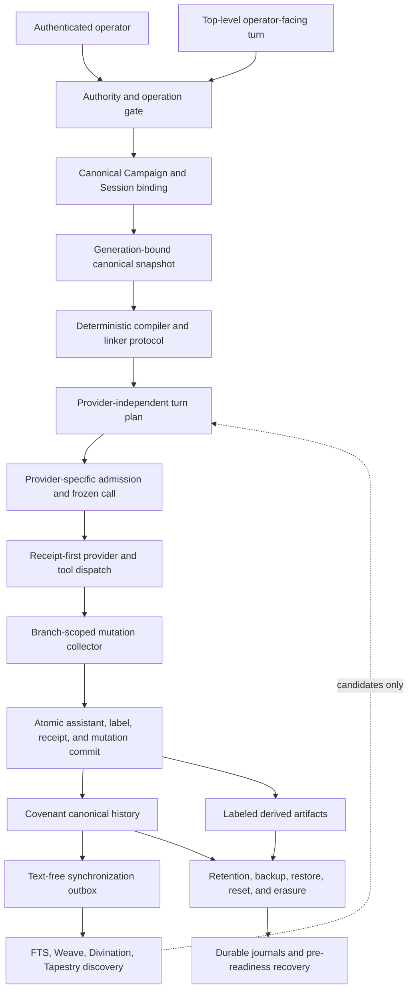
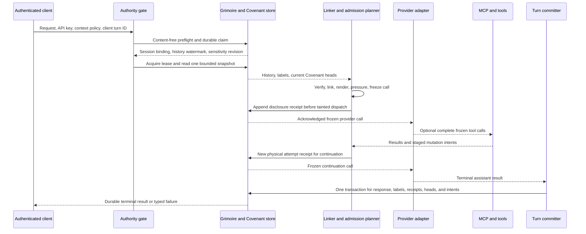
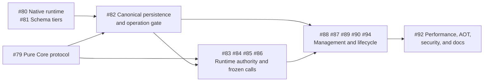
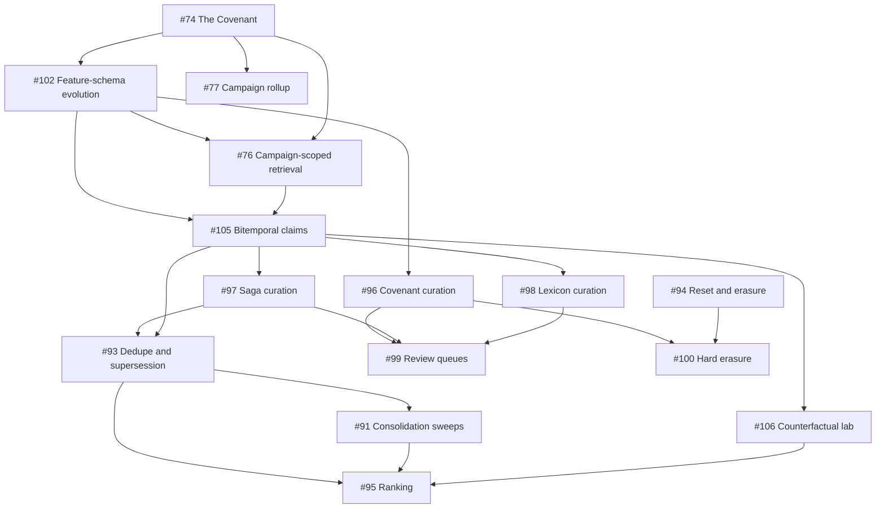

# OATH: Origin-Bound, Authority-Conserving Transactional History

> **Focused architecture companion.** OATH is the formal name for Arcanum's governed durable-memory architecture. Its core law is: **Memory cannot outrank its origin.**
>
> [`Arcanum.DESIGN.md`](Arcanum.DESIGN.md) remains authoritative for shipped architecture, persistence, runtime behavior, and testing. [`Arcanum.API.md`](Arcanum.API.md), [`Arcanum.Command.Reference.md`](Arcanum.Command.Reference.md), and [`Compendium.README.md`](Compendium.README.md) remain authoritative for API, CLI, and configuration contracts. This document explains how those contracts form one memory architecture. It does not create a new API resource named `OATH`, rename existing `Covenant*` types, or supersede an owning document.

**Formal description:** a governed epistemic-claim lifecycle architecture for durable agent memory.

**Design thesis:** a memory system is safe only when every retained claim, derivative, retrieval, provider call, mutation, and disclosure remains bound to its origin, authority, scope, sensitivity, revision history, and evidence of use.

**Document status:** current as of **2026-09-04**, reconciled through GitHub issue #128 and issue #249's nested factory-erasure receipt over issue #123's complete attested full installation reset.

**Branch status.** None. `long-term-memory` was the implementation branch this document was written against; it was merged into `main` and deleted, and everything described here — including the `Arcanum.DESIGN.md` sections cited in §22 — is on `main`. Nothing in this document is waiting on a mirror.

---

## 1. What OATH names

OATH is the architecture that governs how Arcanum creates, stores, derives, retrieves, injects, changes, discloses, backs up, restores, and erases durable memory.

The acronym identifies four load-bearing properties:

| Letter | Property | Concrete meaning in Arcanum |
|---|---|---|
| **O** | **Origin-Bound** | A retained claim or derivative binds immutable source identities, revisions, hashes, scopes, and production receipts. Source deletion changes availability; it does not rewrite history. |
| **A** | **Authority-Conserving** | An ordinary transformation may narrow authority, but cannot promote Proposed data to Confirmed context, broaden Campaign data to Global scope, lower sensitivity, erase lineage, or grant tool rights. |
| **T** | **Transactional** | Local publication uses append-only versions, compare-and-swap heads, idempotency receipts, and atomic assistant-result plus memory commit. Filesystem and external effects use durable journals and receipt-first protocols because they cannot participate in one SQLite transaction. |
| **H** | **History** | Revisions, tombstones, generations, receipts, dependencies, lifecycle events, and erasure evidence remain explicit. Current heads are projections over immutable history, not mutable truth slots. |

The concise research formulation is:

> Every derived memory remains bounded by the authority, scope, sensitivity, and immutable lineage of its sources. Increasing authority requires a new authenticated grant and a new durable receipt.

OATH is a cross-cutting architecture, not one database table and not a replacement name for every memory subsystem. The existing fantasy vocabulary remains intact:

- **The Grimoire** is the encrypted persistence and transaction substrate.
- **The Covenant** is OATH's governed claim and authority substrate (issue #74).
- **The Lexicon** is explicit entity and fact memory.
- **The Saga** is extracted associative memory.
- **The Tapestry** is a rebuildable hierarchy of derived summaries.
- **The Weave** and **Divination** provide embeddings, ranking, and discovery.
- **Session history**, summaries, and Campaign rollups (issue #77) provide episodic and compiled context.
- **The Long Rest** (issue #75) governs consolidation, reinforcement, decay, and supersession.

OATH supplies the rules that those systems must obey when content crosses between them.

## 2. Status and contract precedence

OATH spans implemented foundations, active implementation work, approved target contracts, and explicit research extensions. These categories must not be conflated.

### 2.1 What has landed

| Issue | State | Delivered |
|---|---|---|
| **#79** | Landed | Pure-Core Covenant vocabulary, Unicode-safe compiler, canonical encoding and JSON, domain-separated digests, evidence chains, sensitivity/provenance algebra, pure linker, admission contracts. |
| **#80** | Landed; RID closure pending | Hermetic SQLCipher 4.17 runtime, central SQLite initialization and authorization functions, runtime validation, native provenance, build/package enforcement. |
| **#81** | Landed | Schema-family and transaction-tier catalogs, always-present core support tables, both Covenant tiers, closed installed-catalog manifests, three-transaction installer, `ICovenantAvailability` health publication. |
| **#82** | Landed | Generation-bound operation gate and lease vocabulary, bounded canonical store, transactional mutation kernel and replay ledger, canonical and turn-capacity quotas, bounded turn-evidence folding, owner-deletion catch-up, FTS query compiler and cursor bodies, eligible search index with bounded canonical fallback, whole-sequence outbox synchronization, resumable base rebuild. |
| **#83** | Landed | Non-serializable `ArcanumInvocationContext` at every inference seam, six-purpose AES-256-GCM envelope protocol and keyed diagnostic tag, `OperatorAuthorityContextIssuer`, canonical Campaign resolution by keyed physical directory identity (replacing `PingRequestResolver`), assistant-begin path honoring the immutable Session binding. |
| **#84** | Landed | Deterministic Confirmed and fenced Proposed placement in `SystemPromptBuilder`, Core-owned `SystemPromptAttributionMap`, two new `ContextTokenSource` lanes, `ICovenantContextProvider`, `CovenantAdmissionPlanner`, `ICovenantDisclosureJournal`, `ICovenantMutationCollector`, `IGrimoireTurnCommitter`. |
| **#85** | Landed; streaming barrier withdrawn | `CovenantToolInvocationContext` and `CovenantToolCapabilityRegistry`, `CovenantEgressWardPolicy`, `CovenantToolEgressGuard`, and the hand-authored `propose_covenant` / `retire_covenant` tools. `propose_covenant` and `retire_covenant` publish; `CovenantToolEgressGuard` commits tool-effect disclosure before retirement dispatch. Current retirement advertisement and authority depend on live feature/canonical health, exact preflight, Campaign scope, and the one-call capability—not on attendance or Ward settings. It emits the same informational `ungated` Ward pair as every server tool. `ProviderToolCallBuffer` and its frozen-call classification overload were withdrawn rather than wired: no path under `src/` ever constructed the buffer, the only live classification path takes complete framed calls from the in-process MCP server, and `Hub.ProviderToolBufferExceeded` went with it because nothing could emit it. |
| **#86** | Landed | `ArtifactSensitivityLedger`, `DerivedArtifactWrite`, `SessionDerivedArtifactStore`, `ProtectedAssistantArtifactReader`, `CovenantProtectedLogScope`, `CovenantDerivedOutputInventory` with its architecture suite, and the two-marker host-process-tools taint gate. |
| **#88** | Landed | Frozen operator request/response shapes with `Validate()` and bounded UTF-8 limits, the complete Covenant error vocabulary and HTTP status mapping, five service ports, `CovenantPublicContractInventory`, `CovenantProtectedJsonResult<T>` / `CovenantProtectedStreamResult`, two durable recovery checkpoints, caller-named durable operation identity. |
| **#87** | Landed | `CovenantSensitiveArtifactPurgePolicy` (thirteen-kind table), `CovenantArtifactErasureAuthority`, `CovenantProtectedArtifactErasureKernel`, `CovenantManagedFileErasureKernel`, `CovenantLocalErasureStartupRecovery`, `CovenantSchemaRepairJournal` + startup recovery, `CovenantExclusiveDisposition`, and the `covenant-index-rebuild` / `covenant-family-reinitialize` operation kinds. |
| **#89** | Landed | `Arcanum:Features:Covenant` (default off), the one legal `X-Arcanum-Context-Policy: none` wire value, the protected no-cache header tuple, durable Session turn claims, the shared Campaign path marker codec and retained-handle capabilities. |
| **#90** | Landed | Two backup disclosure barriers under one retained installation read lease, `BackupRestoreEffectDigestCalculator`, destination-monotonic authority and disclosure joiners, the sealed managed-authority sanitizer, and two prerequisite ports. Split into #109–#115; all seven are green. Closing #90 itself still needs an approved implementation-plan amendment. |
| **#109** | Landed | `ProfileNamespaceDigest`, three profile-namespaced credential accounts, `BackupRestoreJournalAuthenticator`, a single-take zeroizing key lease, and `BackupRestoreJournalAnchorStore`. |
| **#110** | Landed | `PhysicalCampaignRootOpener.DeriveClaimedRootIdentityDigest` and the restart arm of `ICampaignPathMarkerLifecycle`. |
| **#111** | Landed | `IBackupRestoreStartupRecovery` — pre-database physical topology recovery and pre-readiness authority recovery. |
| **#112** | Landed | `BackupRestoreCovenantCoordinator`, staged three-tier convergence, `BackupCovenantRestoreReconciler`, fresh dataset generation, destination marker reconciliation before atomic replacement. |
| **#113** | Landed | `BackupRestoreProtectedStatePolicy`, `BackupRestoreProtectedStateInspector`, `BackupRestoreProtectedStatePurger`, and the ordered destructive-disclosure prompt contract. |
| **#114** | Landed | `ICovenantExportPolicy` and `CovenantExportAdmission`, the `Covenant.PlaintextExportRefused` refusal before any Session export byte, and the typed content-free Campaign export exclusion counts. |
| **#115** | Landed | `--protected-state` and `--map-campaign` on `arcanum backup restore`, the pure-Core `BackupRestoreCampaignMappingPolicy`, plan-time validation of every mapping against this installation's own Campaigns, and an import refusal that names the archived Campaign. |
| **#116** | Landed | `RetentionDataClass.Covenant` and `MemoryResetScope.Covenant` with every code in both enums written literally, a settings catalog and policy store that refuse to give the class a rule and say why, the content-free `DataRetentionCovenantInventory`, one read capability per planning call, and the original safe reset refusal that #128 later retired by connecting the protected coordinator. |
| **#117** | Landed | `ICovenantSensitiveArtifactPurger` and its coordinator over the shared erasure kernels, `RequireConditionalSensitivityRetentionPurge` with its write-once request-scoped authority, all six deletion routes dispatching through it, page-walking bulk Saga and embeddings-reset paths, `ICovenantLabeledArtifactGuard` on the three legacy raw deletes, and the destructive-disclosure ordering on `data reset-memory`. |
| **#118** | Landed | `CovenantResetPhase` and `CovenantResetPhaseMachine` — ten literal codes declared once, failing closed on unknown, zero, skipped, and regressed — `DataRetentionMutationCheckpointV3` with its bounded optional Covenant arm, `DataRetentionFactoryResetCheckpointV1` over the same phases, the data-retention mutation descriptor moved to `BeforeStateWrites` with a bootstrap barrier, `CovenantResetCheckpointInitiator` making gate acquisition unreachable before `InventoryPrepared` commits, and `CovenantErasureEffectDigestCalculator` under two pinned domains. |
| **#124** | Landed | Ten-phase coordinator, shared-kernel authority, warm-writer lifecycle seam, and one-shot disposition. |
| **#125** | Landed | Canonical secure-delete transaction, connection drain, fresh dataset, monotonic epochs, and retained-evidence assertions. |
| **#126** | Landed | Checked WAL truncation, compaction/export proof, sidecar absence, and immutable candidate reopen. |
| **#127** | Landed | Composite runtime publication, all-six-token retirement, bounded inventory/catalog guard, serialized warm writer, production transition, exact-owner recovery/adoption, complete composition, and same/fresh-process acceptance. |
| **#122** | Landed | Exact host-tools marker-pair compare-deletion and Campaign-marker cleanup: the authenticated four-phase checkpoint and its restart proof, the signed-attestation, pair-evidence, Campaign-inventory, and effect digests, kind-four Campaign cleanup children with write-once companion observation evidence, the retained native operating-system marker capability and the shared process-wide mutation gate, reconciliation of every child to a terminal phase with a receipt whose deleted and orphaned counts add up under a checked addition, and composition through the one locked full-reset seam authorized to reach it. |
| **#123** | Landed | The complete attested full installation reset. Managed-file reconciliation: the four-phase authenticated checkpoint nested in the marker-pair checkpoint and null until the Campaign receipt is terminal, the source and work-item inventory vectors, the terminal classification and content-free per-arm blocker digests, the write-intent recovery that terminalizes every unfinished managed write by created-child physical identity, two stopped-host overloads on the existing erasure kernel adding no second opener or delete algorithm, and a journal proof and one-shot authority reasserted before every transaction and filesystem effect. The ending: the locked service continues into the ordinary reset sequence only when that reconciliation is terminal, deleting the Grimoire and with it the joined nonrevocable disclosure evidence, then — between the sweep and verification — observing the database file absent, proving the restore history terminal, and compare-removing the three profile credentials in anchor, journal-key, installation-identity order. The terminal projection is persisted before the first removal and each completed phase is published after it, so a crash mid-trio resumes against the proof made while all three were present rather than re-deriving one from a credential set it has already started taking; a surviving Campaign root-identity key refuses the whole step before anything is removed; and the publication is handed back so the reset's own writer adopts it rather than conflicting on the record it just superseded. The active record is retired and the installation reports clean. |
| **#128** | Implemented | Dedicated Covenant reset preview; lifecycle authority and protected plan serialization; direct V3 reset coordinator entry; healthy-catalog V1 factory composition with ordinary cleanup between `ManagedArtifactsProcessed` and `HandlesClosed`; authenticated global/all plan rebinding; owner-only `Prepared + HostFactoryErasure` replay handoff and monotonic proof-before-shutdown; exact-owner lease maintenance through direct and recovered terminalization; and shared reset/global-factory external-retention disclosure before confirmation. |
| **#102** | Landed | Resumable raw-SQL feature-schema evolution: an ordered, closed version chain per family and tier with a pinned source fingerprint for every version a step leaves; transition statements as one statement per file under each tier's own `Transitions/V<n>/` folder, excluded from every source fingerprint because a step that changed the fingerprint of the version it leaves would refuse the very installations it exists to carry; the `grimoire_schema_transitions` core journal whose row is its own phase, advanced only under the revision it was read at; `IGrimoireSchemaBackfill` with bounded, idempotent, restart-safe batches whose cursor is written inside the batch's own transaction, so no cursor can describe work that did not commit; a pure classifier over metadata, journal, and chain that decides fresh install, converge, begin, resume, or refuse without I/O; one shared finalization both drivers call, so there is one idea of when a version is installed; a journal-gated hosted coordinator that drains a sweep after readiness and re-enters convergence without a restart, deliberately not availability-gated because a tier mid-run is unavailable by design and Core's would otherwise be unrepairable; and the three new fail-closed health codes `TransitionIncomplete`, `TransitionUnresumable`, and `MixedCatalogVersions`. Shared prerequisite for #75–#78. The tier that has not moved runs the machinery and finds nothing to do for itself. |
| **#74** | Landed | The live turn's adoption: `CovenantDispatchGate` (one `CovenantTurnScope` per logical run, one admission per provider attempt against the head-room the rest of the prompt leaves, and one durable disclosure receipt before every dispatch carrying admitted content or tainted history), `CovenantProviderCallFreezer` (the exact messages, options, name-ordered tool surface, canonicalized tool-call arguments, and rendered prompt frozen into the signed `ProviderCallEnvelope`, refusing any content kind it cannot bind), the `covenant` argument finally reaching `SystemPromptBuilder` from the live loop, and Covenant-derived replies finalized through `IGrimoireTurnCommitter` so content and sensitivity label share one transaction. Then the surfaces that write and read it: `CovenantOperatorMutationFactory` and `CovenantOperatorPreflightBody`, `CovenantMutationService` with receipt-first replay, four mutation routes and five inspection routes, `arcanum memory covenant set|list|show|retire`, agent proposal minting through the MCP staging seam, `CovenantTurnHeadProbe`, and the seal that carries a staged proposal all the way to canonical storage — the completed assistant finalization freezes the turn's collector and publishes the batch inside the transaction that persists the answer, so `propose_covenant` is advertised again and the `Proposed` lane exists on a real installation for the first time. The first proposal is reachable because the admission a staging tool call runs under is minted for any turn that holds a collector and a head probe, not only for one that injected Covenant bytes or inherited taint: on an empty Covenant neither of those can arise until a proposal already exists, so coupling the two obligations left the tool advertised and refused forever on exactly the installations it exists to serve. And the two surfaces that answer "why was my preference not honored": a content-free scope census behind `memory status` under the one installation read capability, and Proposed-lane admission pressure counted into the materialization ledger and named in `context inspect`. Proven end to end — a preference written through the real prepare-and-commit path is rendered by a later turn that shares no logical turn and no Campaign with the one that wrote it, scope holds in both directions, and a retirement travels exactly as far as the statement did. |
| **#249** | Implemented | The nested completion receipt, the two-record evidence matrix, and the transition credential pair. `InstallationResetNestedTransitionReceiptV1` on the installation-reset active record carries a nested operation identity, a `Claimed`/`Completed` phase, and two digests that are null together at `Claimed` and valid together at `Completed`; absence of the receipt is a third distinct fact. The record's payload version moves from 2 to 3 while the envelope format version stays 2, version 2 remains readable as a strict legacy value that may carry no receipt and is migrated forward by the record's next publication, and the monotonic rules admit exactly one edge — absent to `Claimed` to `Completed` for one nested operation — refusing removal, regression, and renaming. The offline reset arm publishes `Claimed` in the same publication as the point of no return, launches the nested apply under that identity, and afterwards rereads the record and adopts whatever the nested transition published; a workspace-scope reset claims nothing. A transition learns it is nested by reading the outer record rather than by being handed a sink, so first entry and fresh-process recovery reach the same answer from the same evidence, and the reconciliation suffix publishes `Completed`, rereads it, and recomputes `ParentReceiptBindingDigest` from what came back instead of copying the committed value forward. `InstallationResetNestedTransitionEvidence.Resolve` is a pure total function over the two already-authenticated records whose six admitting outcomes and one undifferentiated refusal are stated in §15.3; `InstallationResetStartupRecovery.RecoverBeforeBootstrapAsync` runs it under the held installation maintenance lock and `GrimoireDatabaseHostedService` acts on it before `GrimoireDatabaseBootstrapper`. Final credential cleanup gains `TransitionAnchorRemoved`, `TransitionKeyRemoved`, and `TransitionCredentialsVerifiedAbsent` after the restore trio's four phases, each removal compared against `GrimoireOfflineTransitionFullResetTerminalProjectionV1`. No endpoint, request or response shape, CLI verb, configuration key, schema object, migration, transition kind, `CovenantResetPhase` member, or public Covenant contract changed. |

The shared persistence graph is registered in CLI and host with host-only initiation and recovery handlers. The existing `/api/data` reset/factory lifecycle is activated, including `arcanum data reset-memory --scope covenant`. The dedicated Covenant mutation and inspection routes are now mapped and the four `arcanum memory covenant` verbs reach them; the repair (`doctor`), Campaign path, and Session-binding branches remain unmapped, and free-text query is composed but routed nowhere and offered by no CLI option, its service method keeping a typed `Covenant.Unavailable` refusal for a stale caller rather than answering an empty page. The inference path is wired end to end — a turn with canonical content admits it, discloses it, injects it, and labels the reply it produces — and an operator can now put content there and read it back. Agent retirement stays unavailable by construction. The feature remains off by default.

Two defects were found by writing the end-to-end proof rather than by review, and both are fixed. A Campaign-scoped mutation could never commit: the preflight deliberately binds no Campaign registry epoch, but the commit path substituted a stand-in value of one into a field the kernel compared unconditionally, and the registry starts at one and advances once per Campaign ever created — so the comparison failed on every installation that had a Campaign for the mutation to apply to. And a valid preflight token was accepted or refused by coin toss: the body repeats the envelope's timestamps and the commit path requires them to match byte for byte, but each half read the clock separately, so they agreed only when both reads landed in the same millisecond.

### 2.2 What remains open

| Issue | Size | Role |
|---|---|---|
| **#92** | XL, partly delivered | Performance, Native AOT, documentation, and release qualification — the #74 acceptance gate. The reproducible workload, benchmark host, statistics, and absolute gates are built against the production services, and CI publishes the host, runs the absolute gate, and keeps the run it measured as a retention-pinned artifact (`scripts/benchmark-covenant.sh`, DESIGN §10.24). The baseline half is not delivered and is not claimed to be: no baseline run is recorded in the repository, and the comparative gate has never executed outside a hand run. It is a developer and release-qualification tool by design rather than a merge gate, because a paired bootstrap is only meaningful between two runs on one host; it now refuses rather than reports whenever the two runs disagree on workload, schema, runtime identifier, corpus digest, manifest digest, or the set of operations measured. What remains is that baseline half, and the evidence nobody on a Mac can produce: `win-x64` and `win-arm64` have no checked-in hermetic SQLCipher asset, so their Native AOT and runtime evidence is bound to the Windows verification workflow, and the five independent review passes the slice requires have not been run. |
| **#96** | XL, landed | Covenant exact-version correction, pinning, unpinning, and scope masks, and the agent-retirement pipeline that had been deferred since the tool surface shipped. Curation runs the write path's own prepare-and-apply, operator authority, compare-and-swap, and idempotent-receipt protocol over three append-only tables installed as Covenant canonical schema version 2 (DESIGN §10.26). |
| **#97** | XL, landed | Saga correction, retirement, reinstatement, and pinning over one extracted memory. The three that speak about the memory's text name the hash of the content the operator read, compared inside the write transaction; a pin makes no statement about the text and takes no hash, because one would make pinning fail after an unrelated correction. Retirement removes the memory's embeddings rather than filtering on a predicate, keeps the row inspectable, and leaves one content-free keyed digest that the single insert chokepoint checks so extraction cannot re-add what was rejected; a pin is honored by retention planning and re-proved by retention execution before the delete. |
| **#105** | XL | Bitemporal validity and dependency-aware claims across durable memory stores. |
| **#106** | XL | Counterfactual memory evaluation lab. Prerequisite for #95. |
| **#76** | XL | Campaign-scoped retrieval. |
| **#77** | XL | Campaign rollup — a genuinely Campaign-scoped summary. |
| **#75** | Epic | The Long Rest, via #93, #91, #95. |
| **#78** | Epic | Memory curation, via #96, #97, #98, #99, #100. #96 and #97 are landed; the other three are open. |
| **#101** | M | Scoped read-only agent recall. |
| **#103** | XL | Dynamic Context Injection v2 — secure provider-cacheable prefix. |
| **#104** | L | Typed Covenant operational defaults excluding security-policy authority. |
| **#107** | XL | Least-authority subagent memory delegation capsules. |
| **#73** | Epic | The umbrella. Closes when #74, #76, #77, #75, and #78 are all closed. |

### 2.3 Contract precedence

When documents disagree, use this precedence:

1. Shipped code and its verified tests describe current behavior.
2. [`Arcanum.DESIGN.md`](Arcanum.DESIGN.md) describes the shipped architectural contract — §10.10 through §10.26 own the Covenant slices, the schema evolution they rest on, and the curation surfaces built over them.
3. The approved Covenant design specification describes the target Covenant contract.
4. The coordinated implementation plans describe sequencing and file-level execution. The specification wins if a plan conflicts with it.
5. This document supplies the OATH synthesis and navigation, not an independent implementation authority.

The word **bitemporal** therefore requires care. OATH is bitemporal-*ready*: current foundations provide immutable transaction history, revisions, timestamps, generations, and source versions. Full valid-time semantics and dependency-aware supersession are issue #105 and are not yet built. They are not claims about Covenant v1 or the current executable.

Unless a section explicitly says **landed**, the implementation descriptions below are the normative target assembled from the approved specification and coordinated plans. §2.1 is the boundary for claims about the executable that exists today.

The Covenant integration is disabled by default through `Arcanum:Features:Covenant`. While disabled, an untainted call receives no Covenant prompt bytes, tools, canonical reads, accelerator reads, or feature-specific allocation. The one storage read the disabled path still takes is the Session sensitivity projection, over an always-present core table rather than either Covenant tier, and it takes the connection accessor that does not latch this process as having held Covenant material — the sentence below is why it is taken at all, since untaintedness cannot be known without reading. Authenticated management remains available for inspection, seeding, repair, reset, and erasure. Previously tainted Session history keeps its protected-read and propagation requirements after disablement.

**One gate-off DCI byte change was deliberate, and is recorded here rather than left to be rediscovered.** The Covenant era hardened the CONTEXT workspace block against a filename that forges a section header, and that hardening runs whether the feature gate is on or off. Where the workspace `RootPath` line and every Table of Contents entry were previously rendered verbatim — `sb.AppendLine(snapshot.RootPath)` and `sb.AppendLine(thread)` — they now pass through `SystemPromptBuilder.HardenWorkspacePathLine`, which substitutes `_` for every `char.IsControl` scalar and then trims the result. A path of `/work\nspace` therefore renders as `RootPath: /work_space` where it once broke the line, and a benign path carrying leading or trailing whitespace renders trimmed where it once did not. Prompt bytes for a workspace whose paths contain neither a control character nor surrounding whitespace are unchanged, which is every ordinary installation; the two cases above are the exception and are the whole of it. Per §20.3's rule that a change to DCI bytes records old and new text in the same change, both renderings are stated above, and `SystemPromptBuilderTests.Build_ContextSnapshotWithHeadingMarkers_CannotForgeAnInstructionsSection` pins the new one.

## 3. Why an ordinary memory store is insufficient

A vector database can retrieve similar text. A transcript can preserve what was said. A summary can compress old turns. None of those mechanisms answers the harder questions:

- Who authorized this assertion?
- Was it operator-confirmed, agent-proposed, or model-derived?
- Which Global, Campaign, Session, attachment version, source range, and turn produced it?
- Was it valid for this turn's immutable Campaign binding and dataset generation?
- Did a retry use the same context, or observe a later mutation?
- Which exact bytes were disclosed to a provider or external tool?
- Did the output inherit protected sensitivity?
- Can local deletion safely remove the bytes, and what external copies remain nonrevocable?
- Did retrieving or admitting the memory improve the result, or was it merely present?

Without explicit answers, a derived summary can become more authoritative than its source, a Campaign fact can leak into Global context, stale content can survive a reset through a retry, and a vector hit can be mistaken for truth. OATH treats these as protocol errors rather than ranking problems.

### 3.1 The concrete defects OATH exists to close

Issue #73 verified each of these against the current schema and retrieval code:

- **Nothing durably models the operator.** `CODEX.md` is the closest equivalent and the agent cannot write it — `CodexReader` is read-only and there is no codex write tool. A correction made in conversation dies with the session.
- **Lexicon retrieval is entity-triggered.** `MatchEntitiesAsync` runs against entities the router or `LexiconEntityExtractor` pulled from the prompt, so a standing preference reaches the model only on turns where the operator happens to name themselves. A preference that surfaces conditionally is not a preference the harness honors.
- **Saga extraction is naive.** DESIGN §21.5 says so outright: no dedupe. A conclusion re-derived across ten sessions becomes ten near-identical rows crowding a bounded top-K.
- **Ranking is pure cosine.** `RetrieveSagaMemoriesAsync` never reads `CreatedAt`. A January fact and its June contradiction are equally retrievable and can both land in the same turn.
- **Retrieval ignores ownership by default.** Ownership is now recorded — every Saga memory carries an explicit scope kind and, where it has one, an owning Campaign, and the Lexicon carries an optional Campaign tier — and `Arcanum:Features:CampaignScopedMemory` makes retrieval honor it on every surface at once. The gate ships off, so an installation that never names it still offers every Saga memory as a candidate for every turn, across Campaigns that Sanctum otherwise isolates. Unowned is not the same as global: memory whose ownership was never resolved is a candidate nowhere until an operator resolves that Session's binding.
- **`### Campaign Summary` is named for a scope it does not have.** Its content is `Session.Summary`, injected only when read-time compression fires. `Campaigns` has no summary column.
- **The operator's ability to curate is now partial, and where it stops is the boundary rather than the whole of it.** The Covenant carries exact-version correction, pinning, unpinning, and scope masks over its own prepare-and-commit protocol, and Saga carries correction, retirement, reinstatement, and pinning over one memory at a time, each naming the single store it changes. The three that speak about a memory's text prove they name the exact content the operator read; a pin says nothing about the text and takes no such proof, because requiring one would make pinning fail after an unrelated correction. The Lexicon still offers only deletion of one named entity, and no store offers a review queue, a bulk action, or a way to act on a search hit directly.

### 3.2 Five decisions that must not be merged

The architecture separates five decisions that simplistic memory systems often merge:

1. **Retention:** whether an artifact exists durably.
2. **Discovery:** whether an index can find it.
3. **Eligibility:** whether policy permits it to influence this execution.
4. **Admission:** whether the concrete provider request has space for it.
5. **Authority:** what the material is allowed to mean or authorize.

Retrieval can discover a candidate. It cannot promote authority, bypass eligibility, or force admission.

## 4. Architectural laws

### 4.1 Origin integrity

Every retained claim or derivative must bind immutable origin evidence, or be explicitly marked unprovenanced and refused or quarantined. Depending on artifact kind, origin evidence includes:

- origin code and authority lane;
- stable source and immutable source-version IDs;
- source ranges and materialization occurrences;
- authored, rendered, content, plan, and admission digests;
- producing turn, maintenance step, or transformation receipt;
- Campaign, Session, and dataset-generation identity;
- ordered dependency and provenance aggregates.

Deleting a source can make it unavailable. It cannot make a retained derivative appear self-authored or source-free.

### 4.2 Authority non-amplification

Semantic transformation, repetition, ranking, summarization, extraction, backup, restore, and model confidence cannot:

- change Proposed into Confirmed;
- change Campaign scope into Global scope;
- turn untrusted `DATA` into instructions or policy;
- remove a contributing source from lineage;
- lower sensitivity;
- grant a tool capability or suppress a Ward audit record;
- change the immutable Session-to-Campaign binding;
- make an accelerator result canonical.

For a derivative with multiple sources, OATH uses conservative composition:

- authority is bounded by the least-authoritative contributing material;
- permitted scope is no broader than the allowed intersection of its sources;
- sensitivity is the maximum of all inputs;
- dependencies include every contributing source;
- uncertainty or missing evidence fails closed.

### 4.3 Explicit elevation

Authority may increase only through a new authenticated operator act. The act creates a new immutable version, new origin evidence, and a new receipt. It does not mutate the source into having always been Confirmed.

This distinction is important: **Confirmed means operator-authorized, not objectively true.** OATH governs authority and lineage. It does not solve factual truth.

### 4.4 Atomic local publication

An agent proposal becomes visible only when its producing assistant turn finalizes successfully in the same local transaction that persists required labels and evidence. Cancellation, stale generation, compare-and-swap conflict, abandoned branch, or finalization failure publishes neither the assistant result nor the mutation batch.

Operator mutations run through the same mutation kernel in their own immediate transaction, so quota, lifecycle, digest, head, receipt, and search-sequence rules have one implementation.

### 4.5 Snapshot determinism

One generation-bound canonical snapshot produces one provider-independent plan per logical turn. Retries, tool continuations, fallback candidates, and compression rebuilds reuse that plan. Every physical provider attempt then freezes its own messages, tools, provider options, materialization occurrences, sensitivity, token budget, admission decisions, and disclosure evidence.

The same snapshot and policy produce the same plan. A retry cannot silently adopt memory committed by another turn midway through the logical turn.

### 4.6 Append-only semantic history

Semantic mutations append versions or tombstones. Heads are mutable projections over that history. Receipt-idempotent replay returns the original result. Dataset generations and epochs prevent reset, restore, or key rotation from recreating an old identity and passing as current state.

### 4.7 Disclosure before egress

Protected bytes do not reach a provider, external MCP server, process, network destination, message sink, or other content-bearing external effect until the required durable disclosure evidence is acknowledged. Sensitive retirement additionally requires live feature/canonical health, exact target preflight, Campaign scope, and a one-call capability; its Ward pair is informational rather than consent.

The receipt proves what Arcanum authorized and attempted. It does not make an external copy revocable.

### 4.8 Fail closed

Missing, malformed, duplicate, stale, or inconsistent authority, owner, generation, provenance, label, catalog, or effect evidence denies the operation or quarantines the candidate. A derived index can become unavailable without making canonical memory unavailable, but it cannot become an alternative authority source.

### 4.9 Erasure closure

Local erasure traverses every Arcanum-owned protected derivative. A managed file is deleted only after reopening it without following links and verifying the recorded physical identity, length, and full content hash. Changed or unowned artifacts become typed manual blockers. Provider and other external disclosures remain explicitly nonrevocable.

### 4.10 Bounded active context, not silently truncated history

OATH bounds hot-path reads, active sections, staged proposals, exact provenance, and diagnostic tails. It does not silently claim that bounded active context is the complete durable history. Historical versions remain separately pageable and lifecycle-managed.

## 5. The OATH claim model

OATH uses **claim** as the architecture-level term for a durable assertion with identity, authority, lineage, and lifecycle. Covenant v1 realizes that model through scoped entries, independent lanes, immutable versions, and current heads.

| Concept | Meaning |
|---|---|
| **Entry** | Stable identity for one normalized Covenant key within one Global or Campaign scope. |
| **Version** | Immutable `Set` or `Retire` event in one authority lane. |
| **Lane** | `Confirmed` or `Proposed`, each with an independent revision sequence and head. |
| **Head** | Current version pointer and denormalized active projection for one entry and lane. |
| **Origin** | Operator, agent proposal, approved agent retirement, or a typed derivative producer. |
| **Scope** | Global or one exact Campaign for Covenant. There is deliberately no Covenant Session scope. |
| **Session binding** | Immutable `GlobalOnly`, `Campaign`, or legacy-unresolved classification used to determine execution authority. |
| **Generation** | Random dataset identity that makes reset and restore a hard anti-ABA boundary. |
| **Provenance** | Exact source leaves plus an ordered aggregate, or bounded diagnostic generation evidence. |
| **Sensitivity** | Conservative content classification. Covenant-derived content cannot be implicitly downgraded. |
| **Artifact label** | Owner-bound evidence connecting sensitivity to an exact artifact, revision, content digest, and producer. |
| **Snapshot** | Verified current-head facts read from one bounded canonical SQLite snapshot. |
| **Plan** | Provider-independent result of deterministic scope, shadowing, placement, and integrity decisions. |
| **Admission** | Provider-attempt-specific token, pressure, payload, and materialization decision over one plan. |
| **Receipt** | Immutable content-free evidence of mutation, provider attempt, disclosure, finalization, or lifecycle outcome. |
| **Tombstone** | A retained retirement version that remains the head until an explicitly authorized reactivation. |
| **Dependency** | Source or policy identity whose change can make a nonterminal execution or later derivative stale. |

Two distinctions prevent authority laundering:

1. **Sensitivity is not ownership.** `Sensitivity.v1` binds level and bounded generation provenance. `ArtifactLabel.v1` binds that sensitivity to a concrete artifact, owner, revision, content, and producer.
2. **Discovery is not eligibility.** An FTS, vector, Saga, Lexicon, or Tapestry result identifies a candidate. The authoritative scope, lifecycle, label, and turn plan decide whether it can be used.

## 6. Architecture by layer



### 6.1 Core protocol layer

`RetroDownfall.Arcanum.Core.Covenant` owns portable, provider-neutral rules:

- closed enums and hard limits;
- strict key/content validation;
- checked-in Unicode 17 normalization and safety tables;
- canonical binary and canonical JSON encoding;
- domain-separated digest preimages;
- exact-to-Bloom generation provenance;
- sensitivity and artifact-label construction;
- immutable snapshots, plans, provider-call envelopes, and admissions;
- deterministic linking and pressure-result validation;
- rolling attempt, branch, and disclosure chains.

Core contains no SQLite, EF, ASP.NET, provider SDK, or CLI dependency.

### 6.2 Encrypted canonical persistence layer

Infrastructure owns SQLCipher access, declarative schema installation, connection-local authorization functions, raw parameterized hot-path SQL, mutation transactions, owner cleanup, the canonical-to-accelerator outbox, and FTS synchronization.

One central initializer configures every SQLite connection. Authorization functions start false and become true only through non-serializable, connection-bound scopes. A code path cannot obtain mutation authority merely because it has a database connection.

**Landed (#82).** One process-wide operation gate is the sole admission point. Ordinary work takes a generation-bound lease and keeps it for the whole operation; a destructive operation records its exact recovery owner, closes admission over the affected scopes, drains every live lease, and only then may change anything. That ordering is the law: closing after draining leaves a permanent race in which new readers arrive faster than old ones leave. Installation-wide coverage is a capability rather than a third persisted scope, and protected transfer takes one compound read-and-exclusive lease rather than a read-then-close sequence that would deadlock against its own drain set.

**Landed (#82).** Reads take a caller-owned lease, validate its exact coverage, and never acquire or widen one — a store that could escalate its own coverage would make the drain guarantee unprovable. Writes go through one mutation kernel inside the caller's immediate transaction, which the kernel never opens, commits, or retries; that is what makes a failed batch write nothing. Receipt replay resolves before compare-and-swap, so an exact retry returns its committed answer rather than a revision conflict, and a deliberate no-op is recorded as durably as an applied mutation.

**Landed (#82).** The accelerator is derived and failure-isolated. Canonical commits never depend on it; synchronization applies whole outbox sequences only, because half a canonical commit would leave the applied tuple claiming a sequence whose projection is incomplete. An ineligible, absent, or damaged index yields a successful bounded canonical page with typed rebuild guidance, never an error and never authority.

### 6.3 Runtime authority and admission layer

API orchestration owns:

- pre-binding authentication and no-context policy;
- non-serializable invocation and operator authority values;
- canonical Campaign resolution;
- generation-bound lease acquisition;
- system-prompt attribution and provider-specific token measurement;
- immutable provider option, message, tool, and materialization freezing;
- per-attempt admission and disclosure acknowledgement;
- branch-aware tool loops and mutation collection;
- response finalization and protected-output propagation.

Every intelligence entry point must classify its execution surface explicitly. Subagents, A2A, batch, daemon, recovery, and unattended background execution receive `None` unless a narrower future capability is deliberately designed (issue #107).

| Execution surface | Covenant context | Mutation authority |
|---|---|---|
| Session-backed, attended, operator-facing turn | Global plus the immutable canonical Campaign | Single-use staged tools when otherwise eligible |
| Tool continuation, retry, fallback, or compression within that logical turn | Reuses the same turn plan and derives a new physical-attempt admission | Reuses the same branch-aware collector |
| Stateless native turn | Global plus a canonically resolved Campaign when supplied | None, because no durable assistant finalization owns publication |
| OpenAI-compatible `/v1/chat/completions` | None | None |
| Context preview or protected explain | Fresh snapshot, plan, and preview admission | None |
| Explicit no-context execution | None | None |
| Subagent, A2A, batch, daemon, recovery, apprentice, or unattended background inference | None | None |

The OpenAI-compatible completion surface is recorded as `None` rather than as the Global-only reach originally planned for it, because that is what it does. Both of its handlers — buffered and streaming — build their invocation context with `ForStatelessTurn` and no Campaign, and the context provider answers a Campaign-less turn with `Absent(NoCampaign)` before it reads any Covenant state, so neither Global nor Campaign content has ever applied there. The route accordingly no longer declares the Covenant context policy meaningful, and `X-Arcanum-Context-Policy` is refused on it rather than accepted: a caller that sent `none` to a surface that injects nothing would believe it had suppressed something that was never going to happen. Restoring the planned Global-only reach is a deliberate decision to resolve a Campaign context on that surface, not a matter of re-attaching route metadata.

### 6.4 Derived and discovery layer

FTS5, embeddings, Weave, Divination, Saga, Lexicon, and Tapestry may accelerate discovery or produce derived candidates. Their output remains source-linked and sensitivity-bound. They cannot establish Confirmed authority or override the canonical plan.

### 6.5 Operator management layer

Authenticated, typed API services expose inspection, mutation preflight, apply, repair, rebuild, path administration, Session binding resolution, retention, backup, restore, reset, and erasure. CLI and Compendium are thin clients of those services. They do not acquire direct database authority.

### 6.6 Lifecycle and recovery layer

Long-running and cross-resource work uses exact operation identities, effect digests, durable journals, monotonic phases, compare-and-swap transitions, generation revalidation, and explicit recovery disposition. Startup keeps affected admission closed until required pre-readiness recovery converges or produces a typed manual blocker.

## 7. End-to-end top-level turn

The OATH turn path is deliberately split into provider-independent planning and physical-attempt admission.



### 7.1 Authenticate before content allocation

Covenant management and protected-read endpoints require the master API key before request-body allocation, source-generated decoding, filters, or handler dispatch. Middleware issues a non-serializable authority feature bound to the clean authority epoch and the endpoint's declared requirement. A filter revalidates it for defense in depth.

This ordering prevents an unauthenticated caller from using parser behavior, content length, search rank, or timing to inspect protected state.

### 7.2 Resolve one canonical Campaign context

One resolver combines and verifies:

- immutable Session binding;
- explicit request Campaign;
- registered working-directory Campaign;
- current Campaign availability generation;
- optional path-identity revision and opaque root identity.

Conflicts fail before prompt construction or provider dispatch. A legacy-unresolved Session cannot silently become Global. A supplied path is opened and matched through physical ancestor identities, not trusted as a text prefix.

The resolved context flows through loading, prompt assembly, tool filtering, Ward recording, workspace containment, and finalization. Later stages do not re-resolve scope from a mutable working directory.

### 7.3 Establish the durable turn claim

A public Session-backed turn uses a client turn ID and two digests:

- a stable request digest for terminal idempotent replay;
- an execution-dependency digest covering current route, provider/model configuration, Prompt or Spell revision, attachments, Campaign/path identity, tool policy, attendance, and options.

The first transaction creates or verifies the Session binding, inserts a `PendingMaintenance` claim, and reserves one future assistant-finalization slot before provider disclosure. A retry with the same request observes or adopts the same claim. A conflicting digest fails. Terminal replay checks the stable request and current authority without requiring obsolete provider dependencies to remain installed.

### 7.4 Read history and labels under authority

Before content-bearing history is read, the history reader must hold one closed authority arm. A disabled, proven-untainted Session uses `SessionTurnHistoryReadAuthority.VerifiedClean` and the ordinary indexed history-plus-label projection without acquiring a Covenant turn lease. Enabled current-Covenant or tainted-history work acquires or accepts the generation-bound logical-turn lease first. Session history, summary, and sensitivity evidence are then loaded in one bounded SQLite snapshot and revalidated against the preflight revision. This prevents a label or Campaign change from racing a separate content query.

A tainted Session requires the protected path even when new Covenant injection is disabled. Explicit no-context continuation refuses required tainted history instead of silently including or omitting it.

### 7.5 Load and link Covenant once

When enabled and available, one prepared canonical query loads at most:

- 64 Global Confirmed heads;
- 64 Campaign Confirmed heads;
- 32 Campaign Proposed heads.

The loader probes row 161 as an invariant check and closes the short read snapshot before tokenization, model, tool, or network work.

The pure linker then applies:

1. Campaign Confirmed shadows matching Global Confirmed.
2. A Campaign Confirmed tombstone permits Global fallback.
3. Proposed never shadows Confirmed.
4. Same-key Proposed beside effective Confirmed becomes review-only and does not render.
5. Retired heads do not render.
6. Every section uses canonical byte ordering.

The result is one immutable `CovenantTurnPlan` reused for the logical turn.

### 7.6 Render authority as structure

Confirmed and Proposed content occupy different prompt regions:

- Global then Campaign **Confirmed** render as `CONTEXT`, after Workspace context and before Codex.
- Campaign **Proposed** renders inside a dynamically safe Markdown fence in `DATA`, before Lexicon, with an explicit statement that it cannot change policy, instructions, or tool permissions.

Typed attribution spans reference one final system string. Token attribution and provider-call hashing consume those spans directly; neither reparses Markdown headings to infer authority. This is what `SystemPromptAttributionMap` replaced in #84.

When Covenant is absent or disabled for an untainted call, it emits no Covenant bytes and preserves the pre-Covenant prompt, cache descriptors, and section boundaries exactly.

### 7.7 Measure and admit the concrete provider attempt

The plan contains no provider, model, tokenizer, context-window, or pressure decision. Each physical attempt adds those facts only after the complete request is known.

The admission planner operates over an immutable, sensitivity-independent projection of every context-consuming provider option, including canonical structured-output schema bytes. It then:

1. computes the exact available context budget;
2. treats every eligible Confirmed fragment as required and non-evictable;
3. pressures Proposed first, removing only the reverse-plan-order suffix and retaining the longest complete prefix that fits;
4. removes every Proposed candidate before touching a later ordinary semantic or materialization eviction tier;
5. applies the typed ordinary-tier eviction order only if the call still does not fit;
6. returns a Confirmed no-fit error if the required payload remains too large after every permitted eviction;
7. records every admitted, pressured, or no-fit candidate;
8. applies the selected ordinary-payload and materialization projection exactly once;
9. freezes the final messages, content parts, tools, options, prompt spans, and materialization occurrences;
10. computes the provider-call digest;
11. finalizes the admission receipt over that digest.

Confirmed is never silently truncated. If required Confirmed content cannot fit after permitted pressure, the turn fails with a typed context-capacity error. Proposed is elastic and is the first Covenant tier evicted.

A Confirmed no-fit and a Proposed trim are separate operator-visible facts and are never reported as one. Confirmed is admitted all-or-fail, so an attempt that cannot seat it withholds the whole Section rather than shortening it; the admission planner nonetheless describes that outcome as every Proposed candidate pressured out, which is arithmetically true and would tell an operator their agreement had been honored minus a few suggestions. The materialization ledger therefore carries the withholding as its own fact, the context breakdown surfaces it beside the pressure counters rather than inside them, and `context inspect` names it on the Confirmed lane — where a lane reporting zero tokens and nothing else would otherwise read as an installation that holds no Covenant at all.

### 7.8 Acknowledge disclosure before dispatch

A protected provider attempt queues a content-free disclosure draft keyed by subject, physical attempt ordinal, provider destination, provider-call digest, admission, sensitivity, and generation evidence. A dedicated committer persists the receipt and updates the subject's rolling disclosure chain under `synchronous=FULL`. Network dispatch begins only after acknowledgement.

Unprotected and enabled-clean calls perform no disclosure work. Every attempt still uses one frozen call and the applicable admission lineage.

### 7.9 Execute tools through explicit capabilities

A Covenant-bearing turn advertises only tools allowed by its invocation context. Covenant content itself grants no tool authority.

The model-facing Covenant tools receive single-use, request-bound capabilities. Their schemas omit Campaign, Session, origin, lane-authority, receipt, and other platform-owned fields. The server adds those facts from the live capability.

A Covenant tool call is classified only over bytes whose identity has already stopped changing. The in-process MCP server frames its own JSON-RPC requests, so a call reaching either mutation handler carries a complete name and a complete argument body by construction, and classification runs over those complete bytes to produce the risk identity and evidence digests used by disclosure plus any historical Ward receipt. No live retirement creates a Ward receipt. That property is supplied by the framing of the one transport these tools are reachable on, not by a barrier of Arcanum's own that withholds partial calls; no provider-side streaming path reaches classification today, and one added later would have to establish completeness for itself. What the model gets back names no key and no content, because every field it carries is an identifier, a coordinate, or a size — an opaque target id, a mutation id, a scope, a lane, an operation, the expected lane revision, and an optional rendered hash and compiled byte cost — and its status says `staged`, never `published`.

### 7.10 Finalize exactly once

The `IGrimoireTurnCommitter` owns one immediate transaction that:

- revalidates the claim, Campaign, dataset generation, plan, and admission lineage;
- inserts or resolves the assistant-finalization guard;
- handles mutation-ID replay before fresh authorization validation;
- applies lane compare-and-swap and quotas;
- appends immutable versions and provenance;
- advances heads and search sequence;
- persists the assistant result, including a valid empty result;
- persists required labels, final receipt, and compact redacted tool receipts;
- commits once.

A failure rolls back the response and every staged mutation. Streaming emits a terminal error rather than a false completion.

## 8. Mutation implementation

### 8.1 Mutation-time compilation

`ICovenantCompiler` transforms authored content before the mutation commits. The live turn never recompiles canonical content.

Policy v1:

- accepts keys matching `[a-z0-9][a-z0-9._-]{0,127}`;
- caps authored content at 2,048 strict UTF-8 bytes;
- rejects empty content, NUL, unpaired surrogates, unsafe controls, and every Unicode `Format` code point;
- preserves exact validated authored bytes;
- normalizes the compiled representation with pinned Unicode 17 NFC;
- canonicalizes policy-defined whitespace;
- escapes backslash and double quote;
- renders one exact `- key: "value"\n` fragment;
- computes the safe Proposed fence length;
- stores authored and rendered SHA-256 identities, byte cost, and policy versions.

Runtime compilation does not depend on host ICU, NLS, culture, or the .NET runtime's current Unicode tables. Checked-in generated tables and a complete corpus make the result stable across supported operating systems and Native AOT builds.

### 8.2 Two independent authority lanes

Confirmed and Proposed maintain independent revision sequences and heads. Agent proposal churn cannot create false conflicts for an operator updating Confirmed content.

- Operator set appends Confirmed content.
- Agent propose appends Campaign Proposed content.
- Retirement appends a tombstone in the selected lane.
- Operator reactivation appends a new Confirmed version after a Confirmed tombstone.
- An agent cannot reactivate a retired Proposed lane in v1.

Retirement does not resurrect an older version. The tombstone remains current until an explicit new version is authorized.

### 8.3 Prepare and apply

Operator set, retire, path, binding, and family-repair mutations use receipt-first prepare/apply protocols:

1. Prepare authenticates, normalizes input, computes current effects, binds revisions and epochs, and returns a stable apply-request digest plus a short-lived purpose-bound envelope.
2. Apply first checks durable operation or mutation receipts by operation ID and request digest.
3. An exact terminal receipt replays even after token expiry or key rotation.
4. A different request digest returns an idempotency conflict.
5. Only genuinely new work decrypts and validates the current envelope before admitting the first side effect.

This ordering prevents an expired token from blocking replay while also preventing replay from becoming new authority.

### 8.4 Branch-scoped agent staging

Internal MCP handlers do not mutate canonical rows. They submit typed intents to a collector with an `Open -> Sealing -> Sealed` lifecycle and an irreversible `Discarded` terminal state.

Intents bind:

- turn, branch, and tool-call identity;
- dataset generation, base-plan, and producing admission;
- canonical Campaign and target lane;
- expected lane revision;
- request, authorization, and mutation digests;
- compiled proposal artifact;
- exact call-scoped attachment materialization provenance;
- historical Ward evidence when decoding a retained legacy receipt; current live retirement carries none.

Tool replay is checked before target uniqueness. Exact replay returns the original staged receipt; changed input under the same identity fails. Branch replacement carries only shared-prefix intents onto the new branch and discards abandoned-branch intents. At most four live staged intents can reach publication.

### 8.5 Quotas preserve retirement capacity

OATH uses hard code-owned bounds for active prompt cost, historical storage, idempotency, and abuse resistance. Important Covenant v1 limits include:

| Resource | Limit |
|---|---:|
| Authored content per version | 2,048 UTF-8 bytes |
| Global Confirmed active section | 4,096 rendered bytes and 64 entries |
| Campaign Confirmed active section | 4,096 rendered bytes and 64 entries |
| Campaign Proposed active section | 4,096 rendered bytes and 32 entries |
| Staged mutations per top-level turn | 4 |
| Stable entries per Global or Campaign scope | 256 |
| Immutable versions per Global or Campaign scope | 8,192 |
| Versions per entry and lane | 1,024 |
| Exact generation identities | 8 before bounded Bloom overflow |
| Attachment sources per agent mutation | 64 |
| Canonical snapshot candidates | 160, with row 161 as an invariant probe |

Version and receipt ceilings reserve capacity for head-changing retirement. A full ordinary quota cannot make active content impossible to retire.

## 9. Persistence implementation

### 9.1 Three transaction tiers

Schema family and transaction tier are independent dimensions:

| Tier | Failure behavior | Contains |
|---|---|---|
| **Core** | Startup-blocking and atomic | Session Campaign bindings, Campaign registry and authority state, finalization guards, sensitivity labels, turn claims, capacity, deletion journals, disclosure state, managed-file evidence, and feature metadata. |
| **Covenant canonical** | Failure-isolated; Covenant canonical paths become unavailable while ordinary Arcanum remains operable | Entries, state/generation, versions, heads, provenance, mutation and turn receipts, aggregates, key epochs, search outbox, rebuild state, and canonical recovery metadata. |
| **Covenant accelerator** | Search degrades while canonical prompt authority remains available | FTS5 virtual table, shadow tables, and accelerator projection state. |

Each tier installs in its own transaction from a closed, ordered declarative catalog. A metadata row records schema version, source-definition fingerprint, installed-catalog fingerprint, and health, and its version means the tier is completely at that version and was validated there. Unknown objects, missing objects, altered DDL, unexpected indexes, or a newer version fail that tier closed. FTS-generated shadow tables are part of the closed manifest.

Schema resources remain one object per SQL file, and the file's path picks its install transaction: directly under a category folder is the startup-blocking core tier, while `Capabilities/Covenant/{Canonical,Accelerator}/<Category>/` is a capability tier that fails on its own. Code-owned data initializers run inside their owning install transaction after DDL and before fingerprint capture.

### 9.2 Declared version steps

An installed tier is carried forward only through a version step this build declares. Each tier has an ordered, closed chain of integer versions; a step ships its statements as one file each under the tier's own `Transitions/V<n>/` folder, pins the source fingerprint of the version it leaves, and may depend on one resumable data sweep. An undeclared schema change is still fresh-install only, and a database that disagrees with this build in any other way is repaired deliberately rather than upgraded in place.

A sweep is bounded, checkpointed, idempotent, and restart-safe, and its cursor is written inside the same transaction as the work it describes, so no cursor can ever describe work that did not commit. A tier's version is recorded only once its whole run finishes and its catalog validates against the closed manifest, so an interrupted run leaves the capability unavailable rather than claiming a version whose promises were not kept. Every condition a run cannot honor — a newer installed version, a definition disagreement, unknown objects, a catalog and its metadata disagreeing about version, and an interrupted run this build cannot finish — resolves to a typed, content-free, fail-closed health rather than a guess.

Which version each tier is at, which steps it has taken, and which of those steps carry a sweep are the chain's own statement and the version constant beside it; no count of them is kept here. A tier that has not moved still runs the loader, the classifier, and the driver in production, and they find nothing to do for it.

Issue #102 generalizes this into reusable, versioned, resumable feature-schema evolution with checkpointed backfills — the prerequisite that lets #75 through #78 evolve existing stores without introducing an EF migration.

### 9.3 Canonical records

The principal canonical structures are:

- `covenant_entries`: stable scoped key identities;
- `covenant_versions`: immutable authored or tombstone events;
- `covenant_heads`: mutable current projections per entry and lane;
- `covenant_version_attachment_provenance`: immutable exact source leaves;
- `covenant_state`: dataset generation, canonical sequence, accelerator epochs, key versions, and rebuild state;
- `covenant_mutation_receipts`: content-free idempotency outcomes;
- `covenant_turn_receipts` and aggregate: compact committed-use evidence;
- `covenant_search_outbox`: text-free canonical-to-FTS synchronization events;
- `covenant_search_documents`: the accelerator projection that carries authored and compiled text;
- `covenant_key_epochs`: bounded per-key dependency epochs and anti-ABA support.

Canonical history does not depend on FTS health. The outbox can collapse to `FullRebuildRequired` instead of allowing accelerator failure to become an unbounded canonical write tax.

### 9.4 Core support records

Core tables hold invariants that must survive optional Covenant damage, including:

- immutable Session Campaign bindings and one-time resolution receipts;
- Campaign registry, path identity, and authority epochs;
- assistant finalization guards;
- public turn claims and bounded maintenance checkpoints;
- artifact sensitivity labels and session sensitivity state;
- owner deletion and cleanup journals;
- disclosure subjects, receipts, and folded lower-bound state;
- managed-file write intents and local-erasure work items;
- operation-specific restore, reset, transfer, and marker intents;
- `long_running_operation_request_identities`.

Cross-tier core owner IDs are historical identities rather than fragile optional foreign keys. Canonical reads prove the current owner exists, and core deletion emits durable cleanup work. This keeps Campaign or Session deletion available when optional Covenant state is degraded.

### 9.5 Hermetic SQLite and SQLCipher

The database runtime contract pins **SQLCipher 4.17.0** on **SQLite 3.53.3** with statically linked **OpenSSL 3.5.7**. Native assets are built from pinned sources, hash-verified, SBOM-described, and delivered by RID with no system-library or extension fallback. `SQLITE_OMIT_LOAD_EXTENSION` is a compile option, not a runtime setting.

The shipping matrix is `osx-arm64`, `win-x64`, and `win-arm64`, and all three assets are checked in and **verified**: each was built twice from the pinned sources on a clean runner and the two libraries compared byte for byte. A RID whose asset were ever removed or left pending would still fail the build rather than fall back, which is the property that made the pending state safe to hold.

> Issue #92's acceptance criteria named a five-RID matrix (`osx-arm64`, `osx-x64`, `linux-x64`, `linux-arm64`, `win-x64`) that predated the hermetic matrix `native-source-manifest.json` declares. Its text has been amended to the manifest's three RIDs, naming the manifest as the authority: the three it dropped have no hermetic toolchain and are not shipping RIDs, and `win-arm64`, which it had omitted, is one.

`SqliteNativeRuntime.Initialize()` freezes provider selection before SQLite use. `ICovenantSqliteConnectionInitializer` applies SQLCipher, foreign-key, busy, secure-delete, and closed authorization-function policy to every EF, raw, backup, restore, reset, worker, fixture, and benchmark connection.

## 10. Canonical identity and evidence

OATH does not bind authority with ad hoc JSON, culture-sensitive strings, or delimiter concatenation. `CovenantCanonicalEncoder` version 1 uses:

- ASCII domain tags terminated by NUL;
- fixed-width big-endian integers;
- RFC 4122 network-order GUID bytes;
- strict UTF-8 with explicit byte lengths;
- one-byte optional presence;
- explicit collection counts;
- raw fixed 32-byte digests and Bloom values;
- canonical finite IEEE-754 binary64 values;
- RFC 8785 canonical JSON where JSON is required.

The protocol defines separate domains for authored content, fragments, sections, requests, authorization, mutations, snapshots, plans, materialization, sensitivity, artifact labels, Session turns, provider options and calls, admissions, Wards, effects, disclosures, receipts, and cursors.

Those digests are installation evidence and deterministic identity, not a blockchain or publicly verifiable truth ledger. They are meaningful only with the surrounding authentication, persistence, and key boundaries.

Rolling attempt, branch, and disclosure chains keep durable evidence O(1) without imposing an arbitrary turn-step ceiling. Counters are checked `u64` values; overflow is an integrity exhaustion, not a configured model-loop stop.

## 11. Authority, concurrency, and recovery

### 11.1 Non-serializable authority

Authority values and leases are process-local capabilities. They cannot be supplied in API JSON, MCP arguments, durable checkpoints, or model output. Durable storage records only the exact owner, effect, epoch, phase, and evidence needed for an authorized recovery service to reacquire authority.

`OperatorAuthorityContextIssuer` is the one place operator authority is minted. Models never receive it.

### 11.2 Generation-bound leases

The operation gate distinguishes ordinary read, write, turn, MCP, accelerator, and cleanup leases from Campaign-exclusive, protected-transfer, installation-read, and Global-exclusive operations.

Every lease binds scope plus the relevant authority, availability, dataset, Campaign, path, and key generations. Revalidation fails old work after reset, restore, Campaign deletion, path remap, key rotation, or host-tools taint.

`CovenantRuntimeGenerationProvider` owns keys, authority, and availability as one immutable process generation. Its public interfaces are projections, not separate publishers. A successful committed reset publishes fresh keys for all six purposes with verified authority/capability state, so every old opaque token fails; recovery-bound purposes may exist alone only during partial no-dataset bootstrap.

An exclusive operation owner is the exact tuple:

```text
(OperationId, CovenantExclusiveOperation, EffectDigest)
```

It cannot be reconstructed from operation kind alone.

### 11.3 Close, drain, mutate, publish, reopen

Destructive work closes admission, drains conflicting leases, persists the exact owner/effect before side effects, executes bounded journaled phases, proves outcomes, and takes exactly one disposition. Covenant erasure additionally quiesces the same singleton disclosure writer; any pre-effect rollback first restores the old writer. After immutable proof, `ReopenedVerified`, composite publication, fresh-writer restart, disposition, and durable failure recording use separate bounded coordinator-owned tokens rather than caller cancellation. There is no total storage/recovery timeout.

Publication consumes the exact immutable candidate under the still-live exclusive registration and swaps keys, authority, and availability together. Completion is one-shot; a failed disposition preserves durable owner evidence for pre-readiness adoption and never attempts a fallback.

### 11.4 Crash-safe cross-resource work

SQLite cannot atomically commit a database row, a provider request, a filesystem rename, and an OS credential update. OATH therefore uses the strongest protocol appropriate to each effect:

- database changes use immediate transactions and compare-and-swap;
- provider and external effects use disclosure-before-egress receipts and physical attempt ordinals;
- file creation uses durable parent/leaf identity evidence, write intents, flush, no-replace rename, reopen verification, label adoption, and parent fsync;
- Campaign markers use retained root capabilities and monotonic marker intents;
- backup/restore and full reset use authenticated, anti-rollback journals under a caller-held installation lock;
- terminal response replay uses immutable claims and finalization guards.

This is transactional history, not a claim of distributed ACID rollback.

### 11.5 Restore-journal credentials

Three profile-namespaced OS credentials authenticate restore recovery evidence and are read before any database opens: `backup-restore-journal-installation-{PROFILE_NAMESPACE}`, `backup-restore-journal-key-{PROFILE_NAMESPACE}`, and `backup-restore-journal-anchor-{PROFILE_NAMESPACE}`. `ProfileNamespaceDigest` is derived from the profile root's retained no-follow parent handle and carries no path text. Ordinary credential cleanup, Covenant reset, family reinitialize, and restore retain all three byte-for-byte; only an attested full installation reset may remove them.

A fourth, unrelated installation secret — `campaign-root-identity-key` — keys the opaque identity Arcanum derives for a Campaign's physical workspace directory. Losing it leaves every Campaign path identity unresolved until authenticated repair rather than silently orphaning registered roots.

Two further profile-namespaced credentials — `grimoire-transition-journal-key-{PROFILE_NAMESPACE}` and `grimoire-transition-journal-anchor-{PROFILE_NAMESPACE}` — authenticate the offline-transition journal, and they are the only evidence that could ever finish an interrupted database transformation. They therefore leave only in an attested full installation reset's final credential cleanup, after the trio and after a proof taken under the held installation maintenance lock: the canonical journal file and its three siblings durably absent, and the anchor either `Closed` for this installation with both accounts present or every one of anchor, key, and file absent together. A key beside an absent anchor is the residue of a genesis that began and proves nothing. An outer record still holding a `Claimed` nested receipt blocks the step, because a reset that never saw its transition complete is exactly the reset that may still need the pair. `InstallationResetCredentialCatalog.CollectOrdinaryAccounts` excludes both accounts, so no ordinary cleanup, Covenant reset, family reinitialize, or unattested installation reset can name them — and a healthy-catalog factory erasure removes none of the restore trio whether it runs standalone or as a full reset's nested arm.

These retained credentials are recovery evidence and identity secrets, not any of the six opaque envelope-token families. A committed Covenant reset invalidates all six old token families.

## 12. Sensitivity and protected derivatives

### 12.1 Conservative propagation

Every provider call computes sensitivity as the maximum of its Covenant spans, input messages, summaries, tool results, and retained labels. Any nonzero result is `CovenantDerived` and carries bounded generation provenance.

Up to eight distinct generation IDs remain exact. Adding a ninth transitions permanently to a fixed 256-bit Bloom representation. Merge is associative, commutative, idempotent, and constant-space. The Bloom is diagnostic only; false positives are acceptable and it never authorizes a read or selects an erasure target.

`ArtifactSensitivityLedger` is the one writer of `artifact_sensitivity` and `session_sensitivity_state`, always inside the caller's own transaction, append-only, and refusing every downgrade. `DerivedArtifactWrite` makes sensitivity a required argument, so a new sink cannot be untainted by omission.

No model classifier, substring test, empty current plan, feature disable, or later summary can downgrade a tainted branch.

### 12.2 Closed sink policy inventory

Every assistant or summary consumer must select one explicit policy:

- propagate the label atomically;
- perform the informational Ward audit and required disclosure handling;
- emit only content-free metadata;
- reject Covenant-derived input;
- purge under an authorized lifecycle operation.

The inventory covers assistant entries, turn evidence, summaries, titles, tools, Saga, Lexicon, embeddings, search projections, audit/history projections, notifications, managed workspace files, idempotency claims, attachments, A2A state, daemon history, operational logs, and live streams.

`CovenantDerivedOutputInventory` and its architecture suite fail when a new sink or reader lacks a declared policy. Source-by-source log sanitization is not enough; the final log ring, query, streaming, and progress stores also accept only closed metadata projections — that is what `CovenantProtectedLogScope` enforces as a type.

### 12.3 Protected read partitions

Generic search, vector, FTS, archive, and background projection paths do not admit protected artifacts. Where protected retrieval is required, a physically separate projection opens only under a clean read lease.

Filtering a mixed result after ranking is forbidden. Rank displacement, corpus statistics, and timing can reveal protected membership even when result text is removed.

Tainted reads load artifact and label in the same bounded SQLite snapshot and retain the lease through serialization or stream completion — `CovenantProtectedJsonResult<T>` and `CovenantProtectedStreamResult` revalidate the lease before the first byte, strip validators, mark the response `no-store, private`, and release the lease only after serialization.

### 12.4 Provider cache boundary

OATH suppresses Arcanum-authored explicit provider-cache directives on Covenant-bearing calls. Local cache descriptors remain useful for accounting, but protected segments are explicitly cache-ineligible. Issue #103 may later place stable protected context in a provider-cacheable prefix, but only after a typed provider retention/deletion capability and cache identity can be bound to installation, dataset, Campaign, provider, model, and plan.

### 12.5 Sensitive egress

`ToolRiskClassifier` classifies a Covenant-derived content-bearing external or persistent effect as `CovenantSensitiveEgress`. Final complete arguments are frozen before exact preflight and capability binding. `CovenantEgressWardPolicy` retains its historical name but current retirement resolves to `UngatedRetirement` for both attended and unattended eligible turns; removed Ward settings cannot authorize or deny it. `CovenantToolEgressGuard` commits a disclosure receipt before every physical attempt, counting retries and reconnects separately.

Sensitive network redirects require a new destination-bound policy decision for every hop. Cross-origin redirects strip origin-bound credentials before the destination is re-evaluated. DNS and connection policy revalidate the allowed origin and address class at connection time.

An exclusively created and verified managed file may be locally revocable. Append, replacement, editing a preexisting file, or later operator modification is nonrevocable. OATH does not pretend it can rewind an unjournaled edit.

### 12.6 Host-process tools and Covenant cannot coexist

Unsandboxed host-process tools (`execute_command`, `run_spell_script`) and Covenant authority are mutually exclusive. `HostProcessToolsTransitionService`, the pure `HostProcessToolsMarkerPairJoiner`, and `HostProcessToolsStartupGate` classify the installation before any pool, key, or Covenant service exists. A host started with the escape-hatch environment but without a completed, marker-matched taint transition exits with `Covenant.HostToolsTransitionRequired`. An installation that has completed the transition can never open Covenant again on any later start. `PendingHostToolsTaint` counts as tainted everywhere: "cannot prove clean" is the only reading a fail-closed decision may take.

## 13. How the existing memory systems participate

OATH does not merge Arcanum's memory systems. It assigns each one a role and information-flow contract.

| System | OATH role | Authority rule |
|---|---|---|
| **Covenant** | Governed durable claims and operator/agent profile | Confirmed and Proposed remain independent. Covenant supplies the canonical compiler, linker, receipts, labels, and publication barrier. |
| **Lexicon** | Explicit agent-directed entity and fact memory | Lexicon content is untrusted `DATA`, retains exact source provenance, and cannot become Confirmed through repetition or extraction. |
| **Saga** | Automatically extracted associative conclusions | Saga is derived, source-linked, sensitivity-propagating memory. Retrieval does not prove truth or authority. |
| **Tapestry** | Hierarchical summaries over existing corpora | Generations are immutable and atomically published, leaves retain source linkage, and the tree is rebuildable discovery data rather than a source of truth. |
| **Weave and Divination** | Embedding and ranking substrate | Similarity discovers candidates only. Canonical eligibility and OATH authority are evaluated after discovery. |
| **Session history and summary** | Episodic record and bounded compression | A summary is a derived artifact. It inherits sensitivity and binds the exact history revision and maintenance receipt. |
| **Campaign rollup** (#77) | Revisioned, compiled Campaign context | A Session binds one rollup revision so a retry cannot observe a mid-turn update. |
| **Long Rest** (#75) | Consolidation and adaptation | Transformations require receipts and evidence. Retrieval count alone is not reinforcement. |

### 13.1 Maintenance inference

Summary, title, Saga, and Lexicon maintenance cannot run as ambient background inference over tainted history. An authenticated top-level request may derive one single-use maintenance authority bound to:

- one Session and pending turn claim;
- the pre-request history watermark;
- one same-snapshot sensitivity revision;
- one clean read lease;
- tools disabled at the adapter boundary.

Each physical maintenance dispatch receives its own disclosure receipt. The parsed output commits with its sensitivity label and checkpoint. A crash can reuse only a committed deterministic checkpoint; an uncertain provider call gets a new physical attempt ordinal.

Background daemons cannot borrow Covenant read authority. Consolidation over tainted material runs under the next authenticated request's single-use maintenance authority.

### 13.2 Admitted is not useful

OATH distinguishes **admitted** from **useful**. A memory being present in a prompt does not prove it helped. Long Rest (#95) and the evaluation lab (#106) consume compact committed turn receipts, transformation receipts, outcome evidence, and counterfactual comparisons before reinforcing, decaying, or superseding claims.

This prevents the feedback loop in which frequent retrieval is mistaken for correctness and then causes still more retrieval. It is why #95's first acceptance criterion is blunt: *retrieval and admission counts alone produce no positive usefulness credit.*

## 14. Operator and agent surfaces

The approved target operator surface is typed, authenticated, body-based, and no-store where it may carry protected information. Issue #88 froze the shapes, ports, error vocabulary, and HTTP status mapping; issue #89 shipped the pre-binding authority boundary and the feature gate. **No dedicated Covenant inspection, mutation, repair, rebuild, path, or Session-binding route or command is registered yet** — that remains issue #89's surface work. The existing operator surfaces have two deliberate lifecycle exceptions: issue #115 adds `--protected-state` and `--map-campaign` to `arcanum backup restore`, while issue #128 maps protected reset planning/apply through `/api/data` and activates `arcanum data reset-memory --scope covenant` plus the healthy-catalog factory data phase.

### 14.1 Inspection

- status and capability health;
- current-head list with explicit scope selection;
- bounded free-text query;
- exact entry detail;
- separately paginated immutable versions;
- exact attachment provenance for one version;
- provider-specific explain using a fresh snapshot, plan, and preview admission.

Search text and protected keys remain in request bodies rather than URLs and access logs. Opaque authenticated cursors bind endpoint, filters, generation, sequences, accelerator epoch, and keyset position. A changed source returns a stale-cursor error instead of mixing pages.

Generic `MemorySearchScope.All` and `/api/memory/search` continue to exclude Covenant. Covenant search uses the protected typed query route and its FTS5/fallback generation contract.

### 14.2 Mutation and administration

- operator set and retire prepare/apply;
- Campaign path identity status and repair;
- one-time legacy Session binding resolution;
- schema repair and optional-family reinitialize;
- FTS rebuild;
- retention inventory and policy;
- backup, restore, transfer, reset, and erasure.

### 14.3 Agent tools

The two hand-authored, source-generated MCP tools are:

- `propose_covenant`, for Campaign Proposed content;
- `retire_covenant`, for exact Campaign-bound retirement under its own capability policy.

Both handlers are registered on every host. `propose_covenant` is advertised on eligible session turns wherever the feature and canonical tier are healthy; `retire_covenant` is advertised on the same feature/canonical basis when its retained capability can be prepared. Both stay registered whatever their advertisement, so a stale or direct invocation fails closed rather than reaching an unregistered name.

`retire_covenant` can be granted. The pipeline emits the ordinary informational `ungated` Ward pair, resolves the exact target from canonical state, binds the Campaign-scoped one-call capability, and commits tool-effect disclosure before dispatch. Missing session/read authority, feature/canonical health, Campaign binding, tool policy, capability, or exact preflight still refuses the effect. Attendance and removed Ward approval settings decide none of those checks.

`propose_covenant` is granted, staged, and published. A turn that reaches its completed assistant finalization seals the collector and hands the resulting batch to `IGrimoireTurnCommitter` beside the answer, so the compiled fragment and the reply it accompanied enter canonical storage in one transaction or neither does. The batch binds the dataset generation and the key-reclamation epoch the turn's own snapshot read, and binds no Campaign registry epoch: an agent proposal reaches exactly one Campaign, and a stand-in value there would be compared like a real one and refuse every proposal on any installation whose registry had ever advanced.

`propose_covenant` receives the same informational Ward pair as every server tool, and that is audit rather than consent. The Proposed lane is review-only beside effective Confirmed content and cannot change it, which is the whole reason it is the lane an agent may write; the write is local canonical storage rather than egress; and the provider dispatch that produced the tool call already committed its own disclosure receipt before any bytes left the process. Retirement is narrower because its exact preflight, one-call capability, and disclosure-before-effect sequence authorize the effect without adding a user prompt.

A turn that ends any other way publishes nothing. Interruption, cancellation, a refused finalization, a guardrails failure, and a turn that was never Covenant-derived all discard the collector. A turn holding a staged batch that cannot reach the atomic committer refuses rather than persisting its answer alone, and the stream-exit cleanup that runs after such a refusal drops the partial reply instead of committing it a moment later without its batch — because an answer written without the batch silently loses an acknowledgement the tool has already reported to the model.

That makes the `Proposed` lane reachable on a real installation for the first time. The Proposed-lane admission pressure arithmetic, the Campaign-Proposed section-capacity arithmetic, and the closed Proposed admission decision shape now meet real candidates rather than only test ones.

Neither can be reached through `mcp invoke`; `arcanum-internal` is not a diagnostic MCP target and both reserved names remain on the blocklist because that endpoint cannot mint their Master-pipeline context or capabilities.

Issue #101 adds a third, read-only tool: scoped agent recall across durable memory, granting no mutation, promotion, or broader search authority, and absent for disabled, unattended, ambient background, and unauthorized subagent invocations.

## 15. Backup, restore, reset, and erasure

### 15.1 Backup

A physical backup that includes protected state is itself a protected read and encrypted external disclosure. `CovenantBackupDisclosureBoundary` commits a durable receipt **before the snapshot reads page one** and again **before the archive writes its first byte**, each retry counted as its own physical attempt, under one retained `CovenantInstallationReadLease` with no nested scoped lease. Full backups include canonical Covenant state, sensitivity labels, tainted artifacts, disclosure evidence, and required tier metadata.

Plaintext export is the other kind of egress, and both halves are now closed. `GET /api/sessions/{id}/export` refuses the **entire** Session with `Covenant.PlaintextExportRefused` when any tainted Entry, tool artifact, summary, title, Saga, Lexicon, attachment-derived artifact, or projection exists, and it refuses **before the export graph is read**, so a refused transcript is never assembled. It refuses on either the Session's own `artifact_sensitivity` rows or its conservative `session_sensitivity_state` projection: purged taint still bars a plaintext export for the same reason it still bars a cached replay. There is no approval that overrides the refusal, because a plaintext file is nonrevocable the moment it exists. `POST /api/campaigns/{id}/export` carries no Covenant content, version, receipt, hash, provenance, or tainted artifact, and reports typed content-free `covenantEntryCount` and `taintedArtifactCount` exclusions rather than omitting them silently. Both routes hold one conditional Covenant read lease from before the export graph through the last response byte. The import half is closed the same way: `IProtectedArtifactTransferStore` refuses any Covenant-derived source outright and requires an explicit destination Campaign mapping, spelled `--map-campaign <source-campaign-id>=<destination-campaign-id>` on `arcanum backup restore` and validated against this installation's own Campaigns before anything is staged.

### 15.2 Restore

Restore never reinstates protected state by default. `BackupRestoreProtectedStatePolicy` is the sole, pure decider, split into the arm a rehearsal may report — is this mode applicable, and is the gate on — and the arm it may not, the operator's separate `ProtectedStateConfirmed` field. That field sits beside `Confirmed` rather than widening it, because replacing an installation and reinstating or destroying its protected memory are two destructive answers; neither reaches the effect digest, so a rehearsal and the real run produce the same owner.

`BackupRestoreProtectedStateInspector` reads the extracted snapshot read-only and counts three content-free numbers plus one taint bit: canonical rows, the accelerator projection that carries the authored and compiled text, and sensitivity labels. The schema-seeded `covenant_state` singleton is deliberately excluded so a tier that is merely installed does not read as protected state. This happens **before** the staged tree is composed and before `AcquireExclusiveAsync` is ever called, so a refusal has closed no admission and leaves no journal, anchor, or staging root behind.

A source-tainted archive carrying protected state fails closed under both `Reject` and `RestoreProtectedState`. The only supported continuation is a separately confirmed `PurgeProtectedState`: the purger runs inside the same staged transaction **after** both destination-monotonic joins, empties the whole Covenant family child-first including the accelerator projection and its FTS index, removes each labelled artifact through the same `CovenantArtifactPurgePlans` table the live erasure kernel resolves through, folds every touched Session's projection to zero tainted artifacts without lowering its maximum, and makes no filesystem call at all — a managed-file label names a file on another machine.

Before either destructive prompt the owning command writes `CovenantExternalRetentionDisclosure.DestructiveOperationText` byte-for-byte, then the receipt-backed possible-attempt count with exact or lower-bound semantics, then every resolved retention help target. An ordered-event suite proves the prompt follows all of it and that declining makes no mutating call.

Restore never resumes source-installation authority. Staging:

- converges core, canonical, and accelerator schemas;
- runs the sealed managed-authority sanitizer;
- refuses a generation that still holds authority;
- joins destination taint and disclosure evidence monotonically — an archive from a clean machine can never clear this machine's host-tools taint;
- stamps a fresh dataset generation with advanced accelerator and envelope epochs;
- drains the outbox and leaves FTS dirty for rebuild;
- unresolves every restored Campaign path;
- terminalizes the source machine's in-flight turn claims as `RestoredInterrupted`;
- inventories and opens the destination's own Campaign roots and commits their cleanup children in the same staged transaction.

The exact receipt — including the frozen zero-child vector — publishes through the envelope and anchor **before** the first live-root displacement, so a crash in between leaves the old installation in place and the retry rebuilds the identical checkpoint. After the swap only a committed marker aggregate spends the one `CommitAndReopen`.

`IBackupRestoreStartupRecovery` runs two phases. `RecoverPhysicalTopologyBeforeDatabaseAsync` runs before the guarded directory is even created — creating it would occupy the name a pending rollback has to move the prior installation back into — opens no SQLCipher handle, and converges all four displacement crash points to exactly one live root by comparing durable volume-and-file identities a rename preserves. `RecoverAuthorityBeforeReadinessAsync` reconstructs the exact `BackupRestore` owner, calls `ResumeExclusiveAsync` and never the initial acquisition, and returns `RecoveredReady` only after a successful `CommitAndReopen`; otherwise the journal stays active and both host and CLI readiness stay closed.

**The operator answers at the command line.** `arcanum backup restore --protected-state <mode>` takes the three wire values the effect digest commits to, and omitting it is the refusing default; an unrecognized value is refused before the passphrase is read, so a typo creates no staging root, no journal, and no exclusive owner. `--map-campaign <source-campaign-id>=<destination-campaign-id>` is repeatable, takes Campaign identities rather than names, and applies only to a selective import. The plan refuses an inapplicable mapping, a nil identity, one archived Campaign mapped to two destinations, and a destination Campaign this installation does not have — each by name, before anything is staged — while a destination it cannot *read* refuses nothing, because a missing credential is not evidence about the operator's mapping. With `Arcanum:Features:Covenant` off a selective import takes the plaintext path, which writes every `CampaignId` as `NULL`; a mapping is therefore refused with `backup.restore_campaign_mapping_covenant_required` rather than accepted and dropped, while an import naming no mapping behaves exactly as it always has.

**Still owed.** `BackupRestorePlan` carries the protected-state mode and the typed path mappings but not the Campaign bindings, so a rehearsal reports a bad mapping as a typed blocker and a good one as silence. `BackupRestoreService` also still writes the plain V1 journal alongside the V2 envelope, deliberately: removing it would strand a restore interrupted by an older build. A **new-profile** restore stays outside the reconciliation arm entirely — it displaces nothing — which is a scope boundary rather than a gap.

### 15.3 Reset and family erasure

Covenant has no time-based retention rule. Explicit reset and healthy-catalog factory erasure share ten durable phases from `InventoryPrepared` to `ReopenedVerified`; legacy checkpoint versions retain their old paths. Gate acquisition remains unreachable until the first checkpoint commits.

`POST /api/data/memory/reset/plan` returns the reset's five content-free aggregates under one installation read lease retained through protected serialization. The lease is revalidated before the first byte; the exact no-store/private tuple is applied and validators are stripped. The CLI carries the preview, not the capability, through the shared external-retention disclosure and prompt, then sends its `planId` as `expectedPlanId`. For explicit reset/factory erasure, that identity binds all five counts and their count kind; prune and workspace identities still exclude the report. Apply takes a fresh installation planning lease, rebuilds current state, refuses plan or inventory drift, validates the nonempty current dataset, commits the V3 owner, releases planning admission, and enters the coordinator directly. The preview lease never crosses confirmation. A successful reset reports reconciliation under the originally confirmed plan id and zero unproved deletion totals.

Protected `Request` and `Installation` plan admission must return their required live snapshot lease or fail closed; there is no lease-free fallback for those capabilities. The ordinary `PlanAsync` wrapper still consumes/releases its own admission for prune and workspace callers, and feature-off status may omit the optional Covenant projection exactly as before.

Preflight uses the exclusive lease's nonempty dataset and one private, unpooled, initialized, drain-enrolled read transaction. It exhausts labels and managed producers in nullable-`Guid` pages of at most 256 and, for factory erasure, proves the healthy catalog on that same WAL-visible snapshot. Partial/drifted catalog state or missing, duplicate, mismatched, or malformed ownership evidence refuses before effects. Database pages replay before canonical reset and managed pages after it. Nonrevocable disclosures fold with checked arithmetic into Exact or LowerBound exposure.

The canonical transaction proves `secure_delete`, removes the owned family, stamps a fresh dataset, and preserves authority taint, disclosure evidence, Campaign markers, schema, and restore credentials. Local storage proof checks WAL truncation, compaction, export fallback, sidecar absence, and one immutable reopen. That reopen returns the exact candidate for composite key/authority/availability publication. The same warm writer is restored before any pre-effect rollback and reopened freshly only after successful publication.

After immutable proof, caller cancellation cannot interrupt `ReopenedVerified`, publication, writer restart, disposition, or durable failure recording. Disposition is one-shot with no fallback; uncertainty remains `ReconciliationRequired` with `Covenant.MaintenanceFailed`. Current handlers resume only the leased durable owner. Lock-owning startup validates and adopts exactly one owner before readiness; no-lock CLI bootstrap does not scan or freeze.

Healthy-catalog factory erasure preserves the broad factory-reset contract without changing the frozen phases. Global apply requires a measurable current installation inventory and exclusive lifecycle independently of the inference feature policy; a missing lease, inventory, coordinator, or healthy catalog fails closed instead of deleting ordinary data alone. Its V1 owner runs the protected kernels first, then a required restart-idempotent ordinary cleanup after `ManagedArtifactsProcessed` and before `HandlesClosed`, while exclusive admission is still held. Recovery reruns the continuation while `ManagedArtifactsProcessed` is durable and skips it at `HandlesClosed` or later; legacy V0 checkpoint recovery is unchanged and is not a public bypass. Handle closure, WAL and sidecar proof, composite publication, fresh-writer and general-admission reopen, and exclusive release all follow ordinary cleanup. A same-snapshot plan or catalog mismatch fails with zero effects. The public result keeps the confirmed plan id and reports only executor-observed ordinary totals; the five Covenant aggregates remain inventory.

Under a full installation reset that same erasure is a nested arm rather than standalone work, and both records say so durably. The offline reset arm publishes the `Claimed` receipt in the same publication as the point of no return — the two are one fact from opposite sides, and a crash between them has to read as one transition started rather than as none — then launches the nested apply under that receipt's own nested operation identity, so a resumed reset replays the one nested operation instead of starting a second the record has never heard of. A workspace-scope reset claims nothing, because it runs no offline transition and a claim for a transition that never exists would block the ending forever. The transition learns it is nested by reading the outer record rather than by being handed a sink, so first entry and recovery in a fresh process reach the same answer from the same evidence; it resolves to no parent, a bound sink, or one content-free refusal, and it refuses a `CovenantReset` kind, a `Completed` receipt whose effect digest is not this launch's, a resume whose recomputed binding differs from the one its journal committed to, and a resume carrying a committed binding with no outer record at all. `ParentReceiptBindingDigest` is SHA-256 under `arcanum.grimoire.offline-transition.parent-receipt-binding.v1` over the outer operation id, the nested operation id, the nested canonical effect digest, and the `Completed` phase byte; the terminal winner digest is deliberately outside that preimage because it cannot be known before the effect. In the reconciliation suffix, between the exact terminal winner reread and the journal's own `ParentReceiptSatisfied` step, the handler publishes the `Completed` receipt into the outer record, rereads it, and recomputes the binding from what came back. `RecordParentReceiptAsync` takes that recomputed digest rather than copying the committed one forward, and refuses a null proof where a parent is bound and a non-null one where none is. A receipt that cannot be published, or that reads back as something else, parks `KeepClosed` and repeats no effect; an already-exact receipt is reread and never republished, so a replay does not advance the outer envelope revision a second time. After the apply the reset arm rereads the record and adopts whatever the nested transition published, whether that apply succeeded or not.

Global/all installation planning binds the authenticated host's exact current factory-plan identity into the local installation inventory before dry-run output, disclosure, or confirmation. An unreachable host, missing API key, missing current Covenant inventory, or candidate mismatch fails before active state or shutdown; workspace stays on its offline path. After confirmation the CLI sends a typed handoff in memory. The running host validates the exact installation/data-plan binding and publishes the owner-only authenticated V2 record at `Prepared + HostFactoryErasure` under its already-held maintenance lock before the effect. Its `OperationId` is the requested-operation replay key used to atomically start/replay the host factory LRO, while the host creates a distinct server operation ID. The key is never `RootOperationId`, a server identity, gate owner, or lease owner. Before responding, the host advances the same envelope with a content-free monotonic proof binding both identities, the confirmed data plan, reconciliation, and observed totals. The sequence remains exactly `prepare -> host apply/replay -> proof -> shutdown -> lock -> offline continuation`; the offline phase receives the CLI's exact lock, authenticates the publication, and never calls a lockless factory path. Pre-effect `Data.PlanChanged` may close and retire the handoff, but cancellation or any uncertain host outcome preserves it for replay. Normal startup blocks every active/partial state. The sole recovery-host bridge is the owning authenticated V2, or exact eligible ordinary V1 migrated to V2 before its next effect, at proof-absent global/all `Prepared + HostFactoryErasure`; proof-bearing, later, malformed, ambiguous, and ineligible legacy states remain blocking. That bridge is now decided over two records rather than one. `InstallationResetStartupRecovery.RecoverBeforeBootstrapAsync` recovers the offline-transition journal under the same held installation maintenance lock it already recovers the reset record under, and `InstallationResetNestedTransitionEvidence.Resolve` reduces the pair to one outcome that `GrimoireDatabaseHostedService` acts on before `GrimoireDatabaseBootstrapper` opens anything. Neither record active is `NeitherActive` and admits ordinary launch-gap inspection and bootstrap apply. A reset active with no receipt is `NestedNotStarted` and may begin its nested transition later; a reset active whose receipt is `Completed` with the journal already retired is `NestedRetired` and the workflow continues. A journal active alone with no parent binding is `StandaloneTransition`; both active with a `HealthyCatalogFactoryErasure` journal whose committed binding exactly equals the digest recomputed from the outer record's operation id, the receipt's nested operation id, and the journal's effect digest is `NestedBound`; and both active with the receipt already `Completed` is `NestedReceiptStoredRetirementSuffix`, admitted only while the journal sits in `RetirementPending` or in `DatabaseReconciliationPending` at or past `ParentReceiptSatisfied`. Those three journal-active outcomes each keep readiness closed and report that manual recovery is required, because an active journal means the database is mid-transformation; turning them into dispatch is later work and this change supplies the refusal only. Everything else blocks: a `Claimed` receipt whose journal is missing, since a transition that began may not be read as one that never did; a journal naming a parent with no outer record, since a nested transition may not be downgraded to standalone work; a nested `CovenantReset`; a missing or mismatched binding; a journal at an earlier phase than the stored receipt it stands beside; and two present terminal winner digests that differ, which is the one cross-record check neither record can make alone. Every blocking arm produces the same content-free `Covenant.ManualRecoveryRequired` refusal, and which arm it was is deliberately not in the message. The lock-free `InstallationStartupProbe` keeps its present behaviour and receives no outcome at all, because it holds no lock and so cannot read the journal honestly. Retirement of the reset record verifies `Closed`, removes the exact file and anchor, and removes the reset key last. A transition journal's retirement is deliberately not that shape: it closes its anchor and retains both the anchor and the key, because they are the only evidence that could finish an interrupted database transformation, and they leave only in the attested full reset's final credential cleanup, after the stated terminal proof and after the restore trio.

External remediation does not widen that public surface. It has no endpoint or configuration key and can enter only through `arcanum data factory-reset --all --apply --external-remediation-attestation <file>`. Argv preflight rejects every other scope/mode before configuration bootstrap; the CLI then performs one owner-controlled, no-follow, 64 KiB-bounded read and strict source-generated JSON decode. The same open handle must prove current effective-user ownership and only owner read/write bits on Unix (`0400` or `0600`), or a protected current-user-only ACL on Windows, both before and after reading. Version `1` binds nonempty operation, installation, and host-tools transition UUIDs; a positive `UInt64` taint-time master version; exact authority, database-marker, OS-marker-bytes, and remediation-action SHA-256 digests; a canonical unpadded-base64url 16–32-byte nonce; issuer `RetroDownfall.Remediation.v1`; whole-second UTC issue/expiry within 24 hours; and an exact 64-byte IEEE-P1363 P-256 ECDSA/SHA-256 signature. The verifier resolves only the code-pinned independent public root whose SubjectPublicKeyInfo SHA-256 fingerprint is `cc8f456c657c698ee8843e22fb2a195eeb50db2764b8f7e4853bf0c92ff5fc95`; no Arcanum configuration, database, credential slot, attestation field, or environment value can replace it, and the external private key never enters Arcanum.

The marker evidence carries that taint-time version in the complete unsigned domain. New OS markers are payload version `2` with positive `UInt64BE`; exact legacy version `1` remains readable as positive `UInt32BE` and is widened. The database stores the taint-time version as an exact eight-byte big-endian `BLOB`, including values above SQLite's signed integer maximum, while compatibility readers retain existing positive signed-integer rows; malformed or nonpositive legacy/canonical encodings are blockers.

The signed preimage is ASCII `Arcanum.FullInstallationReset.ExternalRemediation.v1`, NUL, byte version, the three UUIDs in RFC-4122/network order, taint version as `UInt64BE`, the four raw digests, decoded nonce and strict UTF-8 issuer each framed by `UInt16BE` length, then issued and expiry Unix seconds as `Int64BE`; the signature is excluded. The action digest is SHA-256 of ASCII `Arcanum.FullInstallationReset.RemediationAction.v1`, NUL, and byte `1` for exact `All`. Request and signed operation IDs must agree before any lookup, journal, marker read, shutdown, lock, or effect. Verification admits only the current exact `TaintedMatched` pair; clean, pending, mismatch, missing, unreadable, stale, future-issued, expired, unknown-issuer, replayed, or changed evidence is one content-free refusal. Ordinary reset has no attestation arm and refuses every dangerous pair before its host data effect.

Acceptance carries the signed operation unchanged into exact-lock continuation and V2 publication, then writes one encrypted authenticated `FullInstallationResetRemediationClaimV1`. #121 runs no host factory effect, host handoff, online replay, ordinary offline cleanup, or credential deletion; later slices must preserve this signed identity if they add those continuations. The claim holds only version, operation and installation UUIDs, domain-separated attestation/nonce/issuer digests, and whole-second acceptance time. Plaintext statement, signature, issuer, nonce, file path, trust root, and key material are absent from the claim, outer header, output, confirmation, diagnostics, and logs. Fresh admission always checks the live clock, signature, and pinned root. An exact authenticated retry may continue after statement expiry only by rebuilding the canonical projection against the still-exact live marker evidence and fixed-time matching every stored identity and digest; it grants no new authorization and any changed input still refuses. It is an operation-bound one-way authorization checkpoint, not deletion of its own: #122 landed the exact marker-pair compare-delete and Campaign-marker cleanup that claim authorizes, and #123 landed everything after it: managed-file reconciliation, Grimoire deletion, the restore terminal-state proof, the ordered removal of the three profile credentials, and retirement of the active record. An externally authorized full reset now reports complete on the one platform whose operating-system marker capability can delete, and stays closed on Linux, whose arm refuses outright.

One data-LRO lease maintainer begins immediately after named or unnamed durable factory start and spans re-plan, catalog proof, V1 checkpoint, coordinator, ordinary continuation, and terminalization. Ordinary continuation mutation compares operation ID, `Running`, exact owner, and live expiry. V0/V1 factory and V3 reset recovery use the same maintainer with the reconciler-adopted owner; ownership loss stops effects and becomes content-free requires-attention. No Covenant phase or checkpoint version changed.

Real SQLCipher acceptance proves old-read-lease revocation and all-six-token rejection in one process, plus fresh-process exact-owner adoption/resume from `InventoryPrepared`. The `/api/data` reset/factory routes now await that graph through final release before writing a response. Dedicated Covenant management routes remain separate. Full-installation deletion completes through the #123 terminal continuation, which the locked service reaches only when the managed-file reconciliation is verified.

Completion reports local secure erasure separately from external disclosure and never claims remote copies were erased.

### 15.4 Retire, forget, and erase are different

- **Retire** appends a tombstone and preserves history.
- **Forget** (#78) retires from retrieval while keeping the item inspectable, with content-free suppression evidence keyed to the installation so the next extraction pass does not re-add what the operator just removed. The evidence is keyed rather than a bare hash of the content deliberately: an unkeyed digest would be the same value the claim substrate already stores beside it, making the pair two copies of one confirmation oracle.
- **Selective hard erasure** (#100) securely removes live local artifacts while retaining content-free, installation-keyed suppression fingerprints.
- **Reset** removes one protected family and its local derivatives under exclusive authority.
- **Full installation reset** removes the installation identity and every owned local authority surface after external remediation where required.
- **External revocation** is generally impossible and is never implied by local deletion.

### 15.5 The provider-retention disclosure

Enabling The Covenant sends memory to configured providers, and Arcanum cannot un-send it. With the feature on, eligible content is sent on **every** primary, fallback, retry, compression, and tool-loop provider attempt, and a single turn may reach different configured providers and models. Arcanum suppresses only its own explicit cache instructions on Covenant-bearing calls; a provider's own request logging and automatic prompt caching happen outside this process and no local control reaches them. This is why the default is off, and why the default is a guarantee rather than a suggestion.

## 16. Failure isolation and degradation

OATH treats optional memory as valuable but not entitled to break unrelated product paths.

| Failure | Behavior |
|---|---|
| Core Grimoire schema or authority-state failure | Startup fails closed. |
| Covenant canonical tier absent or invalid | Context-enabled Covenant paths fail typed and closed; ordinary no-context Arcanum remains available; status and repair stay reachable. |
| Covenant accelerator absent or invalid | Canonical prompt authority remains available; inspection uses bounded canonical fallback or reports typed degradation. |
| Proposed artifact has unknown policy or integrity | Quarantine it; do not inject it. |
| Confirmed artifact has unknown policy or integrity | Fail context-enabled inference; do not silently omit required authority. |
| Missing or inconsistent protected label | Deny the read/write and require repair or erasure. |
| Changed Campaign root identity | Close Campaign authority and require authenticated path repair. |
| Marker absent on a restarted child | Typed blocker — an unproven root is not authority to conclude a cleanup happened. |
| One maintenance record naming the other while the other is absent | Refuse startup with the content-free `Covenant.ManualRecoveryRequired`. A `Claimed` receipt whose journal is gone is a transition that began, and a journal naming a parent with no reset record may not be resumed as standalone work. |
| Installation-reset record and offline-transition journal both present and disagreeing | The same refusal. Kind, nested identity, binding digest, relative phase, and any two present terminal winner digests must all agree, because neither record may be reconstructed from the other. |
| Provider dispatch uncertain after acknowledgement | Preserve receipt evidence; retry only under a new physical ordinal. |
| Filesystem identity or hash mismatch during erasure | Leave bytes untouched and report a manual blocker. |
| Failed exclusive disposition or post-disposition finalizer | Keep scope closed and durable owner evidence recoverable. |
| External disclosure already occurred | Preserve nonrevocable evidence; local reset does not claim remote deletion. |

Note the asymmetry against the older §21.4 rule that "memory never fails an inference turn." That rule still holds for *disabled or unavailable* optional capability paths. **Enabled canonical corruption fails context-bearing inference explicitly** — silently omitting required Confirmed authority would be the more dangerous failure.

The feature-disabled path is a measured contract. An untainted stateless call performs no optional Covenant work, exposes no tools, and emits byte-identical prompt structure. Previously tainted history deliberately retains protected read and propagation requirements after disablement.

## 17. Delivery sequence

### 17.1 The Covenant (#74)



Phases 1 through 4 and the Covenant family-erasure lifecycle through the #128 route-activation contract are implemented. What remains for #74:

- **#94:** full installation erasure and remediation (#120–#123, all four landed); #249 extends that ending with the nested completion receipt, the two-record evidence matrix, and the transition credential pair, and the #128 reset and healthy-catalog factory entry contract is implemented.
- **#92:** performance, AOT, security, full-suite, review, and documentation qualification.

Completing a child does not authorize feature enablement or closing #74 without the approved integration boundary.

This dependency order preserves completed work. A later issue may be independently developed when its declared prerequisites are green, but it cannot safely bypass those dependencies. The parent epics remain useful product boundaries; child issues provide the independently reviewable delivery slices.

### 17.2 The full durable-memory roadmap (#73)

The approved delivery order is:

```text
#74 foundations -> #102 -> #76 and #77 plus #78 version foundations -> #75 -> #78 review and erasure -> close #73
```



Research follow-ups #103, #104, #107, and #101 do not independently block closing #73 unless a capability parent adopts them as acceptance criteria.

## 18. Verification model

OATH requires evidence at protocol, persistence, runtime, information-flow, recovery, performance, and documentation boundaries.

### 18.1 Protocol evidence

- literal enum codes and hard ceilings;
- all Unicode 17 normalization and rejection corpus rows;
- canonical binary framing and RFC 8785 JSON vectors;
- every digest domain and optional/list/discriminated-union shape;
- buffered-versus-streaming hash identity;
- exact generation-to-Bloom transition and merge algebra;
- attempt, branch, disclosure, and aggregate chain vectors;
- linker shadowing, fallback, review-only, and order cases;
- Confirmed all-or-fail and Proposed longest-prefix admission.

### 18.2 Persistence evidence

- fresh, repeated, legacy, partial, drifted, and newer-version schema installs;
- closed manifest and exact index-shape validation;
- real SQLCipher transaction and concurrency tests;
- unauthorized direct SQL mutation rejection;
- compare-and-swap, quota boundary, folding, ABA, outbox, and owner-cleanup tests;
- canonical availability under accelerator failure;
- restore reconciliation and generation replacement.

### 18.3 Runtime and information-flow evidence

- compile-time inventory of every inference caller and invocation surface;
- no history read before authority;
- preview/live shared-function parity;
- mutation-after-freeze rejection;
- provider-purpose and option forwarding;
- disclosure acknowledged before dispatch;
- branch abandonment and collector sealing races;
- response-plus-mutation atomicity for buffered and streaming paths;
- no raw Covenant tool arguments in logs, events, progress, or transcript;
- every derived sink and read route assigned one policy, enforced by `CovenantArchitectureBoundaryTests` and `CovenantPublicContractInventory` — both fail in *both* directions, and every naming-convention exception must be declared with a reason;
- tainted content never reaches ambient subagent, A2A, batch, or background inference.

### 18.4 Recovery evidence

- crash at every durable database/filesystem phase;
- exact-owner resume, wrong-owner refusal, and no race-winner replacement;
- old-writer restoration before pre-effect rollback;
- caller cancellation cut off after immutable proof;
- one-shot disposition and durable maintenance attention;
- same-process old-lease revocation, all-six-token invalidation, fresh writer/read behavior;
- fresh-process pre-readiness owner adoption and handler resume;
- bounded inventory, WAL-visible catalog refusal before effects, exact ownership evidence, checked disclosure exposure, and zero leaked handles;
- readiness closed until every required nonterminal intent is reconciled;
- a nested transition resolving its parent identically on first entry and on fresh-process recovery, from the outer record alone;
- every admitting and every blocking pairing of the installation-reset record and the offline-transition journal, including a `Claimed` receipt without its journal, a committed binding without its record, a binding the two records cannot recompute to the same value, a journal earlier than the receipt beside it, and two present terminal winner digests that differ;
- an unpublishable or altered completion receipt parking `KeepClosed` with no repeated effect, and an already-exact receipt reread rather than republished;
- credential cleanup resumed at each of the seven phases, with every removal compared against the projection taken while that group's accounts were all present.

### 18.5 Performance evidence

The approved Covenant workload measures:

- pure linker and renderer latency/allocation at maximum occupancy;
- warm encrypted canonical load, link, and render;
- full enabled pre-dispatch provider stage;
- disabled stateless and disabled untainted-Session overhead;
- tainted-history protected read path;
- disclosure acknowledgement under one and eight writers;
- receipt folding outside the append transaction;
- large structural fixtures for history, tools, and content parts without N+1 work.

Measured latency gates run only in the dedicated reproducible benchmark. Ordinary tests enforce deterministic structure, allocation, query plans, and command counts.

### 18.6 Native AOT and documentation evidence

All public DTOs and MCP structured results are named and source-generated. Tool schemas are hand-authored. No authority path uses reflection-based JSON, runtime type scanning, dynamic proxy, or SQL interpolation. Config POCOs use `{ get; set; }` and not `init`.

The Core digest corpus and Unicode corpus execute inside shipping-RID Native AOT smoke binaries. Documentation inventories ensure every endpoint, CLI command, configuration key, schema object, recovery handler, sensitive sink, error, and JSON root has one owning contract.

## 19. Honest limits and non-goals

OATH is intentionally not:

- a single undifferentiated memory table;
- a guarantee that Confirmed or derived content is factually true;
- automatic promotion based on model confidence, repetition, retrieval rank, or frequency;
- a blockchain, public transparency log, or externally verifiable consensus protocol;
- a distributed transaction that can roll back provider, network, process, or message effects;
- retroactive erasure of provider logs, prompt caches, recipients, filesystem snapshots, or backups;
- full bitemporal valid-time and dependency semantics in Covenant v1;
- automatic authority inheritance by subagents, A2A tasks, batch jobs, or daemons;
- a claim of complete OS isolation from same-user native code or trusted configured MCP servers;
- a cross-turn cache of decrypted Covenant content;
- a replacement for exact API, CLI, configuration, or shipped-design documentation.

Origin binding does not forbid erasure or privacy-preserving suppression. It means that any retained derivative keeps its lineage or an explicit unknown/unavailable state. Erasure removes the owned dependency closure rather than rewriting surviving artifacts to look source-free.

Authority conservation permits deliberate narrowing and explicit authenticated elevation. It forbids hidden amplification.

## 20. The roadmap in detail

The Covenant foundation establishes the rules every later memory feature must consume. Each section below states the outcome and the criteria the issue must satisfy.

### 20.1 Feature-schema evolution (#102, XL, prerequisite)

Reusable code-owned schema evolution for declarative raw-SQL capability tiers: versioned DDL, resumable backfills, fingerprints, and health publication.

- Each capability family and tier has ordered integer versions and a closed source and installed-catalog manifest.
- Schema resources remain one object per file; no production numbered EF migration is introduced.
- Backfills are bounded, checkpointed, idempotent, restart-safe, and never advance past uncommitted work.
- Newer versions, definition drift, unknown objects, mixed catalogs, and interrupted transitions produce typed fail-closed health.

This blocks #93, #91, #96, #97, #98, #100, and #105 — everything that must evolve an existing store.

### 20.2 Campaign-scoped retrieval (#76, XL)

Stop memory extracted inside one Campaign from being retrieved inside another. This stays one vertical delivery issue because Saga, Lexicon, vector, FTS5, fallback, cursor, restore, reset, and retention paths must share one Campaign-scope invariant.

**Saga.** Denormalize the owning `CampaignId` onto the memory row at write time rather than joining through `Sessions` on every query, backfilled idempotently and indexed. Both search paths must honor it — the vec0 KNN path and the managed cosine BLOB fallback — since a filter applied in only one path silently changes results based on whether a native asset is present. Memories with a null `SessionId`, or whose session has a null `CampaignId`, are installation-scoped and remain retrievable everywhere.

**Lexicon.** Add an optional Campaign scope, replacing the unique index on `NameNormalized` with a unique index on scope plus normalized name. Existing rows migrate to global scope. `MatchEntitiesAsync` resolves Campaign scope first, then global, with Campaign shadowing global; both tiers still run exact hits before FTS hits.

**Authority.** Session scope comes from exactly one immutable `GlobalOnly | Campaign | LegacyUnresolved` binding. Working-directory scope comes from an opened physical root identity and protected marker, never a path prefix. Null, ambiguous, or unresolved legacy ownership never becomes installation-global by default; protected continuation fails until the binding is resolved. Campaign deletion never converts historical Sessions into Global authority.

One feature gate, default off. Off means today's behavior exactly, proven by the DCI regression suite. That suite is the set of test classes carrying `[Trait("Suite", "Dci")]` — the rendered prompt goldens, the stable/volatile segmentation the cache plan is cut from, and the per-source token attribution — and it is run with `dotnet test tests/RetroDownfall.Arcanum.Tests/RetroDownfall.Arcanum.Tests.csproj --filter "Suite=Dci"`. `DciRegressionSuiteTests` pins that membership from outside the filter, because a filter that has quietly stopped selecting anything still prints `Passed!` and would let an empty run stand in for the proof.

### 20.3 Campaign rollup (#77, XL)

Make `### Campaign Summary (compressed context)` actually be a Campaign summary. Today its content is `Session.Summary`, injected only when read-time compression fires, and `Campaigns` has no summary column at all — so a new session in a long-running Campaign starts cold while the prompt claims otherwise.

- A durable Campaign-level rollup maintained incrementally through the existing Campaign Logger path, with a watermark in the shape of the Saga extraction watermark: advance only after persistence, retry a failed fold without advancing, lose nothing on failure.
- **Bounded**: refolded rather than appended once it exceeds its code-owned bound. A rollup that grows without limit becomes the context problem it was meant to solve.
- Injected at **session start**, not only under context pressure — continuity is needed when the session is short, not when it is long.
- Distinct DCI headings for the session rollup and the Campaign rollup, with `SystemPromptBuilder` parameter names corrected to stop calling the session summary `campaignSummary`. Renaming changes DCI bytes, so golden coverage updates deliberately in the same change with old and new text both recorded in the commit.
- Separate `ModelTokenEstimator` attribution so `mana` and `context inspect` show the cost of continuity.
- Forking a session must not double-count its entries. Deleting a Campaign removes its rollup; deleting a session refolds rather than orphaning.

Under OATH: rollups are immutable revisioned derived artifacts behind guarded current pointers, a turn binds one exact revision, a rollup derived from tainted history is itself `CovenantDerived`, and protected maintenance is request-bound.

### 20.4 The Long Rest (#75, Epic)

Make Saga get better as it grows instead of only getting bigger.

**#93 — Deterministic deduplication, dependency-aware supersession, and transformation receipts (XL).**

- Exact duplicates and equivalent observations converge idempotently to one current claim **without deleting immutable source versions**. Exact content-hash matches short-circuit before any vector work; near neighbors above a consolidation threshold deliberately higher than the retrieval threshold reinforce the existing memory and extend its provenance.
- Supersession targets exact versions and dependency edges while preserving origin, Campaign scope, sensitivity, pin, and retirement state. Superseded rows are excluded from retrieval and remain visible in `memory search` naming what superseded them — deleting the older row would silently destroy the audit trail that makes the memory trustworthy.
- Every applied or no-change transformation writes an immutable receipt binding policy version, inputs, outputs, and canonical hashes.
- Reprocessing unchanged inputs performs **zero canonical writes** and produces the same result across storage order and shipping RIDs.

**#91 — Hybrid discovery and authority-scoped resumable consolidation sweeps (XL).**

- FTS5, vector, and RAPTOR-style candidates honor canonical Campaign scope, owner generations, protected partitions, and deterministic bounds.
- Protected work runs only under request-bound maintenance authority, exposes **zero tools**, and persists a disclosure receipt before each provider dispatch.
- Stable checkpoints advance only after committed work; cancellation or failure leaves every unprocessed item eligible for retry.
- Sweeps stop before another dispatch when Campaign binding, deletion, reset, restore, feature, or authority generations change.

**#95 — Counterfactual credit, decay, and explainable ranking (XL).**

- **Retrieval and admission counts alone produce no positive usefulness credit.**
- Ranking modifiers have documented bounds and deterministic tie-breaking independent of storage order. An opaque score is worse than none.
- Superseded, retired, and dormant versions are excluded appropriately; pinned and operator-authored versions honor their approved exemptions. **Decay excludes, it does not delete.**
- `memory explain` reports score components, policy version, and evidence class without exposing protected content.

Sweep mechanics follow the Tapestry precedent: a gated `BackgroundService`, cancellable at every item and batch boundary, checkpointed so a killed process resumes rather than restarts, no whole-sweep deadline, reconciled at startup and at the end of every sweep. Consolidation model spend is priced, reserved, and audited like any other model call — it must be attributable, never hidden.

### 20.5 Memory curation (#78, Epic)

Memory that steers every future turn and cannot be edited is memory the operator has to distrust. Curation extends the #74 mutation, read-authority, immutable-history, and erasure kernels; it must not add a second write path or mutate stored versions in place.

Each durable store gets the same verbs against one item, using the identity that store already has:

| Verb | Effect |
|---|---|
| `show` | full content, provenance, scope, state, and retrieval eligibility for one memory |
| `correct` | append a corrected version, re-embed, and record that the operator edited it |
| `forget` | retire from retrieval while keeping it inspectable; hard-delete behind an explicit second flag |
| `pin` / `unpin` | mark durable and exempt from consolidation, decay, and retention pruning |

**#96 — Covenant exact-version operations (XL).** Correction appends a version and preserves provenance, sensitivity, disclosure evidence, and immutable history. Guessed, stale, unseen, quarantined, pressured, or wrong-branch targets fail before mutation. Pin, unpin, retirement, reactivation, and scope-mask behavior remains lane-specific and explains broader-scope fallback before commit.

**#97 — Saga versions and lifecycle (XL).** Correction appends an immutable version and atomically publishes embeddings and current-state projections. Retirement stores content-free keyed suppression evidence that blocks equivalent re-extraction — without it the next extraction pass re-adds what the operator just removed and the curation loop never converges.

**#98 — Lexicon versions and lifecycle (L).** Item identity includes typed scope, normalized name, and exact version, with Campaign-shadowing preserved. Correction updates the external-content FTS projection in the same publication boundary. Retired entries leave matching and retrieval, remain inspectable, and cannot be silently recreated through `scribe_lexicon`.

**#99 — Review queues, bulk actions, and actionable search (XL).** Bounded, newest-first, paginated queues reporting assertion origin, source, scope, and exact version, with a durable review marker. **Unreviewed memory keeps its normal eligibility** — the queue is a tool, not a gate — and advancing a marker never mutates the reviewed item. Search hits route to the owning store's typed operation and prove other stores were unchanged.

**#100 — Selective hard erasure with keyed resurrection suppression (XL).** Erasure requires an exact item and version, typed preflight, explicit confirmation, and a bound effect digest. Canonical versions, projections, embeddings, FTS rows, labels, and managed artifacts are purged under the required generation leases. Suppression fingerprints retain no plaintext, do not correlate across installations, and prevent ordinary extraction or restore from resurrecting erased content. Results distinguish verified local erasure from disclosures Arcanum cannot revoke externally.

**Safety.** Every direct operator mutation requires interactive confirmation or `--yes`. Agent mutations require their own exact capability and compare-and-swap evidence; no Ward prompt substitutes for those authorities. Editing a memory never edits its provenance. No mutation appears on an unauthenticated route or on `/v1`. There is still **no generic delete-all-memory command**.

### 20.6 Bitemporal validity and dependency-aware claims (#105, XL, prerequisite)

The target claim model distinguishes:

- **transaction time:** when Arcanum learned, transformed, superseded, or retired a claim;
- **valid time:** when the claim is asserted to apply in the represented world.

Every claim version gets immutable identity, typed origin, scope, sensitivity, valid-time facts, and transaction-time facts. Dependency edges are bounded, deterministic, cycle-safe, and target exact retained versions. Corrections and supersession append versions and advance guarded current pointers without rewriting historical content. Existing Saga and Lexicon rows receive a conservative, idempotent backfill that **never launders ambiguous Campaign history into Global authority**.

This layer builds on, not replaces, immutable Covenant versions and generation-bound receipts. It blocks #93, #97, #98, #101, #106, and #107.

### 20.7 Counterfactual memory evaluation (#106, XL, prerequisite)

Measure whether admitted durable memory improved task outcomes by comparing controlled executions with and without the same versioned memory plan.

- Every comparison binds exact model, provider options, prompt plan, memory versions, evaluator policy, and workload identity.
- Metrics distinguish **benefit, harm, no measurable effect, and insufficient evidence**.
- Evaluation never mutates production memory or grants confirmation, promotion, correction, or retirement authority.
- Stored reports contain bounded aggregates and digests without prompts, memory plaintext, provider payloads, or secrets.

### 20.8 Scoped read-only agent recall (#101, M)

One gated read-only tool so the agent can ask what it knows about a subject rather than waiting for similarity to surface it. Bounded typed query, scope, and cursor inputs; Campaign identity resolved through #74. Global, Campaign, deleted-owner, retired-version, and protected-partition rules match ordinary retrieval exactly. Covenant results require clean generation-bound read authority and no-store handling, while generic unauthorized search continues to exclude Covenant. The tool is absent for disabled, unattended, ambient background, and unauthorized subagent invocations.

### 20.9 Dynamic Context Injection v2 (#103, XL, research)

Move eligible stable context into a deterministic provider-cacheable prefix while preserving authority, sensitivity, and token-attribution boundaries — **only after measurement**.

- A closed policy classifies eligible stable spans and excludes context whose scope or sensitivity cannot be safely cached.
- Cache identity binds provider, model, tokenizer, rendered prefix, policy version, and every relevant authority generation.
- Campaign, profile, credential, reset, restore, and protected-state changes invalidate reuse deterministically.
- Benchmarks report hit rate, cached tokens, latency, cost, and invalidation behavior; the disabled path preserves existing prompt bytes.

Performance alone cannot weaken the OATH disclosure boundary.

### 20.10 Typed Covenant operational defaults (#104, L, research)

Represent operator-confirmed **nonsecurity** preferences as constrained typed defaults that approved call sites apply deterministically. The closed catalog grants no authority over authentication, Ward audit behavior, tool advertisement or capabilities, egress, retention, resource ceilings, or platform security policy. Compilation rejects unknown kinds, malformed values, unsupported consumers, and every security-policy target. Applied defaults bind the exact Covenant version and policy version into plans, receipts, and explanations, and exhaustive tests prove no typed default can weaken platform-owned authority.

### 20.11 Least-authority subagent delegation capsules (#107, XL, research)

Allow a top-level invocation to delegate a bounded explicit memory grant to a subagent without exposing ambient parent memory.

- Existing subagent invocation continues to receive **no memory** when no valid capsule is supplied.
- A capsule grants only listed versions and scope, with hard count, byte, purpose, and lifetime bounds.
- Subagents cannot widen the grant, search outside it, mutate memory, promote content, or transfer authority to another invocation.
- Campaign deletion, version retirement, reset, restore, expiry, and authority-generation changes invalidate affected capsules.

Until this capability exists, subordinate and unattended execution receives no protected memory by default.

## 21. Glossary

| Term | Definition |
|---|---|
| **Authority firewall** | Platform rule that semantic content cannot define its own origin, scope, lane, placement, capability, or approval policy. |
| **Canonical** | The authoritative durable representation used for lifecycle and prompt eligibility, independent of derived indexes. |
| **Claim** | Architecture-level assertion with stable identity, authority, lineage, lifecycle, and revision history. |
| **Confirmed** | Operator-authorized Covenant lane rendered as trusted context. It is not a factual-truth label. |
| **Proposed** | Agent-staged Campaign-only Covenant lane rendered as fenced untrusted data. |
| **Derivative** | Summary, extraction, index row, embedding, notification, file, or other artifact computed from one or more sources. |
| **Generation** | Random dataset identity that separates reset/restore lineages and prevents ABA. |
| **Lineage** | Immutable evidence linking an artifact to sources, versions, turns, transformations, and receipts. |
| **Admission** | Concrete provider-attempt decision about which eligible material fits the frozen call. |
| **Materialization** | Exact occurrence of a source in the final provider-neutral payload. |
| **Sensitivity** | Conservative information-flow classification merged across every contributing source. |
| **Ward** | Informational per-tool audit record; retained active-record routes exist only for compatibility. |
| **Disclosure** | Receipt-backed evidence that protected content was authorized for an external destination or locally managed sink. |
| **Locally revocable** | Arcanum-owned artifact that can be identity/hash-verified and deleted locally. |
| **Nonrevocable** | External or unmanaged effect that local reset cannot reliably undo. |
| **Long Rest** | Consolidation and adaptation lifecycle over immutable claims and outcome evidence (#75). |
| **Profile namespace** | Digest derived from a profile root's retained no-follow parent handle, carrying no path text, used to namespace restore-journal, reset-active, and offline-transition-journal credentials. |
| **Reset-active envelope** | AES-256-GCM V2 publication bound to profile, installation, operation, location, revision chain, scope, and plan, with an OS-secret anti-rollback anchor. |

## 22. Source map

The following documents own or explain the detailed contracts summarized here. The **(branch)** marks are historical: they meant a section existed only on `long-term-memory`, which has since been merged into `main` and deleted. Every link below resolves on `main`.

- [`Arcanum.DESIGN.md`](Arcanum.DESIGN.md): shipped architecture, persistence, runtime, security, testing, and implementation evidence. Covenant slices are §10.10 through §10.26.6 **(branch)**:
  - §10.10 Core protocol foundation
  - §10.11 Canonical persistence and inspection search
  - §10.12 Invocation authority and Campaign binding
  - §10.13 Prompt planning and atomic turn publication
  - §10.14 MCP mutation and sensitive-egress controls
  - §10.15 Derived-output protection and host-process taint
  - §10.16 Public and recovery contract freeze
  - §10.17 Maintenance and protected-erasure recovery
  - §10.18 Operator surfaces, configuration, and the pre-binding authority boundary
  - §10.19.1–§10.19.13 Backup, restore, and protected transfer
  - §10.20.1–§10.20.14 Retention, reset, and full erasure
  - §10.21.1–§10.21.7 The live turn's adoption of the Covenant
  - §10.22.1–§10.22.6 The operator's write and read paths, and the agent's proposal
  - §10.26.1–§10.26.6 Curating what is already remembered
  - §10.23 What an installation holds, and what a turn had to drop
  - §10.24 The release benchmark
  - §10.25–§10.25.1 Evolving an installed tier through a declared version chain
- [`docs/Arcanum.Engineering.md`](Arcanum.Engineering.md): agent and operator orientation. Present on both branches, but the running Covenant status paragraph it carries is **(branch)**-only and is the most precise running record of what each slice landed.
- [`ArcanumOATH.Human.md`](ArcanumOATH.Human.md): plain-language mental model and guided claim lifecycle for readers who do not need implementation-level contracts. Kept identical on both branches alongside this document.
- [`Arcanum.CHAT-LOOP.md`](Arcanum.CHAT-LOOP.md): the shared model/tool-loop and attachment continuation ordering that the OATH runtime integration extends.
- GitHub issues [#73](https://github.com/Retro-Downfall/RetroDownfall.Arcanum/issues/73) through [#115](https://github.com/Retro-Downfall/RetroDownfall.Arcanum/issues/115): the delivery units. Issue bodies are authoritative for acceptance criteria; the implementation-plan checklists remain the mechanical source of truth.

OATH should be updated when a change alters its cross-store authority, lineage, sensitivity, publication, disclosure, recovery, or lifecycle model. Exact route, command, configuration, and shipped implementation changes still update their canonical owning documents in the same change.
