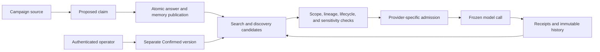
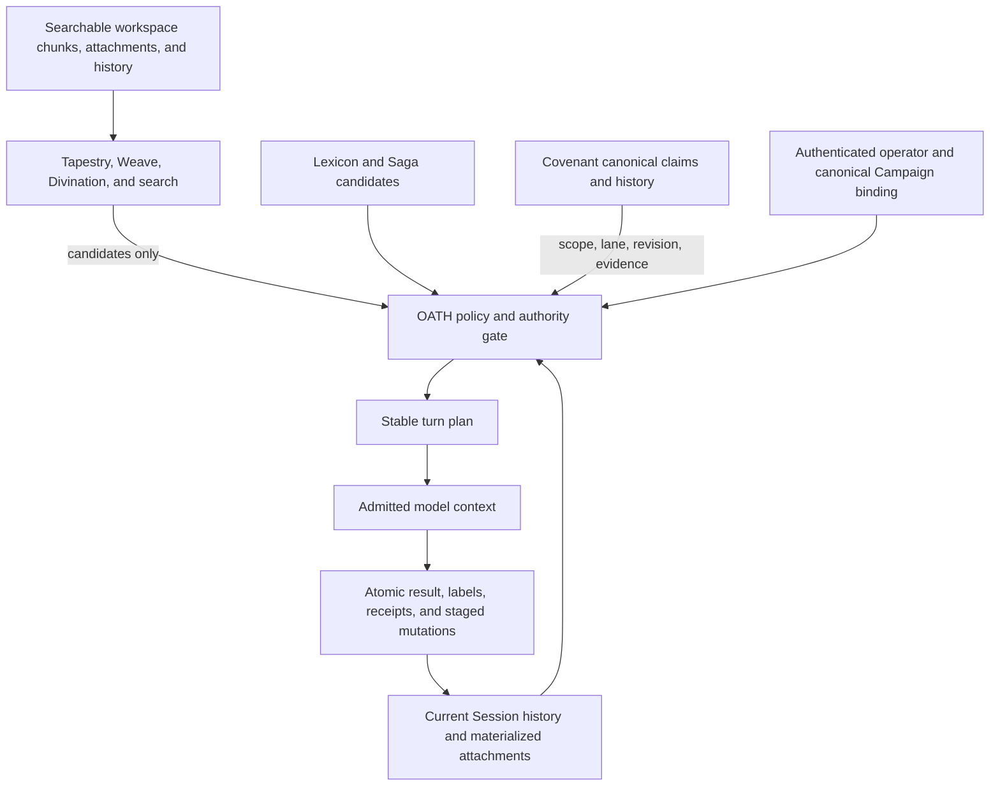

# OATH: A Human Guide to Arcanum's Memory Architecture

> **The short version:** OATH is Arcanum's promise that a memory cannot gain power merely because it was copied, summarized, retrieved often, or stated confidently.
>
> OATH stands for **Origin-Bound, Authority-Conserving Transactional History**. Its central rule is: **Memory cannot outrank its origin.**
>
> This is the approachable guide. [`Arcanum.OATH.md`](Arcanum.OATH.md) provides the complete technical explanation and source map. The broader shipped design remains authoritative in [`Arcanum.DESIGN.md`](Arcanum.DESIGN.md).
>
> **Branch parity.** This guide and [`Arcanum.OATH.md`](Arcanum.OATH.md) are kept byte-identical on `main` and `long-term-memory`. The implementation they describe still lives only on `long-term-memory`; section 11 is the boundary.

---

## 1. OATH in one minute

An AI assistant can remember a great deal without knowing what any memory is allowed to mean.

Consider these three sentences:

- An operator says, "Production billing uses PostgreSQL."
- An agent infers, "Production billing probably uses PostgreSQL."
- A search index returns text containing, "Production billing uses PostgreSQL."

The words may be identical, but their authority is not.

OATH preserves that difference. Every durable memory travels with its papers: where it came from, who authorized it, where it may apply, which version is current, what sensitive information it contains, and what later artifacts were derived from it.

A memory may become shorter, easier to find, or more useful. It may not quietly become more powerful.

OATH is not one database or one feature. It is the shared set of rules that governs Arcanum's memory systems. The **Covenant** is the subsystem that supplies the governed claim and authority foundation. The **Grimoire** stores encrypted records. The **Lexicon**, **Saga**, **Tapestry**, **Weave**, Session history, and future **Long Rest** each serve different memory roles. OATH controls what happens when information crosses between them.

## 2. Why AI memory needs rules

Ordinary memory systems tend to collapse several different questions into one:

> "The search found this. Should I put it in the prompt?"

That is too simple for a durable agent. A useful memory system must ask at least:

1. Where did this information come from?
2. Who, if anyone, approved it?
3. Which Campaign is it allowed to influence?
4. Is it still current, or has it been corrected or retired?
5. Is it sensitive?
6. Can it fit in this particular model request?
7. Has it already been disclosed outside Arcanum?
8. What should happen to its summaries, indexes, and files if it is erased?

A vector match answers none of those questions. It only says that two pieces of text are similar.

Without stronger rules, familiar failures appear:

- A model guess is repeated until it looks like an established fact.
- A Campaign-specific instruction leaks into an unrelated Campaign.
- A summary loses the sensitivity or limitations of its sources.
- A retry observes new memory halfway through one logical turn.
- A search index becomes an accidental source of truth.
- A reset deletes a canonical row but leaves a derived file or embedding behind.
- An external disclosure is forgotten even though it cannot be recalled.

OATH treats these as architecture problems, not prompt-writing problems.

A **Campaign** is Arcanum's persistent authority scope for one body of work. It may reference a verified Workspace root, but a Campaign and a Workspace are not the same thing.

## 3. Follow one memory through OATH

Suppose an agent reads a versioned design note attached to a Session inside the **Northstar Campaign** and infers:

> Billing data is stored in PostgreSQL.

This example explains the target OATH integration. Most of the machinery below is built and tested, but none of it is reachable from a live turn yet, and the feature is off by default. Section 11 explains that boundary.

### 3.1 It begins as a source-bound proposal

The agent did not receive permission to declare a universal fact. It may create a **Proposed** Campaign memory, but that proposal remains bound to:

- the Northstar Campaign;
- the source attachment and its exact version or materialized range;
- the turn that produced the proposal;
- the agent-proposed authority lane;
- the content's sensitivity;
- an immutable revision and content identity.

The text itself cannot ask for Global scope, Confirmed status, tool access, or a weaker sensitivity label. Those properties come from platform policy and authenticated authority, not from model output.

### 3.2 It publishes only with the answer that produced it

During the model and tool loop, the proposal remains in temporary turn-local storage. It is not yet canonical memory.

If the assistant turn succeeds, Arcanum publishes the final assistant entry and its staged memory mutation together in one local transaction. If the turn fails, is cancelled, loses a race, or its branch is abandoned, neither side is published.

This prevents a failed answer from leaving behind a successful-looking memory.

### 3.3 Seeing it again does not increase its authority

On a later Northstar turn, Covenant can load the current scoped proposal directly. Its inspection index may also find it for an operator. Elsewhere in OATH, embeddings, the Lexicon, the Saga, and other discovery systems return candidates from their own stores.

Being loaded or discovered does not increase authority. OATH still checks:

- Does the current Session belong to Northstar?
- Is the source lineage intact?
- Is the proposal active rather than retired?
- Does its sensitivity permit this use?
- Does current policy allow Proposed memory on this execution surface?
- Is there space in the selected provider's concrete context window?

Discovery answers "What might be relevant?" OATH answers "What is this candidate allowed to do?"

### 3.4 It reaches the model as fenced data

If the proposal is eligible and fits, it enters a clearly marked **DATA** section. It does not enter the operator-authorized **CONTEXT** section and cannot grant tool permission.

If context becomes tight, Proposed material is the first OATH tier removed. Arcanum does not keep an arbitrary middle selection. It admits a deterministic prefix so the same inputs produce the same decision.

### 3.5 An operator action creates a separate Confirmed claim

Later, an authenticated operator may verify the architecture and independently set a matching Confirmed claim.

OATH does not rewrite the old proposal to pretend it was always authoritative. The operator action creates a new immutable Confirmed version and receipt. The earlier proposal and its lineage remain part of history. A streamlined review-and-confirm curation workflow is planned later, but it must preserve this same separation.

Even then, **Confirmed does not mean objectively true**. It means operator-authorized for the stated scope and revision.

### 3.6 Summaries inherit the source's constraints

Suppose the confirmed fact contributes to a Session summary or, in the future, a Campaign rollup. The shorter text does not become source-free. The derivative keeps lineage to every contributor and conservatively inherits their sensitivity. Tapestry is not a destination for protected Covenant-derived content.

If several sources contribute, the result cannot be more authoritative than its least-authorized source, cannot apply outside their permitted scope, and cannot use a sensitivity lower than the most sensitive contributor.

### 3.7 Correction, retirement, and erasure remain distinct

If Northstar later moves billing to another database, correction creates another immutable version. Retirement adds a tombstone so the old claim stops participating in current turns without erasing the fact that it once existed.

Erasure is a separate operation. It follows the owned dependency chain through labels, summaries, indexes, embeddings, and managed files. It can remove Arcanum's local copies when identity checks succeed. It cannot recall bytes already sent to an external provider or recipient.

## 4. The four promises in OATH

### 4.1 Origin-Bound: every memory travels with its papers

Origin is more than a source URL. Depending on the memory, it can include a Session, Campaign, attachment version, byte range, producing turn, model attempt, source revision, content digest, or transformation receipt.

OATH keeps this evidence immutable. Deleting a source may make it unavailable, but it does not rewrite surviving history so that a derivative appears to have no source.

If origin evidence is missing or malformed, the safe result is refusal, quarantine, repair, or erasure. Arcanum does not guess.

### 4.2 Authority-Conserving: processing cannot promote information

Summarization, extraction, translation, ranking, repetition, and model confidence do not create authority.

An ordinary transformation may narrow what a memory can do. It may not:

- turn Proposed data into Confirmed context;
- broaden one Campaign's memory into Global memory;
- remove inconvenient lineage;
- lower sensitivity;
- turn data into instructions;
- grant access to a tool;
- make a retired revision active again.

An authority increase is possible only through a new authenticated action, such as an operator confirmation. That action creates a new durable claim and receipt. It is not a hidden side effect of processing the old claim.

### 4.3 Transactional: related local results appear together

Within the Grimoire, OATH uses local transactions, immutable versions, guarded current pointers, and idempotency receipts. The key rule for an agent turn is simple:

> The assistant result and its staged memory changes publish together, or neither publishes.

This does not make the internet transactional. A provider call, tool process, filesystem rename, or message cannot be rolled back by SQLite.

For those effects, OATH records authorization before disclosure, freezes exact effect identities, uses idempotent operations where possible, and writes recovery journals around irreversible boundaries. Transactional therefore means atomic local publication plus evidence-backed recovery, not a magical distributed transaction.

### 4.4 History: correction adds a revision

OATH treats current state as a view over history, not as one mutable truth slot.

Claims have immutable versions. Retirements are tombstones. Dataset generations make a reset or restore a hard boundary. Receipts distinguish a replay from a different request. Derived artifacts bind the source revisions from which they were produced.

This avoids a dangerous pattern in which a record changes while retaining the same identity, making old work appear current. It also lets an operator see how a memory changed and why.

OATH is ready to grow into full bitemporal memory, where transaction time and real-world valid time are separate. That full valid-time model is roadmap work, not a claim about today's implementation.

## 5. Confirmed and Proposed are deliberately different

The Covenant has two independent authority lanes.

| Question | Confirmed | Proposed |
|---|---|---|
| How is the lane populated? | An authenticated operator action creates a claim | An eligible agent turn stages a suggestion without granting authority |
| What does it mean? | Operator-authorized context for its exact scope | Untrusted agent-produced data for review or bounded use |
| Where may it live? | Global or one Campaign | One Campaign only |
| How is it shown to the model? | Structured `CONTEXT` | Fenced `DATA` |
| Can it grant tool access? | No | No |
| How do same-key values interact? | Campaign Confirmed may shadow Global Confirmed within this lane | Proposed never shadows Confirmed and becomes review-only when effective Confirmed content has the same key |
| What happens under context pressure? | It is not selectively evicted; after optional material is exhausted, failure is safer than silent omission | It is the first OATH material removed, using deterministic prefix admission |
| Is it guaranteed true? | No | No |

Keeping the lanes independent matters. An agent can propose a correction without erasing or silently replacing an operator's current instruction. An operator can inspect both and create a new Confirmed revision if appropriate.

## 6. The five decisions OATH keeps separate

A single memory can receive five different answers:

1. **Retention:** Does Arcanum store it durably?
2. **Discovery:** Can an index or search system find it?
3. **Eligibility:** Does policy allow it to influence this execution?
4. **Admission:** Does it fit in this exact provider request?
5. **Authority:** What is it allowed to mean?

For example, the Northstar proposal may be retained and easy to discover, yet ineligible in another Campaign. It may be eligible in Northstar but excluded from one small-context provider attempt. If admitted, it still remains Proposed data.

This separation prevents ranking scores from becoming security decisions.

### 6.1 One stable plan per logical turn

At the start of an eligible top-level turn, Arcanum reads one bounded Covenant snapshot and builds one stable Covenant plan. Retries, tool continuations, fallbacks, and compression steps reuse that logical plan. Session history and other memory systems remain separately governed inputs rather than part of one cross-store snapshot.

Each actual model call measures its concrete model, prompt, tools, and context budget. Arcanum freezes the exact request and records what fit. A call that will send protected material also gets the required disclosure evidence; an unprotected call does no disclosure work.

This means a retry cannot silently pick up a memory that changed halfway through the turn.

### 6.2 Clean disabled calls remain clean and cheap

When Covenant injection is disabled and the Session has no protected Covenant history, the ordinary history path does no optional Covenant work. It produces no Covenant prompt bytes and no Covenant tools, and the resulting prompt is byte-for-byte what it was before any of this existed. That is a tested guarantee rather than an intention.

Disabling future injection does not erase history. If a Session already contains protected Covenant-derived material, its reads and derivatives remain protected even while the feature is disabled.

### 6.3 Protected disclosure is acknowledged before sending

Before protected material leaves Arcanum for a provider, external MCP server, process, network destination, message sink, or another content-bearing external effect, the system durably acknowledges the disclosure identity. Some effects also require an attended **Ward**, which is Arcanum's explicit operator approval boundary for sensitive or dangerous work.

The receipt does not make disclosure reversible. It makes the decision visible, ordered, and recoverable.

## 7. How Arcanum's memory systems fit together

OATH does not replace Arcanum's existing memory systems or force them into one table. Each system has a different job.

| System | Plain-language role | OATH boundary |
|---|---|---|
| **Grimoire** | Encrypted local record book and transaction substrate | Stores canonical and derived records but does not decide their authority by itself |
| **Covenant** | Governed durable claims and operator or agent profile | Supplies Confirmed and Proposed lanes, immutable versions, policy, evidence, and publication rules |
| **Lexicon** | Explicit entity and fact memory | Stores untrusted data rather than automatic Confirmed context; attachment-derived facts retain their typed source provenance |
| **Saga** | Extracted associations and conclusions | Keeps source lineage and inherited sensitivity; retrieval does not prove truth |
| **Tapestry** | Rebuildable hierarchy of summaries | Helps navigate large corpora but remains a derived discovery structure |
| **Weave and Divination** | Embeddings, similarity, and ranking | Find candidates only; they do not establish authority |
| **Session history** | Episodic record of a conversation | Preserves turns and derived summaries with labels and revision evidence |
| **Long Rest** | Planned consolidation and adaptation | Will deduplicate, decay, reinforce, and supersede only with transformation and outcome evidence |

The useful shorthand is:

> Search proposes candidates; OATH decides what they are allowed to mean.

## 8. Privacy follows the information

Sensitivity is attached to information flow, not just to the table where bytes first appeared.

If protected Session history contributes to a summary, title, fact, embedding, file, notification, or log projection, the result must either:

- carry the combined sensitivity and lineage;
- use a deliberately content-free projection;
- stay inside an approved destination that preserves the same protection;
- leave through the required attended Ward and acknowledged disclosure when policy permits; or
- be refused.

The model is not allowed to label its own output as less sensitive than its inputs. Multiple inputs combine conservatively.

### 8.1 Local and external effects are different

Arcanum deletes database records through transactional ownership, revision, and dependency checks. For a managed file, it also proves that the file is still the physical object it created. A file identity or content mismatch becomes a manual blocker rather than permission to delete an unknown replacement.

An external disclosure is different. Provider logs, recipient messages, unmanaged filesystem copies, caches, and backups may outlive Arcanum's local record.

OATH records those effects as nonrevocable. A reset may remove local protected material, but it must not claim that a provider or recipient forgot it.

## 9. Correct, retire, reset, and erase mean different things

These words describe separate operations:

| Operation | What it does | What it does not claim |
|---|---|---|
| **Correct** | Adds a new immutable version and moves the current view | Does not rewrite the old version |
| **Retire** | Adds a tombstone so a claim stops current participation | Does not pretend the claim never existed |
| **Backup** | Preserves encrypted state and the evidence needed to interpret it | Does not make protected data public or source-free |
| **Restore** | Creates a fresh dataset generation, reconciles imported state, and preserves valid labels and history | Does not import deletion authority for source-machine files or resume stale in-flight turns |
| **Reset** | Removes a governed local memory family and its owned local derivatives | Does not revoke past external disclosure |
| **Erase** | Traverses a specific owned dependency closure and proves local deletion outcomes | Does not delete bytes whose current identity cannot be proven |

A restored database gets a fresh generation identity. That makes old work, old leases, and stale current pointers unable to masquerade as current after replacement.

Restoring an archive that carries governed memory is not something that happens by default. Putting that memory back is a decision only the operator can make, so the restore refuses until they make it explicitly — and refuses to keep it at all if the machine the backup came from could not prove it had never been exposed to unsandboxed tools. From there the only way forward is to say, explicitly, that the memory should be destroyed, which happens in the staged copy before anything is replaced. Either answer is asked for on its own, after the operator has been told what local deletion cannot reach and how much has already left. That answer is now something the operator types: the restore command takes the choice as an option, and a word it does not recognize is refused before anything at all is staged rather than quietly read as the safe default.

Bringing single sessions across from an archive works the same way. Once governed memory is switched on, a session the archive had filed under a campaign is never imported loose: the operator has to say which campaign on this machine it belongs to, by identity rather than by name, because two machines can use the same name for different campaigns and either name can be changed afterwards. With the feature off there is no governed memory to protect, the import works as it always has and files every session under no campaign, and asking for a campaign there is refused outright rather than quietly ignored. If they do not say, the import refuses and tells them which archived campaign is unaccounted for; if the campaign they name does not exist here, that is refused too, before anything is copied.

Leaving by the other door is refused outright. A session that holds governed material cannot be exported as plaintext — no JSON file, no Markdown file, no partial version with the protected parts taken out. The refusal lands before the transcript is even gathered, and there is no answer the operator can give that turns it into an export, because an encrypted archive can be kept under a passphrase or deleted while a plaintext file is simply out in the world once it exists. Destroying the session's governed artifacts afterwards does not re-open that door either: holding them is what is being remembered, not still holding them. A campaign bundle, which never carried that memory to begin with, now reports in plain numbers what it left out, so a campaign with governed memory no longer produces a file indistinguishable from one that never had any.

## 10. What happens when something goes wrong

OATH fails closed when the missing fact is about authority rather than convenience.

- Missing or malformed origin evidence leads to refusal, quarantine, repair, or erasure.
- A broken full-text or vector index may reduce discovery quality, but it cannot become a substitute canonical source.
- If required Confirmed context cannot fit after evictable material is exhausted, the call fails rather than quietly omitting operator-authorized context.
- A stale generation cannot disclose protected bytes or commit a late result.
- A failed or abandoned agent branch publishes no staged proposal.
- Uncertain external dispatch preserves disclosure evidence and uses a new physical attempt identity for any retry.
- Destructive work closes the affected scope, waits for existing work to finish, and keeps it closed until the journaled operation completes or recovery safely resumes that exact operation.
- A file identity or hash mismatch leaves the bytes untouched and reports a manual blocker.

These rules favor an explicit unavailable state over a plausible but unauthorized result.

### 10.1 Recovery cannot invent authority

Before crossing a dangerous boundary, an operation records who owns it, what exact effect it intends, which scope it affects, and how far it has safely progressed. On restart, recovery may resume only that recorded operation.

The operation eventually chooses one outcome:

- commit the change and reopen the scope;
- roll it back and reopen the scope; or
- keep the scope closed because safe completion is not yet proven.

This prevents a restart from treating half-finished work as permission for a different operation.

## 11. What exists now and what comes next

**Status as of 2026-08-17**, on the `long-term-memory` branch.

OATH describes a combination of built foundations and approved target architecture. It is not yet reachable end to end, and **the feature is off by default**.

| Stage | Human summary |
|---|---|
| **Built** | The pure Core Covenant language, normalization, canonical encoding, evidence and sensitivity rules, linking, and admission contracts. The hermetic SQLCipher runtime and connection-authorization foundation. The three-tier database catalogs and their health publication. Canonical storage, the operation gate that closes and drains work before anything destructive, the single mutation kernel, and the degradable search accelerator. Invocation authority and canonical Campaign binding. Prompt placement, token attribution, admission, disclosure-before-dispatch, and one-transaction publication. The two agent tools and their single-use capability protocol. Derived-output labelling and the host-process-tools taint gate. The frozen public and recovery contracts. Maintenance and protected-erasure recovery. The feature gate and the pre-binding authority boundary. Disclosure-aware backup, and a restore that authenticates its own crash-recovery evidence, recovers topology and authority before readiness, reconciles protected state in staging, and refuses to reinstate someone else's memory without an explicit, separately confirmed answer. And the refusal of plaintext export: a session that holds protected material cannot be written out as a readable JSON or Markdown file at all, and a campaign bundle now says in numbers what it left behind instead of leaving it out in silence. The restore command also finally asks the operator for those choices in words they can type, instead of leaving them reachable only from code. |
| **In flight** | Retention, reset, and full installation erasure. Then the release qualification gate: performance, Native AOT, coverage, security review, and documentation. |
| **Not yet reachable** | Almost nothing above is wired to a route, a command, or a live turn. The plumbing exists and is tested; the taps are not connected, and no configuration key turns it on for real work yet. There are two exceptions, both on surfaces that already existed rather than new ones: the export refusal on two endpoints, and the two new restore options. With the feature off the export refusal is inert and the restore options change nothing about what a restore does — they refuse a request this build could not honour, rather than accepting it and doing nothing. |
| **Later evolution** | Campaign-scoped retrieval, a genuine Campaign rollup so a new session resumes warm, the Long Rest consolidation sweep, operator curation across every store, counterfactual usefulness evaluation, scoped agent recall, cacheable context, typed operational defaults, least-authority subagent capsules, and full bitemporal dependency-aware claims. |

One practical caveat worth knowing: the shipping build targets `osx-arm64`, `win-x64`, and `win-arm64`. Only the macOS native asset is verified today; the two Windows assets are absent, and those builds intentionally fail rather than quietly falling back to a system library.

The formal [OATH architecture](Arcanum.OATH.md) carries the precise per-issue status and dependency map. The important practical distinction is this: the rules described here are the approved architecture, and most of the machinery now exists, but nothing in the current executable turns it on.

## 12. What OATH does not claim

Clear boundaries make the architecture more useful.

OATH is not:

- **A truth oracle.** Confirmed means operator-authorized, not objectively correct.
- **Automatic promotion.** A model cannot make a proposal authoritative through confidence, repetition, summarization, or retrieval frequency.
- **One universal memory database.** Arcanum keeps distinct stores and projections with distinct roles.
- **A blockchain.** Digests and receipts provide local canonical identity and evidence, not public consensus.
- **A distributed transaction.** Local publication can be atomic; provider and filesystem effects require receipts and recovery.
- **Remote erasure.** Arcanum cannot reliably delete provider logs, recipient copies, caches, or unmanaged backups.
- **Full bitemporal reasoning today.** Immutable history and generations exist as foundations; full valid-time semantics remain planned.
- **Ambient subagent access.** Subagents, daemons, batches, and unattended work receive no protected memory by default. Future delegation must use explicit least-authority capsules.
- **Perfect operating-system isolation.** Same-user native code and explicitly trusted external tools remain part of the installation's trust boundary.

OATH does permit authority to become narrower. It also permits an authenticated operator to create a new, more authoritative claim. It forbids hidden amplification by the memory pipeline itself.

## 13. Plain-language glossary

| Term | Plain meaning |
|---|---|
| **Admission** | The decision about which eligible material fits one concrete model request |
| **Authority** | What a memory is allowed to mean or influence, independent of its wording |
| **Campaign** | Arcanum's persistent project and authority scope; it may reference a verified Workspace root but is not itself a Workspace |
| **Canonical** | The authoritative durable representation, rather than a rebuildable index or cache |
| **Claim** | A durable assertion with origin, scope, authority, lineage, and revision history |
| **Confirmed** | Operator-authorized Covenant context; not a guarantee of truth |
| **Derivative** | A summary, fact, embedding, file, or other artifact made from earlier information |
| **Discovery** | Finding a candidate through search, ranking, or hierarchy |
| **Generation** | A random dataset identity that separates state before and after reset or restore |
| **Grimoire** | Arcanum's encrypted local persistence and transaction substrate |
| **Lineage** | Evidence connecting a memory to its sources, versions, turns, and transformations |
| **Proposed** | Campaign-only, agent-suggested Covenant data that remains untrusted |
| **Receipt** | Durable evidence binding a particular mutation, provider attempt, disclosure authorization, or lifecycle outcome; its exact meaning depends on the receipt type |
| **Sensitivity** | The conservative protection level that follows information and its derivatives |
| **Tombstone** | An immutable retirement version that stops current use without erasing history |
| **Ward** | Attended operator approval for a classified sensitive or dangerous effect |

## 14. Where to go next

- Read [`Arcanum.OATH.md`](Arcanum.OATH.md) for the complete technical architecture, invariants, implementation layers, recovery contracts, verification model, and source map.
- Read [`Arcanum.DESIGN.md`](Arcanum.DESIGN.md) for the authoritative shipped architecture and persistence design.
- Read [`Arcanum.Design.Human.md`](Arcanum.Design.Human.md) for a wider plain-language tour of the entire Arcanum system.
- Read [`Arcanum.CHAT-LOOP.md`](Arcanum.CHAT-LOOP.md) for the detailed shared model and tool loop that OATH's runtime rules extend.

The idea to carry forward is simple:

> Every memory travels with its papers. Search may make it easier to find. A model may make it shorter or more useful. Only authenticated authority can make a new claim more powerful.
