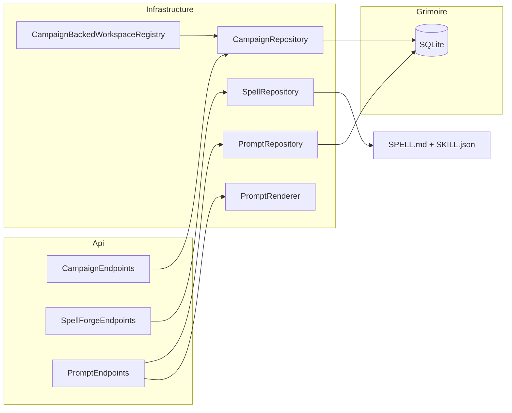
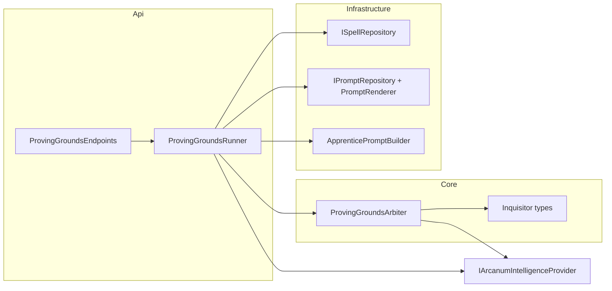

# Arcanum — Design Document

This document captures the **architecture, design decisions, and tradeoffs** for the Retro Downfall **Arcanum** solution. The intended audience is **senior C# / .NET engineers** who will extend, review, or operate the system.

**Keeping this document accurate:** When any change under `src/` alters architecture, observable behavior, or names described here, update the relevant sections in the same change set. Pair operator-visible behavior changes with `README.md` updates.

---

## 1. Purpose and scope

**Arcanum** is a **single deployable CLI** that can:

1. Run **terminal-oriented commands** — currently `ask` (single-prompt LLM inference with optional Grimoire thread continuation), `chat` (interactive multi-turn REPL), `look` (workspace perception), `lore` (key-value CRUD), `daemon` (OS-level background service lifecycle plus **API-first** monitoring of Unseen Servant jobs via `daemon jobs`, `daemon initiative`, and Comm Link smoke tests via `daemon alert` when Kestrel is up), and `llama` (manage the local **LlamaCpp** inference backend — GGUF model pull/cache and `llama-server` process lifecycle via `llama pull`, `llama start`, `llama stop`, and `llama status` when Kestrel is up).
2. Act as a **long-running HTTP host** exposing a Minimal API surface (the `serve` command).

The codebase is organized as a **multi-project solution**: `Core` (domain primitives, contracts, configuration), `Infrastructure` (Serilog, Data Protection, encrypted Grimoire via EF Core + SQLCipher, workspace scanning, Eye of the World perception, MCP client layer with both subprocess and in-process transports), `Api` (HTTP surface, multi-provider intelligence hub, semantic spell routing, API-key security), and `Cli` (Spectre.Console.Cli entry point). All projects target **Native AOT readiness** where the toolchain allows.

Key subsystems described in later sections: hybrid hosting model (§5), HTTP JSON design (§8), intelligence pipeline with MCP tool integration (§10), local API security (§11), and Eye of the World situational awareness (§15).

---

## 2. Architectural goals

| Goal | Rationale |
|------|-----------|
| **Strict project boundaries** | Keeps compile-time dependencies honest, enables parallel ownership, and avoids the "everything references everything" failure mode. |
| **Hybrid process model** | One binary reduces deployment and versioning surface; operators choose mode via CLI verbs. |
| **Native AOT readiness for the host** | Eliminates the .NET runtime prerequisite so the CLI ships as a self-contained native binary. Secondary benefits: predictable startup and a smaller attack surface from reflection-heavy stacks — balanced against ecosystem limitations (§9). |
| **Minimal API over MVC** | Fewer moving parts, explicit endpoint mapping, and alignment with ASP.NET Core's AOT-oriented request pipeline. |
| **Source-generated JSON and request delegates** | Required for credible trimming and Native AOT compatibility; avoids runtime reflection. |

### 2.2 Remediation architectural gate (deferred policy changes)

The following items from the Arcanum code review require explicit product/architecture sign-off before implementation. **Defaults shipped without them:**

| Finding | Topic | Current decision |
|---------|-------|------------------|
| **#50** | Generate runtime `.sql` + `MigrationOrder` from EF migrations (Approach B) | **Deferred.** Schema changes ship in the existing hand-authored SQL scripts; migrator wraps each script + history row in one transaction (Approach A). |
| **#25** | Child-process environment allowlist for MCP / `execute_command` | **Done.** `execute_command` strips `ARCANUM_*` secret/config vars (provider API keys) from the child env before spawn while preserving `PATH`/`HOME`; **all** MCP servers (global + workspace) strip the inherited host env by default (`ShouldStripUserEnvironment`) and run only their scrubbed `cfg.Env`. A per-server **`inheritEnv`** allowlist re-admits named host variables (e.g. `["PATH","HOME"]` for `npx`) past the `IsBlockedEnvironmentVariable` deny-list. A full per-binary/per-var allowlist remains deferred. |
| **#10** | OpenAI `/v1` default tool policy for workspace-less requests | **Deferred.** Current exposure unchanged until product decides agentic-by-default vs allowlist. |
| **#45** | Persist Unseen Servant watermarks to the Grimoire | **Deferred (in-memory by design).** See §8.15; duplicate scheduled runs after restart are documented, not fixed. |

---

### 2.1 Naming conventions

See [README.md §Naming metaphor](README.md#naming-metaphor) for the complete metaphor. DESIGN.md uses the thematic names throughout.

---

## 3. Repository and solution layout

### 3.1 `src/` per project

Projects live under `src/` rather than the repository root for shorter CI paths, room for future top-level folders (`build/`, `docs/`, `test/`, `tools/`), and alignment with common monorepo conventions.

### 3.2 `Directory.Build.props`

Shared MSBuild properties: `TargetFramework` (`net10.0`), `Nullable` (`enable`), `ImplicitUsings` (`enable`), `LangVersion` (`latest`). A solution-wide **`PackageReference`** to **`Microsoft.Bcl.Memory`** (currently **10.0.8**) overrides vulnerable transitive versions (mitigates **CVE-2026-26127**). The vulnerable transitive line is declared by **`Microsoft.ML.Tokenizers.Data.O200kBase`** (netstandard2.0 shim dependencies), not by Native AOT. Individual `.csproj` files focus on what differentiates each project.

### 3.3 Package versions

Most package versions are tracked in `.csproj` files (the per-project source of truth). **`Microsoft.Bcl.Memory`** is the exception: it is pinned once in **`Directory.Build.props`** so every project’s graph resolves to a patched build above the CVE floor (**≥ 10.0.4** on the 10.x line). All other first-party `Microsoft.*` packages in project files are pinned to **10.0.8**; `Microsoft.Extensions.AI`, **`Microsoft.Extensions.AI.Abstractions`**, and **`Microsoft.Extensions.AI.OpenAI`** to **10.6.0**. **`OllamaSharp`** (Api provider) is pinned to **5.4.25**. **`Microsoft.ML.Tokenizers`** and **`Microsoft.ML.Tokenizers.Data.O200kBase`** remain at **2.0.0** (latest stable; still requires the Bcl.Memory override until upstream updates its nuspec). Upgrades should be deliberate — re-run `dotnet publish` with AOT analysis and verify zero warnings before committing.

### 3.4 Configuration reference (`ArcanumSettings`)

Operator-facing settings bind under the `Arcanum` JSON object in `arcanum.json` (see `README.md`). The config file lives alongside the Grimoire in `ArcanumPaths.GrimoireDirectory` (`~/.config/arcanum/` on macOS and Linux, `%USERPROFILE%\.config\arcanum\` on Windows). Environment variables use prefix `ARCANUM_` with nested `__` segments.

| Configuration path | Type | Default | Clamp | Purpose |
|--------------------|------|---------|-------|---------|
| `Arcanum:Host:Port` | `int` | `5001` | 1 – 65,535 | Kestrel listen port. |
| `Arcanum:Host:RetainedLogFileCount` | `int` | `7` | 1 – 366 | Serilog rolling file retention (days). |
| `Arcanum:Host:EnableEnterpriseTelemetry` | `bool` | `false` | — | When `true`, Serilog adds a console sink with `CompactJsonFormatter` (structured JSON for log ingestion). |
| `Arcanum:Host:CorsAllowedOrigins` | `string[]` | localhost loopback (`5001`, `3000`) | — | Origins allowed by the **`ArcanumCors`** policy. Use `["*"]` to allow any origin (browser-callable; risk = key exfiltration on a compromised page). Empty array falls back to the localhost defaults. |
| `Arcanum:Host:EnableScalarUi` | `bool` | `false` | — | Mounts **`MapScalarApiReference`** under **`/api/scalar`**. The interactive HTML uses inline `<script>` / `<style>`; CSP header on the route restricts everything else (`default-src 'self'; frame-ancestors 'none'; base-uri 'none'`). Default is **off** to keep the published surface CSP-clean (`/api/openapi/v1.json` is always available). |
| `Arcanum:Host:SystemFingerprint` | `string?` | `null` | — | Optional override for the **`system_fingerprint`** field returned by `/v1/chat/completions`. When `null`, `OpenAiV1Endpoints` derives one from `AssemblyInformationalVersionAttribute` (for example `arcanum-0.1.0-beta`). Set explicitly to pin a fingerprint per deployment. |
| `Arcanum:Host:Workspace` | `string?` | `null` | — | Default workspace root for spell management routes (`/api/spells`) when `?workspace=` is omitted (`SpellWorkspaceResolver`; §8.14). Relative paths normalize via `Path.GetFullPath` against the process CWD — prefer absolute paths. |
| `Arcanum:Host:ListenAny` | `bool` | `false` | — | When `true`, Kestrel uses `ListenAnyIP` instead of `ListenLocalhost`. The environment variable `ARCANUM_HOST_ANY` always wins as an override so container deployments don't need rebuilds. Interactive `serve` requires a first-run acknowledgement (or `ARCANUM_LISTEN_ANY_ACK=1`); see §11.13. |
| `Arcanum:Host:MaxRequestBodyBytes` | `long` | `10485760` (10 MiB) | 256 KiB – 1 GiB | Kestrel `MaxRequestBodySize`. |
| `Arcanum:Host:RateLimit:Enabled` | `bool` | `false` | — | When `true`, `AddArcanumApiServices` registers `AddRateLimiter` and `ServeCommand`/DevHost call `UseRateLimiter()`. Both the `/api` and `/v1` endpoint groups get `RequireRateLimiting("ArcanumRateLimit")`. **Also enabled automatically** when the effective host bind is all-interfaces (`Arcanum:Host:ListenAny` or `ARCANUM_HOST_ANY`; §11.13). |
| `Arcanum:Host:RateLimit:PermitLimit` | `int` | `120` | 1 – 1,000,000 | Requests permitted per partition per window. |
| `Arcanum:Host:RateLimit:WindowSeconds` | `int` | `60` | 1 – 86,400 | Fixed window length (seconds). |
| `Arcanum:Host:RateLimit:QueueLimit` | `int` | `0` | 0 – 1,000,000 | Maximum queued requests per partition. `0` rejects with HTTP 429 immediately; positive values serve queued requests when the window replenishes. |
| `Arcanum:Server:PidFilePath` | `string?` | `~/.arcanum/arcanum.pid` | — | PID file written on host start, removed on graceful shutdown when it still contains this process's PID. `null`, empty, or whitespace disables. Stale files (dead PID) are overwritten; live PID causes startup failure. |
| `Arcanum:DefaultModel` | `string?` | `null` | — | When non-empty, must match a `models` entry on some provider (see `ProviderResolver`); used when `PingRequest.Model` is omitted. If null/empty, the first model of the first provider is used. Matching is case-insensitive with **symmetric** Ollama-style `:tag` handling — a bare name matches a tagged name in either direction (`llama3` ↔ `llama3:8b`), while two different explicit tags do not (`llama3:8b` ≠ `llama3:70b`). |
| `Arcanum:FastModel` | `string?` | `null` | — | When non-empty, must match a `models` entry on some provider. **Campaign Logger** (`Loremaster`) headless summarization and optional **spell-router preflight** (`UseFastModelForSpellRouting`) pass this as `PingRequest.Model` when set; if null/empty, summarization falls back to `DefaultModel` then the first configured model (same resolution order as `ProviderResolver` for an explicit model). |
| `Arcanum:Providers` | array | `[]` | element `contextWindowLimit` 256 – 2,097,152 | Multi-provider hub. Each element: `name`, `type` (`Ollama`, `OpenAICompatible`, or `LlamaCppServer`), `endpoint`, `apiKey` (optional; use `ARCANUM_` env vars for secrets), `models` (string[]), `contextWindowLimit` (int, default **8192**). `OpenAICompatible` targets OpenAI-shaped HTTP APIs (DeepSeek, Groq, GitHub Models, LM Studio, etc.). `LlamaCppServer` provisions local `llama-server` child processes and routes inference over OpenAI-compatible HTTP to `http://127.0.0.1:<port>/v1`; optional per-provider `llamaCpp.modelMap` (model key → source URL for on-demand GGUF download). For `type: LlamaCppServer`, the `endpoint` and `apiKey` fields are **ignored** (the hub targets the spawned local port with a placeholder credential). `contextWindowLimit` does **not** size the `llama-server` process — it feeds Arcanum's read-time compression threshold (§10.2.3) and the CLI mana bar, so set it to match the server's effective context size (typically `Arcanum:LlamaCpp:ContextSize`). The default mismatch (provider `contextWindowLimit` **8192** vs `Arcanum:LlamaCpp:ContextSize` **4096**) is intentional; operators should align them for accurate compression. |
| `Arcanum:Conclave:Enabled` | `bool` | `false` | — | Enables **The Conclave** (§5.7): the cross-Apprentice delegation surface. When `true`, the in-process `cast_sending` MCP tool is advertised and `POST /api/apprentices/{id}/cast` accepts delegations; when `false` (default) both are refused (`Apprentice.ConclaveDisabled`). Renamed from the former reserved `Arcanum:Bureau:Enabled` no-op (see README "Wire contract changes"). |
| `Arcanum:Conclave:MaxDelegationDepth` | `int` | `3` | 0 – 20 | Maximum delegation depth from a Conclave root Apprentice (0 = root only, no children). Enforced by **`ConclaveLineage`** before **`cast_sending`** / **`POST .../cast`** mint a child (`Apprentice.ConclaveDepthExceeded`). |
| `Arcanum:Conclave:MaxDescendantsPerRoot` | `int` | `16` | 1 – 200 | Maximum total descendant Apprentices allowed under one Conclave root (breadth cap). Lineage is resolved via hydrated **`ParentApprenticeId`** (no EF migration) (`Apprentice.ConclaveBreadthExceeded`). |
| `Arcanum:Intelligence:ExecuteCommandTimeoutSeconds` | `int` | `30` | 1 – 600 | Hard wall-clock cap for MCP `execute_command` and `run_spell_script` (runtime-coupled to `Mcp:RequestTimeoutSeconds`); cooperative cancel also terminates spawned process trees immediately, independent of this timeout. |
| `Arcanum:Intelligence:InferenceTimeoutSeconds` | `int` | `600` | 5 – 3,600 | Wall-clock cap for a single inference turn (buffered or streaming), including tool rounds. Linked to the caller cancellation token; on expiry the hub returns **`Hub.Timeout`**. |
| `Arcanum:Intelligence:ToolOutputCapBytes` | `long` | `1048576` (1 MiB) | 64 KiB – 64 MiB | Combined byte cap on stdout + stderr captured from `execute_command` and `run_spell_script` (split evenly per stream). Streams are truncated with a `[truncated: …]` marker beyond the cap. |
| `Arcanum:Intelligence:MaxToolInferenceRounds` | `int` | `8` | 1 – 64 | Hard cap on agentic tool rounds per inference turn. Beyond it the turn fails with `Hub.ToolLoop`. |
| `Arcanum:Intelligence:CompressionPreflightMinMessages` | `int` | `6` | 0 – 100 | Minimum assembled-message count before context-compression preflight runs (short threads skip tokenizer cost). |
| `Arcanum:Intelligence:PerMessageTemplateOverheadTokens` | `int` | `4` | 0 – 32 | Per-message overhead (tokens) added to the pre-flight count to approximate chat-template framing. |
| `Arcanum:Intelligence:TokenizerEncoding` | `string` | `"o200k_base"` | — | Tiktoken encoding name used by `InferenceTokenizerResolver`. Unknown names log a warning and fall back to `o200k_base`. |
| `Arcanum:Intelligence:SemanticRouterPreflightTimeoutSeconds` | `int` | `15` | 1 – 600 | Max wait for spell-router preflight call. |
| `Arcanum:Intelligence:SemanticRouterMaxTokens` | `int` | `50` | 1 – 4,096 | Spell-router preflight `MaxOutputTokens`. |
| `Arcanum:Intelligence:SemanticRouterTemperature` | `float` | `0` | 0 – 2 | Spell-router preflight temperature. |
| `Arcanum:Intelligence:ListDirectoryMaxPaths` | `int` | `500` | 1 – 2,000 | Max paths from in-process `list_directory`. |
| `Arcanum:Intelligence:EnableLoreSystem` | `bool` | `true` | — | Gates `read_lore`, `scribe_lore`, `delete_lore` MCP tools. |
| `Arcanum:Intelligence:EnableArchiveSearch` | `bool` | `true` | — | Gates `search_archives` MCP tool. |
| `Arcanum:Intelligence:ArchiveSearchMaxResults` | `int` | `5` | 1 – 100 | Max rows per `search_archives` call. |
| `Arcanum:Intelligence:ArchiveSearchMaxQueryLength` | `int` | `512` | 32 – 4,096 | Max query length before FTS sanitization. |
| `Arcanum:Intelligence:CampaignLogThreshold` | `int` | `25` | 1 – 10,000 | Message-count safety valve for Campaign Log consolidation. |
| `Arcanum:Intelligence:CampaignLogIdleTimeoutMinutes` | `int` | `240` | 1 – 43,200 | Idle minutes before a session is eligible for consolidation. |
| `Arcanum:Intelligence:CampaignLogSweepIntervalMinutes` | `int` | `15` | 1 – 1,440 | Background sweep interval for Campaign Log enqueue. Hot-reloads on the next sweep tick (no restart required). |
| `Arcanum:Intelligence:ContextWindowCompressionThreshold` | `int` | `85` | 50 – 100 | Percentage of the resolved provider `contextWindowLimit` at which **read-time** context compression is considered. Headroom for chat-template and tool-schema overhead not counted in the pre-flight pass. |
| `Arcanum:Intelligence:EnableContextCompression` | `bool` | `true` | — | When `true`, `WizardIntelligenceProvider` runs pre-flight token counting and may swap older Grimoire entries for `Session.Summary` in the assembled system prompt without deleting rows. When `false`, compression is skipped. |
| `Arcanum:Intelligence:EnableTokenTracking` | `bool` | `true` | — | When `true`, after each successful buffered or streamed inference turn with a bound `SessionId`, the hub calls **`IGrimoireRepository.IncrementSessionTokensAsync`** so **`Session.TotalTokensUsed`** reflects cumulative reported usage. Wire responses (NDJSON `result`, OpenAI `usage`) are still emitted when `false`; only Grimoire persistence is skipped. |
| `Arcanum:Intelligence:UseFastModelForSpellRouting` | `bool` | `false` | — | When `true`, semantic spell-router preflight uses **`Arcanum:FastModel`** (when configured) instead of the turn's model; falls back to the turn model otherwise. Behavior-affecting; default off. |
| `Arcanum:Intelligence:MaxOpenApiMessages` | `int` | `1000` | 1 – 10,000 | Maximum messages accepted in a single OpenAI `/v1/chat/completions` request before rejection. |
| `Arcanum:Intelligence:MaxStatelessMessages` | `int` | `100` | 1 – 10,000 | Maximum messages accepted on a stateless (no-session) native inference request. Each message's UTF-8 byte size (content **plus** tool-call arguments and multimodal content parts) is bounded by `Sessions:MaxEntryContentBytes`. |
| `Arcanum:Intelligence:MaxContentPartsPerMessage` | `int` | `64` | 1 – 1,024 | Maximum multimodal `content[]` parts per `/v1/chat/completions` message; exceeding it (or an unsupported part `type`) is rejected `400 invalid_value` before mapping. |
| `Arcanum:Intelligence:MaxPingPromptChars` | `int` | `32768` | 1 – 262,144 | Maximum prompt length (chars) for `POST /api/intelligence/ping(-stream)`; also bounds `AdditionalSystemPrompt`. |
| `Arcanum:Intelligence:MaxPlanSteps` | `int` | `30` | 1 – 200 | Maximum steps accepted in a parsed Apprentice plan. |
| `Arcanum:Mcp:RequestTimeoutSeconds` | `int` | `60` | 1 – 600 | Default per-request timeout for `McpClient` JSON-RPC. Must be ≥ `Intelligence:ExecuteCommandTimeoutSeconds` (validated at startup). Per-request timeouts also cancel in-process tool work via `McpRequestCancellationBroker`. |
| `Arcanum:Mcp:MaxPaginationPages` | `int` | `32` | 1 – 256 | Max `tools/list` pagination iterations. |
| `Arcanum:Mcp:BootstrapBlocksStartup` | `bool` | `true` | — | When `true` (default), AlwaysOn MCP servers finish bootstrapping before Kestrel accepts requests. When `false`, bootstrap runs in the background and tools attach as servers connect. |
| `Arcanum:Mcp:MaxServers` | `int` | `50` | 1 – 500 | Maximum MCP servers registered across user + workspace `mcp.json`. |
| `Arcanum:Mcp:MaxToolsPerServer` | `int` | `256` | 1 – 2,048 | Maximum tools accepted from a single MCP server's `tools/list`. |
| `Arcanum:Mcp:MaxToolsPerListPage` | `int` | `64` | 1 – 256 | Maximum tools accepted per `tools/list` page. |
| `Arcanum:Mcp:MaxToolsTotalBytes` | `int` | `1048576` (1 MiB) | 64 KiB – 16 MiB | Maximum cumulative bytes of tool schemas held in memory across all servers. |
| `Arcanum:Mcp:MaxJsonRpcLineBytes` | `int` | `2228224` | 64 KiB – 8 MiB | Maximum length of a single newline-delimited JSON-RPC frame (also caps each Streamable HTTP JSON body / SSE event). Startup requires this ≥ the effective `Intelligence:ToolOutputCapBytes` (with JSON-RPC envelope margin). |
| `Arcanum:Mcp:HttpRequestTimeoutSeconds` | `int` | `120` | 10 – 600 | Timeout for the named `HttpClient("McpHttp")` Streamable HTTP transport (headers phase; the per-request JSON-RPC timeout governs streamed bodies). |
| `Arcanum:Mcp:AllowedHttpHosts` | `string[]` | `[]` | — | Hosts permitted over plaintext `http` for Streamable HTTP MCP servers (e.g. a trusted dev gateway). Empty (default) requires `https` for remote servers; `OutboundUrlGuard` SSRF blocking (loopback / private / link-local) applies regardless. |
| `Arcanum:Perception:MaxEnumerationSteps` | `int` | `50000` | 1 – 10,000,000 | File walk budget for Eye of the World. |
| `Arcanum:Perception:MaxTableOfContentsLines` | `int` | `20` | 1 – 500 | TOC line budget for `PatternSnapshot`. |
| `Arcanum:Perception:AllowedWorkspaceRoots` | `string[]` | `[]` | — | Allowlist of absolute roots that `GET /api/perception/look` may scan. **Empty (default) denies all paths** (`403` `Perception.PathNotAllowed`). Configure at least one root to permit look outside an explicit workspace. |
| `Arcanum:Spells:AllowedWorkspaceRoots` | `string[]` | `[]` | — | Allowlist of absolute roots for spell CRUD routes (`/api/spells`). **Empty (default) denies all workspace paths** (`403` `Spell.PathNotAllowed`; §8.14). |
| `Arcanum:Spells:MaxFileSizeBytes` | `long` | `262144` (256 KiB) | 1 KiB – 1 MiB | Maximum `SPELL.md` / frontmatter read size for spell list, get, search, and execute routes. Further capped by `Arcanum:Workspaces:MaxFileReadSizeBytes` via `ArcanumSettingClamps.EffectiveSpellMaxFileSizeBytes` (§8.14). |
| `Arcanum:Spells:MetadataScanCacheTtlSeconds` | `int` | `5` | 0 – 300 | TTL for the in-process spell-metadata scan cache used by routing and Arcane Resonance; `0` disables. |
| `Arcanum:Spells:MaxDependencies` | `int` | `20` | 0 – 100 | Maximum `dependencies` entries accepted in a spell's `SKILL.json` (Arcane Resonance graph). |
| `Arcanum:Spells:MaxDeclaredTools` | `int` | `50` | 0 – 256 | Maximum `declaredTools` entries in a spell's `SKILL.json` (Artifact Attunement allowlist). |
| `Arcanum:Spells:MaxResonantDependencies` | `int` | `10` | 0 – 50 | Maximum resonant dependencies resolved into the system prompt at execution. |
| `Arcanum:Spells:MaxResonantBytes` | `int` | `131072` (128 KiB) | 4 KiB – 1 MiB | Maximum total bytes of concatenated resonant dependency bodies. |
| `Arcanum:Campaigns:AllowedRoots` | `string[]` | `[]` | — | Allowlist of absolute roots for **`POST /api/campaigns`** and **`POST /api/workspaces`**. **Empty (default) denies registration** (`403` `Campaign.PathNotAllowed` / `Workspace.PathNotAllowed`; §8.17, §19). |
| `Arcanum:Campaigns:MaxCampaigns` | `int` | `500` | 10 – 10,000 | Maximum registered campaigns in the Grimoire database (§19). |
| `Arcanum:Cli:DoctorHealthTimeoutSeconds` | `int` | `2` | 1 – 60 | Timeout (seconds) for the `arcanum doctor` API health probe (`GET /api/health`). |
| `Arcanum:Cli:ApiRequestTimeoutSeconds` | `int` | `60` | 1 – 600 | Timeout (seconds) for non-streaming CLI API calls (`lore`, `daemon jobs`, `llama status`, session queries, etc.). Streaming verbs (`ask`, `chat`, `llama pull`) use a separate unbounded HTTP client. |
| `Arcanum:Cli:MaxAttachFileSizeBytes` | `long` | `1048576` | 1 KiB – 100 MiB | Per-file staging limit for `chat /attach`. |
| `Arcanum:Cli:MaxAttachedFilesPerRequest` | `int` | `32` | 1 – 256 | Max attached files per inference request. |
| `Arcanum:Cli:MaxAttachedFileRelativePathChars` | `int` | `4096` | 256 – 8,192 | Max `RelativePath` length per attachment. |
| `Arcanum:Cli:Theme` | `ArcanumTheme` | `SystemDefault` | — | CLI appearance: `Light`, `Dark`, or `SystemDefault` (uses `IThemeDetector` once at process start). |
| `Arcanum:Cli:ThemeColors` | object | Core defaults | — | Nested `Light` / `Dark`, each with `Text`, `Heading`, `Highlight`, `Error`, `Muted` as `#RRGGBB` strings (Spectre palette is built in **Cli**). |
| `Arcanum:Cli:ShowManaBar` | `bool` | `true` | — | When `true`, the **`chat`** REPL prints the context-window mana bar before each prompt (when a model resolves). Set `false` to suppress it (e.g. scripting / piped input). |
| `Arcanum:Security:MaxApiKeyHeaderUtf16Chars` | `int` | `512` | 128 – 8,192 | Rejects oversized API key headers before UTF-8 conversion. |
| `Arcanum:Security:ApiKeyCacheTtlSeconds` | `int` | `30` | 1 – 3,600 | TTL for the cached **SHA-256 digest** of the expected API key in `ApiKeyEndpointFilter`. After the TTL, the filter re-reads `ISecretStore` so on-disk rotation propagates without a restart. **`SaveApiKeyAsync`** also invalidates the digest cache immediately. |
| `Arcanum:Daemon:Jobs` | array | `[]` | per-job `intervalMinutes` 1 – 10,080 | Unseen Servant background jobs. Each entry: `name`, `intervalMinutes` (default `60`), `targetSpell`, `enabled` (default `true`). Runtime interval overrides via **`IUnseenServantPacer`** and MCP **`adjust_initiative`** (§5.5.2). When **`Arcanum:Intelligence:EnableLoreSystem`** is **`true`**, per-job lore key **`daemon_state_{job.Name}`** is pre-fetched and injected into the headless kickoff with **`scribe_lore`** instructions; when **`false`**, the kickoff is stateless (no lore read, no tool instructions) (§5.5.3). Both kickoff variants instruct the model to call MCP **`use_commlink`** for high-alpha / critical operator alerts (§5.5.4). |
| `Arcanum:Daemon:MaxConcurrentJobs` | `int` | `8` | 1 – 1,024 | Hard concurrency cap on Unseen Servant jobs the scheduler dispatches per minute; excess jobs defer. |
| `Arcanum:Daemon:ShutdownDrainTimeoutSeconds` | `int` | `10` | 0 – 600 | Time (seconds) `StopAsync` waits for in-flight Unseen Servant jobs (`Task` registry) to drain after the host begins shutting down. `0` disables waiting. |
| `Arcanum:Daemon:ExecutionHistoryLimit` | `int` | `100` | 10 – 10,000 | Maximum in-memory execution records retained per daemon job in `InMemoryDaemonExecutionRepository`. |
| `Arcanum:CommLink:WebhookUrl` | `string?` | `null` | — | Optional absolute URL for **Comm Link** outbound JSON `POST` alerts (`WebhookCommLinkDispatcher`). When unset, dispatchers log and return success without HTTP. |
| `Arcanum:CommLink:WebhookTimeoutSeconds` | `int` | `15` | 1 – 120 | Timeout (seconds) configured on the named `HttpClient("CommLinkWebhook")`. |
| `Arcanum:CommLink:AllowedSchemes` | `string[]` | `["https"]` | — | URI schemes the webhook dispatcher is allowed to call. Defaults to TLS only; add `"http"` explicitly to opt in to plaintext webhooks. Non-matching URLs are skipped with a warning (no HTTP call). |
| `Arcanum:CommLink:AllowedHosts` | `string[]` | `[]` | — | Optional allowlist of webhook hosts (e.g. `["hooks.example.com"]`). When non-empty, a configured `WebhookUrl` whose host is not listed is rejected at startup. |
| `Arcanum:Grimoire:MaxMessagesPerConversationLoad` | `int` | `1000` | 50 – 5,000 | Target size of the most-recent entry window `GetSessionAsync` loads (server-side, chronological order). The window is automatically widened to also include every entry after the summary watermark (`LastSummarizedMessageAt`), so read-time compression never silently drops un-summarized messages. Bounds RAM on very long Grimoire threads. |
| `Arcanum:Grimoire:WorkspaceContextRetentionCount` | `int` | `10` | 1 – 1,000 | Number of Chronosync `WorkspaceContext` snapshots retained per workspace path; older rows are purged after each new baseline. |
| `Arcanum:Grimoire:DefaultLoreListLimit` | `int` | `100` | 1 – 10,000 | Default page size for `GET /api/lore` when `limit` is omitted. |
| `Arcanum:EventBus:ChannelCapacity` | `int` | `256` | 64 – 65,536 | Per-subscriber bounded channel capacity for the in-memory SSE event bus (`IEventBus`). When full, **`DropOldest`** discards the oldest frame so publishers never block — appropriate for live dashboards. Capacity is fixed when a per-event-type hub is first created; config hot-reload does not resize existing hubs. Also reused for **`GET /api/events/logs`** subscriber channels (§8.16). |
| `Arcanum:EventBus:HeartbeatSeconds` | `int` | `30` | 0 – 300 | SSE keep-alive comment interval for `/api/events/*`, session stream, and Chronicle (`0` disables). |
| `Arcanum:EventBus:MaxSseConnections` | `int` | `20` | 1 – 100 | Global cap on concurrent SSE connections across all streams; excess returns `503` `Api.TooManyConnections` (§8.16). |
| `Arcanum:Logs:RingBufferCapacity` | `int` | `10000` | 1,000 – 100,000 | In-memory log ring buffer capacity. When full, oldest entries are overwritten (§8.16). |
| `Arcanum:Logs:MinLevelInBuffer` | `LogLevel` | `information` | — | Minimum Serilog level captured into the ring buffer (`trace`, `debug`, `information`, `warning`, `error`, `critical`). Applied in **`SerilogLogRingBufferSink`** only (§8.16). |
| `Arcanum:Workspaces:MaxFileReadSizeBytes` | `long` | `1048576` | 1 KiB – 10 MiB | Maximum file size (bytes) for **`GET /api/workspaces/{id}/files/contents`** (§8.17). |
| `Arcanum:Workspaces:ListDirectoryMaxDepth` | `int` | `64` | 1 – 256 | Maximum directory depth for recursive workspace file listing (`GET /api/workspaces/{id}/files?recursive=true`). |
| `Arcanum:Sessions:DefaultQueryLimit` | `int` | `100` | 1 – 10,000 | Default page size for **`GET /api/sessions`** (§11.16). |
| `Arcanum:Sessions:MaxStreamReplayEntries` | `int` | `500` | 1 – 10,000 | Maximum entries replayed on **`GET /api/sessions/{id}/stream`** connect (most recent N, ascending) (§11.16). |
| `Arcanum:Sessions:MaxEntriesPerSession` | `int` | `100000` | 100 – 1,000,000 | Maximum entries appended to one session before rejection. |
| `Arcanum:Sessions:MaxEntryContentBytes` | `int` | `1048576` (1 MiB) | 1 KiB – 16 MiB | Maximum content bytes per entry; also caps stateless `/v1` and ping message content. |
  | `Arcanum:LlamaCpp:ServerExecutablePath` | `string?` | `null` | — | Absolute or relative path to `llama-server`. When `null`, search `PATH` (and `llama-server.exe` on Windows). Relative paths resolve via `Path.GetFullPath` against the serve process CWD. |
  | `Arcanum:LlamaCpp:GpuLayers` | `int` | `0` | -1 – 1,024 | GPU layers for `--n-gpu-layers`. `0` = CPU only. `-1` = sentinel for offload all (mapped to `999` on the command line). |
| `Arcanum:LlamaCpp:ContextSize` | `int` | `4096` | 256 – 1,048,576 | Passed as `--ctx-size`. |
| `Arcanum:LlamaCpp:PortStart` | `int` | `50000` | 1 – 65,535 | First port when auto-selecting a listen port. |
| `Arcanum:LlamaCpp:PortRange` | `int` | `1000` | 1 – 65,535 | Consecutive ports to try from `PortStart`. |
| `Arcanum:LlamaCpp:MaxConcurrentRequests` | `int` | `4` | 1 – 256 | Per-server concurrent inference slots (`SemaphoreSlim`). |
| `Arcanum:LlamaCpp:HealthProbeTimeoutSeconds` | `int` | `30` | 1 – 600 | Timeout for `GET /health` during startup. |
| `Arcanum:LlamaCpp:StartTimeoutSeconds` | `int` | `120` | 1 – 600 | Max wait for a server to become healthy after spawn. |
| `Arcanum:LlamaCpp:ShutdownTimeoutSeconds` | `int` | `30` | 1 – 600 | Grace period before `Kill(entireProcessTree: true)` on shutdown. |
| `Arcanum:LlamaCpp:AdditionalArguments` | `string[]?` | `null` | — | Extra arguments appended to the `llama-server` command line. |
| `Arcanum:LlamaCpp:MaxCachedModels` | `int` | `5` | 1 – 100 | Maximum GGUF cache entries before LRU eviction (skips models with a running server). |
| `Arcanum:LlamaCpp:ModelDownloadTimeoutSeconds` | `int` | `3600` | 60 – 86,400 | Timeout for the named `HttpClient("LlamaModelDownload")` used to fetch GGUF files. |
| `Arcanum:LlamaCpp:ModelDownloadMaxBytes` | `long` | `53687091200` (50 GiB) | 1 MiB – 200 GiB | Maximum bytes accepted for a single GGUF download. |
| `Arcanum:LlamaCpp:ModelSha256Map` | `object?` | `null` | — | Optional SHA-256 hex digests keyed by model cache key; verified on GGUF download when present. When unset it behaves as an empty map (no pinned digests). |
| `Arcanum:LlamaCpp:RequireModelHash` | `bool` | `true` | — | When `true` (default), GGUF pulls must have a known SHA-256 (from `ModelSha256Map` or the pull request). Set `false` to allow unverified pulls, recorded as `verified:false` in the cache manifest. |
| `Arcanum:Ward:Enabled` | `bool` | `true` | — | When `true`, **Forbidden Arts** (high-risk tool calls) are gated behind an operator-resolvable ward before execution (§11.14). |
| `Arcanum:Ward:ForbiddenArts` | `string[]` | `execute_command`, `write_file`, `replace_text_block`, `delete_lore`, `run_spell_script` | — | Tool names that require ward resolution when `Enabled` is `true`. Case-insensitive match. `ask_human` is intentionally excluded (separate HITL mechanism). `scribe_lore` is intentionally excluded — write-only and non-destructive versus `delete_lore` (§11.14). |
| `Arcanum:Ward:TimeoutSeconds` | `int` | `120` | 10 – 600 | Max seconds an active ward waits for operator resolution before auto-denying. |
| `Arcanum:Ward:MaxActiveWards` | `int` | `50` | 1 – 500 | Maximum simultaneously-pending wards before new Forbidden Art requests are auto-denied. |
| `Arcanum:Ward:AutoDenyInUnattendedMode` | `bool` | `true` | — | When `true` and `PingRequest.UnattendedMode` is `true`, Forbidden Arts are denied immediately without placing a ward (prevents daemon jobs from hanging). |
| `Arcanum:Apprentices:Enabled` | `bool` | `true` | — | When `false`, **`ApprenticeService`** does not start or resume Apprentices (§5.7). |
| `Arcanum:Apprentices:MaxConcurrentApprentices` | `int` | `5` | 1 – 50 | Maximum Apprentices executing concurrently. Excess starts queue until a slot frees. |
| `Arcanum:Apprentices:StepTimeoutMinutes` | `int` | `30` | 5 – 120 | Per-step execution timeout for **`StreamPromptAsync`**. |
| `Arcanum:Apprentices:ChronicleChannelCapacity` | `int` | `1000` | 100 – 10,000 | Bounded **`ChronicleHub`** channel capacity per Apprentice. Overflow drops oldest. |
| `Arcanum:Apprentices:MaxStepRetries` | `int` | `2` | 0 – 10 | **Second Wind:** maximum retry attempts per step before escalation or failure. |
| `Arcanum:Apprentices:RetryBackoffSeconds` | `int` | `5` | 1 – 300 | Base delay (seconds) for exponential backoff between step retries. |
| `Arcanum:Apprentices:RetryBackoffMaxSeconds` | `int` | `60` | 1 – 3,600 | Maximum backoff delay (seconds) between step retries. |
| `Arcanum:Apprentices:EnableShiftingFate` | `bool` | `true` | — | When `true`, the **Wizard** evaluates each completed step and may rewrite the pending plan tail (**Shifting Fate**; §5.7). |
| `Arcanum:Apprentices:EnableDivineIntervention` | `bool` | `true` | — | When `true`, exhausted retries or `petition_dungeon_master` transition the Apprentice to **`Escalated`** instead of **`Failed`** (§5.7). |
| `Arcanum:Apprentices:MaxSimulacra` | `int` | `3` | 1 – 10 | **Simulacrum:** maximum plan steps flagged `isParallel` executed concurrently within one Apprentice. Each concurrent branch runs in its own DI scope (own pooled `ArcanumDbContext`) with stateless inference; the orchestrator persists results single-threaded after `Task.WhenAll` (§5.7). |
| `Arcanum:Apprentices:MaxRunSteps` | `int` | `100` | 1 – 500 | Per-run cap on steps executed in a single **`RunApprenticeAsync`** invocation (counts completed steps in that invocation, including Simulacrum groups). When exceeded, the run terminates via **Divine Intervention** or **`Failed`** per **`EnableDivineIntervention`**. |
| `Arcanum:Apprentices:MaxRunDurationMinutes` | `int` | `480` | 5 – 10,080 | Per-run wall-clock budget (minutes) for a single execution invocation. |
| `Arcanum:Apprentices:MaxReweavesPerRun` | `int` | `10` | 0 – 100 | Maximum **Shifting Fate** re-weaves allowed per run invocation (`0` disables further automatic re-weaves after the budget is exhausted). |
| `Arcanum:Apprentices:MaxPendingStarts` | `int` | `100` | 1 – 1,000 | Bounded queue for Apprentices waiting on a concurrency slot when **`MaxConcurrentApprentices`** is saturated (`Apprentice.PendingQueueFull` when full). |
| `Arcanum:Codex:MaxSizeBytes` | `long` | `262144` (256 KiB) | 1 KiB – 1 MiB | Maximum `CODEX.md` content size for `PUT /api/codex` and `PUT /api/campaigns/{id}/codex`. Further capped by `Arcanum:Workspaces:MaxFileReadSizeBytes`. |
| `Arcanum:ProvingGrounds:MaxInquisitorsPerTrial` | `int` | `20` | 1 – 200 | Maximum **Inquisitors** on a single **Trial** submitted to **The Proving Grounds** (§20). |
| `Arcanum:ProvingGrounds:SemanticJudgeMaxTokens` | `int` | `8` | 1 – 256 | Maximum completion tokens for a **Semantic Inquisitor** FastModel judge call (§20). |
| `Arcanum:ProvingGrounds:SemanticJudgeTimeoutSeconds` | `int` | `60` | 1 – 600 | Wall-clock timeout (seconds) for a Semantic Inquisitor judge inference call (§20). |
| `Arcanum:Prompts:MaxParameterValueChars` | `int` | `4096` | 256 – 65,536 | Maximum length (chars) of a single prompt parameter value on render/execute. |

**Campaign `SanctumConfigJson` (Grimoire column, not `ArcanumSettings`):** Each **`Campaign`** row stores a JSON **`SanctumConfig`** blob (`Enabled` default `false` for backward compatibility). When enabled, **`SanctumGuard`** enforces path boundaries (workspace root + optional `AllowedPaths`), network policy (`AllowAll` / `AllowList` / `DenyAll`), and per-tool blocks (`DisabledTools`) at tool-invocation time (§11.15). **`ResourceLimits.MaxFileWriteMb`** is runtime-enforced on in-process **`write_file`** / **`replace_text_block`**; **`read_file_chunk`** line ranges are bounded (max 2,000 lines per request, capped **`startLine`**). Process/memory limits remain deferred to phase 2. Configure via **`PUT /api/campaigns/{campaignId}/sanctum`**; review breaches via **`GET /api/campaigns/{campaignId}/sanctum/breaches`** (in-memory ring buffer, max 1,000 per campaign).

**Sanctum resource-limit clamps (Grimoire-column JSON, not `arcanum.json`):** the `SanctumConfig.ResourceLimits` block is **not** bound from `Arcanum:*`; its values are bounded by `ArcanumSettingClamps` at the use site — `MaxProcessMemoryMb` (64 – 8,192), `MaxProcessCount` (1 – 100), `MaxFileWriteMb` (1 – 1,024), `ProcessTimeoutSeconds` (10 – 3,600), and the breach-ring query `limit` (1 – 1,000). Configure per campaign via **`PUT /api/campaigns/{campaignId}/sanctum`** (§11.15).

**Startup validation.** On host start (`serve` and DevHost), an `IStartupFilter` (`ConfigurationStartupValidator`) runs `ConfigurationValidator.Validate` against the bound `ArcanumSettings` **before** the request pipeline serves. Semantically invalid configuration — an unknown `DefaultModel`/`FastModel`, MCP timeout / JSON-RPC line-size ordering, a llama `PortStart + PortRange - 1 > 65535`, or missing/relative allow-list roots — aborts startup with a clear logged message (controlled abort, not `Environment.FailFast`) instead of booting and failing later at runtime. The validator is null-tolerant for hand-edited configs: explicit `null` sub-objects (`intelligence`, `mcp`, `campaigns`, …) and a `null` provider `models` fall back to defaults rather than throwing. The same validator backs `POST /api/config/validate`; outbound-URL/SSRF checks (`OutboundUrlGuard`) continue to run on config writes (`PUT /api/config`).

All numeric settings have runtime clamps defined in `ArcanumSettingClamps`, and every consumer applies the corresponding clamp at the use site. When adding a property to `ArcanumSettings`:

1. Define the property on the relevant nested record with an XML doc summary and a sensible default.
2. Add a matching `ArcanumSettingClamps.<Name>` helper if the value is numeric (size, count, duration, threshold).
3. Apply the clamp at every read site (do not store the raw value).
4. Inject via **`IOptionsMonitor<ArcanumSettings>`** for singleton consumers (hot-reload friendly) or **`IOptionsSnapshot<ArcanumSettings>`** for scoped/per-request consumers. Singletons must never capture an `IOptionsSnapshot` value for the process lifetime.
5. Extend this table and the README **Configuration** table in the same change set.

#### 3.4.1 Degraded-mode fallback matrix

Single-host failure behavior referenced from the settings above:

| Condition | Behavior |
|-----------|----------|
| Provider unreachable / stalled | Actionable public message (provider name + endpoint + hint); buffered turns return **`Hub.Error`** / **`Ollama.Error`**; streaming turns emit an **`Error`** frame. Wall-clock stall beyond **`InferenceTimeoutSeconds`** returns **`Hub.Timeout`**. |
| MCP server failed bootstrap (AlwaysOn) | Prominent startup warning; server excluded from toolset; surfaced in **`GET /api/health`** MCP component counts. |
| Grimoire SQLITE_BUSY / locked | Bounded exponential backoff on writes (`SqliteBusyRetry`); then surfaced as API/CLI failure if still contended. |
| Disk full / partial `security.dat` write | Atomic temp+rename on `security.dat`; corrupt store fails with recovery guidance (§16.3) instead of silent key regen when a Grimoire DB exists. |
| Data Protection keyring corrupt | See §16.3 rotate-or-restore steps; **`arcanum key show`** reads the local store only (no HTTP). |

---

## 4. Project model and dependency graph

**Dependency chain:** `Cli` → `Api` → `Infrastructure` → `Core`. `Cli` also references `Core` and `Infrastructure` directly for standalone DI setup (Data Protection, `ISecretStore`, `AddArcanumEyeOfTheWorld`).

### 4.1 `RetroDownfall.Arcanum.Core` (class library)

**Role:** Domain primitives, shared contracts, configuration, security abstractions, and cross-cutting types with **no** ASP.NET Core hosting dependency.

**Namespace areas:**

- **`Primitives/`** — `Error` (readonly record struct), `Result` / `Result<T>` (success/failure with implicit conversions), `ApiResponse<T>` (sealed record wire envelope).
- **`CommLink/`** — `ICommLinkDispatcher`, `CommLinkMessage` (readonly record struct), `CommLinkSeverity` (string-enum JSON via `[JsonConverter(typeof(JsonStringEnumConverter<CommLinkSeverity>))]`).
- **`Events/`** — `IEventBus` (`Publish` / `Subscribe`), `ArcanumEvent` (abstract marker; not registered on `ArcanumJsonContext`), `DaemonEvent` / `DaemonEventType` (Unseen Servant lifecycle frames for SSE; `RunId` correlates Started → Completed/Failed; `DurationMilliseconds` on terminal frames), `LlamaServerEvent` / `LlamaServerState` (local `llama-server` lifecycle for optional SSE consumers).
- **`Daemons/`** — `DaemonJobStatus`, `DaemonJobInfo`, `DaemonExecutionSummary`, `DaemonExecutionDetail` (registry and execution-history wire types for `/api/daemons` and `/api/executions`).
- **`Configuration/`** — `ArcanumSettings` (root options; `Providers`, `DefaultModel`, `FastModel`), `ProviderSettings`, `AiProviderKind`, `ProviderResolver`, `CommLinkSettings`, `DaemonSettings` / `UnseenServantJob`, `EventBusSettings`, `ConfigurationBootstrapper` (loads `arcanum.json` + `ARCANUM_` env vars), `ConfigurationValidator`.
- **`Security/`** — `ISecretStore` (API key read/write contract; concrete implementation in Infrastructure).
- **`Intelligence/`** — `IArcanumIntelligenceProvider` (`ExecutePromptAsync` returns **`Result<PromptTurnResult>`** with text, optional **`ChatCompletionUsage`**, optional `List<PromptToolCall>`, and `FinishReason`; `StreamPromptAsync`), `PingRequest` (sealed record carrying `Prompt`, optional `StatelessMessages` as `List<CoreChatMessage>` for stateless multi-turn without Grimoire history, model, workspace path, context snapshot, session id, attached files, optional `ChronosyncDelta`, optional `OverrideSpellName` to load a specific spell without semantic routing, optional `SkipSpellRouting` to bypass `SpellScanner` and `SemanticRouter` entirely for internal headless tasks, behavioral flags, **and OpenAI-shaped inference parameters: `Temperature`, `TopP`, `MaxOutputTokens`, `Stop`, `Seed`, `ResponseFormat`, `PresencePenalty`, `FrequencyPenalty`, `User`, `ParallelToolCalls`** — applied by `WizardIntelligenceProvider.ApplyInferenceParameters`), `CoreChatMessage` (`Role`, `Content`, optional `Name`, `ToolCallId`, `ToolCalls` (`CoreToolCall[]`), `ContentParts` (`CoreContentPart[]` for multimodal)), `IntelligenceEvent` / `IntelligenceEventType` (terminal **`result`** includes optional structured **`usage`**; **`toolCall`** and **`toolResult`** carry structured `IntelligenceToolCallEvent` payloads for OpenAI bridges), `IntelligenceStatusMessages` (shared NDJSON **`status`** string literals such as memory compression notice), `AttachedFileDto`, `PromptResponseDto` (envelope payload for `/api/intelligence/ping`).
- **`Storage/`** — `ArcanumPaths`, POCO entities (`Session`, `Entry`, `MageSetting`, `WorkspaceContext`), `IGrimoireRepository`, `ICampaignLoggerQueue`.
- **`Chronosync/`** — `ChronosyncReport`, `IChronosyncEngine` (temporal workspace delta vs Grimoire baseline).
- **`LlamaCpp/`** — Llama DTOs and value types: `CachedModelInfo`, `LlamaServerInfo`, `LlamaServerState`, `LlamaPullProgress`, `PullModelRequestDto`, `StartLlamaServerRequestDto`, `GgufModelManifest` (on-disk cache manifest), `LlamaCacheKey`, `LlamaSourceUrl`.
- **`Serialization/`** — Core source-generated JSON contexts: `GrimoireJsonContext` (`PatternSnapshot` and Grimoire column blobs), `ConfigurationJsonContext` (`arcanum.json`), `TheForgeJsonContext` (campaign/spell metadata), and `LlamaCppJsonContext` (serializes `GgufModelManifest`). Llama wire/listing DTOs such as `CachedModelInfo` are serialized by the Api `ArcanumJsonContext` for the HTTP surface. All contexts are distinct from the Api `ArcanumJsonContext`.
- **`Pattern/`** — `IEyeOfTheWorld`, `DomainType`, `PatternSnapshot`.
- **`Workspace/`** — `IWorkspaceScanner`.

**MSBuild:** `<IsAotCompatible>true</IsAotCompatible>`.

**Non-goals for Core:** Web types, DI registration extensions that pull in hosting, or HTTP-specific middleware.

### 4.2 `RetroDownfall.Arcanum.Infrastructure` (class library)

**Role:** OS-adjacent services — Serilog, Data Protection, encrypted Grimoire (EF Core 10 + SQLCipher, PBKDF2-derived passphrase with a unique per-database salt, compiled model), workspace scanning, Eye of the World, and the **MCP client layer**.

**Project boundary:** This project contains *implementations* of contracts defined in `Core`. Interfaces live in `Core` unless explicitly noted below (e.g., `IUnseenServantPacer`, `IReliquary`, `ILlamaServerManager`, `IThemeDetector`).

**MCP architecture:** `IMcpTransport` is implemented by `McpProcessTransport` (subprocess stdio) and `InProcessMcpTransport` (newline-delimited JSON over `Channel<string>` pairs). `ArcanumInternalToolServer` runs on the in-process leg, handling `initialize`, `tools/list`, and `tools/call` with Native AOT-safe JSON schemas via `McpJsonSerializerContext`. A transport-agnostic **`IMcpClient`** abstraction (shared protocol logic in **`McpProtocol`** — the `initialize` handshake plus the paginated, capped `tools/list`→`McpBridgeTool` projection) has two implementations: **`McpClient`** (stdio / in-process, JSON-RPC id correlation) and **`McpHttpClient`** (Streamable HTTP). `McpBridgeTool` wraps `tools/call` as an `AIFunction` over `IMcpClient`. **`IMcpConnectionManager`** → **`McpConnectionManager`** (singleton) loads global `~/.config/arcanum/mcp.json`, tracks per-server lifecycle (§5.6), starts per-partition in-process servers (including a no-workspace sentinel for `ask_human`), merges profile and optional workspace `mcp.json` servers, and returns deduped `McpBridgeTool` instances (local wins on duplicate names). It is also the **transport factory**: `InferTransport` resolves each entry's transport from an explicit `type` (`stdio`/`http`/`sse`), else a configured `url` ⇒ `http`, else `stdio`; `Stdio` spawns a subprocess, `Http` builds a stateless `McpHttpClient` over the SSRF-guarded named `HttpClient("McpHttp")`, and legacy `Sse` remains unsupported (`Mcp.SseNotSupported`). Per-workspace state is stored as **`ConcurrentDictionary<string, Lazy<T>>`** with `LazyThreadSafetyMode.ExecutionAndPublication`, so racing `GetOrAdd` calls never produce an extra `SemaphoreSlim` or partition record that escapes disposal.

**Streamable HTTP transport (`McpHttpClient` / `McpHttpTransport`, 2026-07-28):** each JSON-RPC request is a stateless POST (no `Mcp-Session-Id`) carrying `MCP-Protocol-Version: 2026-07-28`, `Mcp-Method`, `Mcp-Name`, and `Accept: application/json, text/event-stream`. Responses parse as either a single JSON body or an SSE stream (progress/message notifications are drained and the final JSON-RPC response is returned), each capped at `Arcanum:Mcp:MaxJsonRpcLineBytes`. A multi-round tool response (a `tools/call` result with `inputRequired: true`) is resolved by **`IMcpInputElicitor`** (default `HumanPromptMcpInputElicitor` bridges to **`IHumanPromptRegistry`**, the same channel as `ask_human`) and re-POSTed with `inputResponses` plus the echoed opaque `requestState` (bounded round count). Cancellation = closing the response stream (the spec's cancel signal — **no** `notifications/cancelled` on HTTP); HTTP 4xx/5xx, connection failures, and per-request timeouts surface as `McpTransportUnavailableException` (so `McpBridgeTool` can fall back), while JSON-RPC `error` results and outbound payload-cap violations propagate unwrapped. Endpoints are validated before connect (absolute `http`/`https`; plaintext `http` only for hosts in `Arcanum:Mcp:AllowedHttpHosts`) and pinned against loopback/private/link-local egress by `OutboundUrlGuard` (DNS-rebind protection at connect time).

**Per-server environment inherit:** stdio MCP servers strip the inherited host environment by default (`ShouldStripUserEnvironment`); a per-server **`inheritEnv`** allowlist (e.g. `["PATH","HOME"]`) re-admits named host variables — bypassing the `IsBlockedEnvironmentVariable` deny-list — so an `npx`-launched server can locate Node.js and the npm cache. Values explicitly set in the server's `env` win over inherited host values.

**Per-request cancellation (in-process only):** For each `InProcessMcpTransport` partition, `McpRequestCancellationBroker` maps JSON-RPC request ids to the caller’s `CancellationToken` before `McpClient` writes the request line. `ArcanumInternalToolServer` resolves the same id (via `McpClient.NormalizeRpcId`) and links that token with the transport lifetime token so `tools/call` handlers (including `execute_command`) observe operator cancel immediately. Each broker registration installs a `CancellationToken.Register` callback that auto-removes and disposes the entry when the caller token fires, so a client crash or unhandled exception cannot leak `CancellationTokenSource` instances. **Known limitation:** `McpProcessTransport` subprocess MCP does not propagate cooperative cancel into a remote in-flight `tools/call`; cancel ends the host-side wait; tearing down the transport kills the server process tree but does not send JSON-RPC cancel semantics to arbitrary third-party servers. On the Streamable HTTP transport, cancellation instead closes the response stream — the 2026-07-28 cancel signal — and no `notifications/cancelled` frame is sent.

**In-process MCP tools:**

| Tool | Purpose |
|------|---------|
| `read_file_chunk` | Read a line range from a file under the workspace root. |
| `replace_text_block` | Replace a verbatim text block in a workspace file. |
| `write_file` | Create or overwrite a workspace file. |
| `list_directory` | List filesystem entries (recursive with skip rules; capped by `ListDirectoryMaxPaths`). |
| `execute_command` | Spawn a process without a shell. Required `command`; arguments accepted as either pre-tokenized `argumentList: string[]` (preferred) or a single `arguments` string the host tokenizes (quoted substrings stay together; whitespace separates tokens). Both forms append to `ProcessStartInfo.ArgumentList` — `ProcessStartInfo.Arguments` is never used. Configurable timeout, `Kill(entireProcessTree: true)` on timeout or cooperative cancel; `CancellationToken.Register` for immediate kill when the linked inference token fires. stdout/stderr capped via `Arcanum:Intelligence:ToolOutputCapBytes`. |
| `ask_human` | Prompt the operator for input (available even without a workspace). |
| `read_lore` / `scribe_lore` / `delete_lore` | Grimoire `MageSettings` key-value store (gated by `EnableLoreSystem`). |
| `search_archives` | FTS5 `MATCH` over `Entry` rows (gated by `EnableArchiveSearch`). |
| `use_commlink` | Comm Link operator alert (`title`, `body`, `severity`, optional `source`). Always listed; resolves **`ICommLinkDispatcher`** per call via `IServiceScopeFactory`. |
| `petition_dungeon_master` | Divine Intervention: Apprentice petitions the DM when stuck (`reason`, optional `source`). Dispatches **Critical** Comm Link alert; execution loop transitions to **`Escalated`**. |
| `adjust_initiative` | Unseen Servant adaptive pacing: a daemon job adjusts its own polling interval at runtime via `IUnseenServantPacer` (§5.5.2). |
| `cast_sending` | **The Conclave** delegation: an Apprentice mints a child Apprentice. Advertised only when `Arcanum:Conclave:Enabled`; depth/breadth capped by `ConclaveLineage` (§5.7). |

All file/directory tools require **relative paths** under the partition workspace root; rooted paths and escapes are rejected. Containment is checked **both lexically** (case-insensitive on Windows) **and after symlink resolution** via `File.ResolveLinkTarget` / `Directory.ResolveLinkTarget` (`returnFinalTarget: true`) — a symlink planted inside the workspace whose final target leaves the workspace is rejected. `ArcanumSpellScriptTool` applies the same check before invoking a spell script. Lore and archive tools resolve `IGrimoireRepository` via `IServiceScopeFactory` per call.

**Other key types:** `AddArcanumInfrastructure` (DI extension wiring all infrastructure services). Interfaces defined in this project: **`IUnseenServantPacer`** (Unseen Servant interval overrides), **`IReliquary`**, **`ILlamaServerManager`**, **`IThemeDetector`**, plus the Core contracts **`IEventBus`** and **`ICommLinkDispatcher`** are implemented here as **`InMemoryEventBus`** (per-type **`ScryingPool<T>`** bounded fan-out, `DropOldest`) and **`CommLinkMultiplexer`** over **`WebhookCommLinkDispatcher`**, named **`HttpClient("CommLinkWebhook")`** with timeout from `Arcanum:CommLink:WebhookTimeoutSeconds` and a `ConfigurePrimaryHttpMessageHandler` that disables `AllowAutoRedirect`, and Infrastructure-local **`CommLinkInfrastructureJsonContext`** for outbound webhook JSON. **`TheReliquary`** (GGUF download/cache at `ArcanumPaths.ModelCacheDirectory`), **`LlamaServerManager`** (spawn/health/shutdown for `llama-server` child processes), **`LlamaServerLifecycleHostedService`** (`StopAsync` → `StopAllAsync`), named **`HttpClient("LlamaModelDownload")`** (infinite timeout for GGUF downloads; separate from MCP), `AddArcanumDaemonServices` (`UnseenServantService` — §5.5), `AddArcanumEyeOfTheWorld` (narrow registration for perception only), `AddArcanumThemeDetection` (registers `IThemeDetector` → `ThemeDetector`: Windows `AppsUseLightTheme` registry read with `[UnconditionalSuppressMessage("AOT","IL3050")]`, macOS CoreFoundation `CFPreferencesCopyAppValue` for `AppleInterfaceStyle` with `IntPtr`/`CFRelease` string marshalling, Linux `GTK_THEME` / `COLORFGBG` heuristics, dark fallback on failure), `LoggingBootstrapper`, `DataProtectionSecretStore`, `ArcanumMasterKeyBootstrapper`, `GrimoireKeyDerivation`, `ArcanumDbContext` (compiled model), `GrimoireRepository`, `ChronosyncEngine`, `GrimoireDatabaseHostedService`, `CampaignLoggerQueue` / `Loremaster` (formerly `CampaignLoggerBackgroundService`), `PhysicalWorkspaceScanner`, `EyeOfTheWorldService`, `CodexReader` (cascades global + local `CODEX.md`), `SpellScanner` (discovers `SPELL.md` files with YAML frontmatter, no YamlDotNet).

**MSBuild:** `IsTrimmable`, `PublishAot` (library signal for IL analysis), `EnableConfigurationBindingGenerator`. Also carries `<FrameworkReference Include="Microsoft.AspNetCore.App" />` for hosting abstractions used by DI, hosted services, and HTTP client configuration.

**Non-goals for Infrastructure:** Minimal API route mapping, OpenAPI, or Ollama-specific code.

### 4.3 `RetroDownfall.Arcanum.Api` (class library, not executable)

**Role:** HTTP surface composition — endpoint mapping, JSON contracts, intelligence provider implementation, API-key filter, and bootstrap extensions callable from any host.

**Critical decision:** The Api project is a `Microsoft.NET.Sdk` class library with `<FrameworkReference Include="Microsoft.AspNetCore.App" />`. This separates *composition* from *hosting*: the library describes routes and serialization; it does not own process lifetime.

**Breaking architecture (sessions):** The former bounded **in-memory** conversation store (`/api/conversations`, §8.18) is **removed**. **Grimoire `Sessions` / `Entries`** are the single source of truth for The Forge, CLI, intelligence persistence, search, export, and analytics under **`/api/sessions`** (§11.16). Hard delete remains internal (`IGrimoireRepository.PurgeSessionAsync`); public **`DELETE /api/sessions/{id}`** archives (soft delete).

**API surface (`MapArcanumEndpoints`):**

| Verb | Path | Purpose |
|------|------|---------|
| GET | `/api/health` | Health check. |
| GET | `/api/meta` | Instance metadata and feature flags for sidecar discovery (`ApiResponse<InstanceMetadataDto>`). |
| GET | `/api/grimoire/stats` | Grimoire database statistics (`ApiResponse<GrimoireStatsDto>`; database + WAL byte sizes and per-table row counts via `GrimoireStatsService`). |
| GET | `/api/config` | Read live `ArcanumSettings` with provider `apiKey` values redacted (`ApiResponse<ArcanumSettings>`; §8.12). |
| PUT | `/api/config` | Validate and write a full settings snapshot to `arcanum.json` (`ApiResponse<bool>`; §8.12). |
| POST | `/api/config/validate` | Validate settings without writing (`ApiResponse<bool>`; §8.12). |
| GET | `/api/perception/look` | Eye of the World snapshot (optional `directory` query; requires `Arcanum:Perception:AllowedWorkspaceRoots`; **403** when unset). |
| POST | `/api/intelligence/ping` | Buffered inference. Optional `campaignId` (resolves `workingDirectory` from Grimoire campaign path; **400** `Campaign.NotFound`). Optional `toolPolicy`, `additionalSystemPrompt`, `overrideSpellPath` (containment-validated). |
| POST | `/api/intelligence/ping-stream` | NDJSON streaming inference (same `PingRequest` extensions as buffered ping). |
| POST | `/api/intelligence/human-response` | Submit human-in-the-loop answer. |
| POST | `/api/intelligence/arsenal` | Spell names, metadata-only `SpellSummary[]`, native tools, and MCP server status. |
| GET | `/api/mcp` | List managed MCP servers (`ApiResponse<McpServerInfo[]>`; §5.6). |
| GET | `/api/mcp/{name}` | One managed MCP server (`ApiResponse<McpServerInfo>`); optional `workingDirectory` query for disambiguation. |
| POST | `/api/mcp/{name}/start` | Start one MCP server (`ApiResponse<bool>`); optional `workingDirectory` query. |
| POST | `/api/mcp/{name}/stop` | Stop one MCP server (`ApiResponse<bool>`); optional `workingDirectory` query. |
| POST | `/api/mcp/{name}/restart` | Restart one MCP server (`ApiResponse<bool>`); optional `workingDirectory` query. |
| POST | `/api/mcp/trust-workspace` | Approve a workspace-local `mcp.json` for auto-start (`ApiResponse<bool>`; body `{ "workingDirectory": "..." }`; §5.6). |
| POST | `/api/mcp/reload` | Reload MCP connections (global nuclear reload — §5.6). |
| GET | `/api/sessions` | Search/list Grimoire sessions (`ApiResponse<SessionQueryResult>`; §11.16). |
| POST | `/api/sessions` | Create session (`ApiResponse<SessionDetailDto>`; **201**). |
| GET | `/api/sessions/analytics` | Session analytics (`ApiResponse<SessionAnalytics>`; §11.16). |
| GET | `/api/sessions/{id}` | Session metadata (`ApiResponse<SessionDetailDto>`; **404** when missing). |
| GET | `/api/sessions/{id}/entries` | Entry history (`ApiResponse<EntryDto[]>`; optional `offset`, `limit`, and keyset cursor params `beforeCreatedAt`, `beforeId`). |
| POST | `/api/sessions/{id}/entries` | Append entry manually (**404** / **400**; publishes live SSE). |
| PATCH | `/api/sessions/{id}` | Update title or status. |
| DELETE | `/api/sessions/{id}` | Archive session (**204**; soft delete). |
| GET | `/api/sessions/{id}/export` | Export JSON or Markdown (`ApiResponse<SessionExportResult>`). |
| POST | `/api/sessions/{id}/rest` | Enqueue Campaign Log consolidation (**202** + `ApiResponse<bool>`). |
| GET | `/api/sessions/{id}/stream` | SSE replay + live entry stream (§11.16). Optional `?since={entryId}` skips bounded replay and resumes after that entry. |
| GET | `/api/lore` | List lore entries (`ApiResponse<ListPageResult<LoreDto>>`; paginated — optional `?limit=` (default `Arcanum:Grimoire:DefaultLoreListLimit`), `?offset=`). |
| GET | `/api/lore/{key}` | Get lore by key. |
| POST | `/api/lore` | Upsert lore entry. |
| DELETE | `/api/lore/{key}` | Delete lore entry. |
| GET | `/api/spells` | List built-in + workspace spells (`ApiResponse<SpellSummary[]>`; optional `workspace` query; §8.14). |
| GET | `/api/spells/{name}` | Spell detail (`ApiResponse<SpellDetail>`; optional `workspace` query; **404** when missing). |
| POST | `/api/spells` | Create workspace spell (`ApiResponse<bool>`; optional `workspace` query; **400** validation). |
| PUT | `/api/spells/{name}` | Update workspace spell (`ApiResponse<bool>`; optional `workspace` query; **400** on built-in or validation failure). |
| DELETE | `/api/spells/{name}` | Delete workspace spell (**204** on success; **400** on built-in or validation failure; §8.14). |
| GET | `/api/spells/search` | Multi-source spell search (`ApiResponse<SpellSummary[]>`; `?q=`, `?tag=`, `?tool=`, `?source=`, `?campaignId=`, `?workspace=`; §8.14). |
| POST | `/api/spells/{name}/validate` | Validate spell metadata and declared tools (`ApiResponse<SpellValidationResultDto>`; §8.14). |
| POST | `/api/spells/{name}/export` | Export portable spell bundle (`ApiResponse<SpellExportDto>`; §8.14). |
| POST | `/api/spells/import` | Import spell into workspace (`ApiResponse<SpellSummary>`; **400** `Spell.NameCollision`; §8.14). |
| POST | `/api/spells/{name}/execute` | Forced-spell buffered inference (`ApiResponse<PromptResponseDto>`; body `SpellExecuteRequest`; optional `?workspace=`, `?version=`; **404** `Spell.NotFound`; §19). |
| POST | `/api/spells/{name}/execute-stream` | Forced-spell NDJSON streaming inference (same request/query as execute; §19). |
| GET | `/api/spells/{name}/versions` | List `SPELL.md` (version 0) and `SPELL.v{N}.md` files (`ApiResponse<SpellVersionDto[]>`; optional `?workspace=`, `?campaignId=`; §19). |
| GET | `/api/campaigns` | List Grimoire-backed campaigns (`ApiResponse<ListPageResult<CampaignDto>>`; optional `?type=`; §19). |
| GET | `/api/campaigns/by-path` | Lookup campaign by filesystem path (`ApiResponse<CampaignDto>`; required `?path=`; **404** `Campaign.NotFound`; §19). |
| GET | `/api/campaigns/{id}` | Campaign detail (`ApiResponse<CampaignDto>`; **404** when missing; §19). |
| POST | `/api/campaigns` | Register campaign directory (`ApiResponse<CampaignDto>`; **201** + `Location`; creates `.arcanum/`; §19). |
| PUT | `/api/campaigns/{id}` | Update campaign (`ApiResponse<CampaignDto>`; §19). |
| DELETE | `/api/campaigns/{id}` | Remove campaign (**204**; §19). |
| POST | `/api/campaigns/{id}/export` | Export spells + prompts + settings (`ApiResponse<CampaignExportDto>`; §19). |
| POST | `/api/campaigns/{id}/import` | Import portable campaign bundle (`ApiResponse<CampaignImportResultDto>`; §19). |
| GET | `/api/campaigns/{id}/codex` | Read campaign `CODEX.md` (`ApiResponse<CodexContentDto>`; `exists: false` when file absent; **404** `Campaign.NotFound`; §19). |
| PUT | `/api/campaigns/{id}/codex` | Create or overwrite campaign `CODEX.md` (`ApiResponse<CodexContentDto>`; body `{ "content": "..." }`; **400** when over `Arcanum:Codex:MaxSizeBytes`; §19). |
| DELETE | `/api/campaigns/{id}/codex` | Delete campaign `CODEX.md` (**204**; §19). |
| GET | `/api/codex` | Read global `~/.config/arcanum/CODEX.md` (`ApiResponse<CodexContentDto>`; §19). |
| PUT | `/api/codex` | Create or overwrite global CODEX (`ApiResponse<CodexContentDto>`; §19). |
| DELETE | `/api/codex` | Delete global CODEX (**204**; §19). |
| GET | `/api/campaigns/{campaignId}/sanctum` | Campaign Sanctum config (`ApiResponse<SanctumConfig>`; default `Enabled: false`; §11.15). **404** `Campaign.NotFound`. |
| PUT | `/api/campaigns/{campaignId}/sanctum` | Update Sanctum config (`ApiResponse<SanctumConfig>`; body `SanctumConfig`). **400** `Sanctum.InvalidConfig`. **404** `Campaign.NotFound`. |
| GET | `/api/campaigns/{campaignId}/sanctum/breaches` | Recent Sanctum breaches (`ApiResponse<SanctumBreach[]>`; `?limit=` default 100). **404** `Campaign.NotFound`. |
| GET | `/api/wards` | List active wards (`ApiResponse<WardDto[]>`; §11.14). |
| GET | `/api/wards/{id}` | Active ward detail (`ApiResponse<WardDto>`; **404** `Ward.NotFound`). |
| POST | `/api/wards/{id}` | Resolve a ward (`ResolveWardRequest`: `allow`, optional `reason`); returns `ApiResponse<WardResolutionDto>`. **404** `Ward.NotFound`. **409** `Ward.AlreadyResolved` (§11.14). |
| GET | `/api/prompts` | List/search prompts (`ApiResponse<ListPageResult<PromptSummaryDto>>`; `?campaignId=`, `?q=`, `?tag=`; §19). |
| GET | `/api/prompts/{id}` | Prompt detail (`ApiResponse<PromptDetailDto>`; **404** `Prompt.NotFound`; §19). |
| GET | `/api/prompts/by-name/{name}/versions` | List versions for a prompt name (`ApiResponse<PromptVersionDto[]>`; optional `?campaignId=`; §19). |
| POST | `/api/prompts` | Create prompt version (`ApiResponse<PromptDetailDto>`; **201**; **400** `Prompt.DuplicateVersion`; §19). |
| PUT | `/api/prompts/{id}` | Update prompt (`ApiResponse<PromptDetailDto>`; §19). |
| DELETE | `/api/prompts/{id}` | Delete prompt (**204**; §19). |
| POST | `/api/prompts/{id}/render` | Render template with parameters (`ApiResponse<PromptRenderResultDto>`; **400** `Prompt.MissingParameter` / `Prompt.UnknownParameter`; §19). |
| POST | `/api/prompts/{id}/test` | Assemble system prompt without LLM (`ApiResponse<PromptTestResultDto>`; §19). |
| POST | `/api/prompts/{id}/execute` | Render template and run session-backed inference (`ApiResponse<PromptResponseDto>`; body `PromptExecuteRequest`; honors `sessionId`; §19). |
| POST | `/api/prompts/{id}/execute-stream` | Same as execute with NDJSON `IntelligenceEvent` stream (§19). |
| POST | `/api/prompts/{id}/export` | Portable prompt JSON (`ApiResponse<PromptExportDto>`; §19). |
| POST | `/api/prompts/import` | Import prompt (`ApiResponse<PromptSummaryDto>`; §19). |
| GET | `/api/apprentices` | List Apprentices (`ApiResponse<ListPageResult<ApprenticeSummaryDto>>`; optional `?campaignId=`, `?status=`, `?limit=`, `?beforeUpdatedAt=`; §19.6). |
| GET | `/api/apprentices/{id}` | Apprentice detail (`ApiResponse<ApprenticeDetailDto>`; **404** `Apprentice.NotFound`; §19.6). |
| POST | `/api/apprentices` | Create Apprentice (`ApiResponse<ApprenticeDetailDto>`; **201** + `Location`; §19.6). |
| DELETE | `/api/apprentices/{id}` | Delete terminal Apprentice (**204**; **409** `Apprentice.Running`; §19.6). |
| POST | `/api/apprentices/{id}/start` | Start plan generation and execution (**202**; **409** `Apprentice.AlreadyRunning`; §5.7). |
| POST | `/api/apprentices/{id}/pause` | Pause at step boundary (**202**; §5.7). |
| POST | `/api/apprentices/{id}/resume` | Resume from checkpoint (**202**; **409** `Apprentice.NotPaused`; §5.7). |
| POST | `/api/apprentices/{id}/cancel` | Cancel execution (**202**; §5.7). |
| POST | `/api/apprentices/{id}/reweave` | Replace pending plan steps (`ApiResponse<ApprenticeDetailDto>`; **400** `Apprentice.InvalidPlan`; **409** `Apprentice.CannotReweave`; §5.7). |
| POST | `/api/apprentices/{id}/intervene` | Resolve **Escalated** Apprentice with DM guidance (**202**; **409** `Apprentice.NotEscalated`; §5.7). |
| POST | `/api/apprentices/{id}/cast` | **The Conclave** cross-Apprentice delegation: mint a child Apprentice from a parent (`ApiResponse<ApprenticeDetailDto>`; **201**; gated by `Arcanum:Conclave:Enabled`, else **403** `Apprentice.ConclaveDisabled`; depth/breadth caps via `ConclaveLineage`; §5.7, §19.6). |
| GET | `/api/apprentices/{id}/chronicle` | Chronicle SSE stream (`text/event-stream`; §5.7, §19.6). |
| GET | `/api/workspaces` | List registered workspaces (`ApiResponse<WorkspaceInfo[]>`; §8.17). |
| GET | `/api/workspaces/{id}` | Workspace metadata (`ApiResponse<WorkspaceInfo>`; **404** when missing). |
| POST | `/api/workspaces` | Register a workspace directory (`ApiResponse<WorkspaceInfo>`; **201** with `Location`; **400** validation). |
| PUT | `/api/workspaces/{id}` | Update workspace name/type (`ApiResponse<WorkspaceInfo>`; **404** when missing). |
| DELETE | `/api/workspaces/{id}` | Unregister workspace (**204** on success; **404** when missing). |
| GET | `/api/workspaces/{id}/files` | List files in a registered workspace (`ApiResponse<FileListResult>`; optional `relativePath`, `recursive`, `searchPattern`; §8.17). |
| GET | `/api/workspaces/{id}/files/info` | File or directory metadata (`ApiResponse<FileEntry>`; optional `relativePath`; §8.17). |
| GET | `/api/workspaces/{id}/files/contents` | Read file contents as UTF-8 text (`ApiResponse<FileReadResult>`; required `relativePath`; §8.17). |
| GET | `/api/unseen-servant/jobs` | List Unseen Servant jobs with base and effective polling intervals (**canonical** Unseen Servant pacer API; §8.15). |
| POST | `/api/unseen-servant/jobs/{name}/initiative` | Set adaptive initiative (dynamic interval) for a job by name; returns updated status. |
| GET | `/api/daemon/jobs` | **Deprecated alias** of `GET /api/unseen-servant/jobs` (singular `daemon` retained for compatibility). |
| POST | `/api/daemon/jobs/{name}/initiative` | **Deprecated alias** of `POST /api/unseen-servant/jobs/{name}/initiative`. |
| GET | `/api/daemons` | List registered daemon jobs (`ApiResponse<DaemonJobInfo[]>`; **plural** `daemons` — registry; §8.15). |
| GET | `/api/daemons/{id}` | Daemon job metadata (`ApiResponse<DaemonJobInfo>`; **404** when missing). |
| POST | `/api/daemons/{id}/run` | Run a daemon job on demand; returns `ApiResponse<DaemonExecutionSummary>` with execution id (**400** when not found, disabled, or already running on-demand). |
| GET | `/api/daemons/{id}/history` | Execution history for a daemon (`ApiResponse<DaemonExecutionSummary[]>`). |
| GET | `/api/executions/{id}` | Execution detail (`ApiResponse<DaemonExecutionDetail>`; **404** when missing). |
| POST | `/api/executions/{id}/cancel` | Cancel a running execution; returns updated `ApiResponse<DaemonExecutionSummary>` (**400** `Daemon.NotRunning` when not running). |
| GET | `/api/logs` | Paginated in-memory log query (`ApiResponse<LogQueryResult>`; optional `minLevel`, `category`, `from`, `to`, `search`, `limit`, `beforeSequence`; §8.16). |
| GET | `/api/events/daemon` | SSE stream of `DaemonEvent` frames (daemon job lifecycle for scheduled and on-demand runs); **not** wrapped in `ApiResponse<T>` (§8.11). |
| GET | `/api/events/mcp` | SSE stream of `McpServerEvent` frames (MCP server lifecycle); **not** wrapped in `ApiResponse<T>` (§8.13). |
| GET | `/api/events/logs` | SSE stream of `LogEntry` frames (live log tail from ring buffer); **not** wrapped in `ApiResponse<T>` (§8.16). |
| POST | `/api/commlink/send` | Dispatch a **Comm Link** alert (`CommLinkMessageRequestDto`); **200** + `ApiResponse<bool>`; **400** validation; **502** + envelope on webhook HTTP failure. |
| POST | `/api/providers/test` | Read-only provider connectivity probe (`ApiResponse<ProviderTestResult>`; body `endpoint`, optional `apiKey`, `type` = `Ollama` \| `OpenAICompatible`; does not write `arcanum.json`; §19). |
| POST | `/api/proving-grounds/trials/run` | Run an ephemeral **Trial** through **The Proving Grounds** (`Trial` body → `ApiResponse<TrialResult>`; §20). |
| POST | `/api/llama/models/pull` | Download/cache a GGUF model; streams **NDJSON** `LlamaPullProgress` frames (`application/x-ndjson`, not `ApiResponse`; §8.20). |
| GET | `/api/llama/models` | List cached GGUF models (`ApiResponse<CachedModelInfo[]>`; §8.20). |
| GET | `/api/llama/servers` | List managed `llama-server` processes (`ApiResponse<LlamaServerInfo[]>`; §8.20). |
| POST | `/api/llama/servers/{cacheKey}/start` | Start or return an existing server for a cached model (`ApiResponse<LlamaServerInfo>`; optional `gpuLayers`/`port` query; §8.20). |
| POST | `/api/llama/servers/{cacheKey}/stop` | Stop one server (`ApiResponse<bool>`; §8.20). |
| POST | `/api/llama/servers/stop` | Stop all servers (`ApiResponse<bool>`; §8.20). |
| POST | `/v1/chat/completions` | OpenAI-compatible chat (JSON or SSE); **not** wrapped in `ApiResponse<T>`. Full parameter parsing (§8.8); inference-side application of `temperature`, `top_p`, `max_(completion_)?tokens`, `presence_penalty`, `frequency_penalty`, `seed`, `stop`, `response_format`. |
| GET | `/v1/models` | OpenAI-compatible models list (flattened configured models across providers); **not** wrapped in `ApiResponse<T>`. Stable per-process `created` timestamp. |

**JSON wire shape (`/api` and shared primitives):** JSON endpoints under `/api` use the `ApiResponse<T>` envelope (`Data`, `IsSuccess`, `Error`, `TraceId`) except for these non-envelope routes:

| Route | Wire format | Section |
|-------|-------------|---------|
| `POST /api/intelligence/ping-stream` | NDJSON event lines (`application/x-ndjson`) | §8.5 |
| `POST /api/spells/{name}/execute-stream` | NDJSON `IntelligenceEvent` lines (`application/x-ndjson`) | §19 |
| `POST /api/prompts/{id}/execute-stream` | NDJSON `IntelligenceEvent` lines (`application/x-ndjson`) | §19 |
| `POST /api/llama/models/pull` | NDJSON `LlamaPullProgress` frames (`application/x-ndjson`) | §8.20 |
| `GET /api/events/daemon` | SSE `DaemonEvent` frames (`text/event-stream`) | §8.11 |
| `GET /api/events/mcp` | SSE `McpServerEvent` frames (`text/event-stream`) | §8.13 |
| `GET /api/events/logs` | SSE `LogEntry` frames (`text/event-stream`) | §8.16 |
| `GET /api/sessions/{id}/stream` | SSE entry frames (`text/event-stream`) | §11.16 |
| `GET /api/apprentices/{id}/chronicle` | SSE Chronicle frames (`text/event-stream`) | §5.7 |
| `GET /api/openapi/v1.json` / `GET /api/scalar` | OpenAPI document and Scalar UI (not application `ApiResponse`) | §11.5 |
| `POST /v1/chat/completions` | OpenAI-shaped JSON or `text/event-stream` | §4.3 table |
| `GET /v1/models` | OpenAI-shaped JSON list | §4.3 table |

Envelope-payload specifics:

- **`GET /api/meta`** wraps **`InstanceMetadataDto`** (version, OS, runtime, process identity, Grimoire paths, effective host binding, intelligence feature flags, and **`LlamaCppEnabled`** from `ILlamaServerManager.IsLlamaServerAvailable()`).
- **`GET /api/config`** / **`PUT /api/config`** / **`POST /api/config/validate`** use **`ArcanumSettings`** as the payload type (§8.12): read returns redacted provider `apiKey`, `endpoint`, `llamaCpp.modelMap` URLs, and `CommLink.WebhookUrl` values (`"***"`); write accepts the same shape and merges `"***"` placeholders from the current snapshot so secrets and URLs are preserved without a round-trip.
- **`DELETE /api/sessions/{id}`** returns **204** with no body on success (soft-delete archive; idempotent — §11.16); **`POST /api/sessions/{id}/rest`** returns **202** with `ApiResponse<bool>` when the job is queued.
- **`POST /api/commlink/send`** returns **502** with `ApiResponse<bool>` when the outbound webhook HTTP call fails (non-success status or transport error).

**Daemon route families:** **`/api/unseen-servant/*`** (canonical) and the deprecated **`/api/daemon/*`** alias manage Unseen Servant job **configuration** and runtime scheduling intervals (`GET /api/unseen-servant/jobs`, `POST /api/unseen-servant/jobs/{name}/initiative`). **`/api/daemons/*`** and **`/api/executions/*`** (plural) are the daemon job **registry** and **execution history** API for all registered `IDaemonJob` types (§8.15). The singular `daemon` vs plural `daemons` distinction is intentional: Unseen Servant **interval control** vs daemon job **registry**.

The `/api` and `/v1` groups are protected by `ApiKeyEndpointFilter` (section 11), including the OpenAPI document and Scalar reference UI on `/api` (`MapOpenApi` / `MapScalarApiReference` are registered on the same keyed group, so browsers need a valid API key like any other `/api` caller).

**Key types:** `ApiBootstrapper` (`AddArcanumApiServices` / `MapArcanumEndpoints`), `WizardIntelligenceProvider` (§10), `IChatClientFactory` / `ChatClientFactory` (§10), `ProviderResolver` (`Core.Configuration`), `SemanticRouter` (§10.2.2), `ArcanumLocalTimeTool` / `ArcanumSystemInfoTool` / `ArcanumSpellScriptTool` (sealed `AIFunction` subclasses with static `JsonDocument` schemas; `ArcanumLocalTimeTool`, `ArcanumSystemInfoTool`, and `ArcanumSpellScriptTool` expose `public const string ToolName`; tool ids use snake_case — `get_local_system_time`, `get_arcanum_system_info`, `run_spell_script`), `ApiKeyEndpointFilter` (§11), `ConfigurationRedactor` (§3.5), `InferenceTokenizerResolver` (§10.4), `SystemPromptBuilder` (§10.5), `ManaPreflight` / `IManaMeter` / `ManaMeter` (§10.4), `ArcanumJsonContext` (§8.2).

**MSBuild:** `IsAotCompatible`, `EnableRequestDelegateGenerator` (essential for Minimal API endpoints in a referenced class library), `EnableConfigurationBindingGenerator`.

### 4.4 `RetroDownfall.Arcanum.Cli` (console executable)

**Role:** Single entry assembly — process argv, dispatch commands, and when asked, construct the ASP.NET Core pipeline and run Kestrel. Carries `<FrameworkReference Include="Microsoft.AspNetCore.App" />` so the same binary can self-host Kestrel for `serve`.

**Commands:**

| Command | Purpose |
|---------|---------|
| `serve` | Builds `WebApplication` with slim defaults, configures Kestrel, registers API services, runs the host (§5.3). |
| `ask` | Single-prompt streaming inference via NDJSON. Resolves cwd, runs Eye of the World and Chronosync (scoped `IChronosyncEngine`), sends `PingRequest` with workspace context, `ChronosyncDelta`, and optional session continuation. |
| `chat` | Interactive multi-turn REPL with Mana bar, slash commands (`/exit`, `/quit`, `/clear`, `/help`, `/new`, `/model [name]`, `/look`, `/tools`, `/mcp reload`, `/arsenal`, `/history`, `/resume <id>`, `/delete <id>`, `/rest`, `/log`, `/memory`, `/summary`, `/mana`, `/attach`), per-turn cancellation, inline `@` file staging, and swap-at-end Markdig rendering via `MarkdigSpectreRenderer`. `/mcp reload` is parsed as the verb `/mcp` with the required argument `reload`; the verb alone prints a usage hint. When a **`MemoryCompressionNotice`** status is received, the Mana bar gains a persistent muted **Memory Compressed** suffix until **`/new`**. |
| `look` | Prints `PatternSnapshot` from Eye of the World (no HTTP dependency). |
| `doctor` | Environment diagnostics across panels — **System** (version/OS/runtime/TTY/color), **Paths**, **Configuration** (`arcanum.json` parse), **MCP** (`mcp.json`), and a **Tokenizer** smoke test — plus an **API Health** probe (`GET /api/health`) with a configurable timeout (`Arcanum:Cli:DoctorHealthTimeoutSeconds`, default 2s). A hard-check failure exits **1**; an unreachable or timed-out API is a **non-fatal warning** (still exits 0). Pass `--fix-permissions` to apply owner-only permissions to the Grimoire database, `arcanum.json`, and secret store. No infrastructure services required beyond `IHttpClientFactory`, `ISecretStore`, and `IOptions<ArcanumSettings>`. |
| `key show` | Prints the stored master API key from the local secret store (`ISecretStore` → Data Protection). CLI-only, reads the local store, **no HTTP** (§16.3). |
| `lore list\|get\|set\|delete` | CRUD on `MageSettings` via `/api/lore`. |
| `daemon install\|uninstall\|status` | OS-specific background service lifecycle (Windows `sc`, macOS `launchd`, Linux `systemctl --user`). |
| `daemon jobs` | Lists Unseen Servant jobs (name, spell, base vs effective interval, enabled) via **`GET /api/unseen-servant/jobs`**; requires **`arcanum serve`** (or equivalent host) and stored API key. |
| `daemon initiative <JOB_NAME> <MINUTES>` | Sets adaptive initiative for a job via **`POST /api/unseen-servant/jobs/{name}/initiative`** with **`AdjustInitiativeRequestDto`**; prints updated **effective** interval (server-clamped). Same connectivity requirements as `daemon jobs`. |
| `daemon alert <MESSAGE>` | Sends a **Comm Link** smoke alert via **`POST /api/commlink/send`** with **`CommLinkMessageRequestDto`** (options: `--title`, `--severity`, `--source`). Same connectivity requirements as `daemon jobs`. |
| `llama pull <URL>` | Download/cache a GGUF model via **`POST /api/llama/models/pull`** (NDJSON progress bar); options: `--cache-key`, `--sha256`. Requires **`arcanum serve`**. Full `http`/`https` URL only (HuggingFace shorthand deferred). |
| `llama start <CACHE_KEY>` | Start or return an existing `llama-server` for a cached model via **`POST /api/llama/servers/{cacheKey}/start`**; options: `--gpu-layers`, `--port`. Requires **`arcanum serve`**. |
| `llama stop [CACHE_KEY]` | Stop one server or all servers via **`POST /api/llama/servers/{cacheKey}/stop`** or **`POST /api/llama/servers/stop`**. Requires **`arcanum serve`**. |
| `llama status` | Themed tables of running servers and cached models via **`GET /api/llama/servers`** and **`GET /api/llama/models`**. Requires **`arcanum serve`**. |
| `campaign` | Prints the **`/api/campaigns`** route table (The Forge stub; no HTTP call). |
| `spell search` | Prints the **`/api/spells/search`** route table and related The Forge spell routes (stub). |
| `prompt render` | Prints the **`/api/prompts/{id}/render`** route table and related prompt routes (stub). |
| `apprentice list` | Prints all **`/api/apprentices`** routes (The Forge stub). |
| `apprentice create` | Prints **`POST /api/apprentices`** route table (stub). |
| `apprentice start` | Prints **`POST /api/apprentices/{id}/start`** route table (stub). |
| `apprentice chronicle` | Prints **`GET /api/apprentices/{id}/chronicle`** route table (stub). |

**Inference flag ranges** (`ask` + `chat`, validated by `InferenceFlagBinder` before the request is sent): `--temperature` 0–2, `--top-p` 0–1, `--max-tokens` ≥ 1 (no upper clamp), `--seed` any 64-bit integer (no clamp), `--presence-penalty` / `--frequency-penalty` −2..2, repeatable `--stop` (multiple values), and `--response-format` accepting `text` / `json_object` / `json_schema` with `json` as an alias for `json_object`. Both verbs also accept `-n` / `--new` (new session), `-m` / `--model`, and `--unattended`; `chat` adds `--no-tools`.

**CLI exit codes:** `ask` returns `0` on success, `1` on empty prompt / flag-parse / stream / API error, and **`130`** when an in-flight turn is cancelled (Ctrl+C). `chat` returns `0` normally and `1` if any turn failed during the session; an in-turn Ctrl+C cancels the current turn and returns to the `Mage >` prompt (it does **not** exit `130`). Stub/route-table verbs and other non-streaming verbs return `0` on success and `1` on failure.

**Key types:** `ArcanumApiClient` (wraps `IHttpClientFactory` + `ISecretStore`; handles NDJSON streaming, session management, lore, MCP reload / arsenal, **Unseen Servant daemon HTTP** (`GetDaemonJobsAsync`, `AdjustDaemonJobInitiativeAsync`), **Comm Link** (`SendCommLinkAlertAsync`), and other `/api` operations via `ArcanumJsonContext`), `CliSessionManager` (writes `cli-session.txt` via temp-file + atomic rename; warns once if the on-disk content is not a parseable GUID), `IThemePalette` / `ConfiguredThemePalette` (Spectre colors from `Arcanum:Cli:ThemeColors`; `IThemePalette` extension methods for markup), `MarkdigSpectreRenderer` (AOT-safe AST walker — no reflection, no `Markdig.Renderers.*`), `CliTypeRegistrar` / `CliTypeResolver` (Spectre DI bridge), **`ICliEnvironment`** / `CliEnvironment` (TTY + NO_COLOR detection used to gate mana bar, interactive prompts, and Spectre's ANSI capabilities at process start), **`InferenceFlagBinder`** (parses `--temperature` / `--top-p` / `--max-tokens` / `--seed` / `--stop` / `--response-format` / `--presence-penalty` / `--frequency-penalty` from `ask` + `chat` settings into nullable `PingRequest` values).

**MSBuild:** `PublishAot` (the shipping native image), `IsAotCompatible`, `EnableConfigurationBindingGenerator`, `<TrimmerRootAssembly Include="Spectre.Console.Cli" />`, `[DynamicDependency]` on all command types. The `IL3050` warning on `CommandApp` is suppressed.

### 4.5 `RetroDownfall.Arcanum.Api.DevHost` (console executable, debug-only)

Thin host for F5 debugging the HTTP stack without Spectre. References `Api`, `Core`, and `Infrastructure`; mirrors `ServeCommand` wiring. Not the production entrypoint. To catch AOT issues during F5, the project sets `PublishAot`, `IsAotCompatible`, and `EnableConfigurationBindingGenerator` as **analysis signals** (not a shipped native image). On first run generates an API key and prints it to stdout.

---

## 5. Hybrid hosting model

### 5.1 Process roles

One binary; the CLI verb selects the process role (per-command detail in §4.4). The defining axis is process lifetime:

- **No arguments** — Spectre prints standard usage.
- **`serve`** — the long-running HTTP host: builds `WebApplication` with slim defaults and blocks until shutdown.
- **`ask`** — streams single-prompt inference via NDJSON, then exits (0/1/130).
- **`chat`** — multi-turn REPL with per-turn cancellation and swap-at-end rendering.
- Short-lived verbs — `look` / `doctor` run local checks (no HTTP for path checks); `lore`, `daemon jobs|initiative|alert`, and `llama` call the running host's `/api` (Unseen Servant interval control via `/api/daemon/*`, §5.5.2; Comm Link smoke tests via `POST /api/commlink/send`); `daemon install|uninstall|status` drives OS service lifecycle.

### 5.2 Why Spectre.Console.Cli

**Decision:** Use Spectre.Console.Cli for command parsing and dispatch.

**Reasons:** Mature command model, consistent help, straightforward verb registration. Keeps `Program.cs` thin.

**Tradeoff:** Spectre is reflection-heavy and carries trim/AOT warnings. Mitigated with `[UnconditionalSuppressMessage]`, `[DynamicDependency]`, and `<TrimmerRootAssembly>`. Version pinned to **0.55.0**.

### 5.3 `ServeCommand` lifecycle

1. Cancellation token check from Spectre.
2. `WebApplication.CreateSlimBuilder()` (§6).
3. `UseWindowsService` / `UseSystemd` (cross-platform no-ops on other OSes).
4. Kestrel: `ListenLocalhost(port)` unless `ARCANUM_HOST_ANY` is set (§7).
5. `ClearProviders()` so Serilog replaces default logging.
6. `AddArcanumConfiguration()` loads `arcanum.json` + env vars.
7. `AddArcanumApiServices(configuration)` registers all services (§8.3), including `AddArcanumDaemonServices` for the Unseen Servant (§5.5).
8. `ArcanumMasterKeyBootstrapper.EnsureMasterApiKeyExistsAsync` **before** `Build()`.
9. `Build()` → `MapArcanumEndpoints()` → `RunAsync()`. `PidFileService` writes the PID file during host `StartAsync` (§8.19). `Log.CloseAndFlush()` in `finally`.

### 5.4 Grimoire persistence (Infrastructure + Api)

**Role:** Local-first session history in an SQLCipher-encrypted SQLite file under `~/.config/arcanum/`.

**Composition:**

- **`GrimoireDatabaseHostedService`** — initializes SQLCipher, resolves the DB passphrase from a dedicated Grimoire encryption secret using PBKDF2-HMAC-SHA256 (600,000 iterations) with a unique 16-byte salt stored in a `{grimoire.db}.kdf` sidecar, falls back to legacy API-key HKDF for databases without a sidecar, and applies embedded SQL schema migrations via **`GrimoireDatabaseBootstrapper`** → **`GrimoireSqlSchemaMigrator`** (raw SQLite + `__EFMigrationsHistory`; AOT-safe; no `MigrateAsync` on the host), then `IGrimoireDbReadiness.MarkReady()`; `FailFast` on key mismatch. Legacy databases are transparently re-encrypted to the new KDF on unlock. The same bootstrapper runs from the CLI (`ask` / `chat`) so host and CLI share one migration path (§10.5).
- **`CampaignLoggerQueue` / `Loremaster`** — bounded `Channel<Guid>` plus a background service (`Loremaster`, formerly `CampaignLoggerBackgroundService`) that runs hybrid sweeps using **`Session.UnsummarizedEntryCount`** (incremented on every entry append — both the inference path and the Forge `POST /api/sessions/{id}/entries` path, each serialized per-session via **`SessionEntryPersistence`** / **`SessionWriteLock`** + **`SqliteBusyRetry`** so concurrent appends never lose an increment; reset on summarize) instead of full-table `Entries` aggregation. The consume path loads session headers via **`GetSessionHeaderAsync`** (no entry hydration). Headless summarization uses a stateless `PingRequest` with `SkipSpellRouting`, `DisableMcpTools`, `UnattendedMode`, optional `Arcanum:FastModel` (else `DefaultModel`); on success, `UpdateSessionCampaignRollupAsync` atomically sets `Session.Summary`, `LastSummarizedMessageAt`, and the remaining unsummarized count. On inference failure, the watermark is **not** advanced. Operators may also enqueue via `POST /api/sessions/{id}/rest`.
- **`ArcanumDbContext`** — compiled model; SQLCipher passphrase from hosted service.
- **`SessionRepository`** — implements **`ISessionRepository`** for Forge session CRUD, entry append, export, and analytics. Entry writes delegate shared invariants (lock, retry, limits, counter, UpdatedAt) to internal **`SessionEntryPersistence`**. **`AddEntryAsync`** returns **`Result<Entry>`** for expected domain outcomes (not found, archived, entry limits). **`UpdateSessionAsync`** patches Title/Status only — Grimoire-owned counters and rollups are never clobbered from caller-supplied `Session` rows.
- **`GrimoireRepository`** — implements `IGrimoireRepository` (the interface is the authoritative reference). Entry append/finalize/discard paths delegate the same **`SessionEntryPersistence`** invariants. `GetSessionAsync` loads the session header (no eager `Include`) and a bounded, chronologically-ordered window of the most-recent `Arcanum:Grimoire:MaxMessagesPerConversationLoad` `Entry` rows (default 1000) so very long threads do not blow host RAM. The window is pushed down server-side as parameterized SQL (`ORDER BY "CreatedAt" DESC LIMIT n` — the SQLite provider cannot `ORDER BY`/compare a `DateTimeOffset` in LINQ, and `CreatedAt` is stored as sortable UTC text) and is widened to at least the number of entries after `LastSummarizedMessageAt`, guaranteeing read-time compression sees every un-summarized message. Older entries still exist in SQL — Campaign Logger summaries (§8.7) and FTS5 `search_archives` cover the long tail.
- **`ChronosyncEngine`** — implements `IChronosyncEngine`: compares the current `PatternSnapshot` to the latest `WorkspaceContext` row for that path, persists a new baseline row, and returns a `ChronosyncReport` (headless; no HTTP or Spectre).

**Outcome-model policy:** Repository and service boundaries return **`Result` / `Result<T>`** with wire-stable **`Error.Code`** values from **`ErrorCodes`** for expected, recoverable domain outcomes (not found, validation, limits, state conflicts). Reserve thrown exceptions for unrecoverable infrastructure faults, programmer errors, and transport layers where a catch-and-fallback is intentional (for example cooperative cancel on SSE). HTTP endpoints map **`Result.Error.Code`** to status codes exclusively via **`ArcanumErrorMapper`** — never by parsing exception messages.

#### 5.4.1 Grimoire data model

| Entity | Table | Primary key | Notable |
|--------|-------|-------------|---------|
| `Session` | `Sessions` | `Id` (Guid) | Optional `CampaignId`, `Status` (default `active`), `Title` (nullable), `CreatedAt`, `UpdatedAt`, nullable `Summary`, nullable `LastSummarizedMessageAt`, **`TotalTokensUsed`**, **`UnsummarizedEntryCount`** (entries after watermark; default `0`; `-1` reserved for lazy backfill if ever needed); indexes on `CreatedAt`, `Status`, `UpdatedAt`, `(CampaignId, Status, UpdatedAt)`, `UnsummarizedEntryCount`; cascade-deletes entries. |
| `Entry` | `Entries` | `Id` (Guid) | FK to `Session`; composite index on `(SessionId, CreatedAt)`; index on `Role`; `Role` (enum → int); `ModelUsed` (non-null); optional tool columns; FTS5 virtual table `Entries_fts` + triggers for `search_archives`. |
| `MageSetting` | `MageSettings` | `Key` (string) | `Value`, `UpdatedAt`; consumed by Lore tools. |
| `WorkspaceContext` | `WorkspaceContexts` | `Id` (Guid) | `CreatedAt` (`DateTimeOffset`), `WorkspacePath` (mapped column `RootPath`, max 4096), `SerializedSnapshot` (JSON `PatternSnapshot` via `GrimoireJsonContext`). **Chronosync reporting** appends a row after each analysis; “latest” for a path is `ORDER BY CreatedAt DESC`. Composite index on `(RootPath, CreatedAt)`. |

**Supporting DTOs (Core):** `GrimoireEntryDto`, `LoreDto`, `UpsertLoreRequest`, `ChronosyncReport`, `ArcanumPaths`, `ChatCompletionUsage` (OpenAI-shaped `usage` for NDJSON and `/v1` responses), `PromptTurnResult` (buffered inference text + usage). The Forge session DTOs live under **`Core.TheForge`** (`SessionDetailDto`, `EntryDto`, etc.).

#### 5.4.2 Temporal context: Session-Based Consolidation and Chronosync

Arcanum’s **Session-Based Consolidation model of AI memory** spans two layers: **session** consolidation (Campaign Logger — §8.7) writes **`Session.Summary`** and advances **`LastSummarizedMessageAt`** after successful headless summarization, while **Chronosync reporting** supplies **temporal workspace** context — what changed on disk while the operator was away. `IChronosyncEngine` compares the live Eye-of-the-World `PatternSnapshot` to the last Grimoire-stored snapshot for the same `RootPath` and emits a **`ChronosyncReport`** (`PreviousSnapshotTime`, `NewThreads`, `MissingThreads`, `DomainChanged`, `PreviousDomain`) for downstream session consolidation (for example model memory prompts in a later phase). It is orthogonal to Campaign Logger thresholds; both contribute to the same mental model of “what the AI should know without re-reading the tree.”

#### 5.4.3 Design-time factory (`ArcanumDbContextFactory`)

`IDesignTimeDbContextFactory<ArcanumDbContext>` for `dotnet ef` tooling — uses `ARCANUM_GRIMOIRE_DEV_KEY` (fallback placeholder), a temp-directory database, and a no-op `ISecretStore`.

### 5.5 Unseen Servant

The **Unseen Servant** is a proactive background scheduler for headless inference when the HTTP host is running (`serve` or `Api.DevHost`). `AddArcanumDaemonServices` registers **`UnseenServantService`**, an ASP.NET Core **`BackgroundService`** in Infrastructure.

#### 5.5.1 Schedule and execution

**Schedule:** A **`PeriodicTimer`** ticks every **one minute**. For each configured **`UnseenServantJob`** under `Arcanum:Daemon:Jobs`, the service checks the effective interval in minutes (see §5.5.2; clamped via **`ArcanumSettingClamps.UnseenServantIntervalMinutes`**) against an in-memory **`ConcurrentDictionary`** of last completion times. Jobs are **not** persisted across process restarts: on cold start, every enabled job is treated as due on the **first** tick after startup (no watermark on disk).

**Execution:** Due jobs are dispatched with **`Task.Run`** so long inference does not block the timer loop. A per-key **`_runningJobs`** guard prevents overlapping runs for the same job. Each run creates a **new DI scope** (`IServiceScopeFactory.CreateAsyncScope`), resolves **`IArcanumIntelligenceProvider`**, and calls **`ExecutePromptAsync`** with **`UnattendedMode: true`**, **`OverrideSpellName`** set from `targetSpell`, and **`WorkingDirectory`** empty so **`SpellScanner`** discovers global spells under `~/.config/arcanum/spells/`. The kickoff is **either** a stateless multiline prompt (effective interval plus **`use_commlink`** escalation instructions; §5.5.4) **when** **`Intelligence.EnableLoreSystem`** is **`false`**, **or** a lore-aware prompt built with a **raw interpolated string literal** (**`$"""`**): job name, interval, injected **Previous State** from Grimoire, instructions to use **`scribe_lore`** on **`daemon_state_{job.Name}`**, and the same **`use_commlink`** escalation block when lore is enabled. When lore is enabled, the same scope resolves **`IGrimoireRepository`** and **`GetLoreAsync`** is wrapped in **`try`/`catch`** — failures log a warning and run with null prior state so scheduling is not skipped. The host **`stoppingToken`** is passed through to **`ExecutePromptAsync`** so shutdown cancels in-flight work. A **`finally`** block always records **`lastRun`** and clears the running guard so a failing job (for example Ollama unreachable) does not tight-loop every minute.

**Shutdown:** Each dispatched `Task.Run` is registered in a process-wide `_activeJobTasks` `ConcurrentDictionary<Guid, Task>` and removed in its own `finally`. `UnseenServantService.StopAsync` snapshots that dictionary and awaits `Task.WhenAll` with a bounded `CancellationTokenSource` set from **`Arcanum:Daemon:ShutdownDrainTimeoutSeconds`** (default 10 s; `0` disables waiting); jobs that exceed the window are logged but not force-killed beyond the `stoppingToken` cooperative cancel already plumbed into `ExecutePromptAsync`. `RunJobAsync` retains its comprehensive `catch`/`finally` so unobserved exceptions do not leak. The outer scheduler loop is wrapped in try/catch — a single tick exception is logged and the loop continues to the next minute instead of faulting the hosted service.

**Concurrency cap:** **`Arcanum:Daemon:MaxConcurrentJobs`** (default `8`; clamp 1–1024) caps the count of jobs in flight at any moment. When the cap is reached on a tick, additional due jobs are deferred (logged at Debug level) and re-evaluated on the next tick — so a configuration with twenty enabled jobs that all become due simultaneously will not overwhelm the LLM backend.

**Spell selection:** When **`PingRequest.OverrideSpellName`** is set, **`WizardIntelligenceProvider`** resolves the spell by frontmatter **`name`** or parent folder name (same convention as spell discovery) and **skips** the **`SemanticRouter`** preflight; otherwise routing behaves as before.

When **`PingRequest.SkipSpellRouting`** is **`true`**, **`WizardIntelligenceProvider`** bypasses **`SpellScanner`**, **`OverrideSpellName`**, and **`SemanticRouter`** entirely — **`activeSpell`** is **`null`** and no spell disk IO occurs. Used by Campaign Logger summarization and other internal headless tasks.

#### 5.5.2 Adaptive initiative (dynamic polling)

**`IUnseenServantPacer`** (singleton, registered in **`AddArcanumInfrastructure`**) holds process-local interval overrides in a **`ConcurrentDictionary<string, int>`** (`StringComparer.Ordinal`). **`SetDynamicInterval(jobName, intervalMinutes)`** trims `jobName`, clamps **`intervalMinutes`** with **`ArcanumSettingClamps.UnseenServantIntervalMinutes`**, and stores the result under the trimmed job name. **`GetEffectiveInterval(job)`** returns a clamped value: it prefers an override keyed by the composite **`$"{job.Name}\0{job.TargetSpell}"`** (aligned with the scheduler’s per-job tracking key), else an override keyed by trimmed **`job.Name`**, else **`job.IntervalMinutes`**. **`UnseenServantService`** applies the clamp again when computing the wait so scheduling and prompts stay consistent.

**MCP:** The in-process server (**`ArcanumInternalToolServer`**) exposes **`adjust_initiative`** (`job_name`, `interval_minutes`). The server receives **`IUnseenServantPacer`** at construction (singleton, threaded through **`InProcessMcpTransport.CreatePair`** and **`McpConnectionManager`**) and calls **`SetDynamicInterval`** synchronously. Tool arguments deserialize through **`McpJsonSerializerContext`** (**`AdjustInitiativeArgs`**) for Native AOT safety.

**HTTP:** External clients use the same pacer via **`GET /api/unseen-servant/jobs`** (returns **`ApiResponse<UnseenServantJobStatusDto[]>`** on the wire; **`Data`** holds **`UnseenServantJobStatusDto[]`**) and **`POST /api/unseen-servant/jobs/{name}/initiative`** with body **`AdjustInitiativeRequestDto`** (`intervalMinutes`); success returns **`ApiResponse<UnseenServantJobStatusDto>`**. Legacy **`/api/daemon/*`** aliases remain for compatibility. Both route families use **`ArcanumJsonContext`** for JSON and **`ApiKeyEndpointFilter`** on `/api`.

**CLI (first-party operator):** **`DaemonJobsCommand`** (`arcanum daemon jobs`) calls **`ArcanumApiClient.GetDaemonJobsAsync`**, deserializes the envelope with **`ArcanumJsonContext.Default.ApiResponseUnseenServantJobStatusDtoArray`** (source-generated name for **`ApiResponse<UnseenServantJobStatusDto[]>`**), and renders a Spectre **`Table`** using **`IThemePalette`** (including **`HeadingTableColumn`** for headers); when **`EffectiveIntervalMinutes`** differs from **`BaseIntervalMinutes`**, the effective column uses **`HighlightMarkup`** so overrides are visible without hard-coded colors. **`DaemonInitiativeCommand`** (`arcanum daemon initiative …`) calls **`AdjustDaemonJobInitiativeAsync`**; the job name is **`Uri.EscapeDataString`**-encoded in the path segment. **`DaemonAlertCommand`** uses **`SendCommLinkAlertAsync`**. Public C# API on the client follows the same pattern as **`lore`** / **`sessions`**: methods return **`Result<T>`** after interpreting **`IsSuccess`** / **`Error`** on the wire envelope. **`Program`** registers all three commands under the **`daemon`** branch with **`AddTransient`** plus **`[DynamicDependency(DynamicallyAccessedMemberTypes.PublicConstructors, typeof(DaemonJobsCommand))]`**, **`[DynamicDependency(DynamicallyAccessedMemberTypes.All, typeof(DaemonInitiativeCommand))]`**, and **`[DynamicDependency(DynamicallyAccessedMemberTypes.All, typeof(DaemonAlertCommand))]`** ( **`All`** preserves **`CommandArgument`** / **`CommandOption`** properties Spectre discovers under trimming).

**Live observability (SSE event bus):** **`UnseenServantService`** publishes **`DaemonEvent`** frames (`started`, `completed`, `failed`) on **`IEventBus`** with a per-run **`RunId`** for correlation. **`UnseenServantPacer.SetDynamicInterval`** publishes **`intervalChanged`** only when the clamped value actually changes (duplicate initiative POSTs are suppressed). External clients subscribe via **`GET /api/events/daemon`** (§8.11). Shutdown cancellation emits no terminal frame; non-shutdown cancellation emits **`failed`**.

#### 5.5.3 Stateful memory (lore auto-injection)

**Auto-injection** avoids an extra LLM round-trip that would **`read_lore`** first: **`UnseenServantService`** loads **`LoreDto?`** for **`daemon_state_{job.Name}`** ( **`job.Name`** from **`UnseenServantJob`**) before **`ExecutePromptAsync`** and embeds the value in the kickoff. This runs **only** when **`Arcanum:Intelligence:EnableLoreSystem`** is **`true`** (same flag that gates **`read_lore`** / **`scribe_lore`** / **`delete_lore`** in MCP — see §4.2). When the flag is **`false`**, the model is **not** told to call **`scribe_lore`** because those tools are absent. **`GetLoreAsync`** is **try**/**catch**-wrapped: on failure, **`ILogger`** records a warning and the job proceeds with empty prior state so the minute scheduler does not throw away the interval. Headless **`PingRequest`** still uses an empty **`WorkingDirectory`** so spells come from the global tree; internal lore tools remain available for unattended runs as documented for **`ArcanumInternalToolServer`**.

#### 5.5.4 Comm Link escalation (kickoff + MCP)

**Kickoff:** Both lore-disabled and lore-enabled Unseen Servant kickoffs append an explicit instruction: if the model detects a **high-alpha** or **critical** condition requiring immediate human attention, it **MUST** call in-process MCP **`use_commlink`** with an appropriate **`severity`** (`Info`, `Warning`, or `Critical`).

**Runtime:** **`use_commlink`** is always advertised in **`tools/list`** (not feature-flagged). The handler resolves **`ICommLinkDispatcher`** per call via **`IServiceScopeFactory`**. **`CommLinkMultiplexer`** fans out to **`WebhookCommLinkDispatcher`**, which **`POST`**s JSON serialized through **`CommLinkInfrastructureJsonContext`** / **`WebhookPayloadDto`**. Missing or invalid **`Arcanum:CommLink:WebhookUrl`** logs a warning and returns success so headless jobs do not fail closed.

**CLI:** **`DaemonAlertCommand`** mirrors **`DaemonInitiativeCommand`** Spectre trimming rules — **`[DynamicDependency(DynamicallyAccessedMemberTypes.All, typeof(DaemonAlertCommand))]`** on **`Program`**.

### 5.6 MCP host lifecycle

**Purpose:** Let first-party clients observe and control individual MCP servers without reloading the entire host.

**Registry:** **`McpConnectionManager`** maintains a thread-safe registry keyed by **`(serverName, scopeWorkingDirectory)`** where **`scopeWorkingDirectory == null`** means a global `~/.config/arcanum/mcp.json` entry and a non-null value is the normalized workspace root for a workspace-local `mcp.json` entry. Workspace-local entries are registered **lazily** when that workspace partition is first touched (inference, arsenal, or reload); **`GET /api/mcp`** lists them only after that access.

**`mcp.json` extensions:** Each server entry supports **`alwaysOn`** (default `true`), optional **`cwd`** (subprocess working directory for stdio servers), an optional **`type`** transport selector (`"stdio"` | `"http"` | `"sse"`), optional **`url`** (a URL infers the **Streamable HTTP** transport when `type` is omitted; an explicit `type: "sse"` selects the legacy SSE transport, still unsupported → **`Mcp.SseNotSupported`**), and an optional **`inheritEnv`** string array naming host environment variables an stdio server may inherit despite the default env-strip (e.g. `["PATH","HOME"]` for `npx`). HTTP endpoints must be `https` unless their host is listed in `Arcanum:Mcp:AllowedHttpHosts`, and are SSRF-validated via `OutboundUrlGuard` before connect.

**Workspace-local trust gate:** Workspace `mcp.json` servers are **not registered** until the operator approves the workspace via **`POST /api/mcp/trust-workspace`** (`{ "workingDirectory": "<root>" }`). Approvals persist at `~/.config/arcanum/trusted-mcp-workspaces.json` as workspace path → SHA-256 of the current `mcp.json` bytes. **`TrustedMcpWorkspaceStore`** memoizes file hashes in a bounded LRU keyed by path and file metadata so repeated trust checks avoid re-reading unchanged files. **`alwaysOn` is ignored** for workspace-local entries until trusted. **`POST /api/mcp/{name}/start`** with `?workingDirectory=` also requires trust (`Mcp.WorkspaceNotTrusted`).

**Auto-start:** **`McpServerBootstrapHostedService`** calls **`IMcpConnectionManager.InitializeAsync`** on host start to load the global registry and start all **`alwaysOn`** global servers. **`StopAsync`** calls **`StopAllAsync`** for graceful shutdown.

**Lifecycle API:** **`StartAsync`**, **`StopAsync`**, and **`RestartAsync`** are idempotent (`Running`/`Starting` start → success; `Stopped`/`Error` stop → success; restart while stopped → start). Per-server **`SemaphoreSlim`** gates mutations. State transitions publish **`McpServerEvent`** on **`IEventBus`** **after** releasing the gate. Unexpected subprocess exit transitions a running server to **`error`** and publishes an event.

**Disambiguation:** Lifecycle routes accept optional **`?workingDirectory=`** (workspace root). When omitted and multiple registry entries share the same name, the API returns **400** **`Mcp.AmbiguousServer`**.

**`POST /api/mcp/reload`:** Preserves the existing **global nuclear reload** semantics: dispose all partition clients, clear caches, reset global bootstrap, re-read global `mcp.json`, restart **`alwaysOn`** globals. The optional **`workingDirectory`** body field is **informational only** (logged); workspace partitions are not immediately re-built.

**Inference:** **`GetAvailableToolsAsync`** merge order is unchanged (internal → global → workspace local). Only **running** managed servers contribute tools; **`alwaysOn: false`** servers stay stopped until explicitly started.

### 5.7 Apprentice orchestration

**Purpose:** Goal-driven autonomous sub-agents (**Apprentices**) that the Dungeon Master creates, starts, and monitors. The hub provider (Wizard, **`WizardIntelligenceProvider`**) generates a plan, then the Apprentice executes each step with **`UnattendedMode: true`**, checkpointing progress in the Grimoire.

**Persistence:** **`Apprentices`** table (Grimoire DB) stores goal, JSON plan, status, workspace path, optional campaign and session FKs, and checkpoint blob. **`IApprenticeRepository`** / **`ApprenticeRepository`** (scoped).

**Runtime:** **`ApprenticeService`** (`BackgroundService`, singleton **`IApprenticeRuntime`**) runs alongside **`UnseenServantService`** without modifying it. On host start, **`GetResumableAsync()`** re-spawns tasks for **`Running`** Apprentices (crash recovery). Concurrency is capped by **`Arcanum:Apprentices:MaxConcurrentApprentices`** using an atomic **`ApprenticeConcurrencyGate`** (increment-then-compare, matching **`SseConnectionGate`**); excess **`/start`** requests queue up to **`MaxPendingStarts`**, while **`/resume`** and **`/intervene`** fail fast with **`Apprentice.MaxReached`** when no slot is available.

**Execution loop:** Planning → optional plan generation via **`ExecutePromptAsync`** (`SkipSpellRouting: true`) → step loop via **`StreamPromptAsync`** with per-step timeout, **Second Wind** retry/backoff, optional **Shifting Fate** re-weave after each completed step (bounded by **`MaxReweavesPerRun`**), per-run **`MaxRunSteps`** / **`MaxRunDurationMinutes`** budgets, and **Divine Intervention** escalation → Grimoire session spans all steps via **`SessionId`**. Forbidden Arts respect **`Ward:AutoDenyInUnattendedMode`** (auto-deny in unattended mode).

**Second Wind (retry/backoff):** Transient step failures (inference timeout, provider errors) retry up to **`Arcanum:Apprentices:MaxStepRetries`** with exponential backoff (`RetryBackoffSeconds`, capped by `RetryBackoffMaxSeconds`) and **full jitter** (uniform delay in `[1s, ceiling]` to reduce synchronized retries). Each retry emits **`stepRetrying`** on the Chronicle. Ward/forbidden-art denials remain terminal (**`Failed`**).

**Shifting Fate (plan revision):** After each completed step, when **`EnableShiftingFate`** is `true`, the **Wizard** runs a lightweight re-weave evaluation (until **`MaxReweavesPerRun`** is exhausted). If strategy must change, the pending plan tail is replaced and **`planRevised`** is emitted. Operators may call **`POST /api/apprentices/{id}/reweave`** only while the Apprentice is **`Paused`** or **`Escalated`** (not while **`Running`**) to avoid racing the execution loop.

**Divine Intervention (DM escalation):** When retries exhaust (if **`EnableDivineIntervention`**) or the Apprentice calls in-process MCP **`petition_dungeon_master`**, status becomes **`Escalated`**, **`apprenticeEscalated`** is emitted, and a **Critical** Comm Link alert is dispatched (fail-open if webhook unavailable). The DM resolves via **`POST /api/apprentices/{id}/intervene`**; guidance is injected into the next step prompt and **`apprenticeIntervened`** is emitted.

**The Conclave & Cast Sending (cross-Apprentice delegation):** Gated by **`Arcanum:Conclave:Enabled`**. The Conclave is the overarching network in which the Master coordinates multiple Apprentices. When enabled, an Apprentice may call the in-process MCP tool **`cast_sending`** (`goal`, optional `name`) to delegate a sub-task outside its immediate spell: the shared **`ConclaveArchmage`** service (also backing **`POST /api/apprentices/{id}/cast`**) mints a child Apprentice in the caller's workspace and returns its id, subject to **`MaxDelegationDepth`** and **`MaxDescendantsPerRoot`** (`ConclaveLineage`). The orchestrator detects the `cast_sending` tool result, stamps the child's **`ParentApprenticeId`** into the child's `CheckpointData` JSON (no schema change), emits **`castSent`**, and best-effort **`StartAsync`** the child through the atomic concurrency gate. Lineage surfaces on **`ApprenticeDetailDto.ParentApprenticeId`** (a `[NotMapped]` entity convenience property hydrated from the checkpoint).

**Simulacrum (parallel steps):** A **`PlanStep`** may set **`isParallel: true`**. Contiguous parallel steps form a Simulacrum group executed concurrently via **`Task.WhenAll`**, bounded by **`Arcanum:Apprentices:MaxSimulacra`** (default 3, clamp 1–10) using a `SemaphoreSlim`. Each branch runs in its **own** `AsyncServiceScope` — its own `IArcanumIntelligenceProvider` and pooled `ArcanumDbContext` — so no EF Core `DbContext` is shared across threads; branch inference is **stateless** (no shared `SessionId` writes). All branches complete before the orchestrator persists every step result and advances **`CurrentStep`** past the group on its single context (single-writer), then runs one **Shifting Fate** evaluation for the group. Emits **`simulacrumStarted`** / **`simulacrumCompleted`**. Note: the shared in-process MCP server serializes tool I/O across branches, so parallelism primarily reduces inference latency.

**Apprentice statuses:** `Idle`, `Planning`, `Running`, `Paused`, `Escalated`, `Completed`, `Failed`, `Cancelled`. **`Escalated`** is non-terminal and awaits DM intervention; it is not auto-resumed on host restart.

**Chronicle event types (lifecycle):** `apprenticeStarted`, `planGenerated`, `stepStarted`, `stepRetrying`, `stepCompleted`, `stepFailed`, `planRevised`, `apprenticeEscalated`, `apprenticeIntervened`, `apprenticePaused`, `apprenticeResumed`, `apprenticeCompleted`, `apprenticeFailed`, `apprenticeCancelled`, `eventsDropped` (slow-reader backpressure marker), plus pass-through `toolCall`, `toolResult`, `warded`, `wardResolved`.

**Chronicle:** **`ChronicleHub`** (per-Apprentice bounded channel, `DropOldest`) decouples execution from **`GET /api/apprentices/{id}/chronicle`** SSE. When a subscriber's channel is full, the oldest event is dropped and an **`eventsDropped`** marker is emitted so operators know the stream is lossy. Late connect replays plan state from DB, emits **`apprenticeEscalated`** when status is **`Escalated`**, then streams live. Pass-through Wizard events (`toolCall`, `toolResult`, `warded`, `wardResolved`) are flattened on the wire (no nested `wizardEvent`).

**Control API:** **`POST .../start|pause|resume|cancel|reweave|intervene`** delegate to **`IApprenticeRuntime`**. Pause cancels the in-flight step CTS (without disposing it — disposal happens in **`CleanupExecution`** after the task drains); **`cancel`** follows the same cancel-not-dispose pattern so the run exits cooperatively without **`ObjectDisposedException`** overwriting **`Cancelled`** with **`Failed`**. Resume continues from **`CurrentStep`**; intervene resumes from **`Escalated`** only.

**CLI stubs:** **`arcanum apprentice create|start|chronicle`** print route tables (The Forge stub pattern).

---

## 6. `WebApplication.CreateSlimBuilder` vs `CreateBuilder`

**Decision:** Use `CreateSlimBuilder` for the `serve` command.

- Smaller default service graph — fewer registered defaults for trimming/AOT to analyze.
- Explicit opt-in for features that full `CreateBuilder` wires by default.
- When the product grows (e.g. SignalR), services must be consciously added.

---

## 7. Kestrel URL binding

Default: **loopback only, port from `Arcanum:Host:Port`** (default 5001). `ARCANUM_HOST_ANY=1` switches to `ListenAnyIP` for container publish. `Api.DevHost` always uses `ListenLocalhost`.

---

## 8. HTTP JSON and Minimal API design (`Api` project)

### 8.1 Wire contract: the `ApiResponse<T>` envelope

```csharp
public sealed record ApiResponse<T>(T? Data, bool IsSuccess, Error? Error, string? TraceId = null);
```

- **`ApiResponse<T>`** is the default envelope for JSON under **`/api`**; streaming and OpenAI compatibility are exceptions (§4.3, §8.5). `sealed record` for value equality and immutability.
- `Error?` is literal `null` on success. `TraceId` from `Activity.Current?.Id ?? HttpContext.TraceIdentifier`.
- `ApiResponse<T>.FromResult` is the single mapping point from `Result<T>` to wire envelope.
- **404 bodies:** JSON routes under `/api` return an `ApiResponse<T>` envelope on **404** (for example `Campaign.NotFound`, `Session.NotFound`) — not an empty body. Use `Results.Json(..., ArcanumJsonContext.Default.ApiResponse…, statusCode: 404)` or `Results.NotFound(envelope)` so clients always receive `isSuccess`, `error`, and `traceId`.

### 8.2 `ArcanumJsonContext` — source-generated, public

`ArcanumJsonContext` is the source-generated `JsonSerializerContext` with `CamelCase` naming for all HTTP wire types. It is registered at index 0 of `TypeInfoResolverChain` so Minimal API responses use source-generated `JsonTypeInfo`.

**Rule:** Every wire payload type `T` used in an `ApiResponse<T>` must have a `[JsonSerializable]` registration on this context. OpenAI-shaped **`/v1`** payloads (`OpenAiChatRequest`, `OpenAiModelListResponse`, error bodies, and related nested types) must also be registered for `Results.Json` and streaming serialization. When adding a new endpoint with a new payload type, extend the context in the same change set.

**Grimoire blobs:** `WorkspaceContext.SerializedSnapshot` is **not** serialized through this class. Core defines **`GrimoireJsonContext`** (`RetroDownfall.Arcanum.Core.Serialization`) with the same CamelCase options for `PatternSnapshot` + `DomainType` so Infrastructure (`ChronosyncEngine`) stays AOT-safe without referencing the Api assembly.

**Configuration file I/O:** Core defines **`ConfigurationJsonContext`** (`RetroDownfall.Arcanum.Core.Serialization`) for `ArcanumConfigurationFile` + all nested `ArcanumSettings` types. **`ConfigurationWriter`** (Infrastructure) serializes through this context when persisting `arcanum.json`; **`ArcanumJsonContext`** registers the same settings types for HTTP request/response binding on `/api/config` (§8.12).

**MCP JSON-RPC:** `McpJsonSerializerContext` (Infrastructure) is a separate context for JSON-RPC 2.0 over stdio/in-process channels. It uses explicit `[JsonPropertyName]` for spec-correct member names. `McpConfigJsonSerializerContext` handles `mcp.json` deserialization. Neither is registered on `HttpJsonOptions`.

**`[JsonPropertyName]` policy (exceptions):** First-party `/api` and Core wire types use **camelCase from `[JsonSourceGenerationOptions]` only** — no per-property `[JsonPropertyName]` (§12). **Explicit exceptions** use dedicated source-generated contexts with snake_case or spec-mandated names:

| Area | Context | Why |
|------|---------|-----|
| OpenAI `/v1` request/response DTOs | `ArcanumJsonContext` (`OpenAiChatRequest`, `OpenAiChatResponse`, nested types) | OpenAI Chat Completions wire format is **snake_case** (`finish_reason`, `tool_calls`, `max_tokens`, …). |
| MCP JSON-RPC 2.0 | `McpJsonSerializerContext` | JSON-RPC and MCP tool schemas use spec member names (`jsonrpc`, `method`, `params`, …). |
| NDJSON `IntelligenceEvent` ward/tool payloads | `ArcanumJsonContext` (`IntelligenceToolCallEvent`, …) | Selected nested event fields mirror OpenAI-shaped tool-call keys (`wardId`, `toolName`, …) where clients expect them. |

Do not add `[JsonPropertyName]` to arbitrary `/api` DTOs; add a row to this table when a new external wire spec requires it.

### 8.3 Service registration in `AddArcanumApiServices`

`ApiBootstrapper.AddArcanumApiServices(IServiceCollection, IConfiguration)` registers:

- `AddArcanumInfrastructure` (Serilog, options, Data Protection, secrets, Grimoire, workspace, Eye of the World, Chronosync engine, MCP, Comm Link dispatchers + **`HttpClient("CommLinkWebhook")`**).
- `AddArcanumDaemonServices` (`UnseenServantService` hosted scheduler; §5.5).
- `ApiKeyEndpointFilter` (singleton; reads `IOptionsMonitor<ArcanumSettings>.CurrentValue` when clamping header limits so `arcanum.json` reload applies).
- OpenAPI + JSON options (ArcanumJsonContext at head of resolver chain).
- Named `HttpClient("OpenAiCompatibleProvider")` with `Timeout = InfiniteTimeSpan` (endpoint is passed per request via `OpenAIClientOptions.Endpoint`; the factory does not mutate `BaseAddress` on the pooled client).
- Singleton `IChatClientFactory` / `ChatClientFactory` (reads `IOptionsMonitor<ArcanumSettings>.CurrentValue` only inside `ResolveClientAsync` for hot-reload). **`Ollama`** and **`LlamaCppServer`** providers share a process-lifetime `ConcurrentDictionary<string, HttpClient>` keyed by normalized endpoint URI; each entry uses a dedicated `SocketsHttpHandler` with **`PooledConnectionLifetime = 2 minutes`** and a fixed `BaseAddress` set at creation. **`OpenAICompatible`** uses the named `IHttpClientFactory` client above.
- Singleton **`InferenceTokenizerResolver`** (process-cached **`Microsoft.ML.Tokenizers`** Tiktoken `o200k_base` via **`TiktokenTokenizer.CreateForEncoding`** and companion package **`Microsoft.ML.Tokenizers.Data.O200kBase`**; used only for pre-flight counting).
- Scoped `IArcanumIntelligenceProvider` / `WizardIntelligenceProvider` (uses `IOptionsSnapshot<ArcanumSettings>.Value` so each request sees one consistent settings snapshot).
- Minimal API handlers under **`/v1`** (`OpenAiV1Endpoints`) take `IOptionsSnapshot<ArcanumSettings>` for the same per-request snapshot semantics.

**Infrastructure (via `AddArcanumInfrastructure`):** singleton **`McpConnectionManager`** uses **`IOptionsMonitor<ArcanumSettings>.CurrentValue`** when reading intelligence timeouts and related clamps. Scoped **`GrimoireRepository`** uses **`IOptionsSnapshot<ArcanumSettings>.Value`**. Singleton **`EyeOfTheWorldService`** uses **`IOptionsMonitor<ArcanumSettings>.CurrentValue`** (via lazy clamped properties) because singletons must not capture a single `IOptionsSnapshot` for the process lifetime.

### 8.4 Returning the envelope from a Minimal API handler

Successful endpoints use `Results.Ok(ApiResponse<T>.FromResult(result, traceId))`. Failable endpoints use `Results.Json` with the source-generated `JsonTypeInfo` and an explicit HTTP status code. No anonymous DTOs; no reflection-based model binding.

**Selected status contracts:**

- **`POST /api/intelligence/ping`** — **400** + `ApiResponse<string>` for validation (missing prompt / messages); **200** + `ApiResponse<string>` on success; **500** + `ApiResponse<string>` when inference returns `Result` failure (model/provider error — intentional, not a generic server crash).

- **`POST /api/intelligence/human-response`** — **400** validation; **404** + `ApiResponse<bool>` failure when no waiter exists for `promptId` (`Intelligence.HumanPromptNotFound`); **200** + `ApiResponse<bool>` with `Data: true` when the answer is accepted.

- **`POST /api/mcp/reload`** and **`POST /api/intelligence/arsenal`** — Optional JSON body **`OptionalWorkspaceRequest`** (`{ "workingDirectory": "..." }` only). Responses remain `ApiResponse<T>` as today.

### 8.5 NDJSON streaming pipeline

`/api/intelligence/ping-stream` uses NDJSON (`application/x-ndjson`) for real-time token streaming:

- **Server:** Events serialized via `Utf8JsonWriter` + `ArcanumJsonContext`, newline-terminated, flushed per event. Linked `CancellationTokenSource` for connection abort.
- **Wire shape:** Each line is an `IntelligenceEvent` with **camelCase string** discriminator **`type`**: **`"status"`**, **`"sessionBound"`**, **`"conversationBound"`** (deprecated alias emitted alongside **`sessionBound`** for one release), **`"token"`**, **`"result"`**, **`"error"`**, **`"toolCall"`**, **`"toolResult"`**. The enum is annotated with `[JsonConverter(typeof(JsonStringEnumConverter<IntelligenceEventType>))]` and per-member `[JsonStringEnumMemberName]` so the AOT JSON source generator emits and accepts the exact strings (no `JsonNamingPolicy` dependency). **`PingRequest.SessionId`** continues a Grimoire thread; when omitted the hub creates a new session on first assistant turn.
- **Client (`ArcanumApiClient`):** Reads UTF-8 lines, deserializes each with `ArcanumJsonContext.Default.IntelligenceEvent`. Malformed frames yield a fabricated error event and continue (single bad frame does not terminate the session). The terminal **`result`** event carries OpenAI-shaped **`usage`** (`prompt_tokens`, `completion_tokens`, `total_tokens`) on the `IntelligenceEvent` payload; **`data`** still duplicates **`total_tokens`** as a decimal string for backward compatibility. Assistant text is not in `result` — clients accumulate **`token`** frames for the answer body.

### 8.6 Request Delegate Generator

`<EnableRequestDelegateGenerator>true</EnableRequestDelegateGenerator>` on `Api` ensures Minimal API endpoints in a referenced class library are source-generated.

### 8.7 Session-Based Consolidation (Campaign Logger)

Three mechanisms trigger Campaign Log consolidation:

1. **Message-count threshold** (`CampaignLogThreshold`) — safety valve for unbounded growth.
2. **Idle timeout** (`CampaignLogIdleTimeoutMinutes`) — natural session boundary.
3. **Explicit rest** — `POST /api/sessions/{id}/rest`.

The queue consumer resolves **`IArcanumIntelligenceProvider`** in a per-item DI scope alongside **`IGrimoireRepository`**, loads the session header via **`GetSessionHeaderAsync`**, and batches rows with **`CreatedAt > (LastSummarizedMessageAt ?? DateTime.MinValue)`**. It builds a stateless **`PingRequest`**: empty `Prompt`, `StatelessMessages` (system persona + user payload with prior summary and batched turns), **`SkipSpellRouting: true`**, **`DisableMcpTools: true`**, **`UnattendedMode: true`**, **`Model`** from **`Arcanum:FastModel`** when set else **`Arcanum:DefaultModel`**, else omitted for first-provider fallback, and **no** `SessionId` so the hub does not append a new **`Entry`**. On **`ExecutePromptAsync`** success, **`UpdateSessionCampaignRollupAsync`** atomically persists the LLM text into **`Session.Summary`** and sets **`LastSummarizedMessageAt`** to the latest batched entry time. On **`Result.IsFailure`** or exception, **no** DB update — the session remains eligible on the next sweep. The intelligence hub **reads** `Summary` for optional read-time compression (§10.2.3).

Under the same **Session-Based Consolidation model of AI memory**, **Chronosync reporting** (§5.4.2) addresses **spatial** drift: thread lines and `DomainType` deltas vs the last persisted `PatternSnapshot`, not chat log length. Campaign Logger and Chronosync are separate triggers; the hub folds `ChronosyncReport` into the system prompt via `PingRequest.ChronosyncDelta`; MCP context remains separate.

### 8.8 OpenAI `/v1` parity surface

`OpenAiV1Endpoints` accepts and parses the maximum-parity OpenAI Chat Completions surface:

**Request body** (`OpenAiChatRequest`): `model` (required, validated), `messages` (required, non-empty; each `role` validated against `system|user|assistant|tool|developer`), `stream`, `temperature`, `top_p`, `max_tokens` and `max_completion_tokens` (newer alias preferred), `presence_penalty`, `frequency_penalty`, `seed`, `n`, `user`, `stop` (string or string[]), `response_format` (`text` | `json_object` | `json_schema` with optional `json_schema`), `stream_options { include_usage }`, `tools` (function array, `OpenAiToolDefinition`), `tool_choice` (kept as `JsonElement` for pass-through), `parallel_tool_calls`, `logprobs`, `top_logprobs`.

**Polymorphic message content**: `messages[].content` can be `null`, a `string`, or an array of `OpenAiContentPart` (`{type: "text", text}` or `{type: "image_url", image_url: { url, detail }}`). Parsing is AOT-safe through a custom `JsonConverter<OpenAiMessageContent>` that dispatches on `Utf8JsonReader.TokenType` and delegates array reads to the source-generated `ArcanumJsonContext.Default.OpenAiContentPartArray` `JsonTypeInfo`. The mapper concatenates text parts (separated by `\n`) into a flat string for storage/logging while preserving an `IReadOnlyList<CoreContentPart>` on `CoreChatMessage.ContentParts`. The hub composes `Microsoft.Extensions.AI` multi-part messages: text parts become `TextContent`, `http(s)://` image URLs become `UriContent(uri, "image/*")` so vision-capable providers (for example OpenAI proper via `Microsoft.Extensions.AI.OpenAI`) see them. **Validation:** the `content[]` array is bounded by `Arcanum:Intelligence:MaxContentPartsPerMessage` and any part whose `type` is not `text`/`image_url` is rejected **400** `invalid_value` (with the offending `messages[i].content[j].type` param) *before* mapping — unsupported parts are no longer silently dropped.

**Tool messages**: `role = "tool"` messages with `tool_call_id` map to `FunctionResultContent` for the hub. `role = "assistant"` messages with `tool_calls` map to `FunctionCallContent` entries with arguments JSON parsed into `Dictionary<string, object?>` (object values are `JsonElement` clones for downstream serialization). The bridge is symmetric so OpenAI clients can replay full transcripts including assistant tool calls and tool results.

**Inference-side application** of parameters happens in `WizardIntelligenceProvider.ApplyInferenceParameters`:

- `temperature` → `ChatOptions.Temperature` (clamp 0–2)
- `top_p` → `ChatOptions.TopP` (clamp 0–1)
- `max_(completion_)?tokens` → `ChatOptions.MaxOutputTokens` (positive only)
- `presence_penalty` / `frequency_penalty` → corresponding `ChatOptions` fields (clamp −2..2)
- `seed` → `ChatOptions.Seed`
- `stop` → `ChatOptions.StopSequences`
- `response_format` → `ChatOptions.ResponseFormat` (`json_object`/`json_schema` → `ChatResponseFormat.Json`; `text` → `ChatResponseFormat.Text`)

`n`, `user`, `parallel_tool_calls`, `logprobs`, and `top_logprobs` are parsed for forward-compat / API completeness but are not yet enforced beyond validation: **`n` must be `1` when present** (otherwise **400** `invalid_value` on `n`). Client-supplied **`tools`** and **`tool_choice`** return **400** `unsupported_parameter` because Arcanum executes its own server-side MCP toolset rather than forwarding client function schemas. `logprobs` on responses is always `null`.

**Non-streaming response** (`OpenAiChatResponse`): includes `choices[]` with `index`, `message: {role, content, refusal: null}` (no `tool_calls` — server-executed MCP tools are **not** surfaced on `/v1`; use native `/api/intelligence/ping` or `ping-stream` for `toolCalls` / `toolCall` frames), `finish_reason`, `logprobs: null`. Top level includes `system_fingerprint` (configurable; see §3.4) and `service_tier: null`. `finish_reason` is mapped from the provider's `ChatResponse.FinishReason` (`stop`, `length`, `content_filter`, …) so SDK clients can detect truncation and safety stops.

**Streaming SSE** (`OpenAiChatChunk` over `text/event-stream`):

- Frame 0: `delta: {role: "assistant"}` (per OpenAI convention).
- Token frames: `delta: {content: "..."}` for each `IntelligenceEventType.Token`.
- Server-executed tool calls are **not** emitted as `delta.tool_calls` on `/v1` (they remain on the native NDJSON stream only).
- Terminal frame(s):
  - When `stream_options.include_usage = true`: a content-empty final chunk with mapped `finish_reason`, then a `choices: []` chunk with the `usage` payload, then `data: [DONE]`.
  - Otherwise: a content-empty final chunk with mapped `finish_reason`, then `data: [DONE]`.
- During idle gaps (slow provider, multi-round tool loops) the stream interleaves `: keep-alive` SSE comments (every 15s, via `SseStreamWriter`) so reverse proxies / load balancers do not idle-timeout an otherwise-healthy stream. The hub enumerator is pumped with a single in-flight `MoveNextAsync` raced against the keep-alive delay (the delay is cancelled the moment an event arrives).
- `Cache-Control: no-cache` and `X-Accel-Buffering: no` headers set up front.

**Streaming errors** are emitted as a single SSE chunk in the OpenAI error shape — `{"error":{"message":"...","type":"api_error","code":"inference_failed","param":null}}` — followed by `data: [DONE]`. This is **not** sent as `delta.content`, so clients can branch on the `error` key without mistaking it for assistant output. The earlier behaviour of leaking `IntelligenceEvent` error messages as model output is gone.

**Cancellation** (`OperationCanceledException`) inside the stream is caught and the terminal frames (`finish_reason: "stop"` + `[DONE]`) are best-effort emitted with `CancellationToken.None` so clients that are still listening see a clean termination. Writes that fail (because the connection is gone) are caught and logged at warning.

**Error envelope** (`OpenAiErrorResponse`): includes `message`, `type`, `param`, and `code`. Buffered error responses populate `code` from `Result.Error.Code` (mapped to OpenAI-style codes such as `model_not_found`, `server_error`, `inference_failed`) so OpenAI-style clients can branch programmatically. Validation errors emit `code = "missing_required_parameter"` / `"invalid_value"` / `"model_not_found"` / `"invalid_json"` / `"missing_body"` as appropriate. Unknown or unconfigured `model` values return **HTTP 404** with `code: "model_not_found"` (not **400**). Tool-loop and timeout failures return **HTTP 503** with `code: "server_error"` (same status-code mapping used by native `/api` spell/prompt execute endpoints via `InferenceErrorMapper`). Pre-inference failures (model resolution, Ollama cold-start pull/list) and unhandled `/v1` exceptions also return the OpenAI error envelope — not the internal `ApiResponse<T>` shape.

#### 8.8.1 Server-executed tools vs `/v1`

Arcanum executes MCP tools **server-side** during a turn. The OpenAI `/v1` surface is intentionally **text-only**: it does **not** populate `tool_calls` on buffered or streaming completions, so drop-in OpenAI SDK clients never enter a client-side tool loop for calls Arcanum already ran.

**Where to observe tool activity:**

- Native **`/api/intelligence/ping-stream`** NDJSON (`toolCall` / `toolResult` events).
- Buffered **`PromptResponseDto.toolCalls`** on `/api/intelligence/ping` and Forge execute routes.

### 8.9 NDJSON anti-buffering headers (`/api/intelligence/ping-stream`)

The NDJSON streaming endpoint sets `Cache-Control: no-cache` and `X-Accel-Buffering: no` (parity with the SSE endpoint in §8.5/§8.8) so reverse proxies (nginx, Cloudflare, k8s ingress) do not coalesce incremental frames.

### 8.10 Buffered `/api/intelligence/ping` envelope

The buffered ping endpoint wraps a **`PromptResponseDto`** (Core) inside `ApiResponse<T>`: `text` (assistant content), `usage` (OpenAI-shape token counts when reported), `toolCalls` (the assistant-issued calls executed server-side, when any), `finishReason`. Previously the envelope held only the assistant text as a bare `string`; clients now get the full turn context without falling back to NDJSON.

### 8.11 Daemon event SSE bus (`GET /api/events/daemon`)

**Purpose:** Push Unseen Servant lifecycle updates to external clients (for example the MAUI Studio sidecar) without SignalR. The host uses an in-process **`IEventBus`** → **`InMemoryEventBus`** → per-type **`ScryingPool<T>`** with bounded **`Channel<T>`** fan-out.

**Wire format:** `text/event-stream; charset=utf-8`. Each frame is `data: {DaemonEvent JSON}\n\n` serialized through **`ArcanumJsonContext.Default.DaemonEvent`**. On client disconnect, the handler best-effort emits `data: [DONE]\n\n` (parity with §8.8).

**`DaemonEvent` fields:** `timestamp`, `runId` (correlates `started` → `completed`/`failed` within one job run; `Guid.Empty` for `intervalChanged`), `jobName`, `targetSpell`, `eventType` (`started` \| `completed` \| `failed` \| `intervalChanged`), optional `message`, optional `durationMilliseconds`.

**Back-pressure:** Each subscriber gets an independent bounded channel (`Arcanum:EventBus:ChannelCapacity`, default 256, clamp 64–65,536). **`FullMode = DropOldest`** — publishers never block; slow subscribers lose the oldest frames. This is intentional for live dashboards.

**Capacity hot-reload:** Channel capacity is read when a per-event-type hub is first created. If `arcanum.json` reloads, existing hubs retain their original capacity; only newly introduced event types pick up the updated value.

**Anti-buffering headers:** `Cache-Control: no-cache` and `X-Accel-Buffering: no` (parity with §8.8/§8.9).

**Rate limiting:** When `Arcanum:Host:RateLimit:Enabled` is `true`, the route inherits `RequireRateLimiting("ArcanumRateLimit")` from the `/api` group. Rate limiting applies to **HTTP request admission**, not the duration of the open SSE stream.

**Auth:** Protected by **`ApiKeyEndpointFilter`** on the `/api` group (§11). A 401 is returned before the stream starts if the key is missing or invalid.

### 8.12 Configuration API (`GET` / `PUT` / `POST /api/config`)

**Purpose:** Let first-party clients read and edit live operator settings without hand-editing `arcanum.json`.

**Read (`GET /api/config`):** Returns the current **`ArcanumSettings`** snapshot from **`IOptionsSnapshot<ArcanumSettings>`** (file + `ARCANUM_` env overlay). Provider **`apiKey`**, provider **`endpoint`**, **`llamaCpp.modelMap`** URLs, and **`CommLink.WebhookUrl`** are never returned in plaintext when non-empty — **`ConfigurationRedactor`** masks them as `"***"`.

**Write (`PUT /api/config`):** Accepts a full **`ArcanumSettings`** body. **`ConfigurationRedactor.MergeApiKeys`** replaces any redacted placeholder (`"***"`) with the value from the current snapshot (matched by provider `name`, case-insensitive) for provider **`apiKey`**, provider **`endpoint`**, **`CommLink.WebhookUrl`**, and each **`llamaCpp.modelMap`** URL so clients can round-trip redacted reads without corrupting untouched secrets or URLs. **`ConfigurationValidator`** checks provider models and `DefaultModel` / `FastModel` resolution before write. **`ConfigurationWriter`** persists compact JSON (no pretty-print) as `{ "Arcanum": { ... } }` under **`ArcanumPaths.GrimoireDirectory/arcanum.json`** using a same-directory temp file and atomic `File.Move` replace. Provider **`apiKey`** values are encrypted at rest via **`ConfigurationSecretProtector`** (`dp:v1:` prefix) before serialization; **`ChatClientFactory`** decrypts on use. A **`SemaphoreSlim(1,1)`** serializes concurrent writes.

**Validate (`POST /api/config/validate`):** Runs the same validator without writing; always returns **200** with **`ApiResponse<bool>`** (`data: true` on success).

**Hot reload:** **`ConfigurationBootstrapper`** loads `arcanum.json` with **`reloadOnChange: true`**, so **`IOptionsMonitor`** / **`IOptionsSnapshot`** consumers see updates after PUT without restarting the host.

**Environment overrides:** `ARCANUM_*` variables continue to override file values at runtime. PUT only changes the on-disk file; env wins on the next bind. Document this for Studio operators who mix file and env configuration.

**Status codes:** Validation failures return **400** + **`ApiResponse<bool>`** (`Configuration.ValidationFailed`). Write failures return **500** + **`ApiResponse<bool>`** (`Configuration.WriteFailed`). Success returns **200** + **`ApiResponse<bool>`** with `data: true`.

### 8.13 MCP server event SSE bus (`GET /api/events/mcp`)

**Purpose:** Push managed MCP server lifecycle updates to external clients without polling **`GET /api/mcp`**.

**Publisher:** **`McpConnectionManager`** publishes **`McpServerEvent`** on **`IEventBus`** whenever a managed server's state changes (`starting`, `running`, `stopped`, `error`, `restarting`).

**Wire format:** `text/event-stream; charset=utf-8`. Each frame is `data: {McpServerEvent JSON}\n\n` serialized through **`ArcanumJsonContext.Default.McpServerEvent`**. On client disconnect, the handler best-effort emits `data: [DONE]\n\n` (parity with §8.11).

**`McpServerEvent` fields:** `timestamp`, `serverName`, `state` (`stopped` \| `starting` \| `running` \| `error` \| `restarting`), optional `message`, `tools` (tool name list when `state` is `running`).

**Back-pressure / headers / rate limiting / auth:** Same rules as §8.11 (`DropOldest` channels, `Cache-Control: no-cache`, `X-Accel-Buffering: no`, rate limit on admission only, API key before stream opens).

### 8.14 Spell Management API (`GET` / `POST` / `PUT` / `DELETE` `/api/spells`)

**Purpose:** Let first-party clients browse, create, update, and delete workspace spell catalogs without hand-editing `SPELL.md` files. Spell **execution** (semantic routing, system-prompt injection) is unchanged — see §10.2.2.

**Paths:**

| Concept | Location |
|---------|----------|
| Built-in spells root | `ArcanumPaths.GlobalSpellsDirectory` → `~/.config/arcanum/spells/` |
| Grimoire config/DB root | `ArcanumPaths.GrimoireDirectory` → `~/.config/arcanum/` (distinct from spells root) |
| Workspace spells | Any `SPELL.md` under the resolved workspace root (recursive); API-created spells use `{workspace}/spells/{name}/SPELL.md` |

**Workspace resolution:** All spell routes accept optional **`?workspace=`**. `SpellWorkspaceResolver` resolves in order: query parameter (must exist on disk) → `IHostWorkspaceContext` / `Arcanum:Host:Workspace` → process `CurrentDirectory`. **CRUD** requires a resolvable workspace (**400** `Spell.NoWorkspace` otherwise). When **`Arcanum:Spells:AllowedWorkspaceRoots`** is non-empty, the resolved workspace must fall under one of those absolute roots — otherwise spell routes return **403** `Spell.PathNotAllowed`. Relative `Host.Workspace` values are normalized with `Path.GetFullPath` against the process CWD — prefer absolute paths in `arcanum.json`.

**Read-only built-ins:** Spells under `GlobalSpellsDirectory` have `source: "builtin"` and cannot be created, updated, or deleted via the API. Workspace spells that **shadow** a built-in name (same `name`, workspace wins in list/get) can still be updated or deleted; update/delete without a workspace shadow returns **400** `Spell.BuiltinReadOnly`.

**`SPELL.md` format:** YAML frontmatter (`---` … `---`) plus markdown body. Parsed keys: `name`, `description`, `tags`, `systemPrompt`, `template`, `model`, `provider`, `tools`, `requiredMcpServers`. Execution still injects the raw file (`FullContent`) into the system prompt — API `body` is the markdown after frontmatter only.

**Optional `SKILL.json`:** Sibling file next to `SPELL.md` (`{spellDir}/SKILL.json`). Read during the same directory walk as `SPELL.md` (no second scan). When present, structured fields (`version`, `inputSchema`, `outputSchema`, `declaredTools`, `dependencies`) surface on `SpellSummary` / `SpellDetail` and merge with frontmatter tags. At **inference** time, `dependencies` drive **Arcane Resonance** (§10.2.2) and `declaredTools` drive **Artifact Attunement** (§10.2.1). **`POST /api/spells`** with structured fields writes both `SKILL.json` and auto-generated `SPELL.md`; body-only create writes `SPELL.md` only.

**Multi-source search (`GET /api/spells/search`):** Scans built-in (`ArcanumPaths.GlobalSpellsDirectory`), optional `?workspace=`, and all registered campaigns (or `?campaignId=`). Shadow order: **campaign > workspace > builtin**. Filters: `?q=` (regex meta-chars stripped), `?tag=`, `?tool=`, `?source=builtin|workspace|campaign`. Results sorted by name; capped at 1,000 in memory.

**Validate / export / import:** `POST /api/spells/{name}/validate` returns `SpellValidationResultDto` (`IsValid`, `Errors[]`, `Warnings[]`); declared-tools mismatches are **warnings** only. `POST /api/spells/{name}/export` returns portable `SpellExportDto` (metadata + full content + base64 scripts). `POST /api/spells/import` imports into a resolved workspace; duplicate names return **400** `Spell.NameCollision`.

**PUT merge semantics (`UpdateSpellRequest`):** Omitted or `null` field → keep existing value; provided value (including empty string or `[]`) → replace. **`UpdateSpellRequest` has no `body` field** — markdown body is always preserved from the existing file on update.

**Status codes:** **400** + `ApiResponse<bool>` for validation (`Spell.InvalidName`, `Spell.InvalidFrontmatter`, `Spell.DuplicateName`, `Spell.BuiltinReadOnly`, `Spell.NoWorkspace`, `Spell.InvalidWorkspace`, `Spell.UnsafeDelete`, `Spell.WriteFailed`). **403** + envelope when `Spell.PathNotAllowed`. **GET** by unknown name returns bare **404**. **DELETE** success returns **204** with no body.

**Delete safety:** `DELETE` only removes a spell directory under `{workspace}/spells/{name}` or a subdirectory whose leaf folder name matches the spell name. Spells discovered at the workspace root (`SPELL.md` directly under the workspace) cannot be deleted via the API (`Spell.UnsafeDelete`).

**Concurrency:** Per-workspace `SemaphoreSlim` locks serialize create/update/delete within one workspace root; different workspaces do not block each other.

### 8.15 Daemon job management (`GET` / `POST` `/api/daemons`, `/api/executions`)

**Purpose:** Let first-party clients browse registered daemon jobs, trigger on-demand runs, inspect execution history, and cancel in-flight work. Scheduled Unseen Servant runs and on-demand runs share the same **`DaemonRunner`** pipeline and publish lifecycle frames on **`GET /api/events/daemon`** (§8.11).

**Route families:** **`/api/unseen-servant/*`** (canonical) and deprecated **`/api/daemon/*`** — Unseen Servant job **configuration** and runtime scheduling intervals. **`/api/daemons/*`** and **`/api/executions/*`** (plural) — daemon job **registry** and **execution history** for all registered **`IDaemonJob`** implementations.

**Unseen Servant watermarks (in-memory):** `UnseenServantJobTracker` records `lastRunAt`, `nextDueAt`, and `lastResult` **per host process only**. After a restart, every enabled job is treated as due once startup jitter elapses — duplicate scheduled runs are possible until the next interval elapses. Persisting watermarks to the Grimoire is a deferred design change (§2.2).

**Registry:** `DaemonJobRegistry` aggregates DI-registered **`IDaemonJob`** singletons. At startup, `AddArcanumDaemonServices` registers one **`UnseenServantDaemonJob`** per `Arcanum:Daemon:Jobs` entry with id `unseen-servant:{name}`. New config jobs require a host restart to appear in **`GET /api/daemons`**.

**Execution history:** **`InMemoryDaemonExecutionRepository`** stores bounded per-daemon history (`Arcanum:Daemon:ExecutionHistoryLimit`, default 100). Thread-safe via per-daemon locks. History is process-local (not persisted across restarts). **`GET /api/executions/{id}`** includes correlated **`LogEntry[]`** logs from the in-memory ring buffer (§8.16): entries whose **`CorrelationId`** matches the execution id, ordered by **`Sequence`** ascending. **`DaemonRunner`** pushes the execution id into Serilog **`LogContext`** for the duration of **`IDaemonJob.RunAsync`**.

**On-demand run (`POST /api/daemons/{id}/run`):** **`DaemonRunner.RunAsync(id, force: true)`** checks `CanRunOnDemand`, rejects when the same daemon already has a **`Running`** execution (`Daemon.AlreadyRunning`), starts an execution record, publishes **`DaemonEvent`** `started`, runs **`IDaemonJob.RunAsync`**, then marks completed/failed/cancelled and publishes the terminal frame. Returns **`ApiResponse<DaemonExecutionSummary>`** including the execution id (synchronous — waits for job completion).

**Scheduled runs:** **`UnseenServantService`** calls **`DaemonRunner.RunScheduledAsync`**, which skips `CanRunOnDemand` and **`AlreadyRunning`** checks; the minute scheduler retains **`MaxConcurrentJobs`** and per-key overlap guards.

**Cancel (`POST /api/executions/{id}/cancel`):** Cancels the linked **`CancellationTokenSource`**, marks the execution **`cancelled`**, returns updated **`DaemonExecutionSummary`**; **400** `Daemon.NotRunning` when not running.

**SSE mapping:** `DaemonJobStatus` maps to existing **`DaemonEventType`** wire values (`running` → `started`, `completed` → `completed`, `failed`/`cancelled` → `failed` with message). No breaking changes to SSE consumers.

**Key types:** `IDaemonJob`, `IDaemonRegistry`, `IDaemonExecutionRepository`, `IDaemonRunner`, `DaemonRunner`, `UnseenServantDaemonJob`, `InMemoryDaemonExecutionRepository`.

### 8.16 Log ring buffer (`GET /api/logs`, `GET /api/events/logs`)

**Purpose:** Bounded, in-memory observability for operators and first-party clients. Structured log events from the existing Serilog pipeline are captured by **`SerilogLogRingBufferSink`** into **`InMemoryLogRingBuffer`**, then exposed via paginated query and live SSE tail. Not persisted across process restarts.

**Capture path:** Serilog → **`SerilogLogRingBufferSink`** (`ILogEventSink`) → **`ILogRingBuffer`**. The sink maps Serilog levels to wire **`LogLevel`**, extracts **`SourceContext`** as **`Category`**, copies structured properties (excluding **`SourceContext`** and **`CorrelationId`**), and reads **`CorrelationId`** from **`LogContext`** (pushed by **`DaemonLogAttacher`** during daemon runs — see §8.15). **`MinLevelInBuffer`** is enforced in the sink only; the ring buffer stores any entry it receives. The sink swallows all exceptions so logging failures cannot break the host.

**Ring buffer:** Fixed-capacity circular overwrite (`Arcanum:Logs:RingBufferCapacity`, default 10,000, clamp 1,000–100,000). Monotonic **`Sequence`** assigned in **`InMemoryLogRingBuffer.Write`**. Thread-safe via **`Lock`**.

**Query (`GET /api/logs`):** Returns **`ApiResponse<LogQueryResult>`** with optional filters: **`minLevel`** (inclusive), exact **`category`** (case-insensitive), **`from`** / **`to`** timestamps, **`search`** (case-insensitive substring on **`Message`** + **`Category`**). Results ordered by **`Sequence`** descending. Default **`limit`** 100 (clamp 1–10,000). Cursor paging: pass **`beforeSequence`** from a prior response's **`nextBeforeSequence`**; **`hasMore`** indicates additional pages.

**Live stream (`GET /api/events/logs`):** `text/event-stream; charset=utf-8`. Initial frame `data: {"connected":true}\n\n`, then one **`LogEntry`** JSON object per frame (`data: {...}\n\n`), then `data: [DONE]\n\n` on disconnect. Fan-out uses per-subscriber bounded channels with **`DropOldest`** — same back-pressure model as §8.11. **Connection cap:** the stream acquires an **`SseConnectionGate`** lease like daemon/MCP/session/apprentice SSE routes; when `Arcanum:EventBus:MaxSseConnections` is exhausted, the handler returns **503** with an `ApiResponse<bool>` envelope (`Api.TooManyConnections`). **Coupling:** subscriber channel capacity reuses **`Arcanum:EventBus:ChannelCapacity`** (default 256, clamp 64–65,536); tuning event-bus back-pressure also affects how many log frames a slow **`/api/events/logs`** client may lag behind.

**Key types:** `LogEntry`, `LogQueryRequest`, `LogQueryResult`, `ILogRingBuffer`, `InMemoryLogRingBuffer`, `SerilogLogRingBufferSink`, `ILogQueryService`, `LogQueryService`, `IDaemonLogAttacher`, `DaemonLogAttacher`.

### 8.17 Workspace registry and file browser (`/api/workspaces`, `/api/workspaces/{id}/files`)

**Purpose:** Let first-party clients register named project directories and browse their contents over the HTTP API. When the Grimoire database is migrated and ready (`IGrimoireDbReadiness.IsReady`), **`CampaignBackedWorkspaceRegistry`** serves **`GET /api/workspaces`** from persisted **campaign** rows (each campaign path is auto-registered with `persisted: true`). Before Grimoire is ready, or for ephemeral **`POST /api/workspaces`** registrations, **`InMemoryWorkspaceRegistry`** is used (`persisted: false`). Spell CRUD (§8.14) continues to use ephemeral `?workspace=` resolution; the registry is the explicit catalog for UI file browsing and campaign discovery.

**Campaign-backed bridge:** `POST /api/campaigns` validates path allowlist (`Arcanum:Campaigns:AllowedRoots`), creates `{path}/.arcanum/`, persists the campaign in Grimoire, and exposes it via **`GET /api/workspaces`** with `WorkspaceType.campaign` and **`persisted: true`**. `arcanum look` and `arcanum doctor` work without Grimoire (in-memory fallback).

**Workspace model:** `WorkspaceInfo` carries `Id` (32-char hex GUID), `Name`, normalized absolute `Path`, `WorkspaceType` (`spell`, `campaign`, `data`, `custom`), `RegisteredAt`, and **`Persisted`** (Grimoire-backed vs ephemeral). Registration validates that `Path` exists and is a directory; names must be non-empty and unique (case-insensitive); paths must be unique (normalized comparison via `WorkspaceRootPolicy.IsSamePath`).

**File browser:** Read-only. `IFileSystemBrowser` → `PhysicalFileSystemBrowser` lists directories, returns metadata, and reads UTF-8 text. **`Arcanum:Workspaces:MaxFileReadSizeBytes`** (default 1 MiB, clamp 1 KiB–10 MiB) caps read size.

**Path traversal protection:** `WorkspacePathResolver.ResolveRelativePath` rejects absolute paths and `..` segments, normalizes with `Path.GetFullPath`, and verifies the result stays under the workspace root (OS-aware prefix check via `ToolHelpers.IsPathUnderWorkspace`). Direct requests to paths that escape via symlinks return **`Workspace.SymbolicLinkEscape`**. **`PhysicalFileSystemBrowser.ReadAsync`** and **`GetInfoAsync`** call **`ToolHelpers.RevalidatePathBeforeIo`** immediately before I/O to close the TOCTOU window between resolution and read (parity with MCP sandboxed file tools). Recursive listings validate **each enumerated entry** with `ToolHelpers.IsPathUnderWorkspaceWithSymlinkCheck`; escaping entries are **skipped** so one bad symlink does not fail the whole listing.

**Permission errors:** `UnauthorizedAccessException` / `SecurityException` during enumerate, read, or metadata access map to **`Workspace.AccessDenied`** (not `FileNotFound`).

**Search patterns:** Wildcards (e.g. `*.txt`) are allowed; patterns containing `/` or `\` return **`Workspace.InvalidSearchPattern`**.

**Out of scope:** File write/modify/delete, filesystem watchers, full-text search indexing, remote sync, automatic registration from startup paths. **Future enhancement:** `HEAD /api/workspaces/{id}/files/contents?relativePath=...` for size checks before read (overlaps with `GET .../files/info` but useful for HTTP caching semantics).

**Key types:** `IWorkspaceRegistry`, `InMemoryWorkspaceRegistry`, `IFileSystemBrowser`, `PhysicalFileSystemBrowser`, `WorkspacePathResolver`, `WorkspaceInfo`, `FileEntry`, `FileListResult`, `FileReadResult`, `WorkspaceSettings`.

### 8.18 Session API (superseded — see §11.16)

The former bounded **in-memory** conversation layer (`InMemoryConversationRepository`, `/api/conversations`, `Arcanum:Conversations:*`) is **removed**. Search, export, analytics, CRUD, manual entry append, SSE live stream, and Campaign Log **`/rest`** are unified on **Grimoire-backed** **`/api/sessions`**. See **§11.16 Session lifecycle** for the authoritative contract.

### 8.19 Server lifecycle (PID file)

**Purpose:** Let external scripts and operators detect a running Arcanum HTTP host, send signals to the recorded process ID, and implement health checks without polling HTTP.

**Default path:** `Arcanum:Server:PidFilePath` defaults to `~/.arcanum/arcanum.pid` (distinct from `ArcanumPaths.GrimoireDirectory` under `~/.config/arcanum/`). Set to `null`, empty, or whitespace to disable PID file management entirely.

**Startup (`PidFileService.StartAsync`):** Creates parent directories when needed. If the file exists, reads the PID; when `Process.GetProcessById` reports a live process, startup fails with `InvalidOperationException` (host exits non-zero). Stale files (missing or exited PID) are logged and overwritten with `Environment.ProcessId`.

**Shutdown (`PidFileService.StopAsync`):** Deletes the PID file **only** when it still contains this process's PID. If another PID is present (for example after a race), the file is left in place and a warning is logged. Removal failures are logged but never throw.

> **DevHost collision:** Running `arcanum serve` and `Api.DevHost` at the same time will conflict on the default PID file unless one of them sets `Arcanum:Server:PidFilePath` to a different path (or `null`).

**Out of scope:** OS-level file locking (`flock`), custom PID file formats, permission/ownership management, signal handling beyond normal host shutdown, port-based duplicate detection.

**Key types:** `PidFileService`, `ServerSettings`.

### 8.20 LlamaCpp management API (`/api/llama/*`)

**Purpose:** Operator-facing control plane for the local **`llama-server`** backend — GGUF download/cache, process lifecycle, and discovery independent of provider `ModelMap` entries.

**Model cache:** `ArcanumPaths.ModelCacheDirectory` (`~/.config/arcanum/models/`). Each entry is `<cacheKey>/{model.gguf, manifest.json}`. After a successful pull, **`TheReliquary`** runs **LRU eviction** down to **`Arcanum:LlamaCpp:MaxCachedModels`** (default 5), skipping models currently loaded by a running `llama-server`. The manifest is written **atomically** (same-directory temp + flush + rename via `SpellAtomicFile`, after the atomic model `File.Move`), so a crash between the model move and the manifest write cannot leave a model with a partial/missing manifest. `LlamaServerManager` clamps both the computed port (`PortStart + offset % PortRange`) and any `--port` override to **1..65535** (defense-in-depth alongside the startup validator's `PortStart + PortRange - 1 ≤ 65535` rule), and on unexpected process exit it disposes the `Process` and detaches its handlers (idempotent vs graceful `StopAsync`).

**`POST /api/llama/models/pull`:** Body **`PullModelRequestDto`** (`sourceUrl` required; optional `cacheKey`, `sha256`). **`sourceUrl`** must be an absolute **`http`** or **`https`** URI (`Llama.InvalidSourceUrl` otherwise — no `file://` or other schemes). Streams **NDJSON** **`LlamaPullProgress`** frames (`cacheKey`, `bytesDownloaded`, `totalBytes?`, `percent?`, `completed`, `error?`) with the same anti-buffering headers as §8.9. Request cancellation aborts the download and leaves a `.download.tmp` for Range resume. Does not require a configured `LlamaCppServer` provider.

**`GET /api/llama/models`:** Returns **`ApiResponse<CachedModelInfo[]>`** (cache key, path, size, `lastAccessedAt`, manifest metadata).

**`GET /api/llama/servers`:** Returns **`ApiResponse<LlamaServerInfo[]>`** (cache key, state, port, endpoint, pid, timestamps, last error).

**`POST /api/llama/servers/{cacheKey}/start`:** Optional query `gpuLayers`, `port`. Fails with **`Llama.ModelNotCached`** when the GGUF is not cached (pull first). When already **Running**, returns the existing endpoint and **ignores** requested `port`/`gpuLayers` (logs a warning when they differ). Otherwise calls **`EnsureServerAsync`** with overrides.

**`POST /api/llama/servers/{cacheKey}/stop`** / **`POST /api/llama/servers/stop`:** Stop one or all managed servers; returns **`ApiResponse<bool>`**.

**Inference path (provider):** When a request resolves to **`AiProviderKind.LlamaCppServer`**, **`ChatClientFactory.ResolveClientAsync`** calls **`EnsureServerAsync`**, then **`AcquireSlotAsync`**, then builds an OpenAI-compatible **`IChatClient`** against the local endpoint with placeholder credential **`"no-key"`**. Uncached model with no `llamaCpp.modelMap` URL → **`Llama.ModelSourceMissing`**.

**Meta:** **`GET /api/meta`** exposes **`LlamaCppEnabled`** from **`ILlamaServerManager.IsLlamaServerAvailable()`** (executable resolvable on this host).

**Error codes:** `Llama.InvalidSourceUrl`, `Llama.ModelNotCached`, `Llama.ModelSourceMissing`, `Llama.ExecutableNotFound`, `Llama.Overloaded`, plus spawn/health failures surfaced through the standard envelope.

**Key types:** `IReliquary`, `TheReliquary`, `ILlamaServerManager`, `LlamaServerManager`, `LlamaEndpoints`, `PullModelRequestDto`, `CachedModelInfo`, `LlamaServerInfo`, `LlamaPullProgress`, `LlamaCppJsonContext`.

### 8.21 The Proving Grounds (`POST /api/proving-grounds/trials/run`)

**Purpose:** In-memory validation of spell outcomes, prompt accuracy, and Apprentice plan structure. Operators submit a **`Trial`** (target + input variables + **Inquisitors**) and receive a **`TrialResult`** with per-Inquisitor verdicts. Phase 1 is ephemeral — no Grimoire persistence for Trials.

**Terminology:** The subsystem is **The Proving Grounds**; a test configuration is a **Trial**; a pass/fail criterion is an **Inquisitor**. The legacy industry term for LLM testing is **prohibited** in all code, API identifiers, and documentation.

**`POST /api/proving-grounds/trials/run`:** Body **`Trial`** (`targetKind`, `target`, `inquisitors[]`, optional `variables`, `model`, `workspace`, `name`). Returns **`ApiResponse<TrialResult>`** (`passed`, `output`, `verdicts[]`, usage). **400** `ProvingGrounds.InvalidTrial` / `ProvingGrounds.TooManyInquisitors`; **404** `ProvingGrounds.SpellNotFound` / `ProvingGrounds.PromptNotFound`; **500** `ProvingGrounds.InferenceFailed`.

**Target resolution:**

| `targetKind` | `target` | Execution |
|--------------|----------|-----------|
| `spell` | Spell name | `ISpellRepository.GetAsync` → `ExecutePromptAsync` with `OverrideSpellName`, `SkipSpellRouting: false`; user message from `variables.input` (optional). |
| `prompt` | Prompt GUID | `IPromptRepository` + `PromptRenderer.Render` → `AdditionalSystemPrompt`; user message from `variables.input` (optional). |
| `apprenticeGoal` | Goal string | Transient `Apprentice` + `ApprenticePromptBuilder.BuildPlanGenerationPrompt` (single-shot plan generation; no DB rows). Optional `{{key}}` substitution from `variables`. |

**Inquisitors (polymorphic `kind` discriminator via `[JsonDerivedType]` — first source-gen polymorphism in the repo):**

| `kind` | Type | Behaviour |
|--------|------|-----------|
| `regex` | `RegexInquisitor` | `Regex.IsMatch` with 1s timeout; `shouldMatch` (default `true`), `ignoreCase`. |
| `jsonSchema` | `JsonSchemaInquisitor` | Lightweight subset: valid JSON + `required` presence + `properties.*.type` primitive checks (mirrors `PromptRenderer` — not full draft 2020-12). |
| `semantic` | `SemanticInquisitor` | FastModel (`Arcanum:FastModel` → `DefaultModel`) yes/no judge via stateless `ExecutePromptAsync`; `question`, `expectedAnswer` (default `true`). |

**Key types:** `Trial`, `TrialResult`, `InquisitorVerdict`, `Inquisitor` (+ derived), `IProvingGroundsArbiter`, `ProvingGroundsArbiter` (Core), `ProvingGroundsRunner`, `ProvingGroundsEndpoints` (Api), `ProvingGroundsSettings`.

---

## 9. Native AOT and trimming

### 9.1 Why Native AOT

The deciding factor for Native AOT is **zero runtime prerequisite**: the published binary is fully self-contained and does not require the .NET runtime or SDK to be installed on the target machine. This is critical for Arcanum's distribution model — operators install one native executable, not an application **plus** a framework. Without AOT, every machine running Arcanum would need a compatible .NET 10 runtime, adding a setup step and a version-drift risk that undermines the "single deployable CLI" goal (§1).

Additional benefits:

- **Fast cold start.** No JIT compilation on first run; the binary is machine code from the outset. This matters for short-lived CLI commands (`ask`, `look`) where JIT warmup would dominate wall time.
- **Smaller deployment footprint.** Trimming removes unused framework code, producing a binary significantly smaller than a self-contained framework-dependent publish.
- **Reduced reflection surface.** Source-generated JSON (`JsonSerializerContext`), source-generated request delegates (RDG), and hand-authored `AIFunction` tools avoid reflection at runtime, which both satisfies the IL linker and narrows the code surface area.
- **Predictable memory profile.** No background JIT allocations or tiered-compilation transitions; memory behavior matches what profiling shows.

### 9.2 What is AOT-optimized today

- **`Cli` publish** (`<PublishAot>true</PublishAot>`) produces a native binary via ILCompiler over the full closure (`Cli` + `Api` + `Infrastructure` + `Core` + framework + third-party assemblies).
- **`Infrastructure`** additionally sets `PublishAot` / `IsTrimmable` as a library signal so the ILCompiler analyzes it in the publish graph — it is not shipped as its own binary.
- **`Api` / `Core`** declare `<IsAotCompatible>true</IsAotCompatible>` to opt into AOT-oriented analyzers. Libraries in the closure should remain AOT-compatible to avoid blocking future hosts.

### 9.3 Tradeoffs and constraints

- **Spectre.Console.Cli** is reflection-heavy. Mitigated with `[UnconditionalSuppressMessage]`, `[DynamicDependency]` on all command types, and `<TrimmerRootAssembly Include="Spectre.Console.Cli" />`. If future Spectre versions break under AOT, fallback options include a source-generated CLI parser or splitting into two executables.
- **EF Core** compiled model is required (`dotnet ef dbcontext optimize`). Precompiled queries are disabled (`EFPrecompileQueriesStage = none`) because certain repository LINQ patterns are not yet compatible.
- **`dotnet build`** is warning-clean in Debug and Release. **`dotnet publish`** on macOS may show clang `.pcm` notices (toolchain noise, not IL diagnostics). **Homebrew `dotnet`** ships a `nonportable.txt` marker that makes Native AOT link keg-only OpenSSL/Brotli (`-lssl`, `-lbrotli*`); without library search paths this fails with `ld: library 'ssl' not found`. **`RetroDownfall.Arcanum.Cli`** adds conditional `LinkerArg` entries for common Homebrew prefixes when publishing on macOS; use the official Microsoft .NET install if you prefer not to depend on those paths.

### 9.4 AOT discipline for new code

- Every HTTP payload type needs a `[JsonSerializable]` registration on `ArcanumJsonContext`.
- Grimoire `PatternSnapshot` blobs use `GrimoireJsonContext` with explicit `JsonTypeInfo` — no reflection-based `JsonSerializer` overloads for those columns.
- MCP wire types use `McpJsonSerializerContext` exclusively — no reflection-based `JsonSerializer` overloads.
- Outbound Comm Link webhook bodies use `CommLinkInfrastructureJsonContext` / `WebhookPayloadDto` exclusively — no `PostAsJsonAsync` with anonymous DTOs.
- Minimal API handlers must not return anonymous DTOs or use unbounded reflection-based model binding.
- New `AIFunction` tools must use hand-authored `JsonDocument` schemas, not `AIFunctionFactory.Create`.

---

## 10. Intelligence pipeline

### 10.1 Architecture

The intelligence layer follows a **provider pattern**: `Core` defines `IArcanumIntelligenceProvider`, `Api` implements **`WizardIntelligenceProvider`** behind a factory-built **`IChatClient`** per request.

- **`ProviderResolver`** (`Core.Configuration`) maps `PingRequest.Model` (or `ArcanumSettings.DefaultModel`, or the first configured model) to a `ProviderSettings` row and canonical model id — no hard-coded default model literals. Internal callers (Campaign Logger) supply an explicit `PingRequest.Model` from **`Arcanum:FastModel`** when set, else **`Arcanum:DefaultModel`**, before falling back to the first configured model.
- **`IChatClientFactory`** (`ChatClientFactory`, singleton) resolves `AiProviderKind.Ollama` via **OllamaSharp** `OllamaApiClient` + a cached per-endpoint `HttpClient` (`ConcurrentDictionary`, `SocketsHttpHandler` with 2-minute `PooledConnectionLifetime`), `OpenAICompatible` via **`Microsoft.Extensions.AI.OpenAI`** / OpenAI .NET `ChatClient` + `IHttpClientFactory` + custom `endpoint` + `AsIChatClient()`, or **`LlamaCppServer`** via **`ILlamaServerManager.EnsureServerAsync`** + OpenAI-compatible HTTP to the spawned local `llama-server` using the same endpoint cache (§8.20).
- **Microsoft.Extensions.AI** provides the shared `IChatClient` surface for routing, tools, and streaming.

### 10.2 `WizardIntelligenceProvider` design

**Model resolution:** `ProviderResolver.TryResolveProviderForModel` on the current `ArcanumSettings` snapshot. Explicit request/default model strings must match a configured `models` entry, or for **`LlamaCppServer`** providers a key in **`llamaCpp.modelMap`**, or resolution fails (configuration error).

**Model availability (Ollama only):** `IsModelLocalAsync` / `EnsureModelExistsAsync` / streaming pull run **only** when the resolved provider is `Ollama`. **`LlamaCppServer`** models are provisioned via **`TheReliquary`** / **`ILlamaServerManager`**.

**Streaming:** `StreamPromptAsync` yields `IntelligenceEvent` objects — `status` (model checks, download progress), `sessionBound` (canonical session id; `conversationBound` emitted as deprecated alias), `token` (incremental text), `toolCall` / `toolResult` (tool execution diagnostics), `warded` / `wardResolved` (Forbidden Arts gate; §11.14), **`result`** (structured **`usage`** plus legacy **`data`** total string), `error`.

**Forbidden Arts (wards):** After the hub emits `toolCall` for a gated tool, `ExecuteToolCallWithWardAsync` may emit `warded`, block on **`IWard.WardAsync`** until the operator resolves via **`POST /api/wards/{id}`** or the ward times out, then emit `wardResolved` and either execute the tool or feed a synthetic denial as `toolResult`. Buffered `/api/intelligence/ping` uses the same gate (the HTTP request may block for up to `Arcanum:Ward:TimeoutSeconds`). Per-campaign: **`CampaignSettings.RequireWardForForbiddenArts`** defaults to **`true`** on newly registered campaigns; set `false` via `PUT /api/campaigns/{id}` to opt out. When no campaign matches `WorkingDirectory`, wards apply when host `Ward:Enabled` is `true`.

**Sanctum (execution boundary):** After a tool call passes the Ward gate (or bypasses it), **`EnforceSanctumAsync`** runs before **`InvokeToolCallAsync`** when the request **`WorkingDirectory`** matches a campaign with **`SanctumConfig.Enabled`**. **`SanctumGuard`** validates disabled tools, filesystem paths (canonical resolution with symlink checks via **`ToolHelpers.IsPathUnderWorkspaceWithSymlinkCheck`**), and outbound Comm Link webhook URLs for **`use_commlink`**. **`SanctumMode.Strict`** blocks with a synthetic tool result; **`AuditOnly`** logs a breach and allows execution. Orthogonal to Wards: a Ward-allowed tool may still be Sanctum-blocked (§11.15).

**Operator-safe errors:** Inference failures use fixed generic strings for clients and Grimoire; full exceptions are logged internally only.

### 10.2.1 Built-in tools and MCP workspace tools

Tool registration is built in `WizardIntelligenceProvider` per inference attempt:

1. `ArcanumLocalTimeTool` (`get_local_system_time`) — always registered. Returns the current local system time in ISO 8601.
2. `ArcanumSystemInfoTool` (`get_arcanum_system_info`) — always registered. Returns host OS description, CPU architecture, and .NET runtime version.
3. `ArcanumSpellScriptTool` (`run_spell_script`) — registered when the active spell (or any **Arcane Resonance** dependency) has `scripts/` files (even when `DisableMcpTools` is true). Scripts are resolved across the primary spell and all resonant dependencies; duplicate filenames across spells return a tool-result error (not a host exception).
4. MCP tools — merged from `McpConnectionManager.GetAvailableToolsAsync` unless `DisableMcpTools` is true.

**Artifact Attunement:** When the active spell's **`SKILL.json`** `declaredTools` array is non-empty, **`WizardIntelligenceProvider`** restricts the advertised MCP toolset (both in-process **`arcanum-internal`** and external **`mcp.json`** servers) to that allowlist. Hub-native tools (`get_local_system_time`, `get_arcanum_system_info`, `run_spell_script`) are exempt. Empty or absent `declaredTools` leaves all MCP tools available. Excluded tool names are logged at **Debug**. A dependency spell's `declaredTools` describe the tools it needs when invoked directly; when pulled in as a dependency it does **not** widen the allowlist — the **primary** spell retains control over which tools the Wizard may wield.

**Attunement × Forbidden Arts invariant:** Artifact Attunement only **intersects** the host MCP toolset with `declaredTools` — it never widens it or introduces tools the host does not already expose. **`ToolPolicy.NoForbiddenArts`** (request-driven) may strip Forbidden Arts from the *advertised* set, but a spell that lists a Forbidden Art in `declaredTools` still receives that tool in the advertisement when the request does not use `NoForbiddenArts`. The **Ward** gate runs at **execution** time (after advertisement) and is orthogonal: a tool may be advertised yet blocked until an operator resolves the ward (or unattended mode auto-denies). `execute_command` always requires ward resolution when enabled, regardless of attunement.

All hub built-in tool ids use snake_case, consistent with in-process MCP tools.

The canonical tool list is in §4.2. `run_spell_script` runs with `UseShellExecute = false`, cwd fixed to the resolved spell's `scripts/` directory, bare filename only (prefix containment across primary + resonant roots), extension-based runner map, and the same timeout, cooperative-cancel, and kill-tree behavior as `execute_command` (including `CancellationToken.Register` for immediate process kill).

When `WorkingDirectory` is empty, filesystem tools return a workspace-not-configured error; `ask_human`, Lore, and `search_archives` still work.

### 10.2.2 Semantic spell routing (pre-flight → main loop)

**Problem:** Operators want versioned markdown "spells" (workflows, checklists, personas) without pasting them into `CODEX.md`. Only one spell should apply per prompt.

**Solution — two passes:**

1. **Discovery (`SpellScanner`):** Scans `~/.config/arcanum/spells/` then the workspace for `SPELL.md` files. **Routing** uses **`ScanMetadataAsync`** (YAML frontmatter only — `name`, `description`) without reading spell bodies or `scripts/`; after **`SemanticRouter`** (or **`OverrideSpellName`**) picks a match, **`LoadFullAsync`** hydrates that spell’s full markdown, scripts list, and optional **`SKILL.json`**. **`ScanAsync`** (full parse) remains for spell CRUD and search APIs. Workspace spells override global spells on name collision (case-insensitive). Traversal is bounded — a canonical-path (symlink-resolved) visited set makes directory-symlink cycles terminate, plus step-budget and depth caps — and every `SPELL.md`/`SKILL.json` read is revalidated with handle-based identity (`ToolHelpers.RevalidatePathBeforeIo`), so a file whose symlink target escapes the workspace is rejected. Scan-time `SKILL.json` validation honors the configured `Spells:MaxDependencies`/`MaxDeclaredTools`, and spell writes (`SPELL.md`, `SKILL.json`) are atomic (temp + flush + rename via `SpellAtomicFile`).

2. **Pre-flight routing (`SemanticRouter`):** Single `IChatClient.GetResponseAsync` with low max output tokens, zero temperature, no tools, bounded timeout, and `ChatOptions.ResponseFormat = ChatResponseFormat.Json`. Input spell list is **`SpellMetadata`** (name + description). The model must return a single JSON object with exactly one camelCase key `spellName` whose value is either the exact matching spell name or `NONE`. The hub deserializes with `JsonSerializer.Deserialize(..., ArcanumJsonContext.Default.SemanticSpellResponse)` after stripping optional markdown code fences; on `JsonException` or non-matching name, `activeSpell` is `null`. Failures and timeouts resolve to no spell — main inference is unchanged.

3. **Main inference:** `SystemPromptBuilder` appends `### Active Operational Spell` with the spell's full markdown, plus per-spell `#### Available Spell Scripts` when scripts exist.

**Arcane Resonance (spell dependencies):** After **`LoadFullAsync`** hydrates the primary spell, **`SpellDependencyResolver`** walks `SKILL.json` `dependencies` recursively (hard depth limit **3**, cycle- and duplicate-safe; missing names are logged and skipped). Resolved dependency markdown bodies are concatenated under `### Resonant Spells (Dependencies)` in the system prompt. Dependency edges are retained on the internal `ResolvedSpell` carrier for validation and debugging. The resolver performs its own **`ScanMetadataAsync`** pass (intentional double-scan — see `SpellDependencyResolver` source comment) so it remains self-contained when **`OverrideSpellPath`** bypasses routing's catalog scan.

**`CodexReader`:** Global and workspace **`CODEX.md`** reads are cached in a process-lifetime concurrent dictionary keyed by path; entries invalidate when **`LastWriteTimeUtc`** changes.

**`WizardIntelligenceProvider` turn context (M5):** Each inference turn resolves campaign / Sanctum / ward settings once (`TurnContext`), precomputes the unattended filtered tool list, caches Ollama model listings per provider endpoint for 60 seconds, and passes a single serialized tool-arguments snapshot through ward and Sanctum enforcement to avoid duplicate JSON work per tool call.

**`SkipSpellRouting`:** When **`PingRequest.SkipSpellRouting`** is **`true`**, **`WizardIntelligenceProvider`** skips both **`SpellScanner.ScanMetadataAsync`** / **`LoadFullAsync`** and **`SemanticRouter.DetermineActiveSpellAsync`**, sets **`activeSpell`** to **`null`**, and does not evaluate **`OverrideSpellName`**. This avoids spell disk IO and router LLM cost for internal background tasks (Campaign Logger). **`CodexReader.ReadCodexAsync`** still runs; with an empty **`WorkingDirectory`** (Campaign Logger), codex content is null.

### 10.2.3 Pre-flight token counting and read-time context compression

After the dynamic system prompt is prepended to the in-memory message list (and before the main `GetResponseAsync` / `GetStreamingResponseAsync` call), **`WizardIntelligenceProvider`** may apply **read-time** compression when **`Arcanum:Intelligence:EnableContextCompression`** is **`true`**:

- **Fast path:** if the assembled message count is **at or below** `Arcanum:Intelligence:CompressionPreflightMinMessages` (default 6), tokenization is skipped (short threads are assumed under budget).
- **Tokenizer:** singleton **`InferenceTokenizerResolver`** returns a cached tokenizer keyed on the encoding name from `Arcanum:Intelligence:TokenizerEncoding` (default `o200k_base`). Unknown encodings log a warning and fall back to `o200k_base` so the hub never throws on misconfig. The cache uses `OrdinalIgnoreCase` keys.
- **Counting:** **`ManaPreflight`** (injected singleton) memoizes per-message `Tokenizer.CountTokens` results in a bounded LRU keyed by `(encodingName, content hash)`; sums flattened message text plus **`Arcanum:Intelligence:PerMessageTemplateOverheadTokens`** (default 4). **`IManaMeter`** / **`ManaMeter`** handles prompt render token counts. Tool definitions in `ChatOptions` are **not** included in the pre-flight pass; **`ContextWindowCompressionThreshold`** headroom absorbs that gap.
- **Threshold:** compared to `ContextWindowLimit(provider) * ContextWindowCompressionThreshold / 100` (both clamped).
- **Swap:** when over threshold, **`Session.Summary`** and **`Session.LastSummarizedMessageAt`** must both be present; otherwise a **warning** is logged and history is left unfiltered. When present, Grimoire entries with `CreatedAt <= LastSummarizedMessageAt` are omitted from the inference transcript and the summary is injected via **`SystemPromptBuilder.Build(..., campaignSummary: ...)`** as `### Campaign Summary (compressed context)` (see §10.5). **No `Entry` rows are deleted.**
- **NDJSON:** when compression applies on **`ping-stream`**, a **`status`** event is emitted with message **`IntelligenceStatusMessages.MemoryCompressionNotice`** (shared const in **`RetroDownfall.Arcanum.Core.Intelligence`**) immediately before streaming inference begins (after `sessionBound` / `conversationBound` when bound). Buffered **`ping`** logs the same string at **Information** when compression runs.
- **Native AOT:** tokenizer creation uses the **`Microsoft.ML.Tokenizers.Data.O200kBase`** data assembly so vocabulary is linker-friendly; **`dotnet publish`** on **`Cli`** should remain warning-clean aside from known Spectre / transitive advisory noise.

#### 10.2.3.1 Host performance notes (audit dispositions)

| Finding | Disposition |
|---------|-------------|
| NDJSON per-frame `Utf8JsonWriter` allocation | **Fixed:** one writer per stream with `Reset()` per frame (`InferenceExecuteWriter`). |
| `IntelligenceEvent` object pooling | **Not worthwhile:** per-token strings escape via `IAsyncEnumerable`; pooling mutable instances across an async stream is unsafe. |
| Log ring buffer `entry with { Sequence }` copy | **Acceptable:** off the inference hot path; optional micro-opt if the file is touched. |
| `FtsMatchQuerySanitizer` `StringBuilder` | **Acceptable:** one builder per search request, bounded by clamped query length. |
| SSE disconnected-client cleanup | **Already handled:** every SSE path unsubscribes in `finally`; Chronicle live buffer is bounded (`DropOldest`). |
| Spell metadata double-scan | **Fixed:** catalog threaded into `SpellDependencyResolver`; short-TTL metadata cache (`MetadataScanCacheTtlSeconds`). |
| `FullSpellCache` unbounded growth | **Fixed:** bounded LRU (`BoundedLruCache`). |
| Loremaster full-table `Entries` aggregation | **Fixed:** `Session.UnsummarizedEntryCount` + `GetSessionHeaderAsync` consume path. |
| MCP stdio JSON-RPC line reads | **Fixed:** `McpStdioLineReader` (4 KiB buffered chunks, leftover preserved between lines) instead of per-character reads. |
| Workspace `mcp.json` trust SHA-256 | **Fixed:** bounded LRU cache keyed by path + file metadata (`LastWriteTimeUtc`, length). |
| `/api/meta` `Process.GetCurrentProcess()` | **Fixed:** `using` disposal of the snapshot handle. |
| Apprentice Second Wind backoff | **Fixed:** full jitter on exponential ceiling to reduce thundering-herd retries. |

### 10.3 Registration lifetimes

`IArcanumIntelligenceProvider` / `WizardIntelligenceProvider` are **scoped** (one instance per request scope). `IChatClientFactory` is **singleton**; each call to **`ResolveClientAsync`** returns a **`ChatClientLease`** that owns a fresh `IChatClient` for that inference turn while reusing cached `HttpClient` instances per distinct endpoint for **Ollama** and **LlamaCppServer** (leases must not dispose shared clients). For **`LlamaCppServer`**, the lease also holds a concurrency slot from **`AcquireSlotAsync`** until **`Dispose()`** (`IChatClient` disposed first, slot released last; shared `HttpClient` left alive; §8.20).

### 10.4 Grimoire integration

The provider persists through `IGrimoireRepository`. When `sessionId` is set, prior turns are loaded for `IChatClient`. A dynamic `ChatRole.System` message from `SystemPromptBuilder` is prepended in memory (not persisted to Grimoire). Tool rounds are persisted as bracket-formatted `Entry` rows. After a successful inference turn (buffered or streamed), when **`Arcanum:Intelligence:EnableTokenTracking`** is **`true`** and a session is bound, **`IncrementSessionTokensAsync`** atomically adds the turn’s reported **`total_tokens`** to **`Session.TotalTokensUsed`**. Persistence failures on the buffered path are logged as warnings only.

### 10.5 Spatial context on inference

**Problem:** The API daemon's cwd is not the operator's shell cwd.

**Solution:** `PingRequest` carries `WorkingDirectory`, `ContextSnapshot` (`PatternSnapshot`), optional
`SessionId`, optional `StatelessMessages` (`CoreChatMessage` transcript for enterprise or OpenAI-compatible callers
without Grimoire thread replay), optional `AttachedFiles`, optional `ChronosyncDelta` (`ChronosyncReport`), and optional
`DataStreams` (`List<DataStreamPayload>?`; reserved for real-time JSON payload injection). The CLI resolves
`Environment.CurrentDirectory`, runs Eye of the World, runs `IChronosyncEngine` inside a DI scope against the local
Grimoire, and populates these fields before each HTTP call.

**CLI Grimoire bootstrap:** `ask` and `chat` call `IGrimoireCliInitialization` once per process so SQLCipher passphrase setup and first-run migrations match the API host (`GrimoireDatabaseBootstrapper`, shared with `GrimoireDatabaseHostedService`).

**`SystemPromptBuilder.Build` ordering (DCI architecture):**

**Position 0 — Base Persona (Preamble):** Raw text before any DCI block. Establishes identity, explains the DCI
structure, and declares that INSTRUCTIONS override conflicting DATA — foundational behavior is set before the model
encounters any block boundaries.

**DATA (The "What") — Read-only state, immutable facts:**

- When no data elements are present for a sub-section, the sterile placeholder `[None]` is emitted. Never an empty
  block, never a chatty placeholder sentence — prevents smaller models from wasting attention compute hallucinating
  about missing text.
- `### Chronosync Report (Temporal Delta)` — delta vs Grimoire baseline (when available; from
  `PingRequest.ChronosyncDelta` when it carries a prior snapshot time and a non-empty diff).
- `### Attached Files for this Turn` — ephemeral, per-turn file contents (from `PingRequest.AttachedFiles`).
- `### Data Stream: {StreamId}` — real-time JSON payloads (from `PingRequest.DataStreams`; reserved for future phase).

**CONTEXT (The "Why/Who") — Situational awareness, rules, background, identity:**

- `### Workspace Context` / `### Table of Contents` (from `ContextSnapshot`).
- `### Master Codex (CODEX.md)` (persistent rules from global + local; when present).
- `### Campaign Summary (compressed context)` (compressed history; only when read-time compression injects
  `Session.Summary`).

**INSTRUCTIONS (The "How") — Operational objective for this turn:**

- `### Active Operational Spell ({Name})` (from `SemanticRouter` when spell routing runs; omitted when
  `SkipSpellRouting` is true).
- `### Available Spell Scripts` (when scripts exist under the active spell).
- `### Output Formatting Directive` (when `CliTerminalFormatting` is true — restricts model to headings, bold, italic,
  and code blocks for terminal rendering).

**Allocation discipline:** `SystemPromptBuilder` uses a `StringBuilder` (initial capacity 2048) with chained
`.Append()`/`.AppendLine()` calls exclusively. String interpolation (`$"{...}"`) is forbidden for large content blocks (
Master Codex, Attached Files, Campaign Summary) — raw strings are passed through without intermediate concatenation to
minimize GC pressure during high-velocity inference loops.

The same `WorkingDirectory` scopes `McpConnectionManager`, `CodexReader`, and `SpellScanner`.

---

## 11. Local API security

### 11.1 Threat model

Arcanum runs on **loopback only** for **single-user local development**. Even on localhost, every `/api` and `/v1` request must present a valid API key (zero-trust local). A client with the key can invoke `execute_command` — that is operator-equivalent power within the workspace tree.

### 11.2 API key lifecycle

1. `ArcanumMasterKeyBootstrapper.EnsureMasterApiKeyExistsAsync` runs **before** `Build()`.
2. If no key exists, a cryptographically random 32-byte key is generated, Base64-encoded, and saved via `ISecretStore`.
3. Encrypted via ASP.NET Core Data Protection (`SetApplicationName("ArcanumCore")`, purpose `Arcanum.Core.ApiKey`) as `security.dat`.

### 11.3 Request authentication

`ApiKeyEndpointFilter` (singleton) accepts the API key from either header, in this order:

1. **`X-Arcanum-Key`** when present (legacy Arcanum header). **Multiple values reject with 401** — the filter explicitly disallows ambiguous duplicate headers.
2. Otherwise `Authorization: Bearer` followed by the raw key (OpenAI-compatible clients). The `Bearer` prefix is case-insensitive; only the trimmed token after the first space is compared. **Multiple `Authorization` values reject with 401**.

The filter then:

1. Rejects values exceeding `MaxApiKeyHeaderUtf16Chars` with 401.
2. Caches a **SHA-256 digest** of the expected key (32 bytes, fixed size) for **`Arcanum:Security:ApiKeyCacheTtlSeconds`** (default 30 s) so on-disk key rotation propagates without restart. The plaintext expected key never lives in long-term memory beyond computing the digest, and the temporary UTF-8 buffer is zeroed.
3. Hashes the inbound header through `SHA256.TryHashData` into a stack buffer and compares both 32-byte digests with `CryptographicOperations.FixedTimeEquals` — constant-time **and** length-independent (no early-return on size mismatch).
4. Uses `stackalloc` for the header UTF-8 buffer when `<= 256` bytes; the 32-byte digest buffer is always on the stack.

Failed authentication returns **`ApiResponse<string>`** at **401** with error code **`Auth.Unauthorized`** (matches the `{Noun}.{Verb}` convention used elsewhere).

### 11.4 CORS (serve host)

`AddArcanumApiServices` registers a CORS policy named **`ArcanumCors`** whose **allowed origins are read from `Arcanum:Host:CorsAllowedOrigins`** at startup. Defaults to localhost loopback (`http://localhost:5001`, `http://127.0.0.1:5001`, `http://localhost:3000`, `http://127.0.0.1:3000`). Operators who need to allow any browser origin (for example LibreChat installations on arbitrary hosts) can set the property to `["*"]` — Arcanum then calls `AllowAnyOrigin` and adds the same `AllowAnyHeader` / `AllowAnyMethod` it always has. **When the effective host bind is all-interfaces** (`ListenAny` or `ARCANUM_HOST_ANY`), a configured `["*"]` origin is **downgraded** to the localhost defaults so wide-open CORS is not combined with a non-loopback listener. `UseArcanumCors` runs early in the pipeline so browser-based tools can preflight without endpoint contention. `AllowAnyHeader` / `AllowAnyMethod` are retained unconditionally because callers always present custom headers (`X-Arcanum-Key`) and use varied verbs.

### 11.5 OpenAPI and Scalar

`MapOpenApi` runs unconditionally under the keyed `/api` group, so `openapi/v1.json` always requires the API key. **`MapScalarApiReference`** is **gated by `Arcanum:Host:EnableScalarUi`** (default **`false`**). When enabled, the Scalar route lives in a sub-group with a CSP filter that emits `Content-Security-Policy: default-src 'self'; script-src 'self' 'unsafe-inline'; style-src 'self' 'unsafe-inline'; img-src 'self' data:; connect-src 'self'; frame-ancestors 'none'; base-uri 'none'` and `X-Content-Type-Options: nosniff` on every response. `'unsafe-inline'` is retained because Scalar's bootstrap relies on inline `<script>` / `<style>`; everything else is restricted to same-origin. The OpenAI-shaped **`POST /v1/chat/completions`** and **`GET /v1/models`** routes live under `MapGroup("/v1")` with the same API-key filter and are not advertised in the OpenAPI document.

### 11.6 Symlink containment for tool paths

`ToolHelpers.IsPathUnderWorkspaceWithSymlinkCheck` performs the lexical prefix check (case-insensitive on Windows) **and** resolves the candidate's final symlink target via `File.ResolveLinkTarget(returnFinalTarget: true)` / `Directory.ResolveLinkTarget`. If the resolved target leaves the workspace, the request is rejected. `ArcanumInternalToolServer.TryResolveSandboxedPath` and `ArcanumSpellScriptTool` both call this guard so an attacker-planted symlink inside the workspace cannot pivot outside.

### 11.7 In-process `execute_command` argument handling

The tool accepts arguments in **either** of two forms:

- **`argumentList: ["status", "--porcelain"]`** — preferred. Each entry is appended verbatim to `ProcessStartInfo.ArgumentList`. No shell, no OS-level re-parsing.
- **`arguments: "status --porcelain"`** — legacy single-string form. The host tokenizes via the same algorithm `ArcanumSpellScriptTool` uses (quoted substrings stay together; whitespace separates tokens) and then appends each token to `ArgumentList`.

`Arguments` is **never** assigned to `ProcessStartInfo.Arguments` directly, so model output cannot smuggle additional argv via shell metacharacters.

### 11.8 Tool output caps

`execute_command` and `run_spell_script` both read stdout/stderr through a `ReadStreamCappedAsync` helper that enforces **`Arcanum:Intelligence:ToolOutputCapBytes`** split evenly per stream. Beyond the cap, the stream is silently closed and a `[truncated: exceeded N bytes]` marker is appended. UTF-8 boundary safety is preserved by `ChooseSafeCharCount`. This prevents a verbose tool from exhausting host memory.

**External MCP:** `McpBridgeTool` / `McpToolResultFormatter` apply the same **`ToolOutputCapBytes`** limit to bridged `tools/call` text results. `McpClient` bounds `tools/list` tool descriptions (8 KiB UTF-8) and input schemas (64 KiB UTF-8; oversized schemas fall back to an empty object schema).

### 11.9 Sanitized public error envelopes

Inference-pipeline errors must not leak internal exception text to clients:

- **`WizardIntelligenceProvider.ExecutePromptAsync`** / **`StreamPromptAsync`** — model-resolution failures return the public string `"The requested model is not configured. Check Arcanum:Providers and Arcanum:DefaultModel."`; full exception is logged via `ILogger.LogWarning`. Provider unreachable failures include provider name, endpoint, and remediation hint (no secrets). Inference wall-clock expiry returns **`Hub.Timeout`** (buffered) or an **`Error`** stream frame with the timeout message.
- **`ArcanumExceptionHandler`** (`IExceptionHandler`) — unhandled pipeline exceptions return **`Hub.Unhandled`** in the `ApiResponse<string>` envelope with the same **`TraceId`** logged server-side. **`JsonException`** from request binding or deserialization returns **400** with **`Validation.InvalidBody`** in the `ApiResponse<bool>` envelope.
- **`POST /v1/chat/completions`** — buffered failures return the public string `"Inference failed. See server logs for details."`; never the raw `Result.Error.Message`.
- **`WebhookCommLinkDispatcher`** — outbound webhook exceptions return the public code `CommLink.WebhookException` with the generic message `"Comm Link webhook POST failed. See server logs for details."`; the actual exception is logged.
- **`PUT /api/config`** — validation failures return **`ApiResponse<bool>`** at **400** with code `Configuration.ValidationFailed` (user-facing validation messages). Write failures return **`ApiResponse<bool>`** at **500** with code `Configuration.WriteFailed` (exception detail is logged server-side; the envelope message is safe to display in Studio).

### 11.10 Comm Link webhook scheme allowlist and redirect handling

`WebhookCommLinkDispatcher` validates the scheme of `Arcanum:CommLink:WebhookUrl` against `Arcanum:CommLink:AllowedSchemes` (default `["https","http"]`). URLs with disallowed schemes are skipped with a warning so a misconfigured `file://` or `ftp://` URL never causes a network/filesystem call. Before dispatch, **`OutboundUrlGuard`** rejects loopback, RFC1918, and link-local targets (including after DNS resolution). The named `HttpClient("CommLinkWebhook")` is configured with `HttpClientHandler.AllowAutoRedirect = false`, eliminating SSRF amplification where a webhook endpoint could 302 to an internal target (`http://169.254.169.254`, RFC1918, etc.). The client `Timeout` reads from `Arcanum:CommLink:WebhookTimeoutSeconds` (default 15s, clamp 1–120).

### 11.11 Outbound URL guard (SSRF hardening)

**`OutboundUrlGuard`** (`Infrastructure/Security`) is the shared policy for untrusted outbound `http`/`https` URLs. It requires an absolute URI, resolves the host, and rejects any address in loopback (`127.0.0.0/8`, `::1`), RFC1918 (`10/8`, `172.16/12`, `192.168/16`), carrier-grade NAT (`100.64.0.0/10`), IPv6 unspecified (`::`), link-local (`169.254/16`, `fe80::/10`), IPv6 unique-local (`fc00::/7`), or the hostname `localhost` / `*.localhost`.

**Applied at:**

- **`POST /api/llama/models/pull`** and **`TheReliquary.EnsureModelAsync`** (untrusted `sourceUrl`).
- **`WebhookCommLinkDispatcher`** before `POST` (configured `Arcanum:CommLink:WebhookUrl`).
- **`PUT /api/config`** and **`POST /api/config/validate`** via **`OutboundUrlGuard.ValidateArcanumSettingsAsync`**: `CommLink.WebhookUrl` and every `llamaCpp.modelMap` URL use the strict guard; `Ollama` / `OpenAICompatible` provider `endpoint` values use a relaxed check that still blocks link-local/metadata addresses but permits loopback and RFC1918 for local inference backends (for example `http://localhost:11434`).

**Llama model download client:** named `HttpClient("LlamaModelDownload")` sets `AllowAutoRedirect = false`, `Timeout` from `Arcanum:LlamaCpp:ModelDownloadTimeoutSeconds`, enforces `Arcanum:LlamaCpp:ModelDownloadMaxBytes` while streaming the response body, and uses `SocketsHttpHandler.ConnectCallback` via `OutboundUrlGuard.CreateUntrustedEgressHandler()` to re-resolve and validate dialed IPs at connect time (closes the DNS-rebind window between pre-flight validation and the actual TCP handshake; TLS SNI uses the original hostname from the request URI). **`TheReliquary.DownloadWithResumeAsync`** manually follows up to **`OutboundUrlGuard.MaxUntrustedRedirectHops`** (8) redirect responses, re-running **`OutboundUrlGuard.ValidateUntrustedUrlAsync`** on each `Location` hop so CDN redirects (for example Hugging Face `resolve/...` → CDN) work without automatic redirect following.

**DNS-rebind pinning:** `OutboundUrlGuard.ResolveValidatedAddressesAsync` returns the validated address set for a hostname. Untrusted egress clients (`LlamaModelDownload`, `CommLinkWebhook`) wire `ConnectCallback` to resolve fresh at connect time, re-run `IsBlockedAddress` on the actually-dialed IP, and connect only to validated addresses. Provider inference and connectivity probes (`ChatClientFactory` endpoint cache, **`POST /api/providers/test`**) use **`OutboundUrlGuard.CreateProviderEgressHandler()`** — same connect-time pinning with **`allowPrivateAndLoopback: true`** so loopback/RFC1918 local backends remain reachable while link-local/metadata addresses stay blocked.

### 11.12 Kestrel limits and optional rate limiter

`ServeCommand.ConfigureKestrel` reads `Arcanum:Host:MaxRequestBodyBytes` (default 10 MiB; clamped 256 KiB – 1 GiB) and applies it as `KestrelServerOptions.Limits.MaxRequestBodySize`. When rate limiting is effective (§11.13), `AddArcanumApiServices` calls `AddRateLimiter` with a fixed-window policy named **`ArcanumRateLimit`**; both `/api` and `/v1` `MapGroup` routes apply `RequireRateLimiting("ArcanumRateLimit")`. Partition keys use the **remote IP address only** (per-credential bucketing was removed — one operator machine should not throttle itself across CLI verbs). `RejectionStatusCode = 429`. `Arcanum:Host:RateLimit:QueueLimit` enables queueing (`OldestFirst`, `AutoReplenishment = true`); the default `0` rejects excess requests immediately.

### 11.13 `Arcanum:Host:ListenAny` versus `ARCANUM_HOST_ANY`

The environment variable always wins. Recognized values: `1` or `true` (force all-interfaces bind), `0` or `false` (force loopback), or any other string that `bool.TryParse` accepts. When the env var is unset, empty, or unrecognized, `ArcanumEnvironment.IsHostAnyEnabled` falls back to the configuration property (`Arcanum:Host:ListenAny`). This preserves the historical container-friendly override while making the binding visible in `arcanum.json` for first-party operators. The effective value is exposed via **`GET /api/meta`** (`ListenAny` on `InstanceMetadataDto`).

**First-run acknowledgement:** When `ListenAny` is enabled from configuration (not via `ARCANUM_HOST_ANY`), interactive `arcanum serve` prompts once and writes `~/.config/arcanum/.listen-any-acknowledged`. Non-interactive hosts must set `ARCANUM_LISTEN_ANY_ACK=1`. Container operators using `ARCANUM_HOST_ANY` skip the prompt but still receive the security banner.

**Security banner:** On startup when all-interfaces bind is effective, `ArcanumSecurityStartupChecks` and `arcanum serve` emit a warning that plaintext HTTP on all interfaces grants network-local clients operator-equivalent power if they obtain the API key.

**Automatic rate limiting:** When the effective bind is all-interfaces (`IsHostAnyEnabled` is `true`), `ArcanumEnvironment.IsRateLimitEnabled` returns `true` even if `Arcanum:Host:RateLimit:Enabled` is `false`. Explicit `RateLimit:Enabled: true` also enables the limiter on loopback. **Loopback-only binds** (`ListenLocalhost`) intentionally leave the limiter **off** by default so a single operator on `127.0.0.1` is not throttled during local development. This pairs network exposure with request admission control without requiring a separate operator toggle in container deployments.

### 11.13.1 Data at rest permissions

Sensitive paths are restricted to the current user at creation time via `SecureFilePermissions`:

- **Unix:** `File.SetUnixFileMode` — files `600` (`UserRead | UserWrite`), directories `700` (`UserRead | UserWrite | UserExecute`).
- **Windows:** `File.SetUnixFileMode` throws; owner-only ACL via `FileSystemAccessRule` (`Modify` for files, `FullControl` with inheritance for directories).

**Applied on create:** Grimoire `.db`, `arcanum.json`, `cli-session.txt`, Serilog rolling logs (`SecureSerilogFileHooks`), Data Protection secret files, and owner-only creation of `~/.config/arcanum` and `%ApplicationData%/arcanum/logs/`.

**Startup self-check:** `ArcanumSecurityStartupChecks` warns (does not fail) when any checked path is group/other-readable on Unix or grants read to `Everyone`/`Users` on Windows. Pre-existing files are not modified automatically — operators must fix permissions manually after the warning.

### 11.13.2 Deferred: native-library integrity verification

**Status: deferred** (requires build-pipeline manifest generation; not implemented).

At startup, Arcanum would verify shipped native dependencies (`e_sqlcipher`, resolved `llama-server`) against a bundled `native-libs.sha256` manifest (one `"<sha256hex>  <relative-path>"` line per file, sha256sum-compatible). On missing manifest or hash mismatch, startup would fail with `Internal.NativeLibraryIntegrity`. Manifests would be generated per RID at package/build time.

### 11.14 Wards (Forbidden Arts)

**Purpose:** Gate high-risk tool invocations (**Forbidden Arts**) until an operator explicitly allows or denies them. Separate from the `ask_human` MCP tool (information gathering).

**Engine:** Singleton **`IWard`** / **`WardGate`** (in-memory). Active wards are keyed by `wardId` (`Guid` string). **`WardAsync`** registers a `TaskCompletionSource`, honors caller cancellation (inference abort cleans up the ward), and auto-denies on timeout with reason `"The ward held until timeout — action was not allowed"`. **`Resolve`** removes the ward and completes the waiter; duplicate resolve returns **`AlreadyResolved`** (HTTP **409**).

**Policy:** `Arcanum:Ward:Enabled` + tool ∈ `ForbiddenArts` + campaign `RequireWardForForbiddenArts` when a campaign matches `WorkingDirectory` (default `true` when no campaign; **`true`** on newly registered campaigns via `CampaignSettings.CreateDefault()`). `UnattendedMode` + `AutoDenyInUnattendedMode` skips the wait and denies immediately.

**Intentional exclusions from `ForbiddenArts`:**
- **`scribe_lore`** — write-only Grimoire persistence; does not delete or overwrite without an explicit key. **`delete_lore`** remains gated because it is destructive.
- **`ask_human`** — separate HITL mechanism (information gathering, not execution).

**Future hardening (deferred):** Per-binary allowlist for **`execute_command`** (restrict which executables may be spawned beyond workspace path containment). Not implemented in phase 1; operators rely on Wards, Sanctum, and path containment today.

**API:** **`GET /api/wards`**, **`GET /api/wards/{id}`**, **`POST /api/wards/{id}`** (`allow`, optional `reason`). Protected by **`ApiKeyEndpointFilter`**. No persistence — host restart drops active wards.

**Streaming:** NDJSON frames `warded` and `wardResolved` on `/api/intelligence/ping-stream`. OpenAI `/v1` SSE bridge ignores these event types (transparent latency only).

**Related:** Sanctum **`ResourceLimits`** file-write and **`read_file_chunk`** line caps are enforced in **`ArcanumInternalToolServer`** (§11.15); external MCP bridge output is capped via **`Arcanum:Intelligence:ToolOutputCapBytes`** (§11.8).

### 11.15 Sanctum (campaign sandboxing)

**Purpose:** Per-campaign execution isolation — constrain tool file access, network egress, and tool availability within a defined boundary. Separate from **Wards** (operator approval) and from creation-time **`CampaignPathPolicy`** / **`Arcanum:Campaigns:AllowedRoots`**.

**Threat model (phase 1):**
- **Path escape** — `../` traversal, absolute paths outside the campaign workspace, symlink pivots (`File.ResolveLinkTarget` / `Directory.ResolveLinkTarget` with final-target check).
- **Network egress** — outbound Comm Link webhook URL when **`use_commlink`** runs (application-layer check; no kernel firewall on macOS).
- **Disabled tools** — tool names listed in **`SanctumConfig.DisabledTools`**.
- **Resource abuse** — **`ResourceLimits.MaxFileWriteMb`** enforced on in-process **`write_file`** / **`replace_text_block`** before I/O (via **`ISanctumGuard.GetEffectiveResourceLimitsForWorkspaceAsync`**); **`read_file_chunk`** bounded to 2,000 lines per request with capped **`startLine`**. CPU/memory/process enforcement deferred to phase 2 (container backend).

**Engine:** Scoped **`ISanctumGuard`** / **`SanctumGuard`** loads **`SanctumConfig`** from **`Campaign.SanctumConfigJson`** (`TheForgeJsonContext`). Breaches are recorded in a singleton **`SanctumBreachStore`** (in-memory ring buffer, max 1,000 per campaign; lost on host restart).

**Enforcement modes:** **`SanctumMode.Strict`** — block tool execution with a synthetic denial message. **`SanctumMode.AuditOnly`** — log breach, allow execution.

**TOCTOU mitigation:** In-process `read_file_chunk`, `replace_text_block`, and `write_file` capture the validated path's volume/file identity before open, open the handle, then revalidate containment by comparing the opened handle's dev/ino (Unix) or volume serial + file index (Windows) to the pre-open identity. Path containment still uses `ToolHelpers.IsPathUnderWorkspaceWithSymlinkCheck`. `replace_text_block` and `write_file` persist via same-directory temp file + atomic `File.Move`.

**API:** **`GET/PUT /api/campaigns/{campaignId}/sanctum`**, **`GET /api/campaigns/{campaignId}/sanctum/breaches`**. Protected by **`ApiKeyEndpointFilter`**. Default **`Enabled: false`** on existing and new campaigns (opt-in per campaign).

**Deferred:** Container/Firecracker isolation, kernel resource limits, persistent breach table in Grimoire, per-tool path allowlists beyond workspace + **`AllowedPaths`**, network proxy, filesystem overlays.

### 11.16 Session lifecycle (`/api/sessions`)

**Purpose:** Grimoire-backed multi-turn chat threads for The Forge, CLI, intelligence persistence, and operator tooling. **Sessions** and **Entries** replace the former split between in-memory `/api/conversations` and `/api/grimoire/conversations` (§8.18 — removed).

**Store:** `SessionRepository` (`ISessionRepository`) reads and writes `Sessions` / `Entries` through EF Core. Capacity is disk-backed (not RAM-bounded). **`GetSessionAsync`** (Grimoire) still loads a bounded entry window for inference (`Arcanum:Grimoire:MaxMessagesPerConversationLoad`). Session-list and entry-pagination reads that order or filter by `CreatedAt`/`UpdatedAt` are issued as **parameterized** raw SQL over the sortable UTC text columns (with `json_each` for the FTS id-set and `EXISTS` subqueries for role/model filters), because the EF Core SQLite provider cannot `ORDER BY`/compare a `DateTimeOffset` in LINQ; values are bound, never concatenated.

**Creation:**
- **`POST /api/sessions`** — explicit create with optional `campaignId` and `title`.
- **`POST /api/intelligence/ping-stream`** with null `sessionId` — hub calls `BeginAssistantReplyAsync`, persists user + assistant entries, emits **`sessionBound`** and deprecated **`conversationBound`** NDJSON frames.
- Auto-title: when `Title` is null, clients may set it via **`PATCH /api/sessions/{id}`**; inference may derive a title on first turn (hub behavior unchanged).

**Query (`GET /api/sessions`):** Returns **`ApiResponse<SessionQueryResult>`** with optional filters:
- **`campaignId`**, **`status`** (default `active`; pass `all` for every status including archived).
- **`search`**: substring on **`Title`** or any entry **`Content`**.
- **`title`**, **`role`**, **`model`**, **`from`** / **`to`** on session **`UpdatedAt`**.
- Cursor: **`beforeUpdatedAt`** + **`hasMore`**; default **`limit`** from **`Arcanum:Sessions:DefaultQueryLimit`**.

**Entries:**
- Inference turns append via the hub (`IGrimoireRepository`).
- **`POST /api/sessions/{id}/entries`** — manual append (operator or Studio); rejects archived sessions; publishes to **`SessionEventHub`** for live SSE subscribers.
- Entries are **immutable** after insert (no update/delete API on individual entries).

**Metadata update (`PATCH /api/sessions/{id}`):** Accepts **`UpdateSessionRequest`** with optional **`title`** (`string?`) and **`status`** (`active` | `archived`). Only supplied (non-null) fields change; an empty or whitespace `title` clears it to `null`. An unrecognized `status` returns **400** `Session.InvalidStatus`. Setting `status` to `archived` has the same soft-delete effect as `DELETE /api/sessions/{id}` (PATCH returns **200** + the updated `SessionDetailDto` rather than **204**).

**Archive vs purge:**
- **`DELETE /api/sessions/{id}`** sets **`Status = archived`** (soft delete; **204**). Repeat calls are idempotent.
- **`IGrimoireRepository.PurgeSessionAsync`** — hard delete (cascade entries); **not** exposed on the public API.

**Export / analytics:**
- **`GET /api/sessions/{id}/export?format=json|markdown`**
- **`GET /api/sessions/analytics`** — aggregate counts over Grimoire (sessions, entries by role, tokens, per-model breakdowns).

**Live stream (`GET /api/sessions/{id}/stream`):** `text/event-stream`. Subscribes to **`SessionEventHub`** **before** the DB read (entries published during replay are not lost), replays the most recent **`Arcanum:Sessions:MaxStreamReplayEntries`** entries ascending (default 500, clamp 1–10,000), emits `data: {"type":"live"}\n\n`, then forwards live entries (hub inference + manual append), de-duplicating any already replayed. On disconnect, best-effort `data: [DONE]\n\n`.

**Campaign Log:** **`POST /api/sessions/{id}/rest`** returns **202** + **`ApiResponse<bool>`** when the session exists and is queued (§8.7).

**Error codes:** `Session.NotFound`, `Session.EmptyContent`, `Session.Archived`, `Session.InvalidStatus`.

**Key types:** `Session`, `Entry`, `ISessionRepository`, `SessionRepository`, `SessionEventHub`, `SessionSettings`, The Forge DTOs under **`Core.TheForge`**.

---

## 12. C# language and coding conventions

- **File-scoped namespaces** used consistently.
- **Primary constructor-style DTOs** — positional records for `Error`, `ApiResponse<T>`, `PingRequest`, `IntelligenceEvent`. No `[JsonPropertyName]` on `/api` DTOs; casing comes from `[JsonSourceGenerationOptions]`. **Exceptions:** OpenAI `/v1` types and MCP JSON-RPC contexts use explicit `[JsonPropertyName]` where an external spec mandates snake_case or JSON-RPC member names (§8.2).
- **Primary constructors on services** for DI injection.
- **`IDisposable`** on infrastructure services with `SemaphoreSlim` or `ServiceProvider` ownership.
- **Blank line after each line of C# code** for visual breathing room.
- **Convention scope (project-specific vs inherited).** The conventions in this section plus the README naming metaphor are **specific to Arcanum**. Organization-wide standards scoped to `Corp.Solution.*`-prefixed solutions — Dapper repositories over SQL Server stored procedures, the `Corp.Lib.*` / `Corp.Api.Configuration.Lib` NuGet stack, and Refit "Service Library" API contracts — **do not apply** here: Arcanum is local-first over its own EF Core + SQLCipher Grimoire (no SQL Server, no stored procedures) and ships as a single Native AOT binary. The always-on house rules still hold — one blank line after each C# statement (above), strict CSP with no inline JS/CSS on every web surface, and `README.md` + `DESIGN.md` updated in the same change set as code (§18).

---

## 13. Testing strategy

`tests/RetroDownfall.Arcanum.Tests` (xUnit, **1,100+** tests) exercises **Core**, **Infrastructure**, **Api**, and **Cli** on the normal CLR. Hand-written fakes only; no live LLM provider required for most cases.

### Coverage gate

| Tier | Target | Enforced by |
|------|--------|-------------|
| Line (post-exclusions) | ≥ 85% | `./scripts/coverage.sh --threshold` |
| Branch (post-exclusions) | ≥ 75% | same |
| Security-critical branch | 100% | `ApiKeyEndpointFilter`, `GrimoireKeyDerivation`, `ToolHelpers`, `OutboundUrlGuard`, `SanctumGuard` |

Measured assemblies: `RetroDownfall.Arcanum.Core`, `.Infrastructure`, `.Api`, `.Cli`. `Api.DevHost` is referenced for `WebApplicationFactory` wiring but is **not** in the coverage denominator.

Configuration: `tests/RetroDownfall.Arcanum.Tests/coverage.runsettings`, `scripts/coverage.sh`, `scripts/coverage_threshold.py`. HTML report: `.tmp/coverage/report/index.html`.

### Exclusion policy

- **runsettings:** `obj/`, `*.g.cs`, EF migrations, JSON source-gen contexts, framework-generated assemblies.
- **`[ExcludeFromCodeCoverage] // Reason: ...` on types:** IHostedService/daemon managers, subprocess transports (`McpProcessTransport`, `McpConnectionManager`, `LlamaServerManager`), interactive CLI entrypoints (`Program`, `ChatCommand`, `ServeCommand`, `DoctorCommand`), platform interop, HTTP streaming glue, and integration-heavy hubs covered by scenario matrices (e.g. `WizardIntelligenceProvider` with 55+ `WizardIntelligenceProviderTests` scenarios).
- **JSON contract POCOs:** OpenAI `/v1` DTOs excluded; `OpenAiChatCompletionMapper` remains measured.

### Fixtures & collections

| Fixture / collection | Role |
|---------------------|------|
| `GrimoireFixture` + `[Collection("Grimoire")]` | Builds SQLCipher template DB once; per-test encrypted copy. `[SkippableFact]` when `e_sqlcipher` unavailable. |
| `ArcanumWebApplicationFactory` + `[Collection("ApiHost")]` | DevHost `WebApplicationFactory`, seeded Grimoire, fake intelligence + API key. Serial collection (`DisableParallelization`). |
| `TempWorkspace` | Mutable workspace trees under `%TEMP%/arcanum-tests/{guid}`. |
| `CliApplicationFactory` + `TestConsole` | Spectre CLI command smoke and pure-helper tests. |
| `[Collection("ToolHelpers")]` | Serial tests for static path-validation seams. |

### Representative areas

| Area | Tests |
|------|-------|
| `ToolHelpers` / `SanctumGuard` / `OutboundUrlGuard` | Symlink fail-closed containment; network egress; API key filter |
| `WizardIntelligenceProvider` | 55-scenario matrix (spell routing, Sanctum, streaming, Ollama branches) |
| `ArcanumInternalToolServer` | In-process MCP tool handlers |
| `SpellRepository` / Grimoire repositories | SQLCipher CRUD via `GrimoireFixture` |
| API endpoints | Lore, wards, sessions, apprentices, spells, workspaces, meta, MCP, logs, `/v1/models` |
| CLI | `ArcanumApiClient`, commands via `CliApplicationFactory`, `MarkdigSpectreRenderer` |

Full conventions: [tests.README.md](tests.README.md).

### CI

No CI workflow exists yet. When introduced, add:

```yaml
- run: dotnet tool restore
- run: ./scripts/coverage.sh --threshold
```

---

## 14. Extension guidelines for future contributors

1. **New HTTP routes:** Add in `MapArcanumEndpoints`. Return `ApiResponse<T>` via `FromResult`. Extend `ArcanumJsonContext` for new payload types. Use `.WithName(...)` for OpenAPI.
2. **New domain operations:** Return `Result` / `Result<T>`; rely on implicit conversions.
3. **New CLI verbs:** Add `AsyncCommand` under `Cli/Commands`, register in `Program.Configure`, add `[DynamicDependency]`. Lightweight verbs should use `AddArcanumEyeOfTheWorld()` rather than `AddArcanumInfrastructure`.
4. **New intelligence providers:** Implement `IArcanumIntelligenceProvider` in `Api`. Follow the `WizardIntelligenceProvider` + `IChatClientFactory` pattern (or extend the factory for new `AiProviderKind` values).
5. **Domain logic:** Place in `Core`; keep `Api` free of business orchestration.
6. **Breaking JSON contracts:** Treat all wire types as versioned contracts. Property casing is fixed at the context level.
7. **Situational perception:** Keep `Core.Pattern` free of filesystem references. Put implementations in `Infrastructure.Pattern`.

---

## 15. Eye of the World — situational awareness (`IEyeOfTheWorld`)

### 15.1 Problem and product intent

Operators and agents pay a **context tax** when dropped into an arbitrary directory. **Eye of the World** answers that with a single async call returning a `PatternSnapshot`: an inferred `DomainType` plus a bounded table of contents (`Threads`, typically 20 lines) of labeled, human- and LLM-readable signatures.

**Non-goal:** No deep parsers. Everything derived from paths, file names, extensions, and timestamps.

### 15.2 Contract (`Core.Pattern`)

| Type | Role |
|------|------|
| `DomainType` | `SoftwareEngineering`, `Administration`, `Research`, `Unknown`. |
| `PatternSnapshot` | `Domain`, `RootPath`, `Threads` (string[]). |
| `IEyeOfTheWorld` | `PerceivePatternAsync` — invalid/missing directories return `Unknown` (no throw). |

### 15.3 Enumeration and noise control

`EyeOfTheWorldService` offloads filesystem I/O to the thread pool. Traversal uses `Directory.EnumerateFiles` with `RecurseSubdirectories`, `IgnoreInaccessible`, and `AttributesToSkip = Hidden | System`. Segment-based ignores: `bin`, `obj`, `.git`, `node_modules`, `.vs`, `.nuget`, `packages`, `dist`, `build`. Hard cap on enumeration steps (`MaxEnumerationSteps`) prevents pathological trees. Cooperative cancellation at three levels (enumeration loop, TOC building, Unknown sorting).

### 15.4 Domain classification

1. **`SoftwareEngineering`** — any strong artifact (`.sln`, `.csproj`, `package.json`, `Dockerfile`, `go.mod`, `Cargo.toml`, etc.) or >= 25 developer source files.
2. **`Administration`** — >= 3 office-style files (`.pdf`, `.xlsx`, `.docx`, etc.) and >= prose counts.
3. **`Research`** — >= 4 `.md` / `.txt` files exceeding office counts.
4. **`Unknown`** — fallback.

### 15.5 Signature table of contents

Non-`Unknown` domains: merge buckets in priority order (solutions → projects → packages → Dockerfiles → manifests → documents → notes), ordered by relative path, deduped, take 20. Software domains backfill from near-root document/note buckets when under 20 lines.

`Unknown` domains: rank by `LastWriteTimeUtc` descending (secondary: `CreationTimeUtc`), emit as `File:` lines.

### 15.6 Dependency injection split

`AddArcanumEyeOfTheWorld()` registers `IEyeOfTheWorld` → `EyeOfTheWorldService` only (no Grimoire, no Serilog). Used by CLI `look` and `ask` paths. `AddArcanumInfrastructure` chains it.

### 15.7 Tradeoffs

- Heuristic misclassification is possible; tuning thresholds is the escape hatch.
- No content indexing — RAG belongs in future layers.
- TOC is deliberately small for context windows.

---

## 16. Known limitations and future work

### 16.1 Inference

- **Single user prompt per HTTP request.** Multi-turn is via `sessionId` + Grimoire history reload.
- **Single-model routing only.** No multi-model routing, fallback, or load balancing.
- **LlamaCpp concurrency:** Each running `llama-server` admits at most **`Arcanum:LlamaCpp:MaxConcurrentRequests`** simultaneous inference turns via **`AcquireSlotAsync`**. The slot is held for the **entire turn**, including multi-round tool loops — throughput trades off against overload protection. A bounded wait queue (`MaxConcurrentRequests * 4`) caps backlog; beyond it **`Llama.Overloaded`** fails fast on `/v1`. **`LlamaConcurrencySlot.Dispose`** swallows **`ObjectDisposedException`** on release so stop/eviction does not surface on in-flight inference; per-server semaphores are not disposed on shutdown (lifetime ends with the managed server entry). **Intelligent request batching** is deferred — it would require buffering or altering the `/v1` streaming contract.
- **LlamaCpp shutdown:** Graceful stop uses **`CloseMainWindow()`** on Windows (short grace, then **`Kill(entireProcessTree: true)`**). On Unix, **`CloseMainWindow`** is a no-op; managed .NET cannot raise a true POSIX **SIGTERM** without P/Invoke, so shutdown falls through to **`Kill`**. Documented limitation.
- **LlamaCpp `GpuLayers`:** Default **`0`** (CPU). Sentinel **`-1`** maps to **`--n-gpu-layers 999`** ("offload all"); explicit **`N >= 0`** passes through.
- **Models without tool support** are retried once without tools after detecting rejection.
- **Pre-flight token counts** use a single **`o200k_base`** Tiktoken approximation and omit tool-schema tokens; **`ContextWindowCompressionThreshold`** provides headroom. Iterative per-message trimming beyond one summary swap is not implemented.
- **Deferred:** Richer skill catalogs, vector memory. **Apprentice** orchestration is implemented (§5.7), including plan revision (Shifting Fate), **The Conclave** cross-Apprentice delegation (**`cast_sending`**), and **Simulacrum** parallel steps; Apprentice personality templates remain deferred (§19.6). **Sanctum** phase 1 (path/tool/network policy, in-memory breaches) is implemented (§11.15); container/kernel sandboxing and persistent breach audit remain deferred.

### 16.2 Persistence

- **EF Core migrations** versioned under `Data/Migrations/` with companion embedded SQL under `Data/SqlMigrations/`. The AOT host applies schema via **`GrimoireSqlSchemaMigrator`** (raw SQLite + `__EFMigrationsHistory`), not `Database.MigrateAsync`. Legacy files without `__EFMigrationsHistory` need manual baseline (see README).
- **Migration atomicity (P2 #49):** **`GrimoireSqlSchemaMigrator`** wraps each embedded script and its matching `__EFMigrationsHistory` insert in one `SqliteTransaction`. Scripts do not contain their own `BEGIN`/`COMMIT` or history rows — the migrator owns both. Table-rebuild migrations (e.g. **`RenameSessionAndEntry`**) use **`PRAGMA defer_foreign_keys=ON`** inside that single transaction instead of nested transactions or `foreign_keys` toggles. FTS backfills use **`INSERT OR IGNORE`** so re-apply after a partial legacy run is safe. On script failure the transaction rolls back and the migration id is not recorded, so the next start retries from a consistent state.
- **SQLite pragmas** (applied on every connection via **`SqliteConnectionPragmas`**): `journal_mode=WAL`, `busy_timeout=5000`, `foreign_keys=ON`, `synchronous=NORMAL`. WAL provides automatic crash recovery; write contention is retried via **`SqliteBusyRetry`** (bounded backoff on SQLITE_BUSY/locked).
- **`ConclaveSettings.Enabled`** (config **`Arcanum:Conclave:Enabled`**, renamed from the former reserved **`Arcanum:Bureau:Enabled`** no-op) gates **The Conclave** cross-Apprentice delegation (the **`cast_sending`** tool and **`POST /api/apprentices/{id}/cast`**). Apprentice lineage (**`ParentApprenticeId`**) is persisted inside the existing **`CheckpointData`** JSON column — deliberately **no** EF migration or compiled-model regeneration, and no top-level SQL index. XML docs in `ConclaveSettings.cs` and the §3.4 table call this out.
- **`cli-session.txt`** stores one last session id — not multi-user, not cloud sync.

### 16.3 Security and identity

- No user identity, sessions, or OAuth. Loopback + API key only.
- **Grimoire KDF:** New databases derive the SQLCipher passphrase via `GrimoireKeyDerivation.DerivePassphraseFromEncryptionSecret` using **PBKDF2-HMAC-SHA256** with **600,000 iterations** and a unique 16-byte salt stored in `{grimoire.db}.kdf`. Legacy databases (created before this change) are opened with the prior HKDF path and transparently re-encrypted to PBKDF2 on unlock. The dedicated encryption secret is stored alongside the master API key; rotating the API key alone does not break the Grimoire.
- **API key rotation:** For **legacy** databases that were still encrypted with the master API key, rotating the key was destructive. For **new** databases, the Grimoire is independent of the API key, so rotating the key only invalidates API authentication. To rotate the key on a new database, replace `security.dat` and restart; the Grimoire `.db` and `.kdf` files can stay in place. If the Grimoire encryption secret itself is lost, the database is unrecoverable — there is no automatic key recovery or backdoor.
- **`arcanum key show`** reads the master key from the local `security.dat` via CLI DI (`ISecretStore`); no HTTP endpoint.

### 16.4 Testing

- No test projects exist. The design supports `WebApplicationFactory`-style integration tests (§13).

### 16.5 CLI

- **Line-counter for swap is naive.** Multi-cell glyphs and ANSI escapes are not measured; the swap may erase extra rows or leave stray lines. The renderer never throws.
- **Status/tool diagnostics share the TTY.** Intermixed stderr/stdout lines can desynchronize the cursor count during tool-heavy turns.

### 16.6 CLI UX surface (Spectre.Console)

Arcanum invests in Spectre.Console for a deliberate, readable terminal experience:

- **`arcanum chat` startup banner** — framed Panel showing the active model, tool state (`--no-tools`), unattended flag, inference overrides (`--temperature`, `--top-p`, `--max-tokens`, `--seed`, `--presence-penalty`, `--frequency-penalty`, `--response-format`, `--stop`), and a help tip. Rendered once per REPL start.
- **`arcanum doctor` panels** — each diagnostic section (System, Paths, MCP, Tokenizer, API Health) is wrapped in a themed `Panel` with check/warn/fail glyphs (`✓` / `!` / `✗`). The API probe runs inside a Spectre `Status` spinner when interactive. `Microsoft.ML.Tokenizers` smoke test catches missing data-package wiring early; `mcp.json` parses end-to-end so operators see syntax errors before `serve`.
- **`/mana` panel** — `Table` of session prompt/completion/total + lifetime totals + `BarChart` over the three series.
- **`/help` table, `/history` table, `/arsenal` tree, `/log` / `/memory` panel, `/look` snapshot** — unchanged from earlier phases, all themed through `IThemePalette`.
- **Error frames** — mid-stream errors render in a themed `Panel` with the `Error` palette color rather than as plain markup, so they're visually distinct from assistant text and tool diagnostics.
- **Turn cancellation** — Ctrl+C produces a themed `Rule` ("⧖ Turn cancelled") instead of a plain `<Cancelled>` line.
- **Inline `@file` feedback** — staged files print a `Staged: <name>` highlight line. Missing paths and oversize files print themed error/error-label lines and leave the literal `@path` in the prompt so the model can decide whether to ignore the token.
- **TTY / NO_COLOR detection** (`ICliEnvironment`) — at `Program.cs` startup the CLI inspects `Console.IsOutputRedirected`, `Console.IsInputRedirected`, and the `NO_COLOR` / `ARCANUM_NO_COLOR` environment variables. When stdout is redirected or `NO_COLOR` is set, the global `AnsiConsole.Console` is rebuilt with `AnsiSupport.No` / `ColorSystemSupport.NoColors` / `InteractionSupport.No`, the mana bar is suppressed, and the doctor probe falls through without a spinner. `arcanum doctor` reports the detected state under **System**.
- **`cli-session.txt` durability** — `CliSessionManager.SaveSessionId` writes to `cli-session.txt.tmp.<rand>` then atomically `File.Move`s onto the final path. On corruption (non-GUID content), the next read warns once with a 40-character preview and returns `null` so the next turn replaces the file.

---

## 17. Glossary

| Term | Meaning |
|------|---------|
| **RDG** | ASP.NET Core Request Delegate Generator for Minimal API route handlers. |
| **`JsonSerializerContext`** | System.Text.Json source generator context for AOT-safe serialization. |
| **`CreateSlimBuilder`** | ASP.NET Core API returning a `WebApplicationBuilder` with reduced defaults. |
| **`IsAotCompatible`** | MSBuild signal that a library is authored for AOT analysis. |
| **`PublishAot`** | Enables Native AOT publishing (on `Cli`) or IL analysis (on `Infrastructure`). |
| **NDJSON** | Newline-Delimited JSON for streaming `IntelligenceEvent`s. |
| **Data Protection** | ASP.NET Core encryption system used for the local API key at rest. |
| **Grimoire** | Encrypted local SQLite (EF Core + SQLCipher) for session persistence. |
| **`AddArcanumInfrastructure`** | DI extension registering all infrastructure services (Serilog, options, secrets, Grimoire, workspace, perception, MCP, Comm Link). |
| **Comm Link** | Modular operator alerting: **`ICommLinkDispatcher`**, **`CommLinkMultiplexer`**, **`WebhookCommLinkDispatcher`**, MCP **`use_commlink`**, **`POST /api/commlink/send`**, CLI **`daemon alert`**. |
| **`ICommLinkDispatcher`** | Core contract: **`DispatchAsync(CommLinkMessage, CancellationToken)`** → **`Result`**. |
| **`CommLinkMultiplexer`** | Infrastructure **`ICommLinkDispatcher`** implementation broadcasting to inner dispatchers (sequential; first failure wins). |
| **`CommLinkInfrastructureJsonContext`** | Infrastructure-only source-generated JSON context for outbound **`WebhookPayloadDto`** (not on `HttpJsonOptions`). |
| **`AddArcanumEyeOfTheWorld`** | Narrow DI extension: `IEyeOfTheWorld` only (no Grimoire or Serilog). |
| **Eye of the World** | Situational directory perception — `EyeOfTheWorldService` in Infrastructure (§15). |
| **`PatternSnapshot`** | `DomainType` + `RootPath` + `Threads` (bounded TOC lines). |
| **`IGrimoireRepository`** | Core contract for Grimoire CRUD covering sessions, entries, lore, archive search, workspace snapshot rows, and **`IncrementSessionTokensAsync`** (§5.4). |
| **`Chronosync reporting`** | Headless comparison of current `PatternSnapshot` vs latest `WorkspaceContext`; persists baseline and returns `ChronosyncReport` (§5.4.2). |
| **`ChronosyncReport`** | DTO: `PreviousSnapshotTime`, `NewThreads`, `MissingThreads`, `DomainChanged`, `PreviousDomain`. |
| **`IChronosyncEngine`** | `AnalyzeAndSyncAsync` — implemented by `ChronosyncEngine` in Infrastructure. |
| **`GrimoireJsonContext`** | Core source-generated JSON context for `PatternSnapshot` stored in `WorkspaceContext.SerializedSnapshot` (§8.2). |
| **`LlamaCppJsonContext`** | Core source-generated JSON context for GGUF cache manifest types (`CachedModelInfo`, pull progress); used by **`TheReliquary`** (§8.20). |
| **`Workspaces`** | Literal API/registry term (no fantasy metaphor) for registered filesystem roots under `/api/workspaces`. |
| **`ArcanumDbContextFactory`** | Design-time EF factory using a temp DB (§5.4.3). |
| **`AddArcanumDaemonManagement`** | DI extension for OS-specific daemon lifecycle. |
| **MCP** | Model Context Protocol — tool servers via JSON-RPC over stdio or in-process channels (§4.2). |
| **`McpJsonSerializerContext`** | Source-generated context for JSON-RPC DTOs and MCP wire types. |
| **`McpConfigJsonSerializerContext`** | Source-generated context for `mcp.json` deserialization. |
| **`McpConnectionManager`** | Singleton managing global and per-partition MCP connections (§4.2). |
| **`TheReliquary`** | Singleton GGUF download/cache at `ArcanumPaths.ModelCacheDirectory`; LRU eviction skips in-use models (§8.20). |
| **`LlamaServerManager`** | Singleton spawning and health-managing local `llama-server` child processes; per-server concurrency slots (§8.20). |
| **`ArcanumInternalToolServer`** | In-process MCP server with native tools (§4.2). |
| **`MarkdigSpectreRenderer`** | AOT-safe Markdown → Spectre `IRenderable` walker for `chat` swap-at-end rendering. |
| **`IThemeDetector`** | OS dark/light preference for `Arcanum:Cli:Theme` = `SystemDefault` (no Spectre in Infrastructure). |
| **`IThemePalette`** | Semantic Spectre colors for all CLI markup (`RetroDownfall.Arcanum.Cli.UX`). |
| **Output Formatting Directive** | System prompt block restricting model output to terminal-safe Markdown subset (§10.5). |
| **The Proving Grounds** | In-memory Trial runner validating spell/prompt/plan output via **Inquisitors** (§20). |
| **Trial** | Ephemeral test configuration: target (`spell` \| `prompt` \| `apprenticeGoal`), variables, and Inquisitor array. |
| **Inquisitor** | Pass/fail criterion on Trial output (`regex`, `jsonSchema`, `semantic`). |
| **`IProvingGroundsArbiter`** | Core contract: `AdjudicateAsync(output, inquisitors, judgeModel)` → `IReadOnlyList<InquisitorVerdict>`. |

---

## 18. Document maintenance

Any PR that changes **architecture, contracts, configuration, persistence, MCP surfaces, or CLI commands** must update this document in the same change set. Treat `DESIGN.md` as mandatory alongside code; do not close work with only README or code-level changes.

---

## 19. The Forge — campaign, spell metadata, and prompt registry

**Purpose:** Grimoire-persisted **campaigns** (named workspace roots), optional **`SKILL.json`** metadata alongside existing **`SPELL.md`** spells, and versioned **prompt templates** with parameter schemas — without changing inference routing (`SemanticRouter`, `WizardIntelligenceProvider`) or OpenAI `/v1` behaviour.

### 19.1 Data models

| Entity | Storage | Notes |
|--------|---------|-------|
| **Campaign** | Grimoire `Campaigns` table | `Name`, `NameLower` (set in repository on write), `Path`, `WorkspaceType`, JSON `Settings`, JSON `SanctumConfigJson` (`SanctumConfig`; §11.15), timestamps. |
| **Prompt** | Grimoire `Prompts` table | `Name`, `Version`, `CampaignId` (nullable = global), `Template`, `ParameterSchema` JSON, tags, defaults. Partial unique indexes: `(Name, Version)` when `CampaignId IS NULL`; `(Name, Version, CampaignId)` when scoped. |
| **Skill metadata** | Disk `SKILL.json` | Optional sibling of `SPELL.md`; not a separate `/api/skills` surface. |

**JSON contexts:** `TheForgeJsonContext` (Core) for campaign settings and skill metadata; prompt DTOs on `ArcanumJsonContext` (Api).

### 19.2 Architecture



### 19.3 Key decisions

- **Campaign, not Project** — operator-facing term and `/api/campaigns` routes.
- **No `/api/skills`** — structured spell metadata extends `/api/spells` only.
- **`NameLower`** populated in `CampaignRepository.AddAsync` / `UpdateAsync` (no DB trigger).
- **`SKILL.json`** parsed in `TryParseSpellFileAsync` during the existing spell scan (no second tree walk).
- **`SystemPromptBuilder.Build`** is public for `POST /api/prompts/{id}/test` assembly previews.
- **`POST /api/prompts/{id}/render`** and **`/test`** are separate endpoints (render only vs full DCI assembly).
- **Grimoire schema** is applied on every host start via embedded SQL migrations; `IGrimoireDbReadiness.MarkReady()` after **`GrimoireSqlSchemaMigrator`** completes.

- **Prompt `/test` vs `/execute`:** **`POST /api/prompts/{id}/test`** assembles the system prompt without LLM inference and does **not** resolve spell dependencies (prompt execution sets **`SkipSpellRouting: true`**). **`POST /api/prompts/{id}/execute`** and **`/execute-stream`** are live: they render the template via **`PromptRenderer`**, inject the result as **`PingRequest.AdditionalSystemPrompt`**, and dispatch to **`WizardIntelligenceProvider`** (buffered **`ApiResponse<PromptResponseDto>`** or NDJSON **`IntelligenceEvent`** stream — §4.3, §4.4).

### 19.4 Disk layout

| Path | Purpose |
|------|---------|
| `{campaignPath}/.arcanum/` | Created on campaign registration |
| `{campaignPath}/.arcanum/campaign.json` | Optional import/export snapshot |
| `{campaignPath}/.arcanum/prompts/{name}/{version}.json` | Prompt disk export format |
| `{workspace}/spells/{name}/SPELL.md` | Spell body + frontmatter |
| `{workspace}/spells/{name}/SKILL.json` | Optional structured metadata |

### 19.5 Error codes

| Prefix | Examples |
|--------|----------|
| `Campaign.*` | `NotFound`, `DuplicateName`, `DuplicatePath`, `PathNotAllowed`, `InvalidPath`, `MaxReached` |
| `Sanctum.*` | `InvalidConfig` |
| `Spell.*` | `InvalidName`, `InvalidFrontmatter`, `DuplicateName`, `NameCollision` (+ existing spell codes such as `NotFound`, `PathNotAllowed`, `BuiltinReadOnly`) |
| `Prompt.*` | `NotFound`, `DuplicateVersion`, `MissingParameter`, `UnknownParameter`, `RequiredParameterMissing` |
| `Apprentice.*` | `NotFound`, `AlreadyRunning`, `NotPaused`, `NotEscalated`, `Running`, `MaxReached`, `PendingQueueFull`, `InvalidWorkspace`, `InvalidName`, `InvalidGoal`, `InvalidPlan`, `InvalidGuidance`, `CannotReweave`, `ConclaveDisabled`, `ConclaveDepthExceeded`, `ConclaveBreadthExceeded` |

### 19.6 Apprentice orchestration

**Purpose:** Persistent autonomous agents with plan generation, step execution, pause/resume/cancel, crash recovery, and Chronicle SSE (§5.7).

| Entity | Storage | Notes |
|--------|---------|-------|
| **Apprentice** | Grimoire `Apprentices` table | Goal, JSON plan (`PlanStep[]` with per-step `attempts`), status (`Escalated` awaits DM), workspace, optional `CampaignId` / `SessionId`, checkpoint blob (`escalationReason`, `dmGuidance`) |
| **Chronicle** | In-memory `ChronicleHub` per Apprentice | SSE at **`GET /api/apprentices/{id}/chronicle`**; not persisted |

**Prompts:** Plan generation, step execution, and Shifting Fate evaluation prompts use Wizard/Apprentice/DM naming. Inference is routed through **`WizardIntelligenceProvider`** (implements **`IArcanumIntelligenceProvider`**).

**Resilience mechanics (§5.7):** **Second Wind** (retry/backoff), **Shifting Fate** (autonomous + **`POST /reweave`**), **Divine Intervention** (`petition_dungeon_master` + **`POST /intervene`**).

**Multi-agent & parallelism (§5.7):** **The Conclave** cross-Apprentice delegation (**`cast_sending`** + **`POST /api/apprentices/{id}/cast`**, gated by **`Arcanum:Conclave:Enabled`**) and **Simulacrum** parallel steps (**`isParallel`**, bounded by **`Arcanum:Apprentices:MaxSimulacra`**, isolated per-branch DI scope).

**Deferred:** Apprentice personality templates, Apprentice vector memory, distributed execution.

---

## 20. The Proving Grounds — Trials and Inquisitors

**Purpose:** Automated validation of spell outcomes, prompt accuracy, and Apprentice plan success rates without persisting test fixtures to the Grimoire. Operators POST a **`Trial`** and receive a **`TrialResult`** with aggregated pass/fail and per-Inquisitor detail.

**Terminology (strict):** Use **The Proving Grounds**, **Trial**, and **Inquisitor** exclusively. The legacy industry term for LLM testing is **prohibited** in code, API routes, type names, configuration keys, and documentation.

### 20.1 Data models (ephemeral)

| Type | Storage | Notes |
|------|---------|-------|
| **`Trial`** | Request body only | `targetKind`, `target`, `inquisitors[]`, optional `variables`, `model`, `workspace`, `name`. |
| **`Inquisitor`** | Embedded in `Trial` | Polymorphic via `kind` discriminator (`regex`, `jsonSchema`, `semantic`). Registered on `ArcanumJsonContext` with `[JsonDerivedType]` — the repo's first source-gen polymorphic wire type. |
| **`TrialResult`** | Response `data` | `passed` (all Inquisitors pass), `output` (captured LLM text), `verdicts[]`, token `usage`. |

### 20.2 Architecture



**Domain logic** lives in **`ProvingGroundsArbiter`** (Core). **`ProvingGroundsRunner`** (Api) resolves targets into `PingRequest` and orchestrates inference + adjudication.

### 20.3 Key decisions

- **No EF persistence (phase 1):** Trials are submitted and executed in-memory; no migrations or Grimoire tables.
- **Apprentice Goal target:** Single-shot plan generation via `ApprenticePromptBuilder.BuildPlanGenerationPrompt` — validates plan JSON shape without spinning up a full Apprentice lifecycle.
- **JsonSchema Inquisitor:** Lightweight subset (valid JSON, `required`, primitive `type` on `properties`) — mirrors `PromptRenderer`; no third-party JSON Schema validator (AOT-safe).
- **Semantic Inquisitor:** Reuses Campaign Logger's FastModel pattern (`UnattendedMode`, `DisableMcpTools`, `SkipSpellRouting`, stateless messages, yes/no parsing).
- **Regex Inquisitor:** 1-second `Regex.Match` timeout (ReDoS guard).

### 20.4 Error codes

| Code | HTTP | Meaning |
|------|------|---------|
| `ProvingGrounds.InvalidTrial` | 400 | Missing/invalid target, empty Inquisitors, bad prompt GUID. |
| `ProvingGrounds.TooManyInquisitors` | 400 | Exceeds `Arcanum:ProvingGrounds:MaxInquisitorsPerTrial`. |
| `ProvingGrounds.SpellNotFound` | 404 | Spell name not found in workspace. |
| `ProvingGrounds.PromptNotFound` | 404 | Prompt GUID not in Grimoire. |
| `ProvingGrounds.InferenceFailed` | 500 | `ExecutePromptAsync` returned failure for the Trial target. |

### 20.5 Deferred

- Persisted Trial libraries / suites, Chronicle integration, batch runner, CLI verb.

---

*End of design document.*
