# Arcanum — Design Document

This document captures the **architecture, design decisions, and tradeoffs** for the Retro Downfall **Arcanum** solution as implemented today. The intended audience is **senior C# / .NET engineers** who will extend, review, or operate the system.

**Keeping this document accurate:** When **any** change under `src/` (Infrastructure, Core, Api, Cli, tests, or other projects in the solution) alters architecture, observable behavior, or names already described here, update the relevant sections, diagrams, and glossary in **`docs/DESIGN.md`** in the same change set. Pair **operator-visible** behavior changes with **`README.md`** updates.

---

## 1. Purpose and scope

**Arcanum** is the application shell for a larger product: a **single deployable CLI** that can:

1. Run **terminal-oriented commands** (orchestration, maintenance, batch work — currently the **`ask`** command for LLM inference: one user **`prompt`** per HTTP request, with optional **Grimoire thread continuation** via persisted **`conversationId`** — see §4.4 / §8.5 / §16).
2. Optionally act as a **long-running HTTP host** exposing a **Minimal API** surface (the **`serve`** command).

The current codebase implements the **multi-project host layer** — solution layout, project boundaries, CLI composition, slim Minimal API hosting, **`RetroDownfall.Arcanum.Infrastructure`** for **Serilog**, **Data Protection**, **encrypted Grimoire** (EF Core 10 + SQLCipher SQLite, HKDF-derived passphrase, compiled model), **workspace scanning**, **Eye of the World** situational perception (`IEyeOfTheWorld` / **`PatternSnapshot`** — filename- and path-based domain hints plus a bounded table of contents for LLM context), a **foundational MCP client layer** (JSON-RPC 2.0 DTOs, MCP wire DTOs on **`McpJsonSerializerContext`**, shared **`McpInboundJsonRpc`** line classification, internal **`IMcpTransport`** with **`McpProcessTransport`** for subprocess stdio and **`InProcessMcpTransport`** for newline-delimited JSON over **`Channel<string>`** pairs, internal **`ArcanumInternalToolServer`** on the in-process leg (real **`tools/list`** / **`tools/call`** with **Native AOT–safe** JSON Schemas and **`McpJsonSerializerContext`** argument DTOs — see §4.2), internal **`McpClient`**, and internal **`McpBridgeTool`** (**`AIFunction`** over **`tools/call`**) — **`McpConnectionManager`** (singleton from **`AddArcanumInfrastructure`**) loads **global** **`~/.config/arcanum/mcp.json`** into a **profile partition**, then for each **`GetAvailableToolsAsync`** key starts one **in-process `ArcanumInternalToolServer`** scoped to that partition (including a **no-workspace** sentinel so **`ask_human`** still registers when **`WorkingDirectory`** is empty), **merges** internal tools ahead of profile tools, optionally merges workspace **`mcp.json`** subprocess servers, and returns deduped **`McpBridgeTool`** instances (duplicate **`Name`**: local wins; optional **`tools/call`** fallback when registrations differ per **`McpServerRegistrationComparer`**; synthetic **`McpServerConfig`** with **`command`**: **`arcanum-internal`** tags the in-process registration). Results merge into **`OllamaIntelligenceProvider`** / **`ChatOptions.Tools`** next to **`ArcanumLocalTimeTool`**. Workspace file and command tools use **relative paths** under the partition root with **`Infrastructure/Mcp/ToolHelpers`** sandbox checks; internal **`execute_command`** timeouts are **configurable** (see §3.5). **`DisposeAsync`** disposes every partition’s **`McpClient`** instances. **Ollama-backed intelligence** via **Microsoft.Extensions.AI** in **`Api`**, **local API-key security**, and **Native AOT–friendly** patterns where the toolchain allows. The **`ask`** command materializes **`Environment.CurrentDirectory`**, a **`PatternSnapshot`**, and optionally **`PingRequest.ConversationId`** (from **`CliSessionManager`** / **`cli-session.txt`**) before calling the daemon-hosted API so inference requests carry **operator spatial context** and can **continue a Grimoire conversation** (see §10.5). **`Api/Intelligence/Tools`** implements **`ArcanumLocalTimeTool`** only (**static `JsonDocument`** schema; no **`AIFunctionFactory`**).

**Two-pass semantic routing:** **`SpellScanner`** (Infrastructure **`Workspace`**) always walks **`Path.Combine(ArcanumPaths.GrimoireDirectory, "spells")`** (i.e. **`~/.config/arcanum/spells/`**) for **`SPELL.md`** files, then walks the normalized **`WorkingDirectory`** when **`Infrastructure/Mcp/ToolHelpers.TryNormalizeWorkspace`** succeeds; results are **merged** so a spell **`name`** present in both (**case-insensitive**) keeps the **workspace** file. Each file uses a case-insensitive **`SPELL.md`** filename (typically one per spell directory such as **`spells/kalshi-trade/SPELL.md`**) and parses minimal YAML frontmatter (**`name:`**, **`description:`**) without **YamlDotNet**. Spell **`Name`** for routing defaults to the **parent directory name** when **`name:`** is missing or empty. **`SemanticRouter`** (Api) performs a **bounded-time** pre-flight **`IChatClient.GetResponseAsync`** (no tools, **low max output tokens**, **zero temperature**) with a timeout from **`Arcanum:Intelligence:SemanticRouterPreflightTimeoutSeconds`** (default **15s**, clamped at runtime) that returns a spell **Name** or **`NONE`**; failures and timeouts resolve to **no spell** so the main inference loop is unchanged. The winning file’s full markdown is appended under **`### Active Operational Spell`** in **`SystemPromptBuilder`** (§10.2.2, §10.5).

---

## 2. Architectural goals

| Goal | Rationale |
|------|-----------|
| **Strict project boundaries** | Keeps compile-time dependencies honest, enables parallel ownership (host vs HTTP surface vs domain), and avoids the "everything references everything" failure mode of large solutions. |
| **Hybrid process model** | One binary reduces deployment and versioning surface; operators choose mode via CLI verbs instead of maintaining separate API and tool executables unless scale demands it later. |
| **Native AOT readiness for the host** | Predictable startup, smaller attack surface from reflection-heavy stacks, and deployment as a native binary where required — balanced against ecosystem limitations (see §9). |
| **Minimal API over MVC for the embedded host** | Fewer moving parts, explicit endpoint mapping, and alignment with ASP.NET Core's AOT-oriented request pipeline and source generators. |
| **Source-generated JSON and request delegates** | Required for credible **trimming** and **Native AOT** compatibility; avoids runtime reflection on handler parameters and JSON contracts. |

---

## 3. Repository and solution layout

### 3.1 `src/` per project

Projects live under `src/` rather than the repository root:

- Shorter, stable paths in CI and scripts.
- Room for future top-level folders (`build/`, `docs/`, `test/`, `tools/`) without colliding with project folders.
- Matches common enterprise monorepo conventions.

### 3.2 SLNX solution format (`RetroDownfall.Arcanum.slnx`)

The solution uses the **XML SLNX** format instead of the legacy `.sln` text format.

**Decision:** Prefer `.slnx` for new work on .NET 9+ / 10 SDK toolchains.

**Reasons:**

- Human-readable XML; smaller diffs; fewer opaque GUID blocks.
- First-class support in `dotnet` CLI (e.g. `dotnet build RetroDownfall.Arcanum.slnx`, `dotnet sln` subcommands) when the team standardizes on a single SDK band.
- **Constraint:** Do not place both `.sln` and `.slnx` in the same directory — the CLI refuses to guess which to build.

**Configurations block:** The file declares `<Platform Name="Any CPU" />` explicitly so platform dimensions are stable for tooling that reads SLNX; additional platforms can be added when needed (e.g. ARM64-specific solution build matrices).

### 3.3 `Directory.Build.props`

Shared MSBuild properties are centralized:

- `TargetFramework`: `net10.0` — single TFM for the whole tree unless a project needs to multi-target later.
- `Nullable`: `enable` — treats nullability as part of the public contract; important for long-lived libraries (`Core`, `Api`).
- `ImplicitUsings`: `enable` — reduces noise; team standard usings remain implicit unless a file needs explicit clarity.
- `LangVersion`: `latest` — allows the newest language features the installed SDK supports (e.g. C# 14 on a .NET 10 SDK) without per-project drift.

**Decision:** Centralize TFM here so individual `.csproj` files focus on what *differentiates* each project (`PublishAot`, `IsTrimmable`, `EnableRequestDelegateGenerator`, references).

### 3.4 Package version inventory

All first-party **Microsoft.\*** framework and library packages are pinned to **10.0.7** across every project that references them. Third-party packages are pinned per project as follows:

| Package | Version | Consuming projects |
|---------|---------|--------------------|
| `Microsoft.Extensions.AI.Abstractions` | 10.5.0 | Core |
| `Microsoft.Extensions.AI` | 10.5.0 | Api |
| `Microsoft.Extensions.Configuration` | 10.0.7 | Core |
| `Microsoft.Extensions.Configuration.Json` | 10.0.7 | Core |
| `Microsoft.Extensions.Configuration.EnvironmentVariables` | 10.0.7 | Core |
| `Microsoft.Extensions.Hosting.WindowsServices` | 10.0.7 | Infrastructure, Api, Cli |
| `Microsoft.Extensions.Hosting.Systemd` | 10.0.7 | Infrastructure, Api, Cli |
| `Microsoft.AspNetCore.OpenApi` | 10.0.7 | Api |
| `Microsoft.EntityFrameworkCore.Sqlite.Core` | 10.0.7 | Infrastructure |
| `Microsoft.EntityFrameworkCore.Tasks` | 10.0.7 | Infrastructure |
| `Microsoft.EntityFrameworkCore.Design` | 10.0.7 | Infrastructure (private) |
| `OllamaSharp` | 5.4.25 | Api |
| `Scalar.AspNetCore` | 2.14.7 | Api |
| `Spectre.Console.Cli` | 0.53.0 | Cli |
| `Serilog.AspNetCore` | 10.0.0 | Infrastructure |
| `Serilog.Formatting.Compact` | 3.0.0 | Infrastructure |
| `Serilog.Sinks.File` | 7.0.0 | Infrastructure |
| `SQLitePCLRaw.bundle_e_sqlcipher` | 2.1.11 | Infrastructure |
| `Markdig` | 1.1.3 | Cli |

**Version discipline:** Upgrades to any package should be deliberate — re-run `dotnet publish` with AOT analysis for the Cli project and verify zero warnings before committing.

### 3.5 Configuration reference (`ArcanumSettings`)

Operator-facing settings bind under the **`Arcanum`** JSON object in **`arcanum.json`** (see **`README.md`**). The same hierarchy applies to environment variables with prefix **`ARCANUM_`** and nested **`__`** segments (for example **`ARCANUM_Arcanum__Ollama__Endpoint`**).

| Configuration path | Type | Default | Purpose |
|--------------------|------|---------|---------|
| **`Arcanum:Host:Port`** | `int` | `5001` | Kestrel listen port for **`serve`** and **Api.DevHost**; runtime clamp **`1`–`65535`**. **`arcanum` CLI** uses the same value for the named **`ArcanumApi`** **`HttpClient`** base address. |
| **`Arcanum:Host:RetainedLogFileCount`** | `int` | `7` | Serilog rolling file **`retainedFileCountLimit`** (daily JSON logs under **`{ApplicationData}/arcanum/logs`**); runtime clamp **`1`–`366`**. |
| **`Arcanum:Ollama:Endpoint`** | `string` | `http://localhost:11434` | Base URL for the Ollama HTTP API (**`OllamaSharp`** / **`IChatClient`**). |
| **`Arcanum:Ollama:DefaultModel`** | `string` | `llama3.2` | Model id when **`PingRequest.model`** is omitted. |
| **`Arcanum:Bureau:Enabled`** | `bool` | `false` | Enables Bureau integration when the feature is wired. |
| **`Arcanum:Intelligence:ExecuteCommandTimeoutSeconds`** | `int` | `30` | Hard timeout (seconds) for in-process MCP **`execute_command`**; runtime clamp **`1`–`600`**. Exposed in the tool **`tools/list`** schema text for the LLM. |
| **`Arcanum:Intelligence:SemanticRouterPreflightTimeoutSeconds`** | `int` | `15` | Maximum wait (seconds) for the spell-router **`IChatClient.GetResponseAsync`** preflight call; runtime clamp **`1`–`600`**. Accommodates cold GPU / model load. |
| **`Arcanum:Intelligence:SemanticRouterMaxTokens`** | `int` | `50` | Spell-router preflight **`ChatOptions.MaxOutputTokens`**; runtime clamp **`1`–`4096`**. (Earlier defaults used a smaller cap; operators may set **`10`** to match legacy behavior.) |
| **`Arcanum:Intelligence:SemanticRouterTemperature`** | `float` | `0` | Spell-router preflight **`ChatOptions.Temperature`**; runtime clamp **`0`–`2`**. |
| **`Arcanum:Intelligence:McpRequestTimeoutSeconds`** | `int` | `60` | Default per-request timeout for **`McpClient`** JSON-RPC (excluding explicit overrides such as **`ask_human`** infinite wait); runtime clamp **`1`–`600`**. |
| **`Arcanum:Intelligence:McpMaxPaginationPages`** | `int` | `32` | Maximum **`tools/list`** pagination iterations in **`McpClient.GetToolsAsync`**; runtime clamp **`1`–`256`**. |
| **`Arcanum:Intelligence:ListDirectoryMaxPaths`** | `int` | `500` | Maximum paths emitted by in-process **`list_directory`** before truncation; runtime clamp **`1`–`100000`**. **`tools/list`** description reflects the effective cap. |
| **`Arcanum:Perception:MaxEnumerationSteps`** | `int` | `50000` | **`EyeOfTheWorldService`** file walk budget before marking enumeration truncated; runtime clamp **`1`–`10000000`**. |
| **`Arcanum:Perception:MaxTableOfContentsLines`** | `int` | `20` | TOC line budget for **`PatternSnapshot`** thread summaries; runtime clamp **`1`–`500`**. |
| **`Arcanum:Cli:MaxAttachFileSizeBytes`** | `long` | `1048576` | **`arcanum chat`** **`/attach`** staging limit (bytes); runtime clamp **`1024`–`104857600`** (**100 MiB** max). |

When adding a property to **`ArcanumSettings`** or a nested settings type in **`RetroDownfall.Arcanum.Core`**, extend this table in the same change set.

---

## 4. Project model and dependency graph

```mermaid
flowchart TB
  subgraph cli [RetroDownfall.Arcanum.Cli]
    Program[Program + Spectre CommandApp]
    Serve[ServeCommand]
    Ask[AskCommand]
    Look[LookCommand]
    ApiClient[ArcanumApiClient]
    CliSession[CliSessionManager]
  end
  subgraph api [RetroDownfall.Arcanum.Api]
    Boot[ApiBootstrapper]
    Json[ArcanumJsonContext]
    OllamaProvider[OllamaIntelligenceProvider]
    MeAiTools[Intelligence/Tools sealed AIFunction]
    ApiKeyFilter[ApiKeyEndpointFilter]
  end
  subgraph infra [RetroDownfall.Arcanum.Infrastructure]
    InfraDi[AddArcanumInfrastructure]
    EyeDi[AddArcanumEyeOfTheWorld]
    GrimHost[GrimoireDatabaseHostedService]
    Repo[GrimoireRepository]
    EyeSvc[EyeOfTheWorldService]
    McpJson[McpJsonSerializerContext]
    McpCfgJson[McpConfigJsonSerializerContext]
    McpConn[McpConnectionManager]
    McpIMcp[IMcpTransport]
    McpProc[McpProcessTransport]
    McpInProc[InProcessMcpTransport]
    McpIntSrv[ArcanumInternalToolServer]
    McpClient[McpClient]
    McpBridge[McpBridgeTool]
  end
  subgraph core [RetroDownfall.Arcanum.Core]
    Primitives["Primitives: Error, Result, ApiResponse"]
    Config["Configuration: ArcanumSettings"]
    Security["Security: ISecretStore"]
    Storage["Storage: IGrimoireRepository, entities"]
    Workspace["Workspace: IWorkspaceScanner"]
    Pattern["Pattern: IEyeOfTheWorld, PatternSnapshot"]
    Intelligence["Intelligence: IArcanumIntelligenceProvider, PingRequest, IntelligenceEvent"]
  end
  cli --> api
  cli --> core
  cli --> infra
  api --> core
  api --> infra
  OllamaProvider --> MeAiTools
  OllamaProvider --> McpConn
  McpConn --> McpCfgJson
  McpConn --> McpClient
  McpClient --> McpIMcp
  McpIMcp --> McpProc
  McpIMcp --> McpInProc
  McpInProc --> McpIntSrv
  McpBridge --> McpClient
  infra --> core
  Serve --> Boot
  Ask --> ApiClient
  Ask --> CliSession
  Look --> Pattern
  EyeSvc --> Pattern
  EyeDi --> EyeSvc
  Boot --> InfraDi
  InfraDi --> McpConn
  Boot --> Json
  Boot --> OllamaProvider
  Boot --> ApiKeyFilter
  Boot --> Primitives
  Boot --> Config
  InfraDi --> GrimHost
  InfraDi --> Repo
  InfraDi --> EyeDi
  OllamaProvider --> Intelligence
  OllamaProvider --> Storage
  ApiKeyFilter --> Security
  ApiClient --> Security
  ApiClient --> Json
  Repo --> Storage
```



**Inference wire:** **`PingRequest`** (§10.5) may embed a **`PatternSnapshot`** and optional **`conversationId`** serialized from **`Cli`** so **`Api`** receives cwd-bound context and **Grimoire thread continuation** that the daemon process alone cannot infer.

### 4.1 `RetroDownfall.Arcanum.Core` (class library)

**Role:** Long-term home for **domain primitives, shared contracts, configuration, security abstractions, and cross-cutting types** that must not depend on ASP.NET Core hosting.

**Current state:**

**`Primitives/`** — foundational result/envelope types under `RetroDownfall.Arcanum.Core.Primitives`:

- **`Error`** — `readonly record struct (string Code, string Message)` with a `static readonly Error None` sentinel. Value equality drives the success/failure invariants in `Result`.
- **`Result`** — base class carrying `IsSuccess`, `IsFailure`, `Error`. Provides `Success()`, `Failure(Error)`, and an `implicit operator Result(Error)` so any failure can be returned as `Error` and bind to `Result`.
- **`Result<T>`** — sealed subtype carrying a `Value` accessor (throws on failure). `implicit operator Result<T>(T)` and `implicit operator Result<T>(Error)` make handler code read as straight return statements without ceremony.
- **`ApiResponse<T>`** — `sealed record (T? Data, bool IsSuccess, Error? Error, string? TraceId)`. The standard wire envelope for every Arcanum HTTP response. `FromResult(Result<T>, string?)` is the canonical mapping point from domain result to wire envelope.

**`Configuration/`** — strongly typed settings and bootstrap:

- **`ArcanumSettings`** — root options class with `HostSettings Host`, `OllamaSettings Ollama`, `BureauSettings Bureau`, `IntelligenceSettings Intelligence`, `PerceptionSettings Perception`, and `CliSettings Cli` properties.
- **`OllamaSettings`** — `Endpoint` (default `http://localhost:11434`) and `DefaultModel` (default `llama3.2`).
- **`BureauSettings`** — `Enabled` flag (placeholder for future feature; no current consumers).
- **`ConfigurationBootstrapper`** — `AddArcanumConfiguration(this IConfigurationBuilder)` extension that reads `arcanum.json` from `{ApplicationData}/arcanum/` (creating the directory if needed), with reload-on-change enabled, and adds `ARCANUM_`-prefixed environment variables. Called by both `ServeCommand` and `Api.DevHost` before service registration.

**`Security/`** — secret storage abstraction:

- **`ISecretStore`** — `GetApiKeyAsync()` / `SaveApiKeyAsync(string)` contract. Concrete stores (for example **`DataProtectionSecretStore`**) live in **`RetroDownfall.Arcanum.Infrastructure`** so **Core** stays free of ASP.NET Core Data Protection and hosting packages.

**`Intelligence/`** — provider contract and DTOs:

- **`IArcanumIntelligenceProvider`** — `ExecutePromptAsync(PingRequest request, CancellationToken)` (buffered) and `StreamPromptAsync(PingRequest request, CancellationToken)` (`IAsyncEnumerable<IntelligenceEvent>`). Implementations receive the **full** request payload, including optional spatial fields (§10.5).
- **`PingRequest`** — `sealed record (string Prompt, string? Model = null, string WorkingDirectory = "", PatternSnapshot? ContextSnapshot = null, Guid? ConversationId = null, bool DisableMcpTools = false, bool CliTerminalFormatting = false, bool UnattendedMode = false, List<AttachedFileDto>? AttachedFiles = null)` with defaults so **`Model`** may be omitted (uses `ArcanumSettings.Ollama.DefaultModel`), **`WorkingDirectory`** may deserialize as empty, **`ContextSnapshot`** as null, **`ConversationId`**, **`DisableMcpTools`**, **`CliTerminalFormatting`**, **`UnattendedMode`**, and **`AttachedFiles`** omitted for older clients (**`disableMcpTools`**, **`cliTerminalFormatting`**, **`unattendedMode`** default to **`false`** on deserialize; **`attachedFiles`** defaults to null). **`AttachedFileDto`** (**`Intelligence/Models`**) carries **`RelativePath`** + **`Content`** for one-turn injection (§10.5). **`PatternSnapshot`** is defined under **`Pattern/Entities`** (same assembly); it is JSON-friendly (no filesystem handles). The same **`WorkingDirectory`** string scopes **`McpConnectionManager.GetAvailableToolsAsync`**, **`CodexReader`**, and **`SystemPromptBuilder`** (§10.2.1, §10.5). When **`CliTerminalFormatting`** is **`true`**, **`SystemPromptBuilder.Build`** appends a final **`### Output Formatting Directive`** block — see §10.5 for ordering (including optional attached files) and §16.5 for the **`arcanum chat`** REPL that sets the flag.
- **`Intelligence/Models/IntelligenceEvent`** — `sealed record (IntelligenceEventType Type, string Message, string? Data)`.
- **`Intelligence/Models/IntelligenceEventType`** — enum: `Status`, `ConversationBound`, `Token`, `Result`, `Error`, `ToolCall`, `ToolResult`.
- **`Intelligence/Models/AttachedFileDto`** — `sealed record (string RelativePath, string Content)`; used by **`PingRequest.AttachedFiles`** (§10.5, §16.1).

**`Storage/`** — Grimoire persistence contracts: path helper **`ArcanumPaths`**, POCO entities, and **`IGrimoireRepository`** (EF implementation and **`DbContext`** mapping live in **Infrastructure**).

**`Workspace/`** — **`IWorkspaceScanner`** for discovering local `.sln` files and workspace summary text from the current working directory (filesystem implementation in **Infrastructure**).

**`Pattern/`** — **Eye of the World** contracts: **`IEyeOfTheWorld`** (`PerceivePatternAsync`), **`DomainType`** (`SoftwareEngineering`, `Administration`, `Research`, `Unknown`), and **`PatternSnapshot`** (`Domain`, `RootPath`, **`Threads`** — a bounded string array acting as a **table of contents** of named artifacts). No filesystem types in **Core**; implementations live in **Infrastructure**.

The original `CoreAssembly` placeholder remains as the assembly anchor; it is not consumed by anything.

**MSBuild:**

- `<IsAotCompatible>true</IsAotCompatible>` — marks the assembly as authored with trimming/AOT in mind (analyzer guidance). Only the **`Cli` executable** is **published** as a native image today; **`Infrastructure`** additionally sets **`PublishAot`** / **`IsTrimmable`** so the ILCompiler analyzes that library in the publish graph — it is not shipped as its own binary. **Libraries in the closure should remain AOT-compatible** to avoid blocking future hosts (tests, alternate entrypoints).

**Packages:** `Microsoft.Extensions.Configuration`, `Microsoft.Extensions.Configuration.Json`, `Microsoft.Extensions.Configuration.EnvironmentVariables`, `Microsoft.Extensions.AI.Abstractions`.

**Non-goals for Core:** Web types, DI registration extensions that pull in hosting, or HTTP-specific middleware. If a type is only used on the wire, it belongs in `Api` (or a future `Contracts` project) rather than `Core`.

### 4.2 `RetroDownfall.Arcanum.Infrastructure` (class library)

**Role:** **Composition of OS-adjacent services** — Serilog rolling file logging, ASP.NET Core Data Protection + encrypted API key persistence, **Grimoire** (EF Core 10 + SQLCipher SQLite with HKDF-derived passphrase from the master key), hosted database initialization, **workspace** scanning, and **MCP client primitives** (JSON-RPC DTOs, MCP wire DTOs, **`IMcpTransport`** with subprocess **`McpProcessTransport`** and in-process **`InProcessMcpTransport`** + **`ArcanumInternalToolServer`**, **`McpClient`** session + correlation, **`McpBridgeTool`** **`AIFunction`** bridge, **`McpConfig` / `McpServerConfig`** + **`McpConfigJsonSerializerContext`** for **`mcp.json`**, and **`McpConnectionManager`** to load profile **`mcp.json`**, then per workspace key start a **partition-scoped** internal server and merge external servers). Hosts call **`AddArcanumInfrastructure(IConfiguration)`** once; **`ApiBootstrapper`** delegates to it before registering HTTP-only services (Ollama, OpenAPI, JSON options).

**MSBuild:** **`IsTrimmable`** and **`PublishAot`** on this project signal that the library is authored for the **Native AOT** closure (alongside **`IsAotCompatible`**). **`EnableConfigurationBindingGenerator`** is **`true`** because **`AddArcanumInfrastructure`** calls **`Configure<ArcanumSettings>(configuration.GetSection("Arcanum"))`** — the generated binder avoids reflection for options binding under trimming. **`Microsoft.EntityFrameworkCore.Tasks`** is referenced for tooling alignment; **`EFOptimizeContext`** is **`false`** and **`EFPrecompileQueriesStage`** is **`none`** so **`dotnet publish` / PublishAot** do not run conflicting MSBuild passes against repository LINQ (the ordered `Include` in `GetConversationAsync` is one pattern that fails the precompiled-query stage) — the **compiled EF model** is produced with **`dotnet ef dbcontext optimize`** (see repository `README.md`).

**Key types:**

- **`DependencyInjection/ServiceCollectionExtensions`** — **`AddArcanumInfrastructure`** calls **`Configure<ArcanumSettings>(configuration.GetSection("Arcanum"))`** first, then **`AddArcanumEyeOfTheWorld`** (**`IEyeOfTheWorld`** → **`EyeOfTheWorldService`**, singleton), then Serilog (**`LoggingBootstrapper`**, which resolves **`IOptions<ArcanumSettings>`** for **`Host.RetainedLogFileCount`**), then Data Protection, **`ISecretStore`** → **`DataProtectionSecretStore`**, Grimoire passphrase source + hosted service + **`DbContext`** + **`IGrimoireRepository`**, **`IWorkspaceScanner`** → **`PhysicalWorkspaceScanner`**, singleton **`McpConnectionManager`**. **`AddArcanumEyeOfTheWorld`** alone registers perception without Serilog/Grimoire/MCP (CLI **`look`** path); callers must also register **`Configure<ArcanumSettings>`** when options-backed limits are required.
- **`Logging/LoggingBootstrapper`** — `AddArcanumSerilog` on `IServiceCollection` (compact JSON rolling files under the Arcanum application data directory).
- **`Security/DataProtectionSecretStore`**, **`Security/ArcanumMasterKeyBootstrapper`**, **`Security/GrimoireKeyDerivation`**, **`Security/GrimoireDbPassphraseSource`**.
- **`Data/ArcanumDbContext`**, **`Repositories/GrimoireRepository`**, **`Hosting/GrimoireDatabaseHostedService`**, **`Data/ArcanumDbContextFactory`** (design-time), **`Generated/`** — compiled model for `UseModel(...)`.
- **`Workspace/PhysicalWorkspaceScanner`** — discovers `*.sln` under the working tree with **`EnumerationOptions`** (`RecurseSubdirectories`, **`IgnoreInaccessible`**), skipping paths whose relative segments include `bin`, `obj`, or `.git`.

- **`Workspace/CodexReader`** — internal static helper that cascades two **`CODEX.md`** files into a single string for the dynamic system prompt: the **global** codex at **`Path.Combine(ArcanumPaths.GrimoireDirectory, "CODEX.md")`** (i.e. **`~/.config/arcanum/CODEX.md`**) is read unconditionally; the **local** codex at **`Path.Combine(workingDirectory, "CODEX.md")`** is read only when **`workingDirectory`** is non-null and non-whitespace. Each read is wrapped independently in a try/catch that silently swallows **`IOException`** (covers **`FileNotFoundException`** / **`DirectoryNotFoundException`**) and **`UnauthorizedAccessException`**, returning **`null`** for that side. When both files exist, the result is **`$"{global}\n\n### Local Workspace Spells\n\n{local}"`**; when only one exists, that content is returned verbatim; when neither exists, the helper returns **`null`**. Exposed to **`RetroDownfall.Arcanum.Api`** via **`InternalsVisibleTo`** so **`OllamaIntelligenceProvider`** can merge operator rules into the dynamic system prompt without growing the public Infrastructure surface.

- **`Workspace/SpellScanner`** — internal **`ParsedSpell`** record (**`Name`**, **`Description`**, **`FilePath`**, **`FullContent`**) plus **`ScanAsync(string? workspaceRoot, …)`**: always runs a **BFS** (`Queue<string>`) from **`Path.GetFullPath(Path.Combine(ArcanumPaths.GrimoireDirectory, "spells"))`** when that directory exists, then optionally a second BFS from the normalized **workspace** root when **`workspaceRoot`** is non-null, valid, and exists. Each tree discovers **`SPELL.md`** only (case-insensitive) in each visited directory, skips directory segments whose names start with **`.`** or match **`node_modules`**, **`bin`**, **`obj`**, **`out`**, **`dist`** (case-insensitive). **Merge:** global spells whose **`Name`** matches any workspace spell (**`StringComparer.OrdinalIgnoreCase`**) are dropped; workspace list is appended, so **local overrides global** on name collision. Each file read uses try/catch for **`IOException`** / **`UnauthorizedAccessException`**. YAML frontmatter is the span between the first and second **`---`** line markers; **`name:`** / **`description:`** lines are parsed with simple string checks (**no YamlDotNet**). **`Name`** falls back to the spell file’s **parent directory name** when frontmatter has no usable **`name:`**. Child directory paths are **`Path.GetFullPath`**-normalized and rejected if they fall outside the scan root prefix (same containment idea as **`ToolHelpers.IsPathUnderWorkspace`** in Api). Private **`ScanTreeAsync`** holds the shared BFS implementation. Exposed to **`Api`** via **`InternalsVisibleTo`**.

- **`Pattern/EyeOfTheWorldService`** — implements **`IEyeOfTheWorld`**: recursive directory walk (see §15), path-based heuristics, and TOC materialization. Complements **`IWorkspaceScanner`** (which targets **solution discovery and human-readable summary text**) rather than replacing it.

- **`Mcp/Protocol/JsonRpcModels.cs`** — JSON-RPC 2.0 wire DTOs: **`JsonRpcRequest`**, **`JsonRpcResponse`**, **`JsonRpcError`**, **`JsonRpcNotification`**. Dynamic **`params`**, **`result`**, and **`error.data`** use **`JsonElement?`** (not **`object`** or open generic payload types) so **`System.Text.Json`** source generation stays **Native AOT–friendly**. **`McpJsonSerializerContext`** is a second **`JsonSerializerContext`** in this assembly: members use explicit **`[JsonPropertyName("jsonrpc")]`** (and the other JSON-RPC names) because the HTTP **`ArcanumJsonContext`** camelCase policy would emit incorrect **`jsonRpc`** spellings for the spec.

- **`Mcp/IMcpTransport.cs`** — **`internal`** contract implemented by **`McpProcessTransport`** and **`InProcessMcpTransport`**: **`InboundReader`**, **`StartAsync`**, **`WriteRequestAsync`**, **`WriteNotificationAsync`**, **`IAsyncDisposable`**.

- **`Mcp/McpInboundJsonRpc.cs`** — **`internal`** static **`ParseInbound` / `ParseInboundCore`** shared by stdio and in-process transports so JSON-RPC line classification stays single-sourced.

- **`Mcp/InProcessMcpTransport.cs`** — **`internal`**, **`IMcpTransport`**: bounded **`Channel<string>`** from server to client demultiplexed into **`McpInboundEnvelope`** (same parser as stdio); writes JSON-RPC lines to the paired client→server channel under **`SemaphoreSlim`**; **`CreatePair()`** returns transport + **`ArcanumInternalToolServer`**.

#### `ArcanumInternalToolServer` (in-process native MCP tools)

**Location:** **`Mcp/ArcanumInternalToolServer.cs`** (**`internal`**).

**Protocol surface:** NDJSON lines on the paired **`Channel<string>`**, same framing as stdio MCP. Handles **`initialize`** (minimal **`McpInitializeServerResult`**), **`tools/list`** (non-empty tool array), and **`tools/call`** (routes by tool name to async handlers). Inbound **`notifications/initialized`** lines are not dispatched as JSON-RPC requests to this server (same ignore semantics as the broader client stack). Unknown **`method`** → JSON-RPC **`-32601`**. Per-line **`try`/`catch`** in **`RunAsync`** logs and continues so a single bad line does not terminate the background loop.

**Native AOT and JSON:** No reflection-based serialization for MCP wire shapes in this path. Each tool’s **`inputSchema`** on **`tools/list`** is a **static `readonly JsonElement`** produced once via **`Utf8JsonWriter`** inside **`BuildSchema`** (zero per-request schema allocation). Every deserialization of tool **`arguments`** uses **`JsonSerializer.Deserialize(..., _json.<T>)`** with **`McpJsonSerializerContext`** only (**`ReadFileChunkParams`**, **`ReplaceTextBlockParams`**, **`WriteFileParams`**, **`ListDirectoryParams`**, **`ExecuteCommandParams`** — defined in **`McpWireDtos.cs`** and registered on the context in **`JsonRpcModels.cs`**).

**Tools (agnostic host capabilities — not scoped to `PingRequest.WorkingDirectory` unless a future policy layer adds that):**

| Tool | Purpose | Notable guardrails |
|------|---------|-------------------|
| **`read_file_chunk`** | Read a 1-based inclusive line range from a file. | **`relativePath`** under the workspace partition root only; **`IOException`** / **`UnauthorizedAccessException`** / sandbox escape / missing file paths → **`isError: true`** text. |
| **`replace_text_block`** | Replace a verbatim text block in a file. | **`relativePath`** under the workspace partition root only; read/write / sandbox errors → **`isError: true`**. |
| **`write_file`** | Create a new file or completely overwrite an existing file. | **`relativePath`** and full-file **`content`**; same sandbox as **`read_file_chunk`** (**`TryResolveSandboxedPath`**, rooted paths rejected, **`ToolHelpers.IsPathUnderWorkspace`**); **`Directory.CreateDirectory`** for the parent path when needed, then **`File.WriteAllTextAsync`**; **`IOException`** / **`UnauthorizedAccessException`** → **`isError: true`**. |
| **`list_directory`** | List filesystem entries under a directory. | **`relativePath`** (e.g. **`'.'`** for workspace root); optional **`recursive`** via explicit directory-queue traversal (never raw **`SearchOption.AllDirectories`** alone, so **`node_modules`**, **`bin`**, **`obj`**, **`.git`** directories are skipped without descending); max emitted paths from **`Arcanum:Intelligence:ListDirectoryMaxPaths`** (default **500**, clamped at runtime) then a truncation suffix line; **`IOException`** / **`UnauthorizedAccessException`** / **`OperationCanceledException`** → **`isError: true`**. |
| **`execute_command`** | Spawn **`Process`** without a shell. | **`ProcessStartInfo.UseShellExecute = false`**, stdout/stderr redirected; optional **`workingDirectory`** is **relative** to the workspace partition root; hard timeout from **`Arcanum:Intelligence:ExecuteCommandTimeoutSeconds`** (default **30s**, clamped **1–600**) via **`CancellationTokenSource.CreateLinkedTokenSource`**; on timeout **`Kill(entireProcessTree: true)`** and **`isError: true`**; success returns one text block with labeled stdout, stderr, and exit code; **`IOException`** / **`UnauthorizedAccessException`** / **`OperationCanceledException`** (and start failures such as **`Win32Exception`**) → **`isError: true`**. |

- **`Mcp/McpProcessTransport.cs`** — **`internal`**, **`IMcpTransport`**, **`IAsyncDisposable`**: starts **`System.Diagnostics.Process`** with **`UseShellExecute = false`**, **`CreateNoWindow = true`**, redirected stdin/stdout/stderr, UTF-8 **without BOM**, optional **`ProcessStartInfo.ArgumentList`** tokens (MCP **`args`** from **`mcp.json`**) **or** a legacy **`Arguments`** string (mutually exclusive per instance), optional **`ProcessStartInfo.Environment`** overlays for MCP **`env`**, a stdout loop that reads **one JSON object per line**, classifies lines via **`McpInboundJsonRpc`**, exposes a **bounded** **`ChannelReader<McpInboundEnvelope>`**, drains stderr on a background task (optional **`OnStderrLine`**) to avoid pipe backpressure deadlocks, serializes outbound **`JsonRpcRequest`** / **`JsonRpcNotification`** under a **mutex** (**`SemaphoreSlim`**) with **LF-terminated** writes and **`FlushAsync`**, surfaces parse failures via **`OnParseError`** without killing the child for a single bad line, and tears down with **`Kill(entireProcessTree: true)`** when supported. **`InternalsVisibleTo`** includes **`RetroDownfall.Arcanum.Api`** and **`RetroDownfall.Arcanum.Cli`** so internal transport stays usable from those assemblies without widening public API.

- **`Mcp/Protocol/McpWireDtos.cs`** — MCP session DTOs serialized only through **`McpJsonSerializerContext`**: **`McpInitializeParams`** / **`McpClientCapabilities`** / **`McpClientInfo`**, **`McpToolsListParams`** (optional **`cursor`**), **`McpToolsCallParams`** (**`name`** + **`arguments`**), **`McpEmptyJsonObject`**, in-process server result shapes (**`McpInitializeServerResult`**, **`McpServerCapabilitiesWire`**, **`McpServerInfoWire`**, **`McpToolsListResultWire`**, **`McpToolsCallResultWire`**, **`McpToolContentTextWire`**), and **internal tool argument** records (**`ReadFileChunkParams`**, **`ReplaceTextBlockParams`**, **`WriteFileParams`**, **`ListDirectoryParams`**, **`ExecuteCommandParams`**) used exclusively by **`ArcanumInternalToolServer`** for **`tools/call`** argument binding.

- **`Mcp/McpClient.cs`** — **`internal`**, **`IAsyncDisposable`**: owns an **`IMcpTransport`** lifecycle from **`InitializeAsync`** (**`StartAsync`**, then a single background **`ProcessInboundLoopAsync`** over **`InboundReader.ReadAllAsync`**). Outbound requests register **`TaskCompletionSource<JsonElement>`** entries in **`ConcurrentDictionary<string, …>`** keyed by **string** JSON-RPC **`id`** values (**`Guid`** hex **`N`**); inbound **`JsonRpcResponse`** messages **`TryRemove`** that id and complete the TCS with **`result`**, or **`TrySetException(new InvalidOperationException(…))`** when **`error`** is present or **`result`** is missing. **`DisposeAsync`** cancels a client **`CancellationTokenSource`**, fails all pending waiters ( **`ObjectDisposedException`** ), **`DisposeAsync`** on the transport, and awaits the loop with a short grace timeout. **`InitializeAsync`** sends **`initialize`** (**`protocolVersion`**: **`2024-11-05`**, minimal **`capabilities`**, **`clientInfo`** from the Infrastructure assembly) then **`notifications/initialized`**. **`SendRequestAsync`** writes **`JsonRpcRequest`** lines, awaits the correlated **`JsonElement`** **`result`**, and applies the configured default per-call timeout from **`Arcanum:Intelligence:McpRequestTimeoutSeconds`** (overridable) via **`Task.WaitAsync`** on linked tokens. **`GetToolsAsync`** requires prior initialization, calls **`tools/list`** with bounded pagination (**`nextCursor`**, max pages from **`Arcanum:Intelligence:McpMaxPaginationPages`**), and returns **`McpBridgeTool`** instances (**`inputSchema`** cloned; missing schema becomes **`McpEmptyJsonObject`**). Inbound **notifications** and **server-originated requests** are ignored in v1 (extension point for later routing).

- **`Mcp/McpBridgeTool.cs`** — **`internal`** sealed **`AIFunction`**: constructor captures MCP **`name`**, **`description`**, a **`Clone()`** of **`inputSchema`** for **`JsonSchema`**, primary **`McpClient`**, and optional **global** **`McpClient`** for one retry when registrations differ. **`InvokeCoreAsync`** walks **`AIFunctionArguments`** as **`IEnumerable<KeyValuePair<string, object?>>`**, coerces each value to **`JsonElement`** with **`McpJsonSerializerContext`** (primitives, **`JsonElement`**, **`Guid`**, **`decimal`**, string fallback for unknown CLR types), **`JsonSerializer.SerializeToElement`** for **`Dictionary<string, JsonElement>`**, wraps **`McpToolsCallParams`**, and **`await`**s **`McpClient.SendRequestAsync("tools/call", …)`** on the primary client; on non-cancellation failure, optionally repeats once on the fallback client and logs a warning when that succeeds. When the MCP **`result`** has **`isError: true`**, throws **`InvalidOperationException`** with text from the **`content`** array ( **`type: text`** concatenation, else raw **`GetRawText()`**); success returns the same formatted string for the LLM. Shared formatting lives in **`McpToolResultFormatter`**.

- **`Mcp/McpConfigModels.cs`** — public **`McpConfig`** / **`McpServerConfig`** records plus **`McpConfigJsonSerializerContext`** (**`PropertyNameCaseInsensitive`**, camelCase) for AOT-safe **`mcp.json`** deserialization.

- **`Mcp/McpServerRegistrationComparer.cs`** — public static **`Equals(McpServerConfig?, McpServerConfig?)`** for structural launch-recipe equality (command, args sequence, env sorted by key) used to decide whether a duplicate tool name may fall back from local to global **`tools/call`**.

- **`Mcp/McpConnectionManager.cs`** — **`public`**, **`IAsyncDisposable`**: keyed **`SemaphoreSlim`** instances (global init lock + per partition key). **Global** init loads only **`~/.config/arcanum/mcp.json`** into the **global profile** partition (no internal server on that partition). **`GetAvailableToolsAsync`** starts one **`InProcessMcpTransport` + `ArcanumInternalToolServer`** per **partition key** (normalized workspace path or **no-workspace** sentinel), merges profile tools, optionally merges workspace **`mcp.json`** subprocess servers, caches the merged **`AITool`** list per key, and **`DisposeAsync`** disposes **every** **`McpClient`** in every partition. Each **`McpPartitionClients`** carries a **`Servers`** list of **`McpServerMetadata`** rows (**`arcanum-internal`** plus each **`mcp.json`** entry): **`Online`** with tool names on success, **`Failed`** with **`ErrorMessage`** when startup/list-tools throws. **`GetServerStatusesAsync(workingDirectory)`** pre-warms **`GetAvailableToolsAsync`**, then returns **`List<McpServerStatusDto>`** (global partition rows first, then workspace partition — internal + workspace-local servers). **`ReloadAsync(workingDirectory)`** acquires **`_globalInitLock`**, snapshots all **`McpClient`** instances, **`Clear()`**s **`_partitionClients`**, **`_mergedToolsByWorkspace`**, and **`_workspaceInitLocks`** (**does not** **`Dispose`** orphaned **`SemaphoreSlim`** instances — in-flight HTTP handlers may still **`Release`** them), disposes clients, resets **`_globalInitialized`** / **`_globalFirstByToolName`** / **`_globalSurfaceTools`**, releases the lock, then **`EnsureGlobalLoadedAsync`** immediately re-bootstraps global **`mcp.json`** (workspace partitions rebuild lazily on next inference).

**Packages (representative):** `Serilog.AspNetCore`, file sinks, `Microsoft.EntityFrameworkCore.Sqlite.Core`, `SQLitePCLRaw.bundle_e_sqlcipher`, `Microsoft.EntityFrameworkCore.Design` (private), `Microsoft.EntityFrameworkCore.Tasks`, **`Microsoft.Extensions.AI`** ( **`McpBridgeTool`** / **`AIFunction`** ), `Microsoft.AspNetCore.App` (framework reference for Data Protection and hosting primitives used by Serilog integration).

**Non-goals for Infrastructure:** Minimal API route mapping, OpenAPI, or Ollama-specific code — those remain in **`Api`**.

### 4.3 `RetroDownfall.Arcanum.Api` (class library, not executable)

**Role:** **HTTP surface composition** — endpoint mapping, JSON contracts used by Minimal APIs, intelligence provider implementation, API-key endpoint filter, and bootstrap extension methods callable from any host (`Cli` today, possibly integration tests or another host later).

**Critical decision:** The Api project is a **`Microsoft.NET.Sdk` class library** with:

```xml
<FrameworkReference Include="Microsoft.AspNetCore.App" />
```

**Why not `Microsoft.NET.Sdk.Web` or an executable web project?**

- **Separation of "composition" from "hosting."** The library describes *what* routes exist and *how* they serialize; it does not own process lifetime, console parsing, or Kestrel binding defaults.
- **Reusability:** The same mapping can be applied from `WebApplication.CreateSlimBuilder`, test hosts, or future hosts without copying `Program.cs` from a web template.
- **FrameworkReference vs PackageReference:** `Microsoft.AspNetCore.App` pulls in the shared framework surface needed for `WebApplication`, `WebApplicationBuilder`, Minimal API extension methods, and HTTP primitives — without turning the project into a runnable web SDK layout.

**Key types:**

- **`ApiBootstrapper`** — `AddArcanumApiServices(this IServiceCollection, IConfiguration)` calls **`AddArcanumInfrastructure`** (Serilog, options, Data Protection, secrets, Grimoire, workspace scanner, **`IEyeOfTheWorld`** via `AddArcanumEyeOfTheWorld`), then registers `ApiKeyEndpointFilter`, OpenAPI, JSON options, a named **`AddHttpClient("Ollama", …)`** registration (**`BaseAddress`** from **`ArcanumSettings.Ollama.Endpoint`**, **`HttpClient.Timeout = InfiniteTimeSpan`**), scoped **`OllamaApiClient`** constructed with **`IHttpClientFactory.CreateClient("Ollama")`** and **`ArcanumSettings.Ollama.DefaultModel`** (no raw **`new HttpClient()`** per request), `IOllamaApiClient`, `IChatClient`, and `IArcanumIntelligenceProvider`. `MapArcanumEndpoints(this WebApplication)` wires OpenAPI/Scalar + the `/api` route group with API-key filter + **`GET /api/health`**, **`POST /api/intelligence/ping`**, **`POST /api/intelligence/ping-stream`**, **`POST /api/intelligence/human-response`**, **`POST /api/mcp/reload`** (**`PingRequest`** → **`McpConnectionManager.ReloadAsync`**, **`ApiResponse<string>`**), **`POST /api/intelligence/arsenal`** (**`SpellScanner.ScanAsync`** + **`GetServerStatusesAsync`**, **`ApiResponse<WorkspaceArsenalDto>`** via **`ArcanumJsonContext`**).
- **`Intelligence/OllamaIntelligenceProvider`** — implements `IArcanumIntelligenceProvider` using OllamaSharp and `IChatClient`. Handles model-exists checks, on-demand model pull with progress, buffered inference, and streaming inference. Model name matching is **case-insensitive** and handles Ollama's `:latest` tag convention via a shared `ModelNameMatches` helper. After **`CodexReader.ReadCodexAsync`**, it **`await`s `SpellScanner.ScanAsync`** with the normalized workspace string when **`Infrastructure/Mcp/ToolHelpers.TryNormalizeWorkspace`** succeeds, or **`null`** when it does not (global spells under **`~/.config/arcanum/spells/`** are still discovered), then **`SemanticRouter.DetermineActiveSpellAsync`** (same scoped **`IChatClient`** as main inference; timeout from **`Arcanum:Intelligence:SemanticRouterPreflightTimeoutSeconds`**; **`MaxOutputTokens`** / **`Temperature`** from **`Arcanum:Intelligence:SemanticRouterMaxTokens`** / **`SemanticRouterTemperature`**, clamped via **`ArcanumSettingClamps`**). It prepends a **dynamic `ChatRole.System`** message from **`SystemPromptBuilder`** (base persona, optional **`ContextSnapshot`**, optional cascaded **`CODEX.md`**, optional **`### Active Operational Spell`** — see §10.2.2). That system turn exists **only in memory** for Ollama — it is **not** persisted to Grimoire. When tools are enabled, **`CreateInferenceChatOptions(bool includeTools, List<AITool>? tools)`** attaches **`ChatOptions.Tools`** from the pre-built tool set (see §10.2.1).
- **`Intelligence/SemanticRouter`** — internal static pre-flight **`IChatClient`** classification over **`ParsedSpell`** instances (strict router prompt; **`NONE`** or unknown names → no injection). **`ChatOptions`** use caller-supplied **`MaxOutputTokens`** and **`Temperature`** (already clamped). Timeouts and all non-user-cancel failures return **`null`** so chat continues (§10.2.2).
- **`Intelligence/Tools/`** — sealed **`ArcanumLocalTimeTool`** (**`GetLocalSystemTime`**) with a **`static readonly JsonDocument`** schema (**`JsonSchema`** override); invocation is **`InvokeCoreAsync`** only. Workspace file reads, writes, and command execution are **`McpBridgeTool`** entries from the in-process server (**`read_file_chunk`**, **`replace_text_block`**, **`write_file`**, **`list_directory`**, **`execute_command`** — relative paths, **`Infrastructure/Mcp/ToolHelpers`** sandbox).
- **`Security/ApiKeyEndpointFilter`** — `IEndpointFilter` registered as singleton. Validates `X-Arcanum-Key` header against the stored key using **`CryptographicOperations.FixedTimeEquals`** for timing-safe comparison. The decrypted key's UTF-8 bytes are **cached for the process lifetime** to avoid filesystem I/O and decryption on every request. Header values are encoded via `stackalloc` when <=256 bytes to avoid heap allocation.
- **`Security/ArcanumApiHeaders`** — static constants (`ApiKey = "X-Arcanum-Key"`).
- **`Serialization/ArcanumJsonContext`** — source-generated `JsonSerializerContext` with camelCase naming. See §8.2.

**MSBuild:**

- `<IsAotCompatible>true</IsAotCompatible>` — same rationale as Core.
- `<EnableRequestDelegateGenerator>true</EnableRequestDelegateGenerator>` — **essential** for Minimal API endpoints defined in a **referenced class library**. The Request Delegate Generator (RDG) is not reliably enabled for class libraries by default; without it, `MapGet`/`MapPost` delegates keep `RequiresUnreferencedCode` / `RequiresDynamicCode` semantics that break confidence under full trimming and Native AOT.
- `<EnableConfigurationBindingGenerator>true</EnableConfigurationBindingGenerator>` — on **`Api`**, **`Infrastructure`**, and **`Cli`**: each assembly that calls **`Configure<ArcanumSettings>(…)`** must enable the generator so **`IOptions<ArcanumSettings>`** binding stays trimmer-safe under Native AOT. **Do not** add an explicit `PackageReference` to `Microsoft.Extensions.Configuration.Binder` — `Microsoft.AspNetCore.App` already brings it in and a duplicate triggers NU1510 package-pruning warnings.
- `<EFOptimizeContext>false</EFOptimizeContext>` — mirrors Infrastructure; prevents the EF MSBuild task from running against this project's compile output during publish.

**Packages:** `Microsoft.AspNetCore.OpenApi`, `Scalar.AspNetCore`, `Microsoft.Extensions.AI`, `OllamaSharp`, `Microsoft.Extensions.Hosting.WindowsServices`, `Microsoft.Extensions.Hosting.Systemd` (version-aligned with **Cli** and **Infrastructure** so **`UseWindowsService`** / **`UseSystemd`** invoked from **`ServeCommand`** resolve against a single package version in the closure).

### 4.4 `RetroDownfall.Arcanum.Cli` (console executable)

**Role:** **Single entry assembly** — process argv, dispatch commands, and when asked, construct the ASP.NET Core pipeline and run Kestrel until shutdown.

**MSBuild:**

- `<OutputType>Exe</OutputType>` — obvious for a host process.
- `<PublishAot>true</PublishAot>` — **Native AOT publish is scoped to the CLI** as the shipping executable. **`Infrastructure`** also sets **`PublishAot`** / **`IsTrimmable`** as a **library** signal for IL analysis (it is not published as its own runnable); other class libraries use **`IsAotCompatible`** only.
- `<EFOptimizeContext>false</EFOptimizeContext>` — prevents the EF MSBuild task from running during publish.
- `<EnableConfigurationBindingGenerator>true</EnableConfigurationBindingGenerator>` — **`Program.cs`** registers **`Configure<ArcanumSettings>`** for CLI **`IOptions`** (HTTP client base URL, **`chat`** attach limits, **`IEyeOfTheWorld`** perception settings).
- `<StripSymbols>false</StripSymbols>` — **conditional on macOS RIDs** (`Condition="'$(RuntimeIdentifier)' != '' and $(RuntimeIdentifier.StartsWith('osx'))"`). Disabling symbol stripping reduces Apple clang/ld64 `.pcm` EXEC noise that is otherwise surfaced as MSBuild warnings during the ILC step. These are toolchain notices, not IL diagnostics; the native binary is unaffected.
- `<FrameworkReference Include="Microsoft.AspNetCore.App" />` — the CLI must host Kestrel and the generic host stack when `serve` runs.

**Dependency rule:** `Cli` → `Api` → `Infrastructure` → `Core`, with **`Cli` also referencing `Core` and `Infrastructure` directly** — the direct **`Infrastructure`** reference ensures the same **`DataProtectionSecretStore`** concrete type is used in standalone DI (before **`serve`**) as in the API host graph.

**DI registration in `Program.Main`:** Data Protection (`SetApplicationName("ArcanumCore")`), `ISecretStore` → **`DataProtectionSecretStore`** (singleton, type from **Infrastructure**), **`AddArcanumEyeOfTheWorld()`** (registers **`IEyeOfTheWorld`** without starting Grimoire or Serilog file logging), **`AddArcanumDaemonManagement()`** (registers **`IDaemonManager`** only—**`WindowsDaemonManager`** on Windows, **`MacOsDaemonManager`** on macOS, **`LinuxDaemonManager`** on Linux; throws **`PlatformNotSupportedException`** on other OSes; no **`AddArcanumInfrastructure`** in the global CLI graph), named `HttpClient` "ArcanumApi" with base address `http://localhost:5001/`, `ArcanumApiClient` (singleton), transient command registrations for `ServeCommand`, `AskCommand`, **`ChatCommand`**, **`LookCommand`**, and the **`daemon`** branch commands (**`InstallCommand`**, **`UninstallCommand`**, **`StatusCommand`** under **`Commands/Daemon/`**).

**Key types:**

- **`Commands/ServeCommand`** — `AsyncCommand` that builds a `WebApplication` with slim defaults, configures Kestrel to `ListenLocalhost(5001)` unless **`ARCANUM_HOST_ANY`** is **`1`** or **`true`** (then `ListenAnyIP(5001)` for container publish), loads Arcanum configuration, registers API services, bootstraps the API key if missing, maps endpoints, and runs the host. See §5.3.
- **`Commands/AskCommand`** — `AsyncCommand<AskCommand.Settings>` with **`IEyeOfTheWorld`** + **`ArcanumApiClient`**. The logical prompt is **`string.Join(' ', PromptWords)`** plus any **`CommandContext.Remaining.Raw`** tokens (Spectre: everything after **`--`**), so multi-word prompts work without quotes (**`ask local time`**) and **`ask -- local time`** is valid. Resolves **`Environment.CurrentDirectory`**, awaits **`PerceivePatternAsync`** (non-throwing; invalid paths yield **`Unknown`** per §15). If **`-n`/`--new`**, calls **`CliSessionManager.ClearSession()`** and omits **`conversationId`**; otherwise reads **`CliSessionManager.GetLastConversationId()`** and passes it as **`PingRequest.ConversationId`**. Builds **`PingRequest`** with **`WorkingDirectory`**, **`ContextSnapshot`**, and optional id, then calls **`ArcanumApiClient.AskStreamAsync(PingRequest, …)`** to stream **`/api/intelligence/ping-stream`**. On **`IntelligenceEventType.ConversationBound`**, parses **`Data`** as a **`Guid`** and **`CliSessionManager.SaveConversationId`** (no console output). Prints `status` events to stderr (dim markup), prints `toolCall` / `toolResult` diagnostics to stderr (grey markup), writes `token` chunks to stdout, exits 0/1/130 (Ctrl+C). Adds a **directory-walk latency** before each HTTP round-trip. Supports **`-m`/`--model`** and **`-n`/`--new`**.

- **`Commands/ChatCommand`** — `AsyncCommand<ChatCommand.Settings>` with **`IEyeOfTheWorld`** + **`ArcanumApiClient`**. Implements the **interactive multi-turn REPL**. **`-n`/`--new`** calls **`CliSessionManager.ClearSession()`** **once** at startup (not per turn); **`-m`/`--model`** sets a session-scoped override; **`--no-tools`** is forwarded to **`PingRequest.DisableMcpTools`** on every turn. The loop reads input via **`AnsiConsole.Prompt(new TextPrompt<string>("[bold blue]Mage[/] >").AllowEmpty())`** so empty Enter re-prompts without an HTTP round-trip. **Slash commands** are intercepted before any I/O: **`/exit`** and **`/quit`** break out of the loop (return **0**); **`/clear`** runs **`AnsiConsole.Clear()`** and re-prompts. Each turn re-resolves **`Environment.CurrentDirectory`** (so **`cd`** between turns is honored), runs **`PerceivePatternAsync`**, reads **`CliSessionManager.GetLastConversationId()`**, and constructs a **`PingRequest`** with **`CliTerminalFormatting: true`** so the daemon appends the **`### Output Formatting Directive`** block (§10.5). **Per-turn cancellation:** a `using` **`CancellationTokenSource.CreateLinkedTokenSource(commandToken)`** is allocated, a **`Console.CancelKeyPress`** handler sets **`e.Cancel = true`** and cancels the CTS, and the handler is unsubscribed in **`finally`** — Ctrl+C cancels only the **in-flight** turn, prints **`[yellow]<Cancelled>[/]`**, and the loop continues (the command itself never returns **130**). **Swap-at-the-end streaming:** while tokens arrive, each chunk is appended to a **`StringBuilder`** and written via **`AnsiConsole.Markup(Markup.Escape(chunk))`** for fast plain output; the command tracks visual line count by counting **`\n`** and applying naive terminal-width wrap (**`AnsiConsole.Profile.Width`**) so the cursor can be repositioned at the start of the streamed block. On clean stream end the command calls **`AnsiConsole.Cursor.Move(CursorDirection.Up, linesPrinted)`**, writes the raw ANSI sequence **`"\r\u001b[0J"`** (carriage return + CSI 0J — erase from cursor to end of screen) directly to **`Console.Out`** so Spectre does not re-escape it, and finally calls **`AnsiConsole.Write(MarkdigSpectreRenderer.Render(fullText))`** to render the final assistant turn through the AOT-safe AST walker. Status / **`toolCall`** / **`toolResult`** diagnostics still route to a separate stderr **`IAnsiConsole`** so they do not pollute the swap region; **`Result.Data`** wins as the final body when present, otherwise the streamed buffer is the source of truth. **Cancellation skips the swap**: the partial plain text remains visible above the next prompt.

- **`UX/MarkdigSpectreRenderer`** — internal static class. **`Render(string markdown)`** returns a single Spectre **`IRenderable`** (a **`Rows`** container when the document yields more than one block). It calls **`Markdig.Markdown.Parse(markdown)`** with **default options only** (no Markdig extension pipelines, so no reflection-heavy plugin enumeration) and walks **`MarkdownDocument`** top-level blocks via **`switch` with `is`-pattern arms** — explicitly **no reflection, no `dynamic`, no Markdig.Renderers.\* renderers** so the AOT graph stays small. Mappings: **`HeadingBlock`** → **`new Markup($"[bold yellow]{Markup.Escape(InlineToPlain(...))}[/]")`** (heading level is intentionally collapsed because the daemon directive constrains the Markdown subset); **`FencedCodeBlock`** → **`new Panel(new Text(code))`** with **`Border = BoxBorder.Rounded`** and **`Header = new PanelHeader($"[cyan]{Markup.Escape(info)}[/]")`** when **`f.Info`** is non-empty (omitted otherwise); plain **`CodeBlock`** falls back to the same rounded panel without a header; **`ParagraphBlock`** → **`new Markup(InlineToMarkup(...))`** where the inline walker maps **`LiteralInline`** → escaped text, **`EmphasisInline`** with **`DelimiterCount >= 2`** → **`[bold]…[/]`** (otherwise **`[italic]…[/]`**), **`CodeInline`** → backtick-wrapped escaped text, **`LineBreakInline`** → **`\n`**, and any nested **`ContainerInline`** is recursively flattened; **`ListBlock`** is collapsed to **`"  - "`** prefixed lines (one item per line) — kept simple because the directive forbids complex nested lists; the **default arm** handles any other block kind (tables, blockquotes, inline HTML, **`ThematicBreakBlock`**, etc.) by returning **`new Markup(Markup.Escape(BlockToFallbackText(block)))`** so the renderer **never throws** even when the model emits out-of-grammar elements. All inline concatenation uses **`StringBuilder`** + **`Markup.Escape`** so adversarial model output cannot break Spectre markup. The renderer also **try/catch**es the block switch and falls back to escaped plain text on any unexpected exception, preserving REPL liveness.

- **`Services/CliSessionManager`** — internal static helper: **`GetLastConversationId`**, **`SaveConversationId`**, **`ClearSession`** against **`Path.Combine(ArcanumPaths.GrimoireDirectory, "cli-session.txt")`** (same base directory as **`arcanum.db`**). Plain text file I/O only (Native AOT–friendly).

- **`Commands/LookCommand`** — `AsyncCommand` that resolves **`IEyeOfTheWorld`**, calls **`PerceivePatternAsync(Environment.CurrentDirectory, …)`**, and prints **`PatternSnapshot`** via Spectre markup (silver `#C0C0C0` for structural labels, sky blue `#87CEEB` for domain and path values). Intended as a fast **operator and agent** affordance for situational awareness (see §15).
- **`Commands/Daemon/*`** — `AsyncCommand` types (**`InstallCommand`**, **`UninstallCommand`**, **`StatusCommand`**) that resolve **`IDaemonManager`**. On **Windows**, **`WindowsDaemonManager`** drives **`%SystemRoot%\System32\sc.exe`** to **`create`** / **`start`** / **`query`** / **`stop`** / **`delete`** the **`ArcanumDaemon`** service with **`binPath=`** quoting per **`sc`** rules (`Environment.ProcessPath` + **`serve`**, **`start= auto`**). Elevated operations require an administrator token; **`ERROR_ACCESS_DENIED` (5)** and **`UnauthorizedAccessException`** map to a stable **`Result.Failure`** message. **`GetStatusAsync`** treats **`ERROR_SERVICE_DOES_NOT_EXIST` (1060)** as success with **`ArcanumDaemon is not installed.`** (exit **0** for **`daemon status`**). **`sc query`** status text is **localized** by Windows UI language; **`GetStatusAsync`** therefore parses only the **`STATE`** line’s **numeric** `dwCurrentState` (for example **4** = running, **1** = stopped) and returns fixed English operator strings—**never** the localized words printed after the code. On **macOS**, **`MacOsDaemonManager`** writes **`~/Library/LaunchAgents/com.retrodownfall.arcanum.plist`**, runs **`/usr/bin/id -u`** for the UID, then **`launchctl bootstrap gui/<UID> <plist>`** / **`launchctl bootout gui/<UID> <plist>`** (no deprecated **`load`** / **`unload`**). **`GetStatusAsync`** uses **`launchctl list com.retrodownfall.arcanum`**; a missing job returns **`Result<string>.Success("Daemon is not currently loaded")`** so **`daemon status`** exits **0**. **`bootstrap`** / **`bootout`** / **`id -u`** non-zero exits map to **`Result.Failure`** with stderr folded into **`Error.Message`**. On **Linux**, **`LinuxDaemonManager`** writes **`~/.config/systemd/user/arcanum.service`**, runs **`systemctl --user daemon-reload`**, **`systemctl --user enable --now arcanum.service`**, and **`systemctl --user show -p ActiveState --value arcanum.service`** for status (**`active`** → **`Arcanum daemon is running.`**; otherwise success **`Daemon is not currently loaded.`** including missing unit file). **`systemctl --user disable --now`** on uninstall ignores non-zero exits. **`IsRunningInContainer()`** (**`/.dockerenv`** or **`DOTNET_RUNNING_IN_CONTAINER=true`**) forces **`Result.Failure`** with **`ContainerUnsupported`** for all daemon verbs.
- **`Services/ArcanumApiClient`** — wraps `IHttpClientFactory` + `ISecretStore`; provides **`AskAsync(PingRequest, CancellationToken)`** (buffered **`/api/intelligence/ping`**) and **`AskStreamAsync(PingRequest, CancellationToken)`** (`IAsyncEnumerable<IntelligenceEvent>` by reading the response stream line-by-line and **`JsonSerializer.Deserialize<IntelligenceEvent>(line, ArcanumJsonContext.Default.IntelligenceEvent)`** for each NDJSON line, matching the server’s **`application/x-ndjson`** writer; request bodies still use **`ArcanumJsonContext`** for nested **`PatternSnapshot`** / **`DomainType`** metadata).
- **`Infrastructure/CliTypeRegistrar`** / **`CliTypeResolver`** — Spectre DI bridge. `CliTypeResolver` implements `IDisposable` to properly dispose the underlying `ServiceProvider`.

**Daemon branch help text:** The Spectre descriptions for `daemon install`, `uninstall`, and `status` use **platform-neutral** text ("Install and start the Arcanum background daemon", "Stop and uninstall the Arcanum background daemon", "Show whether the Arcanum daemon is running") so CLI help renders correctly on all three supported platforms. `AddArcanumDaemonManagement` dispatches to the correct platform manager at runtime.

**Native AOT + Spectre:** The publish graph trims `Spectre.Console.Cli` aggressively. The CLI project sets **`<TrimmerRootAssembly Include="Spectre.Console.Cli" />`** so command-model types used via reflection remain in the native image. **`Program.Main`** carries **`[DynamicDependency]`** attributes for `ServeCommand`, `AskCommand` (with **`DynamicallyAccessedMemberTypes.All`** on **`AskCommand.Settings`**), **`ChatCommand`** (with **`DynamicallyAccessedMemberTypes.All`** on **`ChatCommand.Settings`** for **`-m` / `-n` / `--no-tools`** option binding), **`LookCommand`**, **`InstallCommand`**, **`UninstallCommand`**, **`StatusCommand`** (daemon branch), `ArcanumApiClient`, and `CliTypeRegistrar`. The remaining Spectre `IL3050` warning on `CommandApp`'s constructor is suppressed via **`[UnconditionalSuppressMessage]`** — the trimmer roots and dynamic dependencies provide sufficient coverage for the bounded command graph. The **`Markdig`** package reference is used only for **`Markdown.Parse`** + AST types; the renderer is hand-written (no Spectre.Console.Markdown, no Markdig.Renderers.\*) so no reflection-heavy renderer plugin code enters the closure. If ILC surfaces additional third-party trim diagnostics from Markdig itself, they are scoped through the existing **`<IlcArg Include="--nowarn:..." />`** filter rather than introducing first-party suppression attributes that would never bind.

### 4.5 `RetroDownfall.Arcanum.Api.DevHost` (console executable, debug-only)

**Role:** Thin host that references **`RetroDownfall.Arcanum.Api`**, **`Core`**, and **`Infrastructure`** (for **`ArcanumMasterKeyBootstrapper`** used before `Build`, matching **`ServeCommand`**), mirrors the slim-builder wiring from **`ServeCommand`**, and exists so engineers can **F5 the HTTP stack** from VS Code without loading Spectre. It is part of the solution build but is **not** the production entrypoint; **`PublishAot`** is not enabled on this project. On first run, if no API key exists, it generates one and **prints the raw key to stdout** for use with tools like `curl`.

**VS Code:** The **Api.DevHost** launch profile uses **`serverReadyAction`** (see [`.vscode/launch.json`](../.vscode/launch.json)) so that when hosting logs **`Now listening on: ...`**, the default browser opens **`{baseUrl}/scalar/v1`** (Scalar against the in-process OpenAPI document).

---

## 5. Hybrid hosting model

### 5.1 Process roles

| Mode | Trigger | Behavior |
|------|---------|----------|
| **CLI / help** | No arguments | argv is rewritten to `["--help"]` so Spectre prints standard usage without inventing a custom help renderer. |
| **HTTP host** | `serve` command | Builds a `WebApplication` with **slim defaults**, registers JSON metadata, maps Arcanum routes, blocks until shutdown. |
| **Ask** | `ask <PROMPT>` | Runs Eye of the World on **`Environment.CurrentDirectory`**, sends **`workingDirectory`** + **`contextSnapshot`** + optional **`conversationId`** (from **`cli-session.txt`** unless **`--new`**) on **`PingRequest`**, streams to the running API via NDJSON, persists **`conversationBound`** to the session file; prints incremental tokens to stdout; exits with 0/1/130. |
| **Look** | `look` | Runs **`IEyeOfTheWorld`** on **`Environment.CurrentDirectory`**; prints **`DomainType`** and up to **20** TOC lines (no HTTP dependency). |

### 5.2 Why Spectre.Console.Cli

**Decision:** Use **Spectre.Console.Cli** for command parsing and dispatch.

**Reasons:**

- Mature command model (`CommandApp`, `AsyncCommand` / `AsyncCommand<TSettings>`), consistent help, and straightforward registration for additional verbs later (`migrate`, `import`, etc.).
- Keeps `Program.cs` thin: configuration is declarative in `Configure`.

**Tradeoff (important):** Spectre is **reflection-heavy** and carries **trim / Native AOT analysis warnings** (`IL3050`, `IL2104`, etc.). The project sets `<PublishAot>true</PublishAot>` because the **HTTP stack** is the primary AOT target; **`Program.Main`** uses **`[UnconditionalSuppressMessage("AOT", "IL3050")]`** on **`CommandApp`** construction, **`[DynamicDependency]`** on each command plus **`AskCommand.Settings`**, and **`<TrimmerRootAssembly Include="Spectre.Console.Cli" />`**. First-party EF/OpenAPI warnings use **`[UnconditionalSuppressMessage]`** on **`ArcanumDbContext`**, **`GrimoireDatabaseHostedService.StartAsync`**, and **`AddArcanumApiServices`**; grouped third-party ILC-only codes are filtered with **`<IlcArg Include="--nowarn:…" />`** (see README **Native AOT publish**). **`dotnet build`** is warning-clean; **`dotnet publish`** on **macOS** may still show **clang `EXEC`** `.pcm` notices (toolchain noise, not IL).

**Version pinning:** `Spectre.Console.Cli` is pinned to **0.53.0** in the project file for reproducible restores; upgrades should be deliberate and re-run `dotnet publish` with AOT analysis.

### 5.3 `ServeCommand` lifecycle

1. **Cancellation:** `ExecuteAsync` receives a `CancellationToken` from Spectre; the implementation calls `ThrowIfCancellationRequested()` before building the host so cooperative cancellation is honored when the runner supports it.
2. **Slim builder:** `WebApplication.CreateSlimBuilder()` — see §6.
3. **Windows Service integration (cross-platform call):** `builder.Host.UseWindowsService(options => options.ServiceName = "ArcanumDaemon")` via **`Microsoft.Extensions.Hosting.WindowsServices`** — when the process runs as a Windows service, the generic host receives SCM stop/pause notifications; on non-Windows OSes the call is a no-op. The service name matches **`WindowsDaemonManager.ServiceName`** / **`sc`** registration.
4. **systemd integration (cross-platform call):** `builder.Host.UseSystemd()` via **`Microsoft.Extensions.Hosting.Systemd`** — when the process runs as a **systemd** service on Linux, the generic host receives **`SIGTERM`** readiness / shutdown integration; on non-Linux OSes the call is a no-op.
5. **URL binding:** `builder.WebHost.ConfigureKestrel` chooses **`ListenLocalhost(5001)`** unless **`ARCANUM_HOST_ANY`** is **`1`** or parses as **`true`**, in which case **`ListenAnyIP(5001)`** is used for container publish. See §7.
6. **Logging:** `builder.Logging.ClearProviders()` so Serilog registered by **`AddArcanumInfrastructure`** replaces the default console/debug providers for **`serve`**.
7. **Configuration:** `builder.Configuration.AddArcanumConfiguration()` loads `arcanum.json` from the user's application-data directory and `ARCANUM_` environment variables.
8. **API services:** `builder.Services.AddArcanumApiServices(builder.Configuration)` registers **`AddArcanumInfrastructure`** (Serilog, options, Data Protection, secrets, Grimoire, workspace) plus `ApiKeyEndpointFilter`, OpenAPI, JSON serialization, Ollama client, and intelligence provider — must run **before** `Build()` — see §8.3.
9. **API key bootstrap (before `Build`):** **`ArcanumMasterKeyBootstrapper.EnsureMasterApiKeyExistsAsync`** (from **Infrastructure**) runs **before** `WebApplicationBuilder.Build()` so a master key exists in **`ISecretStore`** before the generic host starts. When a new key is generated, **`serve`** prints a green Spectre line; **Api.DevHost** prints the raw key once to stdout. This ordering ensures **`GrimoireDatabaseHostedService`** can derive the SQLCipher passphrase on startup.
10. **`Build()`** — constructs the `WebApplication` and service provider.
11. **Pipeline:** `app.MapArcanumEndpoints()` then `await app.RunAsync()`. **`Log.CloseAndFlush()`** runs in a `finally` block after shutdown.

### 5.4 Grimoire persistence (Infrastructure + Api)

**Role:** Local-first **conversation history** (and related entities) in an **SQLCipher**-encrypted SQLite file under the user's Arcanum config area (see **`ArcanumPaths`** in Core).

**Composition:**

- **`GrimoireDatabaseHostedService`** (`IHostedService`) — runs **`SQLitePCL.Batteries_V2.Init()`**, verifies the master API key is present, derives the DB passphrase with **`GrimoireKeyDerivation`** (HKDF from the UTF-8 API key), probes an **existing** DB with `SELECT 1` or **`EnsureCreatedAsync`** when the file is missing, and **`FailFast`** on fatal key mismatch (see README for operator-facing semantics).
- **`ArcanumDbContext`** — compiled model via **`UseModel(ArcanumDbContextModel.Instance)`**; connection password from **`IGrimoireDbPassphraseSource`** set by the hosted service.
- **`GrimoireRepository`** — implements **`IGrimoireRepository`**; streaming inference uses **`ExecuteSqlInterpolatedAsync`** for token append and **`ExecuteUpdateAsync`** for final assistant content where appropriate.

**Api integration:** **`OllamaIntelligenceProvider`** injects **`IGrimoireRepository`**; persistence failures on the non-streaming path are logged as warnings and do not replace the inference result. Streaming behavior matches the README (append tokens, finalize on completion, **`conversationBound`** event). Multi-turn threads use **`PingRequest.ConversationId`**: prior messages are loaded for **`IChatClient`**; **`BeginAssistantReplyAsync`** appends to an existing **`Conversation`** when the id exists. **`WorkingDirectory`**, **`ContextSnapshot`**, and the cascaded global+local **`CODEX.md`** content feed a **dynamic system** message prepended to the chat sent to Ollama (see **§10.5**); Grimoire still stores only **User**, **Assistant**, and tool-bracket transcript rows — not that synthetic system prompt.

#### 5.4.1 Grimoire data model

The schema is defined by EF `OnModelCreating` in **`ArcanumDbContext`** and published as a compiled model under `Generated/`. Four entity types are mapped:

| Entity | Table | Primary key | Notable constraints and indexes |
|--------|-------|-------------|--------------------------------|
| **`Conversation`** | `Conversations` | `Id` (Guid) | `Title` (string, max 512, required); **index on `CreatedAt`**; has-many `ChatMessage` with cascade delete. |
| **`ChatMessage`** | `ChatMessages` | `Id` (Guid) | `ConversationId` (Guid FK, **indexed**); `Role` (enum stored as `int` via `HasConversion<int>()`: `User` = 0, `Assistant` = 1, `System` = 2); `Content` (required); `ModelUsed` (max 256, required); `Timestamp` (DateTime). |
| **`MageSetting`** | `MageSettings` | `Key` (string, max 256) | `Value` (required); `UpdatedAt` (DateTime). **Reserved entity** — defined and mapped but not consumed by any current feature. |
| **`WorkspaceContext`** | `WorkspaceContexts` | `Id` (Guid) | `RootPath` (max 4096, required, **indexed**); `ProjectSummary` (required); `LastScanned` (DateTime). **Reserved entity** — defined and mapped but not consumed by any current feature. |

**Supporting types (Core, not entities):**

- **`MessageRole`** — `enum { User, Assistant, System }` under `RetroDownfall.Arcanum.Core.Storage`.
- **`ConversationSummary`** — `sealed record (Guid Id, DateTime CreatedAt, string Title)` — projection DTO used by `ListRecentConversationsAsync`; not a mapped entity.
- **`ArcanumPaths`** — static helper: `GrimoireDirectory` → `{UserProfile}/.config/arcanum/`; `GrimoireDatabaseFile` → `{GrimoireDirectory}/arcanum.db`.

#### 5.4.2 `IGrimoireRepository` operations

The contract (`Core`) and implementation (`Infrastructure/Repositories/GrimoireRepository`) expose seven methods. The implementation uses **`ArcanumDbContext`** directly.

| Method | Purpose | Implementation detail |
|--------|---------|----------------------|
| **`BeginAssistantReplyAsync`** | When **`conversationId`** is null or not found: creates a **`Conversation`** + user **`ChatMessage`** + empty assistant **`ChatMessage`** in one **`SaveChangesAsync`**. When id exists: appends user + empty assistant rows to that conversation. | Title (new threads only) auto-truncated to **200** characters via **`TruncateTitle`**. Returns **`(ConversationId, AssistantMessageId)`**. |
| **`AppendAssistantContentAsync`** | Appends a streamed token chunk to the assistant message content. | Uses **raw SQL** via `ExecuteSqlInterpolatedAsync`: `UPDATE "ChatMessages" SET "Content" = IFNULL("Content", '') \|\| @chunk WHERE "Id" = @id` — bypasses EF change tracking for high-frequency streaming writes. Empty/null chunks short-circuit to `Task.CompletedTask`. |
| **`FinalizeAssistantMessageAsync`** | Replaces the assistant message content with the full accumulated text and updates the timestamp. | Uses **`ExecuteUpdateAsync`** with `SetProperty` lambdas (EF bulk-update API, no entity load). |
| **`AppendToolInteractionAsync`** | Persists one local tool round as two rows: assistant **`[ToolCall: name(args)]`** and system **`[ToolResult: …]`** (plain `Content` text for reload into `IChatClient`). | Same explicit **transaction** pattern as **`SaveCompletedExchangeAsync`**; **`ModelUsed`** matches the active model on the turn. |
| **`SaveCompletedExchangeAsync`** | Persists a buffered (non-streaming) user/assistant exchange atomically. | Wraps the insert in an **explicit `IDbContextTransaction`** (`BeginTransactionAsync` / `CommitAsync` / `RollbackAsync`) — the transaction ensures that a partial write (conversation without messages) never commits. |
| **`ListRecentConversationsAsync`** | Returns the N most recent conversations. | `AsNoTracking`, `OrderByDescending(CreatedAt)`, `Take(n)`, projects to `ConversationSummary`. Returns empty array when `take <= 0`. |
| **`GetConversationAsync`** | Loads a conversation with its messages ordered by timestamp. | `AsNoTracking`, eager-loads `Messages` via `Include(c => c.Messages.OrderBy(m => m.Timestamp))`. |

#### 5.4.3 Design-time factory (`ArcanumDbContextFactory`)

**`ArcanumDbContextFactory`** implements **`IDesignTimeDbContextFactory<ArcanumDbContext>`** so that `dotnet ef` tooling (migrations, `dbcontext optimize`) can construct the context without the full runtime host:

- Calls **`Batteries_V2.Init()`** for SQLCipher.
- Reads **`ARCANUM_GRIMOIRE_DEV_KEY`** from the environment; falls back to `"compile-time-placeholder-not-for-production"` when unset (MSBuild compiled-model generation runs without user environment).
- Derives the passphrase via **`GrimoireKeyDerivation`** and writes to a **temp-directory** database (`Path.GetTempPath() + "arcanum-ef-design.db"`), not the user's real Grimoire file.
- Constructs the context with a nested **`DesignTimeSecretStore`** (`private sealed class`) that returns `null` for `GetApiKeyAsync` and no-ops on `SaveApiKeyAsync` — appropriate for offline tooling only.

**Workspace:** **`IWorkspaceScanner`** / **`PhysicalWorkspaceScanner`** are registered with infrastructure for future product features (solution discovery under cwd, skipping `bin` / `obj` / `.git`); not all HTTP routes consume them yet. **`IEyeOfTheWorld`** is registered the same way and is consumed by the CLI **`look`** verb (local print) and by **`ask`** ( **`PerceivePatternAsync`** before HTTP; snapshot serialized on **`PingRequest`** — see §15 for **`PatternSnapshot`** semantics).

---

## 6. `WebApplication.CreateSlimBuilder` vs `CreateBuilder`

**Decision:** Use **`WebApplication.CreateSlimBuilder`** for the `serve` command.

**Reasons (aligned with ASP.NET Core team guidance):**

- **Smaller default service graph** — fewer registered defaults that Native AOT and trimming must prove reachable or safe to elide.
- **Explicit opt-in** for features that full `CreateBuilder` wires by default (some of which imply reflection, configuration conventions, or hosting features you may not want in a tool-embedded listener).
- **Operational fit:** Arcanum's HTTP surface is intentionally lean; starting slim keeps startup predictable and diagnostics simpler.

**Implication:** When the product grows (e.g. authentication middleware stacks, SignalR), the team must **consciously add** the corresponding services and generators rather than inheriting them "for free" from `CreateBuilder`. OpenAPI and Scalar are already wired explicitly via `AddArcanumApiServices` and `MapArcanumEndpoints`.

---

## 7. Kestrel URL binding

**Desired ergonomics:** Default to **loopback only, port 5001** for local zero-trust use; allow **all interfaces** on the same port when explicitly opted in for containers.

**Decision:** In **`ServeCommand`**, `builder.WebHost.ConfigureKestrel` uses **`ListenLocalhost(5001)`** unless **`ARCANUM_HOST_ANY`** is set to **`1`** or a value that **`bool.TryParse`** treats as **`true`**, in which case **`ListenAnyIP(5001)`** is used so Docker (or similar) can publish port **5001**. **Api.DevHost** continues to call **`ListenLocalhost(5001)`** only. This:

- Keeps the default bind on **127.0.0.1 / ::1** so the server is not reachable from LAN interfaces unless the operator sets **`ARCANUM_HOST_ANY`**.
- Avoids pulling in extra configuration sources solely to set `urls` for the common case.

**Alternatives for a future revision:**

- Centralize URL policy in **`ASPNETCORE_URLS`** or **`Kestrel:Endpoints`** for more complex deployment topologies.

---

## 8. HTTP JSON and Minimal API design (`Api` project)

### 8.1 Wire contract: the `ApiResponse<T>` envelope

Every Arcanum HTTP response is a single, source-generated envelope:

```csharp
public sealed record ApiResponse<T>(T? Data, bool IsSuccess, Error? Error, string? TraceId = null);
```

**Decisions:**

- **One envelope shape for the whole API.** Clients, contract tests, and middleware can rely on a single deserialization target regardless of endpoint. The first `[JsonSerializable]` registration is `ApiResponse<string>`; new payload types extend the context with one entry per `T` (`ApiResponse<MyDto>`).
- **`sealed record`** — value equality and immutability, but a class (not a struct) because the envelope can hold reference-typed `Data` and a nullable `Error`, and is allocated per-response anyway.
- **`Error?` rather than always-present `Error`.** A successful response carries a literal `null` on the wire for `error`, which is unambiguous and avoids the "is `Error.None` an error?" question for clients.
- **`TraceId` populated from `Activity.Current?.Id ?? HttpContext.TraceIdentifier`.** Activity gives the W3C trace id when distributed tracing is configured; `TraceIdentifier` is Kestrel's per-connection fallback. The endpoint does this lookup explicitly so the envelope is meaningful even before observability infrastructure is added.
- **No reflection-based JSON attributes anywhere.** Property names come from the source generator; wire-format casing is configured once on the context (see §8.2). This keeps the envelope, `Result<T>`, and `Error` AOT-clean.

### 8.2 `ArcanumJsonContext` — public, source-generated, located under `Serialization/`

```csharp
[JsonSourceGenerationOptions(PropertyNamingPolicy = JsonKnownNamingPolicy.CamelCase)]
[JsonSerializable(typeof(ApiResponse<string>))]
[JsonSerializable(typeof(Result<string>))]
[JsonSerializable(typeof(Error))]
[JsonSerializable(typeof(PingRequest))]
[JsonSerializable(typeof(AttachedFileDto))]
[JsonSerializable(typeof(List<AttachedFileDto>))]
[JsonSerializable(typeof(PatternSnapshot))]
[JsonSerializable(typeof(DomainType))]
[JsonSerializable(typeof(IntelligenceEventType))]
[JsonSerializable(typeof(IntelligenceEvent))]
public partial class ArcanumJsonContext : JsonSerializerContext;
```

**Decisions:**

- **`public`**. `AddArcanumApiServices` in the `Api` assembly registers `ArcanumJsonContext.Default` on `HttpJsonOptions`; the type stays visible to the CLI host via the project reference without the CLI importing `Serialization` directly. The CLI's `ArcanumApiClient` also uses the context for NDJSON deserialization.
- **`Api/Serialization/` folder.** As the JSON contract surface grows, serialization will accumulate context classes, converters, and well-known types. The folder is the obvious home before that pressure exists.
- **`[JsonSourceGenerationOptions(... CamelCase)]`** is a **source generator hint**, not a runtime reflection annotation. Using it instead of per-property `[JsonPropertyName]` keeps every DTO clean and lets the generator emit the right `JsonTypeInfo<T>` directly.
- **Registrations.** `ApiResponse<string>` is the buffered-endpoint wire type. `PingRequest` is the request body for intelligence routes; **`PatternSnapshot`** and **`DomainType`** are **explicit** entries so nested serialization under **`PingRequest`** is trimming- and **Native AOT–safe** on both **Api** (request deserialization) and **Cli** (request serialization + NDJSON read). **`AttachedFileDto`** and **`List<AttachedFileDto>`** are also **explicit** entries so **`attachedFiles`** on **`PingRequest`** serializes under Native AOT. `IntelligenceEvent` and `IntelligenceEventType` serve the NDJSON streaming pipeline. `Result<string>` and `Error` are registered as supporting types within the envelope and so handlers can serialize them directly when needed.
- **Additive evolution of `PingRequest`.** Optional booleans like **`disableMcpTools`** and **`cliTerminalFormatting`** (default **`false`**) are appended to the **`PingRequest`** record without extra context registrations — the **`System.Text.Json`** source generator picks them up from the `PingRequest` type itself. Collection-typed members such as **`AttachedFiles`** require their element types (**`AttachedFileDto`**, **`List<AttachedFileDto>`**) to remain registered on **`ArcanumJsonContext`** explicitly. Older clients that omit unknown fields keep working; newer clients that send **`attachedFiles`** are accepted by older daemons that ignore unknown JSON members by default. New, **non-additive** changes to the wire contract (rename, type change, removed field) are coordinated breaking changes per §14.

#### MCP JSON-RPC (`Infrastructure`)

- **`McpJsonSerializerContext`** (under **`Infrastructure/Mcp/Protocol`**, split across **`JsonRpcModels.cs`** and **`McpWireDtos.cs`**) is a **separate** source-generated **`JsonSerializerContext`** from **`ArcanumJsonContext`**. It exists for **Model Context Protocol** clients that speak **JSON-RPC 2.0** over **stdio or in-process line channels** — a different domain than the HTTP **`ApiResponse<T>`** envelope. **`[JsonSerializable]`** registrations include **`JsonElement`**, **`string`**, **`bool`**, **`int`**, **`long`**, **`double`**, **`Dictionary<string, JsonElement>`**, JSON-RPC DTOs, MCP client wire types (**`McpInitializeParams`**, **`McpClientCapabilities`**, **`McpClientInfo`**, **`McpToolsListParams`**, **`McpToolsCallParams`**, **`McpEmptyJsonObject`**, **`McpEmptyJsonObject[]`**), the in-process server **`initialize` / `tools/list` / `tools/call`** result DTOs under **`McpWireDtos`**, and the **internal tool argument** types (**`ReadFileChunkParams`**, **`ReplaceTextBlockParams`**, **`WriteFileParams`**, **`ListDirectoryParams`**, **`ExecuteCommandParams`**), so **`McpProcessTransport`**, **`InProcessMcpTransport`**, **`McpClient`**, **`McpBridgeTool`**, and **`ArcanumInternalToolServer`** never rely on reflection-based **`JsonSerializer`** metadata for those shapes. Host **`mcp.json`** uses a **second** context, **`McpConfigJsonSerializerContext`** (**`Mcp/McpConfigModels.cs`**), for **`McpConfig`** / **`McpServerConfig`** / dictionaries / **`string[]`** only.
- **Wire naming.** JSON-RPC requires lowercase member names such as **`jsonrpc`**; DTOs apply **`[JsonPropertyName(...)]`** per field. The HTTP stack continues to rely on **`[JsonSourceGenerationOptions(... CamelCase)]`** on **`ArcanumJsonContext`** for product DTOs (see bullets above).
- **Minimal API integration.** **`AddArcanumApiServices`** does **not** register **`McpJsonSerializerContext`** on **`HttpJsonOptions`**; MCP serialization is used only by **`McpProcessTransport`**, **`InProcessMcpTransport`**, **`McpClient`**, **`McpBridgeTool`**, and **`ArcanumInternalToolServer`** unless a later feature explicitly chains another context into **`TypeInfoResolverChain`**.

### 8.3 Service registration in `AddArcanumApiServices` (`Api` library)

**Decision:** `RetroDownfall.Arcanum.Api.ApiBootstrapper` exposes `AddArcanumApiServices(this IServiceCollection services, IConfiguration configuration)`.

**Contents:**

- `services.AddArcanumInfrastructure(configuration)` — **`RetroDownfall.Arcanum.Infrastructure.DependencyInjection.ServiceCollectionExtensions`**: `Configure<ArcanumSettings>(configuration.GetSection("Arcanum"))` first, then **`IEyeOfTheWorld`** (**`EyeOfTheWorldService`**), Serilog file logging (**`LoggingBootstrapper`**, retention from **`Arcanum:Host:RetainedLogFileCount`**), Data Protection (`SetApplicationName("ArcanumCore")`), `ISecretStore` → `DataProtectionSecretStore`, Grimoire (passphrase, hosted init, `ArcanumDbContext`, `IGrimoireRepository`), `IWorkspaceScanner` → `PhysicalWorkspaceScanner`, and singleton **`McpConnectionManager`** (binding source generator enabled on **`Infrastructure`**).
- `services.AddSingleton<ApiKeyEndpointFilter>()` — singleton so the cached key persists for the process lifetime.
- `services.AddOpenApi()` — registers the built-in OpenAPI document generator.
- `services.ConfigureHttpJsonOptions(...)` — inserts `ArcanumJsonContext.Default` at index **0** of `SerializerOptions.TypeInfoResolverChain` so Minimal API JSON responses use source-generated `JsonTypeInfo` (Native AOT-friendly).
- `services.AddHttpClient("Ollama", ...)` — configures **`BaseAddress`** from **`ArcanumSettings.Ollama.Endpoint`** and **`HttpClient.Timeout = InfiniteTimeSpan`** (avoids the default **100s** **`HttpClient`** limit on long pulls or inference).
- `services.AddScoped<OllamaApiClient>(...)` — **`IHttpClientFactory.CreateClient("Ollama")`** plus **`ArcanumSettings.Ollama.DefaultModel`**; no per-scope **`new HttpClient()`**.
- `services.AddScoped<IOllamaApiClient>`, `services.AddScoped<IChatClient>` — forwarded from the scoped `OllamaApiClient` so concurrent requests do not share mutable `SelectedModel` state.
- `services.AddScoped<IArcanumIntelligenceProvider, OllamaIntelligenceProvider>()`.

The **CLI** host remains responsible for process composition (`CreateSlimBuilder`, Kestrel, configuration, `Build`, `RunAsync`) but delegates service registration to the Api assembly via one call: `builder.Services.AddArcanumApiServices(builder.Configuration)`.

**Chain insertion (`Insert(0, ...)`)** keeps Arcanum's source-generated metadata ahead of default resolvers. When additional product modules contribute their own `JsonSerializerContext` instances later, extend `AddArcanumApiServices` (or a follow-on extension) so registration stays ordered and discoverable.

**Packages on `RetroDownfall.Arcanum.Api`:** `Microsoft.AspNetCore.OpenApi`, `Scalar.AspNetCore`, `Microsoft.Extensions.AI`, `OllamaSharp`. `MapArcanumEndpoints` calls `MapOpenApi()` (OpenAPI at `/openapi/v1.json` by default) and `MapScalarApiReference()` (Scalar UI; e.g. `/scalar`, `/scalar/v1`).

### 8.4 Returning the envelope from a Minimal API handler

The health endpoint is the canonical example of the infallible pattern:

```csharp
apiGroup.MapGet("/health", (HttpContext httpContext) =>
{

    Result<string> healthResult = "Arcanum API is online";

    string traceId = Activity.Current?.Id ?? httpContext.TraceIdentifier;

    ApiResponse<string> response = ApiResponse<string>.FromResult(healthResult, traceId);

    return Results.Ok(response);

})

    .WithName("GetHealth");
```

For failable endpoints (e.g. `/api/intelligence/ping`), the handler checks `result.IsSuccess`:

```csharp
return result.IsSuccess

    ? Results.Ok(response)

    : Results.Json(response, ArcanumJsonContext.Default.ApiResponseString, statusCode: StatusCodes.Status500InternalServerError);
```

**Decisions:**

- **Implicit `string -> Result<string>` conversion** demonstrates the ergonomic the `Result` type was designed for: handlers (and deeper domain code) return values or errors and the compiler wraps them into `Result<T>`.
- **`ApiResponse<T>.FromResult`** is the single mapping point from domain result to wire envelope. Endpoints never `new` an envelope manually; this keeps `IsSuccess`/`Error`/`Data` invariants in one place.
- **`Results.Ok(response)`** is AOT-safe in this layout because `ApiResponse<string>` is registered in `ArcanumJsonContext` and the context is at the head of `TypeInfoResolverChain`. The Minimal API framework picks up the source-generated `JsonTypeInfo<ApiResponse<string>>` without falling back to reflection.
- **Status-code-aware failure returns.** Failable endpoints use `Results.Json` with the source-generated `JsonTypeInfo` and an explicit status code (e.g. **400** for validation, **500** for server/inference errors), so HTTP status codes reflect the outcome rather than always returning 200. The `ApiResponse<string>` envelope in the body still carries the structured error for clients that inspect it.
- **`.WithName("...")`** — names the operation for OpenAPI document generation. The deprecated per-endpoint `.WithOpenApi()` extension has been removed; `AddOpenApi()` discovers all endpoints at startup automatically.

### 8.5 NDJSON streaming pipeline

The `/api/intelligence/ping-stream` endpoint uses **NDJSON** (`Content-Type: application/x-ndjson; charset=utf-8`) for real-time token streaming.

**Server-side design:**

- Events are serialized into a reusable `ArrayBufferWriter<byte>` via `Utf8JsonWriter` + `JsonSerializer.Serialize` with `ArcanumJsonContext.Default.IntelligenceEvent`, then a static newline byte is appended to the buffer. The entire buffer is written and flushed in two async calls per event (down from three in the original implementation).
- A `CancellationTokenSource` links `HttpContext.RequestAborted` and the framework cancellation token, threaded into `StreamPromptAsync(PingRequest, …)` and `IChatClient.GetStreamingResponseAsync`, so closing the connection stops Ollama generation promptly.

**Client-side design (CLI `ask` command):**

- `AskCommand` builds a **`PingRequest`** (prompt, optional model, **`WorkingDirectory`**, **`ContextSnapshot`**, optional **`ConversationId`**) after **`PerceivePatternAsync`** on **`Environment.CurrentDirectory`** (§10.5). **`ConversationId`** comes from **`CliSessionManager`** unless **`-n`/`--new`** cleared the session file.
- `ArcanumApiClient.AskStreamAsync(PingRequest, …)` serializes the body with **`ArcanumJsonContext`**, sends the request with **`HttpCompletionOption.ResponseHeadersRead`**, then reads UTF-8 text lines from the response body and deserializes each non-empty line with **`JsonSerializer.Deserialize(line, ArcanumJsonContext.Default.IntelligenceEvent)`** (NDJSON is **not** a JSON array root, so **`DeserializeAsyncEnumerable`** is the wrong primitive for this wire format).
- `AskCommand` handles **`ConversationBound`** by saving the GUID from **`Data`** via **`CliSessionManager`** (silent). It prints `status` events to stderr (dim Spectre markup), prints `toolCall` / `toolResult` lines to stderr (grey Spectre markup), writes `token` data directly to stdout, and returns exit code 0 (success), 1 (error), or 130 (Ctrl+C interrupt).

### 8.6 Request Delegate Generator (`EnableRequestDelegateGenerator`)

**Decision:** Set `<EnableRequestDelegateGenerator>true</EnableRequestDelegateGenerator>` on **`RetroDownfall.Arcanum.Api`**.

**Reason:** Minimal API endpoints live in a **referenced class library**. RDG is not universally enabled there by default; without it, `MapGet` with a `Delegate` triggers analyzer warnings under trimming/AOT analysis because the framework cannot prove the delegate's shape is safe.

**Effect:** Request delegates for mapped endpoints are **source-generated** where supported, aligning the `Api` project with Native AOT publishing of the `Cli` entrypoint.

---

## 9. Native AOT and trimming: scope and known limitations

### 9.1 What is AOT-optimized today

- **`Cli` publish** with `<PublishAot>true</PublishAot>` produces a native binary and runs the **ILCompiler** / AOT analysis pipeline over the closure (`Cli` + `Api` + `Infrastructure` + `Core` + framework assemblies + third-party assemblies).

- **`Api` / `Infrastructure` / `Core`** declare `<IsAotCompatible>true</IsAotCompatible>` (and **`Infrastructure`** additionally **`IsTrimmable`** / **`PublishAot`** project metadata) to opt into **AOT-oriented analyzers** and signal authoring intent.

### 9.2 Spectre.Console.Cli and AOT analysis

Spectre's command model relies on **reflection** for type discovery and binding. The `CommandApp` constructor carries `RequiresDynamicCodeAttribute`.

**Engineering stance:**

- The `IL3050` warning is **suppressed** on `Program.Main` via `[UnconditionalSuppressMessage("AOT", "IL3050")]`.
- The CLI project provides **`<TrimmerRootAssembly Include="Spectre.Console.Cli" />`** and **`[DynamicDependency]`** attributes for all command types (including **`ServeCommand`**, **`AskCommand`**, **`LookCommand`**, and the **`daemon`** branch **`InstallCommand`**, **`UninstallCommand`**, **`StatusCommand`**), `ArcanumApiClient`, and `CliTypeRegistrar` — preserving the bounded reflection graph.
- The solution **`dotnet build`** produces **zero warnings** in Debug and Release; **`dotnet publish`** for the **Cli** may still print **macOS clang `EXEC`** `.pcm` notices (see README).
- **Mitigation paths** (if future Spectre versions break under AOT):
  - Replace Spectre with a **source-generated** CLI parser for the AOT build only.
  - Split into **two executables**: a fully native HTTP listener and a separate managed-only tool.

### 9.3 JSON and endpoints

JSON and Minimal API mapping are authored on **AOT-friendly paths** (`JsonSerializerContext`, `Results.Json` with `JsonTypeInfo`, RDG enabled on `Api`). Future endpoints must follow the same rules: **no anonymous DTOs returned from handlers without a declared `JsonSerializable` graph**, and no **unbounded reflection-based** model binding unless the team accepts trimming warnings or disables AOT for that host.

---

## 10. Intelligence pipeline

### 10.1 Architecture

The intelligence layer follows a **provider pattern**: `Core` defines the contract (`IArcanumIntelligenceProvider`), `Api` provides the Ollama implementation (`OllamaIntelligenceProvider`).

**Why Ollama + OllamaSharp + Microsoft.Extensions.AI:**

- **Ollama** runs locally, keeping inference off external APIs during development.
- **OllamaSharp** provides the native Ollama API surface (list models, pull, etc.).
- **Microsoft.Extensions.AI** provides `IChatClient` — the official .NET AI abstraction — so swapping Ollama for another backend later requires only a new `IChatClient` registration.

### 10.2 `OllamaIntelligenceProvider` design

**Model resolution:** Reads **`PingRequest.Model`**: when non-empty after trim, that value is the target model; otherwise **`ArcanumSettings.Ollama.DefaultModel`**.

**Model name matching:** A shared `ModelNameMatches` helper performs **case-insensitive** comparison and handles Ollama's tag convention: if the target model has no `:` (e.g. `phi4`), it also matches against the local model name prefix before `:` (e.g. `phi4:latest`). This prevents unnecessary multi-GB re-downloads when the user specifies a bare model name.

**Model availability:** A shared `IsModelLocalAsync` method wraps `ListLocalModelsAsync` + `ModelNameMatches` and returns `Result<bool>`, used by both `ExecutePromptAsync` (via `EnsureModelExistsAsync`) and `StreamPromptAsync`.

**Streaming:** `StreamPromptAsync` yields `IntelligenceEvent` objects. Status events report model checks and download progress; **`conversationBound`** carries the canonical conversation id after Grimoire begins the turn; token events carry incremental assistant text; **`toolCall`** / **`toolResult`** surface local tool execution between LLM rounds; a final result event carries the full accumulated text (in a `StringBuilder` initialized with capacity 1024 to reduce resizing for typical LLM responses); error events describe failures. The `[EnumeratorCancellation]` attribute threads cancellation correctly through the async iterator.

### 10.2.1 Built-in tool and MCP workspace tools

**Decision:** Register **`ArcanumLocalTimeTool`** as a sealed **`AIFunction`** — **not** **`AIFunctionFactory.Create`**, so its parameter JSON schema is a **`JsonDocument.Parse(...)`** literal (AOT-friendly). Workspace file and shell-adjacent tools live on the in-process MCP server as **`McpBridgeTool`** instances.

**Registration:** **`OllamaIntelligenceProvider`** builds **`ChatOptions`** per inference attempt. When tools are included, it starts from **`[new ArcanumLocalTimeTool()]`** and, unless **`PingRequest.DisableMcpTools`** is **`true`**, **`await`s `McpConnectionManager.GetAvailableToolsAsync(workingDirectory, …)`** and appends merged **`AITool`** entries (one in-process **`ArcanumInternalToolServer`** per partition key — including the no-workspace sentinel — plus profile **`mcp.json`** and optional workspace **`mcp.json`**; internal tool behavior and guardrails are §4.2). **`ResolveRegisteredFunction`** matches **`FunctionCallContent.Name`** to each tool’s **`Name`** override; **`InvokeToolCallAsync`** forwards **`AIFunctionArguments`** from the model’s argument dictionary.

| Tool name | Implementation | Role |
|-----------|----------------|------|
| **`GetLocalSystemTime`** | **`ArcanumLocalTimeTool`** | Returns **`DateTime.Now`** as round-trip **`O`** string; empty object schema (`additionalProperties: false`). |
| **`read_file_chunk`**, **`replace_text_block`**, **`write_file`**, **`list_directory`**, **`execute_command`**, **`ask_human`** | **`McpBridgeTool`** → in-process **`ArcanumInternalToolServer`** | File and directory tools require **`relativePath`** (or **`'.'`** for workspace root for **`list_directory`**) resolved under the partition’s normalized workspace; rooted inputs are rejected; escapes return **`isError: true`**. **`write_file`** supplies full-file **`content`**, creates parent directories when needed, and overwrites an existing file atomically at the resolved path (same sandbox as reads). **`execute_command`** uses optional **`workingDirectory`** relative to the workspace root, stdout/stderr capture, configurable hard timeout (**`Arcanum:Intelligence:ExecuteCommandTimeoutSeconds`**, default **30**, clamped **1–600**), and **`Kill(entireProcessTree: true)`** on timeout. **`ask_human`** is available even when **`WorkingDirectory`** is empty (no-workspace partition); other internal tools return a fixed **`ToolError`** when no workspace root is configured. |

**Empty workspace:** When **`PingRequest.WorkingDirectory`** is empty, **`McpConnectionManager`** still starts an internal server for the sentinel partition with **no filesystem root** so **`ask_human`** works; **`read_file_chunk`**, **`replace_text_block`**, **`write_file`**, **`list_directory`**, and **`execute_command`** return **`Workspace not configured. This tool requires a valid workspace.`** The API process **never** substitutes **`Environment.CurrentDirectory`** for tool sandboxing.

### 10.2.2 Semantic spell routing (pre-flight → main loop)

**Problem:** Operators want **large, versioned markdown “spells”** in the repo (workflows, checklists, persona blocks) without pasting them into **`CODEX.md`** every time. Only **one** spell should apply per user prompt.

**Decision — two passes:**

1. **Discovery (`SpellScanner` in Infrastructure):** After **`CodexReader`**, **`SpellScanner.ScanAsync`** is always invoked: it first scans **`~/.config/arcanum/spells/`** (when the directory exists), then **`PingRequest.WorkingDirectory`** normalized via **`Infrastructure/Mcp/ToolHelpers.TryNormalizeWorkspace`** when that succeeds (**`null`** workspace argument otherwise — global-only spells still apply). Each scan uses a **manual BFS** (`Queue<string>`), the same directory-name skips (leading **`.`**; **`node_modules`**, **`bin`**, **`obj`**, **`out`**, **`dist`**), per-directory **`SPELL.md`** enumeration (case-insensitive filename), and **prefix containment** under that scan’s root. Discovered lists are **merged**; a spell **`Name`** present in the workspace list **replaces** the global entry (**`StringComparer.OrdinalIgnoreCase`**). Each file supplies **`ParsedSpell`** (**`Name`**, **`Description`**, **`FilePath`**, **`FullContent`**); **`Name`** uses YAML **`name:`** when set, otherwise the **parent directory** of **`SPELL.md`**. Frontmatter between **`---`** fences is parsed with **line `StartsWith` checks** — **no YamlDotNet** (Native AOT / trimming friendly).

2. **Pre-flight routing (`SemanticRouter` in Api):** If the spell list is empty, skip. Otherwise **`IChatClient.GetResponseAsync`** runs once with a **single user** classification message, **`ChatOptions`** set to **very small max output tokens** and **temperature 0**, and **no tools**. A **linked `CancellationTokenSource`** applies **`Arcanum:Intelligence:SemanticRouterPreflightTimeoutSeconds`** (default **15s**, clamped **1–600** at runtime) so cold Ollama loads do not false-negative. **`OperationCanceledException`** from the **request** token propagates (user abort); timeout or any other failure returns **`null`** (no spell). The model reply is normalized (first line / first token, trim quotes) and matched **case-insensitively** to **`ParsedSpell.Name`**; **`NONE`** clears the selection.

3. **Main inference:** Unchanged **`ChatOptions`** tool registration and multi-round tool loop. **`SystemPromptBuilder.Build`** appends **`### Active Operational Spell ({Name})`** and the spell’s **`FullContent`** when a spell was selected.

**Why not one combined prompt:** Keeps the **main** context budget for tools and answer generation; the router call is **small and deterministic** by construction.

### 10.3 Scoped registration

`OllamaApiClient`, `IOllamaApiClient`, `IChatClient`, and `IArcanumIntelligenceProvider` are registered as **scoped** so concurrent requests do not share mutable `SelectedModel` on one client instance. **`OllamaApiClient`** is constructed from **`IHttpClientFactory.CreateClient("Ollama")`** (see **`AddHttpClient("Ollama", …)`** in **`ApiBootstrapper`**) so **`HttpClient`** handler lifetime and DNS refresh follow the factory pipeline and **`Timeout`** stays **`InfiniteTimeSpan`** for long-running local Ollama work.

### 10.4 Grimoire integration in `OllamaIntelligenceProvider`

**Decision:** The intelligence implementation lives in **`Api`** but **persists** through **`IGrimoireRepository`** registered in **`AddArcanumInfrastructure`**.

**Buffered path (`ExecutePromptAsync`):** When **`conversationId`** is set, **`GetConversationAsync`** loads prior turns. The provider calls **`BeginAssistantReplyAsync`**, then (in its inference loop) maps Grimoire messages plus the new user prompt to a **`Microsoft.Extensions.AI.ChatMessage`** list, **prepends the dynamic system prompt (§10.5)** at index **0**, and invokes **`GetResponseAsync`** (tool rounds append to the same list). **`FinalizeAssistantMessageAsync`** completes the assistant row. Failures are **`LogWarning`** only so the user still receives model text when persistence breaks.

**Streaming path (`StreamPromptAsync`):** Loads history when **`conversationId`** is present, maps Grimoire messages plus the new user prompt to a **`ChatMessage`** list, **prepends the dynamic system prompt (§10.5)**, then **`BeginAssistantReplyAsync`**, yields **`conversationBound`**, streams via **`GetStreamingResponseAsync`**, appends token text via **`AppendAssistantContentAsync`**, and finalizes with **`FinalizeAssistantMessageAsync`** (see §5.4). Failures follow the same non-fatal logging stance as the README.

### 10.5 Spatial context on inference (operator vs daemon cwd)

**Problem:** The API often runs in a **background daemon** or a **`serve`** host whose **process current working directory** is **not** the operator’s shell cwd. Ollama and **`IChatClient`** therefore cannot infer “which tree am I answering about?” from server state alone.

**Decision:** **`PingRequest`** is the **single JSON body** for **`POST /api/intelligence/ping`** and **`POST /api/intelligence/ping-stream`**. The **`Cli`** **`ask`** command resolves **`Environment.CurrentDirectory`**, awaits **`IEyeOfTheWorld.PerceivePatternAsync`**, and sets **`WorkingDirectory`**, **`ContextSnapshot`** (**`PatternSnapshot`** — see §15), and optional **`ConversationId`** (from **`CliSessionManager`** / **`cli-session.txt`** when continuing a thread; **`ask --new`** clears the file) before **`ArcanumApiClient`** serializes the request. **`ApiBootstrapper`** deserializes the same shape and passes the **`PingRequest`** instance to **`IArcanumIntelligenceProvider`**.

**Contract / versioning:** New JSON members are **additive** with **safe defaults** (`workingDirectory` may be absent → empty string; `contextSnapshot` may be null; `conversationId` may be absent → new thread). Renames or type changes remain coordinated breaking changes per §14.

**Runtime behavior:** **`OllamaIntelligenceProvider`** builds the message list from Grimoire history (when continuing a thread) plus the new user **`Prompt`**, then **`Insert(0, …)`** a **`ChatRole.System`** message produced by **`SystemPromptBuilder.Build`**: a fixed **base persona**, an optional **### Workspace Context** / **### Table of Contents** block when **`ContextSnapshot`** is present (**`Domain`**, **`RootPath`**, **`Threads`**), and an optional **### Master Codex (CODEX.md)** block when **`CodexReader.ReadCodexAsync`** returns text. **`CodexReader`** cascades two files: a **global** **`Path.Combine(ArcanumPaths.GrimoireDirectory, "CODEX.md")`** (i.e. **`~/.config/arcanum/CODEX.md`**) read unconditionally, and a **local** **`Path.Combine(WorkingDirectory, "CODEX.md")`** read only when **`WorkingDirectory`** is non-null and non-whitespace. When both files exist, the local content is appended after the global content under a **`### Local Workspace Spells`** sub-header (`$"{global}\n\n### Local Workspace Spells\n\n{local}"`); when only one exists, that content is returned verbatim; when neither exists, the section is omitted. Each filesystem read is wrapped independently in a try/catch that silently swallows **`IOException`** and **`UnauthorizedAccessException`** so a missing or unreadable side never breaks inference. When **`SpellScanner`** finds spells and **`SemanticRouter`** selects one (§10.2.2), **`SystemPromptBuilder`** also appends **`### Active Operational Spell ({name})`** followed by the file’s full markdown body. This system turn is **not** written to the Grimoire **`ChatMessage`** table; only **User**, **Assistant**, and tool-bracket lines are persisted for reload on the next turn.

**Ephemeral attached file bodies:** When **`PingRequest.AttachedFiles`** is non-null and non-empty, **`SystemPromptBuilder.Build`** appends a **`### Attached Files for this Turn`** section: for each **`AttachedFileDto`**, a **`#### {RelativePath}`** heading and a fenced block containing **`Content`**. Those bodies exist **only** in this in-memory **`ChatRole.System`** message for the current HTTP request — they are **not** persisted as Grimoire rows, which avoids database size and replayed-context bloat. Clients that follow the **`arcanum chat`** pattern store only a short **`[Attached Files: …]`** path list in the persisted user **`Prompt`** and rely on **`read_file_chunk`** (under **`WorkingDirectory`**) when the model needs the file again on a later turn.

**CLI Output Formatting Directive:** When **`PingRequest.CliTerminalFormatting`** is **`true`** (set today only by **`arcanum chat`** — §16.5), **`SystemPromptBuilder.Build`** appends a final **`### Output Formatting Directive`** block **after** any **`### Attached Files for this Turn`** section, **always last** in the system prompt so workspace context, codex, active spell, and attached-file injection still precede the terminal constraint. The body is the verbatim sentence: *"Output Formatting Directive: You are communicating via a raw CLI terminal. You must format your responses for readability in this environment. You are strictly permitted to use ONLY the following Markdown elements: Headings, Bold text, Italic text, and Code Blocks. Strictly avoid tables, blockquotes, inline HTML, or complex nested lists."* This directive is **advisory**; enforcement on the rendering side is provided by **`MarkdigSpectreRenderer`** (§4.4) which falls back to escaped plain text for any out-of-grammar block, so a non-compliant model cannot break the REPL.

**Same `WorkingDirectory` for tools:** **`McpConnectionManager.GetAvailableToolsAsync`** receives the same **`PingRequest.WorkingDirectory`** string used for **`CODEX.md`** and spell discovery, so the internal MCP partition root matches the operator cwd **`ask`** sends — not the daemon process default directory. Models pass **relative** paths (and optional relative **`workingDirectory`**) to **`execute_command`** under that root.

**Security / trust:** **`ContextSnapshot`** includes a full **`RootPath`** and **TOC strings** that may contain relative paths and filenames. Treat payloads as **operator-supplied local context** under the same **loopback + API key** trust model as §11.

---

## 11. Local API security

### 11.1 Threat model

Arcanum runs on **loopback only** and is intended for **single-user local development**. The security model provides **zero-trust local use**: even on localhost, every `/api` request must present a valid API key. This prevents other local processes from accessing the API without authorization.

**Tool execution:** A client that holds the API key can ask the model to call **`execute_command`** (in-process MCP), which runs arbitrary **`command`** / **`arguments`** with **`UseShellExecute = false`** and cwd under the normalized **`PingRequest.WorkingDirectory`** (or a deeper relative subdirectory when the model supplies optional relative **`workingDirectory`**). That is **operator-equivalent power** within the declared workspace tree (same trust boundary as local shell access plus the key). **`read_file_chunk`** / **`replace_text_block`** / **`write_file`** are read/write constrained to the same tree (§10.2.1).

### 11.2 API key lifecycle

1. **Before `WebApplicationBuilder.Build()`**, **`ArcanumMasterKeyBootstrapper.EnsureMasterApiKeyExistsAsync`** builds a minimal **`ServiceProvider`** with the same Data Protection app name and **`DataProtectionSecretStore`** as the full host, then calls **`ISecretStore.GetApiKeyAsync()`**.
2. If no key exists, a **cryptographically random 32-byte key** is generated via `RandomNumberGenerator.Fill`, Base64-encoded, and saved through **`ISecretStore.SaveApiKeyAsync`** (encrypted at rest).
3. **`ServeCommand`** prints a green Spectre confirmation when a new key was created. **`Api.DevHost`** prints the raw key to stdout once for developer convenience with `curl`.
4. The key is encrypted via **ASP.NET Core Data Protection** (`SetApplicationName("ArcanumCore")`, purpose `Arcanum.Core.ApiKey`) and persisted as `security.dat` in `{ApplicationData}/arcanum/`.

### 11.3 Request authentication

The **`ApiKeyEndpointFilter`** (registered as singleton) intercepts all requests to the `/api` route group:

1. Reads `X-Arcanum-Key` from **`IHeaderDictionary.TryGetValue`** (first header value only; avoids enumerator allocation from **`StringValues`**).
2. Loads the expected key — the decrypted key's **UTF-8 bytes are cached** in a `private byte[]?` field after the first successful load, eliminating filesystem I/O and Data Protection decryption on subsequent requests.
3. Encodes the header value to UTF-8 using **`stackalloc`** (for keys <= 256 bytes) to avoid heap allocation.
4. Compares using **`CryptographicOperations.FixedTimeEquals`** — timing-safe to prevent side-channel attacks.
5. Returns **401** with a structured `ApiResponse<string>` error envelope on failure.

### 11.4 Unauthenticated routes

OpenAPI (`/openapi/v1.json`) and Scalar (`/scalar`, `/scalar/v1`) remain on the root pipeline and are **not** covered by the API-key route group.

---

## 12. C# language and coding conventions

- **File-scoped namespaces** — reduce indentation noise; used consistently in new code.
- **Primary constructor-style DTOs** — `Error` is a positional `readonly record struct`; `ApiResponse<T>` is a positional `sealed record`; `PingRequest` and `IntelligenceEvent` are positional `sealed record`s. No JSON-property attributes on any type; wire-format casing comes from `[JsonSourceGenerationOptions]` on the context.
- **Primary constructors on services** — `ApiKeyEndpointFilter`, `DataProtectionSecretStore`, `OllamaIntelligenceProvider`, `ArcanumApiClient`, `AskCommand` (**`IEyeOfTheWorld`**, **`ArcanumApiClient`**), `LookCommand`, `CliTypeRegistrar`, `CliTypeResolver` use primary constructors for DI injection.
- **`IDisposable` on infrastructure services** — `DataProtectionSecretStore` implements `IDisposable` to dispose its `SemaphoreSlim(1, 1)` file lock; `CliTypeResolver` disposes the underlying `ServiceProvider`. Both patterns ensure deterministic cleanup when containers are torn down.
- **`public static class ApiBootstrapper`** — extension method container; no instance state (except the static `NewlineBytes` buffer for NDJSON streaming).
- **`internal static class Program`** — entrypoint visibility minimized; Spectre owns public CLI behavior through its attribute model and command types.
- **Blank line after each code line** — the project follows a convention of one blank line after each line of C# code for visual breathing room.

---

## 13. Testing strategy (future)

The design supports **host-level integration tests** by referencing `RetroDownfall.Arcanum.Api` from a test assembly, constructing `WebApplicationFactory`-style hosts (or `WebApplication.CreateSlimBuilder` in tests), calling `AddArcanumApiServices(configuration)`, calling `MapArcanumEndpoints`, and asserting on `HttpClient` responses — without launching the real `Cli` process.

No test projects exist yet; this section documents **intent** so test placement does not accidentally couple to `Program` internals.

---

## 14. Extension guidelines for future contributors

1. **New HTTP routes:** Add mapping inside `MapArcanumEndpoints` (or split into `MapFooEndpoints` extension methods in the same assembly when the file grows). Endpoints **must** return `ApiResponse<T>` produced via `ApiResponse<T>.FromResult(Result<T>, traceId)`; never return bare DTOs. Failable endpoints must return appropriate HTTP status codes (not 200 for failures). For each new payload type `T`, extend `ArcanumJsonContext` with `[JsonSerializable(typeof(ApiResponse<T>))]` (and the underlying `T` if it isn't already covered transitively). Use `.WithName(...)` for OpenAPI naming; do **not** use the deprecated `.WithOpenApi()`.

2. **New domain operations:** Return `Result` or `Result<T>` from domain methods; rely on the implicit conversions (`T -> Result<T>`, `Error -> Result<T>`) so call sites stay uncluttered. Only construct `Result.Success(...)` / `Result.Failure(...)` explicitly when the implicit form is ambiguous.

3. **New CLI verbs:** Add `AsyncCommand` (no settings) or `AsyncCommand<TSettings>` under `Cli/Commands` and register them in `Program.Configure`. Add `[DynamicDependency]` for each new command type on `Program.Main`. When a verb needs flags, introduce **`TSettings : CommandSettings`** and switch that command to **`AsyncCommand<TSettings>`** (and validate `dotnet publish` / AOT with **trimmer roots** or **`DynamicDependency`** if Spectre fails to resolve settings at runtime). JSON wiring (registering additional `JsonSerializerContext` instances) extends **`AddArcanumApiServices`** in the Api project; the CLI should not duplicate `ConfigureHttpJsonOptions` for Arcanum's envelope types. **Lightweight** verbs that only need filesystem perception should call **`AddArcanumEyeOfTheWorld()`** (see **`LookCommand`** and **`AskCommand`**, §15.7 / §10.5) rather than **`AddArcanumInfrastructure`**.

4. **New intelligence providers:** Implement `IArcanumIntelligenceProvider` in the `Api` project and register via DI in `AddArcanumApiServices`. Follow the `OllamaIntelligenceProvider` pattern: accept **`PingRequest`** on **`ExecutePromptAsync`** / **`StreamPromptAsync`**, use **`ModelNameMatches`** for model resolution, return **`Result<T>`** from buffered methods, yield **`IntelligenceEvent`** from streaming methods.

5. **Domain logic:** Place in `Core` (or future focused libraries); keep `Api` free of business orchestration except HTTP adaptation.

6. **Breaking JSON contracts:** Treat `ApiResponse<T>`, `Result<T>`, `Error`, `PingRequest`, `IntelligenceEvent`, and every payload `T` as **versioned contracts**; coordinate with consumers before renaming properties or shapes. Property casing is fixed at the context level (`JsonKnownNamingPolicy.CamelCase`); changing it is a breaking change for every endpoint.

7. **Situational perception (`IEyeOfTheWorld`):** Keep **`Core.Pattern`** free of filesystem references. Put enumeration and heuristics in **`Infrastructure.Pattern.EyeOfTheWorldService`**. Register via **`AddArcanumEyeOfTheWorld`** when a host (such as the **`Cli`**) must not call **`AddArcanumInfrastructure`**; extend **`AddArcanumInfrastructure`** when the full stack should expose perception. Document threshold or TOC-ranking changes in **§15** in the same pull request.

---

## 15. Eye of the World — situational awareness (`IEyeOfTheWorld`)

### 15.1 Problem and product intent

Operators and autonomous agents pay a **context tax** when dropped into an arbitrary working directory: they must infer whether the tree is a **.NET repo**, a **Node** workspace, **office / life-admin** documents, **research notes**, or something else before choosing tools and prompts.

**Eye of the World** answers that with a **single async call** returning a **`PatternSnapshot`**: an inferred **`DomainType`** plus a **bounded table of contents** (`Threads`, typically **20 lines**) made of **labeled, human- and LLM-readable signatures** (concrete relative paths and stable prefixes such as `Solution:`, `Project:`, `File:`). The design **prioritizes accuracy and semantic hooks** (named artifacts the model can reason about) over microsecond scans; multi-hundred-millisecond walks on large trees are acceptable when ignore rules keep noise down.

**Non-goal:** No deep parsers (no MSBuild, JSON, or Dockerfile **content** inspection). Everything is derived from **paths, file names, and extensions** plus **filesystem timestamps** for one specific fallback (§15.6).

### 15.2 Contract (`RetroDownfall.Arcanum.Core.Pattern`)

| Type | Role |
|------|------|
| **`DomainType`** | `SoftwareEngineering`, `Administration`, `Research`, `Unknown`. |
| **`PatternSnapshot`** | Immutable aggregate: `Domain`, `RootPath` (full path), `Threads` (`string[]`). |
| **`IEyeOfTheWorld`** | `Task<PatternSnapshot> PerceivePatternAsync(string directoryPath, CancellationToken cancellationToken)` — invalid or missing directories return **`Unknown`** with an explanatory thread rather than throwing, so the CLI stays friendly. |

### 15.3 Enumeration and noise control (`EyeOfTheWorldService`)

**Traversal:** **`Directory.EnumerateFiles(root, "*", enumerationOptions)`** with **`RecurseSubdirectories = true`**, **`IgnoreInaccessible = true`**, and **`AttributesToSkip = Hidden | System`** so hidden and system entries are skipped early. There is **no artificial depth cap** — nested `src/.../*.csproj` must be discoverable.

**Segment-based ignores** (case-insensitive path parts under `root`): `bin`, `obj`, `.git`, `node_modules`, `.vs`, `.nuget`, `packages`, `dist`, `build` — same philosophy as **`PhysicalWorkspaceScanner`**, extended for common dependency and artifact directories.

**Safety valve:** A hard cap on **enumeration steps** (currently **50,000** entries returned by the enumerator) prevents pathological trees from running unbounded. When the cap trips, **`EnumerationTruncated`** is recorded and a final thread such as **`Scan: truncated after …`** is eligible for the TOC (reserving one line so the operator knows the snapshot is partial).

**Exception stance:** A top-level **`catch`** around the enumeration swallows non-cancel exceptions so a single permission failure does not erase partial intelligence; **`OperationCanceledException`** is rethrown.

### 15.4 Domain classification (heuristic)

Counts and booleans are accumulated during the same pass used for signatures (ignores applied). **Classification order:**

1. **`SoftwareEngineering`** if any **strong artifact** exists: `.sln` / `.slnx`, `.csproj` / `.fsproj` / `.vbproj`, **`package.json`**, **`Dockerfile`** (file name, case-insensitive), **`go.mod`**, **`Cargo.toml`**, **`pom.xml`**, **`build.gradle` / `build.gradle.kts`** — **or** if **developer source extensions** are abundant (currently **≥ 25** files among `.cs`, `.py`, `.js`/`.jsx`, `.ts`/`.tsx`, `.java`, `.go`, `.rs`, `.php`, C/C++-family extensions, `.vb`, `.fs`) even without a manifest, to catch loose script trees.

2. Else **`Administration`** if **office-style** files (`.pdf`, `.xlsx`, `.xls`, `.docx`, `.pptx`) number **≥ 3** and **≥** prose-like counts.

3. Else **`Research`** if **`.md` / `.txt`** files number **≥ 4** and **exceed** office counts.

4. Else **`Unknown`**.

These thresholds are **tunable constants** in the service; they are intentionally simple so behavior stays explainable in code review and in this document.

### 15.5 Signature table of contents (non-`Unknown` domains)

**Principle:** `Threads` should read like a **table of contents of defining files**, not aggregate statistics (avoid `"15 .cs files"`).

**Software-oriented lines** (from the full tree, deduped by relative path): `Solution:` / `Project:` / `Package:` / `Dockerfile:` / `Manifest:` prefixes for the artifact types in §15.4.

**Administration / Research near the root:** For **`Document:`** (office) and **`Note:`** (`.md` / `.txt`), collection favors **repository root and primary subfolders** — relative paths with **depth ≤ 2** path segments — so deep `node_modules`-like trees (already skipped) do not flood the TOC while leases next to `src/` still appear. **`SoftwareEngineering`** snapshots may **backfill** from these near-root buckets when fewer than 20 lines were produced from pure software artifacts.

**Cap and dedupe:** Merge buckets in a **priority order** (solutions → projects → packages → Dockerfiles → other manifests → documents → notes), **`OrderBy` relative path** within a bucket for stability, **dedupe by relative path**, then **take 20**. If enumeration was truncated, **one line** is reserved for the **`Scan:`** notice (19 signature lines + notice).

### 15.6 `Unknown` domain — recency fallback for TOC ranking

When the classifier yields **`DomainType.Unknown`**, signature-bucket ordering is **not** the right signal — there may be no clear project or document theme.

**Decision:** For **`Unknown`**, rank TOC candidates strictly by **filesystem recency**:

1. **`LastWriteTimeUtc` descending** (most recently modified first).

2. **`CreationTimeUtc` descending** as a **secondary** sort key when modified times tie.

Up to **20** lines are emitted as **`File: {relativePath}`**. If enumeration truncated, reserve one line for the **`Scan:`** thread (19 files + notice). **`File.GetLastWriteTimeUtc`** / **`File.GetCreationTimeUtc`** are used per file; failures to stat a file skip that entry.

**Platform note:** On some Unix filesystems **creation time** may approximate **change time** or **birth time** depending on OS and volume capabilities; the **primary** signal remains **last write**, which is universally meaningful for “what did the user touch last?”

### 15.7 Dependency injection split

**Decision:** Expose **`AddArcanumEyeOfTheWorld(this IServiceCollection)`** as a **narrow** registration (singleton **`IEyeOfTheWorld`** → **`EyeOfTheWorldService`** only). **`AddArcanumInfrastructure`** calls it so the **API host** receives perception without extra wiring.

**Reason:** The **`Cli`** **`look`** command must **not** call **`AddArcanumInfrastructure`** whole-cloth — that would start **Serilog file logging**, **EF Core**, the **Grimoire hosted service**, and other side effects inappropriate for a lightweight directory snapshot. The CLI registers **`AddArcanumEyeOfTheWorld()`** alongside its existing **Data Protection** + **`ISecretStore`** setup.

### 15.8 Relationship to `IWorkspaceScanner`

| Concern | `IWorkspaceScanner` | `IEyeOfTheWorld` |
|---------|---------------------|------------------|
| **Primary output** | Human-readable **text summary** of `.sln` discovery | **`PatternSnapshot`** with **`DomainType`** + **TOC strings** for machines and LLMs |
| **Scope** | `*.sln` enumeration | Multi-signal **domain** + **multi-type** signatures |
| **Overlap** | Both skip `bin` / `obj` / `.git` (Eye extends ignores) | Both walk the tree under a root |

They are **complementary**, not duplicates. Product code may call either or both depending on whether the consumer needs **prose summary** vs **structured situational JSON-path analog** (`Threads`).

### 15.9 Tradeoffs and known limitations

- **Heuristic misclassification** is possible (e.g. a folder with many PDFs *and* a stray `package.json`). Tuning thresholds (§15.4) is the escape hatch; avoid ML or rules engines in this layer unless requirements change.

- **No content indexing** — security and performance stay predictable; RAG or full-text search belong in future layers.

- **TOC is not exhaustive** — it is a **deliberately small** hint surface for context windows.

---

## 16. Known limitations and future work

This section consolidates design-level constraints and gaps that are known but intentionally deferred.

### 16.1 Inference

- **Single user prompt per HTTP request.** Each `PingRequest` carries one new user `Prompt` string. When optional `conversationId` identifies an existing Grimoire conversation, `ExecutePromptAsync` / `StreamPromptAsync` **do** load prior `ChatMessage` rows into `IChatClient` before sending that prompt; stale or unknown ids start a new conversation. **`PingRequest`** may also carry optional **`attachedFiles`** (JSON array of **`{ relativePath, content }`** / **`AttachedFileDto`**) for **one-turn** file injection into the dynamic system prompt (§10.5); omitting the member preserves older client behavior. **Infrastructure** ships **MCP JSON-RPC transport** (stdio **`McpProcessTransport`** and in-process **`InProcessMcpTransport`** + **`ArcanumInternalToolServer`**) **+ DTOs + `McpClient` + `McpBridgeTool`** plus **`McpConnectionManager`** / **`mcp.json`** loading (§4.2); **`OllamaIntelligenceProvider`** merges returned **`McpBridgeTool`** instances into **`ChatOptions.Tools`** for both buffered and streaming paths unless **`disableMcpTools`** is **`true`** (built-in tools still register). **Deferred:** richer **skill catalogs**, and **approval / human-in-the-loop** before high-risk actions.
- **Dynamic system prompt and spatial context.** **`OllamaIntelligenceProvider`** prepends a **`ChatRole.System`** message built by **`SystemPromptBuilder.Build`**, which consumes **`PingRequest.ContextSnapshot`**, **`PingRequest.WorkingDirectory`** (for **`CodexReader`** local **`CODEX.md`** merge), optional cascaded codex text, and optional **`PingRequest.AttachedFiles`** (ephemeral **`### Attached Files for this Turn`** — §10.5). That turn is **in-memory only** (not a Grimoire row); see §10.5.
- **Single-model routing only.** There is no multi-model routing, fallback, or load balancing. The resolved model (from request or `ArcanumSettings.Ollama.DefaultModel`) is used as-is.
- **The agentic loop (tool calling).** `OllamaIntelligenceProvider` implements a bounded local loop for **`Microsoft.Extensions.AI`** tools: `FunctionCallContent` from the model is executed on the API host, `FunctionResultContent` is fed back on `ChatRole.Tool`, and NDJSON **`toolCall`** / **`toolResult`** events surface progress. **One** first-party sealed **`AIFunction`** tool lives under **`Api/Intelligence/Tools`** (§10.2.1): **`GetLocalSystemTime`**. Workspace file reads, writes (**`write_file`**), directory listing, and command execution are **`McpBridgeTool`** instances from the **partition-scoped** in-process Arcanum MCP server plus optional **`mcp.json`** servers when **`PingRequest.DisableMcpTools`** is **`false`**. **Deferred:** pluggable **tool catalogs** beyond **`mcp.json`**, and **human approval** gates before high-risk actions.
- **Models without tool support.** Some Ollama models (for example **`phi4`**) reject requests that include tool definitions (`…does not support tools`). When the first inference attempt fails with that message and no assistant text has been produced yet, **`ExecutePromptAsync`** / **`StreamPromptAsync`** log at **Information**, retry once with **`ChatOptions`** that omit tools (plain chat only), and streaming clients receive a **`status`** line explaining the downgrade.

### 16.2 Persistence

- **No database migrations.** Schema changes require deleting the existing `arcanum.db` and allowing `EnsureCreatedAsync` to recreate it, or manual re-encryption with an updated schema. This is acceptable for local-first tooling; a migration strategy should be introduced before any shipped release depends on data continuity.
- **`MageSetting` and `WorkspaceContext` entities** are defined, mapped, and present in the compiled model but have **no current producers or consumers**. They are reserved for future product features (per-operator settings, workspace indexing).
- **`BureauSettings.Enabled`** is defined in `ArcanumSettings` but has **no consumers**. It is a placeholder for a future feature.
- **Conversation titles and models.** New `Conversation` rows still get human-oriented metadata from the truncated prompt and model choice; correlation for **threading** is the explicit **`Conversation.Id`** carried on **`PingRequest`** and returned on the NDJSON **`conversationBound`** event.
- **CLI session file scope.** `cli-session.txt` stores **one** last id for the current OS user profile — not multi-user isolation, not cloud sync, and not tamper-proofing beyond normal filesystem permissions.
- **Agentic persistence.** `AppendToolInteractionAsync` records each tool round as two `ChatMessage` rows (assistant bracket **`[ToolCall: …]`**, system bracket **`[ToolResult: …]`**) so history reload preserves tool context without JSON columns on messages. Multi-turn **user/assistant chat** via `conversationId` remains the primary threading mechanism (CLI + API + Grimoire).

### 16.3 Security and identity

- **No user identity, sessions, or OAuth.** The security model is **loopback + API key** only. There is no concept of multiple users, role-based access, or external identity providers.
- **API key rotation** requires deleting `security.dat` and restarting; there is no in-process rotation or key versioning. The Grimoire database must also be recreated (or the HKDF-derived passphrase manually updated) when the master key changes.

### 16.4 Testing

- **No test projects exist.** The design supports host-level integration tests via `WebApplicationFactory`-style hosts (§13), but no test assemblies are present in the solution today.

### 16.5 CLI

- ~~**Daemon help text is macOS-centric.**~~ Resolved. The Spectre `WithDescription` strings for the `daemon` branch now use platform-neutral descriptions.
- **`arcanum chat` (interactive REPL).** Multi-turn REPL on **Spectre.Console** ([`ChatCommand`](../src/RetroDownfall.Arcanum.Cli/Commands/ChatCommand.cs)). Each turn streams plain tokens via **`AnsiConsole.Markup(Markup.Escape(chunk))`** for speed, then **swaps** the streamed block for an AST render: **`AnsiConsole.Cursor.Move(CursorDirection.Up, linesPrinted)`** + raw **`"\r\u001b[0J"`** (CSI 0J — erase from cursor to end of screen) + **`AnsiConsole.Write(MarkdigSpectreRenderer.Render(fullText))`** (§4.4). A per-turn **`CancellationTokenSource`** linked to the command token plus a **`Console.CancelKeyPress`** handler (subscribed only for the duration of the turn, unsubscribed in **`finally`**) makes Ctrl+C cancel the **in-flight stream** with a yellow **`<Cancelled>`** marker; the loop continues and the command itself never returns **130** (contrast **`ask`**, which exits the process with **130** on Ctrl+C). **Slash commands:** only the **first whitespace-delimited token** is checked against a **closed verb set** (**`/exit`**, **`/quit`**, **`/clear`**, **`/help`**, **`/new`**, **`/model`**, **`/look`**, **`/tools`**, **`/mcp`**, **`/arsenal`**, **`/attach`**). Any other input starting with **`/`** (for example Unix **absolute paths**) **falls through** to the LLM with **no** error message. **`/help`** → Spectre **`Table`**; **`/new`** → **`CliSessionManager.ClearSession()`**; **`/model`** tail sets per-REPL override; **`/look`** → **`PatternSnapshotMarkup`** (shared with **`look`**); **`/tools`** toggles **`DisableMcpTools`**; **`/mcp reload`** → **`ArcanumApiClient.ReloadMcpAsync`**; **`/arsenal`** → **`GetWorkspaceArsenalAsync`** + Spectre **`Tree`**. Options: **`-m` / `--model`** (initial override), **`-n` / `--new`** (clears **`cli-session.txt`** **once** at startup), **`--no-tools`** (initial **`DisableMcpTools`**). Each inference request sets **`PingRequest.CliTerminalFormatting = true`** so the daemon appends the **`### Output Formatting Directive`** block (§10.5). **Inline `@` paths:** after slash-command handling, **`Regex.Matches(..., "(?<=^|\\s)@([^\\s]+)")`** finds **`@token`** segments; when **`Path.GetFullPath(Path.Combine(Environment.CurrentDirectory, token))`** exists on disk, the file is staged (same **1 MiB** cap and red **Cannot stage** line as **`/attach`** on oversize) and the **`@…`** text is removed from the user prompt; missing paths leave the token unchanged. Staged files merge into the same **`AttachedFiles`** / **`[Attached Files: …]`** path as **`/attach`** for that turn.
- **`/attach` (CLI file staging).** **`RunAttachBrowser`** drives a **`Spectre.Console.SelectionPrompt`** whose choices are **`BrowseItem`** values over **`Directory.GetDirectories`** / **`Directory.GetFiles`** under a mutable **`currentBrowseDir`** rooted from **`Environment.CurrentDirectory`** on first open. **`.EnableSearch()`** enables type-to-filter; **`SelectionPromptExtensions.UseConverter`** maps each **`BrowseItem`** (up / directory / file / cancel) to Spectre markup for display. **`UnauthorizedAccessException`** during listing moves **`currentBrowseDir`** to its parent (or prints a red message and exits the browser at a root with no escapable parent). Selecting a **file** succeeds only when **`new FileInfo(path).Length` ≤ 1 MiB**; otherwise the CLI prints a red **Cannot stage … File exceeds 1MB limit** line and **continues** the browser without staging. Staged absolute paths accumulate in **`HashSet<string>(StringComparer.Ordinal)`** so paths remain **case-distinct on Linux**. Before **`RunTurnAsync`**, if the trimmed user line is whitespace-only but the set is non-empty, **`ChatCommand`** substitutes the literal user prompt **`Please review the attached files.`**; when staging is non-empty, the CLI reads each staged file (**`File.ReadAllText`**, UTF-8), builds **`AttachedFileDto`** rows with **`Path.GetRelativePath(cwd, file)`**, sets **`PingRequest.AttachedFiles`**, appends **`[Attached Files: …]`** (comma-separated relative paths) to the user **`Prompt`** string that Grimoire persists, skips unreadable paths with red diagnostics, re-checks **1 MiB** at merge time, then **`stagedFiles.Clear()`** immediately before **`RunTurnAsync`** so the next REPL cycle starts with an empty staging set. On later turns the model can **`read_file_chunk`** using those saved relative paths under **`WorkingDirectory`**.
- **Line-counter for swap is naive.** **`ChatCommand`** tracks visual rows by counting **`\n`** and applying a **width-based wrap** off **`AnsiConsole.Profile.Width`**. Multi-cell glyphs (CJK, emoji, combining marks) and ANSI escape sequences inside model output are **not** measured; on a wide-grapheme reply the swap may erase one or two extra rows or leave a stray row above the rendered AST. The renderer never throws either way, so the REPL stays usable.
- **Status / tool diagnostics during streaming share the TTY.** Status, **`toolCall`**, and **`toolResult`** events are routed to a stderr **`IAnsiConsole`** so they do not contribute to the swap counter, but stderr and stdout commonly point at the same TTY in interactive sessions; intermixed lines can therefore desynchronize the cursor count and bleed into the swap region. Tool-heavy turns benefit from **`--no-tools`** when the user wants the cleanest swap.

---

## 17. Glossary

| Term | Meaning in this repo |
|------|----------------------|
| **RDG** | ASP.NET Core Request Delegate Generator — compile-time generation for Minimal API route handlers. |
| **`JsonSerializerContext`** | System.Text.Json source generator context producing `JsonTypeInfo` metadata for AOT-safe serialization. |
| **`CreateSlimBuilder`** | ASP.NET Core API returning a `WebApplicationBuilder` with a reduced default service set compared to `CreateBuilder`. |
| **`IsAotCompatible`** | MSBuild signal that a library is intended to be safe under AOT analysis; not a guarantee without discipline in code. |
| **`PublishAot`** | On **`Cli`**, enables Native AOT publishing of the executable. On **`Infrastructure`**, the same property name is used together with **`IsTrimmable`** so the library is analyzed in the publish graph — it does not produce a standalone native binary. |
| **NDJSON** | Newline-Delimited JSON — one JSON object per line, used for streaming `IntelligenceEvent`s. |
| **Data Protection** | ASP.NET Core's key-management and encryption system, used here to encrypt the local API key at rest. |
| **Grimoire** | Encrypted local SQLite (EF Core + SQLCipher) for Arcanum persistence; passphrase derived from the master API key via HKDF in **Infrastructure**. |
| **`AddArcanumInfrastructure`** | DI extension on **`IServiceCollection`** that calls **`AddArcanumEyeOfTheWorld`**, then registers Serilog, options, Data Protection, **`ISecretStore`**, Grimoire, and **`IWorkspaceScanner`**. |
| **`AddArcanumEyeOfTheWorld`** | Narrow DI extension: registers **`IEyeOfTheWorld`** → **`EyeOfTheWorldService`** only (no Grimoire or Serilog file pipeline). Used by **`Cli`** for **`look`** and **`ask`** (perception before intelligence HTTP) and chained from **`AddArcanumInfrastructure`**. |
| **`IEyeOfTheWorld`** | Core contract for **Eye of the World** — async **`PerceivePatternAsync`** returning **`PatternSnapshot`**. |
| **`PatternSnapshot`** | **`DomainType`** + **`RootPath`** + **`Threads`** (TOC lines, capped). |
| **Eye of the World** | Product name for situational directory perception; **`EyeOfTheWorldService`** is the Infrastructure implementation. |
| **`IGrimoireRepository`** | Core contract for Grimoire CRUD — streaming append, finalize, buffered save, list, and get operations. Implemented by **`GrimoireRepository`** in Infrastructure. |
| **`ArcanumDbContextFactory`** | `IDesignTimeDbContextFactory<ArcanumDbContext>` for `dotnet ef` tooling; uses a temp DB and environment-variable key, not the user's live Grimoire. |
| **`AddArcanumDaemonManagement`** | Narrow DI extension: registers **`IDaemonManager`** for the detected OS (Windows **`sc`**, macOS **launchd**, Linux **`systemctl --user`**). Throws **`PlatformNotSupportedException`** on unsupported OSes. |
| **`IDaemonManager`** | Core contract for daemon lifecycle — `InstallAsync`, `UninstallAsync`, `GetStatusAsync`. Platform implementations live in Infrastructure. |
| **`EFPrecompileQueriesStage`** | EF Core 10 MSBuild property controlling precompiled-query generation; set to **`none`** in Infrastructure to avoid MSBuild conflicts with repository LINQ patterns. |
| **MCP** | **Model Context Protocol** — tool servers; **`Infrastructure/Mcp`** implements **JSON-RPC plumbing** over **stdio** (**`McpProcessTransport`**) and **in-process channels** (**`InProcessMcpTransport`** + **`ArcanumInternalToolServer`**), **`IMcpTransport`**, **`McpInboundJsonRpc`**, **`McpClient`**, **`McpBridgeTool`**, **`McpConnectionManager`**, and **`McpConfigJsonSerializerContext`** for **`mcp.json`**; profile **`mcp.json`** loads on global init; **internal** Arcanum tools start **per partition** on **`GetAvailableToolsAsync`**; **`OllamaIntelligenceProvider`** merges MCP tools into **`ChatOptions.Tools`** when **`PingRequest.DisableMcpTools`** is false (§4.2, §8.2, §16.1). |
| **JSON-RPC (stdio)** | Newline-delimited **JSON-RPC 2.0** objects exchanged with a child MCP server over redirected standard I/O; parsed with **`McpJsonSerializerContext`**. **`McpClient`** correlates **`id`** → **`result`** on the inbound channel; **`McpBridgeTool`** issues **`tools/call`**. |
| **`McpJsonSerializerContext`** | Source-generated **`JsonSerializerContext`** for JSON-RPC DTOs, **`JsonElement`**, primitive and **`Dictionary<string, JsonElement>`** tool-argument maps, MCP wire DTOs (**`McpInitializeParams`**, **`McpToolsCallParams`**, …), and **`ArcanumInternalToolServer`** tool parameter records (**`ReadFileChunkParams`**, **`ReplaceTextBlockParams`**, **`WriteFileParams`**, **`ListDirectoryParams`**, **`ExecuteCommandParams`**); uses explicit **`JsonPropertyName`** for spec-correct JSON-RPC member names. |
| **`McpConfigJsonSerializerContext`** | Source-generated **`JsonSerializerContext`** for standard **`mcp.json`** (**`McpConfig`**, **`McpServerConfig`**, dictionaries, **`string[]`**). |
| **`McpConnectionManager`** | **`public`** singleton: global profile **`mcp.json`** only on global init; **per-partition** in-process internal MCP + merge with profile and optional workspace **`mcp.json`**; **`ConcurrentDictionary`** of **`McpPartitionClients`**; cached merged **`AITool`** list per key; registration-aware optional **`tools/call`** fallback in **`McpBridgeTool`**, **`IAsyncDisposable`** over every **`McpClient`**. |
| **`IMcpTransport`** | **`internal`** MCP client transport abstraction: **`InboundReader`**, **`StartAsync`**, **`WriteRequestAsync`**, **`WriteNotificationAsync`**, **`IAsyncDisposable`** — implemented by **`McpProcessTransport`** (stdio subprocess) and **`InProcessMcpTransport`** (**`Channel<string>`** lines). |
| **`InProcessMcpTransport`** | **`internal`**: pairs bounded string channels with the internal server; demultiplexes inbound NDJSON into **`McpInboundEnvelope`**; **`CreatePair()`** returns transport + **`ArcanumInternalToolServer`**. |
| **`ArcanumInternalToolServer`** | **`internal`**: in-process MCP JSON-RPC loop — **`initialize`**, **`tools/list`**, **`tools/call`** with native tools (**`read_file_chunk`**, **`replace_text_block`**, **`write_file`**, **`list_directory`**, **`execute_command`**, **`ask_human`**); per-instance **`JsonElement`** input schemas built in the constructor (**`execute_command`** embeds the configured timeout); tool args via **`McpJsonSerializerContext`** only (§4.2). |
| **`McpInboundJsonRpc`** | **`internal`** static parser: one NDJSON line → **`McpInboundEnvelope`** (shared by stdio and in-process transports). |
| **`McpProcessTransport`** | **`internal`** subprocess **`IMcpTransport`**: **`InboundReader`** channel, **`WriteRequestAsync`** / **`WriteNotificationAsync`**, stderr drain, **`OnParseError`**, optional **`ArgumentList`** + **`Environment`** overlays. |
| **`MarkdigSpectreRenderer`** | Internal static class in **`Cli/UX`** that parses model output via **`Markdig.Markdown.Parse`** and walks the **`MarkdownDocument`** AST with **`is`-pattern** matching (no reflection, no Markdig.Renderers.\*, no Spectre.Console.Markdown) to produce a single Spectre **`IRenderable`**. Headings → **`[bold yellow]`**; **`FencedCodeBlock`** → rounded **`Panel`** with **`[cyan]`** language header; emphasis maps to **`[bold]` / `[italic]`**; tables / blockquotes / inline HTML / unknown blocks fall back to escaped plain text so the renderer never throws. Used by **`arcanum chat`** for swap-at-end rendering (§4.4, §16.5). |
| **Output Formatting Directive** | A `### Output Formatting Directive` block appended to the system prompt by **`SystemPromptBuilder.Build`** when **`PingRequest.CliTerminalFormatting`** is **`true`**. The verbatim sentence restricts the model to Headings, Bold, Italic, and Code Blocks (no tables, blockquotes, inline HTML, or complex nested lists) so **`arcanum chat`** can render the reply through **`MarkdigSpectreRenderer`** (§10.5). |
| **`arcanum chat`** | Spectre interactive REPL with per-turn **`CancellationTokenSource`**, slash commands including **`/exit`**, **`/clear`**, **`/attach`** (**`SelectionPrompt`** over **`BrowseItem`**, **1 MiB** staging cap, **`StringComparer.Ordinal`** path set, default prompt when submitting empty with staged files), **`-m` / `-n` / `--no-tools`** options, plain-text streaming, and swap-at-end Markdown render through **`MarkdigSpectreRenderer`** (§4.4, §16.5). |

---

## 18. Document maintenance

When any of the following change, **update this document** in the same pull request:

- Project topology or `.csproj` flags (`PublishAot`, `IsTrimmable`, `EnableRequestDelegateGenerator`, TFM).
- **`AddArcanumInfrastructure`**, **`AddArcanumEyeOfTheWorld`**, Grimoire / Serilog / workspace / **Eye of the World** / **`Mcp/`** (JSON-RPC DTOs, **`McpWireDtos`**, **`McpJsonSerializerContext`**, **`McpConfigJsonSerializerContext`**, **`IMcpTransport`**, **`McpInboundJsonRpc`**, **`McpProcessTransport`**, **`InProcessMcpTransport`**, **`ArcanumInternalToolServer`**, **`McpClient`**, **`McpBridgeTool`**, **`McpConnectionManager`**, **`InternalsVisibleTo`** consumers) wiring in **Infrastructure**.
- Hosting entry (`ServeCommand`) or URL binding strategy.
- JSON or endpoint bootstrap patterns (`AddArcanumApiServices`, `MapArcanumEndpoints`, OpenAPI/Scalar mapping, `ArcanumJsonContext`, **`McpJsonSerializerContext`**, or any change to the `ApiResponse<T>` / `Result<T>` / `Error` / `PingRequest` / `IntelligenceEvent` / JSON-RPC DTO shapes).
- Intelligence provider contract or implementation patterns (**including `Intelligence/Tools`**, **`ChatOptions.Tools`**, workspace sandbox rules for in-process MCP tools (**`read_file_chunk`**, **`write_file`**, **`execute_command`**, …), **`IMcpTransport`** / MCP client integration (stdio and in-process), **`ArcanumSettings.Intelligence`** timeouts, and any change to hand-authored **`JsonDocument`** or ctor-built MCP **`JsonElement`** tool schemas).
- **MCP Infrastructure** (`Mcp/`, **`McpJsonSerializerContext`**, **`McpConfigJsonSerializerContext`**, **`McpConnectionManager`**, **`ArcanumInternalToolServer`**, **`InProcessMcpTransport`**, stdio transport behavior, **`InternalsVisibleTo`** for **`Api`** / **`Cli`**): update **§4.2**, **§8.2**, and **§16.1** in the same pull request.
- Security model (API key lifecycle, authentication filter, secret storage).
- CLI framework choice or mitigation strategy for Spectre warnings.

- **`IEyeOfTheWorld`**, **`PatternSnapshot`**, **`DomainType`**, **`EyeOfTheWorldService`** heuristics, enumeration ignores, TOC caps, or **`Unknown`** recency ranking.
- Grimoire data model (entities, constraints, indexes), **`IGrimoireRepository`** operations, or **`ArcanumDbContextFactory`** design-time wiring (§5.4.1–§5.4.3).
- Daemon management (`IDaemonManager`, platform managers, `AddArcanumDaemonManagement`).
- Package version changes (§3.4).

---

*End of design document.*
