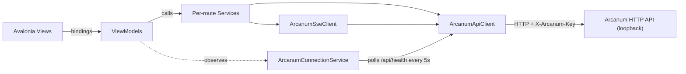

# The Forge — Inference IDE

**The Forge** is the world's first Inference IDE (iIDE): a cross-platform Avalonia desktop
application that provides a complete development environment for AI inference workflows, built on
top of the Arcanum HTTP API. It lives inside the existing Arcanum solution as three additional
projects and consumes Arcanum exactly as any other API client would — loopback HTTP, API-key
authenticated, no in-process coupling.

> **Naming note:** `docs/Arcanum.DESIGN.md` §19 documents a backend feature also named "The Forge" (the
> campaign/spell-metadata/prompt registry). That is an unrelated, pre-existing use of the name for a
> *server-side* concept. This document describes the *desktop IDE* — the two are distinct and the
> collision is intentional (the IDE is named after the same fantasy metaphor, not after that
> registry).

## 1. Purpose and scope

The Forge gives an operator a GUI over everything Arcanum's CLI/HTTP surface can do: browsing
campaigns and spells, editing and casting/executing spells, chatting in sessions, orchestrating
apprentices, approving wards, tracking budget, managing MCP servers and local LlamaCpp models,
running trials, and more. It does not run inference itself, does not open the Grimoire database
directly, and does not duplicate any server-side business logic — every capability is a thin
wrapper over an Arcanum API route.

## 2. Project model

Three projects, added to the existing `RetroDownfall.Arcanum.slnx` solution:

| Project | Kind | Depends on |
|---|---|---|
| `RetroDownfall.TheForge.Core` | Class library, no Avalonia dependency | `RetroDownfall.Arcanum.Core` (project reference) |
| `RetroDownfall.TheForge.Ux` | Avalonia desktop app (the IDE itself) | `RetroDownfall.TheForge.Core` |
| `RetroDownfall.TheForge.Tests` | xUnit test project | `RetroDownfall.TheForge.Ux` |

`RetroDownfall.TheForge.Core` holds Forge-specific models, re-declared DTOs, settings, the JSON
source-generation context, and the API key resolver — nothing that needs Avalonia. Referencing
`RetroDownfall.Arcanum.Core` (a pure leaf project, net10.0, AOT-compatible, no project references of
its own) gives The Forge every wire DTO it needs except a handful of Health/Meta/Budget types that
live in the ASP.NET-heavy `RetroDownfall.Arcanum.Api` project (see §4). Both new projects override
`<Version>0.1.0-alpha</Version>` in their `.csproj` (the rest of the solution inherits
`0.1.0-beta` from `Directory.Build.props`).

## 3. Architecture

- **MVVM** via `CommunityToolkit.Mvvm` source generators (`[ObservableProperty]`, `[RelayCommand]`).
  Every ViewModel inherits `ViewModelBase`.
- **DI** via `Microsoft.Extensions.DependencyInjection`, wired once in `ServiceCollectionConfigurator`
  and consumed from `Program.cs`/`App.axaml.cs`. No service locator elsewhere.
- **HTTP client layer**: a single `ArcanumApiClient` (named `HttpClient` "ArcanumApi" from
  `IHttpClientFactory`) is the only thing that ever calls `HttpClient` directly. Every per-route
  service (`SpellService`, `SessionService`, ...) is a thin wrapper over it. Nothing above the
  service layer touches `HttpClient`.
- **Streaming**: two distinct shapes, both wrapped by `ArcanumApiClient`:
  - **NDJSON** (`PostNdjsonStreamAsync`) for `POST /api/intelligence/ping-stream`,
    `POST /api/spells/{name}/execute-stream`, and `POST /api/llama/models/pull` — one JSON object per
    `\n`-terminated line, no terminator frame.
  - **SSE** (`GetSseAsync`, parsed by the standalone `SseFrameParser`) for the session stream, the
    apprentice Chronicle, and `/api/events/{logs,mcp,daemon}` — `data: <json>\n\n` frames, a
    `data: [DONE]\n\n` terminator, and `: keep-alive` comment lines to ignore. `ArcanumSseClient`
    layers typed deserialization on top for each route.
- **Connection state**: `ArcanumConnectionService` is a DI singleton that polls `GET /api/health`
  every 5 seconds (only started when `ForgeSettings.AutoConnect` is true) and exposes
  `ConnectionState` + the last `HealthReportDto` as observable properties for The Anvil.

## 4. Wire contract notes (verified against the Arcanum source, not just the API surface map)

These are the load-bearing facts that differ from what a naive reading of the route list would
suggest — recorded here so future changes don't silently drift from the real wire shape.

- **Envelope**: `RetroDownfall.Arcanum.Core.Primitives.ApiResponse<T>` is a `sealed record`
  `{ data?, isSuccess, error?, traceId? }`, camelCase. `data` is omitted both on failure and when it
  equals `default(T)`. `Error` is a `readonly record struct` — `{ code, message, details? }` — not a
  class.
- **Re-declared DTOs**: only four types are re-declared in `TheForge.Core.Models` because their
  source lives in `RetroDownfall.Arcanum.Api.Models` (an ASP.NET-heavy project The Forge deliberately
  does not reference): `HealthReportDto`, `HealthComponentDto`, `HealthStatus`, `InstanceMetadataDto`,
  `GrimoireStatsDto`, `BudgetSummaryDto`. `HealthStatus` serializes as an **integer** (0/1/2) — it
  carries no `JsonStringEnumConverter`, and the re-declared mirror must not add one either. Every
  other DTO The Forge touches (campaigns, spells, sessions, apprentices, wards, trials, MCP, llama,
  lore, saga, config, models, workspaces, divination, comm link, sanctum config, logs, audit, daemon)
  lives in `RetroDownfall.Arcanum.Core` and comes for free via the project reference.
- **Streaming is genuinely two different shapes** — see §3. `ping-stream` and `execute-stream` are
  NDJSON; session/chronicle/event routes are SSE. Do not assume one shape covers both.
- **`WardDto`**: `WardId` is a `string`; the expiry field is `ExpiresAt` (`DateTimeOffset`) — there is
  no separate timeout-seconds field. A single `POST /api/wards/{id}` with
  `ResolveWardRequest(bool Allow, string? Reason)` both approves and denies.
- **`IntelligenceEvent`**: token text arrives in the **`Data`** property, not `Message`.
  `IntelligenceEventType` is a camelCase string enum: `token`, `toolCall`, `toolResult`, `toolError`,
  `warded`, `wardResolved`, `status`, `sessionBound`, `conversationBound`, `result`, `error`.
  `toolError` is emitted immediately before the corresponding `toolResult` when a tool throws.
  `conversationBound` is a deprecated alias for `sessionBound` and should be silently ignored.
  `ChatCompletionUsage` uses snake_case OpenAI field names (`prompt_tokens`, etc.) even though the
  rest of the envelope is camelCase.
- **`ApprenticeDetailDto`**: `Status` is a plain PascalCase **string** (`"Running"`, `"Escalated"`,
  ...), not a serialized enum. The plan collection is `Plan` (`IReadOnlyList<PlanStep>`), and
  `PlanStep.Status` is an independent, lowercase, free-form string (`pending`/`running`/
  `in_progress`/`completed`/`failed`) — match case-insensitively. There is no dedicated lineage
  endpoint: `ApprenticeService.GetLineageAsync` walks `ParentApprenticeId` client-side until it hits
  `null`.
- **Chronicle SSE frames are flattened, not nested**: `ChronicleSseWriter.WritePassThroughEvent`
  writes pass-through Wizard (`IntelligenceEvent`) fields — `message`, `data`, `usage`, `toolCall`,
  `wardId`, `toolName`, `arguments`, `allowed`, `reason` — directly onto the Chronicle frame, with no
  nested `wizardEvent` object. Three lifecycle event types (`CastSent`, `SimulacrumStarted`,
  `SimulacrumCompleted`) are emitted **PascalCase** on the wire while every other type is camelCase.
  For this reason, `ArcanumSseClient.StreamChronicleAsync` deserializes into the Forge-local
  `ChronicleFrame` record (raw string `Type`, compared case-insensitively via `IsType(...)`) instead
  of `RetroDownfall.Arcanum.Core.TheForge.ApprenticeEvent` — deserializing straight into
  `ApprenticeEvent` would silently drop every pass-through field.
- **Paths**: `RetroDownfall.Arcanum.Core.Storage.ArcanumPaths.GrimoireDirectory` is public and used
  as-is (`~/.config/arcanum`). `forge.json` lives at `{GrimoireDirectory}/forge.json`. The master
  API key is **not** stored in `forge.json`: Arcanum and The Forge share the OS credential store
  identity `arcanum` / `master-api-key` (`RetroDownfall.Arcanum.Secrets`). Legacy `security.dat`
  remains a Data Protection mirror/fallback for Arcanum only; The Forge resolves via
  `IForgeApiKeyProvider` → `ApiKeyResolver` (OS store → migrate forge.json → `arcanum key show` →
  paste). The CLI writes `arcanum key show` to **stderr**.
- **Enum serialization discipline**: `ForgeJsonContext` and `ForgeSettingsJsonContext` never register
  a blanket `JsonStringEnumConverter` in `[JsonSourceGenerationOptions]`. Every Core enum that
  serializes as a string already carries its own
  `[JsonConverter(typeof(JsonStringEnumConverter<T>))]` + `[JsonStringEnumMemberName]` attributes;
  any enum re-declared in `TheForge.Core` follows the same per-type pattern. `HealthStatus` is the
  deliberate exception — it has no such attribute anywhere and must stay an integer on the wire.

## 5. Naming metaphor

| UI Concept | Name | UI Concept | Name |
|---|---|---|---|
| The IDE | The Forge | Spell dependency graph | The Resonance Map |
| Editor area (tabs) | The Workbench | Apprentice lineage tree | The Lineage Tree |
| Project/campaign explorer | The Atelier | Session/conversation viewer | The Tome |
| Terminal panel | The Hearth | MCP server management | The Arsenal |
| Git integration | The Ledger | Tool invocation inspector | The Scrying Pool |
| Command palette | Incantation | Trial/test runner | The Proving Grounds |
| Status bar | The Anvil | Semantic search | Divination |
| Output/logs panel | The Foundry Floor | Lore browser | Lore Browser *(literal)* |
| Ward approval UI | The Gatehouse | Saga memory browser | The Archive |
| Budget/cost tracking | The Treasury | LlamaCpp model management | The Reliquary |
| Agent orchestration view | The War Table | Unseen Servant scheduler | The Servants' Quarters |
| Settings | Compendium | Comm Link alerts | Comm Link Alert Dashboard *(literal)* |
| Spell version diff viewer | The Mirror | Sanctum breach monitor | Sanctum Breach Monitor *(literal)* |
| Prompt template designer | The Scriptorium | Mana/token visualization | Mana Visualization *(literal)* |
| Multi-session tab management | The Council Chamber | Notifications/toasts | Whispers |
| Global search | The Eye of the World | Context help/docs | The Codex |
| Entry inspector | The Loupe | Export/import wizard | Export / Import Wizard *(literal)* |

`Compendium` here refers to Forge's Settings panel concept, distinct from the existing
`RetroDownfall.Compendium.Ux` Avalonia project (Arcanum's separate configuration-editor app) already in
the solution — the two are unrelated products that happen to share a name from the same fantasy
vocabulary.

### 5.1 Phase 3 shell structure

Milestone B established the shell that feature panels plug into. The shell has since gained
**internal dockable window management** (in-window only — no OS floating windows yet):

- `MainWindow.axaml` owns the top menu row, a `DockHostView` for rearrangeable tool windows, and the
  fixed bottom **Anvil** status bar. The Workbench remains the central document well.
- Tool windows: **Atelier**, **Gatehouse**, **Treasury**, **Arsenal**, **War Table**, **Output**,
  **Logs**, **Hearth**. Each has a stable string id (`atelier`, `gatehouse`, …), title, optional icon
  key, dock region (`Left` / `Right` / `Bottom` / `Hidden`), visibility, and selection within its group.
- `DockLayoutViewModel` owns layout state and groups; `MainViewModel` wires content ViewModels into
  tools and routes `NavigationService` / Anvil focus chips via `FocusTool`. Empty groups collapse.
- **Required UX:** tool header context menu — Move Left / Move Right / Move Bottom / Hide / Reset
  Layout. View menu: Reset Window Layout plus show-or-focus items for each tool. Drag-and-drop onto
  dock targets is preferred when small/stable; this pass ships the menu path first (DnD may follow).
- **Persistence:** versioned `ForgeDockLayoutDto` (`SchemaVersion = 1`) is source-gen serialized into
  `ForgeSettings.LayoutState` via `ForgeSettingsJsonContext` and written through path-injected
  `IForgeSettingsStore` (debounced). Corrupt/missing layout falls back to defaults; unknown tool ids
  are ignored; missing known tools are inserted; sizes are clamped.
- **Reset** replaces the entire layout with `DockLayoutDefaults` (today’s default shell) and persists.
- `MainViewModel` disposes owned documents, transient child VMs, and `DockLayoutViewModel` on window
  close; DI singleton `FoundryFloorViewModel` is left to `ServiceProvider`.

Default layout: Left = Atelier; Right = Gatehouse, Treasury, Arsenal, War Table; Bottom = Output,
Logs, Hearth; center = Workbench; fixed bottom = Anvil.

### 5.2 Phase 4 Atelier tree

Milestone C begins with the live **Atelier** project explorer:

- `AtelierViewModel` exposes four root branches: **Campaigns**, **Workspaces**, **Global Spells**,
  and **Sessions**. `RefreshAsync` creates the roots without fetching all child content up front.
- `AtelierNodeViewModel` is the lazy-loading base node (`IsExpanded`, `IsLoading`, `Children`,
  `ExpandAsync`, `ReloadAsync`). Roots and campaign nodes load children on first expansion.
- `AtelierDataSource` adapts the API service layer for the tree: campaigns (`GET /api/campaigns`),
  workspaces (`GET /api/workspaces`), global spells (`GET /api/spells`), recent sessions
  (`GET /api/sessions?limit=20`), plus campaign-scoped spells/prompts/sessions via the verified
  campaign endpoints.
- `CampaignNodeViewModel` lazy-loads **Spells**, **Prompts**, **Sessions**, `CODEX.md`, and
  **Sanctum**. Spell/session/prompt leaves expose a primary Open command routed through
  `NavigationService` into Workbench documents.
- `Views/Controls/SpellTreeView.axaml` hosts the reusable `TreeView` / `TreeDataTemplate` and keeps
  double-click handling in code-behind as event wiring only.

### 5.3 Phase 5 Spell editor

Phase 5 replaces spell Workbench placeholders with a real **Spell editor**:

- `WorkbenchDocumentFactory` creates `SpellEditorViewModel` for `DocumentKind.Spell` navigation
  requests and keeps placeholder documents for later phases.
- `SpellEditorViewModel` loads `SpellDetail` plus versions, exposes `MarkdownBody`, `Frontmatter`,
  `SkillJson`, `Versions`, `CastPreview`, `ManaCount`, and collected `ExecutionEvents`, and implements
  Save, Cast, Execute, Estimate Mana, and Activate Version commands.
- `SpellEditorDataSource` adapts `SpellService` to the editor: `GET /api/spells/{name}`,
  `PUT /api/spells/{name}`, `POST /api/spells/{name}/cast`, `POST /api/spells/{name}/execute-stream`
  (NDJSON), `POST /api/intelligence/mana`, and spell version routes.
- `Views/Workbench/SpellEditorView.axaml` uses `Avalonia.AvaloniaEdit` `TextEditor` controls for
  SPELL.md and SKILL.json, with code-behind limited to text synchronization because AvalonEdit's
  `Text` property is not an Avalonia styled property.
- Execute records streamed `IntelligenceEvent` frames and opens a Session Workbench tab on
  `sessionBound`; that tab is now The Tome (Phase 6).

### 5.4 Phase 6 The Tome

Phase 6 replaces session Workbench placeholders with **The Tome** chat surface:

- `WorkbenchDocumentFactory` creates `TomeViewModel` for `DocumentKind.Session` when the id is a
  GUID; other document kinds remain placeholders.
- `TomeViewModel` owns `Session`, `Messages`, `InputText`, `IsStreaming`, `ManaPercent`, `LastUsage`,
  ward-pending / whisper state, and a `CancellationTokenSource` cancelled on tab close/`Dispose`.
- `SendAsync` streams `POST /api/intelligence/ping-stream` (NDJSON) and handles every
  `IntelligenceEventType`: tokens append **`Data`**, tool call/result/error cards, warded /
  wardResolved whispers, status notices, `sessionBound` (persist id; ignore deprecated
  `conversationBound`), `result` usage → Mana bar, and `error` → Foundry Floor + inline error.
- Manual Entry (`POST /api/sessions/{id}/entries`), Fork, and Export (markdown) round-trip through
  `TomeDataSource` / `SessionService`.
- On open, The Tome subscribes to `GET /api/sessions/{id}/stream` (SSE) for live entry observation
  and unsubscribes on dispose.
- `Views/Workbench/TomeView.axaml` renders role-colored messages, expandable tool cards, a
  provisional Mana bar (full `ManaBar` control arrives in Phase 10), and Enter-to-send /
  Shift+Enter newline input.

### 5.7 Phase 7 The War Table

Phase 7 replaces the War Table placeholder with apprentice orchestration:

- `WarTableViewModel` lists apprentices from `GET /api/apprentices`, opens a create panel (name,
  goal with `@file` mentions, workspace + campaign selectors), and hosts the selected detail pane.
- `ApprenticeDetailViewModel` loads detail/plan, walks Conclave lineage via
  `ParentApprenticeId`, and exposes Start/Pause/Resume/Cancel/Reweave/Intervene.
- `ChronicleViewModel` streams `GET /api/apprentices/{id}/chronicle` into Forge-local
  `ChronicleFrame` entries (raw-string `Type`); pass-through Wizard events and `eventsDropped`
  warnings are rendered by `ChronicleTimeline`.
- Visibility is gated with the right panel (same seam as The Gatehouse).

### 5.5 Phase 8 The Gatehouse

Phase 8 replaces the Gatehouse placeholder with live ward governance:

- `GatehouseViewModel` polls `GET /api/wards` every 2s **only while `IsVisible`** (tied to the
  right-panel visibility from `MainViewModel`).
- `WardCardViewModel` shows tool name, truncated indented JSON arguments, session id, and an
  `ExpiresAt` countdown refreshed each poll tick.
- Approve / Deny call `POST /api/wards/{id}` with `ResolveWardRequest` (`allow` + optional deny
  reason). Empty state: "No active wards — the Forge is quiet." Ward SSE auto-refresh is noted as a
  future hook, not built.

### 5.6 Phase 9 The Anvil

Phase 9 expands The Anvil from a connection indicator into a live status bar:

- Aggregates `ConnectionState`, `ActiveCampaignName` (from `ForgeSettings.LastCampaignId`),
  `ActiveModelName` (from health-report component detail when present), `ManaPercent` /
  `TodaySpendUsd` (`GET /api/budget`), `ActiveWardsCount`, `RunningApprenticesCount`, and
  `McpOnlineTotal` (`online/total` from `GET /api/mcp`).
- Refreshes on a 10s timer and when connection becomes Connected; each chip is a button that
  focuses the relevant panel via `NavigationService`.

### 5.7 Phase 10 Theme & styling (Visual Studio 2026)

Milestone E restyles The Forge to mirror Visual Studio 2026 Fluent IDE chrome:

- `Themes/Typography.axaml` — `ForgeUiFontFamily` (Segoe UI Variable / Segoe UI), `ForgeCodeFontFamily` (Cascadia Mono / Cascadia Code), sizes 12 / 11 / 14.
- `Themes/DarkTheme.axaml` / `Themes/LightTheme.axaml` — VS Fluent-inspired tokens (`#1C1C1C` / `#EEEEEE` bodies, `#9184EE` / `#5649B0` accents). Legacy `ForgeShell*` brush keys alias the new tokens.
- `ThemeApplicationService` applies `ForgeSettings.Theme` (`dark`/`light`) to `RequestedThemeVariant` and swaps the theme dictionary.
- `Views/Controls/ManaBar.axaml` — reusable utilization bar; Anvil and Tome consume it.
- `Themes/Icons.axaml` — outline `PathGeometry` catalog (spell, apprentice, ward, campaign, session, MCP, model).
- App styles set compact VS-like density; AvaloniaEdit uses the code font resources. Views use `{DynamicResource}` only (no inline hex).

### 5.8 The Hearth (local terminal)

The Hearth is The Forge's dockable **local shell command runner** (default bottom region). It is
**desktop-only** functionality: it does not call Arcanum HTTP APIs, does not use MCP
`execute_command`, and does not go through Sanctum/Ward approval. Commands are started only when the
operator types them — nothing runs automatically on open.

**Initial Git integration:** operators run `git status`, `git diff`, `dotnet build`, `arcanum`, etc.
from The Hearth until **The Ledger** (dedicated Git UI) ships.

**Behavior:**

- `HearthViewModel` + `HearthView` replace the Phase 3 placeholder; content is wired through the
  existing dock `DataTemplate` in `DockGroupView`.
- `ITerminalCommandRunner` / `TerminalCommandRunner` spawn the platform default shell via
  `ProcessStartInfo.ArgumentList` (Unix: `$SHELL` else zsh/sh with `-lc`; Windows: `cmd.exe` `/C`).
  Stdout and stderr are drained concurrently; Stop cancels and kills the process tree best-effort.
- Built-in `cd` (no child process): home, `~` / `~/…`, relative/absolute paths, simple quotes.
  Working directory defaults to the user profile; toolbar **Home** resets to that profile.
- Output is a capped line list (`HearthLineKind`: Command / StandardOutput / StandardError / System),
  styled with Forge theme brushes and `ForgeCodeFontFamily`.
- `MainViewModel` operationally owns and disposes the transient `HearthViewModel` (dispose is
  idempotent and cancels any running process).

**Limitations (honest):** not a full PTY — interactive TTY apps may misbehave; no dedicated Git UI
yet; no folder picker for cwd; no automatic command execution.

## 6. Feature catalog (phased)

Delivered in buildable milestones rather than one drop — each keeps `dotnet build`/`dotnet test`
green before the next begins.

| Milestone | Phases | Scope |
|---|---|---|
| A — Foundation | 1–2 | Solution scaffold, minimal launchable shell, Core models, JSON contexts, `ArcanumApiClient`/`ArcanumSseClient`, `ArcanumConnectionService`, all 23 per-route services, DI wiring, unit tests |
| B — Shell | 3 | Full main window: menu bar, dockable tool windows (Left/Right/Bottom), Workbench document well, Anvil; layout persistence via `LayoutState` |
| C — Create & converse | 4–6 | The Atelier tree, the Spell editor (Save/Cast/Execute/EstimateMana/versions), The Tome (NDJSON chat, tool cards, manual entry, session SSE) |
| D — Orchestrate & govern | 7–9 | The War Table + Chronicle SSE + lineage walk, The Gatehouse (ward poll/approve/deny), The Anvil status aggregation |
| E — Polish | 10 | VS 2026 Fluent-inspired Dark/Light themes, Cascadia/Segoe typography, `Icons.axaml`, `ManaBar`, theme swap via `ForgeSettings.Theme` |

As of this document's last update, **Milestones A–E (Phases 1–10) are implemented**, plus **The Hearth**
local terminal (§5.8): the solution scaffold through The Tome, War Table, Gatehouse, Anvil, VS 2026
Fluent-inspired theme polish, and the dockable Hearth command runner.

**Post-milestone hardening (shell honesty):** Atelier category nodes load children on expand; theme dictionaries are applied solely by `ThemeApplicationService` (no static DarkTheme merge); ManaBar fill width is percent of track bounds. Dock layout drives Gatehouse / War Table visibility wherever those tools are docked. Campaign context-menu New Spell / New Prompt / New Session are disabled until create UX exists. Treasury and Arsenal show explicit “not implemented yet” empty states. View → Connect/Disconnect and the Anvil connection chip call `ArcanumConnectionService`. Foundry Floor streams logs via `ILogService` when Output/Logs are visible. **The Hearth** runs local shell commands (initial Git surface); The Ledger Git UI is not built yet. `MainViewModel` disposes owned children on window close (not the FoundryFloor singleton). **Dockable internal window management** is implemented: move tools via header context menu / View menu; layout persists in `forge.json` `layoutState`; Reset Window Layout restores defaults. OS-level floating windows and full VS drag adorners are not in this pass.

## 7. API integration notes

- **Base URL**: configurable via `ForgeSettings.BaseUrl`, default `http://localhost:5001`.
- **Auth**: `X-Arcanum-Key` header on every `/api/*` request (`Authorization: Bearer` is also
  accepted server-side, but The Forge always sends the dedicated header).
- **Settings file**: `~/.config/arcanum/forge.json`, loaded with `reloadOnChange: true` so
  `IOptionsMonitor<ForgeSettings>` subscribers (the HTTP client, the connection service) see edits
  without a restart.
- **Error handling**: every `ArcanumApiClient` call is wrapped; transport failures synthesize a
  failure `ApiResponse<T>` with code `Connection.Failed` (or `Connection.Timeout`) rather than
  throwing, so ViewModels can treat every response uniformly.
- See §4 above for the wire-shape specifics that most affect client code.

## 8. Document maintenance

Any change that touches The Forge's architecture, wire contracts, project structure, or UI feature
set must update this document in the same change set as the code — mirroring
[`docs/Arcanum.DESIGN.md` §18](Arcanum.DESIGN.md#18-document-maintenance)'s policy for Arcanum itself. Do not close
Forge work with only code changes; update the feature-catalog table in §6 as milestones land, and
keep [`docs/TheForge.README.md`](TheForge.README.md) in sync for anything operator-visible (build/run
steps, API key acquisition, settings file location).
