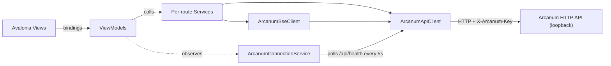

# The Forge — Inference IDE

**The Forge** is the world's first Inference IDE (iIDE): a cross-platform Avalonia desktop
application that provides a complete development environment for AI inference workflows, built on
top of the Arcanum HTTP API. It lives inside the existing Arcanum solution as three additional
projects and consumes Arcanum exactly as any other API client would — loopback HTTP, API-key
authenticated, no in-process coupling.

> **Naming note:** `docs/Arcanum.DESIGN.md` §19 documents a backend feature also named "The Forge" (the
> campaign/spell-metadata/prompt registry). That is an unrelated, pre-existing use of the name for a
> *server-side* concept. This document describes the *desktop IDE* — the two are distinct and the
> collision is intentional (the IDE is named after the same fantasy metaphor, not after that
> registry).

## 1. Purpose and scope

The Forge gives an operator a GUI over everything Arcanum's CLI/HTTP surface can do: browsing
campaigns and spells, editing and casting/executing spells, chatting in sessions, orchestrating
apprentices, approving wards, tracking budget, managing MCP servers and browsing configured models/providers,
running trials, and more. It does not run inference itself, does not open the Grimoire database
directly, and does not duplicate any server-side business logic — every capability is a thin
wrapper over an Arcanum API route.

## 2. Project model

Three projects, added to the existing `RetroDownfall.Arcanum.slnx` solution:

| Project | Kind | Depends on |
|---|---|---|
| `RetroDownfall.TheForge.Core` | Class library, no Avalonia dependency | `RetroDownfall.Arcanum.Core` (project reference) |
| `RetroDownfall.TheForge.Ux` | Avalonia desktop app (the IDE itself) | `RetroDownfall.TheForge.Core` |
| `RetroDownfall.TheForge.Tests` | xUnit test project | `RetroDownfall.TheForge.Ux` |

`RetroDownfall.TheForge.Core` holds Forge-specific models, re-declared DTOs, settings, the JSON
source-generation context, and the API key resolver — nothing that needs Avalonia. Referencing
`RetroDownfall.Arcanum.Core` (a pure leaf project, net10.0, AOT-compatible, no project references of
its own) gives The Forge every wire DTO it needs except a handful of Health/Meta/Budget types that
live in the ASP.NET-heavy `RetroDownfall.Arcanum.Api` project (see §4). Both projects inherit
`0.1.0-beta` from `Directory.Build.props` (no project-level version override).

## 3. Architecture

- **MVVM** via `CommunityToolkit.Mvvm` source generators (`[ObservableProperty]`, `[RelayCommand]`).
  Every ViewModel inherits `ViewModelBase`.
- **DI** via `Microsoft.Extensions.DependencyInjection`, wired once in `ServiceCollectionConfigurator`
  and consumed from `Program.cs`/`App.axaml.cs`. No service locator elsewhere.
- **HTTP client layer**: a single `ArcanumApiClient` (named `HttpClient` "ArcanumApi" from
  `IHttpClientFactory`) is the only thing that ever calls `HttpClient` directly. Every per-route
  service (`SpellService`, `SessionService`, ...) is a thin wrapper over it. Nothing above the
  service layer touches `HttpClient`.
- **Streaming**: two distinct shapes, both wrapped by `ArcanumApiClient`:
  - **NDJSON** (`PostNdjsonStreamAsync`) for `POST /api/intelligence/ping-stream` and
    `POST /api/spells/{name}/execute-stream` — one JSON object per
    `\n`-terminated line, no terminator frame.
  - **SSE** (`GetSseAsync`, parsed by the standalone `SseFrameParser`) for the session stream, the
    apprentice Chronicle, and `/api/events/{logs,mcp,daemon}` — `data: <json>\n\n` frames, a
    `data: [DONE]\n\n` terminator, and `: keep-alive` comment lines to ignore. `ArcanumSseClient`
    layers typed deserialization on top for each route.
- **Connection state**: `ArcanumConnectionService` is a DI singleton that polls `GET /api/health`
  every 5 seconds (only started when `TheForgeSettings.AutoConnect` is true) and exposes
  `ConnectionState` + the last `HealthReportDto` as observable properties for The Anvil.

## 4. Wire contract notes (verified against the Arcanum source, not just the API surface map)

These are the load-bearing facts that differ from what a naive reading of the route list would
suggest — recorded here so future changes don't silently drift from the real wire shape.

- **Envelope**: `RetroDownfall.Arcanum.Core.Primitives.ApiResponse<T>` is a `sealed record`
  `{ data?, isSuccess, error?, traceId? }`, camelCase. `data` is omitted both on failure and when it
  equals `default(T)`. `Error` is a `readonly record struct` — `{ code, message, details? }` — not a
  class.
- **Re-declared DTOs**: the following types are re-declared in `TheForge.Core.Models` because their
  source lives in the ASP.NET-heavy `RetroDownfall.Arcanum.Api` project The Forge deliberately does
  not reference: `HealthReportDto`, `HealthComponentDto`, `HealthStatus`, `InstanceMetadataDto`,
  `GrimoireStatsDto`, `BudgetSummaryDto` (Health/Meta/Budget), and the Milestone G operational
  mirrors `OptionalWorkspaceRequest` (from `Api.Serialization` — body of `POST /api/mcp/reload` and
  `POST /api/intelligence/arsenal`) and `ToolInvokeRequest` / `ToolInvokeResponse` (from `Api.Models`
  — body/result of `POST /api/tools/invoke`; `Arguments`/`Result` are untyped `JsonElement`).
  `HealthStatus` serializes as an **integer** (0/1/2) — it carries no `JsonStringEnumConverter`, and
  the re-declared mirror must not add one either. Every other DTO The Forge touches (campaigns,
  spells, sessions, apprentices, wards, trials, MCP, lore, saga, config, models, workspaces,
  divination, comm link, sanctum config, logs, audit, daemon, arsenal aggregation) lives in
  `RetroDownfall.Arcanum.Core` and comes for free via the project reference. **`POST
  /api/providers/test`** accepts only `AiProviderKind.OpenAICompatible`; **`POST
  /api/intelligence/arsenal`** takes an `OptionalWorkspaceRequest?` body and returns
  `WorkspaceArsenalDto` (whose `NativeTools` lists the built-in tools The Scrying Pool offers).
- **Streaming is genuinely two different shapes** — see §3. `ping-stream` and `execute-stream` are
  NDJSON; session/chronicle/event routes are SSE. Do not assume one shape covers both.
- **`WardDto`**: `WardId` is a `string`; the expiry field is `ExpiresAt` (`DateTimeOffset`) — there is
  no separate timeout-seconds field. A single `POST /api/wards/{id}` with
  `ResolveWardRequest(bool Allow, string? Reason)` both approves and denies.
- **`IntelligenceEvent`**: token text arrives in the **`Data`** property, not `Message`.
  `IntelligenceEventType` is a camelCase string enum: `token`, `toolCall`, `toolResult`, `toolError`,
  `warded`, `wardResolved`, `status`, `sessionBound`, `conversationBound`, `result`, `error`.
  `toolError` is emitted immediately before the corresponding `toolResult` when a tool throws.
  `conversationBound` is a deprecated alias for `sessionBound` and should be silently ignored.
  `ChatCompletionUsage` uses snake_case OpenAI field names (`prompt_tokens`, etc.) even though the
  rest of the envelope is camelCase.
- **`ApprenticeDetailDto`**: `Status` is a plain PascalCase **string** (`"Running"`, `"Escalated"`,
  ...), not a serialized enum. The plan collection is `Plan` (`IReadOnlyList<PlanStep>`), and
  `PlanStep.Status` is an independent, lowercase, free-form string (`pending`/`running`/
  `in_progress`/`completed`/`failed`) — match case-insensitively. There is no dedicated lineage
  endpoint: `ApprenticeService.GetLineageAsync` walks `ParentApprenticeId` client-side until it hits
  `null`.
- **Chronicle SSE frames are flattened, not nested**: `ChronicleSseWriter.WritePassThroughEvent`
  writes pass-through Wizard (`IntelligenceEvent`) fields — `message`, `data`, `usage`, `toolCall`,
  `wardId`, `toolName`, `arguments`, `allowed`, `reason` — directly onto the Chronicle frame, with no
  nested `wizardEvent` object. Three lifecycle event types (`CastSent`, `SimulacrumStarted`,
  `SimulacrumCompleted`) are emitted **PascalCase** on the wire while every other type is camelCase.
  For this reason, `ArcanumSseClient.StreamChronicleAsync` deserializes into the Forge-local
  `ChronicleFrame` record (raw string `Type`, compared case-insensitively via `IsType(...)`) instead
  of `RetroDownfall.Arcanum.Core.TheForge.ApprenticeEvent` — deserializing straight into
  `ApprenticeEvent` would silently drop every pass-through field.
- **Paths**: `RetroDownfall.Arcanum.Core.Storage.ArcanumPaths.GrimoireDirectory` is public and used
  as-is (`~/.config/arcanum`). `forge.json` lives at `{GrimoireDirectory}/forge.json`. The master
  API key is **not** stored in `forge.json`: Arcanum and The Forge share the OS credential store
  identity `arcanum` / `master-api-key` (`RetroDownfall.Arcanum.Secrets`). Legacy `security.dat`
  remains a Data Protection mirror/fallback for Arcanum only; The Forge resolves via
  `ITheForgeApiKeyProvider` → `ApiKeyResolver` (OS store → migrate forge.json → `arcanum key show` →
  paste). The CLI writes `arcanum key show` to **stderr**.
- **Enum serialization discipline**: `TheForgeJsonContext` and `TheForgeSettingsJsonContext` never register
  a blanket `JsonStringEnumConverter` in `[JsonSourceGenerationOptions]`. Every Core enum that
  serializes as a string already carries its own
  `[JsonConverter(typeof(JsonStringEnumConverter<T>))]` + `[JsonStringEnumMemberName]` attributes;
  any enum re-declared in `TheForge.Core` follows the same per-type pattern. `HealthStatus` is the
  deliberate exception — it has no such attribute anywhere and must stay an integer on the wire.

## 5. Naming metaphor

| UI Concept | Name | UI Concept | Name |
|---|---|---|---|
| The IDE | The Forge | Spell dependency graph | The Resonance Map |
| Editor area (tabs) | The Workbench | Apprentice lineage tree | The Lineage Tree |
| Project/campaign explorer | The Atelier | Session/conversation viewer | The Tome |
| Terminal panel | The Hearth | MCP server management | The Arsenal |
| Git integration | The Ledger | Tool invocation inspector | The Scrying Pool |
| Command palette | Incantation | Trial/test runner | The Proving Grounds |
| Status bar | The Anvil | Semantic search | Divination |
| Output/logs panel | The Foundry Floor | Lore browser | Lore Browser *(literal)* |
| Ward approval UI | The Gatehouse | Saga memory browser | The Archive |
| Budget/cost tracking | The Treasury | Models & Providers (read-only) | The Arsenal |
| Agent orchestration view | The War Table | Unseen Servant scheduler | The Servants' Quarters |
| Settings | Compendium | Comm Link alerts | Comm Link Alert Dashboard *(literal)* |
| Spell version diff viewer | The Mirror | Sanctum breach monitor | Sanctum Breach Monitor *(literal)* |
| Prompt template designer | The Scriptorium | Mana/token visualization | Mana Visualization *(literal)* |
| Multi-session tab management | The Council Chamber | Notifications/toasts | Whispers |
| Global search | The Eye of the World | Context help/docs | The Codex |
| Entry inspector | The Loupe | Artifact import/export | Export / Import *(Atelier + Spell/Scriptorium; §5.18)* |
| Markdown preview | The Illumination | | |

`Compendium` here refers to Forge's Settings panel concept, distinct from the existing
`RetroDownfall.Compendium.Ux` Avalonia project (Arcanum's separate configuration-editor app) already in
the solution — the two are unrelated products that happen to share a name from the same fantasy
vocabulary.

### 5.1 Phase 3 shell structure

Milestone B established the shell that feature panels plug into. The shell has since gained
**internal dockable window management** (in-window only — no OS floating windows yet):

- `MainWindow.axaml` owns the top menu row, a `DockHostView` for rearrangeable tool windows, and the
  fixed bottom **Anvil** status bar. The Workbench remains the central document well.
- Tool windows: **Atelier**, **Gatehouse**, **Treasury**, **Arsenal**, **War Table**, **Output**,
  **Logs**, **Hearth**. Each has a stable string id (`atelier`, `gatehouse`, …), title, optional icon
  key, dock region (`Left` / `Right` / `Bottom` / `Hidden`), visibility, and selection within its group.
- `DockLayoutViewModel` owns layout state and groups; `MainViewModel` wires content ViewModels into
  tools and routes `NavigationService` / Anvil focus chips via `FocusTool`. Empty groups collapse.
- **Required UX:** tool header context menu — Move Left / Move Right / Move Bottom / Hide / Reset
  Layout. View menu: Reset Window Layout plus show-or-focus items for each tool. Drag-and-drop onto
  dock targets is preferred when small/stable; this pass ships the menu path first (DnD may follow).
- **Persistence:** versioned `TheForgeDockLayoutDto` (`SchemaVersion = 1`) is source-gen serialized into
  `TheForgeSettings.LayoutState` via `TheForgeSettingsJsonContext` and written through path-injected
  `ITheForgeSettingsStore` (debounced). Corrupt/missing layout falls back to defaults; unknown tool ids
  are ignored; missing known tools are inserted; sizes are clamped.
- **Reset** replaces the entire layout with `DockLayoutDefaults` (today’s default shell) and persists.
- `MainViewModel` disposes owned documents, transient child VMs, and `DockLayoutViewModel` on window
  close; DI singleton `FoundryFloorViewModel` is left to `ServiceProvider`.

Default layout: Left = Atelier; Right = Gatehouse, Treasury, Arsenal, War Table; Bottom = Output,
Logs, Hearth; center = Workbench; fixed bottom = Anvil.

### 5.2 Phase 4 Atelier tree

Milestone C begins with the live **Atelier** project explorer:

- `AtelierViewModel` exposes five root branches: **Campaigns**, **Workspaces**, **Global Spells**,
  **Global Prompts**, and **Sessions**. `RefreshAsync` creates the roots without fetching all child
  content up front. **Global Prompts** lazy-loads `PromptService.ListAsync(campaignId: null)` — only
  prompts with no campaign (the server filters `CampaignId IS NULL`).
- `AtelierNodeViewModel` is the lazy-loading base node (`IsExpanded`, `IsLoading`, `Children`,
  `ExpandAsync`, `ReloadAsync`). Roots and campaign nodes load children on first expansion. It also
  declares virtual nullable `NewSpellCommand` / `NewPromptCommand` / `NewSessionCommand` plus
  `HasNew*` and `New*Label` properties for context-menu binding; creation-capable nodes override the
  commands they expose **manually** (`new AsyncRelayCommand(...)`, plain execute methods) — not via
  `[RelayCommand]`, which would hide the base property instead of overriding it.
- `AtelierDataSource` adapts the API service layer for the tree: campaigns (`GET /api/campaigns`),
  workspaces (`GET /api/workspaces`), global spells (`GET /api/spells`), global prompts
  (`GET /api/prompts` with no `campaignId`), recent sessions (`GET /api/sessions?limit=20`), plus
  campaign-scoped spells/prompts/sessions via the verified campaign endpoints.
- `CampaignNodeViewModel` lazy-loads **Spells**, **Prompts**, **Sessions**, `CODEX.md`, and
  **Sanctum**, and exposes **New Spell / New Prompt / New Session** context-menu commands that
  create artifacts scoped to the campaign and open them in the Workbench (see §5.9). Spell/session/
  prompt leaves expose a primary Open command routed through `NavigationService`.
- `Views/Controls/SpellTreeView.axaml` hosts the reusable `TreeView` / `TreeDataTemplate`, keeps
  double-click handling in code-behind as event wiring only, and binds `New Spell` / `New Prompt` /
  `New Session` `MenuItem`s to the node's `New*Command` (visible only where `HasNew*` is true).

### 5.3 Phase 5 Spell editor

Phase 5 replaces spell Workbench placeholders with a real **Spell editor**:

- `WorkbenchDocumentFactory` creates `SpellEditorViewModel` for `DocumentKind.Spell` navigation
  requests and keeps placeholder documents for later phases.
- `SpellEditorViewModel` loads `SpellDetail` plus versions, exposes `MarkdownBody`, `Frontmatter`,
  `SpellJson`, Spell Metadata Designer fields, `Versions`, `CastPreview`, `ManaCount`, and collected
  `ExecutionEvents`, and implements Save, Cast, Execute, Estimate Mana, and Activate Version commands.
- `SpellEditorDataSource` adapts `SpellService` (+ `McpService` for tool catalogs) to the editor:
  `GET /api/spells/{name}`, `PUT /api/spells/{name}`, `POST /api/spells/{name}/cast`,
  `POST /api/spells/{name}/execute-stream` (NDJSON), `POST /api/intelligence/mana`, spell version
  routes, spell name catalog, and Arsenal/MCP tool name union.
- `Views/Workbench/SpellEditorView.axaml` uses `Avalonia.AvaloniaEdit` `TextEditor` controls for
  SPELL.md and raw SPELL.json, with a nested **Spell Metadata Designer** under the SPELL.json tab
  (version, read-only activeVersion, dependencies, declared tools, input/output schema). Code-behind
  is limited to text synchronization because AvalonEdit's `Text` property is not an Avalonia styled
  property.
- Execute records streamed `IntelligenceEvent` frames and opens a Session Workbench tab on
  `sessionBound`; that tab is now The Tome (Phase 6).

### 5.4 Phase 6 The Tome

Phase 6 replaces session Workbench placeholders with **The Tome** chat surface:

- `WorkbenchDocumentFactory` creates `TomeViewModel` for `DocumentKind.Session` when the id is a
  GUID; other document kinds remain placeholders.
- `TomeViewModel` owns `Session`, `Messages`, `InputText`, `IsStreaming`, `ManaPercent`, `LastUsage`,
  ward-pending / whisper state, and a `CancellationTokenSource` cancelled on tab close/`Dispose`.
- `SendAsync` streams `POST /api/intelligence/ping-stream` (NDJSON) and handles every
  `IntelligenceEventType`: tokens append **`Data`**, tool call/result/error cards, warded /
  wardResolved whispers, status notices, `sessionBound` (persist id; ignore deprecated
  `conversationBound`), `result` usage → Mana bar, and `error` → Foundry Floor + inline error.
- Manual Entry (`POST /api/sessions/{id}/entries`), Fork, and Export (markdown) round-trip through
  `TomeDataSource` / `SessionService`.
- On open, The Tome subscribes to `GET /api/sessions/{id}/stream` (SSE) for live entry observation
  and unsubscribes on dispose.
- `Views/Workbench/TomeView.axaml` renders role-colored messages, expandable tool cards, a
  provisional Mana bar (full `ManaBar` control arrives in Phase 10), and Enter-to-send /
  Shift+Enter newline input.

### 5.7 Phase 7 The War Table

Phase 7 replaces the War Table placeholder with apprentice orchestration:

- `WarTableViewModel` lists apprentices from `GET /api/apprentices`, opens a create panel (name,
  goal with `@file` mentions, workspace + campaign selectors), and hosts the selected detail pane.
- `ApprenticeDetailViewModel` loads detail/plan, walks Conclave lineage via
  `ParentApprenticeId`, and exposes Start/Pause/Resume/Cancel/Reweave/Intervene.
- `ChronicleViewModel` streams `GET /api/apprentices/{id}/chronicle` into Forge-local
  `ChronicleFrame` entries (raw-string `Type`); pass-through Wizard events and `eventsDropped`
  warnings are rendered by `ChronicleTimeline`.
- Visibility is gated with the right panel (same seam as The Gatehouse).

### 5.5 Phase 8 The Gatehouse

Phase 8 replaces the Gatehouse placeholder with live ward governance:

- `GatehouseViewModel` polls `GET /api/wards` every 2s **only while `IsVisible`** (tied to the
  right-panel visibility from `MainViewModel`).
- `WardCardViewModel` shows tool name, truncated indented JSON arguments, session id, and an
  `ExpiresAt` countdown refreshed each poll tick.
- Approve / Deny call `POST /api/wards/{id}` with `ResolveWardRequest` (`allow` + optional deny
  reason). Empty state: "No active wards — the Forge is quiet." Ward SSE auto-refresh is noted as a
  future hook, not built.

### 5.6 Phase 9 The Anvil

Phase 9 expands The Anvil from a connection indicator into a live status bar:

- Aggregates `ConnectionState`, `ActiveCampaignName` (from `TheForgeSettings.LastCampaignId`),
  `ActiveModelName` (from health-report component detail when present), `ManaPercent` /
  `TodaySpendUsd` (`GET /api/budget`), `ActiveWardsCount`, `RunningApprenticesCount`, and
  `McpOnlineTotal` (`online/total` from `GET /api/mcp`).
- Refreshes on a 10s timer and when connection becomes Connected; each chip is a button that
  focuses the relevant panel via `NavigationService`.

### 5.7 Phase 10 Theme & styling (Visual Studio 2026)

Milestone E restyles The Forge to mirror Visual Studio 2026 Fluent IDE chrome:

- `Themes/Typography.axaml` — `ForgeUiFontFamily` (Segoe UI Variable / Segoe UI), `ForgeCodeFontFamily` (Cascadia Mono / Cascadia Code), sizes 12 / 11 / 14.
- `Themes/DarkTheme.axaml` / `Themes/LightTheme.axaml` — VS Fluent-inspired tokens (`#1C1C1C` / `#EEEEEE` bodies, `#9184EE` / `#5649B0` accents). Legacy `ForgeShell*` brush keys alias the new tokens.
- `ThemeApplicationService` applies `TheForgeSettings.Theme` (`dark`/`light`) to `RequestedThemeVariant` and swaps the theme dictionary.
- `Views/Controls/ManaBar.axaml` — reusable utilization bar; Anvil and Tome consume it.
- `Themes/Icons.axaml` — outline `PathGeometry` catalog (spell, apprentice, ward, campaign, session, MCP, model).
- App styles set compact VS-like density; AvaloniaEdit uses the code font resources. Views use `{DynamicResource}` only (no inline hex).

### 5.8 The Hearth (local terminal)

The Hearth is The Forge's dockable **local shell command runner** (default bottom region). It is
**desktop-only** functionality: it does not call Arcanum HTTP APIs, does not use MCP
`execute_command`, and does not go through Sanctum/Ward approval. Commands are started only when the
operator types them — nothing runs automatically on open.

**Initial Git integration:** operators run `git status`, `git diff`, `dotnet build`, `arcanum`, etc.
from The Hearth until **The Ledger** (dedicated Git UI) ships.

**Behavior:**

- `HearthViewModel` + `HearthView` replace the Phase 3 placeholder; content is wired through the
  existing dock `DataTemplate` in `DockGroupView`.
- `ITerminalCommandRunner` / `TerminalCommandRunner` spawn the platform default shell via
  `ProcessStartInfo.ArgumentList` (Unix: `$SHELL` else zsh/sh with `-lc`; Windows: `cmd.exe` `/C`).
  Stdout and stderr are drained concurrently; Stop cancels and kills the process tree best-effort.
- Built-in `cd` (no child process): home, `~` / `~/…`, relative/absolute paths, simple quotes.
  Working directory defaults to the user profile; toolbar **Home** resets to that profile.
- Output is a capped line list (`HearthLineKind`: Command / StandardOutput / StandardError / System),
  styled with Forge theme brushes and `ForgeCodeFontFamily`.
- `MainViewModel` operationally owns and disposes the transient `HearthViewModel` (dispose is
  idempotent and cancels any running process).

**Limitations (honest):** not a full PTY — interactive TTY apps may misbehave; no dedicated Git UI
yet; no folder picker for cwd; no automatic command execution.

### 5.9 Phase 11 — Author & test (Milestone F)

Milestone F makes The Forge capable of creating and authoring primary inference artifacts from the
GUI, all through the existing Arcanum HTTP routes via the Forge service layer (no server-side
changes):

- **Atelier creation.** Campaign nodes expose **New Spell / New Prompt / New Session** context-menu
  commands. New Spell writes a spell into the campaign workspace (`Campaign.Path` as the
  `?workspace=` query); New Prompt creates a campaign-scoped prompt (`CampaignId = Campaign.Id`);
  New Session creates a campaign-scoped session. On success the node reloads and the new artifact
  opens in the Workbench (Spell editor / Scriptorium / Tome). Top-level creation is wired only
  where the backing API supports it: the **Global Spells** root offers **New Workspace Spell…**
  (the operator picks a workspace; built-in spells stay read-only and the new spell does not
  necessarily appear under that root), the **Global Prompts** root offers **New Prompt**
  (`CampaignId: null`), and the **Sessions** root offers **New Session** (`CampaignId: null`).
- **Creation seams.** `IArtifactCreationDataSource` (`ArtifactCreationDataSource`) forwards
  `CreateSpellAsync(workspace, CreateSpellRequest)` / `CreatePromptAsync` / `CreateSessionAsync` to
  the route services and maps `ApiResponse` failures to error strings; `IArtifactCreationDialogService`
  (`AvaloniaArtifactCreationDialogService`) shows Whispers-style `Window.ShowDialog` modals and
  returns `null` on cancel. The node builds the `Create*Request` from dialog inputs. Success/failure
  is surfaced via the existing `FoundryFloorViewModel.AppendLine` + an inline node
  `LastError`/`StatusText` — no new notification subsystem.
- **The Scriptorium.** `WorkbenchDocumentFactory` maps `DocumentKind.Prompt` (Guid id) to
  `ScriptoriumViewModel` (non-Guid ids fall back to the placeholder). `ScriptoriumView` edits the
  template in AvaloniaEdit (text sync in code-behind) plus the metadata supported by
  `UpdatePromptRequest` (Description, Version, Tags, Model, Provider, Temperature, TopP,
  MaxOutputTokens, ParameterSchema, DefaultParameters). **Load** pulls `PromptDetailDto`; **Save**
  sends `UpdatePromptRequest` with null/clear semantics (a field is preserved when `null`, cleared
  with `""`/`[]`; blank sampling fields send `null` to preserve; empty/whitespace JSON editors
  send `{}`; invalid JSON blocks Save with `LastError` and no API call); **Render** parses
  `key=value` parameter lines into `PromptRenderRequest`; **Test** assembles the system prompt with
  default parameters at no LLM cost; **Run** streams `POST /api/prompts/{id}/execute-stream` (NDJSON
  `IntelligenceEvent`) into a results pane (requires a non-empty user message), accepts run-only
  overrides (model, sampling, seed, stop, response format, penalties) that are not saved, and opens
  the bound session in The Tome on `sessionBound`; **Stop** cancels the run.
- **`TheForgeJsonContext`.** New source-gen registrations: `CreateSpellRequest`, `CreatePromptRequest`,
  `UpdatePromptRequest`, `PromptRenderRequest`, `ApiResponse<PromptRenderResultDto>`,
  `TestPromptRequest`, `ApiResponse<PromptTestResultDto>`, `PromptExecuteRequest`,
  `CreateSessionRequest` (plus bare `PromptRenderResultDto` / `PromptTestResultDto` for tests). No
  blanket `JsonStringEnumConverter` was added.

**Known limitations (honest):** The Scriptorium persists sampling and parameter-schema JSON with
blank numeric fields preserving the server value and empty JSON saving as `{}`. Run-only overrides
(seed, stop, penalties, optional model/sampling) are not saved. Spell/prompt lifecycle
(validate/clone/export/import/delete for spells; clone/delete/import/export plus version list/open
for prompts) and workspace-aware spell navigation are implemented. **The Mirror** (spell version
list / fetch body / LCS compare / activate / create / update) ships in the Spell editor (§5.15).
Still deferred: full prompt-version management beyond list/open, advanced import
conflict handling (name-collision / duplicate-version surface clearly; conflict wizards deferred),
The Ledger, and a true PTY Hearth (Arsenal/Treasury ship in
Milestone G — see §5.10). Campaign CRUD and import/export ship in §5.18. The Proving Grounds UI
ships in §5.17. The visual SPELL.json metadata designer ships in §5.16.

### 5.10 Phase 12 — Operate Inference (Milestone G)

Milestone G replaces the Arsenal and Treasury placeholders with real API-backed operational panels
for running inference infrastructure — all through existing Arcanum HTTP routes via the Forge
service layer (no server-side changes). The Arsenal becomes a tabbed panel; the Treasury becomes a
budget dashboard. The Forge stays a pure API client: no `HttpClient` outside `ArcanumApiClient`, no
reference to `RetroDownfall.Arcanum.Api`, no Grimoire access.

- **The Arsenal — MCP servers.** `McpServersViewModel` lists servers from `GET /api/mcp`
  (`McpServerInfo` cards: name, `McpServerState`, transport, exposed tools, error) and runs
  `POST /api/mcp/{name}/start|stop|restart` and `POST /api/mcp/reload` (body `OptionalWorkspaceRequest`)
  via `McpService`. Actions refresh the list; the action `StatusText` is set *after* the refresh so it
  is not overwritten by the refresh status.
- **The Scrying Pool — built-in tool invocation.** `ScryingPoolViewModel` lists built-in tools from
  `POST /api/intelligence/arsenal` (`WorkspaceArsenalDto.NativeTools`) and invokes the selected one
  via `POST /api/tools/invoke` (`ToolInvokeRequest`/`ToolInvokeResponse` mirror DTOs; arguments are
  operator-supplied JSON, the result is rendered via `JsonElement.GetRawText()` — AOT-safe, no
  reflection `JsonSerializerOptions`). **External MCP direct invocation is not exposed by Arcanum
  yet** — the UI says so.
- **Models & Providers.** `ModelsProvidersViewModel` lists `GET /api/models` (`ModelInfoDto`) and
  `GET /api/providers` (`ProviderInfoDto`, endpoint/API key returned redacted by the API) read-only,
  and offers a provider connectivity test via `POST /api/providers/test`
  (`ProviderTestRequest`/`ProviderTestResult`; only `AiProviderKind.OpenAICompatible` is accepted;
  credentials are not stored). No provider/config editing.
- **The Treasury — budget dashboard.** `TreasuryViewModel` is a read-only dashboard over
  `GET /api/budget` (`BudgetSummaryDto` mirror): enabled, daily limit, today's spend, remaining,
  spent percent (reusing `ManaBar`), alert threshold, and a disabled empty state. No budget/pricing
  editing.
- **Seams.** New per-area data sources (`IArsenalDataSource`, `IModelsProvidersDataSource`,
  `ITreasuryDataSource`) wrap the route services and map `ApiResponse<T>`
  failures to null/false without throwing. `ArsenalViewModel` is an `IDisposable` tab container that
  refreshes its children (MCP, Scrying Pool, Models & Providers) when Arcanum connects; `MainViewModel` disposes Arsenal and Treasury.
  New route service `ToolInvokeService`; `McpService` gained start/stop/restart/reload/
  `GetArsenalAsync`; `ModelService` gained `TestProviderAsync`.
- **`TheForgeJsonContext`.** New source-gen registrations: `OptionalWorkspaceRequest`,
  `ApiResponse<WorkspaceArsenalDto>` + `WorkspaceArsenalDto`, `ToolInvokeRequest`,
  `ApiResponse<ToolInvokeResponse>` + `ToolInvokeResponse`, `ProviderTestRequest`,
  `ApiResponse<ProviderTestResult>` + `ProviderTestResult`. No blanket `JsonStringEnumConverter`.
- **Naming.** Per the "The Forge" naming rule, the bare `Forge*` type identifiers were renamed to
  `TheForge*` across TheForge.* + Compendium + Arcanum.Cli + docs (the Arcanum server was already
  `TheForge*`-compliant and was not touched); the `forge.json` filename and the XAML theme resource
  key strings were kept.

**Known limitations (honest):** no arbitrary external-MCP direct invocation (only built-in
`POST /api/tools/invoke`); no provider/config or budget/pricing editing; no model/session token/cost breakdown (no such route). The Ledger
Git UI and a true PTY Hearth remain gaps. **The Mirror** ships in the Spell editor (§5.15).
**Spell Metadata Designer** ships in §5.16. **Proving Grounds UI** ships in §5.17. **Campaign CRUD
and artifact import/export** ship in §5.18. Whispers toasts are wired for major ViewModel actions
(Spell editor, Scriptorium, Archive, Workspace Explorer, Gatehouse); Foundry Floor still
holds detailed error text.

### 5.11 Milestone H — Context and Memory

Milestone H adds the Context & Memory surfaces as a pure API client of existing Arcanum routes —
no Grimoire/database access, no direct workspace disk IO, no client-side embeddings, and no
`RetroDownfall.Arcanum.Api` reference. Lore Browser, The Archive, Divination, and Workspace Explorer
are **separate dock tools** (hidden by default so the default shell is unchanged); The Codex is a
**Workbench document**. Session memory controls extend The Tome.

- **`DataSourceResult<T>` seam.** Data sources map `ApiResponse<T>?` into
  `DataSourceResult<T>(Data, Success, ErrorCode, ErrorMessage)` so ViewModels can render honest
  disabled / not-found / write-off states from `ErrorCodes.*` (not from HTTP status alone). A null
  response from `ArcanumApiClient` is treated as success (204 empty body); transport faults synthesize
  failure envelopes.
- **`ArcanumApiClient.PatchAsync`.** Added for workspace text-block replace (`PATCH` file contents).
- **`IConfirmationDialogService`.** Avalonia modal OK/Cancel for destructive workspace deletes
  (including recursive directory delete). Tests fake the interface.
- **Lore Browser.** List / get / upsert / delete via `/api/lore/*`. Refreshes on first show.
- **The Archive (Saga).** List memories, stats, delete-**single**, guarded delete-**all**
  (`DELETE /api/saga?confirm=true` behind confirmation; cancel is a no-op), Saga Divination.
  `Embeddings.FeatureDisabled` → honest disabled UI. Requires Arcanum embeddings + Saga enabled
  server-side for Divination.
- **Divination.** Tabbed Sessions / Workspace Files / Saga search over verified Divination routes.
  Per-tab disabled states on `Embeddings.FeatureDisabled`. Session hits open The Tome; workspace/Saga
  hits show detail in-place.
- **Workspace Explorer.** Browse workspaces and directories through Arcanum file APIs (`relativePath`),
  view info/contents, **trigger the server's** `/files/index` endpoint (not client-side indexing),
  and workspace Divination. Optional Save / Delete / CreateDirectory are **server-gated** by
  `Arcanum:Workspaces:EnableFileWrite`; `403 Workspace.FileWriteDisabled` sets `IsWriteDisabled` and
  disables write buttons. Deletes require confirmation. Too-large / not-found surface via error codes
  (e.g. `Workspace.FileTooLarge`, `Workspace.FileNotFound`).
- **Session memory controls (The Tome).** Refresh entries (authoritative `EntryId` / `IsPinned`),
  pin / unpin / delete entry, compact, and Divination focus. Disabled when
  `Session.MemoryManagementDisabled` (`Arcanum:Sessions:AllowMemoryManagement`); `Session.TooManyPinned`
  surfaces the server message. Conservative SSE backfill attaches identity only on an unambiguous
  single role+content match.
- **The Codex.** `DocumentKind.Codex` Workbench editor for campaign `CODEX.md` and the Grimoire-global
  Codex (`id == "global"`). Atelier campaign tree opens via `CodexNodeViewModel`; View → The Codex
  opens the global document. Load/save/delete through `/api/campaigns/{id}/codex` and `/api/codex`.
  Missing Codex (`Exists=false`) → empty editable state. No disk reads.
- **Shell.** New dock tool ids (`lore`, `archive`, `divination`, `workspaceExplorer`) default to
  `DockRegion.Hidden` with `PreferredShowRegions` (Lore/Workspace Explorer → Left; Archive/Divination
  → Right). View menu shows each tool + The Codex. `PanelKind` focus wiring for Anvil / Atelier /
  Tome Divination. Workspace Atelier nodes focus Workspace Explorer.
- **`TheForgeJsonContext`.** Registrations for workspace file browse/write DTOs, CompactResult /
  EntryDto[], Saga stats, and related `ApiResponse<T>` wrappers. No duplicate JSON context; no blanket
  `JsonStringEnumConverter`.

**Known limitations (honest):** no client-side embeddings or vector search; workspace writes may be
unavailable until the server enables `EnableFileWrite`; advanced file diff/merge deferred;
pre-selecting a workspace when opening Explorer from Atelier is a follow-up. The Ledger,
advanced import conflict handling, and a true PTY Hearth remain gaps. **The Mirror**
ships in the Spell editor (§5.15). Proving Grounds UI ships in §5.17.

### 5.12 Milestone H1 — Markdown Rendering & Preview (The Illumination)

Milestone H1 is an interstitial after H (H remains complete). It adds **The Illumination** — a
native Avalonia markdown preview for The Forge — with no WebView, no disk reads for images, and no
new HTTP client usage outside `ArcanumApiClient`.

- **Renderer.** `Markdown.Avalonia.Tight` 11.0.3 (MIT) in `RetroDownfall.TheForge.Ux` only. CommonMark-
  oriented preview with common GFM features where the library supports them (headings, emphasis,
  lists, tables, task lists, fenced code, blockquotes, hr, links). Markdig is **not** referenced
  (unused); a Markdig AST → Avalonia path remains the escape hatch if Tight coverage becomes
  insufficient.
- **`IlluminationView`.** Bindable markdown source; ~250ms debounce off the UI thread; hard preview cap
  (`MarkdownSafetySanitizer.MaxPreviewChars` = 256 KiB) with a muted “Preview truncated” notice.
  Sanitize, Markdig parse, and source-line map precompute run off the UI thread
  (`IlluminationMarkdownPrepare`); Avalonia control construction, `PreviewHost.Content`, and visibility
  updates stay on the UI thread. A monotonic `IlluminationRenderGeneration` gate ensures a superseded
  render cannot overwrite a newer preview if it completes last.
- **Safety.** Raw HTML is replaced with `[HTML omitted]` before render (never executed). Images are
  rewritten to `[Image: alt — url]` placeholders; `BlockingPathResolver` refuses all image streams
  (no network/disk). Remote image loading toggle is **deferred**. Links open only on explicit click
  via `IlluminationHyperlinkCommand` + `MarkdownLinkPolicy` (`http` / `https` / `mailto` only).
- **View modes.** Source / Split / Preview. Spell editor and The Codex default to **Source**;
  standalone markdown documents default to **Preview**. The Codex keeps its TextBox source editor
  (Milestone H load/save/delete preserved).
- **Standalone tab.** `DocumentKind.Markdown` + `IMarkdownDocumentContentStore` (bounded last 16;
  remove on document dispose). Missing payload → honest placeholder (“reopen from Workspace
  Explorer”), never a crash.
- **Workspace Explorer.** “Open Preview” when the selected file is `.md`/`.markdown` and
  `FileContentsText` is already loaded from `FileReadResult` — no new routes, no disk reads.
- **Scriptorium.** Out of scope (server “Render” is template render, not markdown preview).
- **Regression fixture.** `tests/RetroDownfall.TheForge.Tests/Fixtures/illumination-kitchen-sink.md`.

**Known limitations (honest):** remote images never load (toggle deferred); relative/local images
unresolved; raw HTML omitted rather than escaped inline; syntax highlighting deferred; scroll sync
deferred; Mermaid/math/footnotes not rendered; GFM coverage is library-dependent — document any
parsed-but-unrendered edge cases against the kitchen-sink fixture during manual smoke.

### 5.13 Milestone H2 — The Illumination Completion

Milestone H2 closes H1’s honest gaps while keeping The Illumination **WebView-free** and API-client-
only. H1 remains complete; H2 is additive.

- **Renderer.** Replaces `Markdown.Avalonia.Tight` with **Markdig 1.2.0** (exact CLI pin) AST →
  native Avalonia via `MarkdigAstAvaloniaRenderer` behind `IlluminationView`. Pipeline
  (`IlluminationMarkdownPipeline`) enables only compile-gated extensions:
  `UsePreciseSourceLocation`, `UsePipeTables`, `UseTaskLists`, `UseEmphasisExtras`, `UseAutoLinks`,
  `UseFootnotes`, `UseMathematics`. Do not upgrade Markdig casually.
- **Raw HTML.** Always muted `[HTML omitted]` (never escaped HTML as body text; never executed).
- **Syntax highlighting.** `ColorCode.Core` → Avalonia inlines; colors only via Dark/Light Forge
  brushes (`ForgeCodeKeywordBrush`, `ForgeCodeStringBrush`, `ForgeCodeCommentBrush`,
  `ForgeCodeNumberBrush`, `ForgeCodeTypeBrush`). Unknown languages → plain themed blocks.
- **Images.** Opt-in remote toggle (default **off**). Dedicated `IRemoteMarkdownImageLoader` (not
  `ArcanumApiClient`; no auth/cookies) with SSRF/local-network reject (localhost, loopback,
  link-local, RFC1918, ULA, metadata `169.254.169.254`; DNS resolve; re-validate redirect targets),
  Content-Type allowlist, byte/dimension/pixel caps, no SVG. Data URIs allowed under MIME + size
  caps. Relative images remain **placeholders** (workspace file API is UTF-8 text only); payload
  still carries `WorkspaceId` / `RelativePath` / `BaseRelativeDirectory` for a future binary API.
- **Scroll sync.** Toggle (default on in Split when maps exist). AvaloniaEdit hosts (Spell,
  MarkdownDocument): caret/scroll ↔ nearest source-line block + go-to-source. The Codex (TextBox):
  sync **disabled by default** (honest best-effort gap — no fragile caret math).
- **Math.** Markdig math nodes render as labeled themed source blocks (CSharpMath not shipped —
  unused package forbidden).
- **Mermaid.** Fenced `mermaid` → labeled “Mermaid diagram source” block only (no graph/WebView/
  JS/CLI/remote).
- **Footnotes.** Rendered via Markdig footnote extension.
- **Hosts.** Spell / Codex / MarkdownDocument expose Remote images; Spell + MarkdownDocument also
  Sync scroll. Workspace Explorer Open Preview puts extended payload context.
- **Tests.** Fake HTTP handlers only — no live-network remote image tests.

**Known limitations (honest):** relative workspace inline images until a binary/base64 workspace API
exists; Mermaid graphs; perfect pixel scroll sync; Codex may lack full sync; SVG; intranet remote
images; native math only if a future spike ships a used package.

### 5.14 Phase 2.2 — Disabled-state guidance

Phase 2.2 makes server-gated feature banners **actionable**: each disabled surface names the exact
`Arcanum:*` configuration paths required to enable it, and offers a **Copy setting paths** button
that copies newline-joined paths to the clipboard via `IClipboardService` / `AvaloniaClipboardService`.

- **`DisabledSettingPaths`.** Static helper with canonical path constants and per-surface arrays
  (Session Divination, Workspace Divination/indexing, Saga Divination, workspace file write, session
  memory management, budget enforcement).
- **Surfaces.** Divination (per-tab messages), The Archive, Workspace Explorer (index + write
  banners), The Tome (memory management), The Treasury (budget disabled).
- **Follow-ups (honest).** **Open Compendium** deep-link from a banner is deferred. A dedicated
  **Guardrails** settings panel in The Forge is deferred — operators edit `arcanum.json` or use
  RetroDownfall.Compendium.Ux today.

### 5.15 Phase 4 — The Mirror (spell version panel)

Phase 4 adds **The Mirror** inside the Spell editor (not a separate `DocumentKind`): version list,
body fetch, local LCS line diff, activate / create / update, with Whispers short toasts and Foundry
Floor detail.

- **Backend (U5).** `GET /api/spells/{name}/versions/{version}` returns `SpellVersionDetailDto`
  (`Version`, `IsActive`, `CreatedAt`, `Description`, `Body` — markdown body only, no filesystem
  paths). Forge `SpellService` / `SpellEditorDataSource` expose GetVersionDetail plus Create/Update
  version clients. Create/Update send markdown `Body` only (`CreateSpellVersionRequest` /
  `UpdateSpellVersionRequest`).
- **LCS diff.** Local no-NuGet helper `Services/Diff/LineDiff.cs` classifies lines as
  add / remove / unchanged and builds unified or side-by-side row lists for binding.
- **Compare policy.** Selected version body vs **persisted active** spell body (`SpellDetail.Body` /
  last-loaded active) — **not** the dirty editor buffer. When the editor is dirty, a passive warning
  reads “Unsaved editor changes are not included in this comparison” (no prompt on every selection).
- **Commands.** Activate (workspace spells; shows `PreviousVersion` note when present), Create
  version from editor markdown body, Update selected version body from editor markdown. Built-in
  mutation (Create / Update / Activate / Save) stays disabled via the existing `CanSave` matrix;
  read/compare remains allowed when GET detail succeeds.
- **UI.** Spell editor **The Mirror** tab: version list, unified diff pane, dirty warning, action
  buttons. Selection refreshes the diff via view code-behind.

**Known limitations (honest):** advanced prompt-version management beyond Scriptorium list/open,
import conflict wizards, The Ledger Git UI, a true PTY Hearth, and Phase 7 War Table orchestration
remain deferred. Campaign CRUD and import/export ship in §5.18. Proving Grounds UI ships in §5.17.
Visual SPELL.json metadata designer ships in §5.16.

### 5.16 Phase 5 U2 — Visual Spell Metadata Designer

The Spell editor SPELL.json surface is a nested tab pair:

- **Spell Metadata Designer** — editable `version`, read-only `activeVersion` display, dependency
  and declared-tool lists (add/remove), input/output schema text boxes, and advisory warnings when a
  dependency is missing from the spell catalog or a declared tool is missing from the MCP/Arsenal
  tool catalog. Built-in spells keep the designer and raw editor read-only (`CanEditMetadata` =
  `CanSave`).
- **Raw SPELL.json** — AvalonEdit buffer synced with the designer for known fields only
  (`SpellJsonSync`). Save builds `UpdateSpellRequest` with `Version`, `InputSchema`, `OutputSchema`,
  `DeclaredTools`, and `Dependencies` from the designer (plus existing description/tags/body/tools
  fields). `ActiveVersion` is display-only and is never written via Save.

**Honest round-trip limit:** raw SPELL.json edit/save preserves **known** metadata fields that map
through `SpellDetail` / `UpdateSpellRequest`. Unknown JSON properties are **not** preserved through
the update path. Empty schemas display as `{}`.

### 5.17 Phase 6 — Proving Grounds UI

Phase 6 adds **The Proving Grounds** as a **singleton** Workbench document (`DocumentKind.Trial`,
fixed id `proving-grounds`) — one tab, focused on re-open; never one tab per shortcut.

- **Ephemeral only.** Draft Trials are in-memory; there is no Grimoire persistence and no Trial
  library. Persistent Trial libraries remain deferred.
- **Targets.** `TrialTargetKind`: Spell (picker + name), Prompt (picker + GUID), ApprenticeGoal
  (free-text). Optional workspace, model, trial name, and key/value variables (non-empty keys).
- **Inquisitors.** Regex (`pattern`, `shouldMatch`, `ignoreCase`), JsonSchema (local JSON validate),
  Semantic (`question`, `expectedAnswer` **bool**). Core DTOs from
  `RetroDownfall.Arcanum.Core.ProvingGrounds` — no Forge mirrors.
- **Run.** `ITrialDataSource` → `TrialService.RunAsync` (`POST /api/proving-grounds/trials/run`).
  Cancel via linked CTS. Results: passed/failed summary, output, verdicts, usage, API errors.
- **Whispers / Floor.** Success if passed, Warning if failed, Error if API failed; Floor logs start
  + result summary. Prefill blocked when dirty → Warning
  `"Proving Grounds has unsaved draft changes."` (Reset requires confirmation).
- **Shortcuts.** Spell editor **Create Trial**; Scriptorium **Open in Proving Grounds**; menu
  **Trial → Proving Grounds** opens a blank singleton tab. `INavigationService.OpenOrFocusProvingGrounds`.
- **JSON.** `TheForgeJsonContext` registers the full Proving Grounds graph (Inquisitor polymorphism,
  TrialResult / InquisitorVerdict, TrialTargetKind) matching ArcanumJsonContext.

**Known limitations (honest):** persistent Trial libraries deferred; advanced import conflict
wizards, The Ledger Git UI, and a true PTY Hearth remain gaps. Campaign CRUD and artifact
import/export ship in §5.18.

### 5.18 Phase 7 polish — Campaign management and import/export

Phase 7 (Forge UI polish, distinct from War Table orchestration in §5.7) adds campaign registry CRUD
and unified artifact import/export through existing Arcanum routes only (no Grimoire/disk bypass):

- **Services (U5).** `CampaignService` already exposes List/Get/Create/Update/Delete;
  `ExportImportService` exposes `ExportCampaignAsync` / `ImportCampaignAsync`
  (`POST /api/campaigns/{id}/export|import`). `ICampaignManagementDataSource` /
  `CampaignManagementDataSource` is a thin Atelier seam returning `DataSourceResult<T>`.
  `TheForgeJsonContext` registers bare `CampaignExportDto` / `CampaignImportResultDto` for file I/O.
- **Campaign CRUD UI (U6).** Campaigns root context menu: **New Campaign**, **Refresh**. Campaign
  node: **Edit / Properties**, **Delete Campaign**, **Export Campaign**, **Import into Campaign**,
  plus existing New Spell / Prompt / Session. `ICampaignDialogService` /
  `AvaloniaCampaignDialogService` collects Name/Path/Type/Description on create and
  Name/Type/Description on edit (Path immutable; full **Settings** editor deferred). Delete confirms
  with copy that unregister leaves disk files; **Cancel is the default** button.
  `Campaign.InvalidPath` / `Campaign.PathNotAllowed` surface on Floor (detailed) and Whispers (short).
- **Import/export (U7).** Campaign export: save-file dialog → export API → write JSON via source-gen.
  Campaign import: strategy **merge|replace** → open-file dialog → deserialize `CampaignExportDto` →
  `POST /api/campaigns/{id}/import` into the **existing** campaign (two-step: register then import;
  no create-from-import route). Spell/prompt editors gain **Import** toolbar actions alongside Export;
  `Spell.NameCollision` / `Prompt.DuplicateVersion` surface clearly. `ArtifactImportExportHelper`
  shares pick/read/write/cancel=no-op patterns. Campaign export spell payloads use wire `spellJson`
  with legacy `skillJson` accepted on import (`CampaignExportSpellDto.ResolvedSpellJson`).

**Known limitations (honest):** advanced import conflict wizards deferred; full campaign Settings
editor deferred; War Table / Chronicle / Gatehouse orchestration remains §5.7.

## 6. Feature catalog (phased)

Delivered in buildable milestones rather than one drop — each keeps `dotnet build`/`dotnet test`
green before the next begins.

| Milestone | Phases | Scope |
|---|---|---|
| A — Foundation | 1–2 | Solution scaffold, minimal launchable shell, Core models, JSON contexts, `ArcanumApiClient`/`ArcanumSseClient`, `ArcanumConnectionService`, all 23 per-route services, DI wiring, unit tests |
| B — Shell | 3 | Full main window: menu bar, dockable tool windows (Left/Right/Bottom), Workbench document well, Anvil; layout persistence via `LayoutState` |
| C — Create & converse | 4–6 | The Atelier tree, the Spell editor (Save/Cast/Execute/EstimateMana/versions), The Tome (NDJSON chat, tool cards, manual entry, session SSE) |
| D — Orchestrate & govern | 7–9 | The War Table + Chronicle SSE + lineage walk, The Gatehouse (ward poll/approve/deny), The Anvil status aggregation |
| E — Polish | 10 | VS 2026 Fluent-inspired Dark/Light themes, Cascadia/Segoe typography, `Icons.axaml`, `ManaBar`, theme swap via `TheForgeSettings.Theme` |
| F — Author & test | 11 | Atelier artifact creation (campaign + global: New Spell / New Prompt / New Session), The Scriptorium (Prompt editor: load/edit/save/render/test/execute-stream), session create → The Tome |
| G — Operate Inference | 12 | The Arsenal (MCP servers, Scrying Pool built-in tool invoke, Models & Providers), The Treasury budget dashboard; `ToolInvokeService` + `McpService`/`ModelService` extensions + mirror DTOs + `TheForgeJsonContext` registrations; `Forge*` → `TheForge*` type rename |
| H — Context and Memory | — | Lore Browser, The Archive (Saga), Divination, Workspace Explorer (read-first + optional server-gated writes), Tome session memory controls, The Codex; `DataSourceResult<T>`, `PatchAsync`, confirmation dialogs; dock tools hidden-by-default |
| H1 — The Illumination | — | Native markdown preview (`IlluminationView` / Markdown.Avalonia.Tight); Source/Split/Preview in Spell editor + The Codex; standalone markdown Workbench tab; Workspace Explorer Open Preview; link/image/HTML safety policies |
| H2 — The Illumination Completion | — | Markdig 1.2.0 AST → Avalonia; ColorCode theme brushes; SSRF-safe opt-in remote images + data URIs; approximate AvaloniaEdit scroll sync; footnotes; math/Mermaid source blocks; extended markdown payload context |
| Phase 2.2 — Disabled-state guidance | — | Exact `Arcanum:*` paths in disabled banners; Copy setting paths via `IClipboardService`; Open Compendium deep-link deferred; Guardrails panel deferred |
| Phase 4 — The Mirror | — | Spell editor version panel: list / GET body / local LCS compare / activate / create / update; dirty-buffer warning; builtin mutation gated |
| Phase 5 — Spell Metadata Designer | — | Visual SPELL.json designer + raw editor; known-field round-trip only |
| Phase 6 — Proving Grounds UI | — | Singleton Trial Workbench document; ephemeral run; Regex / JsonSchema / Semantic Inquisitors; shortcuts from Spell / Scriptorium |
| Phase 7 polish — Campaign CRUD + import/export | — | Atelier campaign New/Edit/Delete(unregister)/Export/Import; spell+prompt Import; ArtifactImportExportHelper |

As of this document's last update, **Milestones A–H are implemented**, plus **Milestone H1 (The
Illumination)**, **Milestone H2 (The Illumination Completion)**, **The Hearth** local terminal
(§5.8), **The Mirror** spell-version panel (§5.15), **Spell Metadata Designer** (§5.16),
**Proving Grounds UI** (§5.17), and **Campaign CRUD + import/export** (§5.18): the solution scaffold
through The Tome, War Table, Gatehouse, Anvil, VS 2026 Fluent-inspired theme polish, the dockable
Hearth command runner, Atelier artifact creation, The Scriptorium (§5.9), the operational panels —
The Arsenal, Models & Providers, and The Treasury (§5.10), Context & Memory (§5.11),
and markdown preview (§5.12–§5.13).

**Post-milestone hardening (shell honesty):** Atelier category nodes load children on expand; theme dictionaries are applied solely by `ThemeApplicationService` (no static DarkTheme merge); ManaBar fill width is percent of track bounds. Dock layout drives Gatehouse / War Table / Milestone H tool visibility wherever those tools are docked. Campaign context-menu New Spell / New Prompt / New Session are enabled (Milestone F, §5.9), with top-level New Workspace Spell / New Prompt / New Session on the Global Spells / Global Prompts / Sessions roots; **campaign New / Edit / Delete (unregister) / Export / Import** ship in §5.18. Treasury and Arsenal are real API-backed panels (Milestone G, §5.10) — no longer placeholders. Milestone H Context & Memory tools are API-backed and hidden by default until shown from the View menu. View → Connect/Disconnect and the Anvil connection chip call `ArcanumConnectionService`. Foundry Floor streams logs via `ILogService` when Output/Logs are visible. **Whispers** short toasts are wired into major mutate actions (Spell editor, Scriptorium, Archive, Workspace Explorer, Gatehouse, campaigns, Proving Grounds); Floor and inline status still carry detail. **The Hearth** runs local shell commands (initial Git surface); The Ledger Git UI is not built yet. **The Proving Grounds** (§5.17) is a singleton ephemeral Trial Workbench tab. **Spell Metadata Designer** (§5.16) edits known SPELL.json fields visually with a raw JSON fallback. `MainViewModel` disposes owned children on window close (not the FoundryFloor singleton). **Dockable internal window management** is implemented: move tools via header context menu / View menu; layout persists in `forge.json` `layoutState`; Reset Window Layout restores defaults. OS-level floating windows and full VS drag adorners are not in this pass. No client-side embeddings; workspace file writes are server-gated (`Arcanum:Workspaces:EnableFileWrite`) and may be unavailable; Saga delete-all is not exposed; advanced file diff/merge is deferred; advanced import conflict wizards and full campaign Settings editing remain deferred.

## 7. API integration notes

- **Base URL**: configurable via `TheForgeSettings.BaseUrl`, default `http://localhost:5001`
  (loopback HTTP). When Arcanum runs with ListenAny / `ARCANUM_HOST_ANY`, the host is HTTPS-only on
  `Host:Https:Port` — set `BaseUrl` to `https://localhost:{HttpsPort}` (or the remote HTTPS URL).
  TLS validation is not bypassed.
- **Auth**: `X-Arcanum-Key` header on every `/api/*` request (`Authorization: Bearer` is also
  accepted server-side, but The Forge always sends the dedicated header).
- **Settings file**: `~/.config/arcanum/forge.json`, loaded with `reloadOnChange: true` so
  `IOptionsMonitor<TheForgeSettings>` subscribers (the HTTP client, the connection service) see edits
  without a restart.
- **Error handling**: every `ArcanumApiClient` call is wrapped; transport failures synthesize a
  failure `ApiResponse<T>` with code `Connection.Failed` (or `Connection.Timeout`) rather than
  throwing, so ViewModels can treat every response uniformly.
- See §4 above for the wire-shape specifics that most affect client code.

## 8. Document maintenance

Any change that touches The Forge's architecture, wire contracts, project structure, or UI feature
set must update this document in the same change set as the code — mirroring
[`docs/Arcanum.DESIGN.md` §18](Arcanum.DESIGN.md#18-document-maintenance)'s policy for Arcanum itself. Do not close
Forge work with only code changes; update the feature-catalog table in §6 as milestones land, and
keep [`docs/TheForge.README.md`](TheForge.README.md) in sync for anything operator-visible (build/run
steps, API key acquisition, settings file location).
