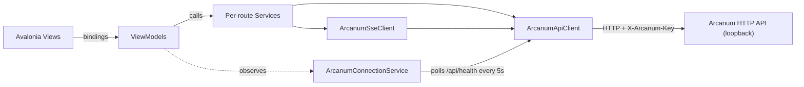

# The Forge — Inference IDE

**The Forge** is the world's first Inference IDE (iIDE): a cross-platform Avalonia desktop
application that provides a complete development environment for AI inference workflows, built on
top of the Arcanum HTTP API. It lives inside the existing Arcanum solution as three additional
projects and consumes Arcanum exactly as any other API client would — loopback HTTP, API-key
authenticated, no in-process coupling.

> **Naming note:** `docs/Arcanum.DESIGN.md` §19 documents a backend feature also named "The Forge" (the
> campaign/spell-metadata/prompt registry). That is an unrelated, pre-existing use of the name for a
> *server-side* concept. This document describes the *desktop IDE* — the two are distinct and the
> collision is intentional (the IDE is named after the same fantasy metaphor, not after that
> registry).

## 1. Purpose and scope

The Forge gives an operator a GUI over everything Arcanum's CLI/HTTP surface can do: browsing
campaigns and spells, editing and casting/executing spells, chatting in sessions, orchestrating
apprentices, approving wards, tracking budget, managing MCP servers and browsing configured models/providers,
running trials, and more. It does not run inference itself, does not open the Grimoire database
directly, and does not duplicate any server-side business logic — every capability is a thin
wrapper over an Arcanum API route. Server contracts live in [`Arcanum.DESIGN.md`](Arcanum.DESIGN.md);
operator connect/settings/build steps live in [`TheForge.README.md`](TheForge.README.md).

## 2. Project model

Three projects, added to the existing `RetroDownfall.Arcanum.slnx` solution:

| Project | Kind | Depends on |
|---|---|---|
| `RetroDownfall.TheForge.Core` | Class library, no Avalonia dependency | `RetroDownfall.Arcanum.Core` (project reference) |
| `RetroDownfall.TheForge.Ux` | Avalonia desktop app (the IDE itself) | `RetroDownfall.TheForge.Core` |
| `RetroDownfall.TheForge.Tests` | xUnit test project | `RetroDownfall.TheForge.Ux` |

`RetroDownfall.TheForge.Core` holds The Forge-specific models, re-declared DTOs, settings, the JSON
source-generation context, and the API key resolver — nothing that needs Avalonia. Referencing
`RetroDownfall.Arcanum.Core` (a pure leaf project, net10.0, AOT-compatible, no project references of
its own) gives The Forge every wire DTO it needs except a handful of Health/Meta/Budget types that
live in the ASP.NET-heavy `RetroDownfall.Arcanum.Api` project (see §4). Both projects inherit
`0.1.0-beta` from `Directory.Build.props` (no project-level version override).

## 3. Architecture

- **MVVM** via `CommunityToolkit.Mvvm`; every ViewModel inherits `ViewModelBase`.
- **DI** via `Microsoft.Extensions.DependencyInjection` in `ServiceCollectionConfigurator` — no service locator.
- **HTTP:** only `ArcanumApiClient` (named `HttpClient` "ArcanumApi") calls `HttpClient` directly; per-route services wrap it.
- **Streaming (two shapes):**
  - **NDJSON** — `POST /api/intelligence/ping-stream`, `POST /api/spells/{name}/execute-stream` (and prompt execute-stream).
  - **SSE** — session stream, apprentice Chronicle, `/api/events/{logs,mcp,daemon}` (`data: …\n\n`, `[DONE]`, ignore `: keep-alive`).
- **Connection:** `ArcanumConnectionService` polls `GET /api/health` every 5s when `AutoConnect` is true; exposes state for The Anvil.

## 4. Wire contract notes (verified against the Arcanum source, not just the API surface map)

Load-bearing facts that differ from a naive route-list reading. Full Arcanum route/error contracts:
[`Arcanum.DESIGN.md`](Arcanum.DESIGN.md) (§4.3 inventory, §8 HTTP/JSON, §8.23 errors).

- **Envelope:** `ApiResponse<T>` = `{ data?, isSuccess, error?, traceId? }` (camelCase). `data` omitted on failure or `default(T)`. `Error` is a `readonly record struct` `{ code, message, details? }`.
- **Re-declared DTOs** (live in `Arcanum.Api`; The Forge does not reference that project): `HealthReportDto`, `HealthComponentDto`, `HealthStatus`, `InstanceMetadataDto`, `GrimoireStatsDto`, `BudgetSummaryDto`, `OptionalWorkspaceRequest`, `ToolInvokeRequest` / `ToolInvokeResponse` (`Arguments`/`Result` = `JsonElement`). **`HealthStatus` serializes as an integer** (0/1/2) — no `JsonStringEnumConverter` on the mirror either. Everything else (campaigns, spells, sessions, apprentices, wards, trials, MCP, lore, saga, …) comes from `Arcanum.Core`. **`POST /api/providers/test`** accepts only `AiProviderKind.OpenAICompatible`. **`POST /api/intelligence/arsenal`** takes `OptionalWorkspaceRequest?` → `WorkspaceArsenalDto`.
- **Streaming shapes** — NDJSON vs SSE as in §3; do not assume one covers both.
- **`WardDto`:** `WardId` is `string`; expiry is `ExpiresAt` (`DateTimeOffset`). Approve/deny via one `POST /api/wards/{id}` with `ResolveWardRequest(bool Allow, string? Reason)`.
- **`IntelligenceEvent`:** token text is in **`Data`**, not `Message`. Terminal `result.Message` is the accumulated assistant answer for consumers such as Apprentice, while legacy `result.Data` remains the decimal `usage.total_tokens` string. Native usage also exposes optional `cached_tokens` and `reasoning_tokens`. `IntelligenceEventType` is camelCase string enum (`token`, `reasoning`, `toolCall`, `toolResult`, `toolError`, `warded`, `wardResolved`, `status`, `sessionBound`, `conversationBound`, `result`, `error`). A reasoning frame carries typed `Reasoning:{Text,Output}` (`summary|full`) and no provider-protected data. Ignore deprecated `conversationBound`. The NDJSON reader preflights the discriminator before strict source-generated deserialization: unknown nonblank future strings are skipped silently; malformed JSON or missing/non-string/blank/padded types are logged and skipped. `StreamReader` reassembles complete lines and multibyte UTF-8 characters split across transport reads. The Tome streams client-safe reasoning into a separate live `reasoning` message and never appends it to the assistant message. Tome messages accumulate deltas in bounded mutable buffers, publish UI snapshots in coalesced batches with a final flush, and mark truncation explicitly (64 KiB for reasoning, 200,000 characters for other live message content). `ChatCompletionUsage` uses OpenAI snake_case field names inside an otherwise camelCase envelope.
- **`ApprenticeDetailDto`:** `Status` is PascalCase **string** (`"Running"`, …), not an enum. `Plan` / `PlanStep.Status` are free-form lowercase strings — match case-insensitively. Lineage is client-side walk of `ParentApprenticeId` (no dedicated endpoint).
- **Chronicle SSE frames are flattened:** pass-through Wizard fields sit on the frame (no nested `wizardEvent`). Lifecycle types `CastSent` / `SimulacrumStarted` / `SimulacrumCompleted` are **PascalCase** on the wire; others camelCase. Deserialize to Forge-local `ChronicleFrame` (raw `Type`), not `ApprenticeEvent`.
- **Paths / key:** `ArcanumPaths.GrimoireDirectory` → `~/.config/arcanum`; settings at `{GrimoireDirectory}/the-forge.json` (legacy `forge.json` renamed on first launch). Master key is **not** in `the-forge.json` — shared OS credential store `arcanum` / `master-api-key`. Resolution: OS store → migrate the-forge.json → `THEFORGE_ARCANUM_KEY` (process-only) → `arcanum key show` (stderr) → paste. Operator detail: [`TheForge.README.md`](TheForge.README.md#acquiring-an-api-key).
- **Enum serialization:** no blanket `JsonStringEnumConverter` on `TheForgeJsonContext` / `TheForgeSettingsJsonContext`. Per-type converters only; `HealthStatus` stays integer.

OpenAI-shaped `/v1/files` and `/v1/batches` use a dedicated `OpenAiCompatApiClient` (bare OpenAI DTOs / error envelope — never `ApiResponse<T>`).

## 5. Naming metaphor

| UI Concept | Name | UI Concept | Name |
|---|---|---|---|
| The IDE | The Forge | Spell dependency graph | The Resonance Map |
| Editor area (tabs) | The Workbench | Apprentice lineage tree | The Lineage Tree |
| Project/campaign explorer | The Atelier | Session/conversation viewer | The Tome |
| Terminal panel | The Hearth | MCP server management | The Arsenal |
| Git integration | The Ledger | Tool invocation inspector | The Scrying Pool |
| Command palette | Incantation | Trial/test runner | The Proving Grounds |
| Status bar | The Anvil | Semantic search | Divination |
| Output/logs panel | The Foundry Floor | Lore browser | Lore Browser *(literal)* |
| Ward approval UI | The Gatehouse | Saga memory browser | The Archive |
| Budget/cost tracking | The Treasury | Models & Providers (read-only) | The Arsenal |
| Agent orchestration view | The War Table | Unseen Servant scheduler | The Servants' Quarters |
| Settings | Compendium | Comm Link alerts | Comm Link Alert Dashboard *(literal)* |
| Spell version diff viewer | The Mirror | Sanctum breach monitor | Sanctum Breach Monitor *(literal)* |
| Prompt template designer | The Scriptorium | Mana/token visualization | Mana Visualization *(literal)* |
| Multi-session tab management | The Council Chamber | Notifications/toasts | Whispers |
| Global search | The Eye of the World | Context help/docs | The Codex |
| Entry inspector | The Loupe | Artifact import/export | Export / Import *(Atelier + Spell/Scriptorium; §5.18)* |
| Markdown preview | The Illumination | | |

`Compendium` here is The Forge's Settings panel concept, distinct from `RetroDownfall.Compendium.Ux`
(Arcanum's configuration-editor app) — same fantasy vocabulary, unrelated products.

### 5.1–5.19 UI surface stubs

> **Redirect:** phase-by-phase shell/editor essays lived here. Authoritative delivered scope + deferred
> list: **§6**. Load-bearing client quirks: **§4**. Operator connect/build: [`TheForge.README.md`](TheForge.README.md).

### 5.20 Inference IDE expansion tracker

Operator prose uses **The Forge**; identifiers remain `RetroDownfall.TheForge.*` / `the-forge.json` /
`TheForgeJsonContext`. Local history stores (suites, comparisons, traces, fixtures) are versioned JSON
under `~/.config/arcanum/` — not Grimoire / not `Arcanum.PERSISTENCE.md`.

Inference traces retain body-free reasoning metadata only: event type, `reasoningOutputMode`, and
`reasoningTokens` may be shown and exported, while `Message` is replaced by a fixed redaction marker
and `Data` is null. `BuildExportJson`, explicit exports, and the local trace store therefore never
persist the reasoning body.

| Phase | Scope | Status |
|---|---|---|
| 0–10 | Inventory → Ledger Git UI (wizard, suites, comparison, mirrors, traces, MCP invoke, Weave, audit, files/batches, Ledger) | implemented |

**Still deferred inside those phases:** suite-from-batch; Ledger push/pull/reset/rebase. Full deferred list: §6.

## 6. Feature catalog (phased)

Milestones A–H, H1/H2, and the §5.20 expansion through phase 10 are implemented.

| Milestone | Phases | Scope |
|---|---|---|
| A — Foundation | 1–2 | Solution scaffold, Core models, JSON contexts, `ArcanumApiClient`/`ArcanumSseClient`, connection service, per-route services, DI, tests |
| B — Shell | 3 | Menu, dockable tools, Workbench, Anvil; `LayoutState` persistence |
| C — Create & converse | 4–6 | Atelier, Spell editor, The Tome |
| D — Orchestrate & govern | 7–9 | War Table + Chronicle, Gatehouse, Anvil aggregation |
| E — Polish | 10 | VS 2026 Fluent Dark/Light, typography, Icons, ManaBar, theme swap |
| F — Author & test | 11 | Artifact creation, Scriptorium |
| G — Operate Inference | 12 | Arsenal (MCP, Scrying Pool, Models & Providers), Treasury |
| H — Context and Memory | — | Lore, Archive, Divination, Workspace Explorer, Weave Inspector, Codex, Tome memory |
| H1 — The Illumination | — | Native markdown preview (Source/Split/Preview) |
| H2 — The Illumination Completion | — | Markdig AST renderer, remote images, scroll sync, footnotes |
| Phase 2.2 — Disabled-state guidance | — | Exact `Arcanum:*` paths; Copy setting paths; Open Compendium |
| Phase 4 — The Mirror | — | Spell version panel (LCS, activate/create/update) |
| Phase 5 — Spell Metadata Designer | — | Visual SPELL.json + known-field round-trip |
| Phase 6 — Proving Grounds UI | — | Singleton Trial tab + local suites |
| Phase 7 polish — Campaign CRUD + import/export | — | Campaign registry + artifact import/export |
| RAG Phase 7 — The Weave Inspector | — | Index status/chunks, re-index, embeddings reset, Divination cross-links |
| Phase 8 — Audit Browser | — | `/api/audit` + `/api/guardrails/audit`; CSV/JSON export |
| Phase 9 — Files & Batches | — | OpenAI `/v1/files` + `/v1/batches` via `OpenAiCompatApiClient` |
| Phase 10 — The Ledger | — | Desktop-local Git UI (`IGitProcessRunner`) |

**Still deferred**

- True PTY Hearth; OS-level floating tool windows
- Provider / budget / pricing / model-metadata editing; model/session token-cost breakdown route
- Guardrails settings panel in The Forge (edit `arcanum.json` / Compendium today)
- Advanced import conflict wizards; full campaign Settings editor
- Advanced file diff/merge; relative workspace inline images (needs binary/base64 workspace API)
- Mermaid graphs / native math rendering; suite-from-completed-batch
- Ledger push / pull / reset / rebase
- Internal-tool diagnostics via diagnostic MCP endpoint (requires Wizard pipeline — see Arcanum.DESIGN.md §11.28)

## 7. API integration notes

- **Base URL:** `TheForgeSettings.BaseUrl`, default `http://localhost:5001`. With ListenAny /
  `ARCANUM_HOST_ANY`, Arcanum is HTTPS-only — set `https://localhost:{HttpsPort}` (or remote HTTPS).
  TLS validation is not bypassed.
- **Auth:** `X-Arcanum-Key` on every `/api/*` request (server also accepts `Authorization: Bearer`;
  The Forge always sends the dedicated header).
- **Settings:** `~/.config/arcanum/the-forge.json`, `reloadOnChange: true`.
- **Errors:** transport failures synthesize `ApiResponse<T>` with `Connection.Failed` /
  `Connection.Timeout` rather than throwing.
- Wire quirks: §4. Operator connect/key/settings: [`TheForge.README.md`](TheForge.README.md).

## 8. Document maintenance

Any change that touches The Forge's architecture, wire contracts, project structure, or UI feature
set must update this document in the same change set as the code — mirroring
[`docs/Arcanum.DESIGN.md` §18](Arcanum.DESIGN.md#18-document-maintenance). Update the §6 catalog when
milestones land, and keep [`docs/TheForge.README.md`](TheForge.README.md) in sync for operator-visible
steps (build/run, API key, settings location).
