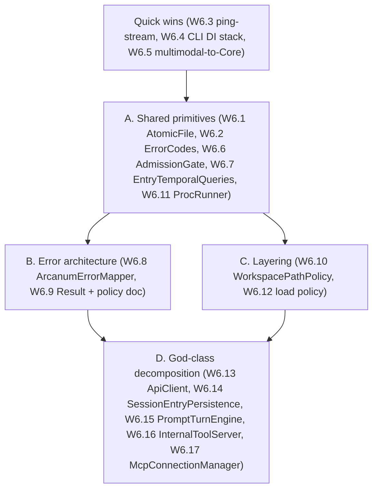

# Arcanum Design Review — Waves 1–3 (fresh, design-first) → executable Wave 6

> **For agentic workers:** This is the authoritative, executable **design-debt** plan produced by a fresh design-first review of the Waves 1–3 bug remediation (see `REMEDIATION-PLAN.md`). The remediation drove the solution to zero known defects; this plan addresses the **structural** debt that the bug-by-bug approach left behind. Work it **top to bottom**; each item is gated by the **Standing verification protocol** in `REMEDIATION-PLAN.md` (TDD red-first, smallest principled change, docs travel with code, four gates green, one commit per item, pause at wave boundaries). Items use checkbox (`- [ ]`) syntax.

**Method:** four parallel read-only design reviewers (concurrency & error-model, persistence, MCP/llama/spells/security, API/CLI surfaces) judged the *result* of the point-fixes — abstraction coherence, contract consistency, coupling, layering — not new bugs. They converged tightly.

**Headline verdict:** Waves 1–3 are **operationally coherent but structurally patchwork**. The fixes are locally correct and reuse some genuinely good primitives, but the same *idea* was often implemented 3–4 times instead of once, and four god-classes simply absorbed more patches. The remediation established **conventions** (dotted error codes, "mirror `SseConnectionGate`", watermark-aware loads); it did not establish **shared abstractions**. Wave 6 converts the best conventions into enforced abstractions and pays down the god-class debt incrementally.

---

## What is genuinely well-designed (keep; do not regress)

- **`OutboundUrlGuard`** — the SSRF egress model (untrusted vs provider modes, settings validation, `Create*EgressHandler()`, DNS-rebind pinning). This is the *exemplar* the other cross-cutting policies should imitate.
- **`SandboxedFileIo`** — pre-open + handle-identity + post-open + post-move revalidation. The single best cohesive unit in the tree.
- The **`KeyedLock` / `BoundedLruCache` / `SingleFlight`** caching/locking toolkit (self-evicting, tested) and atomic `(digest,expiry)` snapshot publishing (`ApiKeyDigestCache`).
- **MCP wire robustness** is symmetric where it counts — `McpOutboundLineGuard.Enforce` on all three transports; shared inbound JSON-RPC parsing; bridge fallback correctly narrowed to `McpTransportUnavailableException`.
- **Unified spell BFS walker** (`EnumerateSpellFiles` feeding both tree + metadata scans) with consistent `BoundedLruCache` + `SingleFlight` caching.
- **Watermark-aware bounded load** (`GrimoireRepository.GetSessionAsync` expands `take` to cover all post-summary entries) — the strongest single persistence decision.
- **Shared startup config validation** (`ConfigurationStartupValidator` over Core's `ConfigurationValidator`, used by both hosts + `POST /api/config/validate`) and the **`InferenceErrorMapper`** on all *buffered* inference routes + the **rate-limit 429 envelope**.
- Core serialization fixes: `[JsonIgnore]` on `Result<T>.Value`, `ApiResponse<T>.Data` `WhenWritingDefault`.

## Explicit leave-as-is (proportionality — do NOT "fix" these)

- **Two Core repository interfaces** (`IGrimoireRepository` vs `ISessionRepository`) — they reflect real Intelligence-vs-Forge consumer boundaries. (The *Infrastructure* implementation duplication is the target — see W6.14.)
- **`OutboundUrlGuard`** shape; **`HumanPromptRegistry`** not on `KeyedLock` (wrong-shaped, documented); **MCP server registry** not self-evicting (intentional cap+lock).
- **HTTP MCP has no wire-cancel** (correct for HTTP — stream close is the 2026-07-28 cancel signal).
- **Static spell caches** (fine for single-user/loopback; tests document isolation).
- **OpenAI `/v1` separate error envelope** (`OpenAiErrorResponse`) — compat requirement, not a divergence to unify.
- **`-1` `UnsummarizedEntryCount` legacy sentinel** + lazy backfill — pragmatic until a migration lands.
- **ProvingGrounds verdict + API-runner pre-validation dual path** — harmless defense-in-depth.
- **`execute_command` keeping `PATH`/`HOME`** while MCP children scrub more — reasonable for the posture; the gap is that it isn't expressed as an explicit *named policy* (W6.11), not the policy itself.

---

## Wave 6 — design-debt paydown

Severity here = **design leverage**, not defect risk (Waves 1–5 already closed the defects). Ordered low-risk → structural. Reviewer evidence is cited at `file:line` (lines drift as work lands; treat as anchors).

### Theme A — Turn conventions into shared primitives

- [ ] **W6.1 — `AtomicFile.ReplaceAsync` (unify atomic durable writes)**
  - **Closes:** ≥3 independent temp+flush+rename implementations — `SandboxedFileIo`, `SpellAtomicFile`, inline `ConfigurationWriter` (+ secret-store/daemon variants). A new durable-write site can easily roll its own non-atomic write.
  - **Fix:** one `Infrastructure/Storage/AtomicFile.ReplaceAsync(path, writeBody, permissionHook?)` (same-dir temp, flush-to-disk, atomic `File.Move` replace, optional post-move `SecureFilePermissions` hook). Migrate the three call sites to delegate; keep `SandboxedFileIo`'s extra handle-revalidation as a wrapper *around* it.
  - **Risk:** Low. Blast radius ~5 files. Crash-safety tests already exist per site.

- [x] **W6.2 — `ErrorCodes` constants + taxonomy (de-magic the code strings)** ✅ *done — `Core/Primitives/ErrorCodes.cs` centralizes cross-layer dotted codes; literals replaced in Api/Infrastructure/Cli/InferenceErrorMapper.*
  - **Closes:** dotted error codes (`Campaign.NotFound`, `Apprentice.NotFound`, `Connection.Timeout`, `CommLink.Suppressed`, `Api.TooManyConnections`, …) are repeated magic strings across Api/Infra/Cli; grep works, compile-time safety + mapper-completeness do not.
  - **Fix:** `Core/Primitives/ErrorCodes.cs` constants for any code used in >1 layer, grouped by a short taxonomy comment (Validation / NotFound / Capacity / Timeout / Suppressed / Hub). Replace literals incrementally; document "suppressed outcomes are expected, not 5xx."
  - **Risk:** Low (string→const). Sets up W6.8.

- [x] **W6.3 — Unify inference pre-flight: `ping-stream` through `InferenceErrorMapper`** *(quick win)* ✅ *done — `ping-stream` resolve failures now map via `InferenceErrorMapper.ResolveStatusCode` (Campaign.NotFound→404) instead of a flat 400, matching buffered `ping`.*
  - **Closes:** `/intelligence/ping` maps resolve failures via `InferenceErrorMapper`, but `/intelligence/ping-stream` hardcodes **400** for the *same* `Campaign.NotFound` resolve failure (`IntelligenceEndpoints.cs:237-246`) — a surface incoherence the CLI streaming client sees.
  - **Fix:** shared pre-flight helper (validate → resolve → map status via `InferenceErrorMapper`) before `InferenceExecuteWriter` / NDJSON start; both ping endpoints call it.
  - **Risk:** Low. Small, localized.

- [x] **W6.4 — `AddArcanumCliClientStack()` (stop serve/CLI DI drift)** ✅ *done — Infrastructure-owned `AddArcanumCliClientStack()` composes Data Protection + `IApiKeyDigestCache` + `ISecretStore` + CLI Grimoire; `CliApplicationFactory` calls it instead of hand-listing the four registrations.*
  - **Closes:** `CliApplicationFactory` hand-maintains a parallel registration list (DataProtection, `IApiKeyDigestCache`, `ISecretStore`, grimoire-for-cli) that already drifted once (DX5). Any new `DataProtectionSecretStore` prerequisite must be remembered in two places.
  - **Fix:** Infrastructure-owned `AddArcanumCliClientStack()` composing the minimal shared subset; `CliApplicationFactory` only adds UX/commands. Keep the CLI's intentional `AddDbContext` (vs API's pooled) as a documented parameter.
  - **Risk:** Low. DI-only; existing CLI factory tests + a command-resolution smoke test cover it.

- [x] **W6.5 — Move multimodal bounds into `PingRequestBoundsValidator` (Core)** ✅ *done — `MaxContentPartsPerMessage` is enforced per stateless message in the Core validator (`Validation.TooManyContentParts`), so `/intelligence/*` shares the cap `/v1` already had.*
  - **Closes:** part-count cap + unsupported-part rejection live only on `/v1` (`OpenAiV1Endpoints.cs:187-217`); a native `/intelligence/*` client sending huge `ContentParts` still allocates heavily.
  - **Fix:** move the `MaxContentPartsPerMessage`/type checks into `PingRequestBoundsValidator` so both surfaces share them; keep OpenAI-specific role/param validation in `/v1`.
  - **Risk:** Low.

- [ ] **W6.6 — `AdmissionGate` / `SoftCapCounter` lease primitive**
  - **Closes:** four near-duplicate "don't exceed N" shapes — `SseConnectionGate` (lease + idempotent dispose), `ApprenticeConcurrencyGate` (manual `Release()`), `WardGate.MaxActiveWards`, MCP `MaxServers` (dict-reserve), daemon single-running. Comments say "mirroring `SseConnectionGate`" but there is no shared type; the lifetime contract (lease vs manual release) differs and invites slot leaks.
  - **Fix:** small `AdmissionGate` (`TryEnter(int max) → IDisposable lease`, idempotent dispose) in `Infrastructure/Hosting`; wrap domain state (`WardGate._pending`, MCP registry) *around* it; standardize on lease/dispose. **Leave `ChatClientFactory`** as a bounded cache + operator warning (not a gate) — document it as such.
  - **Risk:** Low–medium. Logic already proven; mainly API unification + careful migration of acquire/release pairs.

- [ ] **W6.7 — `EntryTemporalQueries` (contain the `DateTimeOffset` raw-SQL)**
  - **Closes:** ~9 near-identical `SELECT … ORDER BY "CreatedAt"` / keyset fragments copy-pasted across `GrimoireRepository` and `SessionRepository`; UTC-normalization, `(CreatedAt, Id)` tie-break, and `>` vs `>=` conventions live only in comments (compare `CountEntriesAfterAsync` vs the keyset reads).
  - **Fix:** one `Infrastructure/Repositories/EntryTemporalQueries` helper (`LoadRecentDescending`, `LoadAfterKeyset`, `CountAfter`, export batching) owning column names, UTC normalization, and tie-break rules. (Evaluate an EF `HasConversion` for `CreatedAt`, but a query helper is the pragmatic seam since the issue is `ORDER BY` translation.)
  - **Risk:** Low–medium. Behavior-preserving; per-shape tests exist. Good precursor to W6.14.

- [ ] **W6.11 — `CappedChildProcessRunner` + named env-scrub profiles**
  - **Closes:** `CappedOutput`/`ReadStreamCappedAsync`/`TryKillProcessEntireTree` are near-copies in `ArcanumInternalToolServer` and `ArcanumSpellScriptTool`; child-process env is **three unstated policies** (MCP full scrub / `execute_command` strips `ARCANUM_*` only / `run_spell_script` no scrub).
  - **Fix:** one `CappedChildProcessRunner` (Infrastructure) with an injectable env policy; encode the three behaviors as named profiles (`McpChild`, `ToolExec`, `SpellScript`) — preserve the *semantics*, kill the copy-paste.
  - **Risk:** Medium (process lifecycle + kill-tree). Strong existing tests.

### Theme B — One error/outcome architecture

- [ ] **W6.8 — `ArcanumErrorMapper` + table-driven completeness test**
  - **Closes:** `InferenceErrorMapper` is *not* the single status authority — parallel switches in apprentice/proving-grounds/workspace endpoints, inline 404s, and `Api.TooManyConnections→503` (in `SseConnectionResults`, outside the mapper). Adding a domain error means touching several switches; the mapper's `_ => 500` hides mis-wiring.
  - **Fix:** generalize to `ArcanumErrorMapper` (or `InferenceErrorMapper` + `DomainErrorMapper` over one registry keyed by `ErrorCodes`); endpoints become thin `MapResult(result, traceId)`. Add a table-driven test asserting every known `ErrorCodes` value maps intentionally.
  - **Risk:** Medium (easy to mis-map a code's status). Depends on W6.2.

- [ ] **W6.9 — `Result<Entry>` for session mutations (kill exception-message parsing)**
  - **Closes:** the worst boundary smell — `SessionEndpoints` catches `InvalidOperationException` and parses substrings (`Contains("not found")`, `StartsWith("Session.TooManyEntries:")`) because `SessionRepository.AddEntryAsync` + `GrimoireLimits` encode codes *inside exception messages*. Fragile cross-layer coupling, opposite of the `Result`/`ApiResponse` discipline elsewhere.
  - **Fix:** `AddEntryAsync` returns `Result<Entry>`; `GrimoireLimits.EnforceEntryLimits` returns `Error` (not prefixed exception text); endpoints map via W6.8. Reserve exceptions for true programmer/infrastructure errors.
  - **Risk:** Medium. Blast radius ~4–6 files; behavior-preserving if codes/status unchanged. Depends on W6.2/W6.8.

- [ ] **W6.* (doc) — Outcome-model policy paragraph in DESIGN.md**
  - One paragraph: **`Result` at repository/service boundaries; exceptions for unrecoverable/infrastructure/programmer errors; transport exceptions only where fallback is intentional.** Fold into whichever commit lands W6.9. Stops contributors adding new `InvalidOperationException` string codes.

### Theme C — Layering & discoverability

- [ ] **W6.10 — `WorkspacePathPolicy` (move path policy out of the `Mcp` namespace)**
  - **Closes:** cross-cutting workspace security (`ToolHelpers.IsPathUnderWorkspaceWithSymlinkCheck` / `RevalidatePathBeforeIo`, handle identity) lives under `Infrastructure.Mcp`, but Api/Workspaces/Security/Sanctum all import it for path checks — a wrong "MCP-only" mental model + low discoverability. Also: `SpellScanner` re-implements its own prefix check.
  - **Fix:** move `ToolHelpers` + `FileHandleIdentity*` to `Infrastructure/Security/WorkspacePathPolicy`; `SandboxedFileIo` stays MCP-facing but delegates; `SpellScanner` uses the shared prefix check. Document the two read tiers (lexical-only scan vs handle-identity I/O) explicitly. *(Sub-note: also relocate `ManaPreflight`'s reloadable-LRU pattern to Infrastructure or expose a small Core abstraction so Api stops reaching into Infrastructure internals via `InternalsVisibleTo`.)*
  - **Risk:** Medium (namespace move; behavior must stay identical — `ToolHelpersSymlinkTests`/`SandboxedFileIoTests` cover it). Do before W6.17 so security stays centralized.

- [ ] **W6.12 — Unify bounded-load policy across the four sibling methods**
  - **Closes:** `GetSessionAsync` / `GetSessionEntriesAsync` / `GetRecentSessionEntriesAsync` / `GetEntriesAscendingAsync` use *different* clamp/watermark rules (only `GetSessionAsync` is watermark-aware and can exceed `maxMessages`; `GetEntriesAscendingAsync` has no `maxMessages` clamp). Forge SSE replay honors neither.
  - **Fix:** one `ResolveEntryWindow(session, requestedTake, policy)` used by all call sites; **product decision needed:** does Forge replay honor watermark expansion + `maxMessages`? Document the answer.
  - **Risk:** Medium (touches a product policy). Depends on W6.7.

### Theme D — God-class decomposition (structural; high-risk; incremental)

> Size alone is not the defect — **smeared responsibility** is. Each below is the class the remediation kept patching. Do these last, incrementally, with the four gates after every extraction step.

- [ ] **W6.13 — Finish `ArcanumApiClient` migration to `SendRequestAsync`** *(mechanical)*
  - **Closes:** ~2,394 lines; `SendRequestAsync`/`GetApiAsync` exist but ~20 endpoints still hand-roll api-key lookup + client creation + status handling + `TryDeserialize`. `TryDeserialize` fixed fragility but did not collapse the boilerplate.
  - **Fix:** route all non-streaming calls through `SendRequestAsync`; keep streaming methods as thin wrappers over a shared "send + pre-stream envelope read + byte pump". (Codegen/Refit is a *future* option, not now.)
  - **Risk:** Medium, mostly mechanical; `ArcanumApiClientTests` cover it. Biggest CLI-coherence win.

- [ ] **W6.14 — Extract internal `SessionEntryPersistence` (one entry-write owner)**
  - **Closes:** `GrimoireRepository` and `SessionRepository` both insert into `Entries` with copy-pasted lock + `SqliteBusyRetry` + `UnsummarizedEntryCount` + `UpdatedAt`; remediation synchronized behavior but not ownership. A future `AddEntryAsync`-like method on either side can reintroduce drift. `UpdateSessionAsync` can also clobber the counter.
  - **Fix:** internal `SessionEntryPersistence` (Infrastructure) owns insert/finalize/discard + lock + retry + limits + counter; both repos delegate. **Keep the two Core interfaces.** Make `UpdateSessionAsync` patch scalar fields (ignore counter).
  - **Risk:** Medium–high (central write path). Depends on W6.7/W6.9. Highest persistence payoff.

- [ ] **W6.15 — Extract `PromptTurnEngine` from `WizardIntelligenceProvider`**
  - **Closes:** ~3,184 lines; parallel `ExecutePromptAsync`/`StreamPromptAsync` pipelines duplicate setup/teardown (so bugs get fixed twice — the remediation did exactly this), plus smeared Sanctum/Ward enforcement, grimoire side-effects, message mapping, failure sanitization.
  - **Fix:** incremental — extract the **tool-execution loop** first (`ToolExecutionPipeline`), then **grimoire side-effects** (`GrimoireTurnWriter`), then **context/message build** (`InferenceContextBuilder`); `WizardIntelligenceProvider` becomes a coordinator over a shared `PromptTurnEngine` with thin sync/async façades.
  - **Risk:** High (all inference paths: `/intelligence/*`, `/v1`, prompts, spells, apprentices). One gated commit per extraction step.

- [ ] **W6.16 — Split `ArcanumInternalToolServer`**
  - **Closes:** ~2,906 lines owning protocol framing + cancellation broker + workspace sandbox + process exec + ~15 domain tools; every new tool grows the regression surface.
  - **Fix:** `InternalMcpHost` (read loop, caps, dispatch) + per-tool handlers via a registry (AOT-registered once); file ops become thin wrappers over `WorkspacePathPolicy` (W6.10) + `AtomicFile` (W6.1); process exec uses `CappedChildProcessRunner` (W6.11).
  - **Risk:** Medium–high (dispatch wiring + AOT registration). Depends on W6.1/W6.10/W6.11.

- [ ] **W6.17 — Decompose `McpConnectionManager`**
  - **Closes:** ~2,162 lines smearing transport factory + registry + lifecycle + tool merge + trust + SSRF preflight; the clean `IMcpClient`/`IMcpTransport` abstractions stop at the factory door.
  - **Fix:** extract `McpRegistry`, `McpPartitionRuntime`, `McpToolMerger`; the manager becomes an orchestrator. Do **after** W6.10 so path/security stays centralized.
  - **Risk:** High (many concurrent lifecycle edges). Last.

---

## Sequencing

**Why this order:** quick wins are isolated and build confidence; shared primitives (A) are prerequisites that the error architecture (B), layering (C), and especially the god-class decomposition (D) all consume. D is last and incremental — each extraction is its own gated commit, and god-class work only starts once the primitives it should delegate to exist.

## Backing analysis

Produced by four read-only design reviewers: [concurrency & error-model](2dfd3800-0529-4710-bce2-1b51c2d68cc2), [persistence](63b4c72b-f6e7-42e8-ba30-92aabc19acb2), [MCP/llama/spells/security](553dd5fa-d859-4427-9e59-030775e1ffc5), [API/CLI surfaces](dfbff308-32c7-48df-8732-c6b6f44ba5d0). The `00-core.md` / `01-infrastructure.md` / `02-api.md` / `03-cli-devhost.md` audit reports and `REMEDIATION-PLAN.md` remain the Waves 0–5 backing analysis; this file is the Wave 6 actionable plan.
