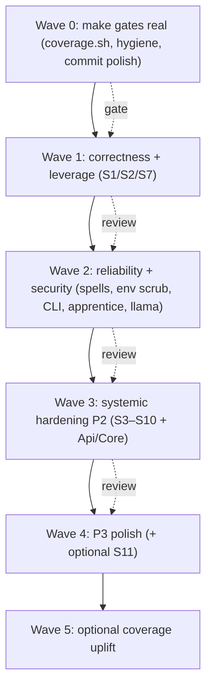

# Arcanum Bug-Eradication Plan (build-button executable)

> **For agentic workers:** This is the authoritative, executable remediation plan for the Arcanum solution. Work it **top to bottom**, one work item per commit, pausing for review at each wave boundary. Every item is gated by the **Standing verification protocol** below. Steps use checkbox (`- [ ]`) syntax for tracking.

**Goal:** Drive the entire solution to zero known defects (P1 → P2 → P3) across reliability, correctness, concurrency, resource-safety, security, performance, and AOT — without regressing the green build/test/AOT baseline.

**Architecture:** .NET 10 / C# Native-AOT. `Core` (contracts + config + clamps) → `Infrastructure` (Grimoire EF+SQLCipher, MCP, llama, hosting) → `Api` (endpoints, inference, `/v1`) → `Cli`/`DevHost`. STJ source-gen everywhere; single-user, loopback-by-default posture.

**Tech stack:** EF Core 10 + SQLCipher, Minimal APIs (RequestDelegateGenerator), Spectre.Console, xUnit + coverlet, `Microsoft.Extensions.AI`.

---

## Verified baseline (Sat 2026-06-27)

| Gate | Command | Result |
|------|---------|--------|
| Build | `dotnet build RetroDownfall.Arcanum.slnx` | **0 warnings / 0 errors** (clean rebuild) |
| Tests | `dotnet test tests/RetroDownfall.Arcanum.Tests/...` | **1138 passed, 0 failed, 2 skipped** |
| AOT IL | `./scripts/verify-aot-il-warnings.sh` | **PASS** (osx-arm64; 0 first-party IL warnings) |
| Coverage | `./scripts/coverage.sh --threshold` | **BROKEN — script does not exist.** Direct Cobertura run = **53.25% line / 39.89% branch**; security types below 100% branch. |

Posture sweeps (whole `src/`): **no** `async void`, **no** `AIFunctionFactory.Create`, **no** reflection JSON, **no** real sync-over-async. SSRF egress, path containment, and end-to-end inference cancellation are genuinely solid (do not regress).

**Already done (do not re-do):** prior commits `P0…P3` (macOS stat/symlink, ADD COLUMN idempotency, KDF doc, ProvingGrounds workspace allowlist, exception-handler HasStarted guard, `[JsonIgnore]` on `Entry.Session`, shared inference status mapping, NDJSON error write, https-only CommLink defaults, capped codex reads, allowed-hosts guard, session-write serialization groundwork, response-drainer cap, hub lifecycle lock). **Uncommitted polish in the tree** (doc-accuracy, house-style blank lines, `SecureFilePermissions` platform attributes, dup-`using` removal) — commit it in **W0.3** before starting.

---

## Standing verification protocol (every work item)

1. **TDD:** add/extend an xUnit test that *fails on current behavior* before the fix, per `docs/tests.README.md`. Reproduce the bug as a red test first.
2. **Smallest root-cause fix at the cited `file:line`.** Reuse the existing good patterns: `ConfigurationWriter` (atomic temp+flush+rename), `SqliteBusyRetry` + `SessionWriteLock` (serialized DB writes), `BoundedLruCache` (bounded caches), `ToolHelpers.RevalidatePathBeforeIo` (post-open handle identity), `SseConnectionGate`/`ApprenticeConcurrencyGate` (atomic increment-then-compare caps), `InferenceErrorMapper.ResolveStatusCode` (status mapping).
3. **Docs travel with code:** update `docs/DESIGN.md` (+ `docs/README.md` for operator-visible changes) in the *same* commit.
4. **All four gates green before "done":**
   - `dotnet build RetroDownfall.Arcanum.slnx` — warning-clean.
   - `dotnet test tests/RetroDownfall.Arcanum.Tests/RetroDownfall.Arcanum.Tests.csproj`.
   - `./scripts/verify-aot-il-warnings.sh` — for any serialization/DI/dependency change.
   - `./scripts/coverage.sh --threshold` — **once W0.1 restores it** (line ≥ 85%, branch ≥ 75%, security types 100% branch).
5. **One commit per work item; pause for review at each wave boundary.** New/edited C# follows the house style (one blank line after each line of C#); do **not** run a repo-wide reformat except in the explicitly-optional W4.3.
6. **No `/v1` or `/api` wire-contract changes** beyond what a finding explicitly requires; treat wire types as versioned contracts.

> **Severity:** P1 = real bug under realistic load/failure; P2 = latent risk / measurable inefficiency; P3 = maintainability/correctness-polish/docs/style. No P0 confirmed (the candidate llama cache-key `..` traversal was independently **re-disproved**: `LlamaCacheKey.SanitizeSegment` strips separators then `Trim('_','.',' ')`, so `".."` → empty → throws).

---

## Wave 0 — Make the build button real (prerequisite)

The plan's own gates must work before anything else, and the tree must be clean.

- [x] **W0.1 — Restore the coverage gate (`scripts/coverage.sh`)** ✅ *done — gate runs at 88.20% line / 76.82% branch, all thresholds met; the `coverage.*` `.gitignore` rule was also silently ignoring the script.*
  - **Closes:** **NEW (tooling)** — `docs/README.md` and this plan reference `./scripts/coverage.sh --threshold` as a standing gate, but **the script does not exist** (`scripts/` has only `coverage_threshold.py` + `coverage_threshold_test.py`). The gate is currently un-runnable.
  - **Fix:** Add `scripts/coverage.sh`: run `dotnet test … --collect:"XPlat Code Coverage"` with a committed `coverlet.runsettings` (the *intended* include/exclude set — exclude generated EF model, source-gen contexts, `[ExcludeFromCodeCoverage]` types, DTO/record contracts), merge to one Cobertura report, and `--threshold` invokes `coverage_threshold.py`. The bare `XPlat` run reports **53.25%/39.89%** precisely because no runsettings exclusions are applied — committing the runsettings is what makes the documented 85/75/100 gate meaningful.
  - **Tests:** `coverage_threshold_test.py` already exists; extend it for the merged-report path. Run `scripts/coverage.sh --threshold` and record the real baseline.
  - **Docs:** README scripts table (already references it — make it true).

- [x] **W0.2 — Remove orphaned `.tmp-infra-tests-DTJs/` project** ✅ *done — was tracked; removed + `.gitignore` hardened (`.tmp-*/`, `__pycache__/`).*
  - **Closes:** **NEW (hygiene)** — a stray `InfraTests.csproj` (no sources, not in `RetroDownfall.Arcanum.slnx`, duplicate `RootNamespace`) sits at repo root. Delete it (and ensure `.gitignore` covers `**/.tmp-*`).

- [x] **W0.3 — Commit the in-flight polish** ✅ *done.*
  - **Closes:** the uncommitted working-tree edits (doc accuracy, blank-line style, `SecureFilePermissions` `[SupportedOSPlatform]`/`[UnsupportedOSPlatform]` annotations, `ApprenticeRepository` dup-`using`, `ArcanumSpellScriptTool.ToolName` const, CLI null-handling). Verify gates, commit, so later waves start from a clean tree.

---

## Wave 1 — Correctness & highest leverage

Foundational fixes that also repair downstream findings. Do these first, in order.

- [x] **W1.1 — Validate configuration at startup (systemic S1)** ✅ *done — `ConfigurationStartupValidator` (`IStartupFilter`) aborts boot on invalid config; validator null-hardened + llama port-sum rule added.*
  - **Closes:** P1 `ConfigurationValidator` never runs at boot (`Core/Configuration/ConfigurationValidator.cs:8`; only consumed by injected `validator.Validate(...)` at `Api/Configuration/ConfigurationEndpoints.cs:78,143` — verified first-hand); P1 llama port overflow (fold in a `PortStart + PortRange - 1 ≤ 65535` rule); P2 CommLink `AllowedHosts`/empty `AllowedSchemes` silent no-send; surfaces bad `DefaultModel`/`FastModel`, MCP timeout ordering, missing allow-list roots at boot.
  - **Fix:** Add an `IStartupFilter`/one-shot `IHostedService` (ordered before request serving) that runs `ConfigurationValidator.Validate(settings)` + `OutboundUrlGuard.ValidateArcanumSettingsAsync(settings)` and aborts with a clear message (log + controlled stop — **not** `Environment.FailFast`). Wire it into **both** `serve` (`ServeCommand`/`ApiBootstrapper`) and `DevHost`. Extend the validator with the CommLink scheme/host + port-sum rules.
  - **Also (NEW, Core agent):** null-harden the validator itself — `ConfigurationValidator.cs:78-99,110-116` NREs on `"intelligence": null`/`"mcp": null`, and `:25,39` NREs on a provider with `"models": null`. Null-coalesce nested settings (`settings.Intelligence ?? new()`, `provider.Models ?? []`) at method entry.
  - **Tests:** validator unit tests for CommLink/port/null-subobject rules; integration test asserting startup aborts (not crashes) on a semantically invalid `arcanum.json`.
  - **Docs:** DESIGN §3.4 startup-validation behavior; README configuration note.

- [x] **W1.2 — Anchor the session load window at the summary watermark (systemic S2)** ✅ *done — watermark-anchored bounded load; implemented with parameterized raw SQL because the EF/SQLite provider cannot `ORDER BY`/compare `DateTimeOffset` (see DX1).*
  - **Closes:** P1 read-time compression silently drops un-summarized middle messages (`Api/Intelligence/WizardIntelligenceProvider.cs:1523-1526` + `Infrastructure/Repositories/GrimoireRepository.cs:398-404,949-956` — verified first-hand: `GetSessionAsync` does `Where(SessionId==id).ToListAsync()` then in-memory `SelectRecentEntries`); P1 hot-path full-session load (`:398-404`, `:433-437`, `:460-464`); P2 `GetRecentSessionEntriesAsync` no upper clamp (`:458` only `Math.Max(1, takeLast)`).
  - **Fix:** Push the window into SQL in `GetSessionAsync`/`GetSessionEntriesAsync`/`GetRecentSessionEntriesAsync`: `Where(CreatedAt > watermark).OrderByDescending(CreatedAt).Take(max(N, unsummarizedCount))` then re-order ascending — mirror the correct `SessionRepository.GetEntriesAscendingAsync:322-327`. Guarantee the loaded set always covers everything after `LastSummarizedMessageAt`; add an upper `Math.Clamp` on `takeLast`. **Also (NEW, Infra-A):** `CountEntriesAfterAsync` (`GrimoireRepository.cs:925-932`) materializes all `CreatedAt` — replace with SQL `CountAsync(e => e.CreatedAt > cutoff)`.
  - **Tests:** regression test creating > `MaxMessagesPerConversationLoad` post-watermark entries asserts none dropped from compressed context; bounded-query shape assertion.
  - **Docs:** DESIGN §10 read-time compression clarification.

- [x] **W1.3 — Unify session write paths + maintain the counter (systemic S7)** ✅ *done — `SessionRepository.AddEntryAsync` now locks + retries + maintains `UnsummarizedEntryCount`; `Finalize`/`Discard`/`Purge` acquire the per-session lock.*
  - **Closes:** P1 `SessionRepository.AddEntryAsync` never maintains `UnsummarizedEntryCount` (`Infrastructure/Repositories/SessionRepository.cs:273-313` vs `GrimoireRepository.cs:863-879`) → summarization drift; P2 dual-write without shared lock; P2 grimoire mutators `Finalize`/`Discard`/`Purge` skip `SessionWriteLock` (`GrimoireRepository.cs:152-174,176-234,358-378`); P2 `SessionRepository` writes skip `SqliteBusyRetry`.
  - **Fix:** Route all session-entry mutations through one path (or share `SessionWriteLock` + `SqliteBusyRetry` + `IncrementUnsummarizedEntryCountIfKnownAsync`). Apply the per-`SessionId` lock to `FinalizeAssistantEntryAsync`, `DiscardAssistantEntryAsync`, `PurgeSessionAsync`, and `SessionRepository.AddEntryAsync`.
  - **Tests:** concurrent inference + Forge-API append on one session asserts counter correctness and no `SQLITE_BUSY` fast-fail; Forge-path counter-maintenance test.
  - **Docs:** DESIGN persistence write-serialization note.

---

## Wave 2 — Reliability & security

- [x] **W2.1 — Harden `SpellScanner` + workspace scanning + atomic spell writes** ✅ *safety core done — cycle/depth/step caps + canonical-path visited set (both BFS walks), pre-open handle revalidation, configured `Spells:*` bounds threaded into scans, bounded `PhysicalWorkspaceScanner`, atomic `SPELL.md`/`SKILL.json` writes (`SpellAtomicFile`). **Deferred to a follow-up:** scan-result caching/single-flight (#6), arsenal TTL bypass, export byte caps.*
  - **Closes:** P1 BFS has no visited/depth/step cap → symlink-cycle hang (`Infrastructure/Workspaces/SpellScanner.cs:393-456`, **and NEW: the identical `ScanMetadataTreeAsync:478-540`**); P1 reads without handle/symlink revalidation (`:424,694`); P1 rescan + full re-parse every request (`SpellRepository.cs:54-56,85,113,243,324`; `SpellSearchService.cs:58-93`); P1 non-atomic `SPELL.md` write (`SpellRepository.cs:287`) **and NEW: non-atomic `SKILL.json` write (`SkillJsonIO.cs:62-68`)**; P1 scan ignores configured `Spells:*` (`SpellScanner.cs:759-763`); P1 `PhysicalWorkspaceScanner` unbounded recursion (`PhysicalWorkspaceScanner.cs:18-33`); P2 arsenal cache bypass (TTL=0, `:254-259`), cache stampede (`:170-200,237-249`), export byte bounds (`SpellRepository.cs:477-496`), **NEW unbounded script-filename enumeration (`SpellScanner.cs:839-857`)**.
  - **Fix:** canonical-path visited set + depth/step caps on both BFS methods (reuse `EyeOfTheWorldService` `MaxEnumerationSteps`); `ToolHelpers.RevalidatePathBeforeIo` before every spell/SKILL/script open (mirror `PhysicalFileSystemBrowser.cs:184-187`); temp-write + atomic replace for `SPELL.md` **and** `SKILL.json` (mirror `ConfigurationWriter`/the create-staging path); single-flight on `FullSpellCache`/`MetadataScanCache` + thread the configured TTL from all callers (incl. arsenal); inject live `IOptionsMonitor<ArcanumSettings>` clamps; bound `PhysicalWorkspaceScanner`; enforce export caps.
  - **Tests:** symlink-cycle terminates; symlinked-out spell rejected; configured-bound enforced during scan; atomic-write crash-safety; cache single-flight under concurrency.
  - **Docs:** DESIGN §19 + §3.4 bounds notes.

- [ ] **W2.2 — Scrub child-process environments (systemic S8)**
  - **Closes:** P1 `execute_command` inherits full host env incl. `ARCANUM_*` API keys (`Infrastructure/Mcp/ArcanumInternalToolServer.cs:1947-1960` — verified first-hand: `psi.Environment` never cleared); P2 global MCP children inherit host env (`McpConnectionManager.cs:1156` + `McpProcessTransport.cs:188-205`).
  - **Fix:** `psi.Environment.Clear()` + explicit minimal allowlist for `execute_command` (reuse the workspace MCP scrub policy / `McpSecurityLimits`); default `stripUserEnvironment: true` for **all** MCP children (workspace + global) with explicit opt-in to inherit.
  - **Tests:** spawned-process env assertion (secrets absent); global MCP env-scrub test.
  - **Docs:** DESIGN §11 + §4.2 MCP notes.

- [ ] **W2.3 — CLI: clean errors instead of crashes**
  - **Closes:** P1 `Environment.FailFast` on missing master key (`Infrastructure/Hosting/GrimoireDatabaseBootstrapper.cs:47-52`, reached from `Cli/Commands/AskCommand.cs:79`,`ChatCommand.cs:81` — verified first-hand); P2 unguarded non-streaming `JsonSerializer.Deserialize` → `JsonException` escapes (`Cli/Services/ArcanumApiClient.cs:131-133` + ~20 sites: `:225,310,1489,2262,…`) **and NEW: pre-stream streaming-path deserializes (`:1317-1319,2082-2084`)**; P2 turn bodies catch only OCE (`AskCommand.cs:195-198`, `ChatCommand.cs:1501-1504`).
  - **Fix:** detect missing-key in CLI bootstrap (or return a `Result` from the bootstrapper) → print `Security.MissingApiKey` + exit 1, reserving `FailFast` for true integrity failures; centralize non-streaming send+deserialize with one `try/catch (JsonException)` → `InvalidResponseError` and route all sites through it (incl. pre-stream error bodies); wrap turn bodies in `catch (Exception)` → formatted panel + exit 1 (chat: show + continue REPL).
  - **Tests:** CLI exit-1 + friendly message when no key; corrupt-body → `Api.InvalidResponse` (no crash); turn-fault → panel.
  - **Docs:** README first-run/CLI notes.

- [ ] **W2.4 — Apprentice engine reliability**
  - **Closes:** P1 intervene+resume persists `Running` before slot acquire (`Infrastructure/Hosting/ApprenticeService.cs:400-409`); P1 crash-recovery silent drop when gate+queue full (`:484-488`); P1 unexpected llama exit leaks `Process`+handlers (`LlamaCpp/LlamaServerManager.cs:1045-1079` — never calls `DetachAndDisposeProcess`); P2 resumed-step re-execution on shutdown (`:1154-1156`), Simulacrum task/scope fan-out (`:1630-1652`), single-branch fault fails whole apprentice (`:1652`); **NEW: queued start returns `Result.Failure("queued…")` (`:108-111,540-541`) and `CancelAsync` ignores `_pendingStarts` so an `Idle`-queued apprentice can't be cancelled and starts anyway (`:206-247` vs `:34,538`)**.
  - **Fix:** acquire slot before persisting `Running` (revert to `Escalated` on capacity fail); log + persist a resume-pending marker on recovery-queue-full; dispose `Process` under the gate in `OnExited` (guard vs `StopAsync`); chunk Simulacrum groups to `MaxSimulacra` + per-branch try/catch + reconcile; dedupe pending starts into a set, make pending cancellable, return a distinct pending/success status (not failure); checkpoint step state / persist `Paused` on shutdown.
  - **Tests:** intervene-at-capacity state; recovery-queue-full logging/persistence; process-disposed-on-exit; Simulacrum branch isolation; pending dedup + cancellable + honest queued result.
  - **Docs:** DESIGN apprentices/Second Wind/Simulacrum.

- [ ] **W2.5 — llama-server lifecycle & cache integrity**
  - **Closes:** P1 port arithmetic > 65535 (`LlamaServerManager.cs:567`); P2 port free-check TOCTOU (`:567-571`), unvalidated `portOverride` (`:378,415-417`), LRU eviction can exceed `MaxCachedModels` (`TheReliquary.cs:743-764`), non-atomic manifest finalize (`:659-688`), legacy/manifest-less integrity bypass (`:812-840`); **NEW: storage trusts raw cache key (`TheReliquary.cs:956-957`), manifest touch RMW race (`:776-803`), `McpProcessTransport` process-handle leak on child exit (`McpProcessTransport.cs:214-218`)**.
  - **Fix:** clamp computed port to `1..65535` (covered by W1.1 validation too); hold a port-allocation lock across check+spawn and retry on bind failure; clamp/validate `portOverride`; on over-cap-with-none-evictable, fail the pull with a clear error; write manifest temp + atomic rename (also for touch); require matching manifest/`ModelSha256Map` when `RequireModelHash`; normalize/assert `LlamaCacheKey` at the `IReliquary` storage boundary; dispose the child `Process` in the transport `Exited` handler.
  - **Tests:** concurrent ensure-server port allocation; over-cap eviction; crash-between-move-and-manifest integrity; tampered-cache rejection under `RequireModelHash`.
  - **Docs:** DESIGN §8.20 llama management.

---

## Wave 3 — Systemic hardening (P2)

- [ ] **W3.1 — Self-evicting keyed-lock / keyed-cache utility (systemic S3)**
  - **Closes:** unbounded `ConcurrentDictionary<TKey, SemaphoreSlim|state>` in `SessionWriteLock.cs:8,15`, `SpellRepository.cs:982-995` (workspace locks), `TheReliquary.cs:202-203` (`_downloadLocks`), `SanctumBreachStore.cs:11-17` (campaign keys), `HumanPromptRegistry.cs:11-39` (waiters), MCP server registry growth.
  - **Fix:** one shared utility — evict-on-zero-in-flight keyed lock + bounded/LRU keyed store built on `BoundedLruCache`; migrate the listed sites.
  - **Tests:** keyed-lock eviction under churn (no unbounded growth) + correctness under contention.

- [ ] **W3.2 — Surface suppressed failures (systemic S4)**
  - **Closes:** CommLink returns `Success` on block/misconfig (`CommLink/WebhookCommLinkDispatcher.cs:27-78`); `SecureFilePermissions` empty `catch` on chmod/ACL (`:371-376,413-417,457-461`) + self-check/hardening skip `security.dat`/`grimoire-key.dat` (`:167-191,120-130`) + temp-file perms window (`DataProtectionSecretStore.cs:180-191`); in-process MCP drops oversized `id`-bearing requests with no response (`ArcanumInternalToolServer.cs:260-267`); `SessionEventHub` no `EventsDropped` signal.
  - **Fix:** CommLink returns a distinct suppressed/failure result; `SecureFilePermissions` logs at warning on failure + adds both secret files to check+hardening + sets restrictive mode on the temp file before write; in-process MCP emits a JSON-RPC error keyed to the request id for oversized/malformed lines; `SessionEventHub` emits a drop marker like `ChronicleHub`.
  - **Tests:** CommLink block → failure result; permission self-check covers secret files; oversized MCP request → error (no client hang); session-stream drop signal.
  - **Docs:** DESIGN §11 + CommLink/MCP notes; README CommLink behavior.

- [ ] **W3.3 — Honor config reload & make soft caps atomic (systemic S5 + S6)**
  - **Closes:** capacity frozen at construction (`InMemoryLogRingBuffer.cs:29-37`, `InMemoryEventBus.cs:54-57` + Chronicle/Session hubs, `ManaPreflight.cs:21-28`); check-then-act caps on `WardGate.MaxActiveWards` (`WardGate.cs:44-63`), MCP `MaxServers` (`McpConnectionManager.cs:803-845,956`), `ChatClientFactory` endpoint-cache cap (`ChatClientFactory.cs:207-219,252-277`), daemon single-running (`DaemonRunner.cs:41-49`) + mis-keyed `_inFlightByDaemon` (`InMemoryDaemonExecutionRepository.cs:130,186,225`); torn `ApiKeyDigestCache` snapshot (`ApiKeyDigestCache.cs:50-52`).
  - **Fix:** subscribe to `IOptionsMonitor.OnChange` for capacity/LRU (or document startup-only and have the validator say so); convert soft-cap admission to atomic increment-then-compare-then-rollback (copy `SseConnectionGate`); store execution id in `_inFlightByDaemon` and remove only on id match; publish an immutable `(digest, expiry)` snapshot atomically.
  - **Tests:** config-reload effect (or documented no-op); concurrent cap-admission never overshoots; daemon single-running under overlap.
  - **Docs:** DESIGN §3.4 hot-reloadable vs startup-only keys.

- [ ] **W3.4 — Atomic durable writes, streaming disconnect, MCP robustness (systemic S9 + S10)**
  - **Closes:** streaming writers catch only OCE → broken-pipe `IOException` unhandled (`Api/Streaming/EventEndpoints.cs:281-283`, `TheForge/InferenceExecuteWriter.cs:97-107`, `TheForge/ChronicleSseStreamWriter.cs:51-53`); ward `JsonDocument` arguments never disposed (`Infrastructure/Security/WardGate.cs:51-58,93-111,164-176`); MCP outbound line cap (`McpClient.cs:196`, `McpProcessTransport.cs:257-261`, `InProcessMcpTransport.cs:191-193`), wire-cancel on caller-only token (`McpClient.cs:181-192`), bridge double-invoke on non-idempotent failure (`McpBridgeTool.cs:65-79`), write-path handle revalidation (`SandboxedFileIo.cs:112-192`); `SearchArchivesAsync` connection-open (`GrimoireRepository.cs:606-636`); WAL checkpoint on shutdown (`GrimoireDatabaseBootstrapper.cs:93-101`); **NEW: `SessionRepository` JSON export accumulates all batches (`:424-431`)**.
  - **Fix:** catch `IOException`/`HttpIOException` on the SSE/NDJSON writers and cancel the linked CTS; dispose ward `JsonDocument` on all terminal paths; enforce `MaxJsonRpcLineBytes` before outbound writes; register wire-cancel on the wait/timeout token; restrict bridge fallback to idempotent/transport failures; add post-open handle check to MCP writes; `OpenAsync` before the FTS command; `PRAGMA wal_checkpoint(TRUNCATE)` on graceful shutdown; stream-serialize the export.
  - **Tests:** disconnect-mid-stream cancels inference; ward arg disposal; oversized outbound MCP rejected pre-write; cold-context archive search.
  - **Docs:** DESIGN streaming + MCP notes.

- [ ] **W3.5 — Api correctness & consistency (P2)**
  - **Closes:** codex write cap + prompt-test codex cap use `EffectiveCodexMaxSizeBytes` (`Api/TheForge/CodexEndpoints.cs:217`, `PromptEndpoints.cs:426-432`); config PUT `"***"` footgun for **new providers and model-map URLs** (`ConfigurationRedactor.cs:39-47,108-114`); `run_spell_script` extension allowlist (`Intelligence/Tools/ArcanumSpellScriptTool.cs:474-479`); Sanctum validates all resonant script roots not just the active one (`WizardIntelligenceProvider.cs:2726-2781` vs `:1914-1938`); `/intelligence/ping` status via `InferenceErrorMapper` incl. `Campaign.NotFound`→404 (`IntelligenceEndpoints.cs:67-76,93-95`); rate-limit `OnRejected` envelope (`ApiBootstrapper.cs:74`); provider-test sanitized error (`ProviderTestEndpoints.cs:126-136`); `ManaPreflight` `long` accumulation + non-text counting (`ManaPreflight.cs:41-76,145-156`); `/v1` multimodal unknown-part 400 + `MaxContentPartsPerMessage` cap + idle keep-alive (`OpenAiChatCompletionMapper.cs:111-147`, `OpenAiMessageContent.cs:43-48`, `OpenAiV1Endpoints.cs:330-408`); streaming interrupt-cleanup token + **NEW sync-path disconnect orphan rows / missing `finally`** (`WizardIntelligenceProvider.cs:999-1002,410-421,2954-2956`); **NEW: sanitize `BuildInferenceFailureMessage` — it embeds the provider endpoint URL in client-visible errors (`:3135-3149,812,1007`)**; endpoint-client cache cap (with W3.3).
  - **Fix:** apply the cited per-finding fixes from `02-api.md`; reuse `InferenceErrorMapper.ResolveStatusCode` + the sanitized-error/allowlist pattern (`OpenAiV1Endpoints.cs:637-652`); use `CancellationToken.None` for interrupt cleanup on all paths + add the sync `finally`.
  - **Tests:** codex cap parity; `"***"` rejected for new provider + model-map; ping status mapping; rate-limit envelope; `/v1` unsupported part → 400; mana overflow guard; failure message carries no endpoint URL.
  - **Docs:** DESIGN §3.4 (codex caps, new clamp) + §8.8 (/v1).

- [ ] **W3.6 — Core / Proving Grounds correctness (P2)**
  - **Closes:** `PingRequestBoundsValidator` byte-vs-char (`Core/Intelligence/PingRequestBoundsValidator.cs:43-57`) + null `Intelligence` (`:72`) + **NEW: `ToolCalls`/`ArgumentsJson` unbounded & empty-`Content` bypass (`:45-61`) + unbounded `AdditionalSystemPrompt` injected via `SystemPromptBuilder.cs:450-461`**; ProvingGrounds unbounded `output` parse/prompt (`ProvingGroundsArbiter.cs:111,233`) + no inter-inquisitor cancellation (`:39-55`) + schema fail-open on unknown type (`:313`); `ConclaveLineage` pagination cap-bypass (`:167-199`) + O(n·depth) (`:173-246`) + **NEW: cycle in `FindRootAsync` (`:70-75`)**; `ApprenticePlanParser.ParsePlan` uncaught `JsonException` + **NEW no input-size cap (`:9-14`)**; `SanctumConfig` mutable lists (`SanctumConfig.cs:24,37,50`); `Result<T>.Value` `[JsonIgnore]` (`Result.cs:47-49`); `ApiResponse.FromResult` value-type default (`ApiResponse.cs:14`); **NEW: `PatternSnapshot.Threads` null-deserialize (`PatternSnapshot.cs:9`)**.
  - **Fix:** measure UTF-8 bytes (align with `GrimoireLimits.cs:40`) + extend the budget to tool-call args + `AdditionalSystemPrompt`; null-coalesce `Intelligence`; clamp ProvingGrounds `output` before parse/prompt + `ThrowIfCancellationRequested` between inquisitors + fail-closed on unknown schema type; paginate/DB-count Conclave + detect parent-chain cycles; cap + `try/catch (JsonException)` in `ParsePlan`; return read-only Sanctum collections; `[JsonIgnore]` on `Result<T>.Value`; omit `Data` on value-type failure; normalize `Threads`/`Items` to empty.
  - **Tests:** byte-budget enforcement (incl. tool-call args); ProvingGrounds bounds + cancellation + fail-closed; Conclave count beyond one page + cycle; malformed/oversized plan → controlled error.
  - **Docs:** DESIGN §17/§20 where behavior changes.

---

## Wave 4 — Targeted P3 polish

- [ ] **W4.1 — Code-quality P3s (cross-module)**
  - **Closes:** dead `StripAddColumnStatements` (`Data/GrimoireSqlSchemaMigrator.cs:376-402`); `IChronosyncEngine` missing `CancellationToken` (`Core/Chronosync/IChronosyncEngine.cs:7`); `ListPageResult.Items` null guard (`Core/Primitives/ListPageResult.cs:4`); `Error.Details` `ImmutableArray` for value equality (`Core/Primitives/Error.cs:16-17`) + remove unused `using` (`:2`); `Session.Clone` rename/doc (`Core/Storage/Entities/Session.cs:31-47`); `ArcanumEvent` doc points at Api context (`Core/Events/ArcanumEvent.cs:4-5`); `LlamaServerEvent` add `/events/llama` or mark internal; semantic judge exact YES/NO (`ProvingGroundsArbiter.cs:280-282`); `AdjudicateAsync` returns `Result` over-limit (`:31-35`); `ProviderResolver` symmetric tag match/doc (`ProviderResolver.cs:20-28`); `DoctorCommand.Settings` `[DynamicDependency]` AOT root (`Cli/Program.cs:30`); CLI flag validation (`Cli/Commands/Daemon/DaemonInitiativeCommand.cs:48-49`, `Llama/LlamaStartCommand.cs:41-42`); pre-stream error `Code` via `FormatError` (`Cli/Services/ArcanumApiClient.cs:1323-1325,2086-2088`); `ask_human` submit shows `submitResult.Error` (`Cli/Services/AskHumanToolCallStreamHandler.cs:99-104`) **+ NEW: silent cancel/empty answer (`:80-91`)**; `MarkdigSpectreRenderer`/`ChatCommand` render-size cap (`Cli/UX/MarkdigSpectreRenderer.cs:15-31`); `ask` OCE→130 only when cancel requested (`Cli/Commands/AskCommand.cs:195-197`); add `HttpCompletionOption.ResponseHeadersRead` to llama start/stop/status (`ArcanumApiClient.cs:2256,2319,2381`); **NEW: `key show` help says "stdout" but writes stderr — fix help text (`Cli/Infrastructure/CliApplicationFactory.cs:208` vs `KeyShowCommand.cs:42-46`)**.
  - **Removed from scope (REFUTED by independent review):** "oversized `@path` leaves literal token in prompt" — current code removes the token unconditionally (`Cli/Commands/ChatCommand.cs:232`). No fix needed; note in the audit.
  - **Tests:** add where behavior changes (flag validation, null guards, `DoctorCommand.Settings` binding under a published build, render cap).
  - **Docs:** DESIGN/README touch-ups per change.

- [ ] **W4.2 — Documentation accuracy (coordinate, don't duplicate)**
  - **Closes:** code-vs-docs items (CommLink wording, `/v1` `tool_calls` omission — verified intentional + tested, leave as documented limitation, Sanctum route-param naming already corrected in the tree). Fold into the **Arcanum Documentation Audit**; sync DESIGN/README in whichever PR touches the related code.

- [ ] **W4.3 — (Optional) repo-wide blank-line normalization (systemic S11)**
  - **Closes:** house-style blank-line drift across Core entities, several Infra/Api/Cli files. **Style, not a bug.** Run `./scripts/align-csharp-blanklines.sh` repo-wide as a single isolated commit **only if** you want it; otherwise new/edited code already conforms. Keep separate from behavioral PRs.

---

## Wave 5 — (Optional) Coverage uplift to the documented gate

Only meaningful **after W0.1** restores `coverage.sh`. The documented gate is line ≥ 85% / branch ≥ 75% / security types 100% branch; today the security types miss 100%.

- [ ] **W5.1 — Security types to 100% branch:** add branch tests for `McpSecurityLimits` (61.96%), `SandboxedFileIo` (66.67%), `WardGate` (75%), `ApiKeyDigestCache`/`GrimoireKeyDerivation` (83.33%), `OutboundUrlGuard` (94.12%). Many gaps are the very error/edge paths fixed in Waves 2–3 — write those tests there and this largely closes itself.
- [ ] **W5.2 — Overall line/branch to target:** once the runsettings exclusions in W0.1 are correct, identify residual under-covered non-excluded code and add focused tests. Do **not** chase coverage on generated/DTO/AOT-excluded code.

---

## Discovered during execution (new findings — not in the original audit)

Surfaced while implementing Waves 0–1; not yet fixed. **DX1 is high-priority — a latent production crash.**

- [x] **DX1 — [P1] `SessionRepository` `DateTimeOffset` SQL-translation crash (latent)** ✅ *done — all order/compare sites (`QueryAsync`, `GetEntriesAscendingAsync`, `GetEntriesAfterAsync`, `GetEntriesAsync`, `ReadEntryBatchesAsync`) converted to parameterized raw SQL; 7 SQLCipher tests added.*
  - **Found:** the EF Core SQLite provider throws `NotSupportedException: SQLite does not support expressions of type 'DateTimeOffset' in ORDER BY clauses` for any LINQ `OrderBy`/comparison on `CreatedAt`/`UpdatedAt` (verified empirically against the real SQLCipher DB at `SessionRepository.cs:322`). `SessionRepository` does exactly this in `QueryAsync` (`:148`), `GetEntriesAscendingAsync` (`:325`), and the paged reads (`:354-356,380,391,470-472`). These back real `/api/sessions` list + entry-pagination endpoints and **crash at runtime**; no real-SQLCipher test covers them, so the green suite never caught it. (W1.2 already fixed the equivalent `GrimoireRepository` paths with parameterized raw SQL.)
  - **Fix:** port the W1.2 parameterized `FromSql` / `SqlQuery<int>` pattern (sortable UTC `CreatedAt` text, index-backed) to every `SessionRepository` `DateTimeOffset` order/compare; add `[Collection("Grimoire")]` SQLCipher tests for `QueryAsync`, `GetEntriesAscendingAsync`, and the paged reads so the real-DB path is actually exercised.

- [x] **DX2 — [P3][tests] `ConfigurationWriterTests` HOME-env parallelization flake** ✅ *done — moved to a `ProcessEnvironment` `DisableParallelization` collection.*
  - **Found:** the test mutates the process-global `HOME` env var without a collection lock, so it races other tests reading `ArcanumPaths` and fails intermittently under parallel scheduling (observed once during W1.1, passed in isolation + on re-run). Undermines gate determinism.
  - **Fix:** put HOME-mutating tests in a `DisableParallelization` collection (or inject a non-global path seam).

- [x] **DX3 — [P3][tooling] `reportgenerator` local tool fails command resolution** ✅ *done — bumped to 5.5.10; `coverage.sh` now renders `.tmp/coverage/report/index.html`.*
  - **Found:** the pinned `dotnet-reportgenerator-globaltool` 5.4.11 restores but `dotnet [tool run] reportgenerator` reports the command unavailable on this host, so `coverage.sh`'s HTML report no-ops (the threshold gate is unaffected). The manifest itself flags 5.5.10 available.
  - **Fix:** bump the tool to 5.5.10 (or add `rollForward`) so the documented `.tmp/coverage/report/index.html` renders.

- [ ] **DX4 — [P3][tests] `InferenceFlagBinderTests` global `AnsiConsole.Console` parallelization flake**
  - **Found (during W2.1):** the test swaps the process-global `AnsiConsole.Console` and asserts empty output, but under parallel scheduling it captured another test's console output (`"Deleted lore for 'ward.color'."`). Passes in isolation; same class as DX2.
  - **Fix:** restore/serialize the console seam — assign the test to a `DisableParallelization` collection (e.g. reuse `ProcessEnvironment`) or use a non-global `TestConsole` instance.

---

## Sequencing

**Why this order:** W0 makes the four gates trustworthy. W1's three items repair 5 of the P1s and unblock several P2s (one SQL change fixes the data-loss *and* the hot-path perf). W2 closes the security/reliability P1s. W3 collapses the recurring root causes (S3–S10) into shared fixes. W4/W5 are polish and are individually optional.

## Execution handoff

This plan is structured for autonomous, task-by-task execution. Recommended: **subagent-driven** — one fresh worker per work item, two-stage review between items, never crossing a wave boundary without the four gates green and a review checkpoint. Approve and ship **Wave 0 + Wave 1 first**, review, then proceed.

> All items are remediations of **independently re-verified** findings (audit cross-checked against current source + 5 parallel module re-reads + build/test/AOT/coverage tooling). The audit reports in this folder remain the backing analysis; this file is the actionable plan.
