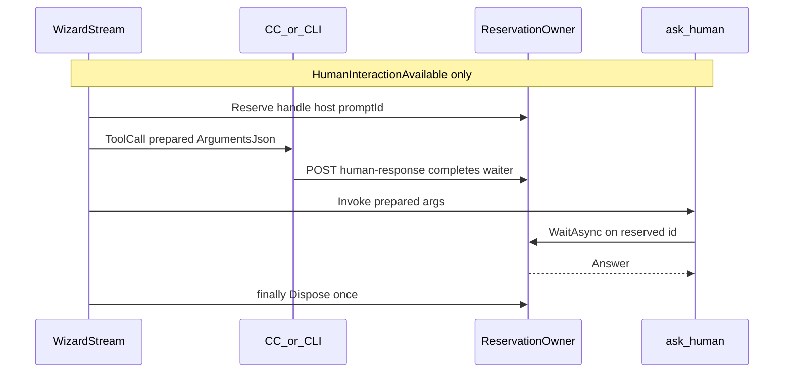

# Petition redesign + HITL, Comm Link, Ward, readiness

**Goal:** Make the three operator-communication tools canonical and correct; fix HITL availability, reservation ownership, typed Comm Link delivery, petition CallId correlation, Command Center modal expiry, elicitation live-event seam, InterveneAsync fail-fast, and serve Listening after explicit startup readiness — without changing streaming TolerateToolFailures.

**Architecture:** Host-owned `IHumanPromptReservation` (reserve → emit → await → dispose once). `ask_human` only when `HumanInteractionAvailable`. Typed `CommLinkDeliveryResult` distinguishes delivered vs suppressed. Petition stays async; Apprentice correlates ToolCall→ToolResult by CallId. Command Center HITL modal correlates by CallId + promptId and closes on timeout/terminal frames.

**Tech stack:** .NET internal MCP, `IHumanPromptRegistry` / reservation handles, streaming `WizardIntelligenceProvider` / `ToolExecutionPipeline` live-event channels, Terminal.Gui Command Center, `ICommLinkDispatcher`.

**Global constraints:**
- No EF migrations / no new webhook configuration.
- No Telegram/WhatsApp/Slack/Discord dispatchers; inbound replies out of scope.
- Streaming always tolerates unexpected tool failures; do not change that.
- Do not replace `/api/apprentices/{id}/intervene`.
- No git commits unless the human asks.
- Schema property for human correlation remains existing [`promptId`](src/RetroDownfall.Arcanum.Infrastructure/Mcp/Protocol/McpWireDtos.cs) (`AskHumanParams`) — do not invent a second spelling.

---

## Locked decisions (corrections)

### 1. `ask_human` availability — live response channel required

`UnattendedMode == false` alone is **not** enough. Buffered attended turns cannot surface a prompt before the model call completes → deadlock until timeout.

| Turn type | `ask_human` |
|-----------|-------------|
| Streaming + attended | Advertised and usable |
| Streaming + unattended | Removed |
| Buffered (even if attended) | Removed |
| OpenAI `/v1` unattended | Removed |
| Apprentice / daemon / background | Removed |

Internal capability (do not infer solely from `UnattendedMode`):

```text
HumanInteractionAvailable =
    isStreaming
    && !request.UnattendedMode
    && liveHumanPromptEmitter != null
```

**Sequencing (CHAT-LOOP §5 — shared context assembly):** Context assembly including tool-set construction is shared between buffered and streaming; paths diverge only at the model call. Filtering therefore cannot wait until after the model call.

Locked order:

1. Entry point (`ExecutePromptAsync` vs `StreamPromptAsync`) establishes `isStreaming`.
2. Streaming path creates the **per-turn** live human-prompt emitter **before** context assembly.
3. Compute `HumanInteractionAvailable` and thread it into `BuildToolSetWithMcpAsync` (or the post-merge filter).
4. Strip `ask_human` from the advertised inference set when false.

**`tools/list` is not turn-aware:** `ArcanumInternalToolServer` advertises `ask_human` via a fixed catalog. Do **not** try to hide it conditionally in the internal server’s `tools/list`. Removal happens only in Wizard toolset assembly / post-merge filter when `HumanInteractionAvailable` is false.

External MCP elicitation follows the same capability:
- streaming attended + live HITL emitter → reserve, emit, wait;
- buffered or unattended → **decline immediately** with a clear expected result;
- **never** register an invisible waiter.

### 2. Waiter ownership — reservation handle

Lifecycle:

- Wizard / preparation layer owns reservation and **final removal**.
- `TrySubmitResponse` only completes the waiter; it does **not** release capacity.
- Internal `ask_human` tool only awaits an already-reserved waiter.
- Owner removes/releases **exactly once** in `finally` (via `IAsyncDisposable`).
- Timeout/cancellation must not independently release the same capacity slot.

Prefer:

```csharp
internal interface IHumanPromptReservation : IAsyncDisposable
{
    string PromptId { get; }

    Task<string> WaitAsync(
        TimeSpan timeout,
        CancellationToken cancellationToken);
}
```

Registry may still expose lookup-based waiting for the internal MCP tool, but reservation ownership stays unambiguous.

Admission: atomic `SemaphoreSlim.Wait(0)` (or equivalent), then `TryAdd`; **release immediately** if insertion fails.

### 3. Prepared arguments everywhere

When the host replaces a model-supplied `promptId`, the **normalized** call must be used for:

- streamed `ToolCall.ArgumentsJson`;
- actual tool invocation;
- Grimoire tool-interaction persistence;
- audit argument capture;
- assistant `FunctionCallContent` appended to the next model round.

Do **not** rewrite only the client event while invoking original arguments. Preserve the original provider **CallId**; only human `promptId` is host-owned. Use existing schema naming (`promptId`).

### 4. Alias scoped to Arcanum’s internal tool

Do **not** globally rewrite every tool named `use_commlink` (external MCP servers may expose that name).

Compatibility:

```text
if requested name == use_commlink
and canonical internal send_commlink_alert exists
and no explicitly advertised tool named use_commlink exists
then invoke canonical internal tool
```

Canonicalize metrics/audit **only** when that mapping actually occurred.

Artifact Attunement:
- `declaredTools: ["use_commlink"]` permits the **internal** canonical tool;
- `declaredTools: ["send_commlink_alert"]` permits it directly;
- neither broadens access to unrelated external MCP tools.

Persisted transcript protocol data may keep the originally requested alias where needed; operational metrics use the canonical name when mapped.

### 5. Typed Comm Link delivery status

Current `ICommLinkDispatcher.DispatchAsync` → `Result` cannot honestly distinguish delivered vs suppressed (missing webhook may return success today).

Introduce Core types:

```csharp
public enum CommLinkDeliveryStatus
{
    Delivered,
    Suppressed
}

public readonly record struct CommLinkDeliveryResult(
    CommLinkDeliveryStatus Status);
```

Contract:

```csharp
Task<Result<CommLinkDeliveryResult>> DispatchAsync(
    CommLinkMessage message,
    CancellationToken cancellationToken);
```

Mapping:
- configured webhook + HTTP success → `Delivered`;
- no destination / intentional policy skip → `Suppressed` (success Result);
- attempted transport / non-success HTTP → **failed** `Result`;
- tools map failed Result → public `notificationStatus: "failed"`.

**Tool-level `IsError` (locked):**

| Tool | Outcome | `IsError` |
|------|---------|-----------|
| `send_commlink_alert` | `delivered` | `false` |
| `send_commlink_alert` | `suppressed` | `false` |
| `send_commlink_alert` | `failed` | `true` |
| `petition_dungeon_master` | any `notificationStatus` | **never** set for delivery — escalation is the outcome; delivery is informational |

This lets the model distinguish “notifications aren’t configured” (`suppressed`) from “delivery was attempted and failed” (`failed` + `IsError: true`).

`CommLinkMultiplexer` aggregation:
- any successful delivery → `Delivered`;
- no dispatcher attempts delivery → `Suppressed`;
- attempts occur, none deliver, at least one fails → failure;
- partial delivery + another failure → `Delivered`, log the failure.

**Exhaustive `ICommLinkDispatcher` production callers to update (P0):**

| Site | Path |
|------|------|
| Interface + webhook impl | `Core/CommLink/ICommLinkDispatcher.cs`, `WebhookCommLinkDispatcher.cs` |
| Multiplexer | `CommLinkMultiplexer.cs` |
| Internal MCP alert + petition | `ArcanumInternalToolServer.CommunicationTools.cs` |
| Apprentice escalation fallback | `ApprenticeService.cs` (`DispatchEscalationAlertAsync`) |
| Budget alerts | `BudgetMonitor.cs` |
| HTTP send API | `DaemonEndpoints.cs` → `POST /api/commlink/send` |

**Not direct dispatcher callers (still verify):** CLI `arcanum daemon alert` / `DaemonCommands` → HTTP `SendCommLinkAlertAsync` (updates via endpoint, not interface). Ward paths do not call `ICommLinkDispatcher` today. Test fakes: `FakeCommLinkDispatcher`, `WebhookCommLinkDispatcherTests`. Compile sweep after signature change must leave no old `Task<Result>` overloads.

### 6. Petition — wait for tool outcome by CallId

Apprentice must **not** treat ToolCall as delivered and must **not** exit the stream on petition ToolCall (tool would never run).

Consumer:
1. On petition ToolCall → record **pending** petition keyed by `CallId`; continue pumping stream.
2. On matching ToolResult → parse `notificationStatus`; only `"delivered"` ⇒ already alerted.
3. `suppressed` / `failed` / malformed / missing result / stream Error / ToolError ⇒ not alerted.
4. Escalate in every case; fallback Comm Link only when no successful delivery confirmed.
5. Fail closed: malformed ⇒ `alreadyAlerted = false`.

### 7. HITL timeout must survive MCP bridge

[`McpBridgeTool`](src/RetroDownfall.Arcanum.Infrastructure/Mcp/McpBridgeTool.cs) throws on `IsError == true`, and the tolerant pipeline can replace that with a generic internal-tool-failure message.

Desired public outcome (locked):

```text
ToolError / failed invocation:
"No operator response was received before the human prompt timed out."
```

Must remain: tool-level failure; visible to model; visible in Incantations; **not** `Hub.Error`; **not** replaced by generic exception text.

If needed: dedicated expected exception/result type that `ToolExecutionPipeline` recognizes and sanitizes to the fixed timeout text. Do not expose arbitrary third-party MCP error text.

### 8. Command Center modal closes on server expiry

Close when any of:
- accepted submit;
- turn cancel;
- matching ToolResult reports timeout;
- matching ToolError;
- terminal inference Error or Result;
- stream ends unexpectedly.

Submit behavior:
- disable duplicate submit while HTTP in flight;
- accepted → close;
- `HumanPromptNotFound` → mark expired, close with visible notice;
- transient HTTP failure while waiter still active → show error, allow retry;
- turn cancellation → close and clear.

Correlate overlay by **both** tool `CallId` and human `promptId`.

### 9. Elicitation live-event seam — singleton handler + AsyncLocal turn emitter

DESIGN §4.2: a single `ElicitationHandler` is wired once into shared `McpClientOptions` across every transport. That registration **stays singleton**. “No singleton/global mutable callback” means: do **not** store the turn’s emit channel in a process-global mutable field, and do **not** rewrite shared handler registration to be per-turn.

**Locked reconciliation:**

- Handler registration remains the existing singleton `HandleElicitationAsync`.
- Per-turn emitter is stored in `AsyncLocal<IHumanPromptLiveEmitter?>` (or equivalent ambient) scoped to the executing inference/tool invocation.
- When `HumanInteractionAvailable`, the streaming turn **sets** the AsyncLocal before tool rounds; clears it in `finally`.
- Singleton handler **reads** AsyncLocal: non-null → reserve, emit on that turn’s channel, wait; **null** (buffered / unattended / no ambient turn) → decline immediately with a clear expected result; never register an invisible waiter.
- Concurrent stream pump of the per-turn channel mirrors `liveWardEmit` (start tool task → pump while blocked → await).

**Spike before relying on AsyncLocal:** Confirm an elicitation raised by an MCP server during a tool round runs on the **same** async/`ExecutionContext` as the turn. If the MCP SDK marshals the callback onto a different context, AsyncLocal will not flow — detect that in a spike and fall back to an explicit ambient the SDK preserves (or document the failure mode) before shipping.

Other requirements unchanged:
- emit only **after** reservation succeeds;
- preserve MCP elicitation response schema conversion;
- free-text compatible shape only; **reject unsupported structured schemas clearly**; never wait on a UI that cannot produce the requested shape.

### 10. InterveneAsync — no persist on 409

Fail-fast when no execution slot (documented contract):

1. Validate request.
2. Acquire execution slot.
3. If unavailable → return `Apprentice.MaxReached` with **no state mutation**.
4. Persist guidance and transition state.
5. Publish `ApprenticeIntervened`.
6. Start/resume execution.
7. Release slot if persistence/startup fails.

Persisting guidance while returning 409 is out of scope for this pass (would require accepted/queued semantics).

### 11. Listening via explicit host startup

Prefer:

```text
await app.StartAsync(ct)
await readiness.WaitUntilReadyAsync(ct)
print Listening unless auto-launched
await app.WaitForShutdownAsync(ct)
```

**Where `MarkReady` runs today (confirmed):** [`GrimoireDatabaseHostedService`](src/RetroDownfall.Arcanum.Infrastructure/Hosting/GrimoireDatabaseHostedService.cs) implements `IHostedService`; its `StartAsync` calls `GrimoireDatabaseBootstrapper.EnsureInitializedAsync`, which calls `MarkReady()` at the end of a successful bootstrap. So under normal success, `app.StartAsync` already waits for MarkReady and `WaitUntilReadyAsync` is a near-immediate safety net.

**Still required:** Add `WaitUntilReadyAsync(CancellationToken)` returning `Task` only — do **not** overbuild an event bus. It must have a real completion signal and **must not hang forever** if bootstrap fails:
- if `EnsureInitializedAsync` / `StartAsync` throws → serve exits without Listening (caller never reaches the wait, or wait is cancelled);
- if bootstrap can fail without throwing and without `MarkReady`, `WaitUntilReadyAsync` must complete **faulted** or **cancelled** so serve does not block indefinitely without printing Listening or exiting.

Preserve: auto-launch suppression; first-run key suppression; no Listening when startup/readiness fails; `finally` cleanup + `Log.CloseAndFlush()`.

### 12. “Three advertised tools” is contextual

Arcanum’s **canonical communication-tool catalog** contains three tools. When policy permits, attended streaming turns advertise all three; buffered/unattended omit `ask_human`; Artifact Attunement may further restrict.

Do **not** test that every model always sees all three. Test contextually:
- attended streaming, no attunement → all three canonical names;
- unattended → petition + alert, no `ask_human`;
- buffered → no `ask_human`;
- alias never advertised;
- attunement behaves correctly.

### Smaller locks

**Webhook wire shape** (document accurately; treat URL as secret):

```json
{
  "title": "...",
  "body": "...",
  "severity": "Warning",
  "source": "Arcanum",
  "timestampUtc": "..."
}
```

Logs: omit full webhook URL or log sanitized host only; no query/path tokens in public errors or routine logs.

**Petition outside Apprentice:** tool may still request escalation / alert; only `ApprenticeService` transitions an Apprentice to Escalated; ordinary interactive chat has no orchestration pause. Document as intended for autonomous Apprentice work; `ask_human` remains the interactive choice.

**Ward replacement:** complete old TCS **before** mutating overlay state; resolution idempotent so Esc/timeout/API cannot double-complete.

---

## Current defects (verified)

| Area | Evidence |
|------|----------|
| Canonical name | Internal server advertises `use_commlink`; no `send_commlink_alert` |
| Parse mismatch | `FormatToolCallEventData` → `name: {json}`; CLI parser expects raw JSON |
| Waiter race | ToolCall yielded before `WaitForResponseAsync` registers |
| Availability | Unattended filter only; buffered attended still exposes `ask_human` |
| Comm Link Result | `DispatchAsync` → `Result` cannot distinguish delivered vs suppressed |
| CC HITL | No HumanPrompt overlay; no expiry-on-ToolError path |
| Petition alert | `alreadyAlerted = true` on ToolCall |
| Intervene | Publish / mutate before slot; capacity failure still persists |
| Elicitation | Waits with no stream frame; would be invisible |
| Bridge timeout | `McpBridgeTool` throws on `IsError` → generic tolerate message risk |
| Ward | Pending TCS overwrite; overlays steal without deny |
| Listening | Printed before `RunAsync` / readiness |
| Waiter cap | Non-atomic count-then-TryAdd |



---

## Implementation units (corrected order)

### P0. Typed Comm Link delivery status

**Files:** Core delivery types + [`ICommLinkDispatcher.cs`](src/RetroDownfall.Arcanum.Core/CommLink/ICommLinkDispatcher.cs), [`WebhookCommLinkDispatcher.cs`](src/RetroDownfall.Arcanum.Infrastructure/CommLink/WebhookCommLinkDispatcher.cs), [`CommLinkMultiplexer.cs`](src/RetroDownfall.Arcanum.Infrastructure/CommLink/CommLinkMultiplexer.cs), exhaustive callers listed in locked decision §5, test fakes.

**Approach:** `Task<Result<CommLinkDeliveryResult>>`; mapping + multiplexer aggregation; sanitize URL logging. When implementing alert/petition tools (P1/P7), apply locked `IsError` table (`send_commlink_alert` failed→true; petition delivery never drives `IsError`).

---

### P1. Canonical tool names + scoped alias

**Files:** [`ArcanumInternalToolServer*.cs`](src/RetroDownfall.Arcanum.Infrastructure/Mcp/), [`ArtifactAttunement.cs`](src/RetroDownfall.Arcanum.Infrastructure/Intelligence/ArtifactAttunement.cs), tool-call resolution / metrics in pipeline, Unseen Servant prompts.

**Approach:** Fixed `tools/list` catalog always includes the three canonical names (including `ask_human`). Hidden `use_commlink` call alias only under the scoped rule. Attunement alias only for internal canonical tool. Metrics canonicalize only when mapping fired. **Per-turn omission of `ask_human` is P4’s Wizard filter — not tools/list.**

**Tests (contextual):** Wizard-assembled sets — streaming attended → three names; unattended/buffered → no ask_human; alias never listed in tools/list; external tool named `use_commlink` not rewritten.

---

### P2. Atomic human-prompt reservation ownership

**Files:** [`IHumanPromptRegistry.cs`](src/RetroDownfall.Arcanum.Core/Intelligence/IHumanPromptRegistry.cs), [`HumanPromptRegistry.cs`](src/RetroDownfall.Arcanum.Api/Intelligence/HumanPromptRegistry.cs), [`HumanPromptExceptions.cs`](src/RetroDownfall.Arcanum.Core/Intelligence/HumanPromptExceptions.cs).

**Approach:** `IHumanPromptReservation` + atomic semaphore admission; submit completes only; owner `DisposeAsync` releases once; timeout text locked; cancel vs timeout classification.

---

### P3. Prepared-call normalization

**Files:** [`WizardIntelligenceProvider.cs`](src/RetroDownfall.Arcanum.Api/Intelligence/WizardIntelligenceProvider.cs), [`ToolExecutionPipeline.cs`](src/RetroDownfall.Arcanum.Api/Intelligence/ToolExecutionPipeline.cs).

**Approach:** After host `promptId` rewrite, one prepared args snapshot feeds event, invoke, Grimoire, audit, next-round FCC. Preserve provider CallId.

---

### P4. Remove `ask_human` without live HITL

**Files:** [`WizardIntelligenceProvider.cs`](src/RetroDownfall.Arcanum.Api/Intelligence/WizardIntelligenceProvider.cs) tool-set builders / post-merge filters; OpenAI `/v1` path; Apprentice/daemon tool policy.

**Approach:** Entry point sets `isStreaming`; streaming creates live emitter **before** shared context assembly; compute `HumanInteractionAvailable` and pass into `BuildToolSetWithMcpAsync` / post-merge filter; strip `ask_human` when false. Do **not** make `ArcanumInternalToolServer.tools/list` turn-aware.

---

### P5. CLI parser fix

**Files:** [`AskHumanToolCallStreamHandler.cs`](src/RetroDownfall.Arcanum.Cli/Services/AskHumanToolCallStreamHandler.cs) + tests.

**Approach:** Prefer `ArgumentsJson`; fall back to raw / `tool_name: JSON`; malformed → sanitized UI error.

---

### P6. Attended streaming HITL (CLI + Command Center)

**Files:** Command Center overlay/coordinator/host/chat runner; shared submit helper; Ask/Chat commands.

**Approach:** Hard modal; CallId + promptId correlation; keys unchanged; close on submit/cancel/**timeout ToolResult/ToolError/terminal/stream end**; submit in-flight guard + NotFound expiry + retry on transient HTTP; do not route petition/alert through ask_human handler. HITL timeout path verified through bridge (P7 concern integrated here / pipeline).

**Timeout survival:** Dedicated expected failure type or pipeline recognition so public text is exactly the locked timeout string (tool-level, Incantations-visible, not Hub.Error, not generic tolerate message).

---

### P7. Petition structured result + Apprentice CallId correlation

**Files:** Communication tools, MCP JSON context DTO, [`ApprenticeService.cs`](src/RetroDownfall.Arcanum.Infrastructure/Hosting/ApprenticeService.cs).

**Approach:** Immediate structured `{ escalationRequested, notificationStatus }` using typed Comm Link result. `notificationStatus` is informational — petition **never** sets `IsError` for delivery outcomes. Pending-by-CallId; continue stream; parse ToolResult fail-closed; escalate always; fallback only if not delivered. Document non-Apprentice petition honesty. A2A INPUT_REQUIRED unchanged. No human-prompt waiter.

---

### P8. InterveneAsync ordering

**Files:** [`ApprenticeService.InterveneAsync`](src/RetroDownfall.Arcanum.Infrastructure/Hosting/ApprenticeService.cs) + reliability tests.

**Approach:** Slot first; MaxReached → no mutation; then persist → publish → resume; release slot if startup fails.

---

### P9. MCP elicitation — singleton handler + AsyncLocal

**Files:** [`McpConnectionManager.TransportFactory.cs`](src/RetroDownfall.Arcanum.Infrastructure/Mcp/ConnectionManager/McpConnectionManager.TransportFactory.cs) (keep singleton `ElicitationHandler` registration), Wizard/pipeline AsyncLocal ambient + per-turn live channel (mirror `liveWardEmit` concurrent pump).

**Approach:**
1. Spike: confirm elicitation callback shares turn `ExecutionContext` / AsyncLocal flows; if not, choose an ambient the SDK preserves before coding the happy path.
2. Turn sets `AsyncLocal<IHumanPromptLiveEmitter?>` when `HumanInteractionAvailable`; clear in `finally`.
3. Singleton handler reads ambient: null → decline; else reserve → emit → wait.
4. Reject unsupported structured schemas; preserve text-compatible accept shape; shared timeout text; never invisible waiter.

---

### P10. Ward + serve readiness

**Ward:** `TryResolvePendingWardAsDenied()` before Help/Palette/SessionPicker/Quit/replacement; complete old TCS before overlay mutation; idempotent completion; new Ward denies previous first.

**Serve:** `StartAsync` → `WaitUntilReadyAsync(ct)` → Listening (unless auto-launched) → `WaitForShutdownAsync`. Readiness API is `Task WaitUntilReadyAsync(CancellationToken)` only. Today `MarkReady` runs inside `GrimoireDatabaseHostedService.StartAsync` after successful bootstrap — wait is a safety net on success and must **fault/cancel** (not hang) if bootstrap fails without marking ready. No banner on failure; preserve auto-launch / first-run key suppression.

---

### P11. Verify ToolLoop + docs + verification

**U15:** Inspect streaming MaxToolInferenceRounds → one terminal Error, `ErrorCodes.Hub.ToolLoop` contract, no Result; fix only verified mismatch; no second counter.

**U16:** Leave streaming `suppressInvocationFailures: true` and docs stating TolerateToolFailures is buffered-only.

**Docs:** DESIGN / CHAT-LOOP / README — three-tool catalog vs policy filtering; HITL keys; webhook shape + URL secrecy; petition vs ask_human vs alert; Comm Link one-way.

Write durable plan copy to `docs/superpowers/plans/2026-07-20-petition-hitl-commlink.md` at implementation start.

---

## Corrected implementation order

1. Typed Comm Link delivery status + exhaustive dispatcher caller sweep.
2. Canonical tool names + narrowly scoped alias / attunement (fixed tools/list).
3. Atomic human-prompt reservation ownership.
4. Prepared-call normalization across event/invocation/persistence/audit/next round.
5. `HumanInteractionAvailable` sequencing + Wizard filter strip of `ask_human` (not tools/list).
6. Fix CLI parser.
7. Attended streaming HITL in CLI and Command Center (incl. modal expiry + bridge timeout survival).
8. Petition structured result (`IsError` never for delivery) + Apprentice CallId correlation.
9. Fix InterveneAsync ordering (no mutation on 409).
10. MCP elicitation: AsyncLocal spike, then singleton handler + live channel.
11. Ward overlay lifecycle.
12. Serve `StartAsync` / `WaitUntilReadyAsync` / Listening (fault on bootstrap fail).
13. Verify streaming Hub.ToolLoop; leave streaming failure tolerance unchanged.
14. Docs + focused / AOT verification.

---

## Definition of done

- Canonical catalog is three tools in fixed `tools/list`; **Wizard-assembled** advertisement matches policy (streaming attended vs buffered/unattended/attunement).
- Legacy `use_commlink` call alias works only under scoped internal mapping; never advertised; external same-named tools untouched.
- `ask_human` only when `HumanInteractionAvailable` (computed before shared toolset build); no invisible waiters; no buffered deadlock.
- Reservation owner releases capacity exactly once; submit does not release.
- Prepared args used for event, invoke, Grimoire, audit, next-round FCC; CallId preserved.
- Typed Comm Link delivery distinguishes delivered/suppressed/failed for all listed callers; `send_commlink_alert` IsError mapping locked; petition delivery never sets IsError.
- Interactive `ask_human` end-to-end without waiter race; CC answers via HTTP; modal closes on server timeout/terminal.
- HITL timeout text survives MCP bridge into ToolError/Incantations; not Hub.Error; not generic tolerate text.
- Petition never blocks on HumanPromptRegistry; Apprentice correlates CallId→ToolResult; escalates; A2A INPUT_REQUIRED; fallback only when not delivered.
- InterveneAsync: slot before mutation; MaxReached = no state change.
- Elicitation: singleton handler + AsyncLocal emitter (spike-verified); declines when ambient null; schema rejection when unsupported.
- Ward overlays cannot abandon unresolved approvals; TCS completion idempotent.
- Listening only after `StartAsync` + readiness wait that cannot hang on bootstrap failure; auto-launch still suppresses.
- Streaming TolerateToolFailures behavior unchanged.
- Focused tests and docs green.
