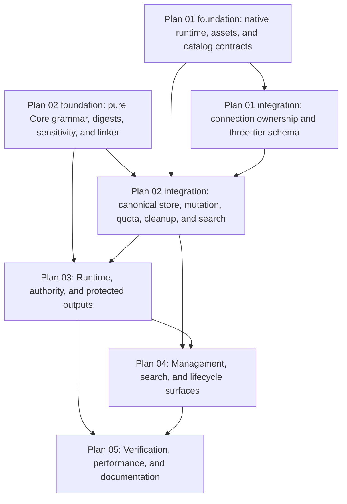

# Covenant Implementation Plan

> **For agentic workers:** REQUIRED SUB-SKILL: Use superpowers:subagent-driven-development (recommended) or superpowers:executing-plans to implement this plan task-by-task. Steps use checkbox (`- [ ]`) syntax for tracking.

**Goal:** Implement GitHub issue #74, The Covenant, as the authority-safe, context-efficient durable memory substrate approved in the design specification.

**Architecture:** Build the feature as three database tiers and one authority-preserving runtime pipeline. Core owns canonical protocol and deterministic policy, Infrastructure owns SQLCipher persistence and FTS5, API owns authenticated turn orchestration and management surfaces, and CLI and Compendium remain typed HTTP clients. Every vertical slice starts with a focused failing test and merges only after its fault-domain and integration gates pass.

**Tech Stack:** .NET 10, C# 14, Native AOT, Microsoft.Extensions.AI, Model Context Protocol, EF Core only for existing core entities, raw Microsoft.Data.Sqlite commands for Covenant hot paths, SQLCipher 4.17 with SQLite FTS5, Microsoft.ML.Tokenizers, ASP.NET Core minimal APIs, System.CommandLine, Avalonia, xUnit.

## Global Constraints

- The approved source of truth is [`2026-08-13-covenant-design.md`](../specs/2026-08-13-covenant-design.md). If a plan step and the specification differ, stop that slice and resolve the plan before changing production code.
- Observe the expected failing test before each production change. Record the focused command and failure reason in the task notes or commit message draft.
- Preserve `Cli -> Api -> Infrastructure -> Core`. Core cannot reference provider, EF, SQLite, ASP.NET, or CLI types.
- Use source-generated JSON everywhere. Add every wire type to its owning context before an endpoint or command can compile.
- Keep the disabled, stateless path free of Covenant store access and allocations beyond the feature gate. An untainted Session may use its existing core query to retrieve the sensitivity summary. A tainted Session intentionally takes the protected path.
- Keep productive provider and tool loops unbounded by arbitrary turn counters. Persist and retain O(1) rolling evidence plus bounded diagnostic tails.
- All content-bearing Covenant reads, tainted-history reads, mutations, provider dispatches, MCP uses, accelerator work, reset, restore, and deletion hold the required generation-bound operation lease.
- Never use reflection-based serialization, dynamic schema discovery, numbered EF migrations, ambient authority, or SQL string interpolation.
- Keep one immutable provider-neutral call envelope. Hash, tokenize, attribute, and dispatch from that same frozen representation.
- Treat FTS5 as a derived inspection accelerator. Canonical prompt authority never depends on accelerator health or rank.
- Preserve exact absent-Covenant prompt bytes, cache descriptors, generic-search behavior, and productive-loop behavior.
- Do not commit intermediate red states. One final branch commit is permitted only after all required verification is green.

## Plan Set and Dependency Graph



The Plan 01 and Plan 02 foundation nodes are intentionally parallel. Plan 02 Tasks 1 through 6 contain pure Core work and do not wait for Plan 01 schema delivery. Plan 02 persistence tasks begin only after the native/catalog and connection/schema prerequisites they consume are green. Plan 03 may begin its pure authority contracts after the Plan 02 Core foundation, while every database-backed runtime slice waits for Plan 02 persistence integration.

The coordinated plans are:

- [`2026-08-14-covenant-native-and-schema.md`](2026-08-14-covenant-native-and-schema.md), hermetic SQLCipher, tiered schema installation, connection initialization, core support objects, and FTS primitives.
- [`2026-08-14-covenant-domain-and-persistence.md`](2026-08-14-covenant-domain-and-persistence.md), pure Core compiler/linker/digest protocol, canonical raw-SQL store, mutation kernel, receipts, quotas, owner cleanup, FTS query and fallback, and the base accelerator rebuild algorithm.
- [`2026-08-14-covenant-runtime-and-authority.md`](2026-08-14-covenant-runtime-and-authority.md), invocation authority, Campaign binding, prompt and token attribution, turn claims, frozen provider envelopes, MCP capabilities, publication, and derived-output sensitivity.
- [`2026-08-14-covenant-surfaces-and-lifecycle.md`](2026-08-14-covenant-surfaces-and-lifecycle.md), authentication, HTTP, CLI, Compendium, diagnostics, cursor and search API integration, rebuild LRO adaptation and recovery, path administration, backup, restore, retention, and erasure.
- [`2026-08-14-covenant-verification-and-docs.md`](2026-08-14-covenant-verification-and-docs.md), Native AOT matrices, performance gates, architecture inventories, full-suite verification, documentation, GitHub closure, and branch integration.

## Execution Waves

### Wave 0: Isolation and baseline

- [ ] Create an isolated `codex/issue-74-covenant` worktree after user consent, without touching the current untracked specification.
- [ ] Copy the approved specification and coordinated plans into that worktree, then prove `git diff --check` is clean.
- [ ] Record `dotnet --info`, native toolchain versions, `git rev-parse HEAD`, and the five shipping RIDs in the implementation log.
- [ ] Run the existing non-performance suites before production changes. Expected result: the known baseline remains green.
- [ ] Create a task checklist from every checkbox in the five coordinated plans and permit only one implementation owner per production file at a time.

### Wave 1: Independent foundations

- [ ] Execute native acquisition, asset delivery, compile-option, load-extension, and runtime smoke slices from Plan 01.
- [ ] In parallel, execute pure Core grammar, compiler, canonical encoder, digest vectors, sensitivity lattice, and linker slices from Plan 02.
- [ ] Review each foundation twice: first for specification fidelity, then for code quality, Native AOT safety, and allocation behavior.
- [ ] Run the focused native and Core suites together before opening schema or runtime integration work.

### Wave 2: Schema and canonical authority

- [ ] Complete the three-tier catalog, central connection initializer, core support schema, data initializers, and failure-isolation slices from Plan 01.
- [ ] Complete the canonical Covenant schema, raw-SQL store, mutation kernel, receipts, quotas, owner journal, outbox, FTS query and fallback, and base rebuild algorithm from Plan 02.
- [ ] Run real SQLCipher concurrency, drift, crash, quota, ABA, outbox, and secure-delete tests. Fakes remain limited to OS and network boundaries.
- [ ] Review the combined database boundary for trigger authorization, raw SQL parameters, sensitive logging, lock ordering, and restore safety.

### Wave 3: Runtime authority and information flow

- [ ] Execute the invocation-context and canonical Campaign resolver slices from Plan 03.
- [ ] Execute prompt descriptors, one-pass token attribution, immutable turn plan, per-attempt admission, and frozen provider-call slices.
- [ ] Execute turn-claim, finalization, collector, MCP schema/output/capability and live filtering, Ward, disclosure, and sensitivity propagation slices.
- [ ] Run the buffered, streaming, retry, fallback, compression, cancellation, crash, path-change, Campaign-delete, reset, and feature-disable race suites.
- [ ] Review every provider and turn caller at compile time so new internal paths must select an explicit invocation surface.

### Wave 4: Operator surfaces and lifecycle

- [ ] Execute pre-binding authentication, typed endpoints, source-generated DTOs, cryptographic prepare/apply, cursor, and error mapping slices from Plan 04.
- [ ] Execute CLI, Compendium, diagnostics, and protected-read slices.
- [ ] Integrate Plan 02 search behind authenticated cursors and API DTOs, adapt its base rebuild algorithm to the LRO/recovery surface, then execute path registration, repair, backup, restore, retention, reinitialize, reset, and secure-erasure slices.
- [ ] Run endpoint inventory, AOT serialization, recovery registry, idempotency, no-store, tainted export/search, and lifecycle race suites.
- [ ] Review the complete public authority boundary and all local or external disclosure paths.

### Wave 5: Performance, documentation, and integration

- [ ] Execute Plan 05 benchmark host, workload fingerprints, structural gates, same-machine comparison rules, and shipping-RID smoke binaries.
- [ ] Update every owning architecture, API, CLI, configuration, and orientation document with the implemented contract and measured evidence.
- [ ] Run focused Covenant tests, all ordinary test projects, native verification, benchmark gate, coverage, AOT warning closure, and `git diff --check`.
- [ ] Request independent specification review, code-quality review, security review, and performance review. Resolve every actionable finding with a new red-green slice.
- [ ] Inspect the final diff, generated assets, SBOMs, package locks, and documentation links. Confirm no secret, local path, raw benchmark artifact, or unrelated user change is staged.
- [ ] Commit once on the feature branch after the full gate, require the feature commit's pinned reference-machine and five native-RID checks to complete successfully, and verify local `main` plus `origin/main` still equal the recorded base. Advance local `main` by fast-forward only and push it. If the base moved, rebase without creating a merge commit and rerun the complete gate and required commit CI before advancing `main`.

## Required Final Commands

Run these from the repository root in this order:

```bash
dotnet build RetroDownfall.Arcanum.slnx
dotnet test RetroDownfall.Arcanum.slnx --filter "Category!=Perf"
./scripts/verify-native-sqlcipher.sh --all
./scripts/benchmark-covenant.sh --gate
./scripts/coverage.sh --threshold
./scripts/verify-aot-il-warnings.sh
git diff --check
git status --short --branch
```

Expected result: every command exits zero, tests report no unexpected skip or failure, benchmark and native reports match their pinned schema versions, first-party IL/AOT warnings are zero, and the worktree contains only the approved issue #74 change set.

## Completion Evidence

- Save the focused red and green command history to `artifacts/covenant/issue-74/tdd/commands.ndjson`, native reports to `artifacts/covenant/issue-74/native/<rid>.json`, benchmark raw data and the gate report to `artifacts/covenant/issue-74/benchmark/`, and final suite summaries to `artifacts/covenant/issue-74/verification/`. These paths are repository-local, ignored working evidence and CI-upload inputs, never staged. Commit only their content-free schema/workload fingerprints and outcome summary in `docs/Arcanum.DESIGN.md`.
- Link the final commit to #74 and include `Refs #73, #75, #76, #77, #78` without closing the later implementation issues.
- Verify the appended approved-design marker remains exactly once on GitHub issues #73 through #78.
- Close #74 only after pushed `main` contains the implementation, documentation, native assets, and green verification evidence.
