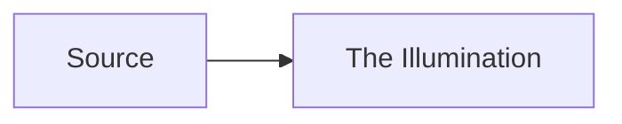

# The Illumination kitchen sink

Representative CommonMark / GFM samples for The Illumination smoke and regression checks.

## Emphasis

**bold**, *italic*, ***both***, ~~strikethrough~~, `inline code`.

## Lists

1. Ordered one
2. Ordered two
   1. Nested ordered
   2. Nested ordered two
- Unordered
  - Nested unordered
  - Nested again

### Task lists

- [ ] Incomplete task
- [x] Complete task

## Table

| Feature | Status |
| --- | --- |
| Headings | yes |
| Tables | yes |

## Fenced code

```csharp
public static int Add(int a, int b) => a + b;
```

## Blockquote and rule

> Quoted wisdom from the scriptorium.

---

## Links and images

[Safe https link](https://example.com/docs)

[mailto](mailto:operator@example.com)

[javascript ignored](javascript:alert(1))

[file ignored](file:///etc/passwd)


## Footnotes

Here is a footnote reference[^note].

[^note]: Footnote body for The Illumination.

## Math

Inline $E=mc^2$ and block:

$$
\int_0^1 x^2 \, dx
$$

## Mermaid (source block only)



## Raw HTML (must never execute)

<div onclick="alert('x')">raw div</div>

<script>alert('xss')</script>


<iframe src="https://example.com"></iframe>
